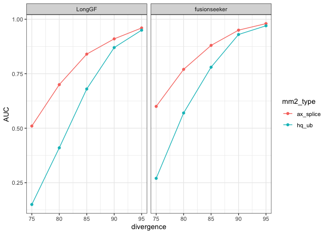
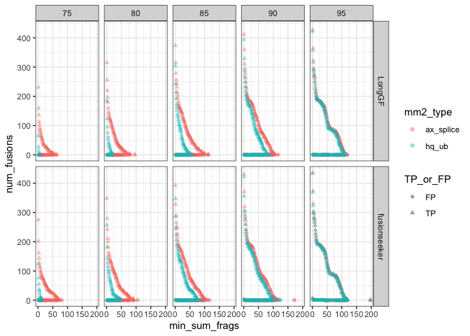
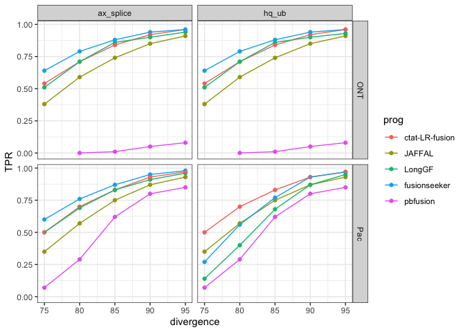
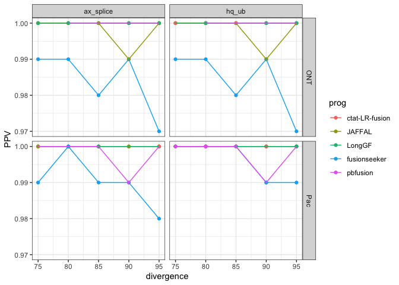
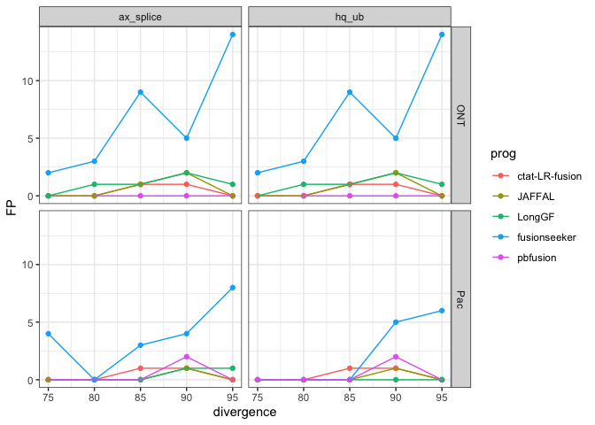

Compare_mm2_splice_params
================
bhaas
2024-08-09

``` r
## only using the allow reverse and allow paralogs data

# ax_splice

ax_splice_ROC_file = "data/ax_splice/allow_rev_and_paralogs.combined_results.ROC.tsv"
ax_splice_ROC = read.table(ax_splice_ROC_file, header=T, sep="\t", stringsAsFactors = F)
ax_splice_ROC$mm2_type = "ax_splice"

ax_splice_PR_AUC_file = "data/ax_splice/allow_rev_and_paralogs.combined_results.PR_AUC.tsv"
ax_splice_PR_AUC = read.table(ax_splice_PR_AUC_file, header=T, sep="\t", stringsAsFactors = F)
ax_splice_PR_AUC$mm2_type = "ax_splice"
```

``` r
# hq_ub
hq_ub_ROC_file = "data/PacBioIsoSeqUb/allow_rev_and_paralogs.combined_results.ROC.tsv"
hq_ub_ROC = read.table(hq_ub_ROC_file, header=T, sep="\t", stringsAsFactors = F)
hq_ub_ROC$mm2_type = "hq_ub"

hq_ub_PR_AUC_file = "data/PacBioIsoSeqUb/allow_rev_and_paralogs.combined_results.PR_AUC.tsv"
hq_ub_PR_AUC = read.table(hq_ub_PR_AUC_file, header=T, sep="\t", stringsAsFactors = F)
hq_ub_PR_AUC$mm2_type = "hq_ub"
```

``` r
# integrate data

ROC_data = bind_rows(ax_splice_ROC,
                     hq_ub_ROC)


PR_AUC_data = bind_rows(ax_splice_PR_AUC,
                        hq_ub_PR_AUC)
```

``` r
# use consistent factor ordering and colors for plots

ordered_progs = c("ctat-LR-fusion", "JAFFAL", "LongGF", "fusionseeker", "pbfusion")

ROC_data$prog = factor(ROC_data$prog, levels = ordered_progs)
PR_AUC_data$prog = factor(PR_AUC_data$prog, levels = ordered_progs)
```

# Examine PR_AUC

``` r
PR_AUC_alt_align_params_all_plot = PR_AUC_data  %>% 
    filter(seqtype == "Pac") %>%
    ggplot(aes(x=divergence, y=AUC)) +
    theme_bw() +
    geom_point(aes(color=prog)) + geom_line(aes(color=prog)) +
    facet_wrap(~mm2_type)

PR_AUC_alt_align_params_all_plot
```

<!-- -->

``` r
# supp fig

ggsave(PR_AUC_alt_align_params_all_plot, filename="PR_AUC_alt_align_params_all_plot.svg", width=7, height=3.5)
```

``` r
PR_AUC_data  %>% 
    filter(seqtype == "Pac") %>%
    mutate(seqtype_mm2type = paste(seqtype, mm2_type)) %>%
    ggplot(aes(x=divergence, y=AUC)) +
    theme_bw() +
    geom_point(aes(color=prog, shape=mm2_type)) + geom_line(aes(color=prog, group=seqtype_mm2type)) +
    facet_wrap(~prog)
```

<!-- -->

``` r
longgf_fseeker_before_after_plot = PR_AUC_data  %>% 
    filter(seqtype == "Pac") %>%
    filter(prog %in% c("fusionseeker", "LongGF")) %>%
    mutate(seqtype_mm2type = paste(seqtype, mm2_type)) %>%
    ggplot(aes(x=divergence, y=AUC)) +
    theme_bw() +
    geom_point(aes(color=mm2_type)) + geom_line(aes(color=mm2_type, group=seqtype_mm2type)) +
    facet_wrap(~prog)


longgf_fseeker_before_after_plot
```

<!-- -->

``` r
ggsave(longgf_fseeker_before_after_plot, filename="longgf_fseeker_before_after_plot.svg", width=7, height=3.5)
```

``` r
align_params_TP_FP_plot = ROC_data %>% filter(seqtype == "Pac") %>%
    filter(prog %in% c("fusionseeker", "LongGF")) %>%
    gather(key='TP_or_FP', value='num_fusions', TP, FP) %>%
    ggplot(aes(x=min_sum_frags, y=num_fusions, shape=TP_or_FP, color=mm2_type)) +
    theme_bw() +
    geom_point(alpha=0.4) +
    facet_grid(vars(prog), vars(divergence) )
  
align_params_TP_FP_plot
```

<!-- -->

``` r
ggsave(align_params_TP_FP_plot, filename="align_params_TP_FP_plot.svg", width=8, height=4.5)
```

``` r
# plot sensitivity vs. divergence rate

ROC_data %>% 
    filter(min_sum_frags == 1) %>%
    ggplot(aes(x=divergence, y=TPR)) + 
    theme_bw() + 
    geom_point(aes(color=prog)) + geom_line(aes(color=prog)) +
    facet_grid(vars(seqtype), vars(mm2_type) )
```

<!-- -->

``` r
# plot PPV vs. divergence rate

ROC_data %>% 
    filter(min_sum_frags == 1) %>%
    ggplot(aes(x=divergence, y=PPV)) + 
    theme_bw() + 
    geom_point(aes(color=prog)) + geom_line(aes(color=prog)) +
    facet_grid(vars(seqtype), vars(mm2_type) )
```

<!-- -->

``` r
ROC_data %>% 
    filter(min_sum_frags == 1) %>%
    ggplot(aes(x=divergence, y=FP)) + 
    theme_bw() + 
    geom_point(aes(color=prog)) + geom_line(aes(color=prog)) +
    facet_grid(vars(seqtype), vars(mm2_type) )
```

<!-- -->

``` r
# few to no FP
```
