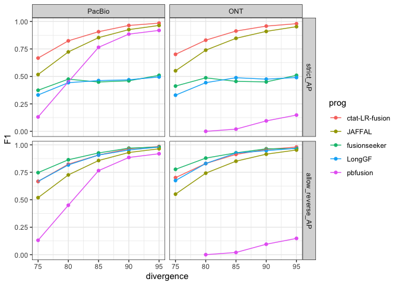

analyze_jaffal_simdata_accuracy
================
bhaas
2024-02-01

Benchmarking analysis for the JAFFAL simulated fusion reads.

Analysis was performed here:
<https://github.com/fusiontranscripts/LR-FusionBenchmarking/tree/master/simulated_data/sim_jaffal>

Results are analyzed below:

``` r
# parse accuracy statistics from benchmarking:

strict_results = read.table("data/strict.combined_results.ROC.tsv", header=T, sep="\t", stringsAsFactors = F)
strict_results$analysisType="strict"

allow_reverse_results = read.table("data/allow_reverse.combined_results.ROC.tsv", header=T, sep="\t", stringsAsFactors = F)
allow_reverse_results$analysisType="allow_reverse"


data = bind_rows(strict_results,
                 allow_reverse_results)


data = data %>% filter(prog %in% c(
                                   'pbfusion',
                                   'fusionseeker',
                                   'LongGF',
                                   'JAFFAL',
                                   'ctat-LR-fusion')
                       )


# extract the maximum F1 value for each program and target data set: 

max_F1_data = data %>% group_by(analysisType, prog, seqtype, divergence) %>% 
    arrange(desc(F1)) %>% filter(row_number() == 1) %>% ungroup()


# rank programs 

ranked_progs = max_F1_data  %>% group_by(prog) %>% summarize(mean_F1 = mean(F1)) %>% arrange(desc(mean_F1))

max_F1_data$prog = factor(max_F1_data$prog, levels=ranked_progs$prog)

max_F1_data$analysisType = factor(max_F1_data$analysisType, levels=c('strict', 'allow_reverse'))

max_F1_data = max_F1_data %>% mutate(seqtype = ifelse(seqtype == "Pac", "PacBio", seqtype))


max_F1_data$seqtype = factor(max_F1_data$seqtype, levels=c("PacBio", "ONT"))
```

``` r
p_linepoint = max_F1_data %>% 
    filter(analysisType %in% c('strict', 'allow_reverse')) %>%
    ggplot() + theme_bw() +
    geom_point(aes(x=divergence, y=F1, color=prog)) +
    geom_line(aes(x=divergence, y=F1, group=prog, color=prog)) +
    facet_grid(vars(analysisType), vars(seqtype))


p_linepoint
```

<!-- -->

``` r
ggsave(p_linepoint, filename="jaffal_simdata_accuracy.paperfig.svg", width=8, height=7)
```

# examine precision/recall

-   restrict to the 95% identity set where all perform best.

``` r
data %>% filter(analysisType == "allow_reverse") %>% 
         filter(divergence == 95) %>%
         filter(TPR > 0.05) %>%
    ggplot(aes(x=TPR, y=PPV)) + geom_point(aes(color=prog)) + 
    geom_line(aes(groups=prog, color=prog)) +
    theme_bw() + 
    facet_wrap(~seqtype)
```

    ## Warning in geom_line(aes(groups = prog, color = prog)): Ignoring unknown
    ## aesthetics: groups

<!-- -->

``` r
data %>% filter(analysisType == "allow_reverse") %>% 
         filter(divergence == 95) %>%
         #filter(TPR > 0.05) %>%
         select(seqtype, prog, min_sum_frags, TP, FP) %>% gather(key='TP_or_FP', value='count', TP, FP) %>%
    ggplot(aes(x=min_sum_frags, y=count)) + geom_point(aes(color=TP_or_FP)) + geom_line(aes(groups=prog, color=TP_or_FP)) +
    #geom_line(aes(groups=prog, color=prog)) +
    theme_bw() + 
    # facet_wrap(~seqtype)
    facet_grid(vars(prog), vars(seqtype))
```

    ## Warning in geom_line(aes(groups = prog, color = TP_or_FP)): Ignoring unknown
    ## aesthetics: groups

<!-- -->

Plot just the TPs

``` r
data %>% filter(analysisType == "allow_reverse") %>% 
         filter(divergence == 95) %>%
         #filter(TPR > 0.05) %>%
         select(seqtype, prog, min_sum_frags, TP, FP) %>% gather(key='TP_or_FP', value='count', TP, FP) %>%
    filter(TP_or_FP == 'TP') %>%
   
    ggplot(aes(x=min_sum_frags, y=count)) + geom_point(color='#00BFC4') + geom_line(aes(groups=prog), color='#00BFC4') +
    #geom_line(aes(groups=prog, color=prog)) +
    theme_bw() + 
    # facet_wrap(~seqtype)
    facet_grid(vars(prog), vars(seqtype)) + 
    xlab("min long read count") +
    ggtitle("Reads at 95% identity, TPs vs. min read count")
```

    ## Warning in geom_line(aes(groups = prog), color = "#00BFC4"): Ignoring unknown
    ## aesthetics: groups

<!-- -->

``` r
data %>% filter(analysisType == "allow_reverse") %>% 
         filter(divergence == 95) %>%
         #filter(TPR > 0.05) %>%
         select(seqtype, prog, min_sum_frags, TP, FP) %>% gather(key='TP_or_FP', value='count', TP, FP) %>%
    filter(TP_or_FP == 'FP') %>%
   
    ggplot(aes(x=min_sum_frags, y=count)) + geom_point(color='#F8766D') + geom_line(aes(groups=prog), color='#F8766D') +
    #geom_line(aes(groups=prog, color=prog)) +
    theme_bw() + 
    # facet_wrap(~seqtype)
    facet_grid(vars(prog), vars(seqtype)) + 
    xlab("min long read count") +
    ggtitle("Reads at 95% identity, FPs vs. min read count")
```

    ## Warning in geom_line(aes(groups = prog), color = "#F8766D"): Ignoring unknown
    ## aesthetics: groups

<!-- -->
