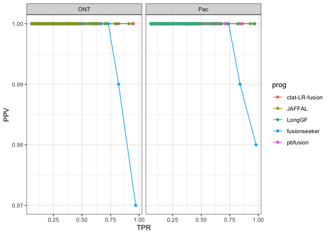

analyze_jaffal_simdata_accuracy
================
bhaas
2023-12-05

``` r
strict_results = read.table("data/strict.combined_results.ROC.tsv", header=T, sep="\t", stringsAsFactors = F)
strict_results$analysisType="strict"

allow_reverse_results = read.table("data/allow_reverse.combined_results.ROC.tsv", header=T, sep="\t", stringsAsFactors = F)
allow_reverse_results$analysisType="allow_reverse"
```

``` r
data = bind_rows(strict_results,
                 allow_reverse_results)
```

``` r
data = data %>% filter(prog %in% c(
                                   'pbfusion_v0.3.1',
                                   'fusionseeker_s1',
                                   'LongGF',
                                   'JAFFAL',
                                   'ctat-LR-fusion.v0.10.0')
                       )
```

``` r
max_F1_data = data %>% group_by(analysisType, prog, seqtype, divergence) %>% 
    arrange(desc(F1)) %>% filter(row_number() == 1) %>% ungroup()


# rank programs 

ranked_progs = max_F1_data  %>% group_by(prog) %>% summarize(mean_F1 = mean(F1)) %>% arrange(desc(mean_F1))

max_F1_data$prog = factor(max_F1_data$prog, levels=ranked_progs$prog)

max_F1_data$analysisType = factor(max_F1_data$analysisType, levels=c('strict', 'allow_reverse'))
```

``` r
p_linepoint = max_F1_data %>% 
    filter(analysisType %in% c('strict', 'allow_reverse')) %>%
    ggplot() + 
    geom_point(aes(x=divergence, y=F1, color=prog)) +
    geom_line(aes(x=divergence, y=F1, group=prog, color=prog)) +
    facet_grid(vars(analysisType), vars(seqtype))


p_linepoint
```

<!-- -->

``` r
ggsave(p_linepoint, filename="jaffal_simdata_accuracy.paperfig.pdf", width=8, height=7)
```
