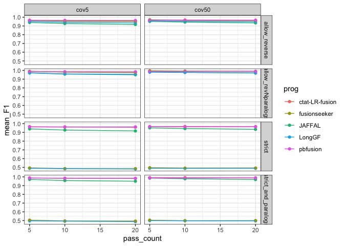
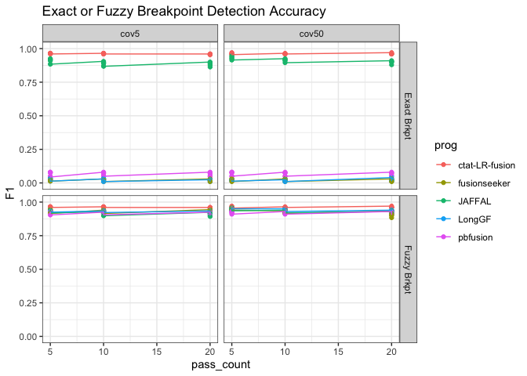
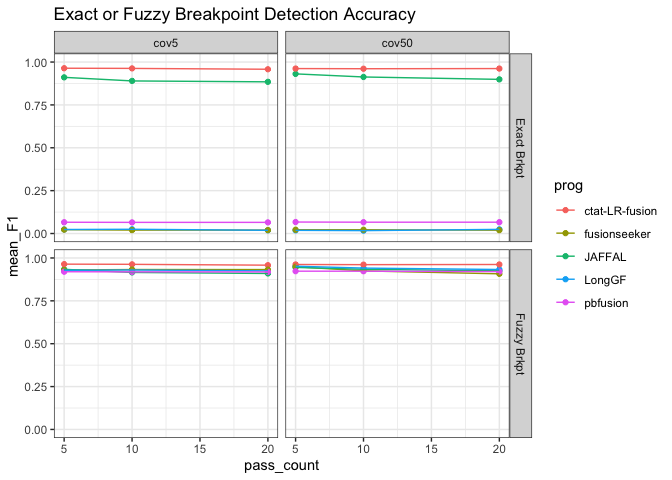
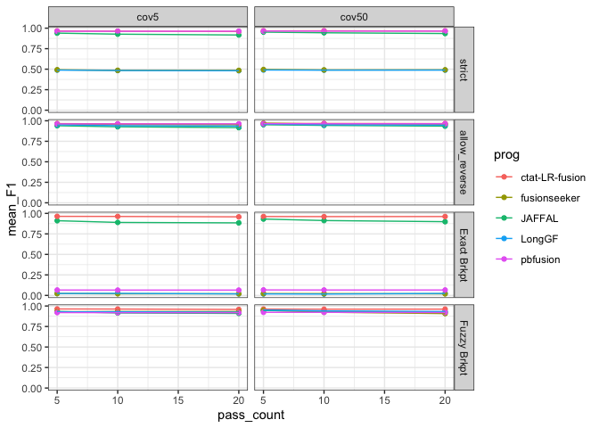
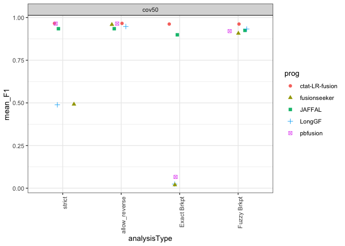

pbsim3_accuracy_analysis
================
bhaas
2024-02-01

# PacBio simulated fusion reads using pbsim3 (attaining HiFi accuracy)

Benchmarking analysis including all predicted fusions from the various
methods are available here:

<https://github.com/fusiontranscripts/LR-FusionBenchmarking/tree/master/simulated_data/pbio_pbsim3_part5>

Analysis of the results are below:

## max F1 comparison for fusion pair accuracy

``` r
max_F1_data = read.table("data/max_F1_summary.tsv", header=T, sep="\t") %>% 
    filter(! grepl("flair", prog)) %>%
 mutate(pass_count = as.numeric(str_replace(pass_count, "pass", ""))) 
```

``` r
# barplot

p_barplot = max_F1_data %>% ggplot(aes(x=factor(pass_count), y=F1)) +
        geom_bar(stat='identity', position='dodge', aes(fill=prog)) +
        facet_grid(vars(analysisType), vars(coverage_level)) + 
    theme(axis.text.x = element_text(angle = 90, hjust = 1)) 

p_barplot
```

<!-- -->

``` r
mean_samples_F1 = max_F1_data %>% 
    group_by(rep_num, coverage_level, pass_count, prog, analysisType) %>%
    summarize(mean_F1 = mean(F1))
```

    ## `summarise()` has grouped output by 'rep_num', 'coverage_level', 'pass_count',
    ## 'prog'. You can override using the `.groups` argument.

``` r
mean_samples_F1 %>%
        filter(analysisType %in% c('strict', 'allow_reverse')) %>%
        ggplot() +
        geom_point(aes(x=pass_count, y=mean_F1, color=prog)) +
        geom_line(aes(x=pass_count, y=mean_F1, group=prog, color=prog)) +
        facet_grid(vars(analysisType), vars(coverage_level))
```

<!-- -->

## max F1 compare for fusion breakpoint accuracy

``` r
breakpoint_data = read.table("data/breakpoint_maxF1_data.tsv", sep="\t", header=T) %>%
    mutate(pass_count = as.numeric(str_replace(pass_count, "pass", ""))) %>%
    filter(prog != 'flairfusion')
    


breakpoint_data$coverage_level = factor(breakpoint_data$coverage_level, levels=c('cov5', 'cov50'))

brkpt_accuracy_plot = breakpoint_data %>% ggplot() +
        geom_point(aes(x=pass_count, y=F1, color=prog)) +
        geom_line(aes(x=pass_count, y=F1, group=prog, color=prog)) +
        facet_grid(vars(analysisType), vars(coverage_level)) +
        ggtitle("Exact or Fuzzy Breakpoint Detection Accuracy") +
        ylim(0,1)


brkpt_accuracy_plot 
```

<!-- -->

``` r
breakpoint_mean_F1_stats = breakpoint_data %>% group_by(coverage_level, pass_count, analysisType, prog) %>% 
    summarize(mean_F1 = mean(F1, na.rm=T))
```

    ## `summarise()` has grouped output by 'coverage_level', 'pass_count',
    ## 'analysisType'. You can override using the `.groups` argument.

``` r
breakpoint_mean_F1_stats %>% ggplot() +
        geom_point(aes(x=pass_count, y=mean_F1, color=prog)) +
        geom_line(aes(x=pass_count, y=mean_F1, group=prog, color=prog)) +
        facet_grid(vars(analysisType), vars(coverage_level)) +
        ggtitle("Exact or Fuzzy Breakpoint Detection Accuracy") +
        ylim(0,1) 
```

<!-- -->

# Combine gene-pair and breakpoint results

``` r
combined_results = bind_rows(mean_samples_F1,
                             breakpoint_mean_F1_stats)

combined_results %>% head()
```

    ## # A tibble: 6 × 6
    ## # Groups:   rep_num, coverage_level, pass_count, prog [2]
    ##   rep_num coverage_level pass_count prog   analysisType       mean_F1
    ##   <chr>   <chr>               <dbl> <chr>  <chr>                <dbl>
    ## 1 rep1    cov5                    5 JAFFAL allow_revNparalogs   0.971
    ## 2 rep1    cov5                    5 JAFFAL allow_reverse        0.958
    ## 3 rep1    cov5                    5 JAFFAL strict               0.958
    ## 4 rep1    cov5                    5 LongGF allow_revNparalogs   0.973
    ## 5 rep1    cov5                    5 LongGF allow_reverse        0.967
    ## 6 rep1    cov5                    5 LongGF strict               0.497

``` r
combined_results %>%
        filter(analysisType != "allow_revNparalogs") %>%
        ggplot() +
        geom_point(aes(x=pass_count, y=mean_F1, color=prog)) +
        geom_line(aes(x=pass_count, y=mean_F1, group=prog, color=prog)) +
        facet_grid(vars(factor(analysisType, levels=c('strict', 'allow_reverse', 'Exact Brkpt', 'Fuzzy Brkpt'))), vars(coverage_level))
```

<!-- -->

``` r
combined_results %>%
        filter(analysisType != "allow_revNparalogs") %>%
        mutate(pass_count = as.numeric(str_replace(pass_count, "pass", ""))) %>%
        filter(pass_count == 20) %>%
        mutate(analysisType = factor(analysisType, 
                            levels=c('strict', 'allow_reverse', 'Exact Brkpt', 'Fuzzy Brkpt') )) %>%
    ggplot() +
    geom_jitter(aes(x=analysisType, y=mean_F1, color=prog, shape=prog), width=0.2, height=0, size=rel(2)) +

    facet_wrap(~coverage_level) +
     theme(axis.text.x = element_text(angle = 90, hjust = 1)) 
```

<!-- -->

``` r
# just cov50

combined_results %>%
        filter(coverage_level == 'cov50') %>%
        filter(analysisType != "allow_revNparalogs") %>%
        mutate(pass_count = as.numeric(str_replace(pass_count, "pass", ""))) %>%
        filter(pass_count == 20) %>%
        mutate(analysisType = factor(analysisType, 
                            levels=c('strict', 'allow_reverse', 'Exact Brkpt', 'Fuzzy Brkpt') )) %>%
    ggplot() +
    geom_jitter(aes(x=analysisType, y=mean_F1, color=prog, shape=prog), width=0.2, height=0, size=rel(2)) +

    facet_wrap(~coverage_level) +
     theme(axis.text.x = element_text(angle = 90, hjust = 1)) 
```

<!-- -->

``` r
write.table(combined_results %>%
        filter(coverage_level == 'cov50') %>%
        filter(analysisType != "allow_revNparalogs") %>%
        mutate(pass_count = as.numeric(str_replace(pass_count, "pass", ""))) %>%
        filter(pass_count == 20) %>%
        mutate(analysisType = factor(analysisType, 
                            levels=c('strict', 'allow_reverse', 'Exact Brkpt', 'Fuzzy Brkpt') )),
    
    file="PacBio_sim.combined_results.tsv", sep="\t", quote=F, row.names=F)
```
