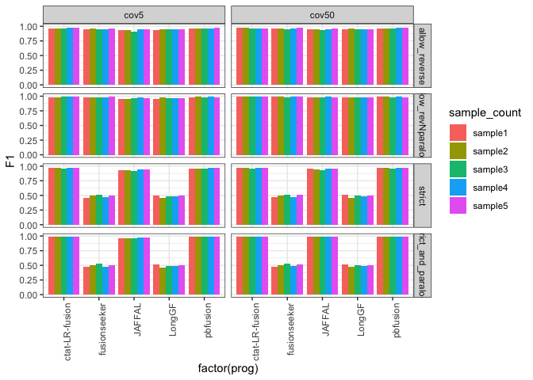
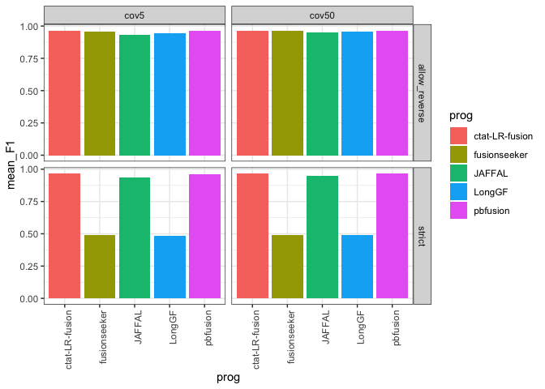
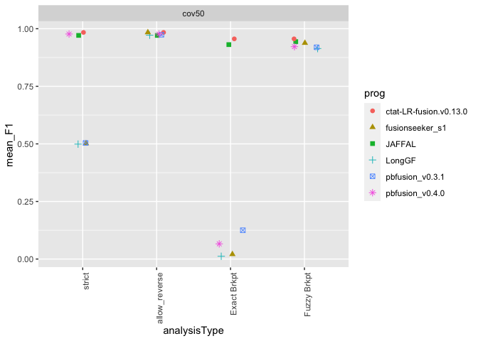

ONT_sim_accuracy_analysis
================
bhaas
2023-12-05

# ONT simulated reads using pbsim3 and R10.4.1 chemistry

Predictions from various methods evaluated on these data and the
benchmarking scripts are available here:

<https://github.com/fusiontranscripts/LR-FusionBenchmarking/tree/master/simulated_data/ONT_pbsim3_part5>

Results are analyzed below:

## fusion pair accuracy

``` r
max_F1_data = read.table("data/max_F1_summary.tsv", header=T, sep="\t") %>% 
    filter(! grepl("flair", prog)) 

max_F1_data %>% head()
```

    ##   coverage_level sample_count                   prog min_sum_frags  TP FP FN
    ## 1          cov50      sample1        fusionseeker_s1             1 498  1  2
    ## 2          cov50      sample2        fusionseeker_s1             1 498  2  2
    ## 3          cov50      sample5        fusionseeker_s1             3 494  2  6
    ## 4          cov50      sample2 ctat-LR-fusion.v0.13.0             4 493  2  7
    ## 5          cov50      sample4        fusionseeker_s1             2 495  2  5
    ## 6          cov50      sample4 ctat-LR-fusion.v0.13.0             6 495  0  5
    ##    TPR PPV    F1       analysisType
    ## 1 1.00   1 1.000 allow_revNparalogs
    ## 2 1.00   1 1.000 allow_revNparalogs
    ## 3 0.99   1 0.995 allow_revNparalogs
    ## 4 0.99   1 0.995 allow_revNparalogs
    ## 5 0.99   1 0.995 allow_revNparalogs
    ## 6 0.99   1 0.995 allow_revNparalogs

``` r
# barplot

p_barplot = max_F1_data %>% ggplot(aes(x=factor(prog), y=F1)) +
        geom_bar(stat='identity', position='dodge', aes(fill=sample_count)) +
        facet_grid(vars(analysisType), vars(coverage_level)) + 
    theme(axis.text.x = element_text(angle = 90, hjust = 1)) 

p_barplot
```

<!-- -->

``` r
mean_samples_F1 = max_F1_data %>% 
    group_by(coverage_level, prog, analysisType) %>%
    summarize(mean_F1 = mean(F1))
```

    ## `summarise()` has grouped output by 'coverage_level', 'prog'. You can override
    ## using the `.groups` argument.

``` r
mean_samples_F1 %>%
        filter(analysisType %in% c('strict', 'allow_reverse')) %>%
        ggplot() +
        geom_col(aes(x=prog, y=mean_F1, fill=prog)) +
        facet_grid(vars(analysisType), vars(coverage_level)) + 
    theme(axis.text.x = element_text(angle = 90, hjust = 1)) 
```

<!-- -->

## breakpoint results

``` r
breakpoint_data = read.table("data/breakpoint_maxF1_data.tsv", sep="\t", header=T) %>%
    filter(prog != 'flairfusion')
    


breakpoint_data$coverage_level = factor(breakpoint_data$coverage_level, levels=c('cov5', 'cov50'))

brkpt_accuracy_plot = breakpoint_data %>% ggplot(aes(x=prog, y=F1, fill=sample_count)) +
        geom_bar(stat='identity', position='dodge', aes(fill=sample_count)) +
        facet_grid(vars(analysisType), vars(coverage_level)) +
        ggtitle("Exact or Fuzzy Breakpoint Detection Accuracy") +
        ylim(0,1) +
        theme(axis.text.x = element_text(angle = 90, hjust = 1)) 


brkpt_accuracy_plot 
```

<!-- -->

``` r
breakpoint_mean_F1_stats = breakpoint_data %>% group_by(coverage_level, analysisType, prog) %>% 
    summarize(mean_F1 = mean(F1, na.rm=T))
```

    ## `summarise()` has grouped output by 'coverage_level', 'analysisType'. You can
    ## override using the `.groups` argument.

``` r
breakpoint_mean_F1_stats %>% ggplot() +
        geom_col(aes(x=prog, y=mean_F1, fill=prog)) +
        facet_grid(vars(analysisType), vars(coverage_level)) +
        ggtitle("Exact or Fuzzy Breakpoint Detection Accuracy") +
        ylim(0,1)  +
        theme(axis.text.x = element_text(angle = 90, hjust = 1)) 
```

<!-- -->

# Combine gene-pair and breakpoint results

``` r
combined_results = bind_rows(mean_samples_F1,
                             breakpoint_mean_F1_stats)

combined_results %>% head()
```

    ## # A tibble: 6 × 4
    ## # Groups:   coverage_level, prog [2]
    ##   coverage_level prog   analysisType       mean_F1
    ##   <chr>          <chr>  <chr>                <dbl>
    ## 1 cov5           JAFFAL allow_revNparalogs   0.966
    ## 2 cov5           JAFFAL allow_reverse        0.952
    ## 3 cov5           JAFFAL strict               0.952
    ## 4 cov5           LongGF allow_revNparalogs   0.967
    ## 5 cov5           LongGF allow_reverse        0.961
    ## 6 cov5           LongGF strict               0.491

\`

``` r
combined_results %>%
        filter(analysisType != "allow_revNparalogs") %>%
        mutate(analysisType = factor(analysisType, 
                            levels=c('strict', 'allow_reverse', 'Exact Brkpt', 'Fuzzy Brkpt') )) %>%
    ggplot() +
    geom_jitter(aes(x=analysisType, y=mean_F1, color=prog, shape=prog), width=0.2, height=0, size=rel(2)) +

    facet_wrap(~coverage_level) +
     theme(axis.text.x = element_text(angle = 90, hjust = 1)) 
```

<!-- -->

``` r
# just cov50

combined_results %>%
        filter(coverage_level == 'cov50') %>%
        filter(analysisType != "allow_revNparalogs") %>%
        mutate(analysisType = factor(analysisType, 
                            levels=c('strict', 'allow_reverse', 'Exact Brkpt', 'Fuzzy Brkpt') )) %>%
    ggplot() +
    geom_jitter(aes(x=analysisType, y=mean_F1, color=prog, shape=prog), width=0.2, height=0, size=rel(2)) +

    facet_wrap(~coverage_level) +
     theme(axis.text.x = element_text(angle = 90, hjust = 1)) 
```

<!-- -->

``` r
# excluding pbfusion v0.4.0 for main fig since ordering issues were corrected after we brought it to their attention. 
# will include the pbvusion v0.4.0 update results in the supp.

# just cov50

combined_results %>%
        filter(coverage_level == 'cov50') %>%
        filter(analysisType != "allow_revNparalogs") %>%
        mutate(analysisType = factor(analysisType, 
                            levels=c('strict', 'allow_reverse', 'Exact Brkpt', 'Fuzzy Brkpt') )) %>%
    ggplot() +
    geom_jitter(aes(x=analysisType, y=mean_F1, color=prog, shape=prog), width=0.2, height=0, size=rel(2)) +

    facet_wrap(~coverage_level) +
     theme(axis.text.x = element_text(angle = 90, hjust = 1)) 
```

<!-- -->

``` r
write.table(combined_results %>%
        filter(coverage_level == 'cov50') %>%
        filter(analysisType != "allow_revNparalogs") %>%
        mutate(analysisType = factor(analysisType, 
                            levels=c('strict', 'allow_reverse', 'Exact Brkpt', 'Fuzzy Brkpt') )),
        
        file = "ONT_sim.combined_results.tsv", sep="\t", row.names=F, quote=F)
```
