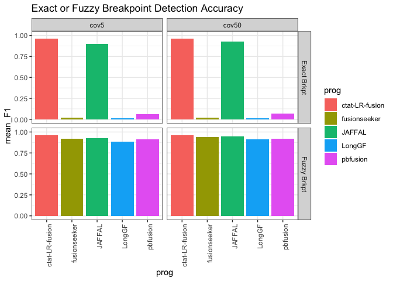
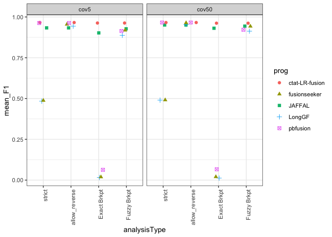
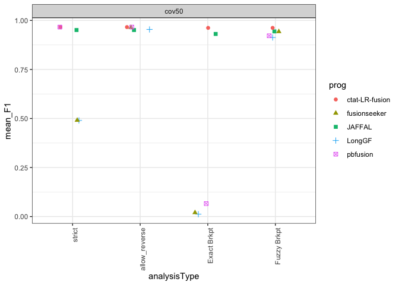
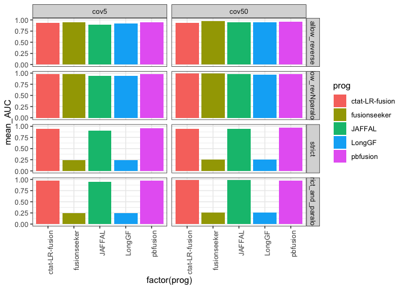
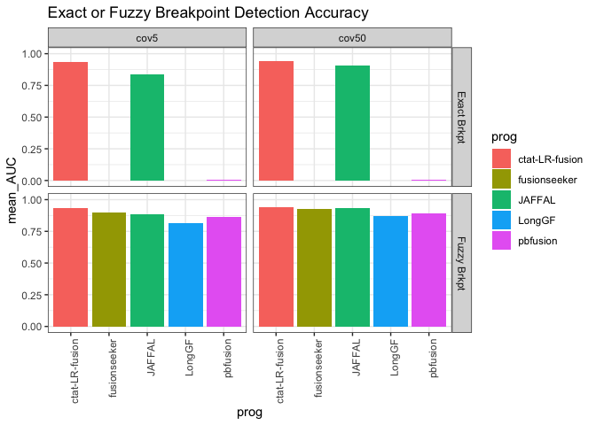

ONT_sim_accuracy_analysis
================
bhaas
2024-02-01

# ONT simulated reads using pbsim3 and R10.4.1 chemistry

Predictions from various methods evaluated on these data and the
benchmarking scripts are available here:

<https://github.com/fusiontranscripts/LR-FusionBenchmarking/tree/master/simulated_data/ONT_pbsim3_part5>

Results are analyzed below:

## fusion pair accuracy

``` r
max_F1_data = read.table("data/max_F1_summary.tsv", header=T, sep="\t") 

max_F1_data %>% head()
```

    ##   coverage_level sample_count           prog min_sum_frags  TP FP FN  TPR PPV
    ## 1          cov50      sample4 ctat-LR-fusion             6 495  0  5 0.99   1
    ## 2          cov50      sample4 ctat-LR-fusion             6 495  0  5 0.99   1
    ## 3          cov50      sample4   fusionseeker             2 495  2  5 0.99   1
    ## 4          cov50      sample2   fusionseeker             3 494  2  6 0.99   1
    ## 5          cov50      sample1 ctat-LR-fusion             2 492  0  8 0.98   1
    ## 6          cov50      sample1       pbfusion             2 489  2 11 0.98   1
    ##      F1        analysisType
    ## 1 0.995 strict_and_paralogs
    ## 2 0.995  allow_revNparalogs
    ## 3 0.995  allow_revNparalogs
    ## 4 0.995  allow_revNparalogs
    ## 5 0.990 strict_and_paralogs
    ## 6 0.990 strict_and_paralogs

``` r
# barplot

p_barplot = max_F1_data %>% ggplot(aes(x=factor(prog), y=F1)) + theme_bw() +
        geom_bar(stat='identity', position='dodge', aes(fill=sample_count)) +
        facet_grid(vars(analysisType), vars(coverage_level)) + 
    theme(axis.text.x = element_text(angle = 90, hjust = 1)) 

p_barplot
```

<!-- -->

``` r
mean_samples_F1 = max_F1_data %>% 
    group_by(coverage_level, prog, analysisType) %>%
    summarize(mean_F1 = mean(F1))
```

    ## `summarise()` has grouped output by 'coverage_level', 'prog'. You can override
    ## using the `.groups` argument.

``` r
mean_samples_F1 %>%
        filter(analysisType %in% c('strict', 'allow_reverse')) %>%
        ggplot() + theme_bw() +
        geom_col(aes(x=prog, y=mean_F1, fill=prog)) +
        facet_grid(vars(analysisType), vars(coverage_level)) + 
    theme(axis.text.x = element_text(angle = 90, hjust = 1)) 
```

<!-- -->

## breakpoint results

``` r
breakpoint_data = read.table("data/breakpoint_maxF1_data.tsv", sep="\t", header=T) 
    


breakpoint_data$coverage_level = factor(breakpoint_data$coverage_level, levels=c('cov5', 'cov50'))

brkpt_accuracy_plot = breakpoint_data %>% ggplot(aes(x=prog, y=F1, fill=sample_count)) + theme_bw() +
        geom_bar(stat='identity', position='dodge', aes(fill=sample_count)) +
        facet_grid(vars(analysisType), vars(coverage_level)) +
        ggtitle("Exact or Fuzzy Breakpoint Detection Accuracy") +
        ylim(0,1) +
        theme(axis.text.x = element_text(angle = 90, hjust = 1)) 


brkpt_accuracy_plot 
```

<!-- -->

``` r
breakpoint_mean_F1_stats = breakpoint_data %>% group_by(coverage_level, analysisType, prog) %>% 
    summarize(mean_F1 = mean(F1, na.rm=T))
```

    ## `summarise()` has grouped output by 'coverage_level', 'analysisType'. You can
    ## override using the `.groups` argument.

``` r
breakpoint_mean_F1_stats %>% ggplot() + theme_bw() +
        geom_col(aes(x=prog, y=mean_F1, fill=prog)) +
        facet_grid(vars(analysisType), vars(coverage_level)) +
        ggtitle("Exact or Fuzzy Breakpoint Detection Accuracy") +
        ylim(0,1)  +
        theme(axis.text.x = element_text(angle = 90, hjust = 1)) 
```

<!-- -->

# Combine gene-pair and breakpoint results

``` r
combined_results = bind_rows(mean_samples_F1,
                             breakpoint_mean_F1_stats)

combined_results %>% head()
```

    ## # A tibble: 6 × 4
    ## # Groups:   coverage_level, prog [2]
    ##   coverage_level prog   analysisType        mean_F1
    ##   <chr>          <chr>  <chr>                 <dbl>
    ## 1 cov5           JAFFAL allow_revNparalogs    0.966
    ## 2 cov5           JAFFAL allow_reverse         0.905
    ## 3 cov5           JAFFAL strict                0.905
    ## 4 cov5           JAFFAL strict_and_paralogs   0.966
    ## 5 cov5           LongGF allow_revNparalogs    0.967
    ## 6 cov5           LongGF allow_reverse         0.923

\`

``` r
combined_results %>%
        filter(analysisType %in% c('strict', 'allow_reverse', 'Exact Brkpt', 'Fuzzy Brkpt')  ) %>%
        mutate(analysisType = factor(analysisType, 
                            levels=c('strict', 'allow_reverse', 'Exact Brkpt', 'Fuzzy Brkpt') )) %>%
    ggplot() + theme_bw() +
    geom_jitter(aes(x=analysisType, y=mean_F1, color=prog, shape=prog), width=0.2, height=0, size=rel(2)) +

    facet_wrap(~coverage_level) +
     theme(axis.text.x = element_text(angle = 90, hjust = 1)) 
```

<!-- -->

``` r
# just cov50

combined_results %>%
        filter(coverage_level == 'cov50') %>%
        filter(analysisType %in% c('strict', 'allow_reverse', 'Exact Brkpt', 'Fuzzy Brkpt')  ) %>%
        mutate(analysisType = factor(analysisType, 
                            levels=c('strict', 'allow_reverse', 'Exact Brkpt', 'Fuzzy Brkpt') )) %>%
    ggplot() + theme_bw() +
    geom_jitter(aes(x=analysisType, y=mean_F1, color=prog, shape=prog), width=0.2, height=0, size=rel(2)) +

    facet_wrap(~coverage_level) +
     theme(axis.text.x = element_text(angle = 90, hjust = 1)) 
```

<!-- -->

``` r
write.table(combined_results %>%
        #filter(coverage_level == 'cov50') %>%
        filter(analysisType %in% c('strict', 'allow_reverse', 'Exact Brkpt', 'Fuzzy Brkpt')  ) %>%
        mutate(analysisType = factor(analysisType, 
                            levels=c('strict', 'allow_reverse', 'Exact Brkpt', 'Fuzzy Brkpt') )),
        
        file = "ONT_sim.mean_F1.combined_results.tsv", sep="\t", row.names=F, quote=F)
```

# Examine PR-AUC

``` r
mean_AUC_data = read.table("data/mean_PR_AUC_summary.tsv", header=T, sep="\t") 

mean_AUC_data %>% head()
```

    ##   analysisType           prog coverage_level mean_AUC
    ## 1       strict       pbfusion           cov5    0.900
    ## 2       strict ctat-LR-fusion           cov5    0.884
    ## 3       strict         JAFFAL           cov5    0.848
    ## 4       strict   fusionseeker           cov5    0.236
    ## 5       strict         LongGF           cov5    0.230
    ## 6       strict       pbfusion          cov50    0.908

``` r
# barplot

p_barplot = mean_AUC_data %>% ggplot(aes(x=factor(prog), y=mean_AUC)) + theme_bw() +
        geom_bar(stat='identity', position='dodge', aes(fill=prog)) +
        facet_grid(vars(analysisType), vars(coverage_level)) + 
    theme(axis.text.x = element_text(angle = 90, hjust = 1)) 

p_barplot
```

<!-- -->

## PR-AUC breakpoint results

``` r
breakpoint_AUC_data = read.table("data/breakpoint_all_mean_PR_AUC_data.tsv", sep="\t", header=T) 
    


breakpoint_AUC_data$coverage_level = factor(breakpoint_AUC_data$coverage_level, levels=c('cov5', 'cov50'))

brkpt_AUC_accuracy_plot = breakpoint_AUC_data %>% ggplot(aes(x=prog, y=mean_AUC, fill=prog)) + theme_bw() +
        geom_bar(stat='identity', position='dodge') +
        facet_grid(vars(analysisType), vars(coverage_level)) +
        ggtitle("Exact or Fuzzy Breakpoint Detection Accuracy") +
        ylim(0,1) +
        theme(axis.text.x = element_text(angle = 90, hjust = 1)) 


brkpt_AUC_accuracy_plot 
```

<!-- -->

# PR-AUC Combine gene-pair and breakpoint results

``` r
combined_AUC_results = bind_rows(mean_AUC_data,
                             breakpoint_AUC_data)

combined_AUC_results %>% head()
```

    ##   analysisType           prog coverage_level mean_AUC
    ## 1       strict       pbfusion           cov5    0.900
    ## 2       strict ctat-LR-fusion           cov5    0.884
    ## 3       strict         JAFFAL           cov5    0.848
    ## 4       strict   fusionseeker           cov5    0.236
    ## 5       strict         LongGF           cov5    0.230
    ## 6       strict       pbfusion          cov50    0.908

``` r
combined_AUC_results %>%
        filter(analysisType %in% c('strict', 'allow_reverse', 'Exact Brkpt', 'Fuzzy Brkpt')  ) %>%
        mutate(analysisType = factor(analysisType, 
                            levels=c('strict', 'allow_reverse', 'Exact Brkpt', 'Fuzzy Brkpt') )) %>%
    ggplot() + theme_bw() +
    geom_jitter(aes(x=analysisType, y=mean_AUC, color=prog, shape=prog), width=0.2, height=0, size=rel(2)) +

    facet_wrap(~coverage_level) +
     theme(axis.text.x = element_text(angle = 90, hjust = 1)) 
```

<!-- -->

``` r
write.table(combined_AUC_results %>%
        #filter(coverage_level == 'cov50') %>%
        filter(analysisType %in% c('strict', 'allow_reverse', 'Exact Brkpt', 'Fuzzy Brkpt')  ) %>%
        mutate(analysisType = factor(analysisType, 
                            levels=c('strict', 'allow_reverse', 'Exact Brkpt', 'Fuzzy Brkpt') )),
        
        file = "ONT_sim.mean_PR_AUC.combined_results.tsv", sep="\t", row.names=F, quote=F)
```
