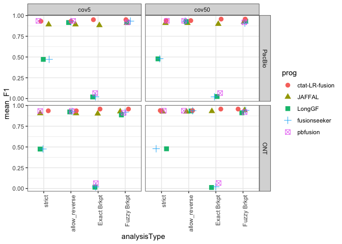
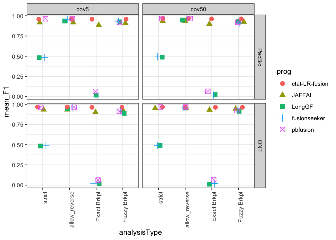
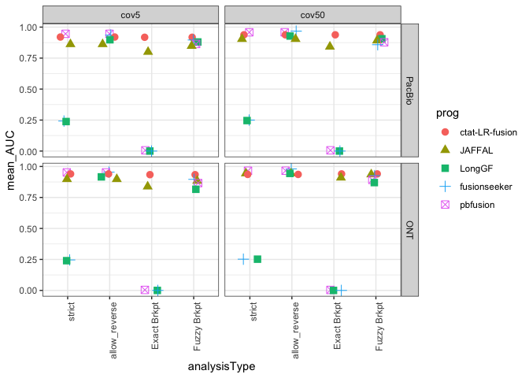

simulate_reads_summary
================
bhaas
2024-02-01

Here we build a summary figure for the pacbio HiFi and ONT R10.4.1
chemistry simulated reads (via pbsim3).

See the subdirectories for the individual analyses:
1b.1.PacBio_simulations and 1b.2.ONT_simulations

# Examine peak F1 score

``` r
pacbio_F1_summary_data = read.table("1b.1.PacBio_simulations/PacBio_sim.mean_F1.combined_results.tsv", header=T, sep="\t")

pacbio_F1_summary_data = pacbio_F1_summary_data %>% mutate(seqTech = "PacBio")


pacbio_F1_summary_data %>% head()
```

    ##   rep_num coverage_level pass_count           prog  analysisType mean_F1
    ## 1    rep1           cov5         20         JAFFAL allow_reverse  0.8918
    ## 2    rep1           cov5         20         JAFFAL        strict  0.8918
    ## 3    rep1           cov5         20         LongGF allow_reverse  0.9156
    ## 4    rep1           cov5         20         LongGF        strict  0.4716
    ## 5    rep1           cov5         20 ctat-LR-fusion allow_reverse  0.9310
    ## 6    rep1           cov5         20 ctat-LR-fusion        strict  0.9310
    ##   seqTech
    ## 1  PacBio
    ## 2  PacBio
    ## 3  PacBio
    ## 4  PacBio
    ## 5  PacBio
    ## 6  PacBio

``` r
ONT_F1_summary_data = read.table("1b.2.ONT_simulations/ONT_sim.mean_F1.combined_results.tsv", header=T, sep="\t")

ONT_F1_summary_data = ONT_F1_summary_data %>% mutate(seqTech = "ONT")

ONT_F1_summary_data %>% head()
```

    ##   coverage_level           prog  analysisType mean_F1 seqTech
    ## 1           cov5         JAFFAL allow_reverse  0.9054     ONT
    ## 2           cov5         JAFFAL        strict  0.9054     ONT
    ## 3           cov5         LongGF allow_reverse  0.9226     ONT
    ## 4           cov5         LongGF        strict  0.4748     ONT
    ## 5           cov5 ctat-LR-fusion allow_reverse  0.9360     ONT
    ## 6           cov5 ctat-LR-fusion        strict  0.9360     ONT

``` r
combined_F1_data = bind_rows(pacbio_F1_summary_data, ONT_F1_summary_data)


combined_F1_data %>% head()
```

    ##   rep_num coverage_level pass_count           prog  analysisType mean_F1
    ## 1    rep1           cov5         20         JAFFAL allow_reverse  0.8918
    ## 2    rep1           cov5         20         JAFFAL        strict  0.8918
    ## 3    rep1           cov5         20         LongGF allow_reverse  0.9156
    ## 4    rep1           cov5         20         LongGF        strict  0.4716
    ## 5    rep1           cov5         20 ctat-LR-fusion allow_reverse  0.9310
    ## 6    rep1           cov5         20 ctat-LR-fusion        strict  0.9310
    ##   seqTech
    ## 1  PacBio
    ## 2  PacBio
    ## 3  PacBio
    ## 4  PacBio
    ## 5  PacBio
    ## 6  PacBio

``` r
combined_F1_data$prog = factor(combined_F1_data$prog, levels = c('ctat-LR-fusion',
                                                           'JAFFAL',
                                                           'LongGF',
                                                           'fusionseeker',
                                                           'pbfusion') )
```

``` r
combined_F1_data %>%
    mutate(analysisType = factor(analysisType, 
                            levels=c('strict', 'allow_reverse', 'Exact Brkpt', 'Fuzzy Brkpt') )) %>%
    mutate(seqTech = factor(seqTech, levels=c("PacBio", "ONT"))) %>%
     ggplot() + theme_bw() +
     geom_jitter(aes(x=analysisType, y=mean_F1, color=prog, shape=prog), width=0.2, height=0, size=rel(3)) +
     facet_grid(vars(seqTech), vars(coverage_level)) +
     theme(axis.text.x = element_text(angle = 90, hjust = 1)) 
```

<!-- -->

``` r
combined_F1_paperfig = combined_F1_data %>%
    filter(coverage_level=="cov5") %>%
    mutate(analysisType = factor(analysisType, 
                            levels=c('strict', 'allow_reverse', 'Exact Brkpt', 'Fuzzy Brkpt') )) %>%
    mutate(seqTech = factor(seqTech, levels=c("PacBio", "ONT"))) %>%
     ggplot() + theme_bw() +
     geom_jitter(aes(x=analysisType, y=mean_F1, color=prog, shape=prog), width=0.2, height=0, size=rel(3)) +
     facet_wrap(~seqTech) +
     theme(axis.text.x = element_text(angle = 90, hjust = 1)) 


combined_F1_paperfig
```

<!-- -->

``` r
ggsave(combined_F1_paperfig, filename="pbsim3_bmark.F1.paperfig.svg", width=8, height=5)
```

# Examine PR-AUC

``` r
pacbio_PR_AUC_summary_data = read.table("1b.1.PacBio_simulations/PacBio_sim.mean_PR_AUC.combined_results.tsv", header=T, sep="\t")

pacbio_PR_AUC_summary_data = pacbio_PR_AUC_summary_data %>% mutate(seqTech = "PacBio")


pacbio_PR_AUC_summary_data %>% head()
```

    ##   analysisType           prog rep_num coverage_level pass_count mean_AUC
    ## 1       strict       pbfusion    rep1           cov5         20    0.892
    ## 2       strict ctat-LR-fusion    rep1           cov5         20    0.870
    ## 3       strict         JAFFAL    rep1           cov5         20    0.812
    ## 4       strict   fusionseeker    rep1           cov5         20    0.232
    ## 5       strict         LongGF    rep1           cov5         20    0.230
    ## 6       strict       pbfusion    rep1          cov50         20    0.904
    ##   seqTech
    ## 1  PacBio
    ## 2  PacBio
    ## 3  PacBio
    ## 4  PacBio
    ## 5  PacBio
    ## 6  PacBio

``` r
ONT_PR_AUC_summary_data = read.table("1b.2.ONT_simulations/ONT_sim.mean_PR_AUC.combined_results.tsv", header=T, sep="\t")

ONT_PR_AUC_summary_data = ONT_PR_AUC_summary_data %>% mutate(seqTech = "ONT")

ONT_PR_AUC_summary_data %>% head()
```

    ##   analysisType           prog coverage_level mean_AUC seqTech
    ## 1       strict       pbfusion           cov5    0.900     ONT
    ## 2       strict ctat-LR-fusion           cov5    0.884     ONT
    ## 3       strict         JAFFAL           cov5    0.848     ONT
    ## 4       strict   fusionseeker           cov5    0.236     ONT
    ## 5       strict         LongGF           cov5    0.230     ONT
    ## 6       strict       pbfusion          cov50    0.908     ONT

``` r
combined_PR_AUC_data = bind_rows(pacbio_PR_AUC_summary_data, ONT_PR_AUC_summary_data)


combined_PR_AUC_data %>% head()
```

    ##   analysisType           prog rep_num coverage_level pass_count mean_AUC
    ## 1       strict       pbfusion    rep1           cov5         20    0.892
    ## 2       strict ctat-LR-fusion    rep1           cov5         20    0.870
    ## 3       strict         JAFFAL    rep1           cov5         20    0.812
    ## 4       strict   fusionseeker    rep1           cov5         20    0.232
    ## 5       strict         LongGF    rep1           cov5         20    0.230
    ## 6       strict       pbfusion    rep1          cov50         20    0.904
    ##   seqTech
    ## 1  PacBio
    ## 2  PacBio
    ## 3  PacBio
    ## 4  PacBio
    ## 5  PacBio
    ## 6  PacBio

``` r
combined_PR_AUC_data$prog = factor(combined_PR_AUC_data$prog, levels = c('ctat-LR-fusion',
                                                           'JAFFAL',
                                                           'LongGF',
                                                           'fusionseeker',
                                                           'pbfusion') )
```

``` r
combined_PR_AUC_data %>%
    mutate(analysisType = factor(analysisType, 
                            levels=c('strict', 'allow_reverse', 'Exact Brkpt', 'Fuzzy Brkpt') )) %>%
    mutate(seqTech = factor(seqTech, levels=c("PacBio", "ONT"))) %>%
     ggplot() + theme_bw() +
     geom_jitter(aes(x=analysisType, y=mean_AUC, color=prog, shape=prog), width=0.2, height=0, size=rel(3)) +
     facet_grid(vars(seqTech), vars(coverage_level)) +
     theme(axis.text.x = element_text(angle = 90, hjust = 1)) 
```

<!-- -->

``` r
combined_PR_AUC_paperfig = combined_PR_AUC_data %>%
    filter(coverage_level=="cov5") %>%
    mutate(analysisType = factor(analysisType, 
                            levels=c('strict', 'allow_reverse', 'Exact Brkpt', 'Fuzzy Brkpt') )) %>%
    mutate(seqTech = factor(seqTech, levels=c("PacBio", "ONT"))) %>%
     ggplot() + theme_bw() +
     geom_jitter(aes(x=analysisType, y=mean_AUC, color=prog, shape=prog), width=0.2, height=0, size=rel(3)) +
     facet_wrap(~seqTech) +
     theme(axis.text.x = element_text(angle = 90, hjust = 1)) 


combined_PR_AUC_paperfig
```

<!-- -->

``` r
ggsave(combined_PR_AUC_paperfig, filename="pbsim3_bmark.AUC.paperfig.svg", width=8, height=5)
```
