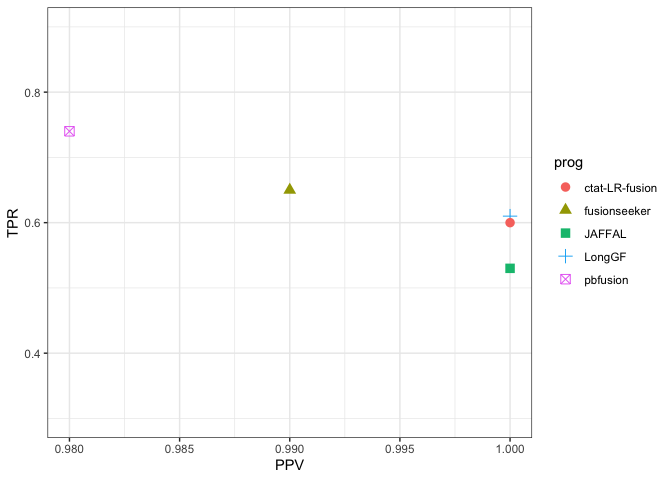

Examine_sim_paralog_fusion_detection
================
bhaas
2024-07-23

Analysis here was to simply evaluate whether the LR fusion finders had
capabilities to detect fusions between paralogous genes.

291 fusions simulated: see
LR-FusionBenchmarking/simulated_data/paralog_fusion_sim/data/parafusions.fastq.gz

``` r
data = read.csv("data/analyze_allow_reverse.fusion_preds.txt.scored.ROC", header=T, sep="\t", stringsAsFactors = F)

data
```

    ##             prog min_sum_frags  TP FP  FN  TPR  PPV    F1
    ## 1   fusionseeker             1 191  2  96 0.67 0.99 0.799
    ## 2   fusionseeker             2   4  0 283 0.01 1.00 0.020
    ## 3   fusionseeker             3   1  0 286 0.00 1.00 0.000
    ## 4         JAFFAL             1 153  0 134 0.53 1.00 0.693
    ## 5       pbfusion             1 212  4  75 0.74 0.98 0.843
    ## 6 ctat-LR-fusion             1 179  0 108 0.62 1.00 0.765
    ## 7         LongGF             1 176  0 111 0.61 1.00 0.758

``` r
data %>% filter(min_sum_frags == 1) %>% ggplot(aes(y=TPR, x=PPV)) + geom_point(aes(shape=prog, color=prog), size=3) +
    theme_bw() + ylim(0.3, 0.9)
```

<!-- -->
