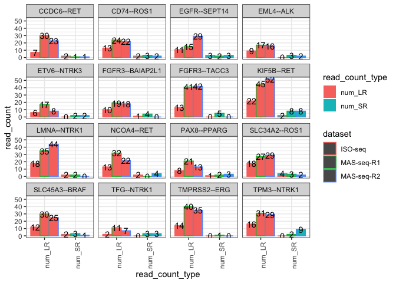

Downsampled_LR_match_Illumina
================
bhaas
2024-02-04

Illumina TruSeq replicates (PE 151 base reads) for SeraCare fusion mix
v4 had the following read counts and number of sequenced bases:

| num_reads  | num_bases     |
|:-----------|:--------------|
| 6,463,483  | 1,951,971,866 |
| 10,227,579 | 3,088,728,858 |
| 9,972,927  | 3,011,823,954 |

We downsampled the PacBio MAS-Iso-seq reads to match the Illumina
sequencing depth for each of the replicates:

| num_reads | num_bases     |
|:----------|:--------------|
| 1,493,570 | 1,951,971,866 |
| 2,912,707 | 3,088,728,856 |
| 2,816,561 | 3,011,823,930 |

``` r
# read the downsampled LR results for ctat-LRF:

rep1_data = read.table("data/SeraCareFusions_Isoseq.DOWNSAMPLED.ctat-LR-fusion.fusion_predictions.tsv", header=T, sep="\t", stringsAsFactors = F, com='') %>% mutate(dataset = "ISO-seq")

rep2_data = read.table("data/SeraCareFusions_MASseq-bc08.DOWNSAMPLED.ctat-LR-fusion.fusion_predictions.tsv", header=T, sep="\t", stringsAsFactors = F, com='') %>% mutate(dataset = "MAS-seq-R1")

rep3_data = read.table("data/SeraCareFusions_MASseq-bc09.DOWNSAMPLED.ctat-LR-fusion.fusion_predictions.tsv", header=T, sep="\t", stringsAsFactors = F, com='') %>% mutate(dataset = "MAS-seq-R2")

LR_downsampled_results = bind_rows(rep1_data, rep2_data, rep3_data) %>%
    rename(FusionName = X.FusionName)

head(LR_downsampled_results)
```

    ##      FusionName num_LR LeftGene LeftLocalBreakpoint   LeftBreakpoint RightGene
    ## 1    KIF5B--RET     22    KIF5B               19983 chr10:32017143:-       RET
    ## 2   LMNA--NTRK1     18     LMNA               13767 chr1:156130773:+     NTRK1
    ## 3 SLC34A2--ROS1     18  SLC34A2                4738  chr4:25664330:+      ROS1
    ## 4   TPM3--NTRK1     16     TPM3               12356 chr1:154170400:-     NTRK1
    ## 5  TMPRSS2--ERG     14  TMPRSS2                3407 chr21:41508081:-       ERG
    ## 6    CD74--ROS1     13     CD74                4950 chr5:150404680:-      ROS1
    ##   RightLocalBreakpoint  RightBreakpoint      SpliceType
    ## 1                38630 chr10:43114480:+ ONLY_REF_SPLICE
    ## 2                35485 chr1:156874906:+ ONLY_REF_SPLICE
    ## 3                56592 chr6:117324415:- ONLY_REF_SPLICE
    ## 4                34368 chr1:156874571:+ ONLY_REF_SPLICE
    ## 5                27812 chr21:38584945:- ONLY_REF_SPLICE
    ## 6                46835 chr6:117324415:- ONLY_REF_SPLICE
    ##                                                                                                                                                                                                                                                                                                                                                                                                                                                                                                                                                                                                                                                                                                                                                                                  LR_accessions
    ## 1 m64020e_230609_061545/16517487/ccs,m64020e_230609_061545/35720023/ccs,m64020e_230609_061545/52691034/ccs,m64020e_230609_061545/53871491/ccs,m64020e_230609_061545/47188792/ccs,m64020e_230609_061545/34997672/ccs,m64020e_230609_061545/18022479/ccs,m64020e_230609_061545/25954726/ccs,m64020e_230609_061545/52430618/ccs,m64020e_230609_061545/7210866/ccs,m64020e_230609_061545/8980482/ccs,m64020e_230609_061545/41944703/ccs,m64020e_230609_061545/19203215/ccs,m64020e_230609_061545/983393/ccs,m64020e_230609_061545/33162701/ccs,m64020e_230609_061545/29952497/ccs,m64020e_230609_061545/10617906/ccs,m64020e_230609_061545/41552523/ccs,m64020e_230609_061545/21236204/ccs,m64020e_230609_061545/10749828/ccs,m64020e_230609_061545/51118839/ccs,m64020e_230609_061545/8849096/ccs
    ## 2                                                                                                                                         m64020e_230609_061545/17432985/ccs,m64020e_230609_061545/56100315/ccs,m64020e_230609_061545/1900561/ccs,m64020e_230609_061545/10094059/ccs,m64020e_230609_061545/20580011/ccs,m64020e_230609_061545/12584650/ccs,m64020e_230609_061545/52233078/ccs,m64020e_230609_061545/36569239/ccs,m64020e_230609_061545/16975413/ccs,m64020e_230609_061545/29098618/ccs,m64020e_230609_061545/44369840/ccs,m64020e_230609_061545/42862269/ccs,m64020e_230609_061545/43518410/ccs,m64020e_230609_061545/26739056/ccs,m64020e_230609_061545/50662004/ccs,m64020e_230609_061545/40764677/ccs,m64020e_230609_061545/14420804/ccs,m64020e_230609_061545/38930182/ccs
    ## 3                                                                                                                                           m64020e_230609_061545/49546871/ccs,m64020e_230609_061545/32312117/ccs,m64020e_230609_061545/9177323/ccs,m64020e_230609_061545/39913485/ccs,m64020e_230609_061545/12321664/ccs,m64020e_230609_061545/4916359/ccs,m64020e_230609_061545/14747062/ccs,m64020e_230609_061545/11207674/ccs,m64020e_230609_061545/49416901/ccs,m64020e_230609_061545/44566170/ccs,m64020e_230609_061545/44632242/ccs,m64020e_230609_061545/43779406/ccs,m64020e_230609_061545/9111007/ccs,m64020e_230609_061545/26216266/ccs,m64020e_230609_061545/48431151/ccs,m64020e_230609_061545/45416590/ccs,m64020e_230609_061545/48760137/ccs,m64020e_230609_061545/30149321/ccs
    ## 4                                                                                                                                                                                                                    m64020e_230609_061545/9439106/ccs,m64020e_230609_061545/788272/ccs,m64020e_230609_061545/36768059/ccs,m64020e_230609_061545/27396060/ccs,m64020e_230609_061545/24839422/ccs,m64020e_230609_061545/6161108/ccs,m64020e_230609_061545/29164881/ccs,m64020e_230609_061545/40239460/ccs,m64020e_230609_061545/42075480/ccs,m64020e_230609_061545/262890/ccs,m64020e_230609_061545/19005897/ccs,m64020e_230609_061545/33883805/ccs,m64020e_230609_061545/45746225/ccs,m64020e_230609_061545/52431589/ccs,m64020e_230609_061545/29361366/ccs,m64020e_230609_061545/23397213/ccs
    ## 5                                                                                                                                                                                                                                                                                        m64020e_230609_061545/5310511/ccs,m64020e_230609_061545/33031899/ccs,m64020e_230609_061545/8650841/ccs,m64020e_230609_061545/394075/ccs,m64020e_230609_061545/21760302/ccs,m64020e_230609_061545/39519736/ccs,m64020e_230609_061545/27526868/ccs,m64020e_230609_061545/31130451/ccs,m64020e_230609_061545/20382573/ccs,m64020e_230609_061545/51839753/ccs,m64020e_230609_061545/50069842/ccs,m64020e_230609_061545/48171843/ccs,m64020e_230609_061545/46270531/ccs,m64020e_230609_061545/16386709/ccs
    ## 6                                                                                                                                                                                                                                                                                                                          m64020e_230609_061545/36569694/ccs,m64020e_230609_061545/57279569/ccs,m64020e_230609_061545/51382613/ccs,m64020e_230609_061545/47777121/ccs,m64020e_230609_061545/5570738/ccs,m64020e_230609_061545/21236485/ccs,m64020e_230609_061545/35651855/ccs,m64020e_230609_061545/1638703/ccs,m64020e_230609_061545/35979690/ccs,m64020e_230609_061545/49743242/ccs,m64020e_230609_061545/46139690/ccs,m64020e_230609_061545/43451211/ccs,m64020e_230609_061545/5310069/ccs
    ##   LR_FFPM
    ## 1  14.730
    ## 2  12.052
    ## 3  12.052
    ## 4  10.713
    ## 5   9.374
    ## 6   8.704
    ##                                                                                                                                                                                                     annots
    ## 1                                                                                                                                    [ChimerKB,ChimerPub,Cosmic,ChimerSeq,INTRACHROMOSOMAL[chr10:11.02Mb]]
    ## 2                                                                                                                                 [ChimerKB,ChimerPub,Cosmic,TCGA_StarF2019,INTRACHROMOSOMAL[chr1:0.68Mb]]
    ## 3                                               [ChimerKB,DepMap2023,ChimerSeq,TCGA_StarF2019,CCLE_StarF2019,Klijn_CellLines,GUO2018CR_TCGA,chimerdb_pubmed,ChimerPub,Cosmic,INTERCHROMOSOMAL[chr4--chr6]]
    ## 4               [ChimerKB,DepMap2023,ChimerSeq,TCGA_StarF2019,CCLE_StarF2019,HaasMedCancer,Klijn_CellLines,chimerdb_pubmed,DEEPEST2019,ChimerPub,TumorFusionsNAR2018,Cosmic,INTRACHROMOSOMAL[chr1:2.62Mb]]
    ## 5 [ChimerKB,Larsson_TCGA,DepMap2023,ChimerSeq,TCGA_StarF2019,CCLE_StarF2019,YOSHIHARA_TCGA,chimerdb_pubmed,DEEPEST2019,GUO2018CR_TCGA,ChimerPub,TumorFusionsNAR2018,Cosmic,INTRACHROMOSOMAL[chr21:2.80Mb]]
    ## 6                                         [ChimerKB,ChimerSeq,TCGA_StarF2019,Klijn_CellLines,chimerdb_pubmed,DEEPEST2019,GUO2018CR_TCGA,ChimerPub,TumorFusionsNAR2018,Cosmic,INTERCHROMOSOMAL[chr5--chr6]]
    ##   max_LR_FFPM frac_dom_iso above_frac_dom_iso dataset
    ## 1      14.730            1               True ISO-seq
    ## 2      12.052            1               True ISO-seq
    ## 3      12.052            1               True ISO-seq
    ## 4      10.713            1               True ISO-seq
    ## 5       9.374            1               True ISO-seq
    ## 6       8.704            1               True ISO-seq

``` r
seracare_targets = read.table("../data/SeraCare_fusion_targets.tsv", header=T, sep="\t", stringsAsFactors = F)

seracare_targets 
```

    ##         FusionName LeftGene   LeftBreakpoint RightGene  RightBreakpoint
    ## 1       KIF5B--RET    KIF5B chr10:32017143:-       RET chr10:43114480:+
    ## 2    SLC34A2--ROS1  SLC34A2  chr4:25664330:+      ROS1 chr6:117324415:-
    ## 3     FGFR3--TACC3    FGFR3   chr4:1806934:+     TACC3   chr4:1739702:+
    ## 4      LMNA--NTRK1     LMNA chr1:156130773:+     NTRK1 chr1:156874906:+
    ## 5       CD74--ROS1     CD74 chr5:150404680:-      ROS1 chr6:117324415:-
    ## 6     TMPRSS2--ERG  TMPRSS2 chr21:41508081:-       ERG chr21:38584945:-
    ## 7       NCOA4--RET    NCOA4 chr10:46012883:-       RET chr10:43116584:+
    ## 8  FGFR3--BAIAP2L1    FGFR3   chr4:1806934:+  BAIAP2L1  chr7:98362432:-
    ## 9      TPM3--NTRK1     TPM3 chr1:154170400:-     NTRK1 chr1:156874571:+
    ## 10      CCDC6--RET    CCDC6 chr10:59906122:-       RET chr10:43116584:+
    ## 11     PAX8--PPARG     PAX8 chr2:113235394:-     PPARG  chr3:12379704:+
    ## 12    EGFR--SEPT14     EGFR  chr7:55200413:+    SEPT14  chr7:55796092:-
    ## 13   SLC45A3--BRAF  SLC45A3 chr1:205680394:-      BRAF chr7:140794467:-
    ## 14       EML4--ALK     EML4  chr2:42295516:+       ALK  chr2:29223528:-
    ## 15     ETV6--NTRK3     ETV6 chr12:11869969:+     NTRK3 chr15:87940753:-
    ## 16      TFG--NTRK1      TFG chr3:100732672:+     NTRK1 chr1:156874571:+

``` r
LR_downsampled_results = left_join( cross_join(seracare_targets, data.frame(dataset=c('ISO-seq', 'MAS-seq-R1', 'MAS-seq-R2'))),
                                    LR_downsampled_results %>% 
                                        select(FusionName, LeftBreakpoint, RightBreakpoint, 
                                               num_LR, LR_FFPM, dataset),
                                    by=c('FusionName', 'LeftBreakpoint', 'RightBreakpoint', 'dataset'))
```

# examine number of long reads per control fusion

``` r
# by read count

seracare_read_count_barplot = LR_downsampled_results %>% 
    ggplot(aes(x=FusionName, y=num_LR)) + theme_bw() +
    geom_bar(stat='identity', position='dodge', aes(fill=dataset))   + 
    theme(axis.text.x = element_text(angle = 90, hjust = 1))

seracare_read_count_barplot
```

<!-- -->

``` r
# get the SR results from earlier.

SR_results = read.table("../SeraCare_CTAT_LRF_FI_summary.tsv", header=T, sep="\t", stringsAsFactors = F) %>%
    select(-num_LR, -LR_FFPM)

SR_results %>% head()
```

    ##      FusionName LeftGene   LeftBreakpoint RightGene  RightBreakpoint    dataset
    ## 1    KIF5B--RET    KIF5B chr10:32017143:-       RET chr10:43114480:+    ISO-seq
    ## 2    KIF5B--RET    KIF5B chr10:32017143:-       RET chr10:43114480:+ MAS-seq-R1
    ## 3    KIF5B--RET    KIF5B chr10:32017143:-       RET chr10:43114480:+ MAS-seq-R2
    ## 4 SLC34A2--ROS1  SLC34A2  chr4:25664330:+      ROS1 chr6:117324415:-    ISO-seq
    ## 5 SLC34A2--ROS1  SLC34A2  chr4:25664330:+      ROS1 chr6:117324415:- MAS-seq-R1
    ## 6 SLC34A2--ROS1  SLC34A2  chr4:25664330:+      ROS1 chr6:117324415:- MAS-seq-R2
    ##   num_SR SR_FFPM
    ## 1      2  0.3094
    ## 2      8  0.7822
    ## 3      8  0.8022
    ## 4      4  0.6188
    ## 5      3  0.2933
    ## 6      2  0.2005

``` r
combined_data = left_join(LR_downsampled_results, SR_results,
                          by=c('FusionName', 'LeftBreakpoint', 'RightBreakpoint', 'dataset', 'RightGene', 'LeftGene'))

head(combined_data)
```

    ##      FusionName LeftGene   LeftBreakpoint RightGene  RightBreakpoint    dataset
    ## 1    KIF5B--RET    KIF5B chr10:32017143:-       RET chr10:43114480:+    ISO-seq
    ## 2    KIF5B--RET    KIF5B chr10:32017143:-       RET chr10:43114480:+ MAS-seq-R1
    ## 3    KIF5B--RET    KIF5B chr10:32017143:-       RET chr10:43114480:+ MAS-seq-R2
    ## 4 SLC34A2--ROS1  SLC34A2  chr4:25664330:+      ROS1 chr6:117324415:-    ISO-seq
    ## 5 SLC34A2--ROS1  SLC34A2  chr4:25664330:+      ROS1 chr6:117324415:- MAS-seq-R1
    ## 6 SLC34A2--ROS1  SLC34A2  chr4:25664330:+      ROS1 chr6:117324415:- MAS-seq-R2
    ##   num_LR LR_FFPM num_SR SR_FFPM
    ## 1     22  14.730      2  0.3094
    ## 2     45  15.450      8  0.7822
    ## 3     52  18.462      8  0.8022
    ## 4     18  12.052      4  0.6188
    ## 5     27   9.270      3  0.2933
    ## 6     29  10.296      2  0.2005

``` r
sera_downsampledLR_fig = combined_data %>% gather(key=read_count_type, value=read_count, num_LR, num_SR) %>%
    ggplot(aes(x=read_count_type, y=read_count)) +  theme_bw() +
    geom_bar(stat='identity', position = 'dodge', aes(color=dataset, fill=read_count_type)) +
    facet_wrap(~FusionName) +
      theme(axis.text.x = element_text(angle = 90, hjust = 1))  +
          geom_text(position=position_dodge(width=0.9), aes(label=read_count, group=dataset))

sera_downsampledLR_fig
```

<!-- -->

``` r
ggsave(sera_downsampledLR_fig, file="sera_downsampledLR_fig.svg", width=7, height=5)
```
