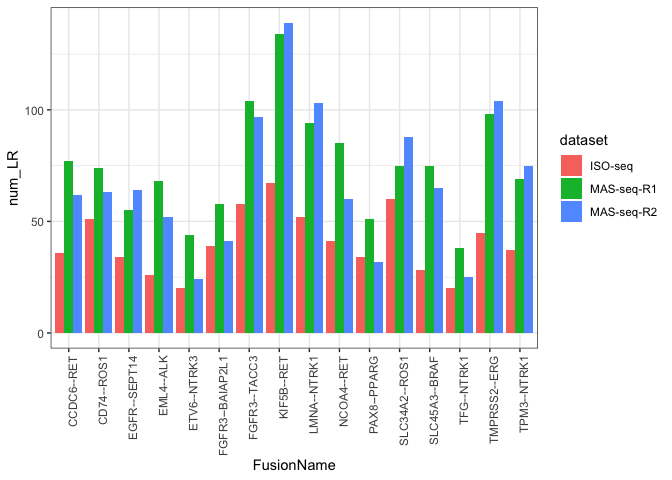
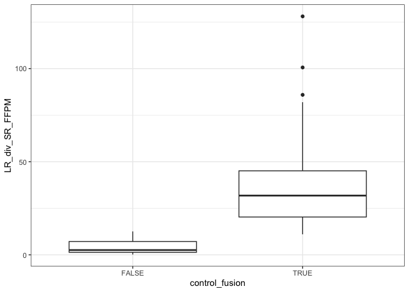

CTAT_SeraCareFusion
================
bhaas
2023-12-05

# number of fusion reads for each control fusion

``` r
control_fusions = read.table("data/SeraCare_fusion_targets.tsv", header=T, sep="\t")

control_fusions 
```

    ##         FusionName LeftGene   LeftBreakpoint RightGene  RightBreakpoint
    ## 1       KIF5B--RET    KIF5B chr10:32017143:-       RET chr10:43114480:+
    ## 2    SLC34A2--ROS1  SLC34A2  chr4:25664330:+      ROS1 chr6:117324415:-
    ## 3     FGFR3--TACC3    FGFR3   chr4:1806934:+     TACC3   chr4:1739702:+
    ## 4      LMNA--NTRK1     LMNA chr1:156130773:+     NTRK1 chr1:156874906:+
    ## 5       CD74--ROS1     CD74 chr5:150404680:-      ROS1 chr6:117324415:-
    ## 6     TMPRSS2--ERG  TMPRSS2 chr21:41508081:-       ERG chr21:38584945:-
    ## 7       NCOA4--RET    NCOA4 chr10:46012883:-       RET chr10:43116584:+
    ## 8  FGFR3--BAIAP2L1    FGFR3   chr4:1806934:+  BAIAP2L1  chr7:98362432:-
    ## 9      TPM3--NTRK1     TPM3 chr1:154170400:-     NTRK1 chr1:156874571:+
    ## 10      CCDC6--RET    CCDC6 chr10:59906122:-       RET chr10:43116584:+
    ## 11     PAX8--PPARG     PAX8 chr2:113235394:-     PPARG  chr3:12379704:+
    ## 12    EGFR--SEPT14     EGFR  chr7:55200413:+    SEPT14  chr7:55796092:-
    ## 13   SLC45A3--BRAF  SLC45A3 chr1:205680394:-      BRAF chr7:140794467:-
    ## 14       EML4--ALK     EML4  chr2:42295516:+       ALK  chr2:29223528:-
    ## 15     ETV6--NTRK3     ETV6 chr12:11869969:+     NTRK3 chr15:87940753:-
    ## 16      TFG--NTRK1      TFG chr3:100732672:+     NTRK1 chr1:156874571:+

``` r
rep1_data = read.table("data/ctatLRF_FI/SeraCareFusions_Isoseq.ctat-LR-fusion.fusion_predictions.abridged.tsv.gz", header=T, com='', sep="\t") %>%
    mutate(dataset= 'ISO-seq')

rep2_data = read.table("data/ctatLRF_FI/SeraCareFusions_MASseq-bc08.ctat-LR-fusion.fusion_predictions.abridged.tsv.gz", header=T, com='', sep="\t") %>%
    mutate(dataset = 'MAS-seq-R1')

rep3_data = read.table("data/ctatLRF_FI/SeraCareFusions_MASseq-bc09.ctat-LR-fusion.fusion_predictions.abridged.tsv.gz", header=T, com='', sep="\t") %>%
    mutate(dataset = 'MAS-seq-R2')


ctatLRF_FI_data = bind_rows(rep1_data, rep2_data, rep3_data) %>% rename(FusionName = X.FusionName, SR_FFPM = FFPM) %>%
    mutate(num_SR = est_J + est_S) 

ctatLRF_FI_data %>% head()
```

    ##      FusionName num_LR LeftGene LeftLocalBreakpoint   LeftBreakpoint RightGene
    ## 1    KIF5B--RET     67    KIF5B               19983 chr10:32017143:-       RET
    ## 2 SLC34A2--ROS1     60  SLC34A2                4738  chr4:25664330:+      ROS1
    ## 3  FGFR3--TACC3     58    FGFR3                9864   chr4:1806934:+     TACC3
    ## 4   LMNA--NTRK1     52     LMNA               13767 chr1:156130773:+     NTRK1
    ## 5    CD74--ROS1     51     CD74                4950 chr5:150404680:-      ROS1
    ## 6  TMPRSS2--ERG     45  TMPRSS2                3407 chr21:41508081:-       ERG
    ##   RightLocalBreakpoint  RightBreakpoint      SpliceType LR_FFPM
    ## 1                38630 chr10:43114480:+ ONLY_REF_SPLICE  13.933
    ## 2                56592 chr6:117324415:- ONLY_REF_SPLICE  12.477
    ## 3                26008   chr4:1739702:+ ONLY_REF_SPLICE  12.061
    ## 4                35485 chr1:156874906:+ ONLY_REF_SPLICE  10.814
    ## 5                46835 chr6:117324415:- ONLY_REF_SPLICE  10.606
    ## 6                27812 chr21:38584945:- ONLY_REF_SPLICE   9.358
    ##   JunctionReadCount SpanningFragCount est_J est_S                LeftGene_SR
    ## 1                 2                 0     2     0   KIF5B^ENSG00000170759.10
    ## 2                 3                 1     3     1 SLC34A2^ENSG00000157765.10
    ## 3                NA                NA    NA    NA                           
    ## 4                 1                 1     1     1    LMNA^ENSG00000160789.18
    ## 5                 1                 1     1     1    CD74^ENSG00000019582.13
    ## 6                NA                NA    NA    NA                           
    ##               RightGene_SR LargeAnchorSupport NumCounterFusionLeft
    ## 1   RET^ENSG00000165731.16                YES                   33
    ## 2   ROS1^ENSG00000047936.9                YES                    0
    ## 3                                                               NA
    ## 4 NTRK1^ENSG00000198400.10                YES                   93
    ## 5   ROS1^ENSG00000047936.9                 NO                 3624
    ## 6                                                               NA
    ##   NumCounterFusionRight FAR_left FAR_right LeftBreakDinuc LeftBreakEntropy
    ## 1                     0     0.09         3             GT           1.9656
    ## 2                     0     5.00         5             GT           1.8892
    ## 3                    NA       NA        NA                              NA
    ## 4                     2     0.03         1             GT           1.7465
    ## 5                     0     0.00         3             GT           1.7819
    ## 6                    NA       NA        NA                              NA
    ##   RightBreakDinuc RightBreakEntropy SR_FFPM microh_brkpt_dist
    ## 1              AG            1.9656  0.3094              3178
    ## 2              AG            1.7465  0.6188               999
    ## 3                                NA      NA                NA
    ## 4              AG            1.5058  0.3094               947
    ## 5              AG            1.7465  0.3094              2407
    ## 6                                NA      NA                NA
    ##   num_microh_near_brkpt
    ## 1                     0
    ## 2                     0
    ## 3                    NA
    ## 4                     0
    ## 5                     0
    ## 6                    NA
    ##                                                                                                                                                                                                          annots
    ## 1                                                                                                                                         [ChimerKB,ChimerPub,Cosmic,ChimerSeq,INTRACHROMOSOMAL[chr10:11.02Mb]]
    ## 2                                                               [ChimerKB,ChimerSeq,TCGA_StarF2019,CCLE_StarF2019,Klijn_CellLines,GUO2018CR_TCGA,chimerdb_pubmed,ChimerPub,Cosmic,INTERCHROMOSOMAL[chr4--chr6]]
    ## 3 [ChimerKB,ChimerSeq,TCGA_StarF2019,CCLE_StarF2019,YOSHIHARA_TCGA,Klijn_CellLines,DEEPEST2019,GUO2018CR_TCGA,ChimerPub,TumorFusionsNAR2018,Cosmic,INTRACHROMOSOMAL[chr4:0.05Mb],LOCAL_REARRANGEMENT:+:[48131]]
    ## 4                                                                                                                                      [ChimerKB,ChimerPub,Cosmic,TCGA_StarF2019,INTRACHROMOSOMAL[chr1:0.68Mb]]
    ## 5                                              [ChimerKB,ChimerSeq,TCGA_StarF2019,Klijn_CellLines,chimerdb_pubmed,DEEPEST2019,GUO2018CR_TCGA,ChimerPub,TumorFusionsNAR2018,Cosmic,INTERCHROMOSOMAL[chr5--chr6]]
    ## 6                 [ChimerKB,Larsson_TCGA,ChimerSeq,TCGA_StarF2019,CCLE_StarF2019,YOSHIHARA_TCGA,chimerdb_pubmed,DEEPEST2019,GUO2018CR_TCGA,ChimerPub,TumorFusionsNAR2018,Cosmic,INTRACHROMOSOMAL[chr21:2.80Mb]]
    ##   max_LR_FFPM frac_dom_iso above_frac_dom_iso dataset num_SR
    ## 1      13.933            1               True ISO-seq      2
    ## 2      12.477            1               True ISO-seq      4
    ## 3      12.061            1               True ISO-seq     NA
    ## 4      10.814            1               True ISO-seq      2
    ## 5      10.606            1               True ISO-seq      2
    ## 6       9.358            1               True ISO-seq     NA

``` r
ctatLRF_FI_control_results = left_join( cross_join(control_fusions, data.frame(dataset=c('ISO-seq', 'MAS-seq-R1', 'MAS-seq-R2'))),
                                    ctatLRF_FI_data %>% 
                                        select(FusionName, LeftBreakpoint, RightBreakpoint, 
                                               num_LR, LR_FFPM, num_SR, SR_FFPM, dataset),
                                    by=c('FusionName', 'LeftBreakpoint', 'RightBreakpoint', 'dataset'))


ctatLRF_FI_control_results =  ctatLRF_FI_control_results %>% mutate(num_SR = ifelse(is.na(num_SR), 0, num_SR))

ctatLRF_FI_control_results
```

    ##         FusionName LeftGene   LeftBreakpoint RightGene  RightBreakpoint
    ## 1       KIF5B--RET    KIF5B chr10:32017143:-       RET chr10:43114480:+
    ## 2       KIF5B--RET    KIF5B chr10:32017143:-       RET chr10:43114480:+
    ## 3       KIF5B--RET    KIF5B chr10:32017143:-       RET chr10:43114480:+
    ## 4    SLC34A2--ROS1  SLC34A2  chr4:25664330:+      ROS1 chr6:117324415:-
    ## 5    SLC34A2--ROS1  SLC34A2  chr4:25664330:+      ROS1 chr6:117324415:-
    ## 6    SLC34A2--ROS1  SLC34A2  chr4:25664330:+      ROS1 chr6:117324415:-
    ## 7     FGFR3--TACC3    FGFR3   chr4:1806934:+     TACC3   chr4:1739702:+
    ## 8     FGFR3--TACC3    FGFR3   chr4:1806934:+     TACC3   chr4:1739702:+
    ## 9     FGFR3--TACC3    FGFR3   chr4:1806934:+     TACC3   chr4:1739702:+
    ## 10     LMNA--NTRK1     LMNA chr1:156130773:+     NTRK1 chr1:156874906:+
    ## 11     LMNA--NTRK1     LMNA chr1:156130773:+     NTRK1 chr1:156874906:+
    ## 12     LMNA--NTRK1     LMNA chr1:156130773:+     NTRK1 chr1:156874906:+
    ## 13      CD74--ROS1     CD74 chr5:150404680:-      ROS1 chr6:117324415:-
    ## 14      CD74--ROS1     CD74 chr5:150404680:-      ROS1 chr6:117324415:-
    ## 15      CD74--ROS1     CD74 chr5:150404680:-      ROS1 chr6:117324415:-
    ## 16    TMPRSS2--ERG  TMPRSS2 chr21:41508081:-       ERG chr21:38584945:-
    ## 17    TMPRSS2--ERG  TMPRSS2 chr21:41508081:-       ERG chr21:38584945:-
    ## 18    TMPRSS2--ERG  TMPRSS2 chr21:41508081:-       ERG chr21:38584945:-
    ## 19      NCOA4--RET    NCOA4 chr10:46012883:-       RET chr10:43116584:+
    ## 20      NCOA4--RET    NCOA4 chr10:46012883:-       RET chr10:43116584:+
    ## 21      NCOA4--RET    NCOA4 chr10:46012883:-       RET chr10:43116584:+
    ## 22 FGFR3--BAIAP2L1    FGFR3   chr4:1806934:+  BAIAP2L1  chr7:98362432:-
    ## 23 FGFR3--BAIAP2L1    FGFR3   chr4:1806934:+  BAIAP2L1  chr7:98362432:-
    ## 24 FGFR3--BAIAP2L1    FGFR3   chr4:1806934:+  BAIAP2L1  chr7:98362432:-
    ## 25     TPM3--NTRK1     TPM3 chr1:154170400:-     NTRK1 chr1:156874571:+
    ## 26     TPM3--NTRK1     TPM3 chr1:154170400:-     NTRK1 chr1:156874571:+
    ## 27     TPM3--NTRK1     TPM3 chr1:154170400:-     NTRK1 chr1:156874571:+
    ## 28      CCDC6--RET    CCDC6 chr10:59906122:-       RET chr10:43116584:+
    ## 29      CCDC6--RET    CCDC6 chr10:59906122:-       RET chr10:43116584:+
    ## 30      CCDC6--RET    CCDC6 chr10:59906122:-       RET chr10:43116584:+
    ## 31     PAX8--PPARG     PAX8 chr2:113235394:-     PPARG  chr3:12379704:+
    ## 32     PAX8--PPARG     PAX8 chr2:113235394:-     PPARG  chr3:12379704:+
    ## 33     PAX8--PPARG     PAX8 chr2:113235394:-     PPARG  chr3:12379704:+
    ## 34    EGFR--SEPT14     EGFR  chr7:55200413:+    SEPT14  chr7:55796092:-
    ## 35    EGFR--SEPT14     EGFR  chr7:55200413:+    SEPT14  chr7:55796092:-
    ## 36    EGFR--SEPT14     EGFR  chr7:55200413:+    SEPT14  chr7:55796092:-
    ## 37   SLC45A3--BRAF  SLC45A3 chr1:205680394:-      BRAF chr7:140794467:-
    ## 38   SLC45A3--BRAF  SLC45A3 chr1:205680394:-      BRAF chr7:140794467:-
    ## 39   SLC45A3--BRAF  SLC45A3 chr1:205680394:-      BRAF chr7:140794467:-
    ## 40       EML4--ALK     EML4  chr2:42295516:+       ALK  chr2:29223528:-
    ## 41       EML4--ALK     EML4  chr2:42295516:+       ALK  chr2:29223528:-
    ## 42       EML4--ALK     EML4  chr2:42295516:+       ALK  chr2:29223528:-
    ## 43     ETV6--NTRK3     ETV6 chr12:11869969:+     NTRK3 chr15:87940753:-
    ## 44     ETV6--NTRK3     ETV6 chr12:11869969:+     NTRK3 chr15:87940753:-
    ## 45     ETV6--NTRK3     ETV6 chr12:11869969:+     NTRK3 chr15:87940753:-
    ## 46      TFG--NTRK1      TFG chr3:100732672:+     NTRK1 chr1:156874571:+
    ## 47      TFG--NTRK1      TFG chr3:100732672:+     NTRK1 chr1:156874571:+
    ## 48      TFG--NTRK1      TFG chr3:100732672:+     NTRK1 chr1:156874571:+
    ##       dataset num_LR LR_FFPM num_SR SR_FFPM
    ## 1     ISO-seq     67  13.933      2  0.3094
    ## 2  MAS-seq-R1    134  17.046      8  0.7822
    ## 3  MAS-seq-R2    139  18.337      8  0.8022
    ## 4     ISO-seq     60  12.477      4  0.6188
    ## 5  MAS-seq-R1     75   9.541      3  0.2933
    ## 6  MAS-seq-R2     88  11.609      2  0.2005
    ## 7     ISO-seq     58  12.061      0      NA
    ## 8  MAS-seq-R1    104  13.230      5  0.4889
    ## 9  MAS-seq-R2     97  12.796      0      NA
    ## 10    ISO-seq     52  10.814      2  0.3094
    ## 11 MAS-seq-R1     94  11.957      2  0.1956
    ## 12 MAS-seq-R2    103  13.588      0      NA
    ## 13    ISO-seq     51  10.606      2  0.3094
    ## 14 MAS-seq-R1     74   9.413      3  0.2933
    ## 15 MAS-seq-R2     63   8.311      2  0.2006
    ## 16    ISO-seq     45   9.358      0      NA
    ## 17 MAS-seq-R1     98  12.466      1  0.0978
    ## 18 MAS-seq-R2    104  13.720      0      NA
    ## 19    ISO-seq     41   8.526      2  0.3094
    ## 20 MAS-seq-R1     85  10.813      0      NA
    ## 21 MAS-seq-R2     60   7.915      4  0.4011
    ## 22    ISO-seq     39   8.110      1  0.1547
    ## 23 MAS-seq-R1     58   7.378      4  0.3911
    ## 24 MAS-seq-R2     41   5.409      0      NA
    ## 25    ISO-seq     37   7.694      0      NA
    ## 26 MAS-seq-R1     69   8.777      2  0.1955
    ## 27 MAS-seq-R2     75   9.894      9  0.9024
    ## 28    ISO-seq     36   7.486      2  0.3094
    ## 29 MAS-seq-R1     77   9.795      1  0.0978
    ## 30 MAS-seq-R2     62   8.179      1  0.1003
    ## 31    ISO-seq     34   7.070      1  0.1547
    ## 32 MAS-seq-R1     51   6.488      2  0.1955
    ## 33 MAS-seq-R2     32   4.222      3  0.3008
    ## 34    ISO-seq     34   7.070      3  0.4641
    ## 35 MAS-seq-R1     55   6.996      2  0.1955
    ## 36 MAS-seq-R2     64   8.443      3  0.3008
    ## 37    ISO-seq     28   5.823      2  0.3094
    ## 38 MAS-seq-R1     75   9.541      3  0.2933
    ## 39 MAS-seq-R2     65   8.575      1  0.1003
    ## 40    ISO-seq     26   5.407      0      NA
    ## 41 MAS-seq-R1     67   8.523      3  0.2933
    ## 42 MAS-seq-R2     44   5.805      2  0.2006
    ## 43    ISO-seq     20   4.159      0      NA
    ## 44 MAS-seq-R1     44   5.597      2  0.1955
    ## 45 MAS-seq-R2     24   3.166      2  0.2005
    ## 46    ISO-seq     20   4.159      0      NA
    ## 47 MAS-seq-R1     36   4.579      3  0.2933
    ## 48 MAS-seq-R2     24   3.166      3  0.3008

# examine number of long reads per control fusion

``` r
# by read count

ctatLRF_FI_control_results %>% ggplot(aes(x=FusionName, y=num_LR)) + 
    geom_bar(stat='identity', position='dodge', aes(fill=dataset))   + 
    theme(axis.text.x = element_text(angle = 90, hjust = 1))
```

<!-- -->

``` r
# by normalized read count

ctatLRF_FI_control_results %>% ggplot(aes(x=FusionName, y=LR_FFPM)) + 
    geom_bar(stat='identity', position='dodge', aes(fill=dataset))   + 
    theme(axis.text.x = element_text(angle = 90, hjust = 1))
```

<!-- -->

# examine counts of long reads (ctatLRF) vs. short reads (FI) evidence

``` r
ctatLRF_FI_control_results %>% gather(key=read_count_type, value=read_count, num_LR, num_SR) %>%
    ggplot(aes(x=read_count_type, y=read_count)) +  
    geom_bar(stat='identity', position = 'dodge', aes(color=dataset, fill=read_count_type)) +
    facet_wrap(~FusionName) +
      theme(axis.text.x = element_text(angle = 90, hjust = 1))  +
          geom_text(position=position_dodge(width=0.9), aes(label=read_count, group=dataset))
```

<!-- -->

# compare gene expression levels between long and short reads:

``` r
LR_gene_expr = read.table("data/expr_quant/LR.salmon.gene.TMM.EXPR.matrix.gz", header=T, sep="\t") %>%
    rename(gene_id=X)

TruSeq_gene_expr = read.table("data/expr_quant/TruSeq.salmon.gene.TMM.EXPR.matrix.gz", header=T, sep="\t") %>%
    rename(gene_id=X)

LR_mean_gene_expr = LR_gene_expr %>% rowwise() %>%  mutate(mean_LR_gene_expr = mean(SCF_IsoSeq, SCF_bc08, SCF_bc09)) %>% select(gene_id, mean_LR_gene_expr)

TruSeq_mean_gene_expr = TruSeq_gene_expr %>% rowwise() %>% mutate(mean_TruSeq_gene_expr = mean(SeraFusion_r1, SeraFusion_r2, SeraFusion_r3)) %>% select(gene_id, mean_TruSeq_gene_expr)

mean_gene_expr = full_join(LR_mean_gene_expr, TruSeq_mean_gene_expr, by='gene_id') %>% filter(mean_LR_gene_expr > 0 & mean_TruSeq_gene_expr > 0)
```

``` r
# from: https://stackoverflow.com/questions/13094827/how-to-reproduce-smoothscatters-outlier-plotting-in-ggplot


densVals <- function(x, y = NULL, nbin = 128, bandwidth, range.x) {
  dat <- cbind(x, y)
  # limit dat to strictly finite values
  sel <- is.finite(x) & is.finite(y)
  dat.sel <- dat[sel, ]
  # density map with arbitrary graining along x and y
  map   <- grDevices:::.smoothScatterCalcDensity(dat.sel, nbin, bandwidth)
  map.x <- findInterval(dat.sel[, 1], map$x1)
  map.y <- findInterval(dat.sel[, 2], map$x2)
  # weighted mean of the fitted density map according to how close x and y are
  # to the arbitrary grain of the map
  den <- mapply(function(x, y) weighted.mean(x = c(
    map$fhat[x, y], map$fhat[x + 1, y + 1],
    map$fhat[x + 1, y], map$fhat[x, y + 1]), w = 1 / c(
    map$x1[x] + map$x2[y], map$x1[x + 1] + map$x2[y + 1],
    map$x1[x + 1] + map$x2[y], map$x1[x] + map$x2[y + 1])),
    map.x, map.y)
  # replace missing density estimates with NaN
  res <- rep(NaN, length(sel))
  res[sel] <- den
  res
}

mean_gene_expr$point_density <- densVals(log10(mean_gene_expr$mean_LR_gene_expr), log10(mean_gene_expr$mean_TruSeq_gene_expr))

mean_gene_expr  %>% ggplot(aes(x = log10(mean_LR_gene_expr), y=log10(mean_TruSeq_gene_expr))) +
  stat_density2d(geom = "raster", aes(fill = ..density.. ^ 0.25), contour = FALSE) +
  #scale_x_log10() + scale_y_log10() +
  scale_fill_gradientn(colours = colorRampPalette(c("white", blues9))(256)) +
  # select only the 100 sparesest points
   geom_point(data = mean_gene_expr %>% arrange(point_density) %>% head(100), size = .5) +
  stat_smooth(method = "lm", 
              formula = y ~ x, 
              geom = "smooth")
```

    ## Warning: The dot-dot notation (`..density..`) was deprecated in ggplot2 3.4.0.
    ## ℹ Please use `after_stat(density)` instead.

<!-- -->

``` r
cor.test(log10(mean_gene_expr$mean_LR_gene_expr), log10(mean_gene_expr$mean_TruSeq_gene_expr))
```

    ## 
    ##  Pearson's product-moment correlation
    ## 
    ## data:  log10(mean_gene_expr$mean_LR_gene_expr) and log10(mean_gene_expr$mean_TruSeq_gene_expr)
    ## t = 162.93, df = 15659, p-value < 2.2e-16
    ## alternative hypothesis: true correlation is not equal to 0
    ## 95 percent confidence interval:
    ##  0.7872060 0.7988292
    ## sample estimates:
    ##       cor 
    ## 0.7930898
