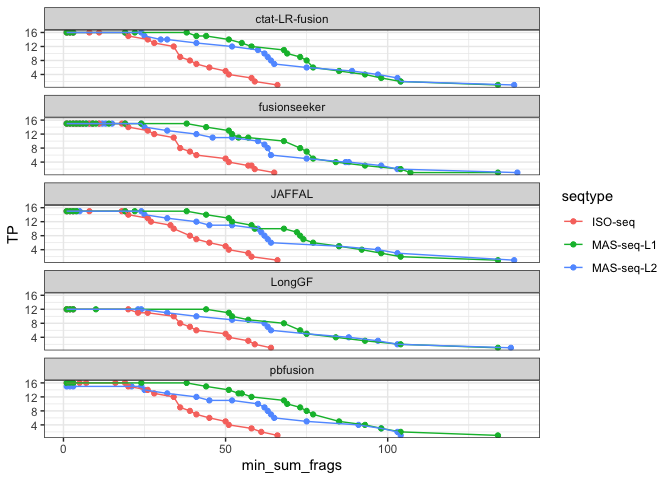
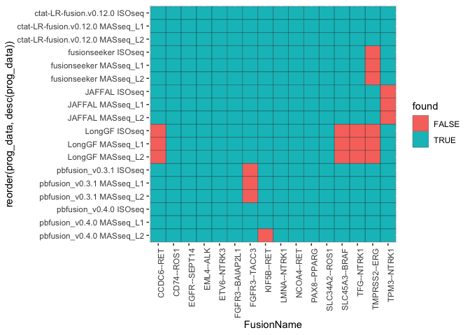
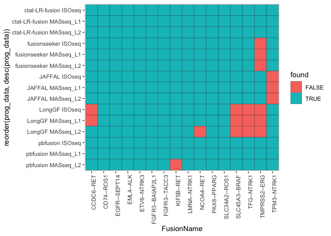

SeraCareFusionAnalysis
================
bhaas
2023-12-05

``` r
data = read.table("data/seracarefusion.allow_rev.combined_results.ROC.tsv", header=T, sep="\t", stringsAsFactors = F) %>%
    filter(! grepl("flair", prog))

head(data)
```

    ##   seqtype         prog min_sum_frags TP FP FN  TPR  PPV    F1
    ## 1 ISO-seq fusionseeker             3 15 77  1 0.94 0.16 0.273
    ## 2 ISO-seq fusionseeker             4 15 11  1 0.94 0.58 0.717
    ## 3 ISO-seq fusionseeker             5 15  7  1 0.94 0.68 0.789
    ## 4 ISO-seq fusionseeker             6 15  6  1 0.94 0.71 0.809
    ## 5 ISO-seq fusionseeker             8 15  5  1 0.94 0.75 0.834
    ## 6 ISO-seq fusionseeker             9 15  4  1 0.94 0.79 0.858

``` r
TP_plot = data %>% 
    select(seqtype, prog, min_sum_frags, TP) %>% 
    ggplot(aes(x=min_sum_frags, y=TP)) +
    geom_point(aes(color=seqtype)) + geom_line(aes(group=seqtype, color=seqtype)) +
    facet_wrap(~prog, ncol=1)

TP_plot
```

<!-- -->

# Examine the specific control fusions

``` r
Isoseq_fusions = read.table("data/Iso-seq.fusion_preds.txt.scored.gz", header=T, com='', sep="\t") %>%
    mutate(dataset="ISOseq")

Masseq_L1_fusions = read.table("data/MAS-seq-L1.fusion_preds.txt.scored.gz", header=T, sep="\t", com='') %>% mutate(dataset = "MASseq_L1")

Masseq_L2_fusions = read.table("data/MAS-seq-L2.fusion_preds.txt.scored.gz", header=T, sep="\t", com='') %>% mutate(dataset = "MASseq_L2")


fusion_preds = bind_rows(Isoseq_fusions, Masseq_L1_fusions, Masseq_L2_fusions)

fusion_preds %>% head()
```

    ##   pred_class  sample         prog            fusion
    ## 1         TP ISO-seq fusionseeker        KIF5B--RET
    ## 2         TP ISO-seq fusionseeker     SLC34A2--ROS1
    ## 3         TP ISO-seq fusionseeker      TACC3--FGFR3
    ## 4         FP ISO-seq fusionseeker AC096579.13--IGKC
    ## 5         TP ISO-seq fusionseeker       LMNA--NTRK1
    ## 6         TP ISO-seq fusionseeker        CD74--ROS1
    ##                       breakpoint num_reads
    ## 1 chr10:32017142--chr10:43114478        66
    ## 2  chr4:25664329--chr6:117324416        59
    ## 3     chr4:1739701--chr4:1806935        58
    ## 4   chr2:88861257--chr2:88897782        57
    ## 5 chr1:156130774--chr1:156874903        52
    ## 6 chr5:150404679--chr6:117324416        51
    ##                                                                                                                                     mapped_gencode_A_gene_list
    ## 1                                                                                                                                                        KIF5B
    ## 2                                                                                                                                                      SLC34A2
    ## 3                                                                                                                                             AC016773.1,TACC3
    ## 4 AC096579.13,AC096579.15,AC096579.7,AC244205.1,AC244205.2,AK128525,CR623415,IGKC,IGKJ2,IGKJ3,IGKJ4,IGKJ5,IGKV1-12,IGKV1-8,IGKV3-11,Ig[kappa],MIR4436A,abParts
    ## 5                                                                                                                       AP006222.1,LMNA,SRGAP2,SRGAP2B,SRGAP2D
    ## 6                                                                                                                                              AL732372.2,CD74
    ##                                                                                                                                                                                                                                                                                                                                                                                          mapped_gencode_B_gene_list
    ## 1                                                                                                                                                                                                                                                                                                                                                                                                               RET
    ## 2                                                                                                                                                                                                                                                                                                                                                       7SK,7SK.155,7SK.232,GOPC,RN7SKP18,RN7SKP51,ROS1,RP1-179P9.3
    ## 3                                                                                                                                                                                                                                                                                                                                                                                                             FGFR3
    ## 4 AC096579.13,AC096579.15,AC096579.7,AC096767.2,AC244255.1,AK128525,IGKC,IGKJ1,IGKJ2,IGKJ3,IGKJ4,IGKJ5,IGKV1-12,IGKV1-13,IGKV1-16,IGKV1-17,IGKV1-22,IGKV1-27,IGKV1-5,IGKV1-6,IGKV1-8,IGKV1-9,IGKV2-10,IGKV2-14,IGKV2-18,IGKV2-19,IGKV2-23,IGKV2-24,IGKV2-26,IGKV2-28,IGKV2-29,IGKV2-30,IGKV2-4,IGKV3-11,IGKV3-15,IGKV3-20,IGKV3-25,IGKV3-7,IGKV4-1,IGKV5-2,IGKV6-21,IGKV7-3,Ig[kappa],PGBD4P5,RP11-421K23.1,abParts
    ## 5                                                                                                                                                                                                                                                                                                                                                              AP006222.1,INSRR,NTRK1,SH2D2A,SRGAP2,SRGAP2B,SRGAP2D
    ## 6                                                                                                                                                                                                                                                                                                                                                       7SK,7SK.155,7SK.232,GOPC,RN7SKP18,RN7SKP51,ROS1,RP1-179P9.3
    ##                                                                                                                                                                                                                                          annots
    ## 1                                                                     [RET:FoundationOne_panel,RET:OncomapV4_panel,RET:Oncogene,RET:ArcherDX_panel,RET:OncocartaV1_panel];[ChimerKB,ChimerPub,Cosmic,ChimerSeq];INTRACHROMOSOMAL[chr10:11.02Mb]
    ## 2    [SLC34A2:Oncogene];[ROS1:Oncogene,ROS1:FoundationOne_panel,ROS1:ArcherDX_panel];[ChimerKB,DepMap2023,ChimerSeq,TCGA_StarF2019,CCLE_StarF2019,Klijn_CellLines,GUO2018CR_TCGA,chimerdb_pubmed,ChimerPub,Cosmic];INTERCHROMOSOMAL[chr4--chr6]
    ## 3                                                     [TACC3:Oncogene];[FGFR3:Oncogene,FGFR3:ArcherDX_panel,FGFR3:FoundationOne_panel,FGFR3:OncomapV4_panel,FGFR3:OncocartaV1_panel];[ChimerPub];INTRACHROMOSOMAL[chr4:0.05Mb];NEIGHBORS[48131]
    ## 4                                                                                                                                                                                                                                             .
    ## 5                                                                                                      [NTRK1:FoundationOne_panel,NTRK1:ArcherDX_panel,NTRK1:Oncogene];[ChimerKB,ChimerPub,Cosmic,TCGA_StarF2019];INTRACHROMOSOMAL[chr1:0.68Mb]
    ## 6 [CD74:Oncogene];[ROS1:Oncogene,ROS1:FoundationOne_panel,ROS1:ArcherDX_panel];[ChimerKB,ChimerSeq,TCGA_StarF2019,Klijn_CellLines,chimerdb_pubmed,DEEPEST2019,GUO2018CR_TCGA,ChimerPub,TumorFusionsNAR2018,Cosmic];INTERCHROMOSOMAL[chr5--chr6]
    ##   selected_fusion
    ## 1      KIF5B--RET
    ## 2   SLC34A2--ROS1
    ## 3    FGFR3--TACC3
    ## 4               .
    ## 5     LMNA--NTRK1
    ## 6      CD74--ROS1
    ##                                                      explanation dataset
    ## 1                  first encounter of TP fusionseeker,KIF5B--RET  ISOseq
    ## 2               first encounter of TP fusionseeker,SLC34A2--ROS1  ISOseq
    ## 3 first encounter of TP fusionseeker,FGFR3--TACC3 (TACC3--FGFR3)  ISOseq
    ## 4    first encounter of FP fusion fusionseeker,AC096579.13--IGKC  ISOseq
    ## 5                 first encounter of TP fusionseeker,LMNA--NTRK1  ISOseq
    ## 6                  first encounter of TP fusionseeker,CD74--ROS1  ISOseq

``` r
control_fusions = read.table("data/SeraCare_fusion_targets.tsv", header=T, sep="\t") %>% select(FusionName)

control_fusions
```

    ##         FusionName
    ## 1       KIF5B--RET
    ## 2    SLC34A2--ROS1
    ## 3     FGFR3--TACC3
    ## 4      LMNA--NTRK1
    ## 5       CD74--ROS1
    ## 6     TMPRSS2--ERG
    ## 7       NCOA4--RET
    ## 8  FGFR3--BAIAP2L1
    ## 9      TPM3--NTRK1
    ## 10      CCDC6--RET
    ## 11     PAX8--PPARG
    ## 12    EGFR--SEPT14
    ## 13   SLC45A3--BRAF
    ## 14       EML4--ALK
    ## 15     ETV6--NTRK3
    ## 16      TFG--NTRK1

``` r
control_fusions_found = fusion_preds %>% filter(pred_class == "TP") %>% 
    select(dataset, prog, selected_fusion) %>% unique() %>% mutate(found=TRUE)


progs = fusion_preds %>% select(prog, dataset) %>% unique()

control_fusions_found = full_join(cross_join(control_fusions, progs),
                                   control_fusions_found,
                                   by=c('prog', 'FusionName'='selected_fusion', 'dataset')) %>%
    mutate(found = (! is.na(found)))


control_fusions_found %>% head()
```

    ##   FusionName                   prog   dataset found
    ## 1 KIF5B--RET           fusionseeker    ISOseq  TRUE
    ## 2 KIF5B--RET        pbfusion_v0.4.0    ISOseq  TRUE
    ## 3 KIF5B--RET                 LongGF    ISOseq  TRUE
    ## 4 KIF5B--RET                 JAFFAL    ISOseq  TRUE
    ## 5 KIF5B--RET ctat-LR-fusion.v0.13.0    ISOseq  TRUE
    ## 6 KIF5B--RET           fusionseeker MASseq_L1  TRUE

``` r
seracare_prog_compare_plot = control_fusions_found %>%  filter(! grepl("flairfusion", prog)) %>%
    mutate(prog = factor(prog, levels = c('ctat-LR-fusion.v0.13.0', 'fusionseeker', 'LongGF', 'JAFFAL', 'pbfusion_v0.4.0'))) %>%
    mutate(prog_data = paste(prog, dataset)) %>%
    ggplot(aes(x=FusionName, y=reorder(prog_data, desc(prog_data)))) +
    geom_tile(aes(fill=found), color='black') + 
    #scale_y_reverse() +
     theme(axis.text.x = element_text(angle = 90, hjust = 1)) 
#+
#        theme(panel.border = element_blank(), panel.grid.major = element_blank(),
#        panel.grid.minor = element_blank(), axis.line = element_line(colour = "black"))


seracare_prog_compare_plot
```

<!-- -->

pbfusion v0.4.0 does find KIF5B–RET but breakpoint coordinates aren’t
one-to-one so was ignored.

``` r
seracare_prog_compare_plot = control_fusions_found %>%  filter(! grepl("flairfusion", prog)) %>%
    mutate(prog = factor(prog, levels = c('ctat-LR-fusion.v0.13.0', 'fusionseeker', 'LongGF', 'JAFFAL', 'pbfusion_v0.4.0'))) %>%
    mutate(found = ifelse(prog=='pbfusion_v0.4.0', TRUE, found)) %>% # see note above
    mutate(prog_data = paste(prog, dataset)) %>%
    ggplot(aes(x=FusionName, y=reorder(prog_data, desc(prog_data)))) +
    geom_tile(aes(fill=found), color='black') + 
    #scale_y_reverse() +
     theme(axis.text.x = element_text(angle = 90, hjust = 1)) 
#+
#        theme(panel.border = element_blank(), panel.grid.major = element_blank(),
#        panel.grid.minor = element_blank(), axis.line = element_line(colour = "black"))


seracare_prog_compare_plot
```

<!-- -->

``` r
ggsave(seracare_prog_compare_plot, file="seracare_prog_compare_plot.heatmap.svg", width=7, height=4)
```

``` r
fusion_preds %>% filter(fusion == "TMPRSS2--ERG") %>%
    filter(prog == "ctat-LR-fusion.v0.13.0")
```

    ##   pred_class     sample                   prog       fusion
    ## 1         TP    ISO-seq ctat-LR-fusion.v0.13.0 TMPRSS2--ERG
    ## 2         TP MAS-seq-L1 ctat-LR-fusion.v0.13.0 TMPRSS2--ERG
    ## 3         TP MAS-seq-L2 ctat-LR-fusion.v0.13.0 TMPRSS2--ERG
    ##                       breakpoint num_reads mapped_gencode_A_gene_list
    ## 1 chr21:41508081--chr21:38584945        45                    TMPRSS2
    ## 2 chr21:41508081--chr21:38584945        98                    TMPRSS2
    ## 3 chr21:41508081--chr21:38584945       104                    TMPRSS2
    ##   mapped_gencode_B_gene_list
    ## 1               ERG,SNRPGP13
    ## 2               ERG,SNRPGP13
    ## 3               ERG,SNRPGP13
    ##                                                                                                                                                                                                                                                                                                                                     annots
    ## 1 [TMPRSS2:FoundationOne_panel,TMPRSS2:Oncogene,TMPRSS2:ArcherDX_panel];[ERG:FoundationOne_panel,ERG:ArcherDX_panel,ERG:Oncogene];[ChimerKB,Larsson_TCGA,DepMap2023,ChimerSeq,TCGA_StarF2019,CCLE_StarF2019,YOSHIHARA_TCGA,chimerdb_pubmed,DEEPEST2019,GUO2018CR_TCGA,ChimerPub,TumorFusionsNAR2018,Cosmic];INTRACHROMOSOMAL[chr21:2.80Mb]
    ## 2 [TMPRSS2:FoundationOne_panel,TMPRSS2:Oncogene,TMPRSS2:ArcherDX_panel];[ERG:FoundationOne_panel,ERG:ArcherDX_panel,ERG:Oncogene];[ChimerKB,Larsson_TCGA,DepMap2023,ChimerSeq,TCGA_StarF2019,CCLE_StarF2019,YOSHIHARA_TCGA,chimerdb_pubmed,DEEPEST2019,GUO2018CR_TCGA,ChimerPub,TumorFusionsNAR2018,Cosmic];INTRACHROMOSOMAL[chr21:2.80Mb]
    ## 3 [TMPRSS2:FoundationOne_panel,TMPRSS2:Oncogene,TMPRSS2:ArcherDX_panel];[ERG:FoundationOne_panel,ERG:ArcherDX_panel,ERG:Oncogene];[ChimerKB,Larsson_TCGA,DepMap2023,ChimerSeq,TCGA_StarF2019,CCLE_StarF2019,YOSHIHARA_TCGA,chimerdb_pubmed,DEEPEST2019,GUO2018CR_TCGA,ChimerPub,TumorFusionsNAR2018,Cosmic];INTRACHROMOSOMAL[chr21:2.80Mb]
    ##   selected_fusion                                               explanation
    ## 1    TMPRSS2--ERG first encounter of TP ctat-LR-fusion.v0.13.0,TMPRSS2--ERG
    ## 2    TMPRSS2--ERG first encounter of TP ctat-LR-fusion.v0.13.0,TMPRSS2--ERG
    ## 3    TMPRSS2--ERG first encounter of TP ctat-LR-fusion.v0.13.0,TMPRSS2--ERG
    ##     dataset
    ## 1    ISOseq
    ## 2 MASseq_L1
    ## 3 MASseq_L2

``` r
# found with 45, 98, and 104 long reads support by CTAT-LRF
```
