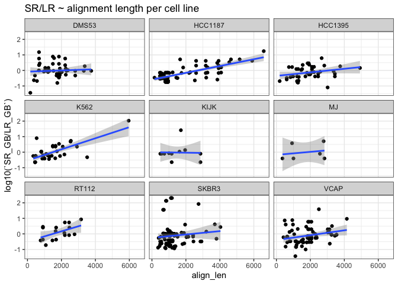

examine_3prime_breakpoint_readlengths
================
bhaas
2024-02-10

``` r
files = list.files("../data/", "*read_lengths.tsv.gz")

data = NULL

for (file in files) {
    df = read.table(paste0("../data/", file), sep="\t", header=T, check.names = FALSE)
    df$sample = str_replace(file, ".3prime_brkpt_read_lengths.tsv", "")
    data = bind_rows(data, df)
}

data %>% head()
```

    ##                     FusionName LeftLocalBreakpoint RightLocalBreakpoint
    ## 1      AP003900.6--bP-2189O9.3                1122                 9713
    ## 2                 CPSF6--NR0B1               11046                23329
    ## 3 CTD-2008L17.1--RP11-456O19.2                1405                15417
    ## 4      CTD-2561J22.5--C14orf93                4371                17067
    ## 5             FGF14-IT1--FGF14                1762                13725
    ## 6                GALNT8--PRMT8               10904                33021
    ##   threePrimeBrkLen align_len num_LR num_SR LR_FFPM SR_FFPM       SR/LR   sample
    ## 1               59     169.0    103   8.00  24.582  0.2333 0.009490684 DMS53.gz
    ## 2              355     439.0      1   1.00   0.239  0.0292 0.122175732 DMS53.gz
    ## 3              232     667.0      5  10.61   1.193  0.3095 0.259430008 DMS53.gz
    ## 4             1528    1763.0      1   1.00   0.239  0.0292 0.122175732 DMS53.gz
    ## 5             2525    2809.0      1   2.00   0.239  0.0583 0.243933054 DMS53.gz
    ## 6             1685    2022.5      6  10.11   1.432  0.2949 0.205935754 DMS53.gz

## Examine according to relative FFPM support

``` r
data %>% ggplot(aes(y=`SR/LR`, x=threePrimeBrkLen)) + geom_point() +
    facet_wrap(~sample, scale='free') +
     stat_smooth(method = "lm", 
              formula = y ~ x, 
              geom = "smooth") 
```

<!-- -->

``` r
data %>% ggplot(aes(y=log10(`SR/LR`), x=threePrimeBrkLen)) + geom_point() +
    facet_wrap(~sample) +
     stat_smooth(method = "lm", 
              formula = y ~ x, 
              geom = "smooth")
```

<!-- -->

# Examine according to reads per GB sequenced.

``` r
library(data.table)
```

    ## 
    ## Attaching package: 'data.table'

    ## The following objects are masked from 'package:lubridate':
    ## 
    ##     hour, isoweek, mday, minute, month, quarter, second, wday, week,
    ##     yday, year

    ## The following objects are masked from 'package:dplyr':
    ## 
    ##     between, first, last

    ## The following object is masked from 'package:purrr':
    ## 
    ##     transpose

``` r
data_GB = fread("../DepMap_v1v2mrgd.ctatLRF_FI.consolidated.tsv.gz", header=T, sep="\t", stringsAsFactors = F, drop=c("LR_accessions", "JunctionReads", "SpanningFrags", "CounterFusionLeftReads", "CounterFusionRightReads")) %>% rename(FusionName = fusion)
```

    ## Warning in fread("../DepMap_v1v2mrgd.ctatLRF_FI.consolidated.tsv.gz", header =
    ## T, : Column name 'LR_accessions' (drop[1]) not found

    ## Warning in fread("../DepMap_v1v2mrgd.ctatLRF_FI.consolidated.tsv.gz", header =
    ## T, : Column name 'JunctionReads' (drop[2]) not found

    ## Warning in fread("../DepMap_v1v2mrgd.ctatLRF_FI.consolidated.tsv.gz", header =
    ## T, : Column name 'SpanningFrags' (drop[3]) not found

    ## Warning in fread("../DepMap_v1v2mrgd.ctatLRF_FI.consolidated.tsv.gz", header =
    ## T, : Column name 'CounterFusionLeftReads' (drop[4]) not found

    ## Warning in fread("../DepMap_v1v2mrgd.ctatLRF_FI.consolidated.tsv.gz", header =
    ## T, : Column name 'CounterFusionRightReads' (drop[5]) not found

``` r
data_GB = right_join(
                    data_GB %>% group_by(FusionName, LeftLocalBreakpoint, RightLocalBreakpoint) %>% arrange(desc(SR_FFPGB)) %>% filter(row_number() == 1) %>% ungroup(),
                    
                     data %>% select(FusionName, RightLocalBreakpoint, threePrimeBrkLen, align_len), 
                    
                     by=c('FusionName', 'RightLocalBreakpoint') )
```

    ## Warning in right_join(data_GB %>% group_by(FusionName, LeftLocalBreakpoint, : Detected an unexpected many-to-many relationship between `x` and `y`.
    ## ℹ Row 1 of `x` matches multiple rows in `y`.
    ## ℹ Row 226 of `y` matches multiple rows in `x`.
    ## ℹ If a many-to-many relationship is expected, set `relationship =
    ##   "many-to-many"` to silence this warning.

``` r
data_GB = data_GB %>% mutate(`SR_GB/LR_GB` = SR_FFPGB/LR_FFPGB)
```

``` r
SR_LR_ratio_vs_3prime_brkpt_dist_plot = data_GB %>% 
    mutate(threePrimeBrkLenAdj = ifelse(threePrimeBrkLen < 2000, 2000, threePrimeBrkLen)) %>%
    ggplot(aes(y=log10(`SR_GB/LR_GB`), x=threePrimeBrkLen)) + 
    theme_bw() +
    geom_point(aes(color=threePrimeBrkLenAdj)) +
    stat_smooth(method = "lm", 
              formula = y ~ x, 
              geom = "smooth") +
    geom_hline(yintercept=0) +
    ggtitle("short/long read support per GB sequenced ~ brkpt distance from 3' end of read")

SR_LR_ratio_vs_3prime_brkpt_dist_plot
```

    ## Warning: Removed 51 rows containing non-finite values (`stat_smooth()`).

    ## Warning: Removed 51 rows containing missing values (`geom_point()`).

<!-- -->

``` r
ggsave(SR_LR_ratio_vs_3prime_brkpt_dist_plot, file="SR_LR_ratio_vs_3prime_brkpt_dist_plot.svg", width=6, height=4)
```

    ## Warning: Removed 51 rows containing non-finite values (`stat_smooth()`).

    ## Warning: Removed 51 rows containing missing values (`geom_point()`).

``` r
cor.test(data_GB$threePrimeBrkLen, log10(data_GB$`SR_GB/LR_GB`))
```

    ## 
    ##  Pearson's product-moment correlation
    ## 
    ## data:  data_GB$threePrimeBrkLen and log10(data_GB$`SR_GB/LR_GB`)
    ## t = 5.6823, df = 384, p-value = 2.63e-08
    ## alternative hypothesis: true correlation is not equal to 0
    ## 95 percent confidence interval:
    ##  0.1837965 0.3680867
    ## sample estimates:
    ##       cor 
    ## 0.2785031

``` r
# R=0.28, p=2.6e-8
```

``` r
brkpt_dist_findings_plot = data_GB %>% 
    mutate(threePrimeBrkLenAdj = ifelse(threePrimeBrkLen < 2000, 2000, threePrimeBrkLen)) %>%
    ggplot(aes(y=log10(`SR_GB/LR_GB`), x=threePrimeBrkLen)) + 
    theme_bw() +
    geom_point(aes(color=threePrimeBrkLenAdj)) +
    facet_wrap(~sample) +
     stat_smooth(method = "lm", 
              formula = y ~ x, 
              geom = "smooth") +
    geom_hline(yintercept=0) +
    ggtitle("short/long read support per GB sequenced ~ brkpt distance from 3' end of read")

brkpt_dist_findings_plot
```

    ## Warning: Removed 51 rows containing non-finite values (`stat_smooth()`).

    ## Warning: Removed 51 rows containing missing values (`geom_point()`).

<!-- -->

``` r
ggsave(brkpt_dist_findings_plot, file="SRenrich_vs_3primebrkptdist.svg", width=9, height=7)
```

    ## Warning: Removed 51 rows containing non-finite values (`stat_smooth()`).

    ## Warning: Removed 51 rows containing missing values (`geom_point()`).

``` r
cell_lines = data_GB %>% select(sample) %>% unique() %>% pull(sample)

threeprimebrklen_summary_stats = NULL

for (cell_line in cell_lines) {
    #print(cell_line)
    cell_line_data = data_GB %>% filter(sample == cell_line)
    #print(cell_line_data)
    c = cor.test(cell_line_data$threePrimeBrkLen, log10(cell_line_data$`SR_GB/LR_GB`))
    #print(c)
    
    R = c$estimate
    p = c$p.value
    
    threeprimebrklen_summary_stats = bind_rows(threeprimebrklen_summary_stats, data.frame(sample=cell_line, R=R, p=p))
    
}

threeprimebrklen_summary_stats %>% arrange(p, R)
```

    ##          sample           R            p
    ## cor...1 HCC1187  0.67739619 5.771054e-10
    ## cor...2    K562  0.63604842 1.202175e-04
    ## cor...3    VCAP  0.23844855 4.848666e-02
    ## cor...4    KIJK  0.53129350 9.260243e-02
    ## cor...5   SKBR3  0.17268262 9.424523e-02
    ## cor...6   DMS53  0.18056608 2.245269e-01
    ## cor...7      MJ  0.22553635 6.674316e-01
    ## cor...8   RT112 -0.08456064 7.386793e-01
    ## cor...9 HCC1395  0.04253139 7.839897e-01

``` r
data_GB = data_GB %>% group_by(sample) %>% arrange(desc(`SR_GB/LR_GB`)) %>% mutate(rn=row_number()) %>% ungroup() 
```

``` r
SRenrich_vs_ranking_plot = data_GB %>%
    mutate(threePrimeBrkLenAdj = ifelse(threePrimeBrkLen < 2000, 2000, threePrimeBrkLen)) %>%
    ggplot() + theme_bw() +
    geom_point(aes(x=rn, y=log10(`SR_GB/LR_GB`), color=threePrimeBrkLenAdj)) +
    facet_wrap(~sample) +
    geom_hline(yintercept=0) +
    ggtitle("Fusions ranked by SR/LR support per GB sequenced")

SRenrich_vs_ranking_plot
```

    ## Warning: Removed 51 rows containing missing values (`geom_point()`).

<!-- -->

``` r
ggsave(SRenrich_vs_ranking_plot, file="SRenrich_vs_ranking.svg", width=9, height=7)
```

    ## Warning: Removed 51 rows containing missing values (`geom_point()`).

``` r
data_GB %>%
    filter(rn <= 5) %>%
    arrange(sample, rn) %>%
    select(sample, FusionName, threePrimeBrkLen, `SR_GB/LR_GB`)
```

    ## # A tibble: 45 × 4
    ##    sample  FusionName                   threePrimeBrkLen `SR_GB/LR_GB`
    ##    <chr>   <chr>                                   <dbl>         <dbl>
    ##  1 DMS53   USP43--CNTLN                             366          15.0 
    ##  2 DMS53   RP11-59N23.3--CMAS                      1037           7.77
    ##  3 DMS53   RP11-59N23.1--CMAS                      1393           6.20
    ##  4 DMS53   RP11-507B12.1--RP11-507B12.2             622           2.82
    ##  5 DMS53   NLRP1--STAT5A                           3281           1.88
    ##  6 HCC1187 PUM1--TRERF1                            4142.         17.4 
    ##  7 HCC1187 RP11-123O10.4--GRIP1                    4851           5.15
    ##  8 HCC1187 RP11-123O10.4--GRIP1                    1523           5.15
    ##  9 HCC1187 RP11-123O10.4--GRIP1                    4390           5.15
    ## 10 HCC1187 SEC22B--NOTCH2                          5782           4.18
    ## # ℹ 35 more rows

``` r
# 106-fold difference in BCR::ABL1 detection from SR vs. LR based on GB sequenced.

# sample  FusionName 3'-len  SR_GB/LR_GB
# K562  BCR--ABL1   4649.5  105.7
```

# K562 example

``` r
K562_brkpt_dist_findings_plot = data_GB %>% 
    filter(sample == "K562") %>%
    mutate(threePrimeBrkLenAdj = ifelse(threePrimeBrkLen < 2000, 2000, threePrimeBrkLen)) %>%
    ggplot(aes(y=log10(`SR_GB/LR_GB`), x=threePrimeBrkLen)) + 
    theme_bw() +
    geom_point(aes(color=threePrimeBrkLenAdj)) +
    geom_hline(yintercept=0) +
     stat_smooth(method = "lm", 
              formula = y ~ x, 
              geom = "smooth") +
    ggtitle("K562 short/long read support per GB sequenced ~ brkpt distance from 3' end of read")


K562_brkpt_dist_findings_plot
```

    ## Warning: Removed 1 rows containing non-finite values (`stat_smooth()`).

    ## Warning: Removed 1 rows containing missing values (`geom_point()`).

<!-- -->

``` r
ggsave(K562_brkpt_dist_findings_plot, file="K562_SRenrich_vs_3primebrkptdist.svg", width=6, height=4)
```

    ## Warning: Removed 1 rows containing non-finite values (`stat_smooth()`).

    ## Warning: Removed 1 rows containing missing values (`geom_point()`).

``` r
# K562 BCR::ABL1 log10(SR/LR) is only significantly correlated with 3' breakpoint read length when BCR--ABL1 is included

K562_data_GB = data_GB %>% filter(sample == "K562") %>% filter(FusionName != "BCR--ABL1")

cor.test(K562_data_GB$threePrimeBrkLen, log10(K562_data_GB$`SR_GB/LR_GB`))
```

    ## 
    ##  Pearson's product-moment correlation
    ## 
    ## data:  K562_data_GB$threePrimeBrkLen and log10(K562_data_GB$`SR_GB/LR_GB`)
    ## t = 1.9054, df = 28, p-value = 0.06704
    ## alternative hypothesis: true correlation is not equal to 0
    ## 95 percent confidence interval:
    ##  -0.02445982  0.62301995
    ## sample estimates:
    ##       cor 
    ## 0.3387949

``` r
# cor = 0.34, p=0.07
```

``` r
K562_SRenrich_vs_ranking_plot = data_GB %>%
    filter(sample=="K562") %>%
    mutate(threePrimeBrkLenAdj = ifelse(threePrimeBrkLen < 2000, 2000, threePrimeBrkLen)) %>%
    ggplot() + theme_bw() +
    geom_point(aes(x=rn, y=log10(`SR_GB/LR_GB`), color=threePrimeBrkLenAdj)) +
    geom_hline(yintercept=0) +
    ggtitle("K562 Fusions ranked by SR/LR support per GB sequenced")

K562_SRenrich_vs_ranking_plot
```

    ## Warning: Removed 1 rows containing missing values (`geom_point()`).

<!-- -->

``` r
ggsave(K562_SRenrich_vs_ranking_plot, file="K562_SRenrich_vs_ranking.svg", width=6, height=4)
```

    ## Warning: Removed 1 rows containing missing values (`geom_point()`).

Worth noting, there are 2 long reads we find supporting K562 BCR::ABL1.
The read lengths are:

7373 4540

and here’s info from the alignment lengths:

0 FusionName 1 num_LR 2 num_SR 3 LeftLocalBreakpoint 4 LeftBreakpoint 5
RightLocalBreakpoint 6 RightBreakpoint 7 SpliceType 8 LR_FFPM 9 SR_FFPM
10 LR_accessions 11 long_read_fusion_token 12 align_len 13
threePrimeBrkLen

0 BCR–ABL1 1 2.0 2 372.27 3 21553 4 chr22:23290413:+ 5 43957 6
chr9:130854064:+ 7 ONLY_REF_SPLICE 8 0.32 9 9.8283 10
m84056_230620_213907_s3/221317094/ccs/6083_10623 11
BCR–ABL1::m84056_230620_213907_s3/221317094/ccs/6083_10623 12 4539 13
4000

0 BCR–ABL1 1 2.0 2 372.27 3 21553 4 chr22:23290413:+ 5 43957 6
chr9:130854064:+ 7 ONLY_REF_SPLICE 8 0.32 9 9.8283 10
m84056_230620_213907_s3/89655393/ccs/902_8275 11
BCR–ABL1::m84056_230620_213907_s3/89655393/ccs/902_8275 12 7381 13 5299

# Examine SR enrichment \~ fusion transcript length

``` r
data_GB %>% ggplot(aes(x=align_len, y=log10(`SR_GB/LR_GB`))) + geom_point() +
    theme_bw() +
    stat_smooth(method = "lm", 
              formula = y ~ x, 
              geom = "smooth") +
      geom_hline(yintercept=0) +
    ggtitle("SR/LR ~ alignment length")
```

    ## Warning: Removed 51 rows containing non-finite values (`stat_smooth()`).

    ## Warning: Removed 51 rows containing missing values (`geom_point()`).

<!-- -->

``` r
cor.test(data_GB$align_len, log10(data_GB$`SR_GB/LR_GB`))
```

    ## 
    ##  Pearson's product-moment correlation
    ## 
    ## data:  data_GB$align_len and log10(data_GB$`SR_GB/LR_GB`)
    ## t = 6.582, df = 384, p-value = 1.526e-10
    ## alternative hypothesis: true correlation is not equal to 0
    ## 95 percent confidence interval:
    ##  0.2257625 0.4053370
    ## sample estimates:
    ##       cor 
    ## 0.3184033

``` r
data_GB %>% ggplot(aes(x=align_len, y=log10(`SR_GB/LR_GB`))) + geom_point() +
    theme_bw() +
    stat_smooth(method = "lm", 
              formula = y ~ x, 
              geom = "smooth") +
    facet_wrap(~sample) +
    ggtitle("SR/LR ~ alignment length per cell line")
```

    ## Warning: Removed 51 rows containing non-finite values (`stat_smooth()`).

    ## Warning: Removed 51 rows containing missing values (`geom_point()`).

<!-- -->

``` r
cell_lines = data_GB %>% select(sample) %>% unique() %>% pull(sample)

summary_stats = NULL

for (cell_line in cell_lines) {
    #print(cell_line)
    cell_line_data = data_GB %>% filter(sample == cell_line)
    #print(cell_line_data)
    c = cor.test(cell_line_data$align_len, log10(cell_line_data$`SR_GB/LR_GB`))
    #print(c)
    
    R = c$estimate
    p = c$p.value
    
    summary_stats = bind_rows(summary_stats, data.frame(sample=cell_line, R=R, p=p))
    
}

summary_stats %>% arrange(p, R)
```

    ##          sample           R            p
    ## cor...1 HCC1187  0.73483834 3.206855e-12
    ## cor...2    K562  0.72941546 3.238620e-06
    ## cor...3    VCAP  0.29727467 1.311638e-02
    ## cor...4   RT112  0.48436157 4.165241e-02
    ## cor...5 HCC1395  0.27527159 7.052925e-02
    ## cor...6   DMS53  0.13899255 3.514609e-01
    ## cor...7   SKBR3  0.08323079 4.226185e-01
    ## cor...8      MJ  0.20958874 6.902202e-01
    ## cor...9    KIJK -0.02463739 9.426796e-01

# we find the most distal breakpoints with the longest fusion RNAs

``` r
data_GB %>% ggplot(aes(x=align_len, y=threePrimeBrkLen)) + geom_point()
```

<!-- -->

``` r
cor.test(data_GB$threePrimeBrkLen, data_GB$align_len)
```

    ## 
    ##  Pearson's product-moment correlation
    ## 
    ## data:  data_GB$threePrimeBrkLen and data_GB$align_len
    ## t = 36.712, df = 435, p-value < 2.2e-16
    ## alternative hypothesis: true correlation is not equal to 0
    ## 95 percent confidence interval:
    ##  0.8445616 0.8906449
    ## sample estimates:
    ##       cor 
    ## 0.8694825

ie. if the breakpoint is far away from the 3’ end, we’ll obviously only
capture it with the longest of fusion reads sequenced.
