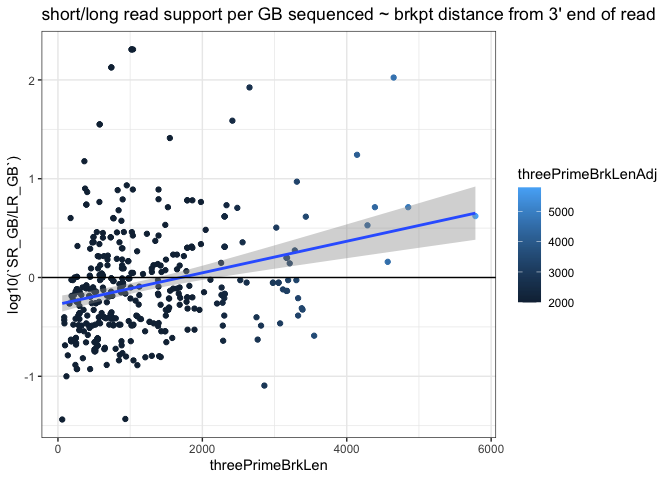

examine_3prime_breakpoint_readlengths
================
bhaas
2024-02-10

``` r
files = list.files("../data/", "*read_lengths.tsv.gz")

data = NULL

for (file in files) {
    df = read.table(paste0("../data/", file), sep="\t", header=T, check.names = FALSE)
    df$sample = str_replace(file, ".3prime_brkpt_read_lengths.tsv", "")
    data = bind_rows(data, df)
}

data %>% head()
```

    ##                     FusionName LeftLocalBreakpoint RightLocalBreakpoint
    ## 1      AP003900.6--bP-2189O9.3                1122                 9713
    ## 2                 CPSF6--NR0B1               11046                23329
    ## 3 CTD-2008L17.1--RP11-456O19.2                1405                15417
    ## 4      CTD-2561J22.5--C14orf93                4371                17067
    ## 5             FGF14-IT1--FGF14                1762                13725
    ## 6                GALNT8--PRMT8               10904                33021
    ##   threePrimeBrkLen num_LR num_SR LR_FFPM SR_FFPM       SR/LR   sample
    ## 1               59    103   8.00  24.582  0.2333 0.009490684 DMS53.gz
    ## 2              355      1   1.00   0.239  0.0292 0.122175732 DMS53.gz
    ## 3              232      5  10.61   1.193  0.3095 0.259430008 DMS53.gz
    ## 4             1528      1   1.00   0.239  0.0292 0.122175732 DMS53.gz
    ## 5             2525      1   2.00   0.239  0.0583 0.243933054 DMS53.gz
    ## 6             1685      6  10.11   1.432  0.2949 0.205935754 DMS53.gz

## Examine according to relative FFPM support

``` r
data %>% ggplot(aes(y=`SR/LR`, x=threePrimeBrkLen)) + geom_point() +
    facet_wrap(~sample, scale='free') +
     stat_smooth(method = "lm", 
              formula = y ~ x, 
              geom = "smooth") 
```

<!-- -->

``` r
data %>% ggplot(aes(y=log10(`SR/LR`), x=threePrimeBrkLen)) + geom_point() +
    facet_wrap(~sample) +
     stat_smooth(method = "lm", 
              formula = y ~ x, 
              geom = "smooth")
```

<!-- -->

# Examine according to reads per GB sequenced.

``` r
library(data.table)
```

    ## 
    ## Attaching package: 'data.table'

    ## The following objects are masked from 'package:lubridate':
    ## 
    ##     hour, isoweek, mday, minute, month, quarter, second, wday, week,
    ##     yday, year

    ## The following objects are masked from 'package:dplyr':
    ## 
    ##     between, first, last

    ## The following object is masked from 'package:purrr':
    ## 
    ##     transpose

``` r
data_GB = fread("../DepMap_v1v2mrgd.ctatLRF_FI.consolidated.tsv.gz", header=T, sep="\t", stringsAsFactors = F, drop=c("LR_accessions", "JunctionReads", "SpanningFrags", "CounterFusionLeftReads", "CounterFusionRightReads")) %>% rename(FusionName = fusion)
```

``` r
data_GB = right_join(
                    data_GB %>% group_by(FusionName, LeftLocalBreakpoint, RightLocalBreakpoint) %>% arrange(desc(SR_FFPGB)) %>% filter(row_number() == 1) %>% ungroup(),
                    
                     data %>% select(FusionName, RightLocalBreakpoint, threePrimeBrkLen), 
                    
                     by=c('FusionName', 'RightLocalBreakpoint') )
```

    ## Warning in right_join(data_GB %>% group_by(FusionName, LeftLocalBreakpoint, : Detected an unexpected many-to-many relationship between `x` and `y`.
    ## ℹ Row 1 of `x` matches multiple rows in `y`.
    ## ℹ Row 226 of `y` matches multiple rows in `x`.
    ## ℹ If a many-to-many relationship is expected, set `relationship =
    ##   "many-to-many"` to silence this warning.

``` r
data_GB = data_GB %>% mutate(`SR_GB/LR_GB` = SR_FFPGB/LR_FFPGB)
```

``` r
brkpt_dist_findings_plot = data_GB %>% 
    mutate(threePrimeBrkLenAdj = ifelse(threePrimeBrkLen < 2000, 2000, threePrimeBrkLen)) %>%
    ggplot(aes(y=log10(`SR_GB/LR_GB`), x=threePrimeBrkLen)) + 
    theme_bw() +
    geom_point(aes(color=threePrimeBrkLenAdj)) +
    facet_wrap(~sample) +
    # stat_smooth(method = "lm", 
    #          formula = y ~ x, 
    #          geom = "smooth")
    geom_hline(yintercept=0) +
    ggtitle("short/long read support per GB sequenced ~ brkpt distance from 3' end of read")

brkpt_dist_findings_plot
```

    ## Warning: Removed 51 rows containing missing values (`geom_point()`).

<!-- -->

``` r
ggsave(brkpt_dist_findings_plot, file="SRenrich_vs_3primebrkptdist.svg", width=9, height=7)
```

    ## Warning: Removed 51 rows containing missing values (`geom_point()`).

``` r
data_GB = data_GB %>% group_by(sample) %>% arrange(desc(`SR_GB/LR_GB`)) %>% mutate(rn=row_number()) %>% ungroup() 
```

``` r
SRenrich_vs_ranking_plot = data_GB %>%
    mutate(threePrimeBrkLenAdj = ifelse(threePrimeBrkLen < 2000, 2000, threePrimeBrkLen)) %>%
    ggplot() + theme_bw() +
    geom_point(aes(x=rn, y=log10(`SR_GB/LR_GB`), color=threePrimeBrkLenAdj)) +
    facet_wrap(~sample) +
    geom_hline(yintercept=0) +
    ggtitle("Fusions ranked by SR/LR support per GB sequenced")

SRenrich_vs_ranking_plot
```

    ## Warning: Removed 51 rows containing missing values (`geom_point()`).

<!-- -->

``` r
ggsave(SRenrich_vs_ranking_plot, file="SRenrich_vs_ranking.svg", width=9, height=7)
```

    ## Warning: Removed 51 rows containing missing values (`geom_point()`).

``` r
data_GB %>%
    filter(rn <= 5) %>%
    arrange(sample, rn) %>%
    select(sample, FusionName, threePrimeBrkLen, `SR_GB/LR_GB`)
```

    ## # A tibble: 45 × 4
    ##    sample  FusionName                   threePrimeBrkLen `SR_GB/LR_GB`
    ##    <chr>   <chr>                                   <dbl>         <dbl>
    ##  1 DMS53   USP43--CNTLN                             366          15.0 
    ##  2 DMS53   RP11-59N23.3--CMAS                      1037           7.77
    ##  3 DMS53   RP11-59N23.1--CMAS                      1393           6.20
    ##  4 DMS53   RP11-507B12.1--RP11-507B12.2             622           2.82
    ##  5 DMS53   NLRP1--STAT5A                           3281           1.88
    ##  6 HCC1187 PUM1--TRERF1                            4142.         17.4 
    ##  7 HCC1187 RP11-123O10.4--GRIP1                    4851           5.15
    ##  8 HCC1187 RP11-123O10.4--GRIP1                    1523           5.15
    ##  9 HCC1187 RP11-123O10.4--GRIP1                    4390           5.15
    ## 10 HCC1187 SEC22B--NOTCH2                          5782           4.18
    ## # ℹ 35 more rows

``` r
# 106-fold difference in BCR::ABL1 detection from SR vs. LR based on GB sequenced.
```

``` r
# examine correlations

data_GB_min2k = data_GB %>% filter(threePrimeBrkLen >= 2000)

cor.test(data_GB_min2k$`SR_GB/LR_GB`, data_GB_min2k$threePrimeBrkLen)
```

    ## 
    ##  Pearson's product-moment correlation
    ## 
    ## data:  data_GB_min2k$`SR_GB/LR_GB` and data_GB_min2k$threePrimeBrkLen
    ## t = 1.6872, df = 60, p-value = 0.09675
    ## alternative hypothesis: true correlation is not equal to 0
    ## 95 percent confidence interval:
    ##  -0.03901312  0.43924765
    ## sample estimates:
    ##       cor 
    ## 0.2128289

``` r
# cor = 0.21, p = 0.1 (for min 2k from breakpoint)
```

# K562 example

``` r
K562_brkpt_dist_findings_plot = data_GB %>% 
    filter(sample == "K562") %>%
    mutate(threePrimeBrkLenAdj = ifelse(threePrimeBrkLen < 2000, 2000, threePrimeBrkLen)) %>%
    ggplot(aes(y=log10(`SR_GB/LR_GB`), x=threePrimeBrkLen)) + 
    theme_bw() +
    geom_point(aes(color=threePrimeBrkLenAdj)) +
    geom_hline(yintercept=0) +
    ggtitle("K562 short/long read support per GB sequenced ~ brkpt distance from 3' end of read")


K562_brkpt_dist_findings_plot
```

    ## Warning: Removed 1 rows containing missing values (`geom_point()`).

<!-- -->

``` r
ggsave(K562_brkpt_dist_findings_plot, file="K562_SRenrich_vs_3primebrkptdist.svg", width=6, height=4)
```

    ## Warning: Removed 1 rows containing missing values (`geom_point()`).

``` r
K562_SRenrich_vs_ranking_plot = data_GB %>%
    filter(sample=="K562") %>%
    mutate(threePrimeBrkLenAdj = ifelse(threePrimeBrkLen < 2000, 2000, threePrimeBrkLen)) %>%
    ggplot() + theme_bw() +
    geom_point(aes(x=rn, y=log10(`SR_GB/LR_GB`), color=threePrimeBrkLenAdj)) +
    geom_hline(yintercept=0) +
    ggtitle("K562 Fusions ranked by SR/LR support per GB sequenced")

K562_SRenrich_vs_ranking_plot
```

    ## Warning: Removed 1 rows containing missing values (`geom_point()`).

<!-- -->

``` r
ggsave(K562_SRenrich_vs_ranking_plot, file="K562_SRenrich_vs_ranking.svg", width=6, height=4)
```

    ## Warning: Removed 1 rows containing missing values (`geom_point()`).
