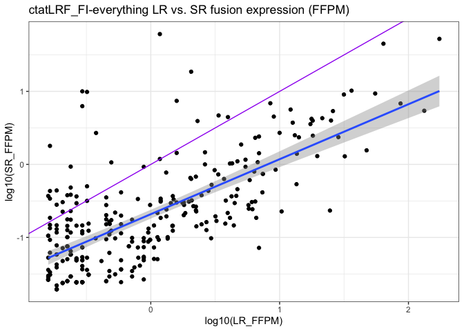
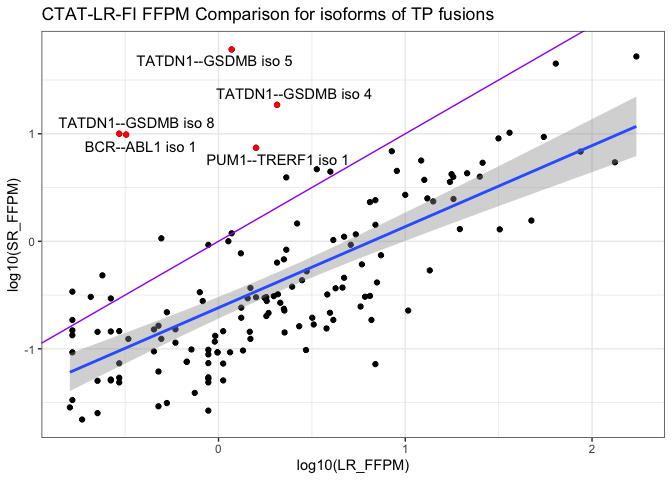
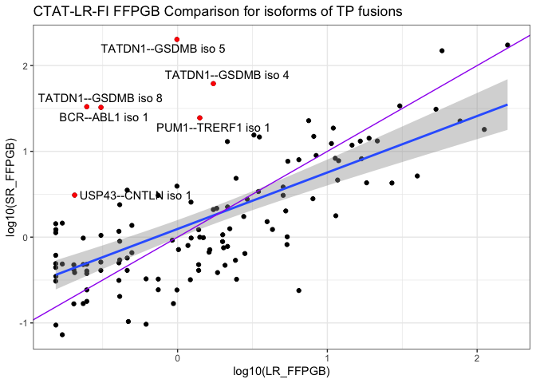
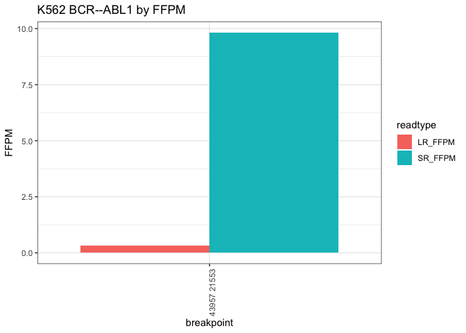

CTAT_DepMap9Lines
================
bhaas
2023-12-05

``` r
data = read.table("data/DepMap_v1v2mrgd.ctatLRF_FI.consolidated.tsv.gz", header=T, sep="\t", com='') %>% 
    rename(sample=X.sample, fusion = X.FusionName)


data %>% head()
```

    ##   sample                fusion num_LR      LeftGene LeftLocalBreakpoint
    ## 1   VCAP RP11-208G20.2--PSPHP1    583 RP11-208G20.2                1093
    ## 2   VCAP           VWA2--PRKCH    119          VWA2                2302
    ## 3   VCAP        PIK3C2A--TEAD1    110       PIK3C2A                1136
    ## 4   VCAP           TIA1--DIRC2     45          TIA1                1256
    ## 5   VCAP       C16orf70--ENKD1     42      C16orf70                1282
    ## 6   VCAP         HJURP--EIF4E2     42         HJURP               10025
    ##      LeftBreakpoint RightGene RightLocalBreakpoint  RightBreakpoint
    ## 1   chr7:55761799:+    PSPHP1                 5244  chr7:55773181:+
    ## 2 chr10:114248765:+     PRKCH                34021 chr14:61443111:+
    ## 3  chr11:17207848:-     TEAD1                48381 chr11:12862250:+
    ## 4   chr2:70248405:-     DIRC2                23328 chr3:122833317:+
    ## 5  chr16:67110239:+     ENKD1                20466 chr16:67666265:-
    ## 6  chr2:233840609:-    EIF4E2                19495 chr2:232556416:+
    ##            SpliceType LR_FFPM JunctionReadCount SpanningFragCount est_J est_S
    ## 1 INCL_NON_REF_SPLICE  96.011                NA                NA    NA    NA
    ## 2     ONLY_REF_SPLICE  19.597                39                 3  39.0  3.00
    ## 3     ONLY_REF_SPLICE  18.115                80                 0  80.0  0.00
    ## 4     ONLY_REF_SPLICE   7.411                31                17  15.5  8.50
    ## 5     ONLY_REF_SPLICE   6.917                 2                 1   2.0  0.33
    ## 6     ONLY_REF_SPLICE   6.917                57                21  57.0 21.00
    ##                   LeftGene_SR              RightGene_SR LargeAnchorSupport
    ## 1                                                                         
    ## 2     VWA2^ENSG00000165816.11  PRKCH^ENSG00000027075.12                YES
    ## 3  PIK3C2A^ENSG00000011405.12  TEAD1^ENSG00000187079.13                YES
    ## 4     TIA1^ENSG00000116001.14   DIRC2^ENSG00000138463.8                YES
    ## 5 C16orf70^ENSG00000125149.10  ENKD1^ENSG00000124074.10                YES
    ## 6    HJURP^ENSG00000123485.10 EIF4E2^ENSG00000135930.12                YES
    ##   NumCounterFusionLeft NumCounterFusionRight FAR_left FAR_right LeftBreakDinuc
    ## 1                   NA                    NA       NA        NA               
    ## 2                   43                    61     0.98      0.69             GT
    ## 3                  101                    49     0.79      1.62             GT
    ## 4                  126                    32     0.39      1.48             GT
    ## 5                    6                     1     0.57      2.00             GT
    ## 6                  127                   308     0.62      0.26             GT
    ##   LeftBreakEntropy RightBreakDinuc RightBreakEntropy   FFPM microh_brkpt_dist
    ## 1               NA                                NA     NA                NA
    ## 2           1.8892              AG            1.9656 1.2986              7132
    ## 3           1.9656              AG            1.5656 2.4733              3219
    ## 4           1.9656              AG            1.7465 0.7420              1205
    ## 5           1.9219              AG            1.8323 0.0720              3287
    ## 6           1.7465              AG            1.5656 2.4116               369
    ##   num_microh_near_brkpt
    ## 1                    NA
    ## 2                     0
    ## 3                     0
    ## 4                     0
    ## 5                     0
    ## 6                     0
    ##                                                           annots max_LR_FFPM
    ## 1                               [INTRACHROMOSOMAL[chr7:96.59Mb]]      96.011
    ## 2                [CCLE_StarF2019,INTERCHROMOSOMAL[chr10--chr14]]      19.597
    ## 3                [CCLE_StarF2019,INTRACHROMOSOMAL[chr11:4.13Mb]]      18.115
    ## 4                  [CCLE_StarF2019,INTERCHROMOSOMAL[chr2--chr3]]       7.411
    ## 5                [CCLE_StarF2019,INTRACHROMOSOMAL[chr16:0.51Mb]]       6.917
    ## 6 [chimerdb_pubmed,CCLE_StarF2019,INTRACHROMOSOMAL[chr2:1.25Mb]]       6.917
    ##   frac_dom_iso above_frac_dom_iso
    ## 1            1               True
    ## 2            1               True
    ## 3            1               True
    ## 4            1               True
    ## 5            1               True
    ## 6            1               True

# compare long vs. short read fusion evidence, normalized by sequencing depth

``` r
data %>% ggplot(aes(x=log10(LR_FFPM), y=log10(FFPM))) + geom_point() +
    ggtitle("LR vs. SR fusion expression (FFPM)") +                                      
  stat_smooth(method = "lm", 
              formula = y ~ x, 
              geom = "smooth") + 
    geom_abline(intercept=0, slope=1, color='purple')
```

    ## Warning: Removed 9208 rows containing non-finite values (`stat_smooth()`).

    ## Warning: Removed 9208 rows containing missing values (`geom_point()`).

<!-- -->

``` r
cor.test(x=log2(data$LR_FFPM), y=log2(data$FFPM), use='complete.obs')
```

    ## 
    ##  Pearson's product-moment correlation
    ## 
    ## data:  log2(data$LR_FFPM) and log2(data$FFPM)
    ## t = 16.048, df = 263, p-value < 2.2e-16
    ## alternative hypothesis: true correlation is not equal to 0
    ## 95 percent confidence interval:
    ##  0.6368587 0.7595053
    ## sample estimates:
    ##       cor 
    ## 0.7033795

# restrict to the TP fusions

``` r
TP_fusions = read.table("../3b.DepMap9Lines_Benchmarking/3b.2.IncludeIlluminaSupportedFusions/data/min_2.okPara_ignoreUnsure.results.scored", 
                        header=T, sep="\t", stringsAsFactors = F) %>% 
    filter(pred_result == "TP") %>%
    select(sample, fusion, pred_result) %>% unique()

TP_fusions %>% head()
```

    ##   sample         fusion pred_result
    ## 1  RT112   TACC3--FGFR3          TP
    ## 2   KIJK      ALK--NPM1          TP
    ## 3   KIJK  TAF12--YTHDF2          TP
    ## 4   VCAP    PRKCH--VWA2          TP
    ## 5   VCAP PIK3C2A--TEAD1          TP
    ## 6   VCAP  HJURP--EIF4E2          TP

``` r
data = left_join(data, TP_fusions,
                 by=c('sample','fusion') )
```

``` r
# by read counts

data %>% filter(pred_result == "TP") %>%
     mutate(num_SR = est_J + est_S) %>%
    group_by(sample, fusion) %>% arrange(desc(num_LR), desc(num_SR))  %>% mutate(fusion = paste(fusion, 'iso', row_number())) %>% ungroup() %>%
    #mutate(fusion = paste(fusion, LeftBreakpoint, RightBreakpoint)) %>%
   
    #group_by(sample, fusion) %>% arrange(desc(num_LR), desc(num_SR)) %>% filter(row_number() == 1) %>% ungroup() %>%
    select(sample, fusion, num_LR, num_SR) %>% 
    gather(key=read_type, value=read_count, num_LR, num_SR) %>%
    ggplot(aes(x=fusion, y=read_count)) + geom_bar(stat='identity', position = 'dodge', aes(fill=read_type)) +
    
    facet_grid(. ~ sample, scales = "free", space='free') +
    scale_x_discrete(expand = c(0, 0.5))  +
    
    #facet_wrap(~sample, scale='free') +
    # 
    theme(axis.text.x = element_text(angle = 90, hjust = 1))
```

    ## Warning: Removed 62 rows containing missing values (`geom_bar()`).

<!-- -->

``` r
# by FFPM

data %>% filter(pred_result == "TP") %>%
     mutate(num_SR = est_J + est_S) %>%
     rename(SR_FFPM = FFPM) %>%
    group_by(sample, fusion) %>% arrange(desc(num_LR), desc(num_SR))  %>% mutate(fusion = paste(fusion, 'iso', row_number())) %>% ungroup() %>%
    #mutate(fusion = paste(fusion, LeftBreakpoint, RightBreakpoint)) %>%
   
    #group_by(sample, fusion) %>% arrange(desc(num_LR), desc(num_SR)) %>% filter(row_number() == 1) %>% ungroup() %>%
    select(sample, fusion, LR_FFPM, SR_FFPM) %>% 
    gather(key=FFPM_type, value=FFPM, LR_FFPM, SR_FFPM) %>%
    
    mutate(FFPM = FFPM * 100) %>%
    
    ggplot(aes(x=fusion, y=FFPM)) + geom_bar(stat='identity', position = 'dodge', aes(fill=FFPM_type)) +
    
    facet_grid(. ~ sample, scales = "free", space='free') +
    scale_x_discrete(expand = c(0, 0.5))  +
    
    scale_y_continuous(trans='log10') +
    
    #facet_wrap(~sample, scale='free') +
    # 
    theme(axis.text.x = element_text(angle = 90, hjust = 1)) +
    
    ylab("FFPM * 100")
```

    ## Warning: Removed 62 rows containing missing values (`geom_bar()`).

<!-- -->

``` r
# label those fusions that have the most extreme difference with SR >> LR

SR_enriched_fusion_isoforms = data %>% filter(pred_result == "TP") %>%
     mutate(num_SR = est_J + est_S) %>%
    group_by(sample, fusion) %>% arrange(desc(num_LR), desc(num_SR))  %>% 
    mutate(fusion = paste(fusion, 'iso', row_number())) %>% ungroup() %>%
    select(sample, fusion, LR_FFPM, FFPM) %>% 
    rename(SR_FFPM = FFPM) %>%
    mutate(SR_enrichment = SR_FFPM / LR_FFPM) %>%
    arrange(desc(SR_enrichment))


SR_enriched_fusion_isoforms %>% filter(SR_enrichment > 1)
```

    ## # A tibble: 16 × 5
    ##    sample  fusion                   LR_FFPM SR_FFPM SR_enrichment
    ##    <chr>   <chr>                      <dbl>   <dbl>         <dbl>
    ##  1 SKBR3   TATDN1--GSDMB iso 5        1.18   60.9           51.8 
    ##  2 SKBR3   TATDN1--GSDMB iso 8        0.294  10.0           34.1 
    ##  3 K562    BCR--ABL1 iso 1            0.32    9.83          30.7 
    ##  4 SKBR3   TATDN1--GSDMB iso 4        2.06   18.6            9.03
    ##  5 HCC1187 PUM1--TRERF1 iso 1         1.59    7.41           4.67
    ##  6 VCAP    ZDHHC7--ABCB9 iso 1        0.329   1.16           3.53
    ##  7 VCAP    USP10--ZDHHC7 iso 1        0.494   1.07           2.16
    ##  8 VCAP    TMPRSS2--ERG iso 4         0.165   0.340          2.06
    ##  9 DMS53   RP11-59N23.3--CMAS iso 2   0.239   0.482          2.02
    ## 10 VCAP    TMPRSS2--ERG iso 2         2.31    3.93           1.70
    ## 11 MJ      RP11-444D3.1--SOX5 iso 3   0.207   0.304          1.47
    ## 12 K562    NUP214--XKR3 iso 1         3.36    4.68           1.39
    ## 13 HCC1187 SEC22B--NOTCH2 iso 1       3.97    4.44           1.12
    ## 14 HCC1187 PLXND1--TMCC1 iso 2        0.265   0.294          1.11
    ## 15 SKBR3   DHX35--ITCH iso 1          0.882   0.926          1.05
    ## 16 SKBR3   ANKHD1--PCDH1 iso 1        1.18    1.19           1.01

``` r
data %>% filter(pred_result == "TP") %>%
     mutate(num_SR = est_J + est_S) %>%
    group_by(sample, fusion) %>% arrange(desc(num_LR), desc(num_SR))  %>% mutate(fusion = paste(fusion, 'iso', row_number())) %>% ungroup() %>%
    select(sample, fusion, LR_FFPM, FFPM) %>% 
    rename(SR_FFPM = FFPM) %>%
    ggplot(aes(x=log10(LR_FFPM), y=log10(SR_FFPM))) + geom_point() +
    stat_smooth(method = "lm", 
              formula = y ~ x, 
              geom = "smooth") + 
    geom_abline(intercept=0, slope=1, color='purple') +
    geom_point(data=SR_enriched_fusion_isoforms %>% filter(SR_enrichment>=3), color='red')  +
    geom_text(data=SR_enriched_fusion_isoforms %>% filter(SR_enrichment>=3), aes(label=fusion))
```

    ## Warning: Removed 62 rows containing non-finite values (`stat_smooth()`).

    ## Warning: Removed 62 rows containing missing values (`geom_point()`).

<!-- -->

``` r
SR_enriched_fusion_isoforms %>%
    mutate(rn = row_number() ) %>%
    ggplot(aes(x=rn, y=SR_enrichment)) + geom_point() + geom_abline(interceipt=1, slope=0, color='purple') +
    scale_y_continuous(trans='log10') +
    xlab("Fusion isoform ranked by SR_enrichment")
```

    ## Warning in geom_abline(interceipt = 1, slope = 0, color = "purple"): Ignoring
    ## unknown parameters: `interceipt`

    ## Warning: Removed 62 rows containing missing values (`geom_point()`).

<!-- -->

# examine specific fusions and breakpoint splice support

``` r
plot_fusion_expression_by_breakpoint = function(sample_name, fusion_name) {
    
    df = data %>% filter(sample == sample_name & fusion == fusion_name) %>% 
        select(sample, fusion, LeftLocalBreakpoint, RightLocalBreakpoint, num_LR, est_J, LR_FFPM, FFPM) %>% 
        arrange(sample, RightLocalBreakpoint, LeftLocalBreakpoint) %>%
        mutate(num_LR = ifelse (is.na(num_LR), 0, num_LR)) %>%
        mutate(LR_FFPM = ifelse(is.na(LR_FFPM), 0, LR_FFPM)) %>%
        mutate(est_J = ifelse(is.na(est_J), 0, est_J)) %>%
        rename(SR_FFPM = FFPM) #%>% mutate(SR_FFPM = ifelse(is.na(SR_FFPM), 0, SR_FFPM))
    
    print(df)
    
    
    p1 = df %>% gather(key=readtype, value=readcount, num_LR, est_J) %>% 
        filter(readcount > 0) %>%
        ggplot(aes(x=RightLocalBreakpoint, y=LeftLocalBreakpoint) ) + 
        ggtitle(paste(sample_name, fusion_name, "by read count")) +
        geom_point(aes(color=readtype, size=readcount), alpha=0.5) +
        facet_wrap(~readtype) 
    
    plot(p1)
    
    
    p2 = df %>% gather(key=readtype, value=FFPM, LR_FFPM, SR_FFPM) %>% 
        filter(FFPM > 0) %>%
        ggplot(aes(x=RightLocalBreakpoint, y=LeftLocalBreakpoint) ) + 
        ggtitle(paste(sample_name, fusion_name, "by FFPM")) +
        geom_point(aes(color=readtype, size=FFPM), alpha=0.5) +
        facet_wrap(~readtype) 
    
    plot(p2)
    
    p3 = df %>% gather(key=readtype, value=FFPM, LR_FFPM, SR_FFPM) %>% 
        #filter(FFPM > 0) %>%
        ggplot(aes(x=RightLocalBreakpoint, y=LeftLocalBreakpoint) ) + 
        ggtitle(paste(sample_name, fusion_name, "by FFPM")) +
        geom_point(aes(color=readtype, fill=readtype, size=FFPM), alpha=0.5) 
    
    plot(p3)
    
    
    p4 = df %>% gather(key=readtype, value=FFPM, LR_FFPM, SR_FFPM) %>% 
        mutate(breakpoint = paste(RightLocalBreakpoint, LeftLocalBreakpoint)) %>% 
        ggplot(aes(x=breakpoint, y=FFPM, fill=readtype) ) + 
        ggtitle(paste(sample_name, fusion_name, "by FFPM")) +
        geom_bar(stat='identity', position='dodge')  +
        theme(axis.text.x = element_text(angle = 90, hjust = 1))
    
    plot(p4)
    
    lm_df = lm(df$SR_FFPM ~ df$LR_FFPM)
    print(lm_df)
    lm_y_intercept=lm_df$coefficients[1]
    lm_slope=lm_df$coefficients[2]
    
    
     p5 = df %>%
        mutate(breakpoint = paste(RightLocalBreakpoint, LeftLocalBreakpoint)) %>% 
        ggplot(aes(x=LR_FFPM, y=SR_FFPM) ) +  geom_point() +  geom_abline(slope=lm_slope, intercept = lm_y_intercept) +
        ggtitle(paste(sample_name, fusion_name, "by FFPM")) 
    
    plot(p5)
    
    if(nrow(df)>2) {
        print(cor.test(df$LR_FFPM, df$SR_FFPM))
    }
}
```

## TATDN1–GSDMB

``` r
sample_name = "SKBR3"
fusion_name = "TATDN1--GSDMB"

plot_fusion_expression_by_breakpoint(sample_name, fusion_name)
```

    ##    sample        fusion LeftLocalBreakpoint RightLocalBreakpoint num_LR est_J
    ## 1   SKBR3 TATDN1--GSDMB                1434                23528      4  2499
    ## 2   SKBR3 TATDN1--GSDMB                1531                23528    123   417
    ## 3   SKBR3 TATDN1--GSDMB                2128                23528      3     3
    ## 4   SKBR3 TATDN1--GSDMB                1434                23532      0     6
    ## 5   SKBR3 TATDN1--GSDMB                1434                24410      0     7
    ## 6   SKBR3 TATDN1--GSDMB                1531                24410      1     3
    ## 7   SKBR3 TATDN1--GSDMB                1434                26465      0    21
    ## 8   SKBR3 TATDN1--GSDMB                1531                26465      3     4
    ## 9   SKBR3 TATDN1--GSDMB                1434                27181      1   411
    ## 10  SKBR3 TATDN1--GSDMB                1531                27181     14    42
    ## 11  SKBR3 TATDN1--GSDMB                1434                27467      7   763
    ## 12  SKBR3 TATDN1--GSDMB                1531                27467     34   111
    ## 13  SKBR3 TATDN1--GSDMB                1434                27956      0    10
    ##    LR_FFPM SR_FFPM
    ## 1    1.176 60.8872
    ## 2   36.163 10.2275
    ## 3    0.882  0.0736
    ## 4    0.000  0.1461
    ## 5    0.000  0.1705
    ## 6    0.294  0.0733
    ## 7    0.000  0.5117
    ## 8    0.882  0.0979
    ## 9    0.294 10.0138
    ## 10   4.116  1.0276
    ## 11   2.058 18.5848
    ## 12   9.996  2.7037
    ## 13   0.000  0.2436

<!-- --><!-- --><!-- --><!-- -->

    ## 
    ## Call:
    ## lm(formula = df$SR_FFPM ~ df$LR_FFPM)
    ## 
    ## Coefficients:
    ## (Intercept)   df$LR_FFPM  
    ##     7.82812      0.05363

<!-- -->

    ## 
    ##  Pearson's product-moment correlation
    ## 
    ## data:  df$LR_FFPM and df$SR_FFPM
    ## t = 0.10502, df = 11, p-value = 0.9182
    ## alternative hypothesis: true correlation is not equal to 0
    ## 95 percent confidence interval:
    ##  -0.5285525  0.5726491
    ## sample estimates:
    ##        cor 
    ## 0.03165013

## K562 BCR–ABL1

``` r
plot_fusion_expression_by_breakpoint("K562", "BCR--ABL1")
```

    ##   sample    fusion LeftLocalBreakpoint RightLocalBreakpoint num_LR est_J
    ## 1   K562 BCR--ABL1               21553                43957      2   272
    ##   LR_FFPM SR_FFPM
    ## 1    0.32  9.8283

<!-- --><!-- --><!-- --><!-- -->

    ## 
    ## Call:
    ## lm(formula = df$SR_FFPM ~ df$LR_FFPM)
    ## 
    ## Coefficients:
    ## (Intercept)   df$LR_FFPM  
    ##       9.828           NA

    ## Warning: Removed 1 rows containing missing values (`geom_abline()`).

<!-- -->

``` r
# HCC1187   PUM1--TRERF1 

plot_fusion_expression_by_breakpoint("HCC1187", "PUM1--TRERF1")
```

    ##    sample       fusion LeftLocalBreakpoint RightLocalBreakpoint num_LR est_J
    ## 1 HCC1187 PUM1--TRERF1               26417                37568      6   172
    ##   LR_FFPM SR_FFPM
    ## 1   1.588  7.4147

<!-- --><!-- --><!-- --><!-- -->

    ## 
    ## Call:
    ## lm(formula = df$SR_FFPM ~ df$LR_FFPM)
    ## 
    ## Coefficients:
    ## (Intercept)   df$LR_FFPM  
    ##       7.415           NA

    ## Warning: Removed 1 rows containing missing values (`geom_abline()`).

<!-- -->

``` r
# VCAP  TMPRSS2--ERG

plot_fusion_expression_by_breakpoint("VCAP", "TMPRSS2--ERG")
```

    ##   sample       fusion LeftLocalBreakpoint RightLocalBreakpoint num_LR est_J
    ## 1   VCAP TMPRSS2--ERG                3407                31121      1    11
    ## 2   VCAP TMPRSS2--ERG                3538                31121      3     0
    ## 3   VCAP TMPRSS2--ERG                3407                35606     14   127
    ## 4   VCAP TMPRSS2--ERG                3538                35606     18    17
    ## 5   VCAP TMPRSS2--ERG                4698                35606      1     1
    ##   LR_FFPM SR_FFPM
    ## 1   0.165  0.3401
    ## 2   0.494      NA
    ## 3   2.306  3.9264
    ## 4   2.964  0.5256
    ## 5   0.165  0.0927

<!-- --><!-- -->

    ## Warning: Removed 1 rows containing missing values (`geom_point()`).

<!-- -->

    ## Warning: Removed 1 rows containing missing values (`geom_bar()`).

<!-- -->

    ## 
    ## Call:
    ## lm(formula = df$SR_FFPM ~ df$LR_FFPM)
    ## 
    ## Coefficients:
    ## (Intercept)   df$LR_FFPM  
    ##      0.3691       0.6086

    ## Warning: Removed 1 rows containing missing values (`geom_point()`).

<!-- -->

    ## 
    ##  Pearson's product-moment correlation
    ## 
    ## data:  df$LR_FFPM and df$SR_FFPM
    ## t = 0.78932, df = 2, p-value = 0.5126
    ## alternative hypothesis: true correlation is not equal to 0
    ## 95 percent confidence interval:
    ##  -0.8911259  0.9864150
    ## sample estimates:
    ##      cor 
    ## 0.487363

# Examine all fusions with multiple isoforms

How many fusions do we have multiple isoforms with evidence? How many
with both short and long read support?

Are expression values correlated among isoforms according to read types?

Is the dominant isoform the same?

``` r
# how many total TP fusions did ctatLRF find evidence for?

data %>% filter(pred_result == "TP") %>% select(sample, fusion) %>% unique() %>% nrow()
```

    ## [1] 104

``` r
min_multi_isoforms = 3
```

``` r
# how many have multiple fusion isoforms?

mult_isoform_data = data %>% filter(pred_result == "TP") %>% group_by(sample, fusion) %>% filter(n()>=min_multi_isoforms) %>% ungroup()

mult_isoform_data %>% select(sample, fusion) %>% unique() %>% nrow()
```

    ## [1] 21

``` r
# how many have both LR and SR isoform support?

mult_isoform_data_both_read_types = mult_isoform_data %>% filter(num_LR > 0 & est_J > 0) %>% group_by(sample, fusion) %>% filter(n()>min_multi_isoforms) %>% ungroup() 

mult_iso_both_sample_fusion_names = mult_isoform_data_both_read_types %>% group_by(sample, fusion) %>% tally(name='num_multi_iso_both_types')

# include isoformws supported uniquely by long or short in the downstream analysis here:
mult_isoform_data_both_read_types = left_join(mult_iso_both_sample_fusion_names, mult_isoform_data, by=c('sample', 'fusion'))
```

    ## Warning in left_join(mult_iso_both_sample_fusion_names, mult_isoform_data, : Each row in `x` is expected to match at most 1 row in `y`.
    ## ℹ Row 1 of `x` matches multiple rows.
    ## ℹ If multiple matches are expected, set `multiple = "all"` to silence this
    ##   warning.

``` r
mult_iso_both_sample_fusion_names %>% arrange(desc(num_multi_iso_both_types))
```

    ## # A tibble: 5 × 3
    ## # Groups:   sample [3]
    ##   sample  fusion             num_multi_iso_both_types
    ##   <chr>   <chr>                                 <int>
    ## 1 SKBR3   TATDN1--GSDMB                             9
    ## 2 SKBR3   SAMD12--MRPL13                            8
    ## 3 SKBR3   CYTH1--EIF3H                              5
    ## 4 HCC1187 LINC01535--EXOSC10                        4
    ## 5 VCAP    TMPRSS2--ERG                              4

## Compare read support for fusion isoforms across each fusion gene

``` r
mult_isoform_data_both_read_types %>% ggplot(aes(x=log10(LR_FFPM), y=log10(FFPM))) + geom_point() +
    ggtitle("restricted to fusion genes w/ multi isoforms supported by both read types")
```

    ## Warning: Removed 5 rows containing missing values (`geom_point()`).

<!-- -->

``` r
for (i in seq(nrow(mult_iso_both_sample_fusion_names))) {
    
    sample_name = mult_iso_both_sample_fusion_names[i,1]$sample
    fusion_name =  mult_iso_both_sample_fusion_names[i,2]$fusion
    
    loc_df = mult_isoform_data_both_read_types %>% 
        filter(sample==sample_name & fusion==fusion_name) %>%
        select(sample, fusion, LeftLocalBreakpoint, RightLocalBreakpoint, num_LR, est_J, LR_FFPM, FFPM) %>% 
        arrange(sample, RightLocalBreakpoint, LeftLocalBreakpoint) %>%
        rename(SR_FFPM = FFPM) 
    
    #print(loc_df)
    
    lm_loc_df = lm(loc_df$SR_FFPM ~ loc_df$LR_FFPM)
    print(lm_loc_df)
    lm_y_intercept=lm_loc_df$coefficients[1]
    lm_slope=lm_loc_df$coefficients[2]
    
    p = loc_df %>%
        mutate(breakpoint = paste(RightLocalBreakpoint, LeftLocalBreakpoint)) %>% 
        ggplot(aes(x=LR_FFPM, y=SR_FFPM) ) +  geom_point() + geom_abline(slope=lm_slope, intercept = lm_y_intercept) +
        ggtitle(paste(sample_name, fusion_name, "by FFPM")) 
    
    plot(p)
    
    if(nrow(loc_df)>2) {
        print(cor.test(loc_df$LR_FFPM, loc_df$SR_FFPM))
    }
    
    
}
```

    ## 
    ## Call:
    ## lm(formula = loc_df$SR_FFPM ~ loc_df$LR_FFPM)
    ## 
    ## Coefficients:
    ##    (Intercept)  loc_df$LR_FFPM  
    ##        0.01608         0.04704

<!-- -->

    ## 
    ##  Pearson's product-moment correlation
    ## 
    ## data:  loc_df$LR_FFPM and loc_df$SR_FFPM
    ## t = 11.065, df = 2, p-value = 0.008069
    ## alternative hypothesis: true correlation is not equal to 0
    ## 95 percent confidence interval:
    ##  0.6609314 0.9998393
    ## sample estimates:
    ##       cor 
    ## 0.9919312 
    ## 
    ## 
    ## Call:
    ## lm(formula = loc_df$SR_FFPM ~ loc_df$LR_FFPM)
    ## 
    ## Coefficients:
    ##    (Intercept)  loc_df$LR_FFPM  
    ##       -0.09397         0.04108

<!-- -->

    ## 
    ##  Pearson's product-moment correlation
    ## 
    ## data:  loc_df$LR_FFPM and loc_df$SR_FFPM
    ## t = 22.46, df = 3, p-value = 0.0001933
    ## alternative hypothesis: true correlation is not equal to 0
    ## 95 percent confidence interval:
    ##  0.9537004 0.9998146
    ## sample estimates:
    ##       cor 
    ## 0.9970398 
    ## 
    ## 
    ## Call:
    ## lm(formula = loc_df$SR_FFPM ~ loc_df$LR_FFPM)
    ## 
    ## Coefficients:
    ##    (Intercept)  loc_df$LR_FFPM  
    ##       0.003051        0.099194

<!-- -->

    ## 
    ##  Pearson's product-moment correlation
    ## 
    ## data:  loc_df$LR_FFPM and loc_df$SR_FFPM
    ## t = 1.8389, df = 6, p-value = 0.1155
    ## alternative hypothesis: true correlation is not equal to 0
    ## 95 percent confidence interval:
    ##  -0.1807733  0.9170676
    ## sample estimates:
    ##       cor 
    ## 0.6003796 
    ## 
    ## 
    ## Call:
    ## lm(formula = loc_df$SR_FFPM ~ loc_df$LR_FFPM)
    ## 
    ## Coefficients:
    ##    (Intercept)  loc_df$LR_FFPM  
    ##        12.2617         -0.1193

    ## Warning: Removed 4 rows containing missing values (`geom_point()`).

<!-- -->

    ## 
    ##  Pearson's product-moment correlation
    ## 
    ## data:  loc_df$LR_FFPM and loc_df$SR_FFPM
    ## t = -0.18814, df = 7, p-value = 0.8561
    ## alternative hypothesis: true correlation is not equal to 0
    ## 95 percent confidence interval:
    ##  -0.7019840  0.6225159
    ## sample estimates:
    ##         cor 
    ## -0.07093017 
    ## 
    ## 
    ## Call:
    ## lm(formula = loc_df$SR_FFPM ~ loc_df$LR_FFPM)
    ## 
    ## Coefficients:
    ##    (Intercept)  loc_df$LR_FFPM  
    ##         0.3691          0.6086

    ## Warning: Removed 1 rows containing missing values (`geom_point()`).

<!-- -->

    ## 
    ##  Pearson's product-moment correlation
    ## 
    ## data:  loc_df$LR_FFPM and loc_df$SR_FFPM
    ## t = 0.78932, df = 2, p-value = 0.5126
    ## alternative hypothesis: true correlation is not equal to 0
    ## 95 percent confidence interval:
    ##  -0.8911259  0.9864150
    ## sample estimates:
    ##      cor 
    ## 0.487363

``` r
plot_fusion_expression_by_breakpoint("SKBR3", "CYTH1--EIF3H")
```

    ##   sample       fusion LeftLocalBreakpoint RightLocalBreakpoint num_LR est_J
    ## 1  SKBR3 CYTH1--EIF3H                1096                28690    451   223
    ## 2  SKBR3 CYTH1--EIF3H                1096                28912     46    22
    ## 3  SKBR3 CYTH1--EIF3H                1096                32601    161    64
    ## 4  SKBR3 CYTH1--EIF3H                1096                36015    109    53
    ## 5  SKBR3 CYTH1--EIF3H                1096                38781     10     4
    ##   LR_FFPM SR_FFPM
    ## 1 132.599  5.4317
    ## 2  13.525  0.5359
    ## 3  47.336  1.5589
    ## 4  32.047  1.2909
    ## 5   2.940  0.0974

<!-- --><!-- --><!-- --><!-- -->

    ## 
    ## Call:
    ## lm(formula = df$SR_FFPM ~ df$LR_FFPM)
    ## 
    ## Coefficients:
    ## (Intercept)   df$LR_FFPM  
    ##    -0.09397      0.04108

<!-- -->

    ## 
    ##  Pearson's product-moment correlation
    ## 
    ## data:  df$LR_FFPM and df$SR_FFPM
    ## t = 22.46, df = 3, p-value = 0.0001933
    ## alternative hypothesis: true correlation is not equal to 0
    ## 95 percent confidence interval:
    ##  0.9537004 0.9998146
    ## sample estimates:
    ##       cor 
    ## 0.9970398

``` r
plot_fusion_expression_by_breakpoint("SKBR3", "SAMD12--MRPL13")
```

    ##   sample         fusion LeftLocalBreakpoint RightLocalBreakpoint num_LR est_J
    ## 1  SKBR3 SAMD12--MRPL13                2373                22212     13     9
    ## 2  SKBR3 SAMD12--MRPL13                3503                22212     16    23
    ## 3  SKBR3 SAMD12--MRPL13                3508                22212      5     3
    ## 4  SKBR3 SAMD12--MRPL13                2373                23336      3     3
    ## 5  SKBR3 SAMD12--MRPL13                3503                23336     22     9
    ## 6  SKBR3 SAMD12--MRPL13                2373                24430      3     2
    ## 7  SKBR3 SAMD12--MRPL13                3473                24430      3     2
    ## 8  SKBR3 SAMD12--MRPL13                3503                24430     11     6
    ##   LR_FFPM SR_FFPM
    ## 1   3.822  0.3200
    ## 2   4.704  1.1026
    ## 3   1.470  0.1440
    ## 4   0.882  0.0887
    ## 5   6.468  0.3103
    ## 6   0.882  0.0526
    ## 7   0.882  0.0543
    ## 8   3.234  0.1683

<!-- --><!-- --><!-- --><!-- -->

    ## 
    ## Call:
    ## lm(formula = df$SR_FFPM ~ df$LR_FFPM)
    ## 
    ## Coefficients:
    ## (Intercept)   df$LR_FFPM  
    ##    0.003051     0.099194

<!-- -->

    ## 
    ##  Pearson's product-moment correlation
    ## 
    ## data:  df$LR_FFPM and df$SR_FFPM
    ## t = 1.8389, df = 6, p-value = 0.1155
    ## alternative hypothesis: true correlation is not equal to 0
    ## 95 percent confidence interval:
    ##  -0.1807733  0.9170676
    ## sample estimates:
    ##       cor 
    ## 0.6003796
