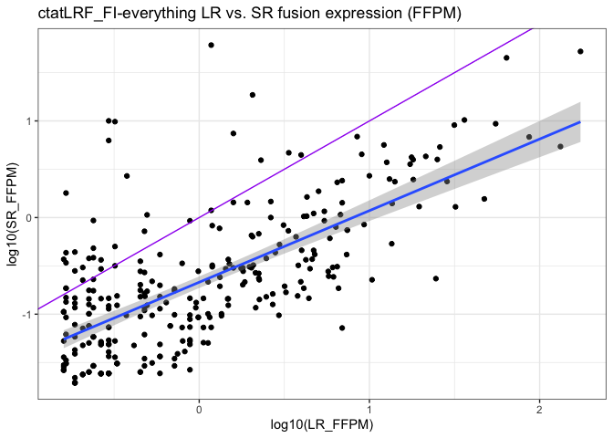

CTAT_DepMap9Lines
================
bhaas
2023-12-05

``` r
data = read.table("data/DepMap_v1v2mrgd.ctatLRF_FI.consolidated.tsv.gz", header=T, sep="\t", com='') %>% 
    rename(sample=X.sample, fusion = X.FusionName)


data %>% head()
```

    ##   sample                fusion num_LR      LeftGene LeftLocalBreakpoint
    ## 1   VCAP RP11-208G20.2--PSPHP1    583 RP11-208G20.2                1093
    ## 2   VCAP           VWA2--PRKCH    119          VWA2                2302
    ## 3   VCAP        PIK3C2A--TEAD1    110       PIK3C2A                1136
    ## 4   VCAP        C2orf42--DIRC2     45       C2orf42                1211
    ## 5   VCAP       C16orf70--ENKD1     42      C16orf70                1282
    ## 6   VCAP         HJURP--EIF4E2     42         HJURP               10025
    ##      LeftBreakpoint RightGene RightLocalBreakpoint  RightBreakpoint
    ## 1   chr7:55761799:+    PSPHP1                 5244  chr7:55773181:+
    ## 2 chr10:114248765:+     PRKCH                34021 chr14:61443111:+
    ## 3  chr11:17207848:-     TEAD1                48381 chr11:12862250:+
    ## 4   chr2:70248405:-     DIRC2                20687 chr3:122833317:+
    ## 5  chr16:67110239:+     ENKD1                20466 chr16:67666265:-
    ## 6  chr2:233840609:-    EIF4E2                19495 chr2:232556416:+
    ##            SpliceType LR_FFPM JunctionReadCount SpanningFragCount est_J est_S
    ## 1 INCL_NON_REF_SPLICE  96.011                NA                NA    NA    NA
    ## 2     ONLY_REF_SPLICE  19.597                39                 3  39.0  3.00
    ## 3     ONLY_REF_SPLICE  18.115                80                 0  80.0  0.00
    ## 4     ONLY_REF_SPLICE   7.411                31                17  15.5  8.50
    ## 5     ONLY_REF_SPLICE   6.917                 2                 1   2.0  0.33
    ## 6     ONLY_REF_SPLICE   6.917                57                21  57.0 21.00
    ##                   LeftGene_SR              RightGene_SR LargeAnchorSupport
    ## 1                                                                         
    ## 2     VWA2^ENSG00000165816.11  PRKCH^ENSG00000027075.12                YES
    ## 3  PIK3C2A^ENSG00000011405.12  TEAD1^ENSG00000187079.13                YES
    ## 4   C2orf42^ENSG00000115998.6   DIRC2^ENSG00000138463.8                YES
    ## 5 C16orf70^ENSG00000125149.10  ENKD1^ENSG00000124074.10                YES
    ## 6    HJURP^ENSG00000123485.10 EIF4E2^ENSG00000135930.12                YES
    ##   NumCounterFusionLeft NumCounterFusionRight FAR_left FAR_right LeftBreakDinuc
    ## 1                   NA                    NA       NA        NA               
    ## 2                   43                    61     0.98      0.69             GT
    ## 3                  101                    49     0.79      1.62             GT
    ## 4                    3                    32    12.25      1.48             GT
    ## 5                    6                     1     0.57      2.00             GT
    ## 6                  127                   308     0.62      0.26             GT
    ##   LeftBreakEntropy RightBreakDinuc RightBreakEntropy   FFPM microh_brkpt_dist
    ## 1               NA                                NA     NA                NA
    ## 2           1.8892              AG            1.9656 1.2986              7132
    ## 3           1.9656              AG            1.5656 2.4733              3219
    ## 4           1.9656              AG            1.7465 0.7420              1251
    ## 5           1.9219              AG            1.8323 0.0720              3287
    ## 6           1.7465              AG            1.5656 2.4116               369
    ##   num_microh_near_brkpt
    ## 1                    NA
    ## 2                     0
    ## 3                     0
    ## 4                     0
    ## 5                     0
    ## 6                     0
    ##                                                           annots max_LR_FFPM
    ## 1                               [INTRACHROMOSOMAL[chr7:96.59Mb]]      96.011
    ## 2                [CCLE_StarF2019,INTERCHROMOSOMAL[chr10--chr14]]      19.597
    ## 3                [CCLE_StarF2019,INTRACHROMOSOMAL[chr11:4.13Mb]]      18.115
    ## 4                  [CCLE_StarF2019,INTERCHROMOSOMAL[chr2--chr3]]       7.411
    ## 5                [CCLE_StarF2019,INTRACHROMOSOMAL[chr16:0.51Mb]]       6.917
    ## 6 [chimerdb_pubmed,CCLE_StarF2019,INTRACHROMOSOMAL[chr2:1.25Mb]]       6.917
    ##   frac_dom_iso above_frac_dom_iso
    ## 1            1               True
    ## 2            1               True
    ## 3            1               True
    ## 4            1               True
    ## 5            1               True
    ## 6            1               True

# compare long vs. short read fusion evidence, normalized by sequencing depth

``` r
data %>% ggplot(aes(x=log10(LR_FFPM), y=log10(FFPM))) + geom_point() +
    ggtitle("LR vs. SR fusion expression (FFPM)") +                                      
  stat_smooth(method = "lm", 
              formula = y ~ x, 
              geom = "smooth") + 
    geom_abline(intercept=0, slope=1, color='purple')
```

    ## Warning: Removed 9126 rows containing non-finite values (`stat_smooth()`).

    ## Warning: Removed 9126 rows containing missing values (`geom_point()`).

<!-- -->

``` r
cor.test(x=log2(data$LR_FFPM), y=log2(data$FFPM), use='complete.obs')
```

    ## 
    ##  Pearson's product-moment correlation
    ## 
    ## data:  log2(data$LR_FFPM) and log2(data$FFPM)
    ## t = 16.991, df = 252, p-value < 2.2e-16
    ## alternative hypothesis: true correlation is not equal to 0
    ## 95 percent confidence interval:
    ##  0.6676765 0.7833421
    ## sample estimates:
    ##       cor 
    ## 0.7307108

# restrict to the TP fusions

``` r
TP_fusions = read.table("../3b.DepMap9Lines_Benchmarking/data/min_2.okPara_ignoreUnsure.results.scored", header=T, sep="\t", stringsAsFactors = F) %>% 
    filter(pred_result == "TP") %>%
    select(sample, fusion, pred_result) %>% unique()

TP_fusions %>% head()
```

    ##   sample         fusion pred_result
    ## 1   KIJK      ALK--NPM1          TP
    ## 2   KIJK  TAF12--YTHDF2          TP
    ## 3   VCAP    PRKCH--VWA2          TP
    ## 4   VCAP PIK3C2A--TEAD1          TP
    ## 5   VCAP  HJURP--EIF4E2          TP
    ## 6   VCAP MAST4--NDUFAF2          TP

``` r
data = left_join(data, TP_fusions,
                 by=c('sample','fusion') )
```

``` r
# by read counts

data %>% filter(pred_result == "TP") %>%
     mutate(num_SR = est_J + est_S) %>%
    group_by(sample, fusion) %>% arrange(desc(num_LR), desc(num_SR))  %>% mutate(fusion = paste(fusion, 'iso', row_number())) %>% ungroup() %>%
    #mutate(fusion = paste(fusion, LeftBreakpoint, RightBreakpoint)) %>%
   
    #group_by(sample, fusion) %>% arrange(desc(num_LR), desc(num_SR)) %>% filter(row_number() == 1) %>% ungroup() %>%
    select(sample, fusion, num_LR, num_SR) %>% 
    gather(key=read_type, value=read_count, num_LR, num_SR) %>%
    ggplot(aes(x=fusion, y=read_count)) + geom_bar(stat='identity', position = 'dodge', aes(fill=read_type)) +
    
    facet_grid(. ~ sample, scales = "free", space='free') +
    scale_x_discrete(expand = c(0, 0.5))  +
    
    #facet_wrap(~sample, scale='free') +
    # 
    theme(axis.text.x = element_text(angle = 90, hjust = 1))
```

    ## Warning: Removed 35 rows containing missing values (`geom_bar()`).

<!-- -->

``` r
# label those fusions that have the most extreme difference with SR >> LR

SR_enriched_fusion_isoforms = data %>% filter(pred_result == "TP") %>%
     mutate(num_SR = est_J + est_S) %>%
    group_by(sample, fusion) %>% arrange(desc(num_LR), desc(num_SR))  %>% 
    mutate(fusion = paste(fusion, 'iso', row_number())) %>% ungroup() %>%
    select(sample, fusion, LR_FFPM, FFPM) %>% 
    rename(SR_FFPM = FFPM) %>%
    mutate(SR_enrichment = SR_FFPM / LR_FFPM) %>%
    arrange(desc(SR_enrichment))


SR_enriched_fusion_isoforms %>% head()
```

    ## # A tibble: 6 × 5
    ##   sample  fusion                   LR_FFPM SR_FFPM SR_enrichment
    ##   <chr>   <chr>                      <dbl>   <dbl>         <dbl>
    ## 1 K562    BCR--ABL1 iso 1            0.32    9.83          30.7 
    ## 2 SKBR3   TATDN1--GSDMB iso 4        2.06   18.6            9.03
    ## 3 HCC1187 PUM1--TRERF1 iso 1         1.59    7.41           4.67
    ## 4 VCAP    USP10--ZDHHC7 iso 1        0.494   1.07           2.16
    ## 5 VCAP    TMPRSS2--ERG iso 4         0.165   0.340          2.06
    ## 6 DMS53   RP11-59N23.3--CMAS iso 2   0.239   0.482          2.02

``` r
data %>% filter(pred_result == "TP") %>%
     mutate(num_SR = est_J + est_S) %>%
    group_by(sample, fusion) %>% arrange(desc(num_LR), desc(num_SR))  %>% mutate(fusion = paste(fusion, 'iso', row_number())) %>% ungroup() %>%
    select(sample, fusion, LR_FFPM, FFPM) %>% 
    rename(SR_FFPM = FFPM) %>%
    ggplot(aes(x=log10(LR_FFPM), y=log10(SR_FFPM))) + geom_point() +
    stat_smooth(method = "lm", 
              formula = y ~ x, 
              geom = "smooth") + 
    geom_abline(intercept=0, slope=1, color='purple') +
    geom_point(data=SR_enriched_fusion_isoforms %>% filter(SR_enrichment>=3), color='red')  +
    geom_text(data=SR_enriched_fusion_isoforms %>% filter(SR_enrichment>=3), aes(label=fusion))
```

    ## Warning: Removed 35 rows containing non-finite values (`stat_smooth()`).

    ## Warning: Removed 35 rows containing missing values (`geom_point()`).

<!-- -->

``` r
SR_enriched_fusion_isoforms %>%
    mutate(rn = row_number() ) %>%
    ggplot(aes(x=rn, y=SR_enrichment)) + geom_point() + geom_abline(interceipt=1, slope=0, color='purple') +
    scale_y_continuous(trans='log10') +
    xlab("Fusion isoform ranked by SR_enrichment")
```

    ## Warning in geom_abline(interceipt = 1, slope = 0, color = "purple"): Ignoring
    ## unknown parameters: `interceipt`

    ## Warning: Removed 35 rows containing missing values (`geom_point()`).

<!-- -->
