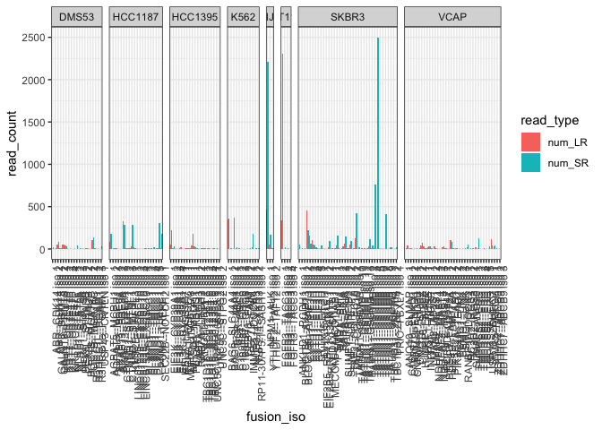
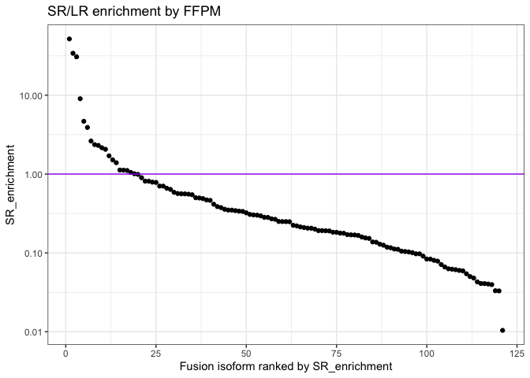

CTAT_DepMap9Lines
================
bhaas
2023-12-05

``` r
data = read.table("data/DepMap_v1v2mrgd.ctatLRF_FI.consolidated.tsv.gz", header=T, sep="\t", com='') %>% 
    rename(sample=X.sample, fusion = X.FusionName, SR_FFPM = FFPM) %>%  
    mutate(num_SR = est_J + est_S) %>%
    group_by(sample, fusion) %>% arrange(desc(num_LR), desc(num_SR))  %>% mutate(fusion_iso = paste(fusion, 'iso', row_number())) %>% ungroup()
  


data$lexsort_fusion_name = sapply(data$fusion, function(x) { paste(sort(str_split(x, "--")[[1]]), collapse="--") })
data = data %>% rowwise() %>% mutate(lexsort_fusion_name = paste0(sample, "|", lexsort_fusion_name))


data %>% head()
```

    ## # A tibble: 6 × 36
    ## # Rowwise: 
    ##   sample  fusion  num_LR LeftG…¹ LeftL…² LeftB…³ Right…⁴ Right…⁵ Right…⁶ Splic…⁷
    ##   <chr>   <chr>    <dbl> <chr>     <int> <chr>   <chr>     <int> <chr>   <chr>  
    ## 1 VCAP    RP11-2…    583 RP11-2…    1093 chr7:5… PSPHP1     5244 chr7:5… INCL_N…
    ## 2 KIJK    NPM1--…    459 NPM1       4640 chr5:1… ALK       40446 chr2:2… ONLY_R…
    ## 3 SKBR3   CYTH1-…    451 CYTH1      1096 chr17:… EIF3H     28690 chr8:1… ONLY_R…
    ## 4 K562    BAG6--…    345 BAG6       2050 chr6:3… SLC44A4   25651 chr6:3… ONLY_R…
    ## 5 RT112   FGFR3-…    343 FGFR3      9864 chr4:1… TACC3     26008 chr4:1… ONLY_R…
    ## 6 HCC1187 CTNND1…    328 CTNND1     2585 chr11:… SMTNL1    34414 chr11:… ONLY_R…
    ## # … with 26 more variables: LR_FFPM <dbl>, JunctionReadCount <dbl>,
    ## #   SpanningFragCount <dbl>, est_J <dbl>, est_S <dbl>, LeftGene_SR <chr>,
    ## #   RightGene_SR <chr>, LargeAnchorSupport <chr>, NumCounterFusionLeft <dbl>,
    ## #   NumCounterFusionRight <dbl>, FAR_left <dbl>, FAR_right <dbl>,
    ## #   LeftBreakDinuc <chr>, LeftBreakEntropy <dbl>, RightBreakDinuc <chr>,
    ## #   RightBreakEntropy <dbl>, SR_FFPM <dbl>, microh_brkpt_dist <dbl>,
    ## #   num_microh_near_brkpt <dbl>, annots <chr>, max_LR_FFPM <dbl>, …

# compare long vs. short read fusion evidence, normalized by sequencing depth

``` r
data %>% ggplot(aes(x=log10(LR_FFPM), y=log10(SR_FFPM))) + geom_point() +
    ggtitle("ctatLRF_FI-everything LR vs. SR fusion expression (FFPM)") +                                      
  stat_smooth(method = "lm", 
              formula = y ~ x, 
              geom = "smooth") + 
    geom_abline(intercept=0, slope=1, color='purple')
```

    ## Warning: Removed 9208 rows containing non-finite values (`stat_smooth()`).

    ## Warning: Removed 9208 rows containing missing values (`geom_point()`).

<!-- -->

``` r
cor.test(x=log2(data$LR_FFPM), y=log2(data$SR_FFPM), use='complete.obs')
```

    ## 
    ##  Pearson's product-moment correlation
    ## 
    ## data:  log2(data$LR_FFPM) and log2(data$SR_FFPM)
    ## t = 16.048, df = 263, p-value < 2.2e-16
    ## alternative hypothesis: true correlation is not equal to 0
    ## 95 percent confidence interval:
    ##  0.6368587 0.7595053
    ## sample estimates:
    ##       cor 
    ## 0.7033795

# restrict to the TP fusions

``` r
TP_fusions = read.table("../3b.DepMap9Lines_Benchmarking/3b.2.IncludeIlluminaSupportedFusions/data/preds.collected.gencode_mapped.wAnnot.filt.proxy_assignments.byProgAgree.min_2.truth_set", 
                        header=T, sep="\t", stringsAsFactors = F) %>% 
    select(proxy_fusion_name)

TP_fusions$sample = sapply(TP_fusions$proxy_fusion_name, function(x) { str_split(x, "\\|")[[1]][1] })
 
TP_fusions$fusion = sapply(TP_fusions$proxy_fusion_name, function(x) { str_split(x, "\\|")[[1]][2] }) 

TP_fusions$lexsort_fusion_name = sapply(TP_fusions$fusion, function(x) { paste(sort(str_split(x, "--")[[1]]), collapse="--") })
TP_fusions = TP_fusions %>% rowwise() %>% mutate(lexsort_fusion_name = paste0(sample, "|", lexsort_fusion_name))

nrow(TP_fusions)
```

    ## [1] 163

``` r
TP_fusions %>% head()
```

    ## # A tibble: 6 × 4
    ## # Rowwise: 
    ##   proxy_fusion_name       sample  fusion          lexsort_fusion_name    
    ##   <chr>                   <chr>   <chr>           <chr>                  
    ## 1 HCC1395|EIF3K--CYP39A1  HCC1395 EIF3K--CYP39A1  HCC1395|CYP39A1--EIF3K 
    ## 2 HCC1395|OSBPL9--CCDC178 HCC1395 OSBPL9--CCDC178 HCC1395|CCDC178--OSBPL9
    ## 3 HCC1395|FUBP3--PRRC2B   HCC1395 FUBP3--PRRC2B   HCC1395|FUBP3--PRRC2B  
    ## 4 SKBR3|ANKHD1--PCDH1     SKBR3   ANKHD1--PCDH1   SKBR3|ANKHD1--PCDH1    
    ## 5 VCAP|ANO10--SLMAP       VCAP    ANO10--SLMAP    VCAP|ANO10--SLMAP      
    ## 6 SKBR3|SUMF1--LRRFIP2    SKBR3   SUMF1--LRRFIP2  SKBR3|LRRFIP2--SUMF1

``` r
data = inner_join(TP_fusions %>% select(lexsort_fusion_name),
                  data,
                 by='lexsort_fusion_name',
                 multiple='all'
                 )


nrow(data)
```

    ## [1] 223

``` r
data %>% select(sample, fusion) %>% unique() %>% nrow()
```

    ## [1] 113

``` r
data %>% head()
```

    ## # A tibble: 6 × 36
    ## # Rowwise: 
    ##   lexsort…¹ sample fusion num_LR LeftG…² LeftL…³ LeftB…⁴ Right…⁵ Right…⁶ Right…⁷
    ##   <chr>     <chr>  <chr>   <dbl> <chr>     <int> <chr>   <chr>     <int> <chr>  
    ## 1 HCC1395|… HCC13… EIF3K…     54 "EIF3K"    8757 chr19:… "CYP39…   17360 chr6:4…
    ## 2 HCC1395|… HCC13… EIF3K…      2 "EIF3K"    8575 chr19:… "CYP39…   17360 chr6:4…
    ## 3 HCC1395|… HCC13… EIF3K…      1 "EIF3K"    8757 chr19:… "CYP39…   17344 chr6:4…
    ## 4 HCC1395|… HCC13… EIF3K…     NA ""         8757 chr19:… ""        17420 chr6:4…
    ## 5 HCC1395|… HCC13… OSBPL…      3 "OSBPL…    6741 chr1:5… "CCDC1…   65592 chr18:…
    ## 6 HCC1395|… HCC13… PRRC2…     46 "PRRC2…    1171 chr9:1… "FUBP3"   46698 chr9:1…
    ## # … with 26 more variables: SpliceType <chr>, LR_FFPM <dbl>,
    ## #   JunctionReadCount <dbl>, SpanningFragCount <dbl>, est_J <dbl>, est_S <dbl>,
    ## #   LeftGene_SR <chr>, RightGene_SR <chr>, LargeAnchorSupport <chr>,
    ## #   NumCounterFusionLeft <dbl>, NumCounterFusionRight <dbl>, FAR_left <dbl>,
    ## #   FAR_right <dbl>, LeftBreakDinuc <chr>, LeftBreakEntropy <dbl>,
    ## #   RightBreakDinuc <chr>, RightBreakEntropy <dbl>, SR_FFPM <dbl>,
    ## #   microh_brkpt_dist <dbl>, num_microh_near_brkpt <dbl>, annots <chr>, …

``` r
# how many genes and isoforms ahve both long and short read support:
data %>% filter(num_LR > 0 && num_SR > 0) %>% nrow()
```

    ## [1] 149

``` r
data %>% filter(num_LR > 0 && num_SR > 0) %>% select(sample, fusion) %>% unique() %>% nrow()
```

    ## [1] 93

``` r
# by read counts

data %>% 
    select(sample, fusion_iso, num_LR, num_SR) %>% 
    gather(key=read_type, value=read_count, num_LR, num_SR) %>%
    ggplot(aes(x=fusion_iso, y=read_count)) + geom_bar(stat='identity', position = 'dodge', aes(fill=read_type)) +
    
    facet_grid(. ~ sample, scales = "free", space='free') +
    scale_x_discrete(expand = c(0, 0.5))  +
    
    theme(axis.text.x = element_text(angle = 90, hjust = 1))
```

    ## Warning: Removed 74 rows containing missing values (`geom_bar()`).

<!-- -->

``` r
# by FFPM

data %>% 
    select(sample, fusion_iso, LR_FFPM, SR_FFPM) %>% 
    gather(key=FFPM_type, value=FFPM, LR_FFPM, SR_FFPM) %>%
    
    mutate(FFPM = FFPM * 100) %>%
    
    ggplot(aes(x=fusion_iso, y=FFPM)) + geom_bar(stat='identity', position = 'dodge', aes(fill=FFPM_type)) +
    
    facet_grid(. ~ sample, scales = "free", space='free') +
    scale_x_discrete(expand = c(0, 0.5))  +
    
    scale_y_continuous(trans='log10') +
    
    theme(axis.text.x = element_text(angle = 90, hjust = 1)) +
    
    ylab("FFPM * 100")
```

    ## Warning: Removed 74 rows containing missing values (`geom_bar()`).

<!-- -->

``` r
# label those fusions that have the most extreme difference with SR >> LR

SR_enriched_fusion_isoforms = data %>% 
    filter(LR_FFPM > 0 & SR_FFPM > 0) %>%
    select(sample, fusion, fusion_iso, LR_FFPM, SR_FFPM) %>% 
    rowwise() %>%
    mutate(SR_enrichment = SR_FFPM / LR_FFPM) %>%
    arrange(desc(SR_enrichment)) %>%
    ungroup() %>% mutate(rank = row_number())


SR_enriched_fusion_isoforms %>% filter(SR_enrichment > 1)
```

    ## # A tibble: 17 × 7
    ##    sample  fusion             fusion_iso           LR_FFPM SR_FFPM SR_en…¹  rank
    ##    <chr>   <chr>              <chr>                  <dbl>   <dbl>   <dbl> <int>
    ##  1 SKBR3   TATDN1--GSDMB      TATDN1--GSDMB iso 5    1.18   60.9     51.8      1
    ##  2 SKBR3   TATDN1--GSDMB      TATDN1--GSDMB iso 8    0.294  10.0     34.1      2
    ##  3 K562    BCR--ABL1          BCR--ABL1 iso 1        0.32    9.83    30.7      3
    ##  4 SKBR3   TATDN1--GSDMB      TATDN1--GSDMB iso 4    2.06   18.6      9.03     4
    ##  5 HCC1187 PUM1--TRERF1       PUM1--TRERF1 iso 1     1.59    7.41     4.67     5
    ##  6 VCAP    ZDHHC7--ABCB9      ZDHHC7--ABCB9 iso 1    0.329   1.16     3.53     6
    ##  7 VCAP    USP10--ZDHHC7      USP10--ZDHHC7 iso 1    0.494   1.07     2.16     7
    ##  8 VCAP    TMPRSS2--ERG       TMPRSS2--ERG iso 4     0.165   0.340    2.06     8
    ##  9 DMS53   RP11-59N23.3--CMAS RP11-59N23.3--CMAS …   0.239   0.482    2.02     9
    ## 10 VCAP    TMPRSS2--ERG       TMPRSS2--ERG iso 2     2.31    3.93     1.70    10
    ## 11 MJ      RP11-444D3.1--SOX5 RP11-444D3.1--SOX5 …   0.207   0.304    1.47    11
    ## 12 K562    NUP214--XKR3       NUP214--XKR3 iso 1     3.36    4.68     1.39    12
    ## 13 VCAP    ZDHHC7--H3F3B      ZDHHC7--H3F3B iso 1    0.165   0.186    1.12    13
    ## 14 HCC1187 SEC22B--NOTCH2     SEC22B--NOTCH2 iso 1   3.97    4.44     1.12    14
    ## 15 HCC1187 PLXND1--TMCC1      PLXND1--TMCC1 iso 2    0.265   0.294    1.11    15
    ## 16 SKBR3   DHX35--ITCH        DHX35--ITCH iso 1      0.882   0.926    1.05    16
    ## 17 SKBR3   ANKHD1--PCDH1      ANKHD1--PCDH1 iso 1    1.18    1.19     1.01    17
    ## # … with abbreviated variable name ¹​SR_enrichment

``` r
data %>%     
    select(sample, fusion_iso, LR_FFPM, SR_FFPM) %>% 
    ggplot(aes(x=log10(LR_FFPM), y=log10(SR_FFPM))) + geom_point() +
    stat_smooth(method = "lm", 
              formula = y ~ x, 
              geom = "smooth") + 
    geom_abline(intercept=0, slope=1, color='purple') +
    geom_point(data=SR_enriched_fusion_isoforms %>% filter(SR_enrichment>=3), color='red')  +
    geom_text_repel(data=SR_enriched_fusion_isoforms %>% filter(SR_enrichment>=3), aes(label=fusion)) +
    ggtitle("CTAT-LR-FI FFPM Comparison for isoforms of TP fusions")
```

    ## Warning: Removed 74 rows containing non-finite values (`stat_smooth()`).

    ## Warning: Removed 74 rows containing missing values (`geom_point()`).

<!-- -->

``` r
cor.test(x=log2(data$LR_FFPM), y=log2(data$SR_FFPM), use='complete.obs')
```

    ## 
    ##  Pearson's product-moment correlation
    ## 
    ## data:  log2(data$LR_FFPM) and log2(data$SR_FFPM)
    ## t = 10.819, df = 147, p-value < 2.2e-16
    ## alternative hypothesis: true correlation is not equal to 0
    ## 95 percent confidence interval:
    ##  0.5655466 0.7466610
    ## sample estimates:
    ##       cor 
    ## 0.6657989

``` r
SR_enriched_fusion_isoforms %>%
    mutate(rn = row_number() ) %>%
    ggplot(aes(x=rn, y=SR_enrichment)) + geom_point() + geom_hline(yintercept = 1.0, color='purple') +
    scale_y_continuous(trans='log10') +
    xlab("Fusion isoform ranked by SR_enrichment")
```

<!-- -->

# examine specific fusions and breakpoint splice support

``` r
plot_fusion_expression_by_breakpoint = function(sample_name, fusion_name) {
    
    df = data %>% filter(sample == sample_name & fusion == fusion_name) %>% 
        select(sample, fusion, LeftLocalBreakpoint, RightLocalBreakpoint, num_LR, est_J, LR_FFPM, SR_FFPM) %>% 
        arrange(sample, RightLocalBreakpoint, LeftLocalBreakpoint) %>%
        mutate(num_LR = ifelse (is.na(num_LR), 0, num_LR)) %>%
        mutate(LR_FFPM = ifelse(is.na(LR_FFPM), 0, LR_FFPM)) %>%
        mutate(est_J = ifelse(is.na(est_J), 0, est_J)) 
    
    print(df)
    
    
    p1 = df %>% gather(key=readtype, value=readcount, num_LR, est_J) %>% 
        filter(readcount > 0) %>%
        ggplot(aes(x=RightLocalBreakpoint, y=LeftLocalBreakpoint) ) + 
        ggtitle(paste(sample_name, fusion_name, "by read count")) +
        geom_point(aes(color=readtype, size=readcount), alpha=0.5) +
        facet_wrap(~readtype) 
    
    plot(p1)
    
    
    p2 = df %>% gather(key=readtype, value=FFPM, LR_FFPM, SR_FFPM) %>% 
        filter(FFPM > 0) %>%
        ggplot(aes(x=RightLocalBreakpoint, y=LeftLocalBreakpoint) ) + 
        ggtitle(paste(sample_name, fusion_name, "by FFPM")) +
        geom_point(aes(color=readtype, size=FFPM), alpha=0.5) +
        facet_wrap(~readtype) 
    
    plot(p2)
    
    p3 = df %>% gather(key=readtype, value=FFPM, LR_FFPM, SR_FFPM) %>% 
        ggplot(aes(x=RightLocalBreakpoint, y=LeftLocalBreakpoint) ) + 
        ggtitle(paste(sample_name, fusion_name, "by FFPM")) +
        geom_point(aes(color=readtype, fill=readtype, size=FFPM), alpha=0.5) 
    
    plot(p3)
    
    
    p4 = df %>% gather(key=readtype, value=FFPM, LR_FFPM, SR_FFPM) %>% 
        mutate(breakpoint = paste(RightLocalBreakpoint, LeftLocalBreakpoint)) %>% 
        ggplot(aes(x=breakpoint, y=FFPM, fill=readtype) ) + 
        ggtitle(paste(sample_name, fusion_name, "by FFPM")) +
        geom_bar(stat='identity', position='dodge')  +
        theme(axis.text.x = element_text(angle = 90, hjust = 1))
    
    plot(p4)
    
    lm_df = lm(df$SR_FFPM ~ df$LR_FFPM)
    print(lm_df)
    lm_y_intercept=lm_df$coefficients[1]
    lm_slope=lm_df$coefficients[2]
    
    
     p5 = df %>%
        mutate(breakpoint = paste(RightLocalBreakpoint, LeftLocalBreakpoint)) %>% 
        ggplot(aes(x=LR_FFPM, y=SR_FFPM) ) +  geom_point() +  geom_abline(slope=lm_slope, intercept = lm_y_intercept) +
        ggtitle(paste(sample_name, fusion_name, "by FFPM")) 
    
    plot(p5)
    
    if(nrow(df)>2) {
        print(cor.test(df$LR_FFPM, df$SR_FFPM))
    }
}
```

## TATDN1–GSDMB

``` r
sample_name = "SKBR3"
fusion_name = "TATDN1--GSDMB"

plot_fusion_expression_by_breakpoint(sample_name, fusion_name)
```

    ## # A tibble: 13 × 8
    ## # Rowwise: 
    ##    sample fusion        LeftLocalBreakpoint Right…¹ num_LR est_J LR_FFPM SR_FFPM
    ##    <chr>  <chr>                       <int>   <int>  <dbl> <dbl>   <dbl>   <dbl>
    ##  1 SKBR3  TATDN1--GSDMB                1434   23528      4  2499   1.18  60.9   
    ##  2 SKBR3  TATDN1--GSDMB                1531   23528    123   417  36.2   10.2   
    ##  3 SKBR3  TATDN1--GSDMB                2128   23528      3     3   0.882  0.0736
    ##  4 SKBR3  TATDN1--GSDMB                1434   23532      0     6   0      0.146 
    ##  5 SKBR3  TATDN1--GSDMB                1434   24410      0     7   0      0.170 
    ##  6 SKBR3  TATDN1--GSDMB                1531   24410      1     3   0.294  0.0733
    ##  7 SKBR3  TATDN1--GSDMB                1434   26465      0    21   0      0.512 
    ##  8 SKBR3  TATDN1--GSDMB                1531   26465      3     4   0.882  0.0979
    ##  9 SKBR3  TATDN1--GSDMB                1434   27181      1   411   0.294 10.0   
    ## 10 SKBR3  TATDN1--GSDMB                1531   27181     14    42   4.12   1.03  
    ## 11 SKBR3  TATDN1--GSDMB                1434   27467      7   763   2.06  18.6   
    ## 12 SKBR3  TATDN1--GSDMB                1531   27467     34   111  10.0    2.70  
    ## 13 SKBR3  TATDN1--GSDMB                1434   27956      0    10   0      0.244 
    ## # … with abbreviated variable name ¹​RightLocalBreakpoint

<!-- --><!-- --><!-- --><!-- -->

    ## 
    ## Call:
    ## lm(formula = df$SR_FFPM ~ df$LR_FFPM)
    ## 
    ## Coefficients:
    ## (Intercept)   df$LR_FFPM  
    ##     7.82812      0.05363

<!-- -->

    ## 
    ##  Pearson's product-moment correlation
    ## 
    ## data:  df$LR_FFPM and df$SR_FFPM
    ## t = 0.10502, df = 11, p-value = 0.9182
    ## alternative hypothesis: true correlation is not equal to 0
    ## 95 percent confidence interval:
    ##  -0.5285525  0.5726491
    ## sample estimates:
    ##        cor 
    ## 0.03165013

## K562 BCR–ABL1

``` r
plot_fusion_expression_by_breakpoint("K562", "BCR--ABL1")
```

    ## # A tibble: 1 × 8
    ## # Rowwise: 
    ##   sample fusion    LeftLocalBreakpoint RightLocal…¹ num_LR est_J LR_FFPM SR_FFPM
    ##   <chr>  <chr>                   <int>        <int>  <dbl> <dbl>   <dbl>   <dbl>
    ## 1 K562   BCR--ABL1               21553        43957      2   272    0.32    9.83
    ## # … with abbreviated variable name ¹​RightLocalBreakpoint

<!-- --><!-- --><!-- --><!-- -->

    ## 
    ## Call:
    ## lm(formula = df$SR_FFPM ~ df$LR_FFPM)
    ## 
    ## Coefficients:
    ## (Intercept)   df$LR_FFPM  
    ##       9.828           NA

    ## Warning: Removed 1 rows containing missing values (`geom_abline()`).

<!-- -->

``` r
# HCC1187   PUM1--TRERF1 

plot_fusion_expression_by_breakpoint("HCC1187", "PUM1--TRERF1")
```

    ## # A tibble: 1 × 8
    ## # Rowwise: 
    ##   sample  fusion       LeftLocalBreakpoint RightL…¹ num_LR est_J LR_FFPM SR_FFPM
    ##   <chr>   <chr>                      <int>    <int>  <dbl> <dbl>   <dbl>   <dbl>
    ## 1 HCC1187 PUM1--TRERF1               26417    37568      6   172    1.59    7.41
    ## # … with abbreviated variable name ¹​RightLocalBreakpoint

<!-- --><!-- --><!-- --><!-- -->

    ## 
    ## Call:
    ## lm(formula = df$SR_FFPM ~ df$LR_FFPM)
    ## 
    ## Coefficients:
    ## (Intercept)   df$LR_FFPM  
    ##       7.415           NA

    ## Warning: Removed 1 rows containing missing values (`geom_abline()`).

<!-- -->

``` r
# VCAP  TMPRSS2--ERG

plot_fusion_expression_by_breakpoint("VCAP", "TMPRSS2--ERG")
```

    ## # A tibble: 5 × 8
    ## # Rowwise: 
    ##   sample fusion       LeftLocalBreakpoint RightLo…¹ num_LR est_J LR_FFPM SR_FFPM
    ##   <chr>  <chr>                      <int>     <int>  <dbl> <dbl>   <dbl>   <dbl>
    ## 1 VCAP   TMPRSS2--ERG                3407     31121      1    11   0.165  0.340 
    ## 2 VCAP   TMPRSS2--ERG                3538     31121      3     0   0.494 NA     
    ## 3 VCAP   TMPRSS2--ERG                3407     35606     14   127   2.31   3.93  
    ## 4 VCAP   TMPRSS2--ERG                3538     35606     18    17   2.96   0.526 
    ## 5 VCAP   TMPRSS2--ERG                4698     35606      1     1   0.165  0.0927
    ## # … with abbreviated variable name ¹​RightLocalBreakpoint

<!-- --><!-- -->

    ## Warning: Removed 1 rows containing missing values (`geom_point()`).

<!-- -->

    ## Warning: Removed 1 rows containing missing values (`geom_bar()`).

<!-- -->

    ## 
    ## Call:
    ## lm(formula = df$SR_FFPM ~ df$LR_FFPM)
    ## 
    ## Coefficients:
    ## (Intercept)   df$LR_FFPM  
    ##      0.3691       0.6086

    ## Warning: Removed 1 rows containing missing values (`geom_point()`).

<!-- -->

    ## 
    ##  Pearson's product-moment correlation
    ## 
    ## data:  df$LR_FFPM and df$SR_FFPM
    ## t = 0.78932, df = 2, p-value = 0.5126
    ## alternative hypothesis: true correlation is not equal to 0
    ## 95 percent confidence interval:
    ##  -0.8911259  0.9864150
    ## sample estimates:
    ##      cor 
    ## 0.487363

# Examine all fusions with multiple isoforms

How many fusions do we have multiple isoforms with evidence? How many
with both short and long read support?

Are expression values correlated among isoforms according to read types?

Is the dominant isoform the same?

``` r
# how many total TP fusions did ctatLRF find evidence for with both short and long reads?

fusions_w_both_long_and_short = data %>% 
    filter(num_LR > 0 & num_SR > 0) %>%
   select(sample, fusion) %>% unique()

nrow(fusions_w_both_long_and_short)
```

    ## [1] 93

``` r
min_multi_isoforms = 3
```

``` r
# how many have multiple fusion isoforms?

mult_isoform_data = left_join(fusions_w_both_long_and_short, data, 
                              by=c('sample', 'fusion'),
                              multiple='all') %>% 
    group_by(sample, fusion) %>% filter(n()>=min_multi_isoforms) %>% ungroup()

mult_isoform_data %>% select(sample, fusion) %>% unique() %>% nrow()
```

    ## [1] 21

``` r
# how many have both LR and SR isoform support?

mult_isoform_data_both_read_types = mult_isoform_data %>% filter(num_LR > 0 & est_J > 0) %>% group_by(sample, fusion) %>% filter(n()>min_multi_isoforms) %>% ungroup() 

mult_iso_both_sample_fusion_names = mult_isoform_data_both_read_types %>% group_by(sample, fusion) %>% tally(name='num_multi_iso_both_types')

# include isoformws supported uniquely by long or short in the downstream analysis here:
mult_isoform_data_both_read_types = left_join(mult_iso_both_sample_fusion_names, mult_isoform_data, by=c('sample', 'fusion'))
```

    ## Warning in left_join(mult_iso_both_sample_fusion_names, mult_isoform_data, : Each row in `x` is expected to match at most 1 row in `y`.
    ## ℹ Row 1 of `x` matches multiple rows.
    ## ℹ If multiple matches are expected, set `multiple = "all"` to silence this
    ##   warning.

``` r
mult_iso_both_sample_fusion_names %>% arrange(desc(num_multi_iso_both_types))
```

    ## # A tibble: 5 × 3
    ## # Groups:   sample [3]
    ##   sample  fusion             num_multi_iso_both_types
    ##   <chr>   <chr>                                 <int>
    ## 1 SKBR3   TATDN1--GSDMB                             9
    ## 2 SKBR3   SAMD12--MRPL13                            8
    ## 3 SKBR3   CYTH1--EIF3H                              5
    ## 4 HCC1187 LINC01535--EXOSC10                        4
    ## 5 VCAP    TMPRSS2--ERG                              4

## Compare read support for fusion isoforms across each fusion gene

``` r
mult_isoform_data_both_read_types %>% 
    ggplot(aes(x=log10(LR_FFPM), y=log10(SR_FFPM))) + geom_point(aes(color=fusion)) +
    ggtitle("restricted to fusion genes w/ multi isoforms supported by both read types") +
    stat_smooth(method = "lm", 
              formula = y ~ x, 
              geom = "smooth") +
    facet_wrap(~fusion, scale='free')
```

    ## Warning: Removed 5 rows containing non-finite values (`stat_smooth()`).

    ## Warning: Removed 5 rows containing missing values (`geom_point()`).

<!-- -->

``` r
for (i in seq(nrow(mult_iso_both_sample_fusion_names))) {
    
    sample_name = mult_iso_both_sample_fusion_names[i,1]$sample
    fusion_name =  mult_iso_both_sample_fusion_names[i,2]$fusion
    
    loc_df = mult_isoform_data_both_read_types %>% 
        filter(sample==sample_name & fusion==fusion_name) %>%
        select(sample, fusion, LeftLocalBreakpoint, RightLocalBreakpoint, num_LR, est_J, LR_FFPM, SR_FFPM) %>% 
        arrange(sample, RightLocalBreakpoint, LeftLocalBreakpoint) 
    
    #print(loc_df)
    
    lm_loc_df = lm(loc_df$SR_FFPM ~ loc_df$LR_FFPM)
    print(lm_loc_df)
    lm_y_intercept=lm_loc_df$coefficients[1]
    lm_slope=lm_loc_df$coefficients[2]
    
    p = loc_df %>%
        mutate(breakpoint = paste(RightLocalBreakpoint, LeftLocalBreakpoint)) %>% 
        ggplot(aes(x=LR_FFPM, y=SR_FFPM) ) +  geom_point() + geom_abline(slope=lm_slope, intercept = lm_y_intercept) +
        ggtitle(paste(sample_name, fusion_name, "by FFPM")) 
    
    plot(p)
    
    if(nrow(loc_df)>2) {
        print(cor.test(loc_df$LR_FFPM, loc_df$SR_FFPM))
    }
    
    
}
```

    ## 
    ## Call:
    ## lm(formula = loc_df$SR_FFPM ~ loc_df$LR_FFPM)
    ## 
    ## Coefficients:
    ##    (Intercept)  loc_df$LR_FFPM  
    ##        0.01608         0.04704

<!-- -->

    ## 
    ##  Pearson's product-moment correlation
    ## 
    ## data:  loc_df$LR_FFPM and loc_df$SR_FFPM
    ## t = 11.065, df = 2, p-value = 0.008069
    ## alternative hypothesis: true correlation is not equal to 0
    ## 95 percent confidence interval:
    ##  0.6609314 0.9998393
    ## sample estimates:
    ##       cor 
    ## 0.9919312 
    ## 
    ## 
    ## Call:
    ## lm(formula = loc_df$SR_FFPM ~ loc_df$LR_FFPM)
    ## 
    ## Coefficients:
    ##    (Intercept)  loc_df$LR_FFPM  
    ##       -0.09397         0.04108

<!-- -->

    ## 
    ##  Pearson's product-moment correlation
    ## 
    ## data:  loc_df$LR_FFPM and loc_df$SR_FFPM
    ## t = 22.46, df = 3, p-value = 0.0001933
    ## alternative hypothesis: true correlation is not equal to 0
    ## 95 percent confidence interval:
    ##  0.9537004 0.9998146
    ## sample estimates:
    ##       cor 
    ## 0.9970398 
    ## 
    ## 
    ## Call:
    ## lm(formula = loc_df$SR_FFPM ~ loc_df$LR_FFPM)
    ## 
    ## Coefficients:
    ##    (Intercept)  loc_df$LR_FFPM  
    ##       0.003051        0.099194

<!-- -->

    ## 
    ##  Pearson's product-moment correlation
    ## 
    ## data:  loc_df$LR_FFPM and loc_df$SR_FFPM
    ## t = 1.8389, df = 6, p-value = 0.1155
    ## alternative hypothesis: true correlation is not equal to 0
    ## 95 percent confidence interval:
    ##  -0.1807733  0.9170676
    ## sample estimates:
    ##       cor 
    ## 0.6003796 
    ## 
    ## 
    ## Call:
    ## lm(formula = loc_df$SR_FFPM ~ loc_df$LR_FFPM)
    ## 
    ## Coefficients:
    ##    (Intercept)  loc_df$LR_FFPM  
    ##        12.2617         -0.1193

    ## Warning: Removed 4 rows containing missing values (`geom_point()`).

<!-- -->

    ## 
    ##  Pearson's product-moment correlation
    ## 
    ## data:  loc_df$LR_FFPM and loc_df$SR_FFPM
    ## t = -0.18814, df = 7, p-value = 0.8561
    ## alternative hypothesis: true correlation is not equal to 0
    ## 95 percent confidence interval:
    ##  -0.7019840  0.6225159
    ## sample estimates:
    ##         cor 
    ## -0.07093017 
    ## 
    ## 
    ## Call:
    ## lm(formula = loc_df$SR_FFPM ~ loc_df$LR_FFPM)
    ## 
    ## Coefficients:
    ##    (Intercept)  loc_df$LR_FFPM  
    ##         0.3691          0.6086

    ## Warning: Removed 1 rows containing missing values (`geom_point()`).

<!-- -->

    ## 
    ##  Pearson's product-moment correlation
    ## 
    ## data:  loc_df$LR_FFPM and loc_df$SR_FFPM
    ## t = 0.78932, df = 2, p-value = 0.5126
    ## alternative hypothesis: true correlation is not equal to 0
    ## 95 percent confidence interval:
    ##  -0.8911259  0.9864150
    ## sample estimates:
    ##      cor 
    ## 0.487363

``` r
plot_fusion_expression_by_breakpoint("SKBR3", "CYTH1--EIF3H")
```

    ## # A tibble: 5 × 8
    ## # Rowwise: 
    ##   sample fusion       LeftLocalBreakpoint RightLo…¹ num_LR est_J LR_FFPM SR_FFPM
    ##   <chr>  <chr>                      <int>     <int>  <dbl> <dbl>   <dbl>   <dbl>
    ## 1 SKBR3  CYTH1--EIF3H                1096     28690    451   223  133.    5.43  
    ## 2 SKBR3  CYTH1--EIF3H                1096     28912     46    22   13.5   0.536 
    ## 3 SKBR3  CYTH1--EIF3H                1096     32601    161    64   47.3   1.56  
    ## 4 SKBR3  CYTH1--EIF3H                1096     36015    109    53   32.0   1.29  
    ## 5 SKBR3  CYTH1--EIF3H                1096     38781     10     4    2.94  0.0974
    ## # … with abbreviated variable name ¹​RightLocalBreakpoint

<!-- --><!-- --><!-- --><!-- -->

    ## 
    ## Call:
    ## lm(formula = df$SR_FFPM ~ df$LR_FFPM)
    ## 
    ## Coefficients:
    ## (Intercept)   df$LR_FFPM  
    ##    -0.09397      0.04108

<!-- -->

    ## 
    ##  Pearson's product-moment correlation
    ## 
    ## data:  df$LR_FFPM and df$SR_FFPM
    ## t = 22.46, df = 3, p-value = 0.0001933
    ## alternative hypothesis: true correlation is not equal to 0
    ## 95 percent confidence interval:
    ##  0.9537004 0.9998146
    ## sample estimates:
    ##       cor 
    ## 0.9970398

``` r
plot_fusion_expression_by_breakpoint("SKBR3", "SAMD12--MRPL13")
```

    ## # A tibble: 8 × 8
    ## # Rowwise: 
    ##   sample fusion         LeftLocalBreakpoint Right…¹ num_LR est_J LR_FFPM SR_FFPM
    ##   <chr>  <chr>                        <int>   <int>  <dbl> <dbl>   <dbl>   <dbl>
    ## 1 SKBR3  SAMD12--MRPL13                2373   22212     13     9   3.82   0.32  
    ## 2 SKBR3  SAMD12--MRPL13                3503   22212     16    23   4.70   1.10  
    ## 3 SKBR3  SAMD12--MRPL13                3508   22212      5     3   1.47   0.144 
    ## 4 SKBR3  SAMD12--MRPL13                2373   23336      3     3   0.882  0.0887
    ## 5 SKBR3  SAMD12--MRPL13                3503   23336     22     9   6.47   0.310 
    ## 6 SKBR3  SAMD12--MRPL13                2373   24430      3     2   0.882  0.0526
    ## 7 SKBR3  SAMD12--MRPL13                3473   24430      3     2   0.882  0.0543
    ## 8 SKBR3  SAMD12--MRPL13                3503   24430     11     6   3.23   0.168 
    ## # … with abbreviated variable name ¹​RightLocalBreakpoint

<!-- --><!-- --><!-- --><!-- -->

    ## 
    ## Call:
    ## lm(formula = df$SR_FFPM ~ df$LR_FFPM)
    ## 
    ## Coefficients:
    ## (Intercept)   df$LR_FFPM  
    ##    0.003051     0.099194

<!-- -->

    ## 
    ##  Pearson's product-moment correlation
    ## 
    ## data:  df$LR_FFPM and df$SR_FFPM
    ## t = 1.8389, df = 6, p-value = 0.1155
    ## alternative hypothesis: true correlation is not equal to 0
    ## 95 percent confidence interval:
    ##  -0.1807733  0.9170676
    ## sample estimates:
    ##       cor 
    ## 0.6003796
