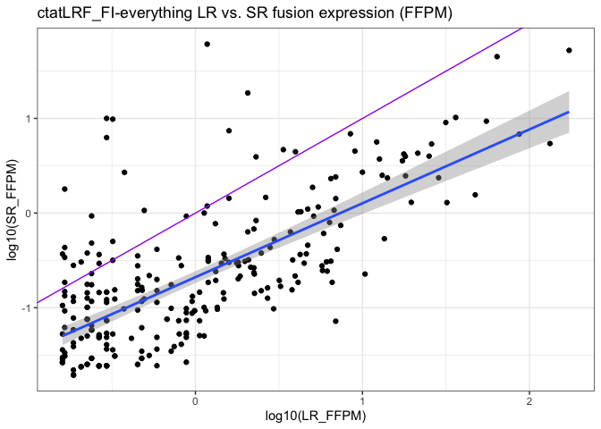
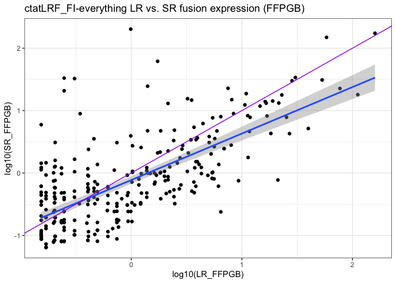
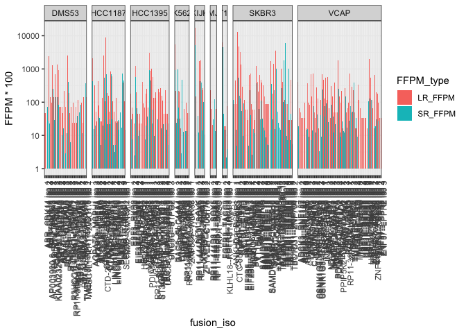
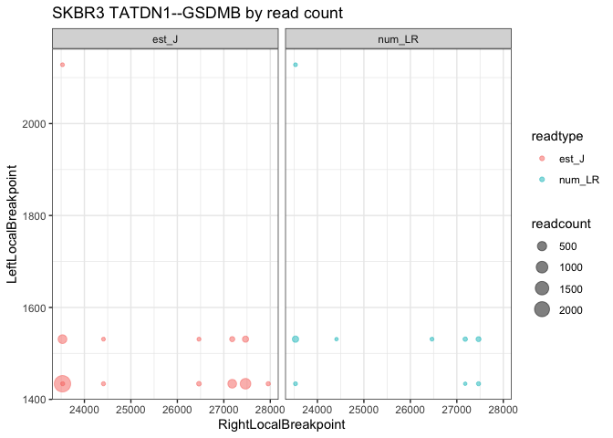
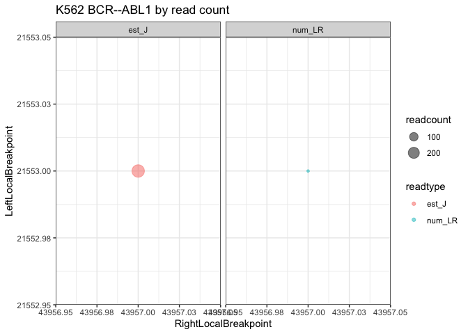
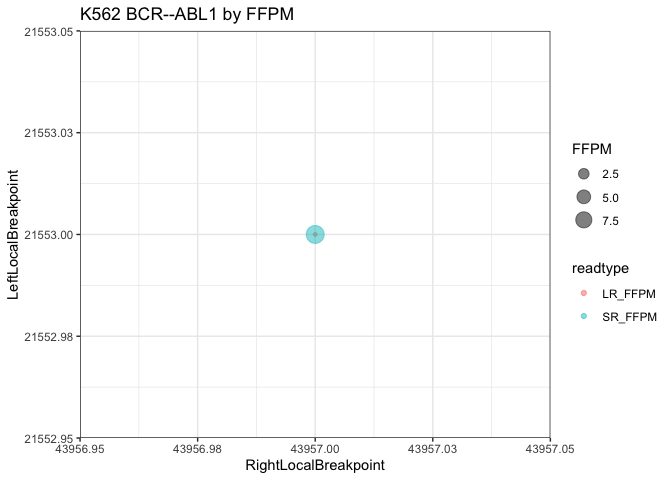
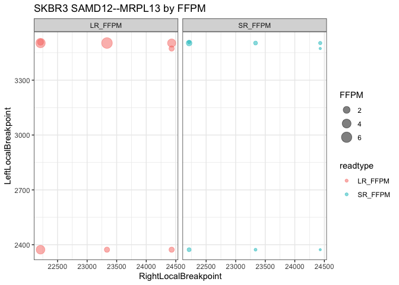
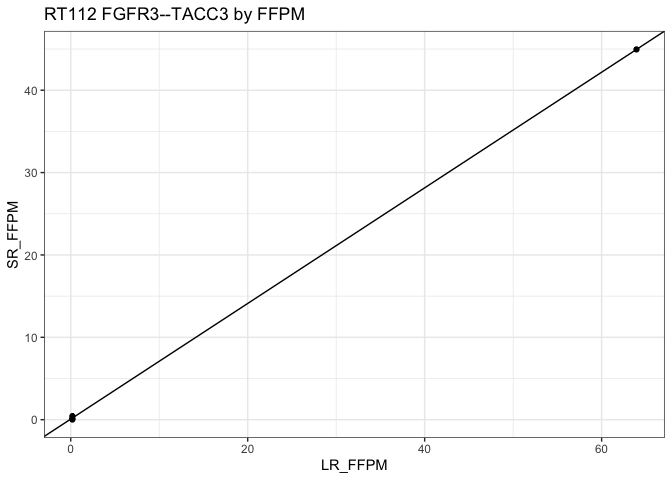

CTAT_DepMap9Lines
================
bhaas
2024-02-01

``` r
files = paste0("data/", list.files("data/", "*abridged.tsv.gz"))

files
```

    ## [1] "data/DepMap_v1v2mrgd_DMS53.ctat-LR-fusion.fusion_predictions.abridged.tsv.gz"  
    ## [2] "data/DepMap_v1v2mrgd_HCC1187.ctat-LR-fusion.fusion_predictions.abridged.tsv.gz"
    ## [3] "data/DepMap_v1v2mrgd_HCC1395.ctat-LR-fusion.fusion_predictions.abridged.tsv.gz"
    ## [4] "data/DepMap_v1v2mrgd_K562.ctat-LR-fusion.fusion_predictions.abridged.tsv.gz"   
    ## [5] "data/DepMap_v1v2mrgd_KIJK.ctat-LR-fusion.fusion_predictions.abridged.tsv.gz"   
    ## [6] "data/DepMap_v1v2mrgd_MJ.ctat-LR-fusion.fusion_predictions.abridged.tsv.gz"     
    ## [7] "data/DepMap_v1v2mrgd_RT112.ctat-LR-fusion.fusion_predictions.abridged.tsv.gz"  
    ## [8] "data/DepMap_v1v2mrgd_SKBR3.ctat-LR-fusion.fusion_predictions.abridged.tsv.gz"  
    ## [9] "data/DepMap_v1v2mrgd_VCAP.ctat-LR-fusion.fusion_predictions.abridged.tsv.gz"

``` r
data = NULL

for (filename in files) {
    
    message("-parsing: ", filename)
    df = read.table(filename, header=T, sep="\t", com='') 
    samplename = str_replace(filename, "data/DepMap_v1v2mrgd_", "")
    samplename = str_replace(samplename, ".ctat-LR-fusion.fusion_predictions.abridged.tsv.gz", "")
    df$sample = samplename
    
    data = rbind(data, df)
}
```

    ## -parsing: data/DepMap_v1v2mrgd_DMS53.ctat-LR-fusion.fusion_predictions.abridged.tsv.gz

    ## -parsing: data/DepMap_v1v2mrgd_HCC1187.ctat-LR-fusion.fusion_predictions.abridged.tsv.gz

    ## -parsing: data/DepMap_v1v2mrgd_HCC1395.ctat-LR-fusion.fusion_predictions.abridged.tsv.gz

    ## -parsing: data/DepMap_v1v2mrgd_K562.ctat-LR-fusion.fusion_predictions.abridged.tsv.gz

    ## -parsing: data/DepMap_v1v2mrgd_KIJK.ctat-LR-fusion.fusion_predictions.abridged.tsv.gz

    ## -parsing: data/DepMap_v1v2mrgd_MJ.ctat-LR-fusion.fusion_predictions.abridged.tsv.gz

    ## -parsing: data/DepMap_v1v2mrgd_RT112.ctat-LR-fusion.fusion_predictions.abridged.tsv.gz

    ## -parsing: data/DepMap_v1v2mrgd_SKBR3.ctat-LR-fusion.fusion_predictions.abridged.tsv.gz

    ## -parsing: data/DepMap_v1v2mrgd_VCAP.ctat-LR-fusion.fusion_predictions.abridged.tsv.gz

``` r
data = data %>% 
    rename(fusion = X.FusionName, SR_FFPM = FFPM) %>%  
    mutate(num_SR = est_J + est_S) %>%
    group_by(sample, fusion) %>% arrange(desc(num_LR), desc(num_SR))  %>% mutate(fusion_iso = paste(fusion, 'iso', row_number())) %>% ungroup()
  


data$lexsort_fusion_name = sapply(data$fusion, function(x) { paste(sort(str_split(x, "--")[[1]]), collapse="--") })
data = data %>% rowwise() %>% mutate(lexsort_fusion_name = paste0(sample, "|", lexsort_fusion_name))


data %>% head()
```

    ## # A tibble: 6 × 36
    ## # Rowwise: 
    ##   fusion  num_LR LeftG…¹ LeftL…² LeftB…³ Right…⁴ Right…⁵ Right…⁶ Splic…⁷ LR_FFPM
    ##   <chr>    <dbl> <chr>     <int> <chr>   <chr>     <int> <chr>   <chr>     <dbl>
    ## 1 RP11-2…    583 RP11-2…    1093 chr7:5… PSPHP1     5244 chr7:5… INCL_N…    96.0
    ## 2 NPM1--…    459 NPM1       4640 chr5:1… ALK       40446 chr2:2… ONLY_R…   173. 
    ## 3 CYTH1-…    451 CYTH1      1096 chr17:… EIF3H     28690 chr8:1… ONLY_R…   133. 
    ## 4 BAG6--…    345 BAG6       2050 chr6:3… SLC44A4   25651 chr6:3… ONLY_R…    55.2
    ## 5 FGFR3-…    343 FGFR3      9864 chr4:1… TACC3     26008 chr4:1… ONLY_R…    63.9
    ## 6 RP11-2…    330 RP11-2…    1093 chr7:5… PSPHP1     5244 chr7:5… INCL_N…    78.8
    ## # … with 26 more variables: JunctionReadCount <dbl>, SpanningFragCount <dbl>,
    ## #   est_J <dbl>, est_S <dbl>, LeftGene_SR <chr>, RightGene_SR <chr>,
    ## #   LargeAnchorSupport <chr>, NumCounterFusionLeft <dbl>,
    ## #   NumCounterFusionRight <dbl>, FAR_left <dbl>, FAR_right <dbl>,
    ## #   LeftBreakDinuc <chr>, LeftBreakEntropy <dbl>, RightBreakDinuc <chr>,
    ## #   RightBreakEntropy <dbl>, SR_FFPM <dbl>, microh_brkpt_dist <dbl>,
    ## #   num_microh_near_brkpt <dbl>, annots <chr>, max_LR_FFPM <dbl>, …

``` r
write.table(data, file="DepMap_v1v2mrgd.ctatLRF_FI.consolidated.tsv", quote=F, sep="\t", row.names=F)
```

``` r
# How many fusion gene pairs and isoforms if require both long and short read support for breakpoints?
data %>% filter(num_LR > 0 & num_SR > 0) %>% select(sample, fusion) %>% unique() %>% nrow()
```

    ## [1] 204

``` r
# 204

data %>% filter(num_LR > 0 & num_SR > 0) %>% select(sample, fusion, LeftBreakpoint, RightBreakpoint) %>% unique() %>% nrow()
```

    ## [1] 268

``` r
# 268
```

# compare long vs. short read fusion evidence, normalized by sequencing depth

``` r
data %>% ggplot(aes(x=log10(LR_FFPM), y=log10(SR_FFPM))) + geom_point() +
    ggtitle("ctatLRF_FI-everything LR vs. SR fusion expression (FFPM)") +                                      
  stat_smooth(method = "lm", 
              formula = y ~ x, 
              geom = "smooth") + 
    geom_abline(intercept=0, slope=1, color='purple')
```

    ## Warning: Removed 9214 rows containing non-finite values (`stat_smooth()`).

    ## Warning: Removed 9214 rows containing missing values (`geom_point()`).

<!-- -->

``` r
cor.test(x=log2(data$LR_FFPM), y=log2(data$SR_FFPM), use='complete.obs')
```

    ## 
    ##  Pearson's product-moment correlation
    ## 
    ## data:  log2(data$LR_FFPM) and log2(data$SR_FFPM)
    ## t = 16.434, df = 266, p-value < 2.2e-16
    ## alternative hypothesis: true correlation is not equal to 0
    ## 95 percent confidence interval:
    ##  0.6448084 0.7645849
    ## sample estimates:
    ##     cor 
    ## 0.70979

``` r
# R=0.71, p<2.2e-16)
```

# restrict to the TP fusions

``` r
TP_fusions = read.table("../3b.DepMap9Lines_Benchmarking/3b.2.IncludeIlluminaSupportedFusions/data/preds.collected.gencode_mapped.wAnnot.filt.pass.proxy_assignments.byProgAgree.min_2.truth_set", 
                        header=T, sep="\t", stringsAsFactors = F) %>% 
    select(proxy_fusion_name)

TP_fusions$sample = sapply(TP_fusions$proxy_fusion_name, function(x) { str_split(x, "\\|")[[1]][1] })
 
TP_fusions$fusion = sapply(TP_fusions$proxy_fusion_name, function(x) { str_split(x, "\\|")[[1]][2] }) 

TP_fusions$lexsort_fusion_name = sapply(TP_fusions$fusion, function(x) { paste(sort(str_split(x, "--")[[1]]), collapse="--") })
TP_fusions = TP_fusions %>% rowwise() %>% mutate(lexsort_fusion_name = paste0(sample, "|", lexsort_fusion_name))

nrow(TP_fusions)
```

    ## [1] 145

``` r
TP_fusions %>% head()
```

    ## # A tibble: 6 × 4
    ## # Rowwise: 
    ##   proxy_fusion_name      sample  fusion         lexsort_fusion_name   
    ##   <chr>                  <chr>   <chr>          <chr>                 
    ## 1 HCC1395|EIF3K--CYP39A1 HCC1395 EIF3K--CYP39A1 HCC1395|CYP39A1--EIF3K
    ## 2 VCAP|SLMAP--ANO10      VCAP    SLMAP--ANO10   VCAP|ANO10--SLMAP     
    ## 3 VCAP|PDE4D--FAM172A    VCAP    PDE4D--FAM172A VCAP|FAM172A--PDE4D   
    ## 4 VCAP|HJURP--EIF4E2     VCAP    HJURP--EIF4E2  VCAP|EIF4E2--HJURP    
    ## 5 HCC1187|KMT2E--LHFPL3  HCC1187 KMT2E--LHFPL3  HCC1187|KMT2E--LHFPL3 
    ## 6 HCC1395|PLA2R1--RBMS1  HCC1395 PLA2R1--RBMS1  HCC1395|PLA2R1--RBMS1

``` r
data = inner_join(TP_fusions %>% select(lexsort_fusion_name),
                  data,
                 by='lexsort_fusion_name',
                 multiple='all'
                 )


nrow(data)
```

    ## [1] 210

``` r
data %>% select(sample, fusion) %>% unique() %>% nrow()
```

    ## [1] 109

``` r
data %>% head()
```

    ## # A tibble: 6 × 36
    ## # Rowwise: 
    ##   lexsor…¹ fusion num_LR LeftG…² LeftL…³ LeftB…⁴ Right…⁵ Right…⁶ Right…⁷ Splic…⁸
    ##   <chr>    <chr>   <dbl> <chr>     <int> <chr>   <chr>     <int> <chr>   <chr>  
    ## 1 HCC1395… EIF3K…     54 "EIF3K"    8757 chr19:… "CYP39…   17360 chr6:4… ONLY_R…
    ## 2 HCC1395… EIF3K…      2 "EIF3K"    8575 chr19:… "CYP39…   17360 chr6:4… ONLY_R…
    ## 3 HCC1395… EIF3K…      1 "EIF3K"    8757 chr19:… "CYP39…   17344 chr6:4… INCL_N…
    ## 4 HCC1395… EIF3K…     NA ""         8757 chr19:… ""        17420 chr6:4… INCL_N…
    ## 5 VCAP|AN… SLMAP…      5 "SLMAP"    7721 chr3:5… "ANO10"   44181 chr3:4… ONLY_R…
    ## 6 VCAP|AN… ANO10…      1 "ANO10"    3220 chr3:4… "SLMAP"   39608 chr3:5… ONLY_R…
    ## # … with 26 more variables: LR_FFPM <dbl>, JunctionReadCount <dbl>,
    ## #   SpanningFragCount <dbl>, est_J <dbl>, est_S <dbl>, LeftGene_SR <chr>,
    ## #   RightGene_SR <chr>, LargeAnchorSupport <chr>, NumCounterFusionLeft <dbl>,
    ## #   NumCounterFusionRight <dbl>, FAR_left <dbl>, FAR_right <dbl>,
    ## #   LeftBreakDinuc <chr>, LeftBreakEntropy <dbl>, RightBreakDinuc <chr>,
    ## #   RightBreakEntropy <dbl>, SR_FFPM <dbl>, microh_brkpt_dist <dbl>,
    ## #   num_microh_near_brkpt <dbl>, annots <chr>, max_LR_FFPM <dbl>, …

``` r
# how many TP genes and isoforms have both long and short read support:
data %>% filter(num_LR > 0 && num_SR > 0) %>% nrow()
```

    ## [1] 144

``` r
data %>% filter(num_LR > 0 && num_SR > 0) %>% select(sample, fusion) %>% unique() %>% nrow()
```

    ## [1] 88

``` r
# by read counts

data %>% 
    select(sample, fusion_iso, num_LR, num_SR) %>% 
    gather(key=read_type, value=read_count, num_LR, num_SR) %>%
    ggplot(aes(x=fusion_iso, y=read_count)) + geom_bar(stat='identity', position = 'dodge', aes(fill=read_type)) +
    
    facet_grid(. ~ sample, scales = "free", space='free') +
    scale_x_discrete(expand = c(0, 0.5))  +
    
    theme(axis.text.x = element_text(angle = 90, hjust = 1))
```

    ## Warning: Removed 66 rows containing missing values (`geom_bar()`).

<!-- -->

``` r
# by FFPM

data %>% 
    select(sample, fusion_iso, LR_FFPM, SR_FFPM) %>% 
    gather(key=FFPM_type, value=FFPM, LR_FFPM, SR_FFPM) %>%
    
    mutate(FFPM = FFPM * 100) %>%
    
    ggplot(aes(x=fusion_iso, y=FFPM)) + geom_bar(stat='identity', position = 'dodge', aes(fill=FFPM_type)) +
    
    facet_grid(. ~ sample, scales = "free", space='free') +
    scale_x_discrete(expand = c(0, 0.5))  +
    
    scale_y_continuous(trans='log10') +
    
    theme(axis.text.x = element_text(angle = 90, hjust = 1)) +
    
    ylab("FFPM * 100")
```

    ## Warning: Removed 66 rows containing missing values (`geom_bar()`).

<!-- -->

``` r
# label those fusions that have the most extreme difference with SR >> LR

SR_enriched_fusion_isoforms = data %>% 
    filter(LR_FFPM > 0 & SR_FFPM > 0) %>%
    select(sample, fusion, fusion_iso, LR_FFPM, SR_FFPM) %>% 
    rowwise() %>%
    mutate(SR_enrichment = SR_FFPM / LR_FFPM) %>%
    arrange(desc(SR_enrichment)) %>%
    ungroup() %>% mutate(rank = row_number())


SR_enriched_fusion_isoforms %>% filter(SR_enrichment > 1)
```

    ## # A tibble: 16 × 7
    ##    sample  fusion             fusion_iso           LR_FFPM SR_FFPM SR_en…¹  rank
    ##    <chr>   <chr>              <chr>                  <dbl>   <dbl>   <dbl> <int>
    ##  1 SKBR3   TATDN1--GSDMB      TATDN1--GSDMB iso 5    1.18   60.9     51.8      1
    ##  2 SKBR3   TATDN1--GSDMB      TATDN1--GSDMB iso 8    0.294  10.0     34.1      2
    ##  3 K562    BCR--ABL1          BCR--ABL1 iso 1        0.32    9.83    30.7      3
    ##  4 SKBR3   TATDN1--GSDMB      TATDN1--GSDMB iso 4    2.06   18.6      9.03     4
    ##  5 HCC1187 PUM1--TRERF1       PUM1--TRERF1 iso 1     1.59    7.41     4.67     5
    ##  6 VCAP    USP10--ZDHHC7      USP10--ZDHHC7 iso 1    0.494   1.07     2.16     6
    ##  7 VCAP    TMPRSS2--ERG       TMPRSS2--ERG iso 4     0.165   0.340    2.06     7
    ##  8 DMS53   RP11-59N23.3--CMAS RP11-59N23.3--CMAS …   0.239   0.482    2.02     8
    ##  9 VCAP    TMPRSS2--ERG       TMPRSS2--ERG iso 2     2.31    3.93     1.70     9
    ## 10 MJ      RP11-444D3.1--SOX5 RP11-444D3.1--SOX5 …   0.207   0.304    1.47    10
    ## 11 K562    NUP214--XKR3       NUP214--XKR3 iso 1     3.36    4.68     1.39    11
    ## 12 VCAP    ZDHHC7--H3F3B      ZDHHC7--H3F3B iso 1    0.165   0.186    1.12    12
    ## 13 HCC1187 SEC22B--NOTCH2     SEC22B--NOTCH2 iso 1   3.97    4.44     1.12    13
    ## 14 HCC1187 PLXND1--TMCC1      PLXND1--TMCC1 iso 2    0.265   0.294    1.11    14
    ## 15 SKBR3   DHX35--ITCH        DHX35--ITCH iso 1      0.882   0.926    1.05    15
    ## 16 SKBR3   ANKHD1--PCDH1      ANKHD1--PCDH1 iso 1    1.18    1.19     1.01    16
    ## # … with abbreviated variable name ¹​SR_enrichment

``` r
# BCR-ABL1 has >30-fold enrichment for SR
```

``` r
depmap_LR_vs_SR_fusion_FFPM_scatterplot = data %>%     
    select(sample, fusion_iso, LR_FFPM, SR_FFPM) %>% 
    ggplot(aes(x=log10(LR_FFPM), y=log10(SR_FFPM))) + geom_point() +
    stat_smooth(method = "lm", 
              formula = y ~ x, 
              geom = "smooth") + 
    geom_abline(intercept=0, slope=1, color='purple') +
    geom_point(data=SR_enriched_fusion_isoforms %>% filter(SR_enrichment>=3), color='red')  +
    geom_text_repel(data=SR_enriched_fusion_isoforms %>% filter(SR_enrichment>=3), aes(label=fusion_iso)) +
    ggtitle("CTAT-LR-FI FFPM Comparison for isoforms of TP fusions")


depmap_LR_vs_SR_fusion_FFPM_scatterplot
```

    ## Warning: Removed 66 rows containing non-finite values (`stat_smooth()`).

    ## Warning: Removed 66 rows containing missing values (`geom_point()`).

<!-- -->

``` r
ggsave(depmap_LR_vs_SR_fusion_FFPM_scatterplot, file="depmap_LR_vs_SR_fusion_FFPM_scatterplot.svg", width=6, height=5)
```

    ## Warning: Removed 66 rows containing non-finite values (`stat_smooth()`).

    ## Warning: Removed 66 rows containing missing values (`geom_point()`).

``` r
cor.test(x=log2(data$LR_FFPM), y=log2(data$SR_FFPM), use='complete.obs')
```

    ## 
    ##  Pearson's product-moment correlation
    ## 
    ## data:  log2(data$LR_FFPM) and log2(data$SR_FFPM)
    ## t = 11.045, df = 142, p-value < 2.2e-16
    ## alternative hypothesis: true correlation is not equal to 0
    ## 95 percent confidence interval:
    ##  0.5807723 0.7589546
    ## sample estimates:
    ##       cor 
    ## 0.6797698

``` r
# with TP fusions:  R=0.68, p<2.2e-16
```

``` r
depmap_SR_enrichment_rankings_plot = SR_enriched_fusion_isoforms %>%
    mutate(rn = row_number() ) %>%
    ggplot(aes(x=rn, y=SR_enrichment)) + geom_point() + geom_hline(yintercept = 1.0, color='purple') +
    scale_y_continuous(trans='log10') +
    xlab("Fusion isoform ranked by SR_enrichment")
   
depmap_SR_enrichment_rankings_plot
```

<!-- -->

``` r
ggsave(depmap_SR_enrichment_rankings_plot, file="depmap_SR_enrichment_rankings_plot.svg", width=5, height=3)
```

# examine specific fusions and breakpoint splice support

``` r
plot_fusion_expression_by_breakpoint = function(sample_name, fusion_name) {
    
    df = data %>% filter(sample == sample_name & fusion == fusion_name) %>% 
        select(sample, fusion, LeftLocalBreakpoint, RightLocalBreakpoint, num_LR, est_J, LR_FFPM, SR_FFPM) %>% 
        arrange(sample, RightLocalBreakpoint, LeftLocalBreakpoint) %>%
        mutate(num_LR = ifelse (is.na(num_LR), 0, num_LR)) %>%
        mutate(LR_FFPM = ifelse(is.na(LR_FFPM), 0, LR_FFPM)) %>%
        mutate(est_J = ifelse(is.na(est_J), 0, est_J)) 
    
    print(df)
    
    
    p1 = df %>% gather(key=readtype, value=readcount, num_LR, est_J) %>% 
        filter(readcount > 0) %>%
        ggplot(aes(x=RightLocalBreakpoint, y=LeftLocalBreakpoint) ) + 
        ggtitle(paste(sample_name, fusion_name, "by read count")) +
        geom_point(aes(color=readtype, size=readcount), alpha=0.5) +
        facet_wrap(~readtype) 
    
    plot(p1)
    
    
    p2 = df %>% gather(key=readtype, value=FFPM, LR_FFPM, SR_FFPM) %>% 
        filter(FFPM > 0) %>%
        ggplot(aes(x=RightLocalBreakpoint, y=LeftLocalBreakpoint) ) + 
        ggtitle(paste(sample_name, fusion_name, "by FFPM")) +
        geom_point(aes(color=readtype, size=FFPM), alpha=0.5) +
        facet_wrap(~readtype) 
    
    plot(p2)
    
    p3 = df %>% gather(key=readtype, value=FFPM, LR_FFPM, SR_FFPM) %>% 
        ggplot(aes(x=RightLocalBreakpoint, y=LeftLocalBreakpoint) ) + 
        ggtitle(paste(sample_name, fusion_name, "by FFPM")) +
        geom_point(aes(color=readtype, fill=readtype, size=FFPM), alpha=0.5) 
    
    plot(p3)
    
    
    p4 = df %>% gather(key=readtype, value=FFPM, LR_FFPM, SR_FFPM) %>% 
        mutate(breakpoint = paste(RightLocalBreakpoint, LeftLocalBreakpoint)) %>% 
        ggplot(aes(x=breakpoint, y=FFPM, fill=readtype) ) + 
        ggtitle(paste(sample_name, fusion_name, "by FFPM")) +
        geom_bar(stat='identity', position='dodge')  +
        theme(axis.text.x = element_text(angle = 90, hjust = 1))
    
    plot(p4)
    
    lm_df = lm(df$SR_FFPM ~ df$LR_FFPM)
    print(lm_df)
    lm_y_intercept=lm_df$coefficients[1]
    lm_slope=lm_df$coefficients[2]
    
    
     p5 = df %>%
        mutate(breakpoint = paste(RightLocalBreakpoint, LeftLocalBreakpoint)) %>% 
        ggplot(aes(x=LR_FFPM, y=SR_FFPM) ) +  geom_point() +  geom_abline(slope=lm_slope, intercept = lm_y_intercept) +
        ggtitle(paste(sample_name, fusion_name, "by FFPM")) 
    
    plot(p5)
    
    if(nrow(df)>2) {
        print(cor.test(df$LR_FFPM, df$SR_FFPM))
    }
}
```

## TATDN1–GSDMB

``` r
sample_name = "SKBR3"
fusion_name = "TATDN1--GSDMB"

plot_fusion_expression_by_breakpoint(sample_name, fusion_name)
```

    ## # A tibble: 13 × 8
    ## # Rowwise: 
    ##    sample fusion        LeftLocalBreakpoint Right…¹ num_LR est_J LR_FFPM SR_FFPM
    ##    <chr>  <chr>                       <int>   <int>  <dbl> <dbl>   <dbl>   <dbl>
    ##  1 SKBR3  TATDN1--GSDMB                1434   23528      4  2499   1.18  60.9   
    ##  2 SKBR3  TATDN1--GSDMB                1531   23528    123   417  36.2   10.2   
    ##  3 SKBR3  TATDN1--GSDMB                2128   23528      3     3   0.882  0.0736
    ##  4 SKBR3  TATDN1--GSDMB                1434   23532      0     6   0      0.146 
    ##  5 SKBR3  TATDN1--GSDMB                1434   24410      0     7   0      0.170 
    ##  6 SKBR3  TATDN1--GSDMB                1531   24410      1     3   0.294  0.0733
    ##  7 SKBR3  TATDN1--GSDMB                1434   26465      0    21   0      0.512 
    ##  8 SKBR3  TATDN1--GSDMB                1531   26465      3     4   0.882  0.0979
    ##  9 SKBR3  TATDN1--GSDMB                1434   27181      1   411   0.294 10.0   
    ## 10 SKBR3  TATDN1--GSDMB                1531   27181     14    42   4.12   1.03  
    ## 11 SKBR3  TATDN1--GSDMB                1434   27467      7   763   2.06  18.6   
    ## 12 SKBR3  TATDN1--GSDMB                1531   27467     34   111  10.0    2.70  
    ## 13 SKBR3  TATDN1--GSDMB                1434   27956      0    10   0      0.244 
    ## # … with abbreviated variable name ¹​RightLocalBreakpoint

<!-- --><!-- --><!-- --><!-- -->

    ## 
    ## Call:
    ## lm(formula = df$SR_FFPM ~ df$LR_FFPM)
    ## 
    ## Coefficients:
    ## (Intercept)   df$LR_FFPM  
    ##     7.82812      0.05363

<!-- -->

    ## 
    ##  Pearson's product-moment correlation
    ## 
    ## data:  df$LR_FFPM and df$SR_FFPM
    ## t = 0.10502, df = 11, p-value = 0.9182
    ## alternative hypothesis: true correlation is not equal to 0
    ## 95 percent confidence interval:
    ##  -0.5285525  0.5726491
    ## sample estimates:
    ##        cor 
    ## 0.03165013

## K562 BCR–ABL1

``` r
plot_fusion_expression_by_breakpoint("K562", "BCR--ABL1")
```

    ## # A tibble: 1 × 8
    ## # Rowwise: 
    ##   sample fusion    LeftLocalBreakpoint RightLocal…¹ num_LR est_J LR_FFPM SR_FFPM
    ##   <chr>  <chr>                   <int>        <int>  <dbl> <dbl>   <dbl>   <dbl>
    ## 1 K562   BCR--ABL1               21553        43957      2   272    0.32    9.83
    ## # … with abbreviated variable name ¹​RightLocalBreakpoint

<!-- --><!-- --><!-- --><!-- -->

    ## 
    ## Call:
    ## lm(formula = df$SR_FFPM ~ df$LR_FFPM)
    ## 
    ## Coefficients:
    ## (Intercept)   df$LR_FFPM  
    ##       9.828           NA

    ## Warning: Removed 1 rows containing missing values (`geom_abline()`).

<!-- -->

``` r
# HCC1187   PUM1--TRERF1 

plot_fusion_expression_by_breakpoint("HCC1187", "PUM1--TRERF1")
```

    ## # A tibble: 1 × 8
    ## # Rowwise: 
    ##   sample  fusion       LeftLocalBreakpoint RightL…¹ num_LR est_J LR_FFPM SR_FFPM
    ##   <chr>   <chr>                      <int>    <int>  <dbl> <dbl>   <dbl>   <dbl>
    ## 1 HCC1187 PUM1--TRERF1               26417    37568      6   172    1.59    7.41
    ## # … with abbreviated variable name ¹​RightLocalBreakpoint

<!-- --><!-- --><!-- --><!-- -->

    ## 
    ## Call:
    ## lm(formula = df$SR_FFPM ~ df$LR_FFPM)
    ## 
    ## Coefficients:
    ## (Intercept)   df$LR_FFPM  
    ##       7.415           NA

    ## Warning: Removed 1 rows containing missing values (`geom_abline()`).

<!-- -->

``` r
# VCAP  TMPRSS2--ERG

plot_fusion_expression_by_breakpoint("VCAP", "TMPRSS2--ERG")
```

    ## # A tibble: 5 × 8
    ## # Rowwise: 
    ##   sample fusion       LeftLocalBreakpoint RightLo…¹ num_LR est_J LR_FFPM SR_FFPM
    ##   <chr>  <chr>                      <int>     <int>  <dbl> <dbl>   <dbl>   <dbl>
    ## 1 VCAP   TMPRSS2--ERG                3407     31121      1    11   0.165  0.340 
    ## 2 VCAP   TMPRSS2--ERG                3538     31121      3     0   0.494 NA     
    ## 3 VCAP   TMPRSS2--ERG                3407     35606     14   127   2.31   3.93  
    ## 4 VCAP   TMPRSS2--ERG                3538     35606     18    17   2.96   0.526 
    ## 5 VCAP   TMPRSS2--ERG                4698     35606      1     1   0.165  0.0927
    ## # … with abbreviated variable name ¹​RightLocalBreakpoint

<!-- --><!-- -->

    ## Warning: Removed 1 rows containing missing values (`geom_point()`).

<!-- -->

    ## Warning: Removed 1 rows containing missing values (`geom_bar()`).

<!-- -->

    ## 
    ## Call:
    ## lm(formula = df$SR_FFPM ~ df$LR_FFPM)
    ## 
    ## Coefficients:
    ## (Intercept)   df$LR_FFPM  
    ##      0.3691       0.6086

    ## Warning: Removed 1 rows containing missing values (`geom_point()`).

<!-- -->

    ## 
    ##  Pearson's product-moment correlation
    ## 
    ## data:  df$LR_FFPM and df$SR_FFPM
    ## t = 0.78932, df = 2, p-value = 0.5126
    ## alternative hypothesis: true correlation is not equal to 0
    ## 95 percent confidence interval:
    ##  -0.8911259  0.9864150
    ## sample estimates:
    ##      cor 
    ## 0.487363

# Examine all fusions with multiple isoforms

How many fusions do we have multiple isoforms with evidence? How many
with both short and long read support?

Are expression values correlated among isoforms according to read types?

Is the dominant isoform the same?

``` r
# how many total TP fusions did ctatLRF find evidence for with both short and long reads?

fusions_w_both_long_and_short = data %>% 
    filter(num_LR > 0 & num_SR > 0) %>%
   select(sample, fusion) %>% unique()

nrow(fusions_w_both_long_and_short)
```

    ## [1] 88

``` r
min_multi_isoforms = 3
```

``` r
# how many have multiple fusion isoforms?

mult_isoform_data = left_join(fusions_w_both_long_and_short, data, 
                              by=c('sample', 'fusion'),
                              multiple='all') %>% 
    group_by(sample, fusion) %>% filter(n()>=min_multi_isoforms) %>% ungroup()

mult_isoform_data %>% select(sample, fusion) %>% unique() %>% nrow()
```

    ## [1] 21

``` r
# how many have both LR and SR isoform support?

mult_isoform_data_both_read_types = mult_isoform_data %>% filter(num_LR > 0 & est_J > 0) %>% group_by(sample, fusion) %>% filter(n()>min_multi_isoforms) %>% ungroup() 

mult_iso_both_sample_fusion_names = mult_isoform_data_both_read_types %>% group_by(sample, fusion) %>% tally(name='num_multi_iso_both_types')

# include isoformws supported uniquely by long or short in the downstream analysis here:
mult_isoform_data_both_read_types = left_join(mult_iso_both_sample_fusion_names, mult_isoform_data, by=c('sample', 'fusion'))

mult_iso_both_sample_fusion_names %>% arrange(desc(num_multi_iso_both_types))
```

    ## # A tibble: 5 × 3
    ## # Groups:   sample [3]
    ##   sample  fusion             num_multi_iso_both_types
    ##   <chr>   <chr>                                 <int>
    ## 1 SKBR3   TATDN1--GSDMB                             9
    ## 2 SKBR3   SAMD12--MRPL13                            8
    ## 3 SKBR3   CYTH1--EIF3H                              5
    ## 4 HCC1187 LINC01535--EXOSC10                        4
    ## 5 VCAP    TMPRSS2--ERG                              4

``` r
# 5 fusions with at least 3 splicing isoforms each:
```

## Compare read support for fusion isoforms across each fusion gene

``` r
depmap_fusion_isoform_expr_LR_SR_comparison_plot =  mult_isoform_data_both_read_types %>% 
    ggplot(aes(x=log10(LR_FFPM), y=log10(SR_FFPM))) + geom_point(aes(color=fusion)) +
    ggtitle("restricted to fusion genes w/ multi isoforms supported by both read types") +
    stat_smooth(method = "lm", 
              formula = y ~ x, 
              geom = "smooth") +
    facet_wrap(~fusion, scale='free')

depmap_fusion_isoform_expr_LR_SR_comparison_plot
```

    ## Warning: Removed 5 rows containing non-finite values (`stat_smooth()`).

    ## Warning: Removed 5 rows containing missing values (`geom_point()`).

<!-- -->

``` r
ggsave(depmap_fusion_isoform_expr_LR_SR_comparison_plot, file="depmap_fusion_isoform_expr_LR_SR_comparison_plot.svg", width=9, height=5)
```

    ## Warning: Removed 5 rows containing non-finite values (`stat_smooth()`).

    ## Warning: Removed 5 rows containing missing values (`geom_point()`).

``` r
for (i in seq(nrow(mult_iso_both_sample_fusion_names))) {
    
    sample_name = mult_iso_both_sample_fusion_names[i,1]$sample
    fusion_name =  mult_iso_both_sample_fusion_names[i,2]$fusion
    
    loc_df = mult_isoform_data_both_read_types %>% 
        filter(sample==sample_name & fusion==fusion_name) %>%
        select(sample, fusion, LeftLocalBreakpoint, RightLocalBreakpoint, num_LR, est_J, LR_FFPM, SR_FFPM) %>% 
        arrange(sample, RightLocalBreakpoint, LeftLocalBreakpoint) 
    
    #print(loc_df)
    
    lm_loc_df = lm(loc_df$SR_FFPM ~ loc_df$LR_FFPM)
    print(lm_loc_df)
    lm_y_intercept=lm_loc_df$coefficients[1]
    lm_slope=lm_loc_df$coefficients[2]
    
    p = loc_df %>%
        mutate(breakpoint = paste(RightLocalBreakpoint, LeftLocalBreakpoint)) %>% 
        ggplot(aes(x=LR_FFPM, y=SR_FFPM) ) +  geom_point() + geom_abline(slope=lm_slope, intercept = lm_y_intercept) +
        ggtitle(paste(sample_name, fusion_name, "by FFPM")) 
    
    plot(p)
    
    if(nrow(loc_df)>2) {
        print(cor.test(loc_df$LR_FFPM, loc_df$SR_FFPM))
    }
    
    
}
```

    ## 
    ## Call:
    ## lm(formula = loc_df$SR_FFPM ~ loc_df$LR_FFPM)
    ## 
    ## Coefficients:
    ##    (Intercept)  loc_df$LR_FFPM  
    ##        0.01608         0.04704

<!-- -->

    ## 
    ##  Pearson's product-moment correlation
    ## 
    ## data:  loc_df$LR_FFPM and loc_df$SR_FFPM
    ## t = 11.065, df = 2, p-value = 0.008069
    ## alternative hypothesis: true correlation is not equal to 0
    ## 95 percent confidence interval:
    ##  0.6609314 0.9998393
    ## sample estimates:
    ##       cor 
    ## 0.9919312 
    ## 
    ## 
    ## Call:
    ## lm(formula = loc_df$SR_FFPM ~ loc_df$LR_FFPM)
    ## 
    ## Coefficients:
    ##    (Intercept)  loc_df$LR_FFPM  
    ##       -0.09397         0.04108

<!-- -->

    ## 
    ##  Pearson's product-moment correlation
    ## 
    ## data:  loc_df$LR_FFPM and loc_df$SR_FFPM
    ## t = 22.46, df = 3, p-value = 0.0001933
    ## alternative hypothesis: true correlation is not equal to 0
    ## 95 percent confidence interval:
    ##  0.9537004 0.9998146
    ## sample estimates:
    ##       cor 
    ## 0.9970398 
    ## 
    ## 
    ## Call:
    ## lm(formula = loc_df$SR_FFPM ~ loc_df$LR_FFPM)
    ## 
    ## Coefficients:
    ##    (Intercept)  loc_df$LR_FFPM  
    ##       0.003051        0.099194

<!-- -->

    ## 
    ##  Pearson's product-moment correlation
    ## 
    ## data:  loc_df$LR_FFPM and loc_df$SR_FFPM
    ## t = 1.8389, df = 6, p-value = 0.1155
    ## alternative hypothesis: true correlation is not equal to 0
    ## 95 percent confidence interval:
    ##  -0.1807733  0.9170676
    ## sample estimates:
    ##       cor 
    ## 0.6003796 
    ## 
    ## 
    ## Call:
    ## lm(formula = loc_df$SR_FFPM ~ loc_df$LR_FFPM)
    ## 
    ## Coefficients:
    ##    (Intercept)  loc_df$LR_FFPM  
    ##        12.2617         -0.1193

    ## Warning: Removed 4 rows containing missing values (`geom_point()`).

<!-- -->

    ## 
    ##  Pearson's product-moment correlation
    ## 
    ## data:  loc_df$LR_FFPM and loc_df$SR_FFPM
    ## t = -0.18814, df = 7, p-value = 0.8561
    ## alternative hypothesis: true correlation is not equal to 0
    ## 95 percent confidence interval:
    ##  -0.7019840  0.6225159
    ## sample estimates:
    ##         cor 
    ## -0.07093017 
    ## 
    ## 
    ## Call:
    ## lm(formula = loc_df$SR_FFPM ~ loc_df$LR_FFPM)
    ## 
    ## Coefficients:
    ##    (Intercept)  loc_df$LR_FFPM  
    ##         0.3691          0.6086

    ## Warning: Removed 1 rows containing missing values (`geom_point()`).

<!-- -->

    ## 
    ##  Pearson's product-moment correlation
    ## 
    ## data:  loc_df$LR_FFPM and loc_df$SR_FFPM
    ## t = 0.78932, df = 2, p-value = 0.5126
    ## alternative hypothesis: true correlation is not equal to 0
    ## 95 percent confidence interval:
    ##  -0.8911259  0.9864150
    ## sample estimates:
    ##      cor 
    ## 0.487363

``` r
plot_fusion_expression_by_breakpoint("SKBR3", "CYTH1--EIF3H")
```

    ## # A tibble: 5 × 8
    ## # Rowwise: 
    ##   sample fusion       LeftLocalBreakpoint RightLo…¹ num_LR est_J LR_FFPM SR_FFPM
    ##   <chr>  <chr>                      <int>     <int>  <dbl> <dbl>   <dbl>   <dbl>
    ## 1 SKBR3  CYTH1--EIF3H                1096     28690    451   223  133.    5.43  
    ## 2 SKBR3  CYTH1--EIF3H                1096     28912     46    22   13.5   0.536 
    ## 3 SKBR3  CYTH1--EIF3H                1096     32601    161    64   47.3   1.56  
    ## 4 SKBR3  CYTH1--EIF3H                1096     36015    109    53   32.0   1.29  
    ## 5 SKBR3  CYTH1--EIF3H                1096     38781     10     4    2.94  0.0974
    ## # … with abbreviated variable name ¹​RightLocalBreakpoint

<!-- --><!-- --><!-- --><!-- -->

    ## 
    ## Call:
    ## lm(formula = df$SR_FFPM ~ df$LR_FFPM)
    ## 
    ## Coefficients:
    ## (Intercept)   df$LR_FFPM  
    ##    -0.09397      0.04108

<!-- -->

    ## 
    ##  Pearson's product-moment correlation
    ## 
    ## data:  df$LR_FFPM and df$SR_FFPM
    ## t = 22.46, df = 3, p-value = 0.0001933
    ## alternative hypothesis: true correlation is not equal to 0
    ## 95 percent confidence interval:
    ##  0.9537004 0.9998146
    ## sample estimates:
    ##       cor 
    ## 0.9970398

``` r
# significant correlation:  R=0.997, p=1.9e-4
```

``` r
plot_fusion_expression_by_breakpoint("SKBR3", "SAMD12--MRPL13")
```

    ## # A tibble: 8 × 8
    ## # Rowwise: 
    ##   sample fusion         LeftLocalBreakpoint Right…¹ num_LR est_J LR_FFPM SR_FFPM
    ##   <chr>  <chr>                        <int>   <int>  <dbl> <dbl>   <dbl>   <dbl>
    ## 1 SKBR3  SAMD12--MRPL13                2373   22212     13     9   3.82   0.32  
    ## 2 SKBR3  SAMD12--MRPL13                3503   22212     16    23   4.70   1.10  
    ## 3 SKBR3  SAMD12--MRPL13                3508   22212      5     3   1.47   0.144 
    ## 4 SKBR3  SAMD12--MRPL13                2373   23336      3     3   0.882  0.0887
    ## 5 SKBR3  SAMD12--MRPL13                3503   23336     22     9   6.47   0.310 
    ## 6 SKBR3  SAMD12--MRPL13                2373   24430      3     2   0.882  0.0526
    ## 7 SKBR3  SAMD12--MRPL13                3473   24430      3     2   0.882  0.0543
    ## 8 SKBR3  SAMD12--MRPL13                3503   24430     11     6   3.23   0.168 
    ## # … with abbreviated variable name ¹​RightLocalBreakpoint

<!-- --><!-- --><!-- --><!-- -->

    ## 
    ## Call:
    ## lm(formula = df$SR_FFPM ~ df$LR_FFPM)
    ## 
    ## Coefficients:
    ## (Intercept)   df$LR_FFPM  
    ##    0.003051     0.099194

<!-- -->

    ## 
    ##  Pearson's product-moment correlation
    ## 
    ## data:  df$LR_FFPM and df$SR_FFPM
    ## t = 1.8389, df = 6, p-value = 0.1155
    ## alternative hypothesis: true correlation is not equal to 0
    ## 95 percent confidence interval:
    ##  -0.1807733  0.9170676
    ## sample estimates:
    ##       cor 
    ## 0.6003796

# include gene structure info in plots

``` r
fusion_gene_structures = read.table("data/FI.exons.dat", header=F, sep="\t")
colnames(fusion_gene_structures) = c('fusion_name', 'feature_type', 'lend', 'rend')
```

``` r
plot_fusion_expression_by_breakpoint_incl_gene_structures = function(sample_name, fusion_name) {
    
    
    ret_plots = list()
    
    
    df = data %>% filter(sample == sample_name & fusion == fusion_name) %>% 
        select(sample, fusion, LeftLocalBreakpoint, RightLocalBreakpoint, num_LR, est_J, LR_FFPM, SR_FFPM) %>% 
        arrange(sample, RightLocalBreakpoint, LeftLocalBreakpoint) %>%
        mutate(num_LR = ifelse (is.na(num_LR), 0, num_LR)) %>%
        mutate(LR_FFPM = ifelse(is.na(LR_FFPM), 0, LR_FFPM)) %>%
        mutate(est_J = ifelse(is.na(est_J), 0, est_J)) 
    
    print(df)
    
    
    p = df %>% gather(key=readtype, value=FFPM, LR_FFPM, SR_FFPM) %>% 
        filter(FFPM > 0) %>%
        ggplot() +
        theme_bw() +
        ggtitle(paste(sample_name, fusion_name, "by FFPM")) +
        geom_point(aes(x=LeftLocalBreakpoint, y=RightLocalBreakpoint, color=readtype, size=FFPM), alpha=0.5)
    #+
    #    facet_wrap(~readtype) 
    
    fname = fusion_name
    
    gene_structure_info = fusion_gene_structures %>% filter(fusion_name == fname)
    
    geneA_info = gene_structure_info %>% filter(feature_type == "GeneA")
    geneB_info = gene_structure_info %>% filter(feature_type == "GeneB")
    
    print(geneA_info)
    print(geneB_info)

    ## plot gene structures.
    padding = 1000

    geneA_lend = min(geneA_info$lend)
    geneA_rend = max(geneA_info$rend)
    geneA_length = geneA_rend - geneA_lend + 2*padding

    geneB_lend = min(geneB_info$lend)
    geneB_rend = max(geneB_info$rend)
    geneB_length = geneB_rend - geneB_lend + 2*padding

    

    ## draw geneA
    geneA_minY = geneB_lend - 0.95*padding
    geneA_maxY = geneA_minY + 0.03*geneB_length

    p1 = p + geom_rect(data=geneA_info, aes(xmin=lend, xmax=rend, ymin=geneA_minY, ymax=geneA_maxY), fill=NA, color='black', alpha=0.5)

    geneA_midY = mean(c(geneA_minY, geneA_maxY))

    p1 = p1 + geom_segment(data=geneA_info, aes(x=geneA_lend, xend=geneA_rend, y=geneA_midY, yend=geneA_midY), alpha=0.5) # geneB center line

    ## draw geneB

    geneB_minX = geneA_lend - 0.95*padding
    geneB_maxX = geneB_minX + 0.03*geneA_length

    p1 = p1 + geom_rect(data=geneB_info, aes(ymin=lend, ymax=rend, xmin=geneB_minX, xmax=geneB_maxX), fill=NA, color='black', alpha=0.5)

    geneB_midX = mean(c(geneB_minX, geneB_maxX))
    p1 = p1 + geom_segment(data=geneB_info, aes(x=geneB_midX, xend=geneB_midX, y=geneB_lend, yend=geneB_rend), alpha=0.5) # geneB center line

    
    ## set up scales for view
    p1 = p1 +
        xlim(geneA_lend - padding, geneA_rend + padding) +
        ylim(geneB_lend - padding, geneB_rend + padding)

    
    plot(p1)
    ret_plots[[1]] = p1
    
    p1 = p1 + facet_wrap(~readtype) 
    plot(p1)
    ret_plots[[2]] = p1
    
    
    # zoom in around breakpoints
    
    min_right_breakpoint = min(df$RightLocalBreakpoint)
    max_right_breakpoint = max(df$RightLocalBreakpoint)
    
    min_left_breakpoint = min(df$LeftLocalBreakpoint)
    max_left_breakpoint = max(df$LeftLocalBreakpoint)
    
    
    padding = 0.25 * padding
    
     ## draw geneA (along X-axis)
    geneA_minY = min_right_breakpoint - 0.95*padding
    geneA_maxY = geneA_minY + 0.03* (max_right_breakpoint - min_right_breakpoint + 2*padding)

    p2 = p + geom_rect(data=geneA_info, aes(xmin=lend, xmax=rend, ymin=geneA_minY, ymax=geneA_maxY), fill=NA, color='black', alpha=0.5)

    geneA_midY = mean(c(geneA_minY, geneA_maxY))

    p2 = p2 + geom_segment(data=geneA_info, aes(x=min_left_breakpoint-padding, xend=max_left_breakpoint+padding, y=geneA_midY, yend=geneA_midY), alpha=0.5) # geneB center line

    ## draw geneB (along Y-axis)

    geneB_minX = min_left_breakpoint - 0.95*padding
    geneB_maxX = geneB_minX + 0.03* (max_left_breakpoint - min_left_breakpoint + 2*padding)

    p2 = p2 + geom_rect(data=geneB_info, aes(ymin=lend, ymax=rend, xmin=geneB_minX, xmax=geneB_maxX), fill=NA, color='black', alpha=0.5)

    geneB_midX = mean(c(geneB_minX, geneB_maxX))
    p2 = p2 + geom_segment(data=geneB_info, aes(x=geneB_midX, xend=geneB_midX, y=min_right_breakpoint-padding, yend=max_right_breakpoint+padding), alpha=0.5) # geneB center line

    
    p2 = p2 + ylim(min_right_breakpoint-padding, max_right_breakpoint+padding) +
        xlim(min_left_breakpoint-padding, max_left_breakpoint+padding)
    
    plot(p2)
    ret_plots[[3]] = p2
    
    p2 = p2 + facet_wrap(~readtype)
    plot(p2)
    ret_plots[[4]] = p2
    
    
    return(ret_plots)
    
}
```

``` r
plot_fusion_expression_by_breakpoint_incl_gene_structures("K562", "BCR--ABL1")
```

    ## # A tibble: 1 × 8
    ## # Rowwise: 
    ##   sample fusion    LeftLocalBreakpoint RightLocal…¹ num_LR est_J LR_FFPM SR_FFPM
    ##   <chr>  <chr>                   <int>        <int>  <dbl> <dbl>   <dbl>   <dbl>
    ## 1 K562   BCR--ABL1               21553        43957      2   272    0.32    9.83
    ## # … with abbreviated variable name ¹​RightLocalBreakpoint
    ##    fusion_name feature_type  lend  rend
    ## 1    BCR--ABL1        GeneA  1001  1129
    ## 2    BCR--ABL1        GeneA  1507  3536
    ## 3    BCR--ABL1        GeneA  1662  3536
    ## 4    BCR--ABL1        GeneA  2258  3526
    ## 5    BCR--ABL1        GeneA  4537  4669
    ## 6    BCR--ABL1        GeneA  4616  4669
    ## 7    BCR--ABL1        GeneA  5495  5636
    ## 8    BCR--ABL1        GeneA  6637  6804
    ## 9    BCR--ABL1        GeneA  7805  8013
    ## 10   BCR--ABL1        GeneA  9014  9195
    ## 11   BCR--ABL1        GeneA  9014  9048
    ## 12   BCR--ABL1        GeneA  9175  9195
    ## 13   BCR--ABL1        GeneA 10196 10300
    ## 14   BCR--ABL1        GeneA 10601 10674
    ## 15   BCR--ABL1        GeneA 10601 10786
    ## 16   BCR--ABL1        GeneA 10601 10639
    ## 17   BCR--ABL1        GeneA 11787 11894
    ## 18   BCR--ABL1        GeneA 12895 12955
    ## 19   BCR--ABL1        GeneA 13956 14008
    ## 20   BCR--ABL1        GeneA 14509 14649
    ## 21   BCR--ABL1        GeneA 15650 16539
    ## 22   BCR--ABL1        GeneA 16229 16539
    ## 23   BCR--ABL1        GeneA 16418 16539
    ## 24   BCR--ABL1        GeneA 17474 17642
    ## 25   BCR--ABL1        GeneA 17474 17555
    ## 26   BCR--ABL1        GeneA 18643 18762
    ## 27   BCR--ABL1        GeneA 18643 18657
    ## 28   BCR--ABL1        GeneA 19581 19656
    ## 29   BCR--ABL1        GeneA 19628 19656
    ## 30   BCR--ABL1        GeneA 20657 20761
    ## 31   BCR--ABL1        GeneA 20657 22271
    ## 32   BCR--ABL1        GeneA 20755 20761
    ## 33   BCR--ABL1        GeneA 21479 21553
    ## 34   BCR--ABL1        GeneA 23272 23369
    ## 35   BCR--ABL1        GeneA 24370 24501
    ## 36   BCR--ABL1        GeneA 24387 24501
    ## 37   BCR--ABL1        GeneA 25502 26024
    ## 38   BCR--ABL1        GeneA 27025 27120
    ## 39   BCR--ABL1        GeneA 27616 27701
    ## 40   BCR--ABL1        GeneA 28439 28635
    ## 41   BCR--ABL1        GeneA 29636 29695
    ## 42   BCR--ABL1        GeneA 29686 30645
    ## 43   BCR--ABL1        GeneA 30155 30645
    ## 44   BCR--ABL1        GeneA 30536 30645
    ## 45   BCR--ABL1        GeneA 31646 31785
    ## 46   BCR--ABL1        GeneA 31646 31867
    ## 47   BCR--ABL1        GeneA 32337 32970
    ## 48   BCR--ABL1        GeneA 32836 32970
    ## 49   BCR--ABL1        GeneA 33917 34022
    ## 50   BCR--ABL1        GeneA 33917 33948
    ## 51   BCR--ABL1        GeneA 34501 34663
    ## 52   BCR--ABL1        GeneA 34501 34644
    ## 53   BCR--ABL1        GeneA 35382 37986
    ## 54   BCR--ABL1        GeneA 35382 35899
    ## 55   BCR--ABL1        GeneA 35382 37983
    ##    fusion_name feature_type  lend  rend
    ## 1    BCR--ABL1        GeneB 40987 41496
    ## 2    BCR--ABL1        GeneB 41021 41496
    ## 3    BCR--ABL1        GeneB 42497 42956
    ## 4    BCR--ABL1        GeneB 43957 44130
    ## 5    BCR--ABL1        GeneB 43960 44015
    ## 6    BCR--ABL1        GeneB 44694 44989
    ## 7    BCR--ABL1        GeneB 45990 46262
    ## 8    BCR--ABL1        GeneB 47263 47347
    ## 9    BCR--ABL1        GeneB 47994 48171
    ## 10   BCR--ABL1        GeneB 49172 49356
    ## 11   BCR--ABL1        GeneB 50357 50509
    ## 12   BCR--ABL1        GeneB 51510 51599
    ## 13   BCR--ABL1        GeneB 51942 52106
    ## 14   BCR--ABL1        GeneB 53107 54821
    ## 15   BCR--ABL1        GeneB 53107 56813

<!-- --><!-- -->

    ## Warning: Removed 54 rows containing missing values (`geom_rect()`).

    ## Warning: Removed 13 rows containing missing values (`geom_rect()`).

<!-- -->

    ## Warning: Removed 108 rows containing missing values (`geom_rect()`).

    ## Warning: Removed 26 rows containing missing values (`geom_rect()`).

<!-- -->

    ## [[1]]

<!-- -->

    ## 
    ## [[2]]

<!-- -->

    ## 
    ## [[3]]

    ## Warning: Removed 54 rows containing missing values (`geom_rect()`).

    ## Warning: Removed 13 rows containing missing values (`geom_rect()`).

<!-- -->

    ## 
    ## [[4]]

    ## Warning: Removed 108 rows containing missing values (`geom_rect()`).

    ## Warning: Removed 26 rows containing missing values (`geom_rect()`).

<!-- -->

``` r
plots = plot_fusion_expression_by_breakpoint_incl_gene_structures("VCAP", "TMPRSS2--ERG")
```

    ## # A tibble: 5 × 8
    ## # Rowwise: 
    ##   sample fusion       LeftLocalBreakpoint RightLo…¹ num_LR est_J LR_FFPM SR_FFPM
    ##   <chr>  <chr>                      <int>     <int>  <dbl> <dbl>   <dbl>   <dbl>
    ## 1 VCAP   TMPRSS2--ERG                3407     31121      1    11   0.165  0.340 
    ## 2 VCAP   TMPRSS2--ERG                3538     31121      3     0   0.494 NA     
    ## 3 VCAP   TMPRSS2--ERG                3407     35606     14   127   2.31   3.93  
    ## 4 VCAP   TMPRSS2--ERG                3538     35606     18    17   2.96   0.526 
    ## 5 VCAP   TMPRSS2--ERG                4698     35606      1     1   0.165  0.0927
    ## # … with abbreviated variable name ¹​RightLocalBreakpoint
    ##     fusion_name feature_type  lend  rend
    ## 1  TMPRSS2--ERG        GeneA  1001  1132
    ## 2  TMPRSS2--ERG        GeneA  1019  1132
    ## 3  TMPRSS2--ERG        GeneA  1899  2144
    ## 4  TMPRSS2--ERG        GeneA  1899  2328
    ## 5  TMPRSS2--ERG        GeneA  3329  3407
    ## 6  TMPRSS2--ERG        GeneA  3330  3407
    ## 7  TMPRSS2--ERG        GeneA  3374  3407
    ## 8  TMPRSS2--ERG        GeneA  3396  3407
    ## 9  TMPRSS2--ERG        GeneA  3423  3538
    ## 10 TMPRSS2--ERG        GeneA  3506  3538
    ## 11 TMPRSS2--ERG        GeneA  4539  4698
    ## 12 TMPRSS2--ERG        GeneA  5699  5769
    ## 13 TMPRSS2--ERG        GeneA  6770  6992
    ## 14 TMPRSS2--ERG        GeneA  7993  8079
    ## 15 TMPRSS2--ERG        GeneA  9073  9192
    ## 16 TMPRSS2--ERG        GeneA  9073  9097
    ## 17 TMPRSS2--ERG        GeneA  9561 11119
    ## 18 TMPRSS2--ERG        GeneA 12120 12246
    ## 19 TMPRSS2--ERG        GeneA 13247 13357
    ## 20 TMPRSS2--ERG        GeneA 14358 14401
    ## 21 TMPRSS2--ERG        GeneA 15402 15573
    ## 22 TMPRSS2--ERG        GeneA 15402 15452
    ## 23 TMPRSS2--ERG        GeneA 16574 16749
    ## 24 TMPRSS2--ERG        GeneA 17750 17845
    ## 25 TMPRSS2--ERG        GeneA 18846 19287
    ## 26 TMPRSS2--ERG        GeneA 19145 19287
    ## 27 TMPRSS2--ERG        GeneA 19581 19949
    ## 28 TMPRSS2--ERG        GeneA 19797 19949
    ## 29 TMPRSS2--ERG        GeneA 19797 19917
    ## 30 TMPRSS2--ERG        GeneA 20950 22552
    ## 31 TMPRSS2--ERG        GeneA 20950 22550
    ## 32 TMPRSS2--ERG        GeneA 20950 21213
    ## 33 TMPRSS2--ERG        GeneA 20950 21094
    ##     fusion_name feature_type  lend  rend
    ## 1  TMPRSS2--ERG        GeneB 25553 25675
    ## 2  TMPRSS2--ERG        GeneB 25639 25675
    ## 3  TMPRSS2--ERG        GeneB 26666 26811
    ## 4  TMPRSS2--ERG        GeneB 27812 27913
    ## 5  TMPRSS2--ERG        GeneB 27857 27913
    ## 6  TMPRSS2--ERG        GeneB 28914 28999
    ## 7  TMPRSS2--ERG        GeneB 30000 30120
    ## 8  TMPRSS2--ERG        GeneB 30007 30120
    ## 9  TMPRSS2--ERG        GeneB 30027 30120
    ## 10 TMPRSS2--ERG        GeneB 30041 30120
    ## 11 TMPRSS2--ERG        GeneB 31121 31215
    ## 12 TMPRSS2--ERG        GeneB 32216 33521
    ## 13 TMPRSS2--ERG        GeneB 34522 34605
    ## 14 TMPRSS2--ERG        GeneB 35606 35823
    ## 15 TMPRSS2--ERG        GeneB 36824 36975
    ## 16 TMPRSS2--ERG        GeneB 37976 38179
    ## 17 TMPRSS2--ERG        GeneB 37976 38081
    ## 18 TMPRSS2--ERG        GeneB 39048 39128
    ## 19 TMPRSS2--ERG        GeneB 40129 40200
    ## 20 TMPRSS2--ERG        GeneB 40129 40702
    ## 21 TMPRSS2--ERG        GeneB 40753 40766
    ## 22 TMPRSS2--ERG        GeneB 41767 41977
    ## 23 TMPRSS2--ERG        GeneB 42978 43046
    ## 24 TMPRSS2--ERG        GeneB 43707 43763
    ## 25 TMPRSS2--ERG        GeneB 44380 44427
    ## 26 TMPRSS2--ERG        GeneB 45428 49324
    ## 27 TMPRSS2--ERG        GeneB 45428 49321
    ## 28 TMPRSS2--ERG        GeneB 45428 46225
    ## 29 TMPRSS2--ERG        GeneB 45428 46060

<!-- --><!-- -->

    ## Warning: Removed 26 rows containing missing values (`geom_rect()`).

    ## Warning: Removed 25 rows containing missing values (`geom_rect()`).

<!-- -->

    ## Warning: Removed 52 rows containing missing values (`geom_rect()`).

    ## Warning: Removed 50 rows containing missing values (`geom_rect()`).

<!-- -->

``` r
ggsave(plots[[2]], file="depmap_VCaP_TMPRSS2--ERG_LR_vs_SR_isoforms.svg", width=9, height=6)

ggsave(plots[[4]], file="depmap_VCaP_TMPRSS2--ERG_LR_vs_SR_isoforms.zoomed.svg", width=9, height=6)
```

    ## Warning: Removed 52 rows containing missing values (`geom_rect()`).
    ## Removed 50 rows containing missing values (`geom_rect()`).

``` r
# has 1 isoform uniquely supported by long reads
```

``` r
plots = plot_fusion_expression_by_breakpoint_incl_gene_structures("SKBR3", "CYTH1--EIF3H")
```

    ## # A tibble: 5 × 8
    ## # Rowwise: 
    ##   sample fusion       LeftLocalBreakpoint RightLo…¹ num_LR est_J LR_FFPM SR_FFPM
    ##   <chr>  <chr>                      <int>     <int>  <dbl> <dbl>   <dbl>   <dbl>
    ## 1 SKBR3  CYTH1--EIF3H                1096     28690    451   223  133.    5.43  
    ## 2 SKBR3  CYTH1--EIF3H                1096     28912     46    22   13.5   0.536 
    ## 3 SKBR3  CYTH1--EIF3H                1096     32601    161    64   47.3   1.56  
    ## 4 SKBR3  CYTH1--EIF3H                1096     36015    109    53   32.0   1.29  
    ## 5 SKBR3  CYTH1--EIF3H                1096     38781     10     4    2.94  0.0974
    ## # … with abbreviated variable name ¹​RightLocalBreakpoint
    ##     fusion_name feature_type  lend  rend
    ## 1  CYTH1--EIF3H        GeneA  1001  1096
    ## 2  CYTH1--EIF3H        GeneA  1004  1096
    ## 3  CYTH1--EIF3H        GeneA  1009  1096
    ## 4  CYTH1--EIF3H        GeneA  1025  1096
    ## 5  CYTH1--EIF3H        GeneA  1026  1096
    ## 6  CYTH1--EIF3H        GeneA  2097  2372
    ## 7  CYTH1--EIF3H        GeneA  2174  2372
    ## 8  CYTH1--EIF3H        GeneA  3373  3680
    ## 9  CYTH1--EIF3H        GeneA  4681  4834
    ## 10 CYTH1--EIF3H        GeneA  4977  5514
    ## 11 CYTH1--EIF3H        GeneA  5161  5514
    ## 12 CYTH1--EIF3H        GeneA  5163  5331
    ## 13 CYTH1--EIF3H        GeneA  6515  6611
    ## 14 CYTH1--EIF3H        GeneA  7612  7694
    ## 15 CYTH1--EIF3H        GeneA  7612  8432
    ## 16 CYTH1--EIF3H        GeneA  7612  7993
    ## 17 CYTH1--EIF3H        GeneA  9083  9147
    ## 18 CYTH1--EIF3H        GeneA 10148 10214
    ## 19 CYTH1--EIF3H        GeneA 10512 10630
    ## 20 CYTH1--EIF3H        GeneA 11001 11081
    ## 21 CYTH1--EIF3H        GeneA 11001 11080
    ## 22 CYTH1--EIF3H        GeneA 12082 12194
    ## 23 CYTH1--EIF3H        GeneA 12082 12133
    ## 24 CYTH1--EIF3H        GeneA 13195 13343
    ## 25 CYTH1--EIF3H        GeneA 13783 13894
    ## 26 CYTH1--EIF3H        GeneA 13783 13895
    ## 27 CYTH1--EIF3H        GeneA 14896 14898
    ## 28 CYTH1--EIF3H        GeneA 15899 15977
    ## 29 CYTH1--EIF3H        GeneA 15901 15977
    ## 30 CYTH1--EIF3H        GeneA 16978 17073
    ## 31 CYTH1--EIF3H        GeneA 17002 17073
    ## 32 CYTH1--EIF3H        GeneA 17700 17854
    ## 33 CYTH1--EIF3H        GeneA 17826 17854
    ## 34 CYTH1--EIF3H        GeneA 18855 23277
    ## 35 CYTH1--EIF3H        GeneA 20276 20331
    ## 36 CYTH1--EIF3H        GeneA 21157 23278
    ## 37 CYTH1--EIF3H        GeneA 21157 21670
    ## 38 CYTH1--EIF3H        GeneA 21157 21506
    ## 39 CYTH1--EIF3H        GeneA 21157 21478
    ## 40 CYTH1--EIF3H        GeneA 21157 21207
    ## 41 CYTH1--EIF3H        GeneA 21364 23278
    ##     fusion_name feature_type  lend  rend
    ## 1  CYTH1--EIF3H        GeneB 26279 26522
    ## 2  CYTH1--EIF3H        GeneB 26949 27689
    ## 3  CYTH1--EIF3H        GeneB 28690 28757
    ## 4  CYTH1--EIF3H        GeneB 28880 29043
    ## 5  CYTH1--EIF3H        GeneB 28886 29043
    ## 6  CYTH1--EIF3H        GeneB 28887 29043
    ## 7  CYTH1--EIF3H        GeneB 28888 29043
    ## 8  CYTH1--EIF3H        GeneB 28904 29043
    ## 9  CYTH1--EIF3H        GeneB 28912 29043
    ## 10 CYTH1--EIF3H        GeneB 28925 29043
    ## 11 CYTH1--EIF3H        GeneB 30044 30046
    ## 12 CYTH1--EIF3H        GeneB 30472 30522
    ## 13 CYTH1--EIF3H        GeneB 31523 31600
    ## 14 CYTH1--EIF3H        GeneB 31553 31600
    ## 15 CYTH1--EIF3H        GeneB 32601 32757
    ## 16 CYTH1--EIF3H        GeneB 32601 32718
    ## 17 CYTH1--EIF3H        GeneB 32613 32757
    ## 18 CYTH1--EIF3H        GeneB 33758 33942
    ## 19 CYTH1--EIF3H        GeneB 34943 35014
    ## 20 CYTH1--EIF3H        GeneB 36015 36182
    ## 21 CYTH1--EIF3H        GeneB 36015 36746
    ## 22 CYTH1--EIF3H        GeneB 36015 36450
    ## 23 CYTH1--EIF3H        GeneB 36015 36163
    ## 24 CYTH1--EIF3H        GeneB 36015 36109
    ## 25 CYTH1--EIF3H        GeneB 37220 37780
    ## 26 CYTH1--EIF3H        GeneB 37681 37780
    ## 27 CYTH1--EIF3H        GeneB 37681 37775
    ## 28 CYTH1--EIF3H        GeneB 38781 38930
    ## 29 CYTH1--EIF3H        GeneB 38781 38881
    ## 30 CYTH1--EIF3H        GeneB 39931 40051
    ## 31 CYTH1--EIF3H        GeneB 41052 41184
    ## 32 CYTH1--EIF3H        GeneB 41052 41074
    ## 33 CYTH1--EIF3H        GeneB 42185 45158
    ## 34 CYTH1--EIF3H        GeneB 42185 42455
    ## 35 CYTH1--EIF3H        GeneB 42185 42471

<!-- --><!-- -->

    ## Warning: Removed 36 rows containing missing values (`geom_rect()`).

    ## Warning: Removed 8 rows containing missing values (`geom_rect()`).

<!-- -->

    ## Warning: Removed 72 rows containing missing values (`geom_rect()`).

    ## Warning: Removed 16 rows containing missing values (`geom_rect()`).

<!-- -->

``` r
ggsave(plots[[1]], file="depmap_SKBR3_CYTH1--EIF3H_LR_vs_SR_isoforms.svg", width=9, height=6)


ggsave(plots[[3]], file="depmap_SKBR3_CYTH1--EIF3H_LR_vs_SR_isoforms.zoomed.svg", width=6, height=4)
```

    ## Warning: Removed 36 rows containing missing values (`geom_rect()`).

    ## Warning: Removed 8 rows containing missing values (`geom_rect()`).

``` r
# save the structure fore the full-length view of each gene:
ggsave(plots[[1]] + xlim(800,1000) + theme_bw(), file="EIF3H_structure.svg", width=4)
```

    ## Saving 4 x 5 in image
    ## Scale for x is already present.
    ## Adding another scale for x, which will replace the existing scale.

    ## Warning: Removed 10 rows containing missing values (`geom_point()`).

    ## Warning: Removed 41 rows containing missing values (`geom_rect()`).

    ## Warning: Removed 41 rows containing missing values (`geom_segment()`).

``` r
cyth1_eif3h_cor_plot =  mult_isoform_data_both_read_types %>% 
    filter(fusion=="CYTH1--EIF3H") %>%
    ggplot(aes(x=log10(LR_FFPM), y=log10(SR_FFPM))) + geom_point(aes(color=fusion), size=rel(3), color='black') +
    ggtitle("restricted to fusion genes w/ multi isoforms supported by both read types") +
    stat_smooth(method = "lm", 
              formula = y ~ x, 
              geom = "smooth") 
cyth1_eif3h_cor_plot 
```

<!-- -->

``` r
ggsave(cyth1_eif3h_cor_plot, file="cyth1_eif3h_LR_SR_correlation_plot.svg", width=5, height=4)
```

``` r
plots = plot_fusion_expression_by_breakpoint_incl_gene_structures("SKBR3", "TATDN1--GSDMB")
```

    ## # A tibble: 13 × 8
    ## # Rowwise: 
    ##    sample fusion        LeftLocalBreakpoint Right…¹ num_LR est_J LR_FFPM SR_FFPM
    ##    <chr>  <chr>                       <int>   <int>  <dbl> <dbl>   <dbl>   <dbl>
    ##  1 SKBR3  TATDN1--GSDMB                1434   23528      4  2499   1.18  60.9   
    ##  2 SKBR3  TATDN1--GSDMB                1531   23528    123   417  36.2   10.2   
    ##  3 SKBR3  TATDN1--GSDMB                2128   23528      3     3   0.882  0.0736
    ##  4 SKBR3  TATDN1--GSDMB                1434   23532      0     6   0      0.146 
    ##  5 SKBR3  TATDN1--GSDMB                1434   24410      0     7   0      0.170 
    ##  6 SKBR3  TATDN1--GSDMB                1531   24410      1     3   0.294  0.0733
    ##  7 SKBR3  TATDN1--GSDMB                1434   26465      0    21   0      0.512 
    ##  8 SKBR3  TATDN1--GSDMB                1531   26465      3     4   0.882  0.0979
    ##  9 SKBR3  TATDN1--GSDMB                1434   27181      1   411   0.294 10.0   
    ## 10 SKBR3  TATDN1--GSDMB                1531   27181     14    42   4.12   1.03  
    ## 11 SKBR3  TATDN1--GSDMB                1434   27467      7   763   2.06  18.6   
    ## 12 SKBR3  TATDN1--GSDMB                1531   27467     34   111  10.0    2.70  
    ## 13 SKBR3  TATDN1--GSDMB                1434   27956      0    10   0      0.244 
    ## # … with abbreviated variable name ¹​RightLocalBreakpoint
    ##      fusion_name feature_type  lend  rend
    ## 1  TATDN1--GSDMB        GeneA  1001  1434
    ## 2  TATDN1--GSDMB        GeneA  1350  1434
    ## 3  TATDN1--GSDMB        GeneA  1365  1434
    ## 4  TATDN1--GSDMB        GeneA  1371  1434
    ## 5  TATDN1--GSDMB        GeneA  1371  1531
    ## 6  TATDN1--GSDMB        GeneA  1375  1434
    ## 7  TATDN1--GSDMB        GeneA  1377  1434
    ## 8  TATDN1--GSDMB        GeneA  1381  1434
    ## 9  TATDN1--GSDMB        GeneA  1381  1531
    ## 10 TATDN1--GSDMB        GeneA  1383  1434
    ## 11 TATDN1--GSDMB        GeneA  1387  1434
    ## 12 TATDN1--GSDMB        GeneA  1389  1434
    ## 13 TATDN1--GSDMB        GeneA  1403  1434
    ## 14 TATDN1--GSDMB        GeneA  1422  1531
    ## 15 TATDN1--GSDMB        GeneA  1990  2128
    ## 16 TATDN1--GSDMB        GeneA  3129  3288
    ## 17 TATDN1--GSDMB        GeneA  4289  4561
    ## 18 TATDN1--GSDMB        GeneA  4766  4831
    ## 19 TATDN1--GSDMB        GeneA  5567  5617
    ## 20 TATDN1--GSDMB        GeneA  5568  5617
    ## 21 TATDN1--GSDMB        GeneA  5568  6131
    ## 22 TATDN1--GSDMB        GeneA  7132  7195
    ## 23 TATDN1--GSDMB        GeneA  7132  7271
    ## 24 TATDN1--GSDMB        GeneA  8272  8415
    ## 25 TATDN1--GSDMB        GeneA  8272  8378
    ## 26 TATDN1--GSDMB        GeneA  8514  8556
    ## 27 TATDN1--GSDMB        GeneA  9557  9642
    ## 28 TATDN1--GSDMB        GeneA  9557  9638
    ## 29 TATDN1--GSDMB        GeneA  9557  9627
    ## 30 TATDN1--GSDMB        GeneA  9730  9771
    ## 31 TATDN1--GSDMB        GeneA  9731  9771
    ## 32 TATDN1--GSDMB        GeneA 10772 11199
    ## 33 TATDN1--GSDMB        GeneA 11123 11199
    ## 34 TATDN1--GSDMB        GeneA 11123 11195
    ## 35 TATDN1--GSDMB        GeneA 11123 11296
    ## 36 TATDN1--GSDMB        GeneA 11519 11630
    ## 37 TATDN1--GSDMB        GeneA 11519 11575
    ## 38 TATDN1--GSDMB        GeneA 12631 12701
    ## 39 TATDN1--GSDMB        GeneA 12631 14340
    ## 40 TATDN1--GSDMB        GeneA 12631 12655
    ## 41 TATDN1--GSDMB        GeneA 14214 14340
    ## 42 TATDN1--GSDMB        GeneA 14214 14370
    ## 43 TATDN1--GSDMB        GeneA 14214 14349
    ## 44 TATDN1--GSDMB        GeneA 15371 15582
    ## 45 TATDN1--GSDMB        GeneA 15371 15559
    ## 46 TATDN1--GSDMB        GeneA 15371 15557
    ## 47 TATDN1--GSDMB        GeneA 15371 15554
    ## 48 TATDN1--GSDMB        GeneA 15371 15437
    ## 49 TATDN1--GSDMB        GeneA 15371 15566
    ##      fusion_name feature_type  lend  rend
    ## 1  TATDN1--GSDMB        GeneB 18583 21355
    ## 2  TATDN1--GSDMB        GeneB 19787 19903
    ## 3  TATDN1--GSDMB        GeneB 19802 19903
    ## 4  TATDN1--GSDMB        GeneB 19847 19903
    ## 5  TATDN1--GSDMB        GeneB 20897 21355
    ## 6  TATDN1--GSDMB        GeneB 21107 21355
    ## 7  TATDN1--GSDMB        GeneB 21116 21355
    ## 8  TATDN1--GSDMB        GeneB 21121 21355
    ## 9  TATDN1--GSDMB        GeneB 21290 21355
    ## 10 TATDN1--GSDMB        GeneB 22356 22527
    ## 11 TATDN1--GSDMB        GeneB 22510 22527
    ## 12 TATDN1--GSDMB        GeneB 23528 23696
    ## 13 TATDN1--GSDMB        GeneB 23528 23999
    ## 14 TATDN1--GSDMB        GeneB 24410 24494
    ## 15 TATDN1--GSDMB        GeneB 25238 25276
    ## 16 TATDN1--GSDMB        GeneB 25713 27341
    ## 17 TATDN1--GSDMB        GeneB 25953 26491
    ## 18 TATDN1--GSDMB        GeneB 26465 26491
    ## 19 TATDN1--GSDMB        GeneB 26465 27341
    ## 20 TATDN1--GSDMB        GeneB 27181 27341
    ## 21 TATDN1--GSDMB        GeneB 27181 27257
    ## 22 TATDN1--GSDMB        GeneB 27467 27605
    ## 23 TATDN1--GSDMB        GeneB 27467 27487
    ## 24 TATDN1--GSDMB        GeneB 27514 27605
    ## 25 TATDN1--GSDMB        GeneB 27956 28026
    ## 26 TATDN1--GSDMB        GeneB 27956 28181
    ## 27 TATDN1--GSDMB        GeneB 28488 28857
    ## 28 TATDN1--GSDMB        GeneB 28488 28856
    ## 29 TATDN1--GSDMB        GeneB 28488 28855
    ## 30 TATDN1--GSDMB        GeneB 28488 28640

<!-- --><!-- -->

    ## Warning: Removed 35 rows containing missing values (`geom_rect()`).

    ## Warning: Removed 15 rows containing missing values (`geom_rect()`).

<!-- -->

    ## Warning: Removed 70 rows containing missing values (`geom_rect()`).

    ## Warning: Removed 30 rows containing missing values (`geom_rect()`).

<!-- -->

``` r
ggsave(plots[[2]], file="depmap_SKBR3_TATDN1--GSDMB_LR_vs_SR_isoforms.svg", width=9, height=6)

ggsave(plots[[4]], file="depmap_SKBR3_TATDN1--GSDMB_LR_vs_SR_isoforms.zoomed.svg", width=9, height=6)
```

    ## Warning: Removed 70 rows containing missing values (`geom_rect()`).
    ## Removed 30 rows containing missing values (`geom_rect()`).

``` r
# has 4 isoforms uniquely supported by SR
```
