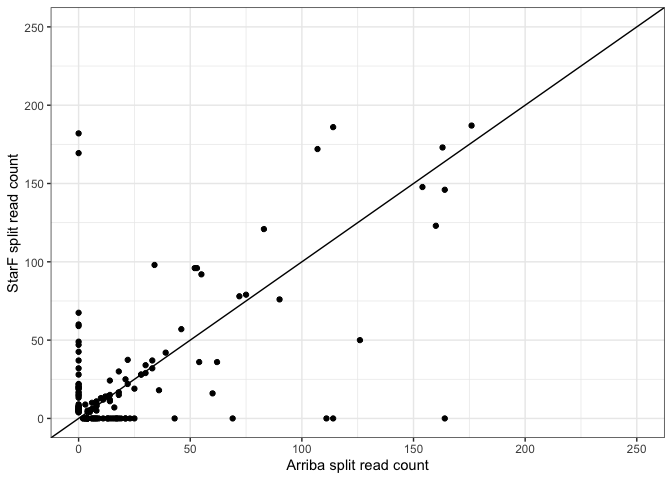

Examine_nonoverlapping_STARF_Arriba
================
bhaas
2024-09-10

``` r
data = read.csv("illum_fusions_w_gene_coords.tsv.wAnnots", header=T, sep="\t")

data %>% head()
```

    ##   sample.starF FusionName.StarF JunctionReadCount SpanningFragCount est_J
    ## 1        RT112     FGFR3--TACC3              1693               671  1693
    ## 2        RT112     EEF1DP3--FRY                56                30    56
    ## 3        RT112  DHRS7B--ALDH3A1                38                 0    38
    ## 4        RT112    TVP23C--CDRT4                38                51    38
    ## 5        RT112     LEPROT--LEPR                12                 3    12
    ## 6        RT112    TVP23C--CDRT4                12                31    12
    ##    est_S      SpliceType                  LeftGene   LeftBreakpoint
    ## 1 671.00 ONLY_REF_SPLICE  FGFR3^ENSG00000068078.16   chr4:1806934:+
    ## 2  30.00 ONLY_REF_SPLICE EEF1DP3^ENSG00000229715.4 chr13:31946181:+
    ## 3   0.00 ONLY_REF_SPLICE DHRS7B^ENSG00000109016.16 chr17:21126991:+
    ## 4  43.61 ONLY_REF_SPLICE TVP23C^ENSG00000175106.15 chr17:15540433:-
    ## 5   3.00 ONLY_REF_SPLICE  LEPROT^ENSG00000213625.7  chr1:65425378:+
    ## 6   5.25 ONLY_REF_SPLICE TVP23C^ENSG00000175106.15 chr17:15545785:-
    ##                    RightGene  RightBreakpoint LargeAnchorSupport    FFPM
    ## 1   TACC3^ENSG00000013810.17   chr4:1739702:+           YES_LDAS 46.0287
    ## 2     FRY^ENSG00000073910.18 chr13:32078834:+           YES_LDAS  1.6745
    ## 3 ALDH3A1^ENSG00000108602.16 chr17:19738453:-           YES_LDAS  0.7399
    ## 4    CDRT4^ENSG00000239704.9 chr17:15440285:-           YES_LDAS  1.5890
    ## 5    LEPR^ENSG00000116678.17  chr1:65565546:+           YES_LDAS  0.2920
    ## 6    CDRT4^ENSG00000239704.9 chr17:15440285:-           YES_LDAS  0.3358
    ##   LeftBreakDinuc LeftBreakEntropy RightBreakDinuc RightBreakEntropy
    ## 1             GT           1.8892              AG            1.7819
    ## 2             GT           1.8256              AG            1.7819
    ## 3             GT           1.8295              AG            1.7465
    ## 4             GT           1.8323              AG            1.9899
    ## 5             GT           1.8256              AG            1.9219
    ## 6             GT           1.9086              AG            1.9899
    ##                                                                                                                                                                                                          annots
    ## 1 [ChimerKB,ChimerSeq,TCGA_StarF2019,CCLE_StarF2019,YOSHIHARA_TCGA,Klijn_CellLines,DEEPEST2019,GUO2018CR_TCGA,ChimerPub,TumorFusionsNAR2018,Cosmic,INTRACHROMOSOMAL[chr4:0.05Mb],LOCAL_REARRANGEMENT:+:[48131]]
    ## 2                                                                                                                   [GTEx_recurrent_StarF2019,Babiceanu_Normal,INTRACHROMOSOMAL[chr13:0.08Mb],NEIGHBORS[77828]]
    ## 3                                                                                                                                                               [CCLE_StarF2019,INTRACHROMOSOMAL[chr17:1.37Mb]]
    ## 4                                                                                                                                                             [INTRACHROMOSOMAL[chr17:0.03Mb],NEIGHBORS[26536]]
    ## 5                                                                                                                           [GTEx_recurrent_StarF2019,ChimerSeq,INTRACHROMOSOMAL[chr1:0.09Mb],NEIGHBORS[89682]]
    ## 6                                                                                                                                                             [INTRACHROMOSOMAL[chr17:0.03Mb],NEIGHBORS[26536]]
    ##   lex_ordered_fusion_name proxy_fusion_name.starF
    ## 1      RT112|FGFR3--TACC3      RT112|FGFR3--TACC3
    ## 2      RT112|EEF1DP3--FRY                    <NA>
    ## 3   RT112|ALDH3A1--DHRS7B                    <NA>
    ## 4     RT112|CDRT4--TVP23C                    <NA>
    ## 5      RT112|LEPR--LEPROT                    <NA>
    ## 6     RT112|CDRT4--TVP23C                    <NA>
    ##                                             LR_progs num_LR_progs
    ## 1 JAFFAL,LongGF,ctat-LR-fusion,fusionseeker,pbfusion            5
    ## 2                                               <NA>           NA
    ## 3                                               <NA>           NA
    ## 4                                               <NA>           NA
    ## 5                                               <NA>           NA
    ## 6                                               <NA>           NA
    ##             type FusionName.LR sample.arriba gene1 gene2 confidence
    ## 1 shared_LR_pred  FGFR3--TACC3         RT112 FGFR3 TACC3       high
    ## 2     no_LR_pred          <NA>          <NA>  <NA>  <NA>       <NA>
    ## 3     no_LR_pred          <NA>          <NA>  <NA>  <NA>       <NA>
    ## 4     no_LR_pred          <NA>          <NA>  <NA>  <NA>       <NA>
    ## 5     no_LR_pred          <NA>          <NA>  <NA>  <NA>       <NA>
    ## 6     no_LR_pred          <NA>          <NA>  <NA>  <NA>       <NA>
    ##   split_reads1 split_reads2 discordant_mates FusionName.arriba
    ## 1          303          301              300      FGFR3--TACC3
    ## 2           NA           NA               NA              <NA>
    ## 3           NA           NA               NA              <NA>
    ## 4           NA           NA               NA              <NA>
    ## 5           NA           NA               NA              <NA>
    ## 6           NA           NA               NA              <NA>
    ##   proxy_fusion_name.arriba has_long_read_support        progs
    ## 1       RT112|FGFR3--TACC3                  TRUE starF,arriba
    ## 2                     <NA>                 FALSE        starF
    ## 3                     <NA>                 FALSE        starF
    ## 4                     <NA>                 FALSE        starF
    ## 5                     <NA>                 FALSE        starF
    ## 6                     <NA>                 FALSE        starF
    ##          left_gene_coords       right_gene_coords priority_fusion_name
    ## 1    chr4:1793307-1808872    chr4:1721490-1745176         FGFR3--TACC3
    ## 2 chr13:31846841-31953472 chr13:32031300-32299122         EEF1DP3--FRY
    ## 3 chr17:19737984-19748943 chr17:21123364-21193265      DHRS7B--ALDH3A1
    ## 4 chr17:15436015-15503608 chr17:15502264-15563595        TVP23C--CDRT4
    ## 5  chr1:65420652-65641559  chr1:65420587-65436007         LEPROT--LEPR
    ## 6 chr17:15436015-15503608 chr17:15502264-15563595        TVP23C--CDRT4
    ##                                                                                                                                                                                                                                                                                                                           annots.1
    ## 1 [FGFR3:OncocartaV1_panel,FGFR3:ArcherDX_panel,FGFR3:Oncogene,FGFR3:FoundationOne_panel,FGFR3:OncomapV4_panel];[TACC3:Oncogene];[Cosmic,ChimerPub,YOSHIHARA_TCGA,TumorFusionsNAR2018,ChimerKB,ChimerSeq,CCLE_StarF2019,TCGA_StarF2019,GUO2018CR_TCGA,Klijn_CellLines];INTRACHROMOSOMAL[chr4:0.05Mb];LOCAL_REARRANGEMENT:+:[48131]
    ## 2                                                                                                                                                                                                                                      [Babiceanu_Normal,GTEx_recurrent_StarF2019];INTRACHROMOSOMAL[chr13:0.08Mb];NEIGHBORS[77828]
    ## 3                                                                                                                                                                                                                                                                                  [CCLE_StarF2019];INTRACHROMOSOMAL[chr17:1.37Mb]
    ## 4                                                                                                                                                                                                                                                                      INTRACHROMOSOMAL[chr17:0.00Mb];NEIGHBORS_OVERLAP:-:-:[1344]
    ## 5                                                                                                                                                                                                                                              [ChimerSeq,GTEx_recurrent_StarF2019];INTRACHROMOSOMAL[chr1:0.09Mb];NEIGHBORS[89682]
    ## 6                                                                                                                                                                                                                                                                      INTRACHROMOSOMAL[chr17:0.00Mb];NEIGHBORS_OVERLAP:-:-:[1344]

``` r
# restrict to those fusion gene pairs that have long read support.

fusions_w_long_reads = data %>% filter(has_long_read_support) %>% select(lex_ordered_fusion_name) %>% unique() %>% pull(lex_ordered_fusion_name)

data = data %>% filter(lex_ordered_fusion_name %in% fusions_w_long_reads)
```

``` r
data = data %>% mutate(sum_arriba_reads = split_reads1 + split_reads2 + discordant_mates) %>%
    mutate(sum_starF_reads = est_J + est_S) 


data %>% head()
```

    ##   sample.starF FusionName.StarF JunctionReadCount SpanningFragCount est_J
    ## 1        RT112     FGFR3--TACC3              1693               671  1693
    ## 2        RT112      WHSC1--GRK4                 9                 8     9
    ## 3        SKBR3    TATDN1--GSDMB              2783                 1  2783
    ## 4        SKBR3    TATDN1--GSDMB              2783                 1  2783
    ## 5        SKBR3    TATDN1--GSDMB               872                 0   872
    ## 6        SKBR3    TATDN1--GSDMB               872                 0   872
    ##    est_S      SpliceType                  LeftGene   LeftBreakpoint
    ## 1 671.00 ONLY_REF_SPLICE  FGFR3^ENSG00000068078.16   chr4:1806934:+
    ## 2   5.41 ONLY_REF_SPLICE  WHSC1^ENSG00000109685.16   chr4:1939778:+
    ## 3   0.75 ONLY_REF_SPLICE TATDN1^ENSG00000147687.15 chr8:124539025:-
    ## 4   0.75 ONLY_REF_SPLICE TATDN1^ENSG00000147687.15 chr8:124539025:-
    ## 5   0.00 ONLY_REF_SPLICE TATDN1^ENSG00000147687.15 chr8:124539025:-
    ## 6   0.00 ONLY_REF_SPLICE TATDN1^ENSG00000147687.15 chr8:124539025:-
    ##                  RightGene  RightBreakpoint LargeAnchorSupport    FFPM
    ## 1 TACC3^ENSG00000013810.17   chr4:1739702:+           YES_LDAS 46.0287
    ## 2  GRK4^ENSG00000125388.18   chr4:2992215:+           YES_LDAS  0.2805
    ## 3 GSDMB^ENSG00000073605.17 chr17:39909924:-           YES_LDAS 67.8052
    ## 4 GSDMB^ENSG00000073605.17 chr17:39909924:-           YES_LDAS 67.8052
    ## 5 GSDMB^ENSG00000073605.17 chr17:39905985:-           YES_LDAS 21.2397
    ## 6 GSDMB^ENSG00000073605.17 chr17:39905985:-           YES_LDAS 21.2397
    ##   LeftBreakDinuc LeftBreakEntropy RightBreakDinuc RightBreakEntropy
    ## 1             GT           1.8892              AG            1.7819
    ## 2             GT           1.8062              AG            1.8062
    ## 3             GT           1.9219              AG            1.5628
    ## 4             GT           1.9219              AG            1.5628
    ## 5             GT           1.9219              AG            1.9086
    ## 6             GT           1.9219              AG            1.9086
    ##                                                                                                                                                                                                          annots
    ## 1 [ChimerKB,ChimerSeq,TCGA_StarF2019,CCLE_StarF2019,YOSHIHARA_TCGA,Klijn_CellLines,DEEPEST2019,GUO2018CR_TCGA,ChimerPub,TumorFusionsNAR2018,Cosmic,INTRACHROMOSOMAL[chr4:0.05Mb],LOCAL_REARRANGEMENT:+:[48131]]
    ## 2                                                                                                                                                               [Klijn_CellLines,INTRACHROMOSOMAL[chr4:0.98Mb]]
    ## 3                                                                                                                                      [Klijn_CellLines,ChimerPub,CCLE_StarF2019,INTERCHROMOSOMAL[chr8--chr17]]
    ## 4                                                                                                                                      [Klijn_CellLines,ChimerPub,CCLE_StarF2019,INTERCHROMOSOMAL[chr8--chr17]]
    ## 5                                                                                                                                      [Klijn_CellLines,ChimerPub,CCLE_StarF2019,INTERCHROMOSOMAL[chr8--chr17]]
    ## 6                                                                                                                                      [Klijn_CellLines,ChimerPub,CCLE_StarF2019,INTERCHROMOSOMAL[chr8--chr17]]
    ##   lex_ordered_fusion_name proxy_fusion_name.starF
    ## 1      RT112|FGFR3--TACC3      RT112|FGFR3--TACC3
    ## 2       RT112|GRK4--WHSC1       RT112|WHSC1--GRK4
    ## 3     SKBR3|GSDMB--TATDN1     SKBR3|TATDN1--GSDMB
    ## 4     SKBR3|GSDMB--TATDN1     SKBR3|TATDN1--GSDMB
    ## 5     SKBR3|GSDMB--TATDN1     SKBR3|TATDN1--GSDMB
    ## 6     SKBR3|GSDMB--TATDN1     SKBR3|TATDN1--GSDMB
    ##                                             LR_progs num_LR_progs
    ## 1 JAFFAL,LongGF,ctat-LR-fusion,fusionseeker,pbfusion            5
    ## 2 JAFFAL,LongGF,ctat-LR-fusion,fusionseeker,pbfusion            5
    ## 3 JAFFAL,LongGF,ctat-LR-fusion,fusionseeker,pbfusion            5
    ## 4 JAFFAL,LongGF,ctat-LR-fusion,fusionseeker,pbfusion            5
    ## 5 JAFFAL,LongGF,ctat-LR-fusion,fusionseeker,pbfusion            5
    ## 6 JAFFAL,LongGF,ctat-LR-fusion,fusionseeker,pbfusion            5
    ##             type FusionName.LR sample.arriba  gene1 gene2 confidence
    ## 1 shared_LR_pred  FGFR3--TACC3         RT112  FGFR3 TACC3       high
    ## 2 shared_LR_pred   WHSC1--GRK4          <NA>   <NA>  <NA>       <NA>
    ## 3 shared_LR_pred TATDN1--GSDMB         SKBR3 TATDN1 GSDMB       high
    ## 4 shared_LR_pred TATDN1--GSDMB         SKBR3 TATDN1 GSDMB       high
    ## 5 shared_LR_pred TATDN1--GSDMB         SKBR3 TATDN1 GSDMB       high
    ## 6 shared_LR_pred TATDN1--GSDMB         SKBR3 TATDN1 GSDMB       high
    ##   split_reads1 split_reads2 discordant_mates FusionName.arriba
    ## 1          303          301              300      FGFR3--TACC3
    ## 2           NA           NA               NA              <NA>
    ## 3           30          301                3     TATDN1--GSDMB
    ## 4            7          100                0     TATDN1--GSDMB
    ## 5           30          301                3     TATDN1--GSDMB
    ## 6            7          100                0     TATDN1--GSDMB
    ##   proxy_fusion_name.arriba has_long_read_support        progs
    ## 1       RT112|FGFR3--TACC3                  TRUE starF,arriba
    ## 2                     <NA>                  TRUE        starF
    ## 3      SKBR3|TATDN1--GSDMB                  TRUE starF,arriba
    ## 4      SKBR3|TATDN1--GSDMB                  TRUE starF,arriba
    ## 5      SKBR3|TATDN1--GSDMB                  TRUE starF,arriba
    ## 6      SKBR3|TATDN1--GSDMB                  TRUE starF,arriba
    ##          left_gene_coords        right_gene_coords priority_fusion_name
    ## 1    chr4:1793307-1808872     chr4:1721490-1745176         FGFR3--TACC3
    ## 2    chr4:2963608-3040747     chr4:1871424-1982207          WHSC1--GRK4
    ## 3 chr17:39904595-39919854 chr8:124488485-124539458        TATDN1--GSDMB
    ## 4 chr17:39904595-39919854 chr8:124488485-124539458        TATDN1--GSDMB
    ## 5 chr17:39904595-39919854 chr8:124488485-124539458        TATDN1--GSDMB
    ## 6 chr17:39904595-39919854 chr8:124488485-124539458        TATDN1--GSDMB
    ##                                                                                                                                                                                                                                                                                                                           annots.1
    ## 1 [FGFR3:OncocartaV1_panel,FGFR3:ArcherDX_panel,FGFR3:Oncogene,FGFR3:FoundationOne_panel,FGFR3:OncomapV4_panel];[TACC3:Oncogene];[Cosmic,ChimerPub,YOSHIHARA_TCGA,TumorFusionsNAR2018,ChimerKB,ChimerSeq,CCLE_StarF2019,TCGA_StarF2019,GUO2018CR_TCGA,Klijn_CellLines];INTRACHROMOSOMAL[chr4:0.05Mb];LOCAL_REARRANGEMENT:+:[48131]
    ## 2                                                                                                                                                                                                                                                                 [WHSC1:Oncogene];[Klijn_CellLines];INTRACHROMOSOMAL[chr4:0.98Mb]
    ## 3                                                                                                                                                                                                                                                         [CCLE_StarF2019,Klijn_CellLines,ChimerPub];INTERCHROMOSOMAL[chr8--chr17]
    ## 4                                                                                                                                                                                                                                                         [CCLE_StarF2019,Klijn_CellLines,ChimerPub];INTERCHROMOSOMAL[chr8--chr17]
    ## 5                                                                                                                                                                                                                                                         [CCLE_StarF2019,Klijn_CellLines,ChimerPub];INTERCHROMOSOMAL[chr8--chr17]
    ## 6                                                                                                                                                                                                                                                         [CCLE_StarF2019,Klijn_CellLines,ChimerPub];INTERCHROMOSOMAL[chr8--chr17]
    ##   sum_arriba_reads sum_starF_reads
    ## 1              904         2364.00
    ## 2               NA           14.41
    ## 3              334         2783.75
    ## 4              107         2783.75
    ## 5              334          872.00
    ## 6              107          872.00

``` r
# sum across fusion isoforms per gene
summary = data %>% group_by(lex_ordered_fusion_name) %>% summarize(StarF_sum_reads = sum(sum_starF_reads, na.rm = T), 
                                                             Arriba_sum_reads = sum(sum_arriba_reads, na.rm=T) )

summary %>% head()
```

    ## # A tibble: 6 × 3
    ##   lex_ordered_fusion_name       StarF_sum_reads Arriba_sum_reads
    ##   <chr>                                   <dbl>            <int>
    ## 1 DMS53|ABR--CDK14                           30               18
    ## 2 DMS53|AC009237.2--TMEM131                  60                0
    ## 3 DMS53|AC010524.2--RPLP0                     4                0
    ## 4 DMS53|AGAP1--IQCA1                          0                4
    ## 5 DMS53|ANKRD18B--CNTNAP3B                    0               13
    ## 6 DMS53|AP003900.6--bP-2189O9.3              32                0

``` r
# compare counts of evidence reads

summary %>% ggplot(aes(y=StarF_sum_reads, x=Arriba_sum_reads)) + geom_point() + xlim(0,250) + ylim(0,250) +
    theme_bw() +
    xlab("Arriba split read count") +
    ylab("StarF split read count") +
    geom_abline(slope=1, intercept=0)
```

    ## Warning: Removed 16 rows containing missing values (`geom_point()`).

<!-- -->

``` r
cor(summary$StarF_sum_reads, summary$Arriba_sum_reads, use='complete.obs')
```

    ## [1] 0.8708661

``` r
summary = summary %>% mutate(progs = 'both') %>%
    mutate(progs = ifelse(StarF_sum_reads == 0, 'arriba-only', progs)) %>%
    mutate(progs = ifelse(Arriba_sum_reads  == 0, 'starF-only', progs)) 

summary %>% head()
```

    ## # A tibble: 6 × 4
    ##   lex_ordered_fusion_name       StarF_sum_reads Arriba_sum_reads progs      
    ##   <chr>                                   <dbl>            <int> <chr>      
    ## 1 DMS53|ABR--CDK14                           30               18 both       
    ## 2 DMS53|AC009237.2--TMEM131                  60                0 starF-only 
    ## 3 DMS53|AC010524.2--RPLP0                     4                0 starF-only 
    ## 4 DMS53|AGAP1--IQCA1                          0                4 arriba-only
    ## 5 DMS53|ANKRD18B--CNTNAP3B                    0               13 arriba-only
    ## 6 DMS53|AP003900.6--bP-2189O9.3              32                0 starF-only

``` r
summary = summary %>% mutate(sum_reads = ifelse( (StarF_sum_reads > 0 & Arriba_sum_reads > 0 ), 
                                                 (StarF_sum_reads + Arriba_sum_reads/2),  
                                                 StarF_sum_reads)) %>%
    mutate(sum_reads = ifelse(sum_reads == 0, 
                              Arriba_sum_reads, 
                              sum_reads) )

summary %>% head()
```

    ## # A tibble: 6 × 5
    ##   lex_ordered_fusion_name       StarF_sum_reads Arriba_sum_reads progs sum_reads
    ##   <chr>                                   <dbl>            <int> <chr>     <dbl>
    ## 1 DMS53|ABR--CDK14                           30               18 both         39
    ## 2 DMS53|AC009237.2--TMEM131                  60                0 star…        60
    ## 3 DMS53|AC010524.2--RPLP0                     4                0 star…         4
    ## 4 DMS53|AGAP1--IQCA1                          0                4 arri…         4
    ## 5 DMS53|ANKRD18B--CNTNAP3B                    0               13 arri…        13
    ## 6 DMS53|AP003900.6--bP-2189O9.3              32                0 star…        32

``` r
summary %>% ggplot(aes(x = progs, y=sum_reads, color=progs)) + geom_jitter() +
    theme_bw() +
    ylim(0,250) +
    ggtitle("Compare read support for fusion pairs according to method")
```

    ## Warning: Removed 18 rows containing missing values (`geom_point()`).

<!-- -->

# compare both vs. arriba-only

``` r
wilcox.test(summary %>% filter(progs == "both") %>% pull(sum_reads),
            summary %>% filter(progs == "arriba-only") %>% pull(sum_reads), alternative = 'greater')
```

    ## 
    ##  Wilcoxon rank sum test with continuity correction
    ## 
    ## data:  summary %>% filter(progs == "both") %>% pull(sum_reads) and summary %>% filter(progs == "arriba-only") %>% pull(sum_reads)
    ## W = 2219, p-value = 2.228e-08
    ## alternative hypothesis: true location shift is greater than 0

# compare both vs. starF-only

``` r
wilcox.test(summary %>% filter(progs == "both") %>% pull(sum_reads),
            summary %>% filter(progs == "starF-only") %>% pull(sum_reads), alternative = 'greater')
```

    ## 
    ##  Wilcoxon rank sum test with continuity correction
    ## 
    ## data:  summary %>% filter(progs == "both") %>% pull(sum_reads) and summary %>% filter(progs == "starF-only") %>% pull(sum_reads)
    ## W = 2633.5, p-value = 3.114e-08
    ## alternative hypothesis: true location shift is greater than 0
