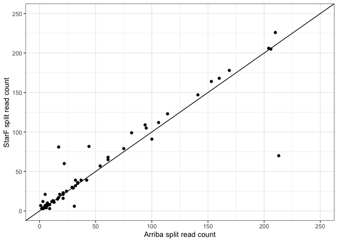

Examine_nonoverlapping_STARF_Arriba
================
bhaas
2024-09-10

``` r
data = read.csv("illum_fusions_w_gene_coords.tsv.wAnnots", header=T, sep="\t")

data %>% head()
```

    ##   proxy_fusion_name.starF type.starF sample.starF FusionName.starF
    ## 1     SKBR3|TATDN1--GSDMB     shared        SKBR3    TATDN1--GSDMB
    ## 2      RT112|FGFR3--TACC3     shared        RT112     FGFR3--TACC3
    ## 3          KIJK|NPM1--ALK     shared         KIJK        NPM1--ALK
    ## 4          K562|BCR--ABL1     shared         K562        BCR--ABL1
    ## 5      K562|BAG6--SLC44A4     shared         K562    BAG6--SLC44A4
    ## 6  HCC1187|CTNND1--SMTNL1     shared      HCC1187   CTNND1--SMTNL1
    ##   lex_ordered_fusion_name   est_J  est_S proxy_fusion_name.arriba type.arriba
    ## 1     SKBR3|GSDMB--TATDN1 2783.00   0.75      SKBR3|TATDN1--GSDMB      shared
    ## 2      RT112|FGFR3--TACC3 1693.00 671.00       RT112|FGFR3--TACC3      shared
    ## 3          KIJK|ALK--NPM1 1553.83 855.70           KIJK|NPM1--ALK      shared
    ## 4          K562|ABL1--BCR  254.00 107.00           K562|BCR--ABL1      shared
    ## 5      K562|BAG6--SLC44A4  226.00 134.00       K562|BAG6--SLC44A4      shared
    ## 6  HCC1187|CTNND1--SMTNL1  206.00  91.00   HCC1187|CTNND1--SMTNL1      shared
    ##   sample.arriba FusionName.arriba sum_split_reads discordant_mates        progs
    ## 1         SKBR3     TATDN1--GSDMB             331                3 starF,arriba
    ## 2         RT112      FGFR3--TACC3             604              300 starF,arriba
    ## 3          KIJK         NPM1--ALK             594              297 starF,arriba
    ## 4          K562         BCR--ABL1             234               99 starF,arriba
    ## 5          K562     BAG6--SLC44A4             210              114 starF,arriba
    ## 6       HCC1187    CTNND1--SMTNL1             204               88 starF,arriba
    ##           left_gene_coords        right_gene_coords priority_fusion_name
    ## 1  chr17:39904595-39919854 chr8:124488485-124539458        TATDN1--GSDMB
    ## 2     chr4:1793307-1808872     chr4:1721490-1745176         FGFR3--TACC3
    ## 3   chr2:29192774-29921566 chr5:171387116-171411137            NPM1--ALK
    ## 4 chr9:130713946-130887675  chr22:23179704-23318037            BCR--ABL1
    ## 5   chr6:31639028-31652705   chr6:31863192-31879046        BAG6--SLC44A4
    ## 6  chr11:57753243-57819546  chr11:57542641-57550274       CTNND1--SMTNL1
    ##                                                                                                                                                                                                                                                                                                                                       annots
    ## 1                                                                                                                                                                                                                                                                   [CCLE_StarF2019,Klijn_CellLines,ChimerPub];INTERCHROMOSOMAL[chr8--chr17]
    ## 2           [FGFR3:OncocartaV1_panel,FGFR3:ArcherDX_panel,FGFR3:Oncogene,FGFR3:FoundationOne_panel,FGFR3:OncomapV4_panel];[TACC3:Oncogene];[Cosmic,ChimerPub,YOSHIHARA_TCGA,TumorFusionsNAR2018,ChimerKB,ChimerSeq,CCLE_StarF2019,TCGA_StarF2019,GUO2018CR_TCGA,Klijn_CellLines];INTRACHROMOSOMAL[chr4:0.05Mb];LOCAL_REARRANGEMENT:+:[48131]
    ## 3                                                       [NPM1:ArcherDX_panel,NPM1:OncomapV4_panel,NPM1:Oncogene,NPM1:FoundationOne_panel];[ALK:Oncogene,ALK:ArcherDX_panel,ALK:FoundationOne_panel];[chimerdb_omim,Klijn_CellLines,chimerdb_pubmed,CCLE_StarF2019,ChimerKB,Cosmic,Mitelman,ChimerPub,ChimerSeq];INTERCHROMOSOMAL[chr5--chr2]
    ## 4 [BCR:FoundationOne_panel,BCR:Oncogene,BCR:ArcherDX_panel];[ABL1:OncocartaV1_panel,ABL1:FoundationOne_panel,ABL1:Oncogene,ABL1:OncomapV4_panel];[chimerdb_omim,GUO2018CR_TCGA,Klijn_CellLines,TCGA_StarF2019,CCLE_StarF2019,chimerdb_pubmed,ChimerSeq,Mitelman,Cosmic,ChimerPub,TumorFusionsNAR2018,ChimerKB];INTERCHROMOSOMAL[chr22--chr9]
    ## 5                                                                                                                                                                                                                                                                          [SLC44A4:Oncogene];[CCLE_StarF2019];INTRACHROMOSOMAL[chr6:0.21Mb]
    ## 6                                                                                                                                                                                                                                                                          [CTNND1:Oncogene];[CCLE_StarF2019];INTRACHROMOSOMAL[chr11:0.20Mb]

``` r
# compare counts of split reads for agreed upon fusions

data %>% filter(progs == "starF,arriba") %>% ggplot(aes(x=sum_split_reads, y=est_J)) + geom_point() + xlim(0,250) + ylim(0,250) +
    theme_bw() +
    xlab("Arriba split read count") +
    ylab("StarF split read count") +
    geom_abline(slope=1, intercept=0)
```

    ## Warning: Removed 4 rows containing missing values (`geom_point()`).

<!-- -->

``` r
cor(data$sum_split_reads, data$est_J, use='complete.obs')
```

    ## [1] 0.7875762

``` r
junction_read_counts = bind_rows(
     data %>% filter(progs == "starF,arriba") %>% 
         mutate(junction_read_count = (est_J + sum_split_reads) / 2 ) %>%
         select(progs, junction_read_count),
     data %>% filter(progs == "arriba") %>% rename(junction_read_count = sum_split_reads) %>%
         select(progs, junction_read_count),
     data %>% filter(progs == "starF") %>% rename(junction_read_count = est_J) %>%
         select(progs, junction_read_count)
)


junction_read_counts %>% head()
```

    ##          progs junction_read_count
    ## 1 starF,arriba            1557.000
    ## 2 starF,arriba            1148.500
    ## 3 starF,arriba            1073.915
    ## 4 starF,arriba             244.000
    ## 5 starF,arriba             218.000
    ## 6 starF,arriba             205.000

``` r
junction_read_counts %>% ggplot(aes(x = progs, y=junction_read_count, color=progs)) + geom_jitter() +
    theme_bw() +
    ylim(0,250)
```

    ## Warning: Removed 3 rows containing missing values (`geom_point()`).

<!-- -->

``` r
# test starF,arriba vs. starF-only

t.test( junction_read_counts %>% filter(progs == "starF,arriba") %>% pull('junction_read_count'),
        junction_read_counts %>% filter(progs == "starF") %>% pull('junction_read_count'))
```

    ## 
    ##  Welch Two Sample t-test
    ## 
    ## data:  junction_read_counts %>% filter(progs == "starF,arriba") %>% pull("junction_read_count") and junction_read_counts %>% filter(progs == "starF") %>% pull("junction_read_count")
    ## t = 2.6286, df = 77.84, p-value = 0.01033
    ## alternative hypothesis: true difference in means is not equal to 0
    ## 95 percent confidence interval:
    ##   18.67598 135.28977
    ## sample estimates:
    ## mean of x mean of y 
    ##  94.88947  17.90659

``` r
wilcox.test(junction_read_counts %>% filter(progs == "starF,arriba") %>% pull('junction_read_count'),
        junction_read_counts %>% filter(progs == "starF") %>% pull('junction_read_count'), alternative = 'greater')
```

    ## 
    ##  Wilcoxon rank sum test with continuity correction
    ## 
    ## data:  junction_read_counts %>% filter(progs == "starF,arriba") %>% pull("junction_read_count") and junction_read_counts %>% filter(progs == "starF") %>% pull("junction_read_count")
    ## W = 2220, p-value = 0.0008473
    ## alternative hypothesis: true location shift is greater than 0

``` r
# test starF,arriba vs. arriba-only

t.test( junction_read_counts %>% filter(progs == "starF,arriba") %>% pull('junction_read_count'),
        junction_read_counts %>% filter(progs == "arriba") %>% pull('junction_read_count'))
```

    ## 
    ##  Welch Two Sample t-test
    ## 
    ## data:  junction_read_counts %>% filter(progs == "starF,arriba") %>% pull("junction_read_count") and junction_read_counts %>% filter(progs == "arriba") %>% pull("junction_read_count")
    ## t = 2.6649, df = 78.791, p-value = 0.009337
    ## alternative hypothesis: true difference in means is not equal to 0
    ## 95 percent confidence interval:
    ##   19.81655 136.79571
    ## sample estimates:
    ## mean of x mean of y 
    ##  94.88947  16.58333

``` r
# p-value = 0.009337
```

``` r
wilcox.test(junction_read_counts %>% filter(progs == "starF,arriba") %>% pull('junction_read_count'),
        junction_read_counts %>% filter(progs == "arriba") %>% pull('junction_read_count'), alternative = 'greater')
```

    ## 
    ##  Wilcoxon rank sum test with continuity correction
    ## 
    ## data:  junction_read_counts %>% filter(progs == "starF,arriba") %>% pull("junction_read_count") and junction_read_counts %>% filter(progs == "arriba") %>% pull("junction_read_count")
    ## W = 1995.5, p-value = 2.398e-05
    ## alternative hypothesis: true location shift is greater than 0
