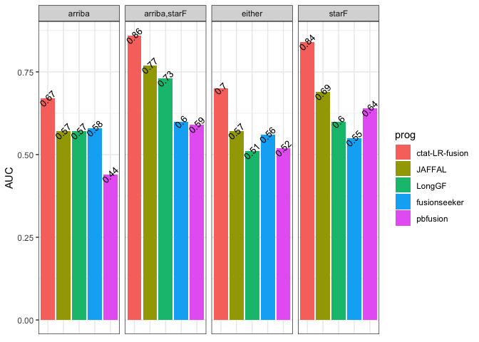

Illum_TP_uniq_FP_summary.Rmd
================
bhaas
2024-07-22

``` r
ordered_progs = c('ctat-LR-fusion', 'JAFFAL', 'LongGF', 'fusionseeker', 'pbfusion')
```

``` r
ALLOW_PARALOG_PROXIES = TRUE

if (ALLOW_PARALOG_PROXIES) {
    
     files = c(
    "./__illum_TP_uniq_FP.starF/data/eval_illum_supported.okPara_ignoreUnsure.results.scored.PR.AUC",
    "./__illum_TP_uniq_FP.arriba,starF/data/eval_illum_supported.okPara_ignoreUnsure.results.scored.PR.AUC",
    "./__illum_TP_uniq_FP.either/data/eval_illum_supported.okPara_ignoreUnsure.results.scored.PR.AUC",
    "./__illum_TP_uniq_FP.arriba/data/eval_illum_supported.okPara_ignoreUnsure.results.scored.PR.AUC"
    )
    
    
} else {

 files = c(
    "./__illum_TP_uniq_FP.starF/data/eval_illum_supported.ignoreUnsure.results.scored.PR.AUC",
    "./__illum_TP_uniq_FP.arriba,starF/data/eval_illum_supported.ignoreUnsure.results.scored.PR.AUC",
    "./__illum_TP_uniq_FP.either/data/eval_illum_supported.ignoreUnsure.results.scored.PR.AUC",
    "./__illum_TP_uniq_FP.arriba/data/eval_illum_supported.ignoreUnsure.results.scored.PR.AUC"
    )
 
}
```

``` r
PR_AUC_df = NULL

for (file in files) {
    
    df = read.csv(file, sep="\t", header=F, stringsAsFactors = F)
    colnames(df) = c('prog', 'AUC')
    df$fname = file

    PR_AUC_df = bind_rows(PR_AUC_df, df)
}


PR_AUC_df$prog = factor(PR_AUC_df$prog, levels=ordered_progs)

PR_AUC_df %>% head()
```

    ##             prog  AUC
    ## 1 ctat-LR-fusion 0.84
    ## 2         JAFFAL 0.69
    ## 3       pbfusion 0.64
    ## 4         LongGF 0.60
    ## 5   fusionseeker 0.55
    ## 6 ctat-LR-fusion 0.86
    ##                                                                                                   fname
    ## 1        ./__illum_TP_uniq_FP.starF/data/eval_illum_supported.okPara_ignoreUnsure.results.scored.PR.AUC
    ## 2        ./__illum_TP_uniq_FP.starF/data/eval_illum_supported.okPara_ignoreUnsure.results.scored.PR.AUC
    ## 3        ./__illum_TP_uniq_FP.starF/data/eval_illum_supported.okPara_ignoreUnsure.results.scored.PR.AUC
    ## 4        ./__illum_TP_uniq_FP.starF/data/eval_illum_supported.okPara_ignoreUnsure.results.scored.PR.AUC
    ## 5        ./__illum_TP_uniq_FP.starF/data/eval_illum_supported.okPara_ignoreUnsure.results.scored.PR.AUC
    ## 6 ./__illum_TP_uniq_FP.arriba,starF/data/eval_illum_supported.okPara_ignoreUnsure.results.scored.PR.AUC

``` r
PR_AUC_df$type = str_replace(PR_AUC_df$fname, "./__illum_TP_uniq_FP.", "")
PR_AUC_df$type = str_replace(PR_AUC_df$type, "/data/eval_illum_supported.*$", "")

PR_AUC_df %>% head()
```

    ##             prog  AUC
    ## 1 ctat-LR-fusion 0.84
    ## 2         JAFFAL 0.69
    ## 3       pbfusion 0.64
    ## 4         LongGF 0.60
    ## 5   fusionseeker 0.55
    ## 6 ctat-LR-fusion 0.86
    ##                                                                                                   fname
    ## 1        ./__illum_TP_uniq_FP.starF/data/eval_illum_supported.okPara_ignoreUnsure.results.scored.PR.AUC
    ## 2        ./__illum_TP_uniq_FP.starF/data/eval_illum_supported.okPara_ignoreUnsure.results.scored.PR.AUC
    ## 3        ./__illum_TP_uniq_FP.starF/data/eval_illum_supported.okPara_ignoreUnsure.results.scored.PR.AUC
    ## 4        ./__illum_TP_uniq_FP.starF/data/eval_illum_supported.okPara_ignoreUnsure.results.scored.PR.AUC
    ## 5        ./__illum_TP_uniq_FP.starF/data/eval_illum_supported.okPara_ignoreUnsure.results.scored.PR.AUC
    ## 6 ./__illum_TP_uniq_FP.arriba,starF/data/eval_illum_supported.okPara_ignoreUnsure.results.scored.PR.AUC
    ##           type
    ## 1        starF
    ## 2        starF
    ## 3        starF
    ## 4        starF
    ## 5        starF
    ## 6 arriba,starF

``` r
illum_fusion_acc_barplot = PR_AUC_df %>% ggplot(aes(x=prog, y=AUC)) + geom_col(aes(fill=prog)) + facet_wrap(~type, ncol=4) +
    theme_bw() +
    theme(axis.title.x=element_blank(),
        axis.text.x=element_blank(),
        axis.ticks.x=element_blank())

illum_fusion_acc_barplot 
```

<!-- -->

``` r
ggsave(illum_fusion_acc_barplot, filename = "illum_fusion_accuracy_barplot.svg", width=7, height=3.5)
```

``` r
write.table(PR_AUC_df, file="PR_AUC_df.summary.tsv", quote=F, sep="\t", row.names=F)
```
