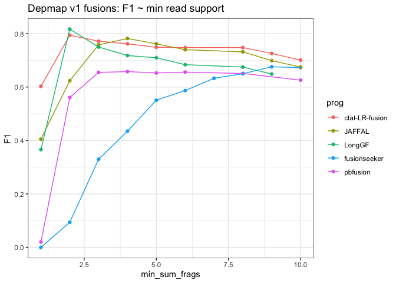
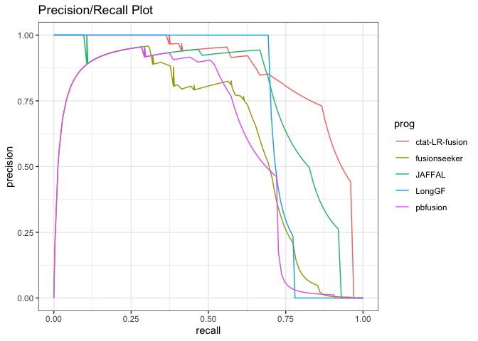

DepMap Fusion Benchmarking
================
bhaas
2024-02-01

``` r
PROGS = c('ctat-LR-fusion', 'JAFFAL', 'LongGF', 'fusionseeker', 'pbfusion'); 


USE_PARALOG_PROXIES = TRUE


if (USE_PARALOG_PROXIES) {
    # or allow for paralogs as proxies:
    scored_predictions_file = paste0("data/eval_illum_supported.okPara_ignoreUnsure.results.scored")
} else {
    scored_predictions_file = paste0("data/eval_illum_supported.ignoreUnsure.results.scored")
}


ROC_file = paste0(scored_predictions_file, ".ROC")
```

``` r
fusion_preds = read.table("data/preds.collected.gencode_mapped.wAnnot.filt.pass.proxy_assignments.gz", header=T, sep="\t", stringsAsFactors = F) %>%
    filter(prog %in% PROGS)

fusion_preds$prog = factor(fusion_preds$prog, levels=PROGS)

fusion_preds %>% head()
```

    ##              proxy_fusion_name proxy_fusion_type  sample           prog
    ## 1 HCC1395|PDIA5--CH507-513H4.1   dominant_choice HCC1395 ctat-LR-fusion
    ## 2       HCC1395|EIF3K--CYP39A1   dominant_choice HCC1395 ctat-LR-fusion
    ## 3        HCC1395|PRRC2B--FUBP3   dominant_choice HCC1395 ctat-LR-fusion
    ## 4        HCC1395|PLA2R1--RBMS1   dominant_choice HCC1395 ctat-LR-fusion
    ## 5         HCC1395|RAB7A--LRCH3   dominant_choice HCC1395 ctat-LR-fusion
    ## 6        HCC1395|HELZ--HMGB1P7   dominant_choice HCC1395 ctat-LR-fusion
    ##                 fusion                     breakpoint num_reads
    ## 1 PDIA5--CH507-513H4.1  chr3:123124343--chr21:8222961       140
    ## 2       EIF3K--CYP39A1  chr19:38632678--chr6:46639668        54
    ## 3        PRRC2B--FUBP3 chr9:131394263--chr9:130609954        46
    ## 4        PLA2R1--RBMS1 chr2:159976068--chr2:160303487        40
    ## 5         RAB7A--LRCH3 chr3:128726359--chr3:197865423        26
    ## 6        HELZ--HMGB1P7 chr17:67239356--chr10:31912970        18
    ##                         mapped_gencode_A_gene_list
    ## 1                             MIR7110,PDIA5,SEC22A
    ## 2                                            EIF3K
    ## 3 AL358781.1,PRRC2B,RP11-334J6.7,SNORD62A,SNORD62B
    ## 4                                           PLA2R1
    ## 5         FTH1P4,MARK2P8,RAB7A,RN7SL698P,RPS15AP16
    ## 6         HELZ,RP11-401F2.3,RP11-401F2.4,RPL36AP48
    ##                                                                              mapped_gencode_B_gene_list
    ## 1 CH507-513H4.1,CH507-513H4.6,FP671120.2,FP671120.3,FP671120.4,FP671120.7,MIR3648-2,MIR3687-2,MIR6724-3
    ## 2                                                                                               CYP39A1
    ## 3                                                                                         FUBP3,MIR6856
    ## 4                                                                                  MIR4785,RBMS1,RMRPP3
    ## 5                                                                           AC055764.1,AC144530.1,LRCH3
    ## 6                                                                                      ARHGAP12,HMGB1P7
    ##                                                                                                                                               annots
    ## 1                                      PDIA5--CH507-513H4.1:INTERCHROMOSOMAL[chr3--chr21];;(recip)CH507-513H4.1--PDIA5:INTERCHROMOSOMAL[chr21--chr3]
    ## 2 EIF3K--CYP39A1:[Klijn_CellLines,Cosmic,ChimerKB,CCLE_StarF2019];INTERCHROMOSOMAL[chr19--chr6];;(recip)CYP39A1--EIF3K:INTERCHROMOSOMAL[chr6--chr19]
    ## 3                                   PRRC2B--FUBP3:[CCLE_StarF2019];INTRACHROMOSOMAL[chr9:0.76Mb];;(recip)FUBP3--PRRC2B:INTRACHROMOSOMAL[chr9:0.76Mb]
    ## 4   PLA2R1--RBMS1:[CCLE_StarF2019,Klijn_CellLines,ChimerKB,Cosmic];INTRACHROMOSOMAL[chr2:0.21Mb];;(recip)RBMS1--PLA2R1:INTRACHROMOSOMAL[chr2:0.21Mb]
    ## 5                                   RAB7A--LRCH3:[CCLE_StarF2019];INTRACHROMOSOMAL[chr3:68.98Mb];;(recip)LRCH3--RAB7A:INTRACHROMOSOMAL[chr3:68.98Mb]
    ## 6                                                  HELZ--HMGB1P7:INTERCHROMOSOMAL[chr17--chr10];;(recip)HMGB1P7--HELZ:INTERCHROMOSOMAL[chr10--chr17]

``` r
# remove the unsure preds
unsure_preds = read.table("data/preds.collected.gencode_mapped.wAnnot.filt.pass.proxy_assignments.byProgAgree.nonunique.unsure_set", header=T, sep="\t", stringsAsFactors = F)

nrow(fusion_preds)
```

    ## [1] 108809

``` r
fusion_preds = fusion_preds %>% filter(! proxy_fusion_name %in% unsure_preds$proxy_fusion_name)
nrow(fusion_preds)
```

    ## [1] 30722

``` r
p = fusion_preds %>% 
    select(sample, prog, fusion) %>% unique() %>%
    group_by(sample, prog) %>% tally(name='num_fusions') %>%
    ggplot(aes(x=prog, y=num_fusions)) +
    theme_bw() +
    geom_col(aes(fill=prog)) + facet_wrap(~sample)  + 
    theme(axis.text.x = element_text(angle = 90, hjust = 1)) 

p 
```

<!-- -->

``` r
truth_data = read.table("data/preds.collected.gencode_mapped.wAnnot.filt.pass.proxy_assignments.byProgAgree.illum_agree.truth_set",
                  header=T, sep="\t", stringsAsFactors = F)


truth_data %>% head()
```

    ##        proxy_fusion_name                                         prog_names
    ## 1  HCC1187|PLXND1--TMCC1 JAFFAL,LongGF,ctat-LR-fusion,fusionseeker,pbfusion
    ## 2     KIJK|YTHDF2--TAF12 JAFFAL,LongGF,ctat-LR-fusion,fusionseeker,pbfusion
    ## 3 HCC1395|EIF3K--CYP39A1 JAFFAL,LongGF,ctat-LR-fusion,fusionseeker,pbfusion
    ## 4     DMS53|USP43--CNTLN JAFFAL,LongGF,ctat-LR-fusion,fusionseeker,pbfusion
    ## 5  HCC1395|KPNA1--EEFSEC JAFFAL,LongGF,ctat-LR-fusion,fusionseeker,pbfusion
    ## 6        VCAP|PSMG1--UNK JAFFAL,LongGF,ctat-LR-fusion,fusionseeker,pbfusion
    ##   num_progs
    ## 1         5
    ## 2         5
    ## 3         5
    ## 4         5
    ## 5         5
    ## 6         5

``` r
truth_data$sample_name = sapply(truth_data$proxy_fusion_name, function(x) { str_split(x, "\\|")[[1]][1]})

head(truth_data)
```

    ##        proxy_fusion_name                                         prog_names
    ## 1  HCC1187|PLXND1--TMCC1 JAFFAL,LongGF,ctat-LR-fusion,fusionseeker,pbfusion
    ## 2     KIJK|YTHDF2--TAF12 JAFFAL,LongGF,ctat-LR-fusion,fusionseeker,pbfusion
    ## 3 HCC1395|EIF3K--CYP39A1 JAFFAL,LongGF,ctat-LR-fusion,fusionseeker,pbfusion
    ## 4     DMS53|USP43--CNTLN JAFFAL,LongGF,ctat-LR-fusion,fusionseeker,pbfusion
    ## 5  HCC1395|KPNA1--EEFSEC JAFFAL,LongGF,ctat-LR-fusion,fusionseeker,pbfusion
    ## 6        VCAP|PSMG1--UNK JAFFAL,LongGF,ctat-LR-fusion,fusionseeker,pbfusion
    ##   num_progs sample_name
    ## 1         5     HCC1187
    ## 2         5        KIJK
    ## 3         5     HCC1395
    ## 4         5       DMS53
    ## 5         5     HCC1395
    ## 6         5        VCAP

``` r
truth_data_counts = truth_data %>% rename(sample=sample_name) %>% group_by(sample) %>% tally(name='num_truth_fusions')

truth_data_counts %>% arrange(num_truth_fusions)
```

    ## # A tibble: 8 × 2
    ##   sample  num_truth_fusions
    ##   <chr>               <int>
    ## 1 RT112                   1
    ## 2 KIJK                    2
    ## 3 K562                    7
    ## 4 DMS53                   9
    ## 5 HCC1187                 9
    ## 6 HCC1395                13
    ## 7 SKBR3                  15
    ## 8 VCAP                   19

``` r
truth_data_counts %>% summarise(sum_truth_fusions = sum(num_truth_fusions))
```

    ## # A tibble: 1 × 1
    ##   sum_truth_fusions
    ##               <int>
    ## 1                75

``` r
# 75 proxy truth fusions
```

``` r
p_fusion_counts_barplot = p + geom_hline(data=truth_data_counts, aes(yintercept=num_truth_fusions))

p_fusion_counts_barplot
```

<!-- -->

``` r
p_fusion_counts_barplot + scale_y_continuous(trans='log10')
```

<!-- -->

``` r
# unnest prog names

truth_data = truth_data %>% mutate(prog_names = str_split(prog_names, ","))  %>% unnest(prog_names)

truth_data %>% head()
```

    ## # A tibble: 6 × 4
    ##   proxy_fusion_name     prog_names     num_progs sample_name
    ##   <chr>                 <chr>              <int> <chr>      
    ## 1 HCC1187|PLXND1--TMCC1 JAFFAL                 5 HCC1187    
    ## 2 HCC1187|PLXND1--TMCC1 LongGF                 5 HCC1187    
    ## 3 HCC1187|PLXND1--TMCC1 ctat-LR-fusion         5 HCC1187    
    ## 4 HCC1187|PLXND1--TMCC1 fusionseeker           5 HCC1187    
    ## 5 HCC1187|PLXND1--TMCC1 pbfusion               5 HCC1187    
    ## 6 KIJK|YTHDF2--TAF12    JAFFAL                 5 KIJK

``` r
#Organize according to pred class
    
scored_data = read.table(scored_predictions_file, header=T, sep="\t", stringsAsFactors = F) %>% 
    filter(prog %in% PROGS)

scored_data$prog = factor(scored_data$prog, levels=PROGS)

scored_data %>% head()
```

    ##   pred_result            proxy_fusion_name proxy_fusion_type  sample
    ## 1          TP HCC1395|PDIA5--CH507-513H4.1   dominant_choice HCC1395
    ## 2          TP       HCC1395|EIF3K--CYP39A1   dominant_choice HCC1395
    ## 3  NA-UNCLASS        HCC1395|PRRC2B--FUBP3   dominant_choice HCC1395
    ## 4          TP        HCC1395|PLA2R1--RBMS1   dominant_choice HCC1395
    ## 5          TP         HCC1395|RAB7A--LRCH3   dominant_choice HCC1395
    ## 6          TP        HCC1395|HELZ--HMGB1P7   dominant_choice HCC1395
    ##             prog               fusion                     breakpoint num_reads
    ## 1 ctat-LR-fusion PDIA5--CH507-513H4.1  chr3:123124343--chr21:8222961       140
    ## 2 ctat-LR-fusion       EIF3K--CYP39A1  chr19:38632678--chr6:46639668        54
    ## 3 ctat-LR-fusion        PRRC2B--FUBP3 chr9:131394263--chr9:130609954        46
    ## 4 ctat-LR-fusion        PLA2R1--RBMS1 chr2:159976068--chr2:160303487        40
    ## 5 ctat-LR-fusion         RAB7A--LRCH3 chr3:128726359--chr3:197865423        26
    ## 6 ctat-LR-fusion        HELZ--HMGB1P7 chr17:67239356--chr10:31912970        18
    ##                         mapped_gencode_A_gene_list
    ## 1                             MIR7110,PDIA5,SEC22A
    ## 2                                            EIF3K
    ## 3 AL358781.1,PRRC2B,RP11-334J6.7,SNORD62A,SNORD62B
    ## 4                                           PLA2R1
    ## 5         FTH1P4,MARK2P8,RAB7A,RN7SL698P,RPS15AP16
    ## 6         HELZ,RP11-401F2.3,RP11-401F2.4,RPL36AP48
    ##                                                                              mapped_gencode_B_gene_list
    ## 1 CH507-513H4.1,CH507-513H4.6,FP671120.2,FP671120.3,FP671120.4,FP671120.7,MIR3648-2,MIR3687-2,MIR6724-3
    ## 2                                                                                               CYP39A1
    ## 3                                                                                         FUBP3,MIR6856
    ## 4                                                                                  MIR4785,RBMS1,RMRPP3
    ## 5                                                                           AC055764.1,AC144530.1,LRCH3
    ## 6                                                                                      ARHGAP12,HMGB1P7
    ##                                                                                                                                               annots
    ## 1                                      PDIA5--CH507-513H4.1:INTERCHROMOSOMAL[chr3--chr21];;(recip)CH507-513H4.1--PDIA5:INTERCHROMOSOMAL[chr21--chr3]
    ## 2 EIF3K--CYP39A1:[Klijn_CellLines,Cosmic,ChimerKB,CCLE_StarF2019];INTERCHROMOSOMAL[chr19--chr6];;(recip)CYP39A1--EIF3K:INTERCHROMOSOMAL[chr6--chr19]
    ## 3                                   PRRC2B--FUBP3:[CCLE_StarF2019];INTRACHROMOSOMAL[chr9:0.76Mb];;(recip)FUBP3--PRRC2B:INTRACHROMOSOMAL[chr9:0.76Mb]
    ## 4   PLA2R1--RBMS1:[CCLE_StarF2019,Klijn_CellLines,ChimerKB,Cosmic];INTRACHROMOSOMAL[chr2:0.21Mb];;(recip)RBMS1--PLA2R1:INTRACHROMOSOMAL[chr2:0.21Mb]
    ## 5                                   RAB7A--LRCH3:[CCLE_StarF2019];INTRACHROMOSOMAL[chr3:68.98Mb];;(recip)LRCH3--RAB7A:INTRACHROMOSOMAL[chr3:68.98Mb]
    ## 6                                                  HELZ--HMGB1P7:INTERCHROMOSOMAL[chr17--chr10];;(recip)HMGB1P7--HELZ:INTERCHROMOSOMAL[chr10--chr17]
    ##                                                                                                 explanation
    ## 1 first encounter of TP ctat-LR-fusion,HCC1395|CH507-528H12.1--PDIA5 (para of HCC1395|CH507-513H4.1--PDIA5)
    ## 2                                               first encounter of TP ctat-LR-fusion,HCC1395|EIF3K--CYP39A1
    ## 3                                                     not classifying HCC1395|PRRC2B--FUBP3, in unsure list
    ## 4                                                first encounter of TP ctat-LR-fusion,HCC1395|PLA2R1--RBMS1
    ## 5                                                 first encounter of TP ctat-LR-fusion,HCC1395|RAB7A--LRCH3
    ## 6                                                first encounter of TP ctat-LR-fusion,HCC1395|HELZ--HMGB1P7
    ##                 selected_fusion
    ## 1 HCC1395|CH507-528H12.1--PDIA5
    ## 2        HCC1395|EIF3K--CYP39A1
    ## 3                             .
    ## 4         HCC1395|PLA2R1--RBMS1
    ## 5          HCC1395|RAB7A--LRCH3
    ## 6         HCC1395|HELZ--HMGB1P7

``` r
depmap_illum_bmark_TP_FP_barplot = scored_data %>% filter(pred_result %in% c("TP", "FP", "FN")) %>% 
    group_by(sample, prog, pred_result) %>% 
    tally(name='fusion_counts') %>%
    ggplot(aes(x=prog, y=fusion_counts, fill=factor(pred_result, levels=c('FP', 'TP', 'FN')))) + 
    theme_bw() +
    geom_col() + facet_wrap(~sample)  +
        theme(axis.text.x = element_text(angle = 90, hjust = 1)) + scale_y_continuous(trans='log10')
    
depmap_illum_bmark_TP_FP_barplot
```

<!-- -->

``` r
ggsave(depmap_illum_bmark_TP_FP_barplot, filename="depmap_illum_bmark_TP_FP_barplot.svg", width=7, height=3.5)
```

# accuracy analysis

``` r
data = read.table(ROC_file, header=T, sep="\t", stringsAsFactors = F) 

data = data %>% filter(prog %in% PROGS)

data$prog = factor(data$prog, levels=PROGS)

data %>% head()
```

    ##       prog min_sum_frags TP   FP FN  TPR  PPV    F1
    ## 1 pbfusion             1 68 5630  7 0.91 0.01 0.020
    ## 2 pbfusion             2 54   63 21 0.72 0.46 0.561
    ## 3 pbfusion             3 43   13 32 0.57 0.77 0.655
    ## 4 pbfusion             4 41    9 34 0.55 0.82 0.658
    ## 5 pbfusion             5 40    7 35 0.53 0.85 0.653
    ## 6 pbfusion             6 39    5 36 0.52 0.89 0.656

``` r
# F1 vs. min reads

depmap_accuracy_lineplot = data %>% 
    ggplot(aes(x=min_sum_frags, y=F1)) + 
    theme_bw() +
    geom_point(aes(color=prog)) + geom_line(aes(group=prog, color=prog)) +
    xlim(1,10) + 
    #ylim(0.4,0.9) +
    ggtitle("Depmap v1 fusions: F1 ~ min read support")  # +
    #scale_y_continuous(trans='log10')

depmap_accuracy_lineplot
```

    ## Warning: Removed 173 rows containing missing values (`geom_point()`).

    ## Warning: Removed 173 rows containing missing values (`geom_line()`).

<!-- -->

``` r
ggsave(depmap_accuracy_lineplot, file=paste0("depmap_accuracy_lineplot.use_paralog_proxies=", USE_PARALOG_PROXIES, ".svg"), width=7, height=4)
```

    ## Warning: Removed 173 rows containing missing values (`geom_point()`).

    ## Warning: Removed 173 rows containing missing values (`geom_line()`).

``` r
PR_data = read.csv(paste0(scored_predictions_file, ".PR"), header=T, sep="\t", stringsAsFactors = F)

PR_data %>% ggplot(aes(x=recall, y=precision)) + geom_line(aes(groups=prog, color=prog)) + theme_bw() +
    ggtitle("Precision/Recall Plot")
```

    ## Warning in geom_line(aes(groups = prog, color = prog)): Ignoring unknown
    ## aesthetics: groups

<!-- -->

``` r
PR_AUC = read.csv(paste0(scored_predictions_file, ".PR.AUC"), header=F, sep="\t")

colnames(PR_AUC) = c('prog', 'AUC')

PR_AUC %>% ggplot(aes(x=prog, y=AUC)) + geom_col(aes(fill=prog)) + ggtitle("PR-AUC") + theme_bw()
```

<!-- -->

``` r
# plot TP and FP ~ min sum frags.

depmap_TP_vs_FP_scatterplot  = data %>% select(prog, min_sum_frags, TP, FP) %>% 
    gather(key=pred_class_type, value=pred_class_value, TP, FP) %>%
    ggplot(aes(x=min_sum_frags, y=pred_class_value)) + 
    theme_bw() +
    geom_point(aes(color=pred_class_type)) +
    geom_line(aes(groups=pred_class_type, color=pred_class_type)) +
    scale_y_continuous(trans='log10') +
    facet_wrap(~prog) +
    xlim(1,15)
```

    ## Warning in geom_line(aes(groups = pred_class_type, color = pred_class_type)):
    ## Ignoring unknown aesthetics: groups

``` r
depmap_TP_vs_FP_scatterplot + scale_y_continuous(trans='log10')
```

    ## Scale for y is already present.
    ## Adding another scale for y, which will replace the existing scale.

    ## Warning: Transformation introduced infinite values in continuous y-axis

    ## Warning: Transformation introduced infinite values in continuous y-axis

    ## Warning: Removed 300 rows containing missing values (`geom_point()`).

    ## Warning: Removed 60 rows containing missing values (`geom_line()`).

<!-- -->

``` r
ggsave(depmap_TP_vs_FP_scatterplot, file=paste0("depmap_TP_vs_FP_scatterplot.use_paralog_proxies=", USE_PARALOG_PROXIES, ".svg"), width=7, height=5)
```

    ## Warning: Transformation introduced infinite values in continuous y-axis
    ## Transformation introduced infinite values in continuous y-axis

    ## Warning: Removed 300 rows containing missing values (`geom_point()`).

    ## Warning: Removed 60 rows containing missing values (`geom_line()`).

``` r
# precision / recall 

depmap_precision_recall_plot = data %>% ggplot(aes(x=TPR, y=PPV)) + 
    theme_bw() +
    geom_point(aes(groups=prog, color=prog)) +
    geom_line(aes(color=prog)) 
```

    ## Warning in geom_point(aes(groups = prog, color = prog)): Ignoring unknown
    ## aesthetics: groups

``` r
depmap_precision_recall_plot 
```

<!-- -->

``` r
ggsave(depmap_precision_recall_plot, file=paste0("depmap_precision_recall_plot.use_paralog_proxies=", USE_PARALOG_PROXIES, ".svg"), width=5, height=3)
```

## Examine Illumina FNs according to progs

``` r
FN_preds = read.csv("data/eval_illum_supported.ignoreUnsure.results.scored", header=T, sep="\t", stringsAsFactors = F) %>% filter(pred_result == "FN")

FN_preds
```

    ##    pred_result              proxy_fusion_name proxy_fusion_type  sample
    ## 1           FN         HCC1395|MLLT10--AMD1P1                 . HCC1395
    ## 2           FN       K562|RP11-307P5.1--SASH1                 .    K562
    ## 3           FN    HCC1395|UNC5C--RP11-681L8.1                 . HCC1395
    ## 4           FN             VCAP|ABCB9--ZDHHC7                 .    VCAP
    ## 5           FN             SKBR3|CPNE1--PREX1                 .   SKBR3
    ## 6           FN             VCAP|USP10--ZDHHC7                 .    VCAP
    ## 7           FN            VCAP|PDE4D--C5ORF47                 .    VCAP
    ## 8           FN              SKBR3|DHX35--ITCH                 .   SKBR3
    ## 9           FN               DMS53|ABR--CDK14                 .   DMS53
    ## 10          FN              SKBR3|TRIO--FBXL7                 .   SKBR3
    ## 11          FN         HCC1395|MLLT10--AMD1P1                 . HCC1395
    ## 12          FN             SKBR3|CPNE1--PREX1                 .   SKBR3
    ## 13          FN    HCC1395|TBC1D16--AC012354.6                 . HCC1395
    ## 14          FN       K562|RP11-307P5.1--SASH1                 .    K562
    ## 15          FN    HCC1395|UNC5C--RP11-681L8.1                 . HCC1395
    ## 16          FN            DMS53|NLRP1--STAT5A                 .   DMS53
    ## 17          FN            DMS53|KRT7--OR7E47P                 .   DMS53
    ## 18          FN               SKBR3|RARA--PKIA                 .   SKBR3
    ## 19          FN  HCC1395|CH507-528H12.1--PDIA5                 . HCC1395
    ## 20          FN     HCC1187|LINC01535--EXOSC10                 . HCC1187
    ## 21          FN         SKBR3|MECOM--LMCD1-AS1                 .   SKBR3
    ## 22          FN DMS53|KIAA0232--CH507-528H12.1                 .   DMS53
    ## 23          FN    SKBR3|EIF2B5--RP11-132N15.1                 .   SKBR3
    ## 24          FN       HCC1187|B3GNTL1P2--CD2AP                 . HCC1187
    ## 25          FN              SKBR3|TRIO--FBXL7                 .   SKBR3
    ## 26          FN             SKBR3|CYTH1--EIF3H                 .   SKBR3
    ## 27          FN        HCC1395|MDH1--LINC01278                 . HCC1395
    ## 28          FN         HCC1395|MLLT10--AMD1P1                 . HCC1395
    ## 29          FN             SKBR3|CPNE1--PREX1                 .   SKBR3
    ## 30          FN       K562|RP11-307P5.1--SASH1                 .    K562
    ## 31          FN            DMS53|KRT7--OR7E47P                 .   DMS53
    ## 32          FN  HCC1395|CH507-528H12.1--PDIA5                 . HCC1395
    ## 33          FN       HCC1187|B3GNTL1P2--CD2AP                 . HCC1187
    ## 34          FN         HCC1395|MLLT10--AMD1P1                 . HCC1395
    ## 35          FN             SKBR3|CPNE1--PREX1                 .   SKBR3
    ## 36          FN  HCC1395|CH507-528H12.1--PDIA5                 . HCC1395
    ## 37          FN DMS53|KIAA0232--CH507-528H12.1                 .   DMS53
    ## 38          FN       HCC1187|B3GNTL1P2--CD2AP                 . HCC1187
    ##              prog                   fusion breakpoint num_reads
    ## 1    fusionseeker           MLLT10--AMD1P1          .         0
    ## 2    fusionseeker      RP11-307P5.1--SASH1          .         0
    ## 3    fusionseeker      UNC5C--RP11-681L8.1          .         0
    ## 4        pbfusion            ABCB9--ZDHHC7          .         0
    ## 5        pbfusion             CPNE1--PREX1          .         0
    ## 6        pbfusion            USP10--ZDHHC7          .         0
    ## 7        pbfusion           PDE4D--C5ORF47          .         0
    ## 8        pbfusion              DHX35--ITCH          .         0
    ## 9        pbfusion               ABR--CDK14          .         0
    ## 10       pbfusion              TRIO--FBXL7          .         0
    ## 11         LongGF           MLLT10--AMD1P1          .         0
    ## 12         LongGF             CPNE1--PREX1          .         0
    ## 13         LongGF      TBC1D16--AC012354.6          .         0
    ## 14         LongGF      RP11-307P5.1--SASH1          .         0
    ## 15         LongGF      UNC5C--RP11-681L8.1          .         0
    ## 16         LongGF            NLRP1--STAT5A          .         0
    ## 17         LongGF            KRT7--OR7E47P          .         0
    ## 18         LongGF               RARA--PKIA          .         0
    ## 19         LongGF    CH507-528H12.1--PDIA5          .         0
    ## 20         LongGF       LINC01535--EXOSC10          .         0
    ## 21         LongGF         MECOM--LMCD1-AS1          .         0
    ## 22         LongGF KIAA0232--CH507-528H12.1          .         0
    ## 23         LongGF    EIF2B5--RP11-132N15.1          .         0
    ## 24         LongGF         B3GNTL1P2--CD2AP          .         0
    ## 25         LongGF              TRIO--FBXL7          .         0
    ## 26         LongGF             CYTH1--EIF3H          .         0
    ## 27         LongGF          MDH1--LINC01278          .         0
    ## 28         JAFFAL           MLLT10--AMD1P1          .         0
    ## 29         JAFFAL             CPNE1--PREX1          .         0
    ## 30         JAFFAL      RP11-307P5.1--SASH1          .         0
    ## 31         JAFFAL            KRT7--OR7E47P          .         0
    ## 32         JAFFAL    CH507-528H12.1--PDIA5          .         0
    ## 33         JAFFAL         B3GNTL1P2--CD2AP          .         0
    ## 34 ctat-LR-fusion           MLLT10--AMD1P1          .         0
    ## 35 ctat-LR-fusion             CPNE1--PREX1          .         0
    ## 36 ctat-LR-fusion    CH507-528H12.1--PDIA5          .         0
    ## 37 ctat-LR-fusion KIAA0232--CH507-528H12.1          .         0
    ## 38 ctat-LR-fusion         B3GNTL1P2--CD2AP          .         0
    ##    mapped_gencode_A_gene_list mapped_gencode_B_gene_list annots
    ## 1                           .                          .      .
    ## 2                           .                          .      .
    ## 3                           .                          .      .
    ## 4                           .                          .      .
    ## 5                           .                          .      .
    ## 6                           .                          .      .
    ## 7                           .                          .      .
    ## 8                           .                          .      .
    ## 9                           .                          .      .
    ## 10                          .                          .      .
    ## 11                          .                          .      .
    ## 12                          .                          .      .
    ## 13                          .                          .      .
    ## 14                          .                          .      .
    ## 15                          .                          .      .
    ## 16                          .                          .      .
    ## 17                          .                          .      .
    ## 18                          .                          .      .
    ## 19                          .                          .      .
    ## 20                          .                          .      .
    ## 21                          .                          .      .
    ## 22                          .                          .      .
    ## 23                          .                          .      .
    ## 24                          .                          .      .
    ## 25                          .                          .      .
    ## 26                          .                          .      .
    ## 27                          .                          .      .
    ## 28                          .                          .      .
    ## 29                          .                          .      .
    ## 30                          .                          .      .
    ## 31                          .                          .      .
    ## 32                          .                          .      .
    ## 33                          .                          .      .
    ## 34                          .                          .      .
    ## 35                          .                          .      .
    ## 36                          .                          .      .
    ## 37                          .                          .      .
    ## 38                          .                          .      .
    ##           explanation selected_fusion
    ## 1  prediction_lacking               .
    ## 2  prediction_lacking               .
    ## 3  prediction_lacking               .
    ## 4  prediction_lacking               .
    ## 5  prediction_lacking               .
    ## 6  prediction_lacking               .
    ## 7  prediction_lacking               .
    ## 8  prediction_lacking               .
    ## 9  prediction_lacking               .
    ## 10 prediction_lacking               .
    ## 11 prediction_lacking               .
    ## 12 prediction_lacking               .
    ## 13 prediction_lacking               .
    ## 14 prediction_lacking               .
    ## 15 prediction_lacking               .
    ## 16 prediction_lacking               .
    ## 17 prediction_lacking               .
    ## 18 prediction_lacking               .
    ## 19 prediction_lacking               .
    ## 20 prediction_lacking               .
    ## 21 prediction_lacking               .
    ## 22 prediction_lacking               .
    ## 23 prediction_lacking               .
    ## 24 prediction_lacking               .
    ## 25 prediction_lacking               .
    ## 26 prediction_lacking               .
    ## 27 prediction_lacking               .
    ## 28 prediction_lacking               .
    ## 29 prediction_lacking               .
    ## 30 prediction_lacking               .
    ## 31 prediction_lacking               .
    ## 32 prediction_lacking               .
    ## 33 prediction_lacking               .
    ## 34 prediction_lacking               .
    ## 35 prediction_lacking               .
    ## 36 prediction_lacking               .
    ## 37 prediction_lacking               .
    ## 38 prediction_lacking               .

``` r
FN_preds %>% select(proxy_fusion_name, prog) %>% 
    unique() %>% group_by(proxy_fusion_name) %>% 
    mutate(progs = paste(prog, collapse=","), num_progs = n() ) %>%
    select(proxy_fusion_name, progs, num_progs) %>% unique() %>%
    arrange(desc(num_progs))
```

    ## # A tibble: 22 × 3
    ## # Groups:   proxy_fusion_name [22]
    ##    proxy_fusion_name              progs                                num_progs
    ##    <chr>                          <chr>                                    <int>
    ##  1 HCC1395|MLLT10--AMD1P1         fusionseeker,LongGF,JAFFAL,ctat-LR-…         4
    ##  2 SKBR3|CPNE1--PREX1             pbfusion,LongGF,JAFFAL,ctat-LR-fusi…         4
    ##  3 K562|RP11-307P5.1--SASH1       fusionseeker,LongGF,JAFFAL                   3
    ##  4 HCC1395|CH507-528H12.1--PDIA5  LongGF,JAFFAL,ctat-LR-fusion                 3
    ##  5 HCC1187|B3GNTL1P2--CD2AP       LongGF,JAFFAL,ctat-LR-fusion                 3
    ##  6 HCC1395|UNC5C--RP11-681L8.1    fusionseeker,LongGF                          2
    ##  7 SKBR3|TRIO--FBXL7              pbfusion,LongGF                              2
    ##  8 DMS53|KRT7--OR7E47P            LongGF,JAFFAL                                2
    ##  9 DMS53|KIAA0232--CH507-528H12.1 LongGF,ctat-LR-fusion                        2
    ## 10 VCAP|ABCB9--ZDHHC7             pbfusion                                     1
    ## # ℹ 12 more rows

No example of a STARF,Arriba-supported fusion missed by all 5 LR fusion
finders.

In other words, all Illumina-identified fusions (agreed upon by STARF
and Arriba) were reported by at least one of the LR fusion finders.

# Examine truth set fusion sensitivity by method

``` r
library(UpSetRbyFeature)

truth_fusions_found = read.table(scored_predictions_file, sep="\t", header=T) %>% 
    filter(pred_result == "TP") %>% 
    select(prog, selected_fusion) %>% unique()

truth_fusions_found %>% select(selected_fusion) %>% unique() %>% nrow()
```

    ## [1] 75

``` r
truth_fusions_found %>% group_by(prog) %>% tally() %>% arrange(desc(n))
```

    ## # A tibble: 5 × 2
    ##   prog               n
    ##   <chr>          <int>
    ## 1 ctat-LR-fusion    72
    ## 2 fusionseeker      72
    ## 3 JAFFAL            69
    ## 4 pbfusion          68
    ## 5 LongGF            58

``` r
truth_fusions_found_matrix = truth_fusions_found %>% mutate(found = 1) %>% spread(key=prog, value=found, fill=0)


truth_fusion_names = truth_fusions_found_matrix%>% pull(selected_fusion)

truth_fusions_found_matrix =  truth_fusions_found_matrix %>% select(-selected_fusion)

truth_fusions_found_matrix = data.frame(truth_fusions_found_matrix)
rownames(truth_fusions_found_matrix) = truth_fusion_names


upset_plot = UpSetRbyFeature::upset(truth_fusions_found_matrix, number.angles=90, nsets=1000, nintersects=1000)

upset_plot
```

<!-- -->

``` r
pdf(file=paste0("depmap.upset_plot.use_paralog_proxies=", USE_PARALOG_PROXIES, ".pdf"), width=20)
UpSetRbyFeature::upset(truth_fusions_found_matrix, number.angles=90, nsets=1000, nintersects=1000)
dev.off()
```

    ## quartz_off_screen 
    ##                 2
