DepMap Fusion Benchmarking
================
bhaas
2023-12-05

``` r
USE_PARALOG_PROXIES = FALSE


if (USE_PARALOG_PROXIES) {
    # or allow for paralogs as proxies:
    scored_predictions_file = "data/min_2.okPara_ignoreUnsure.results.scored"
} else {
    scored_predictions_file = "data/min_2.ignoreUnsure.results.scored"
}


ROC_file = paste0(scored_predictions_file, ".ROC")
```

``` r
fusion_preds = read.table("data/preds.collected.gencode_mapped.wAnnot.filt.pass", header=T, sep="\t", stringsAsFactors = F) %>%
    filter(! grepl("flair", prog))

fusion_preds %>% head()
```

    ##   sample   prog        fusion                      breakpoint num_reads
    ## 1  RT112 LongGF  TACC3--FGFR3      chr4:1739701--chr4:1806934       341
    ## 2  RT112 LongGF  NOP14--WHSC1      chr4:2963124--chr4:1945833         3
    ## 3   KIJK LongGF     ALK--NPM1   chr2:29223528--chr5:171391798       458
    ## 4   KIJK LongGF TAF12--YTHDF2    chr1:28622165--chr1:28743988        48
    ## 5   KIJK LongGF  RBMS3--LUZP2   chr3:29434744--chr11:24891958         4
    ## 6   VCAP LongGF   PRKCH--VWA2 chr14:61443108--chr10:114248764       116
    ##                                                                                                                                                         mapped_gencode_A_gene_list
    ## 1                                                                                                                                                                 AC016773.1,TACC3
    ## 2                                                                                                                                    AB000466,C4orf10,NOP14,NOP14-AS1,RP11-520M5.5
    ## 3                                                                                                            AC093756.1,AC106870.1,AC106870.2,AC106899.1,ALK,Metazoa_SRP,RN7SL516P
    ## 4                                                                                                                                                    AP006222.1,HYDIN2,RAB42,TAF12
    ## 5 AC012262.1,AC021068.1,AC092796.1,AC097361.1,AC098650.1,AC099048.1,AC109586.1,AX746710,BC128113,LINC00693,MESTP4,MTND4LP9,RBMS3,RBMS3-AS1,RBMS3-AS2,RBMS3-AS3,RP11-9J18.1,RPS12P5
    ## 6                            AL355916.1,AL355916.2,AL355916.3,AL359220.1,BC050301,NF1P11,PRKCH,RP11-47I22.1,RP11-47I22.4,RP11-597A11.10,RP11-902B17.1,SNORD112,SNORD112.24,TMEM30B
    ##                                   mapped_gencode_B_gene_list
    ## 1                                                      FGFR3
    ## 2         AL132868.1,NSD2,SCARNA22,SCARNA23,SCARNA23.1,WHSC1
    ## 3                                            AL732372.2,NPM1
    ## 4                                   AP006222.1,HYDIN2,YTHDF2
    ## 5      AC115990.1,AP007216.1,CTC-830E23.1,LUZP2,RP11-643C9.1
    ## 6 AC005383.1,AURKAP2,AURKAPS2,CTB-1144G6.5,CTB-1144G6.6,VWA2
    ##                                                                                                                                                                                                                                                                                                                                                                                                                                                                                                                                                                                annots
    ## 1 TACC3--FGFR3:[TACC3:Oncogene];[FGFR3:Oncogene,FGFR3:ArcherDX_panel,FGFR3:FoundationOne_panel,FGFR3:OncomapV4_panel,FGFR3:OncocartaV1_panel];[ChimerPub];INTRACHROMOSOMAL[chr4:0.05Mb];NEIGHBORS[48131];;(recip)FGFR3--TACC3:[FGFR3:Oncogene,FGFR3:ArcherDX_panel,FGFR3:FoundationOne_panel,FGFR3:OncomapV4_panel,FGFR3:OncocartaV1_panel];[TACC3:Oncogene];[ChimerKB,DepMap2023,ChimerSeq,TCGA_StarF2019,CCLE_StarF2019,YOSHIHARA_TCGA,Klijn_CellLines,DEEPEST2019,GUO2018CR_TCGA,ChimerPub,TumorFusionsNAR2018,Cosmic];INTRACHROMOSOMAL[chr4:0.05Mb];LOCAL_REARRANGEMENT:+:[48131]
    ## 2                                                                                                                                                                                                                                                                                                                                                                                                                                                     NOP14--WHSC1:[WHSC1:Oncogene];INTRACHROMOSOMAL[chr4:0.96Mb];;(recip)WHSC1--NOP14:[WHSC1:Oncogene];INTRACHROMOSOMAL[chr4:0.96Mb]
    ## 3                                       ALK--NPM1:[ALK:Oncogene,ALK:FoundationOne_panel,ALK:ArcherDX_panel];[NPM1:Oncogene,NPM1:OncomapV4_panel,NPM1:ArcherDX_panel,NPM1:FoundationOne_panel];[ChimerKB,chimerdb_pubmed,chimerdb_omim];INTERCHROMOSOMAL[chr2--chr5];;(recip)NPM1--ALK:[NPM1:Oncogene,NPM1:OncomapV4_panel,NPM1:ArcherDX_panel,NPM1:FoundationOne_panel];[ALK:Oncogene,ALK:FoundationOne_panel,ALK:ArcherDX_panel];[Mitelman,ChimerKB,DepMap2023,ChimerSeq,CCLE_StarF2019,Klijn_CellLines,chimerdb_omim,chimerdb_pubmed,ChimerPub,Cosmic];INTERCHROMOSOMAL[chr5--chr2]
    ## 4                                                                                                                                                                                                                                                                                                                                                                                                 TAF12--YTHDF2:INTRACHROMOSOMAL[chr1:0.09Mb];LOCAL_INVERSION:-:+:[93536];;(recip)YTHDF2--TAF12:[DepMap2023,CCLE_StarF2019];INTRACHROMOSOMAL[chr1:0.09Mb];LOCAL_INVERSION:+:-:[93536]
    ## 5                                                                                                                                                                                                                                                                                                                                                                                                                                                                                       RBMS3--LUZP2:INTERCHROMOSOMAL[chr3--chr11];;(recip)LUZP2--RBMS3:INTERCHROMOSOMAL[chr11--chr3]
    ## 6                                                                                                                                                                                                                                                                                                                                                                                                                                                           PRKCH--VWA2:INTERCHROMOSOMAL[chr14--chr10];;(recip)VWA2--PRKCH:[DepMap2023,CCLE_StarF2019];INTERCHROMOSOMAL[chr10--chr14]

``` r
p = fusion_preds %>% 
    select(sample, prog, fusion) %>% unique() %>%
    group_by(sample, prog) %>% tally(name='num_fusions') %>%
    ggplot(aes(x=prog, y=num_fusions)) + geom_col(aes(fill=prog)) + facet_wrap(~sample)  + 
    theme(axis.text.x = element_text(angle = 90, hjust = 1)) 

p 
```

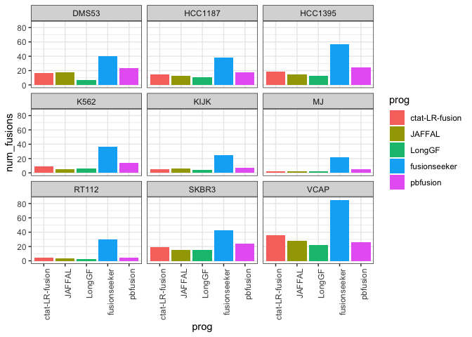<!-- -->

``` r
# get num truth counts (min 2 agree)

truth_data = read.table("data/preds.collected.gencode_mapped.wAnnot.filt.pass.proxy_assignments.byProgAgree.min_2.truth_set",
                  header=T, sep="\t", stringsAsFactors = F)


truth_data %>% head()
```

    ##         proxy_fusion_name
    ## 1  HCC1395|EIF3K--CYP39A1
    ## 2     VCAP|PDE4D--FAM172A
    ## 3      VCAP|HJURP--EIF4E2
    ## 4   HCC1187|KMT2E--LHFPL3
    ## 5   HCC1395|PLA2R1--RBMS1
    ## 6 HCC1395|OSBPL9--CCDC178
    ##                                                          prog_names num_progs
    ## 1 JAFFAL,LongGF,ctat-LR-fusion.v0.13.0,fusionseeker,pbfusion_v0.3.1         5
    ## 2 JAFFAL,LongGF,ctat-LR-fusion.v0.13.0,fusionseeker,pbfusion_v0.3.1         5
    ## 3 JAFFAL,LongGF,ctat-LR-fusion.v0.13.0,fusionseeker,pbfusion_v0.3.1         5
    ## 4 JAFFAL,LongGF,ctat-LR-fusion.v0.13.0,fusionseeker,pbfusion_v0.3.1         5
    ## 5 JAFFAL,LongGF,ctat-LR-fusion.v0.13.0,fusionseeker,pbfusion_v0.3.1         5
    ## 6 JAFFAL,LongGF,ctat-LR-fusion.v0.13.0,fusionseeker,pbfusion_v0.3.1         5

``` r
truth_data$sample_name = sapply(truth_data$proxy_fusion_name, function(x) { str_split(x, "\\|")[[1]][1]})

head(truth_data)
```

    ##         proxy_fusion_name
    ## 1  HCC1395|EIF3K--CYP39A1
    ## 2     VCAP|PDE4D--FAM172A
    ## 3      VCAP|HJURP--EIF4E2
    ## 4   HCC1187|KMT2E--LHFPL3
    ## 5   HCC1395|PLA2R1--RBMS1
    ## 6 HCC1395|OSBPL9--CCDC178
    ##                                                          prog_names num_progs
    ## 1 JAFFAL,LongGF,ctat-LR-fusion.v0.13.0,fusionseeker,pbfusion_v0.3.1         5
    ## 2 JAFFAL,LongGF,ctat-LR-fusion.v0.13.0,fusionseeker,pbfusion_v0.3.1         5
    ## 3 JAFFAL,LongGF,ctat-LR-fusion.v0.13.0,fusionseeker,pbfusion_v0.3.1         5
    ## 4 JAFFAL,LongGF,ctat-LR-fusion.v0.13.0,fusionseeker,pbfusion_v0.3.1         5
    ## 5 JAFFAL,LongGF,ctat-LR-fusion.v0.13.0,fusionseeker,pbfusion_v0.3.1         5
    ## 6 JAFFAL,LongGF,ctat-LR-fusion.v0.13.0,fusionseeker,pbfusion_v0.3.1         5
    ##   sample_name
    ## 1     HCC1395
    ## 2        VCAP
    ## 3        VCAP
    ## 4     HCC1187
    ## 5     HCC1395
    ## 6     HCC1395

``` r
truth_data_counts = truth_data %>% rename(sample=sample_name) %>% group_by(sample) %>% tally(name='num_truth_fusions')

truth_data_counts %>% arrange(num_truth_fusions)
```

    ## # A tibble: 9 × 2
    ##   sample  num_truth_fusions
    ##   <chr>               <int>
    ## 1 MJ                      3
    ## 2 RT112                   4
    ## 3 KIJK                    6
    ## 4 K562                   12
    ## 5 HCC1187                17
    ## 6 HCC1395                21
    ## 7 DMS53                  24
    ## 8 SKBR3                  25
    ## 9 VCAP                   35

``` r
# as few as 2 in MJ and as many as 34 in VCaP (including Illumina support!)
```

``` r
truth_data_counts %>% summarise(sum_truth_fusions = sum(num_truth_fusions))
```

    ## # A tibble: 1 × 1
    ##   sum_truth_fusions
    ##               <int>
    ## 1               147

``` r
# 134 min2 + 13 Illumina-supported-unique = 147 proxy truth fusions
```

``` r
p_fusion_counts_barplot = p + geom_hline(data=truth_data_counts, aes(yintercept=num_truth_fusions))

p_fusion_counts_barplot
```

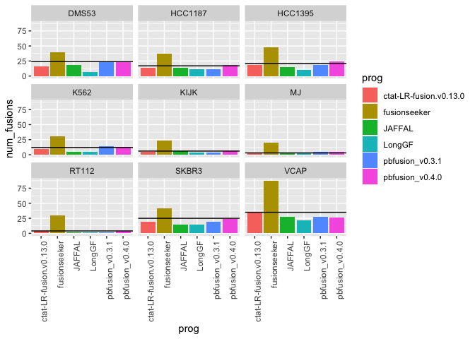<!-- -->

``` r
# pbfusion v0.4.0 isn't part of the main paper (came out later)

p_fusion_counts_barplot = fusion_preds %>% 
     select(sample, prog, fusion) %>% unique() %>%
    filter(prog %in% c('ctat-LR-fusion.v0.13.0', 'JAFFAL', 'LongGF', 'fusionseeker', 'pbfusion_v0.3.1')) %>%
    mutate(prog = factor(prog, levels=c('ctat-LR-fusion.v0.13.0', 'JAFFAL', 'LongGF', 'fusionseeker', 'pbfusion_v0.3.1'))) %>%
    group_by(sample, prog) %>% tally(name='num_fusions') %>%
    ggplot(aes(x=prog, y=num_fusions)) + geom_col(aes(fill=prog)) + facet_wrap(~sample)  + 
    theme(axis.text.x = element_text(angle = 90, hjust = 1)) +
 geom_hline(data=truth_data_counts, aes(yintercept=num_truth_fusions))

p_fusion_counts_barplot
```

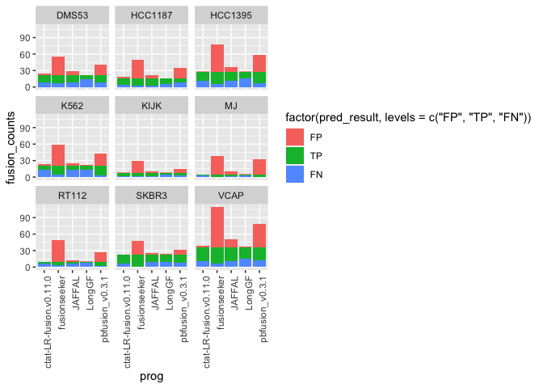<!-- -->

``` r
ggsave(p_fusion_counts_barplot, file="depmap_fusion_counts_per_prog.barplot.svg", width=7, height=5)
```

``` r
# unnest prog names

truth_data = truth_data %>% mutate(prog_names = str_split(prog_names, ","))  %>% unnest(prog_names)

truth_data %>% head()
```

    ## # A tibble: 6 × 4
    ##   proxy_fusion_name      prog_names             num_progs sample_name
    ##   <chr>                  <chr>                      <int> <chr>      
    ## 1 HCC1395|EIF3K--CYP39A1 JAFFAL                         5 HCC1395    
    ## 2 HCC1395|EIF3K--CYP39A1 LongGF                         5 HCC1395    
    ## 3 HCC1395|EIF3K--CYP39A1 ctat-LR-fusion.v0.13.0         5 HCC1395    
    ## 4 HCC1395|EIF3K--CYP39A1 fusionseeker                   5 HCC1395    
    ## 5 HCC1395|EIF3K--CYP39A1 pbfusion_v0.3.1                5 HCC1395    
    ## 6 VCAP|PDE4D--FAM172A    JAFFAL                         5 VCAP

``` r
#Organize according to pred class
    
scored_data = read.table(scored_predictions_file, header=T, sep="\t", stringsAsFactors = F)

scored_data %>% head()
```

    ##   pred_result  proxy_fusion_name proxy_fusion_type sample   prog        fusion
    ## 1          TP RT112|FGFR3--TACC3            tie_lt  RT112 LongGF  TACC3--FGFR3
    ## 2          TP RT112|NOP14--WHSC1            tie_lt  RT112 LongGF  NOP14--WHSC1
    ## 3          TP     KIJK|ALK--NPM1   dominant_choice   KIJK LongGF     ALK--NPM1
    ## 4          TP KIJK|TAF12--YTHDF2            tie_lt   KIJK LongGF TAF12--YTHDF2
    ## 5          TP  KIJK|LUZP2--RBMS3            tie_lt   KIJK LongGF  RBMS3--LUZP2
    ## 6          TP   VCAP|VWA2--PRKCH    recip_selected   VCAP LongGF   PRKCH--VWA2
    ##                        breakpoint num_reads
    ## 1      chr4:1739701--chr4:1806934       341
    ## 2      chr4:2963124--chr4:1945833         3
    ## 3   chr2:29223528--chr5:171391798       458
    ## 4    chr1:28622165--chr1:28743988        48
    ## 5   chr3:29434744--chr11:24891958         4
    ## 6 chr14:61443108--chr10:114248764       116
    ##                                                                                                                                                         mapped_gencode_A_gene_list
    ## 1                                                                                                                                                                 AC016773.1,TACC3
    ## 2                                                                                                                                    AB000466,C4orf10,NOP14,NOP14-AS1,RP11-520M5.5
    ## 3                                                                                                            AC093756.1,AC106870.1,AC106870.2,AC106899.1,ALK,Metazoa_SRP,RN7SL516P
    ## 4                                                                                                                                                    AP006222.1,HYDIN2,RAB42,TAF12
    ## 5 AC012262.1,AC021068.1,AC092796.1,AC097361.1,AC098650.1,AC099048.1,AC109586.1,AX746710,BC128113,LINC00693,MESTP4,MTND4LP9,RBMS3,RBMS3-AS1,RBMS3-AS2,RBMS3-AS3,RP11-9J18.1,RPS12P5
    ## 6                            AL355916.1,AL355916.2,AL355916.3,AL359220.1,BC050301,NF1P11,PRKCH,RP11-47I22.1,RP11-47I22.4,RP11-597A11.10,RP11-902B17.1,SNORD112,SNORD112.24,TMEM30B
    ##                                   mapped_gencode_B_gene_list
    ## 1                                                      FGFR3
    ## 2         AL132868.1,NSD2,SCARNA22,SCARNA23,SCARNA23.1,WHSC1
    ## 3                                            AL732372.2,NPM1
    ## 4                                   AP006222.1,HYDIN2,YTHDF2
    ## 5      AC115990.1,AP007216.1,CTC-830E23.1,LUZP2,RP11-643C9.1
    ## 6 AC005383.1,AURKAP2,AURKAPS2,CTB-1144G6.5,CTB-1144G6.6,VWA2
    ##                                                                                                                                                                                                                                                                                                                                                                                                                                                                                                                                                                                annots
    ## 1 TACC3--FGFR3:[TACC3:Oncogene];[FGFR3:Oncogene,FGFR3:ArcherDX_panel,FGFR3:FoundationOne_panel,FGFR3:OncomapV4_panel,FGFR3:OncocartaV1_panel];[ChimerPub];INTRACHROMOSOMAL[chr4:0.05Mb];NEIGHBORS[48131];;(recip)FGFR3--TACC3:[FGFR3:Oncogene,FGFR3:ArcherDX_panel,FGFR3:FoundationOne_panel,FGFR3:OncomapV4_panel,FGFR3:OncocartaV1_panel];[TACC3:Oncogene];[ChimerKB,DepMap2023,ChimerSeq,TCGA_StarF2019,CCLE_StarF2019,YOSHIHARA_TCGA,Klijn_CellLines,DEEPEST2019,GUO2018CR_TCGA,ChimerPub,TumorFusionsNAR2018,Cosmic];INTRACHROMOSOMAL[chr4:0.05Mb];LOCAL_REARRANGEMENT:+:[48131]
    ## 2                                                                                                                                                                                                                                                                                                                                                                                                                                                     NOP14--WHSC1:[WHSC1:Oncogene];INTRACHROMOSOMAL[chr4:0.96Mb];;(recip)WHSC1--NOP14:[WHSC1:Oncogene];INTRACHROMOSOMAL[chr4:0.96Mb]
    ## 3                                       ALK--NPM1:[ALK:Oncogene,ALK:FoundationOne_panel,ALK:ArcherDX_panel];[NPM1:Oncogene,NPM1:OncomapV4_panel,NPM1:ArcherDX_panel,NPM1:FoundationOne_panel];[ChimerKB,chimerdb_pubmed,chimerdb_omim];INTERCHROMOSOMAL[chr2--chr5];;(recip)NPM1--ALK:[NPM1:Oncogene,NPM1:OncomapV4_panel,NPM1:ArcherDX_panel,NPM1:FoundationOne_panel];[ALK:Oncogene,ALK:FoundationOne_panel,ALK:ArcherDX_panel];[Mitelman,ChimerKB,DepMap2023,ChimerSeq,CCLE_StarF2019,Klijn_CellLines,chimerdb_omim,chimerdb_pubmed,ChimerPub,Cosmic];INTERCHROMOSOMAL[chr5--chr2]
    ## 4                                                                                                                                                                                                                                                                                                                                                                                                 TAF12--YTHDF2:INTRACHROMOSOMAL[chr1:0.09Mb];LOCAL_INVERSION:-:+:[93536];;(recip)YTHDF2--TAF12:[DepMap2023,CCLE_StarF2019];INTRACHROMOSOMAL[chr1:0.09Mb];LOCAL_INVERSION:+:-:[93536]
    ## 5                                                                                                                                                                                                                                                                                                                                                                                                                                                                                       RBMS3--LUZP2:INTERCHROMOSOMAL[chr3--chr11];;(recip)LUZP2--RBMS3:INTERCHROMOSOMAL[chr11--chr3]
    ## 6                                                                                                                                                                                                                                                                                                                                                                                                                                                           PRKCH--VWA2:INTERCHROMOSOMAL[chr14--chr10];;(recip)VWA2--PRKCH:[DepMap2023,CCLE_StarF2019];INTERCHROMOSOMAL[chr10--chr14]
    ##                                       explanation    selected_fusion
    ## 1 first encounter of TP LongGF,RT112|FGFR3--TACC3 RT112|FGFR3--TACC3
    ## 2 first encounter of TP LongGF,RT112|NOP14--WHSC1 RT112|NOP14--WHSC1
    ## 3     first encounter of TP LongGF,KIJK|ALK--NPM1     KIJK|ALK--NPM1
    ## 4 first encounter of TP LongGF,KIJK|TAF12--YTHDF2 KIJK|TAF12--YTHDF2
    ## 5  first encounter of TP LongGF,KIJK|LUZP2--RBMS3  KIJK|LUZP2--RBMS3
    ## 6   first encounter of TP LongGF,VCAP|VWA2--PRKCH   VCAP|VWA2--PRKCH

``` r
scored_data %>% filter(pred_result %in% c("TP", "FP", "FN")) %>% 
    group_by(sample, prog, pred_result) %>% 
    tally(name='fusion_counts') %>%
    ggplot(aes(x=prog, y=fusion_counts, fill=factor(pred_result, levels=c('FP', 'TP', 'FN')))) + geom_col() + facet_wrap(~sample)  +
        theme(axis.text.x = element_text(angle = 90, hjust = 1)) 
```

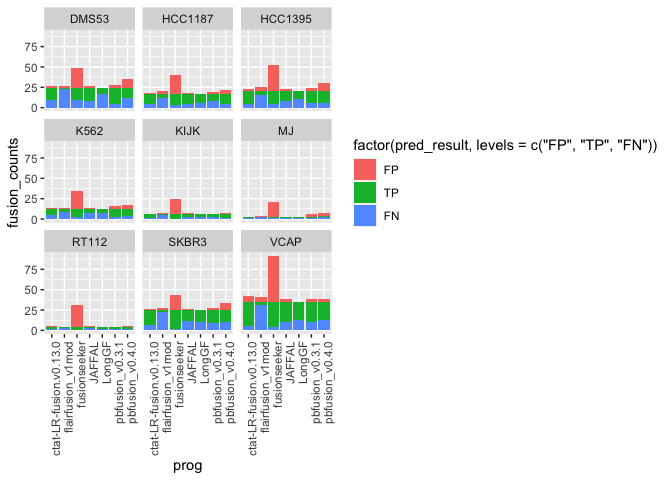<!-- -->

# accuracy analysis

Require min 2 calls to agree as truth set.

``` r
data = read.table(ROC_file, header=T, sep="\t", stringsAsFactors = F) %>%
    filter(! grepl("flair", prog))

data %>% head()
```

    ##           prog min_sum_frags  TP  FP FN  TPR  PPV    F1
    ## 1 fusionseeker             3 118 240 29 0.80 0.33 0.467
    ## 2 fusionseeker             4  94 138 53 0.64 0.41 0.500
    ## 3 fusionseeker             5  82  72 65 0.56 0.53 0.545
    ## 4 fusionseeker             6  76  59 71 0.52 0.56 0.539
    ## 5 fusionseeker             7  70  42 77 0.48 0.62 0.541
    ## 6 fusionseeker             8  69  34 78 0.47 0.67 0.552

``` r
# F1 vs. min reads

data %>% ggplot(aes(x=min_sum_frags, y=F1)) + geom_point(aes(color=prog)) + geom_line(aes(group=prog, color=prog)) +
    xlim(2,10) + 
    #ylim(0.3,0.9) +
    ggtitle("Depmap v1 fusions: F1 ~ min read support") 
```

    ## Warning: Removed 245 rows containing missing values (`geom_point()`).

    ## Warning: Removed 245 rows containing missing values (`geom_line()`).

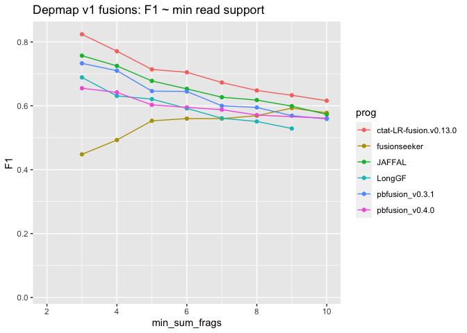<!-- -->

``` r
# F1 vs. min reads

# exclude pbfusion v0.4.0 for the paper fig


progs = c('ctat-LR-fusion.v0.13.0', 'JAFFAL', 'LongGF', 'fusionseeker', 'pbfusion_v0.3.1'); 


depmap_accuracy_lineplot = data %>% 
    filter(prog %in% progs ) %>%
    mutate(prog = factor(prog, levels=progs)) %>%
    ggplot(aes(x=min_sum_frags, y=F1)) + geom_point(aes(color=prog)) + geom_line(aes(group=prog, color=prog)) +
    xlim(3,10) + ylim(0.45,0.8) +
    ggtitle("Depmap v1 fusions: F1 ~ min read support") 

depmap_accuracy_lineplot
```

    ## Warning: Removed 206 rows containing missing values (`geom_point()`).

    ## Warning: Removed 206 rows containing missing values (`geom_line()`).

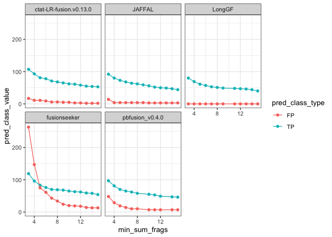<!-- -->

``` r
ggsave(depmap_accuracy_lineplot, file=paste0("depmap_accuracy_lineplot.use_paralog_proxies=", USE_PARALOG_PROXIES, ".svg"), width=7, height=4)
```

    ## Warning: Removed 206 rows containing missing values (`geom_point()`).

    ## Warning: Removed 206 rows containing missing values (`geom_line()`).

``` r
# plot TP and FP ~ min sum frags.

data %>% select(prog, min_sum_frags, TP, FP) %>% 
    gather(key=pred_class_type, value=pred_class_value, TP, FP) %>%
    ggplot(aes(x=min_sum_frags, y=pred_class_value)) + geom_point(aes(group=pred_class_type, color=pred_class_type)) +
    facet_wrap(~prog) +
    xlim(3,15)
```

    ## Warning: Removed 434 rows containing missing values (`geom_point()`).

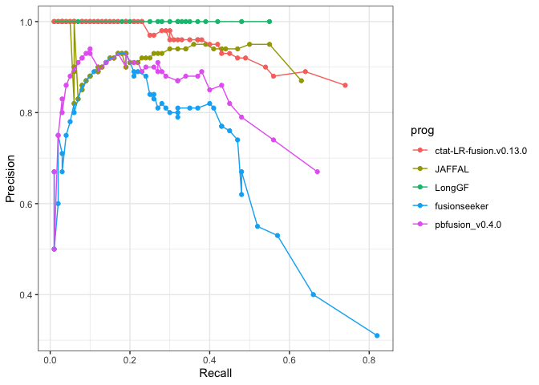<!-- -->

``` r
data %>% 
    filter(prog %in% c('ctat-LR-fusion.v0.13.0', "JAFFAL")) %>%
    select(prog, min_sum_frags, TP, FP) %>% 
    gather(key=pred_class_type, value=pred_class_value, TP, FP) %>%
    ggplot(aes(x=min_sum_frags, y=pred_class_value)) +
    geom_point(aes(shape=pred_class_type, color=prog)) +
    geom_line(aes(groups=pred_class_type, shape=pred_class_type, color=prog)) +
    xlim(3,15)
```

    ## Warning in geom_line(aes(groups = pred_class_type, shape = pred_class_type, :
    ## Ignoring unknown aesthetics: groups and shape

    ## Warning: Removed 142 rows containing missing values (`geom_point()`).

    ## Warning: Removed 142 rows containing missing values (`geom_line()`).

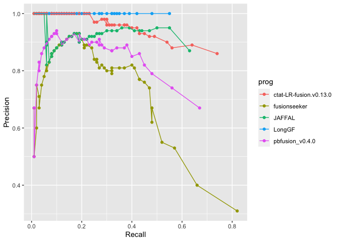<!-- -->

``` r
# precision / recall 

data %>% ggplot(aes(x=TPR, y=PPV)) + 
    geom_point(aes(groups=prog, color=prog)) +
    geom_line(aes(color=prog)) 
```

    ## Warning in geom_point(aes(groups = prog, color = prog)): Ignoring unknown
    ## aesthetics: groups

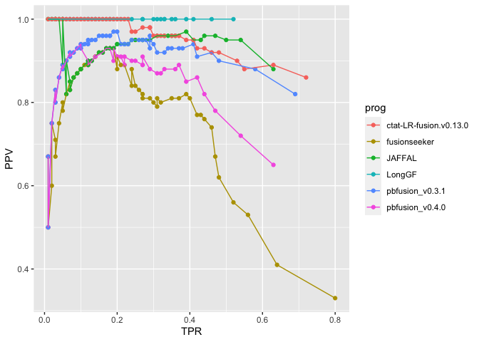<!-- -->

``` r
# exclude pbfusion v0.4.0


depmap_TP_vs_FP_scatterplot = data %>% select(prog, min_sum_frags, TP, FP) %>% 
    filter(prog != "pbfusion_v0.4.0") %>%
    gather(key=pred_class_type, value=pred_class_value, TP, FP) %>%
    ggplot(aes(x=min_sum_frags, y=pred_class_value)) + geom_point(aes(group=pred_class_type, color=pred_class_type)) +
    facet_wrap(~prog) +
    xlim(3,15)

depmap_TP_vs_FP_scatterplot
```

    ## Warning: Removed 364 rows containing missing values (`geom_point()`).

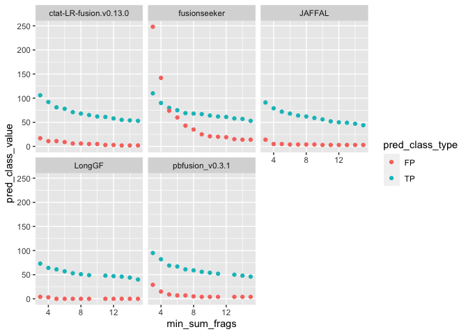<!-- -->

``` r
ggsave(depmap_TP_vs_FP_scatterplot, file=paste0("depmap_TP_vs_FP_scatterplot.use_paralog_proxies=", USE_PARALOG_PROXIES, ".svg"), width=7, height=5)
```

    ## Warning: Removed 364 rows containing missing values (`geom_point()`).

``` r
# precision / recall 

depmap_precision_recall_plot = data %>%
      filter(prog != "pbfusion_v0.4.0") %>%
    ggplot(aes(x=TPR, y=PPV)) + 
    geom_point(aes(groups=prog, color=prog)) +
    geom_line(aes(color=prog)) +
    xlab("Recall") + ylab("Precision")
```

    ## Warning in geom_point(aes(groups = prog, color = prog)): Ignoring unknown
    ## aesthetics: groups

``` r
depmap_precision_recall_plot
```

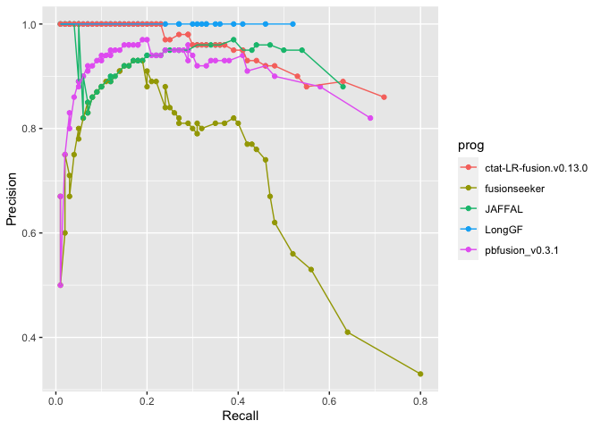<!-- -->

``` r
ggsave(depmap_precision_recall_plot, file=paste0("depmap_precision_recall_plot.use_paralog_proxies=", USE_PARALOG_PROXIES, ".svg"), width=5, height=3)
```

# Examine COSMIC fusions among these cell lines, predicted with any number of reads as evidence.

``` r
unfiltered_preds = read.table("data/preds.collected.gencode_mapped.wAnnot.gz", header=T, sep="\t") %>%
    filter(! grepl("flair", prog))
```

``` r
unfiltered_preds = unfiltered_preds %>% rowwise() %>% mutate(proxy_fusion_name = paste(sort(str_split(fusion, "--")[[1]]), collapse="--"))

unfiltered_preds %>% head()
```

    ## # A tibble: 6 × 9
    ## # Rowwise: 
    ##   sample prog   fusion          breakpoint      num_reads mapped_gencode_A_gen…¹
    ##   <chr>  <chr>  <chr>           <chr>               <int> <chr>                 
    ## 1 RT112  LongGF TACC3--FGFR3    chr4:1739701--…       341 AC016773.1,TACC3      
    ## 2 RT112  LongGF CBX3--C15orf57  chr7:26201744-…         7 CBX3,HNRNPA2B1        
    ## 3 RT112  LongGF MT-ND2--MT-CO1  chrM:5301--chr…         3 MT-ND2                
    ## 4 RT112  LongGF NOP14--WHSC1    chr4:2963124--…         3 AB000466,C4orf10,NOP1…
    ## 5 RT112  LongGF MT-ND5--MT-ATP8 chrM:13152--ch…         3 MT-ND5,MTND5          
    ## 6 RT112  LongGF MT-ND6--MT-ND5  chrM:14623--ch…         3 MT-ND6,MTND5          
    ## # ℹ abbreviated name: ¹​mapped_gencode_A_gene_list
    ## # ℹ 3 more variables: mapped_gencode_B_gene_list <chr>, annots <chr>,
    ## #   proxy_fusion_name <chr>

``` r
unfiltered_preds = unfiltered_preds %>% mutate(proxy_fusion_name = paste(sample, proxy_fusion_name, sep ="|"))

unfiltered_preds %>% head()
```

    ## # A tibble: 6 × 9
    ## # Rowwise: 
    ##   sample prog   fusion          breakpoint      num_reads mapped_gencode_A_gen…¹
    ##   <chr>  <chr>  <chr>           <chr>               <int> <chr>                 
    ## 1 RT112  LongGF TACC3--FGFR3    chr4:1739701--…       341 AC016773.1,TACC3      
    ## 2 RT112  LongGF CBX3--C15orf57  chr7:26201744-…         7 CBX3,HNRNPA2B1        
    ## 3 RT112  LongGF MT-ND2--MT-CO1  chrM:5301--chr…         3 MT-ND2                
    ## 4 RT112  LongGF NOP14--WHSC1    chr4:2963124--…         3 AB000466,C4orf10,NOP1…
    ## 5 RT112  LongGF MT-ND5--MT-ATP8 chrM:13152--ch…         3 MT-ND5,MTND5          
    ## 6 RT112  LongGF MT-ND6--MT-ND5  chrM:14623--ch…         3 MT-ND6,MTND5          
    ## # ℹ abbreviated name: ¹​mapped_gencode_A_gene_list
    ## # ℹ 3 more variables: mapped_gencode_B_gene_list <chr>, annots <chr>,
    ## #   proxy_fusion_name <chr>

``` r
cosmic_fusions = unfiltered_preds %>% filter(grepl("Cosmic", annots)) %>% select(sample, proxy_fusion_name) %>% unique()

cosmic_fusions 
```

    ## # A tibble: 11 × 2
    ## # Rowwise: 
    ##    sample  proxy_fusion_name     
    ##    <chr>   <chr>                 
    ##  1 RT112   RT112|FGFR3--TACC3    
    ##  2 KIJK    KIJK|ALK--NPM1        
    ##  3 VCAP    VCAP|ERG--TMPRSS2     
    ##  4 HCC1395 HCC1395|CYP39A1--EIF3K
    ##  5 HCC1395 HCC1395|PLA2R1--RBMS1 
    ##  6 K562    K562|ABL1--BCR        
    ##  7 HCC1187 HCC1187|AGPAT5--MCPH1 
    ##  8 HCC1187 HCC1187|PLXND1--TMCC1 
    ##  9 RT112   RT112|FBXL18--RNF216  
    ## 10 HCC1187 HCC1187|GPBP1L1--MAST2
    ## 11 HCC1395 HCC1395|AGPAT5--MCPH1

``` r
cosmic_fusion_preds= left_join(cosmic_fusions, 
                                unfiltered_preds %>% select(proxy_fusion_name, prog, num_reads),
                                by='proxy_fusion_name') %>%
    # select only top-supported breakpoint entry, just in case.
    group_by(sample, proxy_fusion_name, prog) %>% 
        arrange(desc(num_reads)) %>% filter(row_number() == 1) %>% ungroup()

cosmic_fusion_preds
```

    ## # A tibble: 48 × 4
    ##    sample proxy_fusion_name  prog                   num_reads
    ##    <chr>  <chr>              <chr>                      <int>
    ##  1 KIJK   KIJK|ALK--NPM1     pbfusion_v0.3.1              463
    ##  2 KIJK   KIJK|ALK--NPM1     ctat-LR-fusion.v0.13.0       462
    ##  3 KIJK   KIJK|ALK--NPM1     fusionseeker                 459
    ##  4 KIJK   KIJK|ALK--NPM1     LongGF                       458
    ##  5 KIJK   KIJK|ALK--NPM1     pbfusion_v0.4.0              453
    ##  6 KIJK   KIJK|ALK--NPM1     JAFFAL                       358
    ##  7 RT112  RT112|FGFR3--TACC3 pbfusion_v0.4.0              345
    ##  8 RT112  RT112|FGFR3--TACC3 fusionseeker                 344
    ##  9 RT112  RT112|FGFR3--TACC3 ctat-LR-fusion.v0.13.0       343
    ## 10 RT112  RT112|FGFR3--TACC3 LongGF                       341
    ## # ℹ 38 more rows

``` r
# limit to those found by at least 2 of the methods
cosmic_fusion_preds_mult_methods = cosmic_fusion_preds %>% select(proxy_fusion_name, prog) %>% unique() %>% 
    group_by(proxy_fusion_name) %>% tally() %>% filter(n>1) %>% pull(proxy_fusion_name)


cosmic_fusion_preds_mult_methods
```

    ## [1] "HCC1187|AGPAT5--MCPH1"  "HCC1187|PLXND1--TMCC1"  "HCC1395|CYP39A1--EIF3K"
    ## [4] "HCC1395|PLA2R1--RBMS1"  "K562|ABL1--BCR"         "KIJK|ALK--NPM1"        
    ## [7] "RT112|FGFR3--TACC3"     "VCAP|ERG--TMPRSS2"

``` r
 depmap_cosmic_fusions_heatmap =   cosmic_fusion_preds %>%
    filter(proxy_fusion_name %in% cosmic_fusion_preds_mult_methods) %>%
    
    ggplot(aes(x=proxy_fusion_name, y=prog)) + geom_tile(aes(fill=num_reads)) + 
    theme(axis.text.x = element_text(angle = 90, hjust = 1)) +
    scale_fill_continuous(high = "#132B43", low = "#56B1F7", na.value="white") +
    geom_text(aes(label=num_reads), color='white')

 depmap_cosmic_fusions_heatmap
```

<!-- -->

``` r
 depmap_cosmic_fusions_heatmap =   cosmic_fusion_preds %>%
     filter(prog %in% progs) %>%
    filter(proxy_fusion_name %in% cosmic_fusion_preds_mult_methods) %>%
    
    ggplot(aes(x=proxy_fusion_name, y=prog)) + geom_tile(aes(fill=num_reads)) + 
    theme(axis.text.x = element_text(angle = 90, hjust = 1)) +
    scale_fill_continuous(high = "#132B43", low = "#56B1F7", na.value="white") +
    geom_text(aes(label=num_reads), color='white')

 depmap_cosmic_fusions_heatmap
```

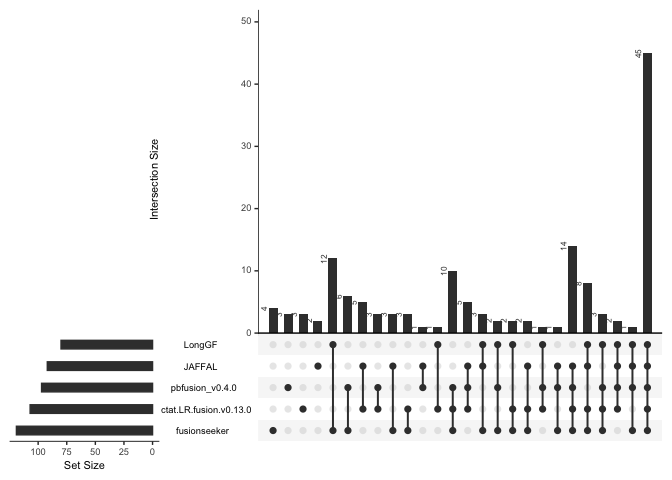<!-- -->

``` r
ggsave(depmap_cosmic_fusions_heatmap, file=paste0("depmap_cosmic_fusions_heatmap.use_paralog_proxies=", USE_PARALOG_PROXIES, ".svg"), width=7, height=5)
```

# Examine truth set fusion sensitivity by method

``` r
library(UpSetRbyFeature)

truth_fusions_found = read.table(scored_predictions_file, sep="\t", header=T) %>% 
    filter(pred_result == "TP") %>% 
    select(prog, selected_fusion) %>% unique()

truth_fusions_found %>% select(selected_fusion) %>% unique() %>% nrow()
```

    ## [1] 147

``` r
truth_fusions_found %>% group_by(prog) %>% tally() %>% arrange(desc(n))
```

    ## # A tibble: 7 × 2
    ##   prog                       n
    ##   <chr>                  <int>
    ## 1 fusionseeker             118
    ## 2 ctat-LR-fusion.v0.13.0   106
    ## 3 pbfusion_v0.3.1          102
    ## 4 pbfusion_v0.4.0           93
    ## 5 JAFFAL                    92
    ## 6 LongGF                    77
    ## 7 flairfusion_v1mod         24

``` r
truth_fusions_found_matrix = truth_fusions_found %>% 
    filter(prog %in% progs) %>% 
    mutate(found = 1) %>% spread(key=prog, value=found, fill=0)


truth_fusion_names = truth_fusions_found_matrix%>% pull(selected_fusion)

truth_fusions_found_matrix =  truth_fusions_found_matrix %>% select(-selected_fusion)

truth_fusions_found_matrix = data.frame(truth_fusions_found_matrix)
rownames(truth_fusions_found_matrix) = truth_fusion_names


upset_plot = UpSetRbyFeature::upset(truth_fusions_found_matrix, number.angles=90, nsets=1000, nintersects=1000)

upset_plot
```

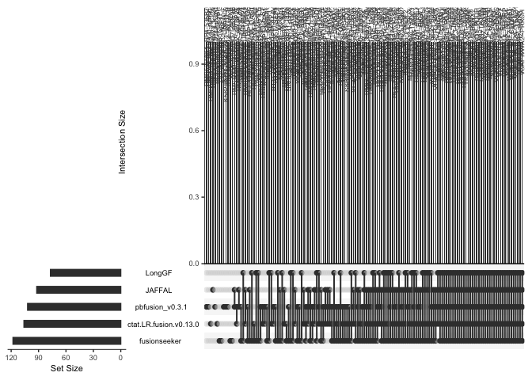<!-- -->

``` r
pdf(file=paste0("depmap.upset_plot.use_paralog_proxies=", USE_PARALOG_PROXIES, ".pdf"), width=20)
UpSetRbyFeature::upset(truth_fusions_found_matrix, number.angles=90, nsets=1000, nintersects=1000)
dev.off()
```

    ## quartz_off_screen 
    ##                 2

``` r
library(UpSetR)
```

    ## Registered S3 methods overwritten by 'UpSetR':
    ##   method        from           
    ##   print.upset   UpSetRbyFeature
    ##   summary.upset UpSetRbyFeature

    ## 
    ## Attaching package: 'UpSetR'

    ## The following objects are masked from 'package:UpSetRbyFeature':
    ## 
    ##     elements, fromExpression, fromList, histogram, intersects,
    ##     scatter_plot, upset

``` r
upset_plot_basic = UpSetR::upset(truth_fusions_found_matrix, number.angles=90, nsets=1000, nintersects=1000)

upset_plot_basic
```

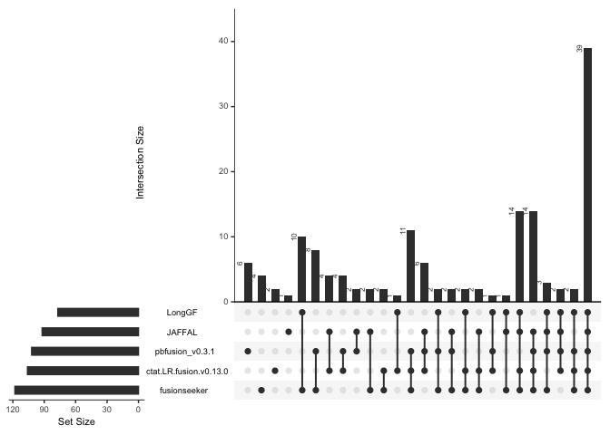<!-- -->

``` r
pdf(file=paste0("depmap.upset_plot-basic.use_paralog_proxies=", USE_PARALOG_PROXIES, ".pdf"), width=20)
UpSetR::upset(truth_fusions_found_matrix, number.angles=90, nsets=1000, nintersects=1000)
dev.off()
```

    ## quartz_off_screen 
    ##                 2
