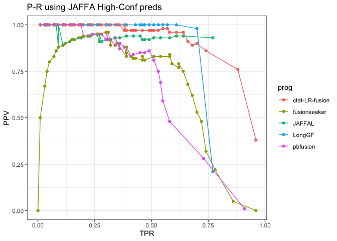
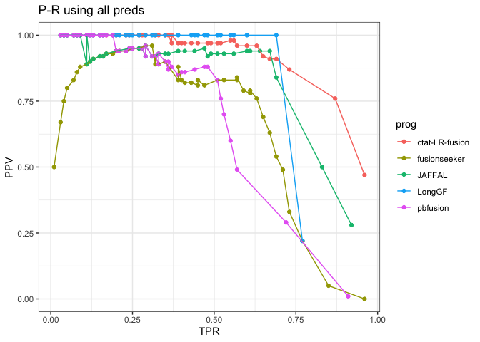
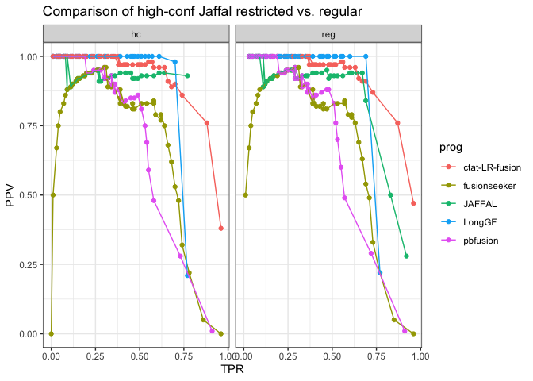
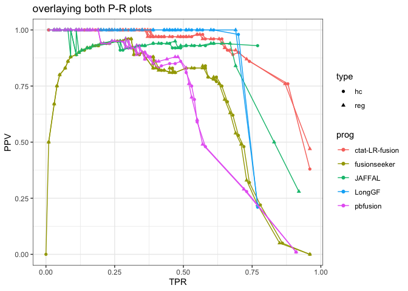
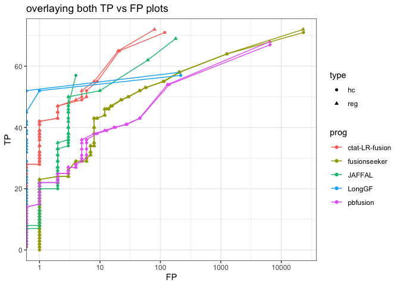
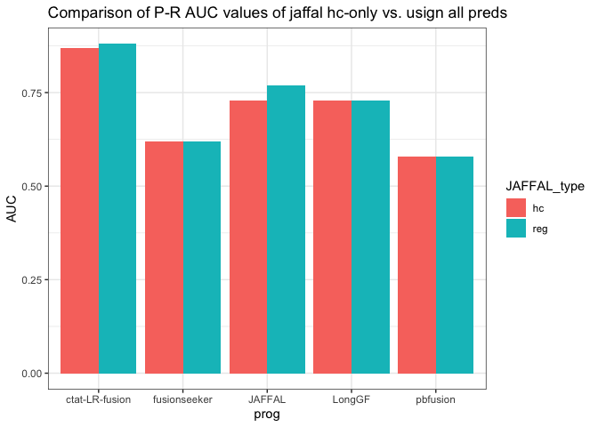

Compare_JAFFAL_HighConf_ROC
================
bhaas
2024-07-26

Using the Illumina-supported (both arriba and starF intersection of
support) as TP calls, and uniquely predicted fusions as FP, performing
accuracy analysis, with a focus on exploring how using JAFFAL
high-conf-only predictions vs. using all JAFFAL predictions impacts the
study.

``` r
USE_PARALOG_PROXIES = TRUE


if (USE_PARALOG_PROXIES) {
    # or allow for paralogs as proxies:
    scored_predictions_file = paste0("data/eval_illum_supported.okPara_ignoreUnsure.results.scored")
} else {
    scored_predictions_file = paste0("data/eval_illum_supported.ignoreUnsure.results.scored")
}


hc_ROC_file = paste0(scored_predictions_file, ".ROC")

hc_ROC_data = read.csv(hc_ROC_file, header=T, sep="\t", stringsAsFactors = F)
```

``` r
# JAFFA high conf only benchmarking

hc_ROC_data %>% ggplot(aes(x=TPR, y=PPV, color=prog)) + geom_point() + geom_line() + theme_bw() + ggtitle("P-R using JAFFA High-Conf preds")
```

<!-- -->

``` r
# bmarking not restricting to high-conf Jaffal preds

reg_ROC_file = paste0("../3b.2.Illumina_TP_unique_FP_bmarking/__illum_TP_uniq_FP.arriba,starF/", scored_predictions_file, ".ROC") 


reg_ROC_data = read.csv(reg_ROC_file, header=T, sep="\t", stringsAsFactors = F)
```

``` r
reg_ROC_data %>% ggplot(aes(x=TPR, y=PPV, color=prog)) + geom_point() + geom_line() + theme_bw() + ggtitle("P-R using all preds")
```

<!-- -->

``` r
hc_ROC_data = hc_ROC_data %>% mutate(type='hc')

reg_ROC_data = reg_ROC_data %>% mutate(type='reg')

combined_data = bind_rows(hc_ROC_data, reg_ROC_data)
```

``` r
combined_data %>% arrange(TPR, PPV) %>% ggplot(aes(x=TPR, y=PPV, color=prog)) + geom_point() + geom_line() + theme_bw() +
    facet_wrap(~type) + ggtitle("Comparison of high-conf Jaffal restricted vs. regular")
```

<!-- -->

``` r
combined_data %>% ggplot(aes(x=TPR, y=PPV, color=prog, shape=type)) + geom_point() + geom_line() + theme_bw()  + ggtitle("overlaying both P-R plots")
```

<!-- -->

``` r
combined_data %>% arrange(TP, FP) %>% ggplot(aes(y=TP, x=FP, color=prog, shape=type)) + geom_point() + geom_line() + theme_bw() +
    scale_x_continuous(trans='log10') + ggtitle("overlaying both TP vs FP plots")
```

    ## Warning: Transformation introduced infinite values in continuous x-axis
    ## Transformation introduced infinite values in continuous x-axis

<!-- -->

``` r
hc_PR_AUC = read.csv("data/eval_illum_supported.ignoreUnsure.results.scored.PR.AUC", sep="\t", stringsAsFactors = F, header=F)

colnames(hc_PR_AUC) = c('prog', 'AUC')

hc_PR_AUC
```

    ##             prog  AUC
    ## 1 ctat-LR-fusion 0.87
    ## 2         JAFFAL 0.73
    ## 3         LongGF 0.73
    ## 4   fusionseeker 0.62
    ## 5       pbfusion 0.58

``` r
reg_PR_AUC = read.csv("../3b.2.Illumina_TP_unique_FP_bmarking/__illum_TP_uniq_FP.arriba,starF/data/eval_illum_supported.ignoreUnsure.results.scored.PR.AUC", 
                   sep="\t", stringsAsFactors = F, header=F )


colnames(reg_PR_AUC) = c('prog', 'AUC')

reg_PR_AUC
```

    ##             prog  AUC
    ## 1 ctat-LR-fusion 0.88
    ## 2         JAFFAL 0.77
    ## 3         LongGF 0.73
    ## 4   fusionseeker 0.62
    ## 5       pbfusion 0.58

``` r
PR_AUC = bind_rows(hc_PR_AUC %>% mutate(JAFFAL_type='hc'),
                   reg_PR_AUC %>% mutate(JAFFAL_type='reg'))
```

``` r
PR_AUC %>% ggplot(aes(x=prog, y=AUC, fill=JAFFAL_type)) + geom_bar(stat='identity', position='dodge') + theme_bw()  +
    ggtitle("Comparison of P-R AUC values of jaffal hc-only vs. usign all preds")
```

<!-- -->
