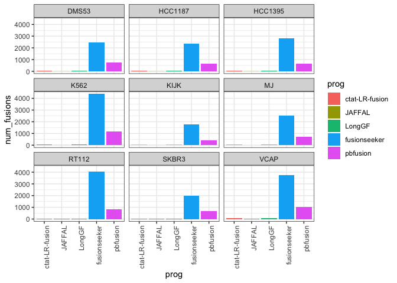
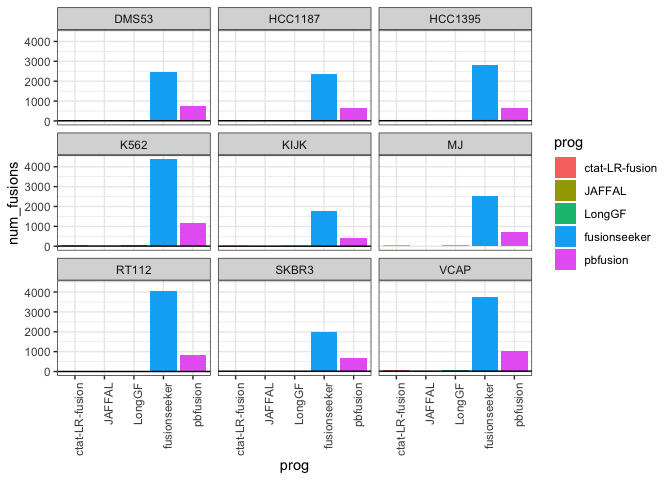
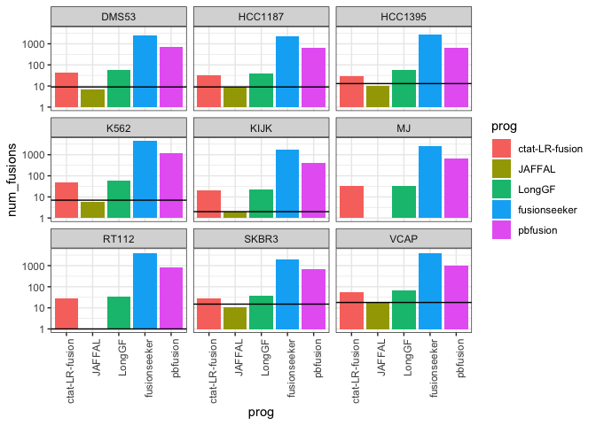
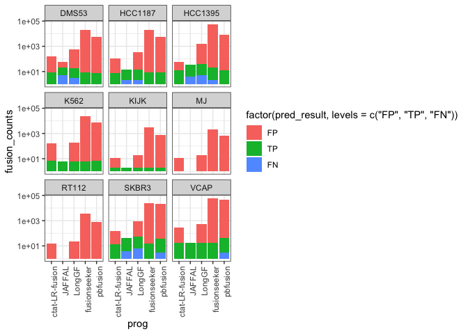
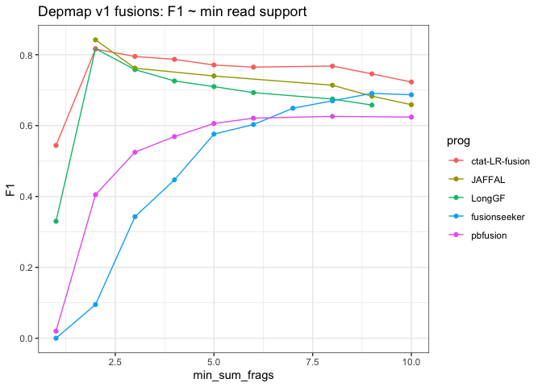
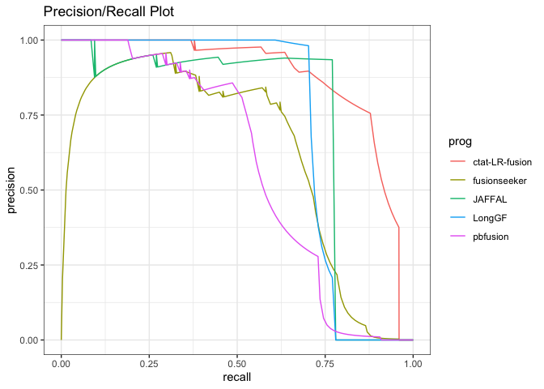
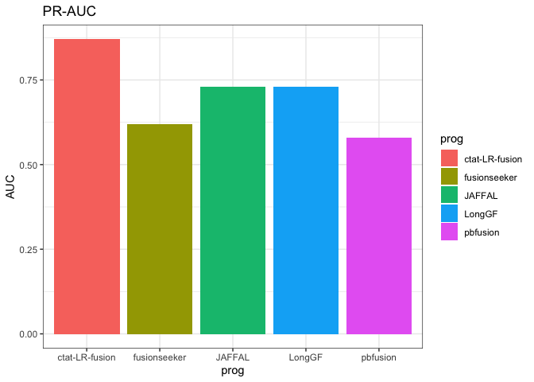
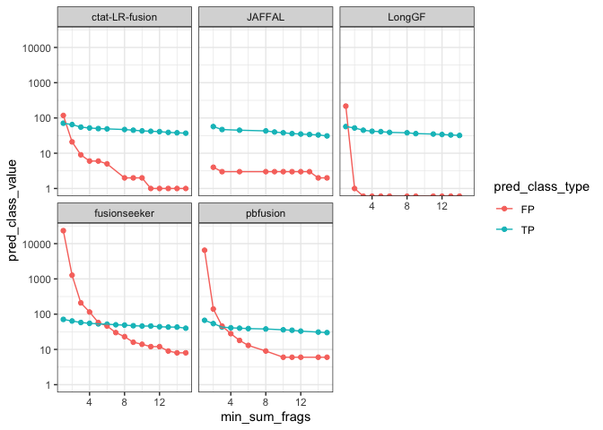
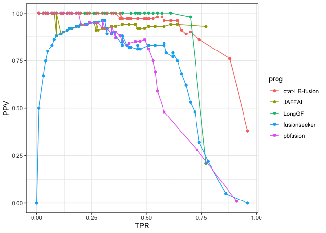

DepMap Fusion Benchmarking
================
bhaas
2024-02-01

Using the Illumina-supported (both arriba and starF intersection of
support) as TP calls, and uniquely predicted fusions as FP, performing
accuracy analysis, with a focus on exploring how using JAFFAL
high-conf-only predictions impacts results.

``` r
PROGS = c('ctat-LR-fusion', 'JAFFAL', 'LongGF', 'fusionseeker', 'pbfusion'); 


USE_PARALOG_PROXIES = FALSE


if (USE_PARALOG_PROXIES) {
    # or allow for paralogs as proxies:
    scored_predictions_file = paste0("data/eval_illum_supported.okPara_ignoreUnsure.results.scored")
} else {
    scored_predictions_file = paste0("data/eval_illum_supported.ignoreUnsure.results.scored")
}


ROC_file = paste0(scored_predictions_file, ".ROC")
```

``` r
fusion_preds = read.table("data/preds.collected.gencode_mapped.wAnnot.filt.pass.proxy_assignments.gz", header=T, sep="\t", stringsAsFactors = F) %>%
    filter(prog %in% PROGS)

fusion_preds$prog = factor(fusion_preds$prog, levels=PROGS)

fusion_preds %>% head()
```

    ##              proxy_fusion_name proxy_fusion_type  sample           prog
    ## 1 HCC1395|PDIA5--CH507-513H4.1   dominant_choice HCC1395 ctat-LR-fusion
    ## 2       HCC1395|EIF3K--CYP39A1   dominant_choice HCC1395 ctat-LR-fusion
    ## 3        HCC1395|PRRC2B--FUBP3   dominant_choice HCC1395 ctat-LR-fusion
    ## 4        HCC1395|PLA2R1--RBMS1   dominant_choice HCC1395 ctat-LR-fusion
    ## 5         HCC1395|RAB7A--LRCH3   dominant_choice HCC1395 ctat-LR-fusion
    ## 6        HCC1395|HELZ--HMGB1P7   dominant_choice HCC1395 ctat-LR-fusion
    ##                 fusion                     breakpoint num_reads
    ## 1 PDIA5--CH507-513H4.1  chr3:123124343--chr21:8222961       140
    ## 2       EIF3K--CYP39A1  chr19:38632678--chr6:46639668        54
    ## 3        PRRC2B--FUBP3 chr9:131394263--chr9:130609954        46
    ## 4        PLA2R1--RBMS1 chr2:159976068--chr2:160303487        40
    ## 5         RAB7A--LRCH3 chr3:128726359--chr3:197865423        26
    ## 6        HELZ--HMGB1P7 chr17:67239356--chr17:67067610        18
    ##                                                                                        mapped_gencode_A_gene_list
    ## 1                                                                                            MIR7110,PDIA5,SEC22A
    ## 2                                                                                                        EIF3K,M9
    ## 3 AL358781.1,AL358781.2,BAT2L,DKFZp781F05101,LQFBS-1,PRRC2B,RP11-334J6.4,RP11-334J6.7,SNORD62A,SNORD62B,hCG_30195
    ## 4                                                                                     AC093642.5,LINC01881,PLA2R1
    ## 5                         AC023598.1,AC117508.1,FTH1P4,MARK2P8,Metazoa_SRP,RAB7A,RN7SL698P,RP11-689D3.4,RPS15AP16
    ## 6                          AC007448.2,AC007448.3,AC007448.4,HELZ,RP11-401F2.1,RP11-401F2.3,RP11-401F2.4,RPL36AP48
    ##                                                                                                                                                                                                                                                                                                                          mapped_gencode_B_gene_list
    ## 1 AK057572,AL592188.2,AL592188.3,AL592188.4,AL592188.8,CH507-513H4.1,CH507-513H4.6,CH507-528H12.1,FP236383.1,FP236383.10,FP236383.2,FP236383.3,FP236383.8,FP671120.1,FP671120.2,FP671120.3,FP671120.4,FP671120.7,LOC100008587,MIR3648-1,MIR3648-2,MIR3687-1,MIR3687-2,MIR6724-1,MIR6724-3,RF01518,RNA18S5,RNA28S5,RNA5-8S5,RNA5-8SN2,RNA5-8SN5,pRNA
    ## 2                                                                                                                                                                                                                                                                                                                               CYP39A1,RP3-347E1.2
    ## 3                                                                                                                                                                                                                                                                                                                        FUBP3,LOC100272217,MIR6856
    ## 4                                                                                                                                                                                                                                                                                   AC093642.5,LINC01881,MIR4785,RBMS1,RMRPP3,RNase_MRP,RNase_MRP.4
    ## 5                                                                                                                                                                                                                                                                                                                       AC055764.1,AC144530.1,LRCH3
    ## 6                                                                                                                                                                                                                                                                                                                                  ARHGAP12,HMGB1P7
    ##                                                                                                                                               annots
    ## 1                                      PDIA5--CH507-513H4.1:INTERCHROMOSOMAL[chr3--chr21];;(recip)CH507-513H4.1--PDIA5:INTERCHROMOSOMAL[chr21--chr3]
    ## 2 EIF3K--CYP39A1:[Klijn_CellLines,Cosmic,ChimerKB,CCLE_StarF2019];INTERCHROMOSOMAL[chr19--chr6];;(recip)CYP39A1--EIF3K:INTERCHROMOSOMAL[chr6--chr19]
    ## 3                                   PRRC2B--FUBP3:[CCLE_StarF2019];INTRACHROMOSOMAL[chr9:0.76Mb];;(recip)FUBP3--PRRC2B:INTRACHROMOSOMAL[chr9:0.76Mb]
    ## 4   PLA2R1--RBMS1:[CCLE_StarF2019,Klijn_CellLines,ChimerKB,Cosmic];INTRACHROMOSOMAL[chr2:0.21Mb];;(recip)RBMS1--PLA2R1:INTRACHROMOSOMAL[chr2:0.21Mb]
    ## 5                                   RAB7A--LRCH3:[CCLE_StarF2019];INTRACHROMOSOMAL[chr3:68.98Mb];;(recip)LRCH3--RAB7A:INTRACHROMOSOMAL[chr3:68.98Mb]
    ## 6                                                  HELZ--HMGB1P7:INTERCHROMOSOMAL[chr17--chr10];;(recip)HMGB1P7--HELZ:INTERCHROMOSOMAL[chr10--chr17]

``` r
# remove the unsure preds
unsure_preds = read.table("data/preds.collected.gencode_mapped.wAnnot.filt.pass.proxy_assignments.byProgAgree.nonunique.unsure_set", header=T, sep="\t", stringsAsFactors = F)

nrow(fusion_preds)
```

    ## [1] 102421

``` r
fusion_preds = fusion_preds %>% filter(! proxy_fusion_name %in% unsure_preds$proxy_fusion_name)
nrow(fusion_preds)
```

    ## [1] 34185

``` r
p = fusion_preds %>% 
    select(sample, prog, fusion) %>% unique() %>%
    group_by(sample, prog) %>% tally(name='num_fusions') %>%
    ggplot(aes(x=prog, y=num_fusions)) +
    theme_bw() +
    geom_col(aes(fill=prog)) + facet_wrap(~sample)  + 
    theme(axis.text.x = element_text(angle = 90, hjust = 1)) 

p 
```

<!-- -->

``` r
truth_data = read.table("data/preds.collected.gencode_mapped.wAnnot.filt.pass.proxy_assignments.byProgAgree.illum_agree.truth_set",
                  header=T, sep="\t", stringsAsFactors = F)


truth_data %>% head()
```

    ##        proxy_fusion_name                                         prog_names
    ## 1    DMS53|GALNT8--PRMT8 JAFFAL,LongGF,ctat-LR-fusion,fusionseeker,pbfusion
    ## 2    VCAP|PDE4D--FAM172A JAFFAL,LongGF,ctat-LR-fusion,fusionseeker,pbfusion
    ## 3 HCC1187|SEC22B--NOTCH2 JAFFAL,LongGF,ctat-LR-fusion,fusionseeker,pbfusion
    ## 4   HCC1395|UNC5C--STPG2 JAFFAL,LongGF,ctat-LR-fusion,fusionseeker,pbfusion
    ## 5         KIJK|NPM1--ALK JAFFAL,LongGF,ctat-LR-fusion,fusionseeker,pbfusion
    ## 6   VCAP|C16orf70--ENKD1 JAFFAL,LongGF,ctat-LR-fusion,fusionseeker,pbfusion
    ##   num_progs
    ## 1         5
    ## 2         5
    ## 3         5
    ## 4         5
    ## 5         5
    ## 6         5

``` r
truth_data$sample_name = sapply(truth_data$proxy_fusion_name, function(x) { str_split(x, "\\|")[[1]][1]})

head(truth_data)
```

    ##        proxy_fusion_name                                         prog_names
    ## 1    DMS53|GALNT8--PRMT8 JAFFAL,LongGF,ctat-LR-fusion,fusionseeker,pbfusion
    ## 2    VCAP|PDE4D--FAM172A JAFFAL,LongGF,ctat-LR-fusion,fusionseeker,pbfusion
    ## 3 HCC1187|SEC22B--NOTCH2 JAFFAL,LongGF,ctat-LR-fusion,fusionseeker,pbfusion
    ## 4   HCC1395|UNC5C--STPG2 JAFFAL,LongGF,ctat-LR-fusion,fusionseeker,pbfusion
    ## 5         KIJK|NPM1--ALK JAFFAL,LongGF,ctat-LR-fusion,fusionseeker,pbfusion
    ## 6   VCAP|C16orf70--ENKD1 JAFFAL,LongGF,ctat-LR-fusion,fusionseeker,pbfusion
    ##   num_progs sample_name
    ## 1         5       DMS53
    ## 2         5        VCAP
    ## 3         5     HCC1187
    ## 4         5     HCC1395
    ## 5         5        KIJK
    ## 6         5        VCAP

``` r
truth_data_counts = truth_data %>% rename(sample=sample_name) %>% group_by(sample) %>% tally(name='num_truth_fusions')

truth_data_counts %>% arrange(num_truth_fusions)
```

    ## # A tibble: 8 × 2
    ##   sample  num_truth_fusions
    ##   <chr>               <int>
    ## 1 RT112                   1
    ## 2 KIJK                    2
    ## 3 K562                    7
    ## 4 DMS53                   9
    ## 5 HCC1187                 9
    ## 6 HCC1395                13
    ## 7 SKBR3                  15
    ## 8 VCAP                   18

``` r
truth_data_counts %>% summarise(sum_truth_fusions = sum(num_truth_fusions))
```

    ## # A tibble: 1 × 1
    ##   sum_truth_fusions
    ##               <int>
    ## 1                74

``` r
# 74 proxy truth fusions
```

``` r
p_fusion_counts_barplot = p + geom_hline(data=truth_data_counts, aes(yintercept=num_truth_fusions))

p_fusion_counts_barplot
```

<!-- -->

``` r
p_fusion_counts_barplot + scale_y_continuous(trans='log10')
```

<!-- -->

``` r
# unnest prog names

truth_data = truth_data %>% mutate(prog_names = str_split(prog_names, ","))  %>% unnest(prog_names)

truth_data %>% head()
```

    ## # A tibble: 6 × 4
    ##   proxy_fusion_name   prog_names     num_progs sample_name
    ##   <chr>               <chr>              <int> <chr>      
    ## 1 DMS53|GALNT8--PRMT8 JAFFAL                 5 DMS53      
    ## 2 DMS53|GALNT8--PRMT8 LongGF                 5 DMS53      
    ## 3 DMS53|GALNT8--PRMT8 ctat-LR-fusion         5 DMS53      
    ## 4 DMS53|GALNT8--PRMT8 fusionseeker           5 DMS53      
    ## 5 DMS53|GALNT8--PRMT8 pbfusion               5 DMS53      
    ## 6 VCAP|PDE4D--FAM172A JAFFAL                 5 VCAP

``` r
#Organize according to pred class
    
scored_data = read.table(paste0(scored_predictions_file, ".gz"), header=T, sep="\t", stringsAsFactors = F) %>% 
    filter(prog %in% PROGS)

scored_data$prog = factor(scored_data$prog, levels=PROGS)

scored_data %>% head()
```

    ##   pred_result            proxy_fusion_name proxy_fusion_type  sample
    ## 1          TP HCC1395|PDIA5--CH507-513H4.1   dominant_choice HCC1395
    ## 2          TP       HCC1395|EIF3K--CYP39A1   dominant_choice HCC1395
    ## 3  NA-UNCLASS        HCC1395|PRRC2B--FUBP3   dominant_choice HCC1395
    ## 4          TP        HCC1395|PLA2R1--RBMS1   dominant_choice HCC1395
    ## 5          TP         HCC1395|RAB7A--LRCH3   dominant_choice HCC1395
    ## 6          TP        HCC1395|HELZ--HMGB1P7   dominant_choice HCC1395
    ##             prog               fusion                     breakpoint num_reads
    ## 1 ctat-LR-fusion PDIA5--CH507-513H4.1  chr3:123124343--chr21:8222961       140
    ## 2 ctat-LR-fusion       EIF3K--CYP39A1  chr19:38632678--chr6:46639668        54
    ## 3 ctat-LR-fusion        PRRC2B--FUBP3 chr9:131394263--chr9:130609954        46
    ## 4 ctat-LR-fusion        PLA2R1--RBMS1 chr2:159976068--chr2:160303487        40
    ## 5 ctat-LR-fusion         RAB7A--LRCH3 chr3:128726359--chr3:197865423        26
    ## 6 ctat-LR-fusion        HELZ--HMGB1P7 chr17:67239356--chr17:67067610        18
    ##                                                                                        mapped_gencode_A_gene_list
    ## 1                                                                                            MIR7110,PDIA5,SEC22A
    ## 2                                                                                                        EIF3K,M9
    ## 3 AL358781.1,AL358781.2,BAT2L,DKFZp781F05101,LQFBS-1,PRRC2B,RP11-334J6.4,RP11-334J6.7,SNORD62A,SNORD62B,hCG_30195
    ## 4                                                                                     AC093642.5,LINC01881,PLA2R1
    ## 5                         AC023598.1,AC117508.1,FTH1P4,MARK2P8,Metazoa_SRP,RAB7A,RN7SL698P,RP11-689D3.4,RPS15AP16
    ## 6                          AC007448.2,AC007448.3,AC007448.4,HELZ,RP11-401F2.1,RP11-401F2.3,RP11-401F2.4,RPL36AP48
    ##                                                                                                                                                                                                                                                                                                                          mapped_gencode_B_gene_list
    ## 1 AK057572,AL592188.2,AL592188.3,AL592188.4,AL592188.8,CH507-513H4.1,CH507-513H4.6,CH507-528H12.1,FP236383.1,FP236383.10,FP236383.2,FP236383.3,FP236383.8,FP671120.1,FP671120.2,FP671120.3,FP671120.4,FP671120.7,LOC100008587,MIR3648-1,MIR3648-2,MIR3687-1,MIR3687-2,MIR6724-1,MIR6724-3,RF01518,RNA18S5,RNA28S5,RNA5-8S5,RNA5-8SN2,RNA5-8SN5,pRNA
    ## 2                                                                                                                                                                                                                                                                                                                               CYP39A1,RP3-347E1.2
    ## 3                                                                                                                                                                                                                                                                                                                        FUBP3,LOC100272217,MIR6856
    ## 4                                                                                                                                                                                                                                                                                   AC093642.5,LINC01881,MIR4785,RBMS1,RMRPP3,RNase_MRP,RNase_MRP.4
    ## 5                                                                                                                                                                                                                                                                                                                       AC055764.1,AC144530.1,LRCH3
    ## 6                                                                                                                                                                                                                                                                                                                                  ARHGAP12,HMGB1P7
    ##                                                                                                                                               annots
    ## 1                                      PDIA5--CH507-513H4.1:INTERCHROMOSOMAL[chr3--chr21];;(recip)CH507-513H4.1--PDIA5:INTERCHROMOSOMAL[chr21--chr3]
    ## 2 EIF3K--CYP39A1:[Klijn_CellLines,Cosmic,ChimerKB,CCLE_StarF2019];INTERCHROMOSOMAL[chr19--chr6];;(recip)CYP39A1--EIF3K:INTERCHROMOSOMAL[chr6--chr19]
    ## 3                                   PRRC2B--FUBP3:[CCLE_StarF2019];INTRACHROMOSOMAL[chr9:0.76Mb];;(recip)FUBP3--PRRC2B:INTRACHROMOSOMAL[chr9:0.76Mb]
    ## 4   PLA2R1--RBMS1:[CCLE_StarF2019,Klijn_CellLines,ChimerKB,Cosmic];INTRACHROMOSOMAL[chr2:0.21Mb];;(recip)RBMS1--PLA2R1:INTRACHROMOSOMAL[chr2:0.21Mb]
    ## 5                                   RAB7A--LRCH3:[CCLE_StarF2019];INTRACHROMOSOMAL[chr3:68.98Mb];;(recip)LRCH3--RAB7A:INTRACHROMOSOMAL[chr3:68.98Mb]
    ## 6                                                  HELZ--HMGB1P7:INTERCHROMOSOMAL[chr17--chr10];;(recip)HMGB1P7--HELZ:INTERCHROMOSOMAL[chr10--chr17]
    ##                                                          explanation
    ## 1 first encounter of TP ctat-LR-fusion,HCC1395|CH507-528H12.1--PDIA5
    ## 2        first encounter of TP ctat-LR-fusion,HCC1395|EIF3K--CYP39A1
    ## 3              not classifying HCC1395|PRRC2B--FUBP3, in unsure list
    ## 4         first encounter of TP ctat-LR-fusion,HCC1395|PLA2R1--RBMS1
    ## 5          first encounter of TP ctat-LR-fusion,HCC1395|RAB7A--LRCH3
    ## 6         first encounter of TP ctat-LR-fusion,HCC1395|HELZ--HMGB1P7
    ##                 selected_fusion
    ## 1 HCC1395|CH507-528H12.1--PDIA5
    ## 2        HCC1395|EIF3K--CYP39A1
    ## 3                             .
    ## 4         HCC1395|PLA2R1--RBMS1
    ## 5          HCC1395|RAB7A--LRCH3
    ## 6         HCC1395|HELZ--HMGB1P7

``` r
scored_data %>% filter(pred_result %in% c("TP", "FP", "FN")) %>% 
    group_by(sample, prog, pred_result) %>% 
    tally(name='fusion_counts') %>%
    ggplot(aes(x=prog, y=fusion_counts, fill=factor(pred_result, levels=c('FP', 'TP', 'FN')))) + 
    theme_bw() +
    geom_col() + facet_wrap(~sample)  +
        theme(axis.text.x = element_text(angle = 90, hjust = 1)) + scale_y_continuous(trans='log10')
```

<!-- -->

# accuracy analysis

``` r
data = read.table(ROC_file, header=T, sep="\t", stringsAsFactors = F) 

data = data %>% filter(prog %in% PROGS)

data$prog = factor(data$prog, levels=PROGS)

data %>% head()
```

    ##     prog min_sum_frags TP  FP FN  TPR  PPV    F1
    ## 1 LongGF             1 57 217 17 0.77 0.21 0.330
    ## 2 LongGF             2 52   1 22 0.70 0.98 0.817
    ## 3 LongGF             3 45   0 29 0.61 1.00 0.758
    ## 4 LongGF             4 42   0 32 0.57 1.00 0.726
    ## 5 LongGF             5 41   0 33 0.55 1.00 0.710
    ## 6 LongGF             6 39   0 35 0.53 1.00 0.693

``` r
# F1 vs. min reads

depmap_accuracy_lineplot = data %>% 
    ggplot(aes(x=min_sum_frags, y=F1)) + 
    theme_bw() +
    geom_point(aes(color=prog)) + geom_line(aes(group=prog, color=prog)) +
    xlim(1,10) + 
    #ylim(0.4,0.9) +
    ggtitle("Depmap v1 fusions: F1 ~ min read support")  # +
    #scale_y_continuous(trans='log10')

depmap_accuracy_lineplot
```

    ## Warning: Removed 171 rows containing missing values (`geom_point()`).

    ## Warning: Removed 171 rows containing missing values (`geom_line()`).

<!-- -->

``` r
#ggsave(depmap_accuracy_lineplot, file=paste0("depmap_accuracy_lineplot.use_paralog_proxies=", USE_PARALOG_PROXIES, ".svg"), width=7, height=4)
```

``` r
PR_data = read.csv(paste0(scored_predictions_file, ".PR"), header=T, sep="\t", stringsAsFactors = F)

PR_data %>% ggplot(aes(x=recall, y=precision)) + geom_line(aes(groups=prog, color=prog)) + theme_bw() +
    ggtitle("Precision/Recall Plot")
```

    ## Warning in geom_line(aes(groups = prog, color = prog)): Ignoring unknown
    ## aesthetics: groups

<!-- -->

``` r
PR_AUC = read.csv(paste0(scored_predictions_file, ".PR.AUC"), header=F, sep="\t")

colnames(PR_AUC) = c('prog', 'AUC')

PR_AUC %>% ggplot(aes(x=prog, y=AUC)) + geom_col(aes(fill=prog)) + ggtitle("PR-AUC") + theme_bw()
```

<!-- -->

``` r
# plot TP and FP ~ min sum frags.

depmap_TP_vs_FP_scatterplot  = data %>% select(prog, min_sum_frags, TP, FP) %>% 
    gather(key=pred_class_type, value=pred_class_value, TP, FP) %>%
    ggplot(aes(x=min_sum_frags, y=pred_class_value)) + 
    theme_bw() +
    geom_point(aes(color=pred_class_type)) +
    geom_line(aes(groups=pred_class_type, color=pred_class_type)) +
    facet_wrap(~prog) +
    xlim(1,15)
```

    ## Warning in geom_line(aes(groups = pred_class_type, color = pred_class_type)):
    ## Ignoring unknown aesthetics: groups

``` r
depmap_TP_vs_FP_scatterplot + scale_y_continuous(trans='log10')
```

    ## Warning: Transformation introduced infinite values in continuous y-axis

    ## Warning: Transformation introduced infinite values in continuous y-axis

    ## Warning: Removed 296 rows containing missing values (`geom_point()`).

    ## Warning: Removed 62 rows containing missing values (`geom_line()`).

<!-- -->

``` r
#ggsave(depmap_TP_vs_FP_scatterplot, file=paste0("depmap_TP_vs_FP_scatterplot.use_paralog_proxies=", USE_PARALOG_PROXIES, ".svg"), width=7, height=5)
```

``` r
# precision / recall 

depmap_precision_recall_plot = data %>% ggplot(aes(x=TPR, y=PPV)) + 
    theme_bw() +
    geom_point(aes(groups=prog, color=prog)) +
    geom_line(aes(color=prog)) 
```

    ## Warning in geom_point(aes(groups = prog, color = prog)): Ignoring unknown
    ## aesthetics: groups

``` r
depmap_precision_recall_plot 
```

<!-- -->

``` r
#ggsave(depmap_precision_recall_plot, file=paste0("depmap_precision_recall_plot.use_paralog_proxies=", USE_PARALOG_PROXIES, ".svg"), width=5, height=3)
```
