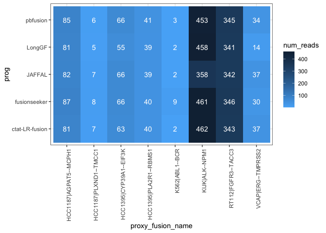

DepMap Fusion Benchmarking
================
bhaas
2024-02-01

# Examine COSMIC fusions among these cell lines, predicted with any number of reads as evidence.

``` r
unfiltered_preds = read.table("__bmark_min-1-read/data/preds.collected.gencode_mapped.wAnnot.gz", header=T, sep="\t") 
```

``` r
unfiltered_preds = unfiltered_preds %>% rowwise() %>% mutate(proxy_fusion_name = paste(sort(str_split(fusion, "--")[[1]]), collapse="--"))

unfiltered_preds %>% head()
```

    ## # A tibble: 6 × 9
    ## # Rowwise: 
    ##   sample  prog           fusion      breakpoint num_reads mapped_gencode_A_gen…¹
    ##   <chr>   <chr>          <chr>       <chr>          <int> <chr>                 
    ## 1 HCC1395 ctat-LR-fusion PDIA5--CH5… chr3:1231…       140 DTX3L,EIF4BP8,KPNA1,M…
    ## 2 HCC1395 ctat-LR-fusion EIF3K--CYP… chr19:386…        54 EIF3K,LGALS13,ZFP30   
    ## 3 HCC1395 ctat-LR-fusion PRRC2B--FU… chr9:1313…        46 AL358781.1,ANAPC2,C9o…
    ## 4 HCC1395 ctat-LR-fusion PLA2R1--RB… chr2:1599…        40 CCDC148,CCDC148-AS1,P…
    ## 5 HCC1395 ctat-LR-fusion RAB7A--LRC… chr3:1287…        26 EEFSEC,FTH1P4,H1FX,H1…
    ## 6 HCC1395 ctat-LR-fusion TMEM104--R… chr17:747…        19 RP11-238F2.1,RPL9P29,…
    ## # ℹ abbreviated name: ¹​mapped_gencode_A_gene_list
    ## # ℹ 3 more variables: mapped_gencode_B_gene_list <chr>, annots <chr>,
    ## #   proxy_fusion_name <chr>

``` r
unfiltered_preds = unfiltered_preds %>% mutate(proxy_fusion_name = paste(sample, proxy_fusion_name, sep ="|"))

unfiltered_preds %>% head()
```

    ## # A tibble: 6 × 9
    ## # Rowwise: 
    ##   sample  prog           fusion      breakpoint num_reads mapped_gencode_A_gen…¹
    ##   <chr>   <chr>          <chr>       <chr>          <int> <chr>                 
    ## 1 HCC1395 ctat-LR-fusion PDIA5--CH5… chr3:1231…       140 DTX3L,EIF4BP8,KPNA1,M…
    ## 2 HCC1395 ctat-LR-fusion EIF3K--CYP… chr19:386…        54 EIF3K,LGALS13,ZFP30   
    ## 3 HCC1395 ctat-LR-fusion PRRC2B--FU… chr9:1313…        46 AL358781.1,ANAPC2,C9o…
    ## 4 HCC1395 ctat-LR-fusion PLA2R1--RB… chr2:1599…        40 CCDC148,CCDC148-AS1,P…
    ## 5 HCC1395 ctat-LR-fusion RAB7A--LRC… chr3:1287…        26 EEFSEC,FTH1P4,H1FX,H1…
    ## 6 HCC1395 ctat-LR-fusion TMEM104--R… chr17:747…        19 RP11-238F2.1,RPL9P29,…
    ## # ℹ abbreviated name: ¹​mapped_gencode_A_gene_list
    ## # ℹ 3 more variables: mapped_gencode_B_gene_list <chr>, annots <chr>,
    ## #   proxy_fusion_name <chr>

``` r
cosmic_fusions = unfiltered_preds %>% filter(grepl("Cosmic", annots)) %>% select(sample, proxy_fusion_name) %>% unique()

cosmic_fusions 
```

    ## # A tibble: 11 × 2
    ## # Rowwise: 
    ##    sample  proxy_fusion_name     
    ##    <chr>   <chr>                 
    ##  1 HCC1395 HCC1395|CYP39A1--EIF3K
    ##  2 HCC1395 HCC1395|PLA2R1--RBMS1 
    ##  3 K562    K562|ABL1--BCR        
    ##  4 RT112   RT112|FGFR3--TACC3    
    ##  5 VCAP    VCAP|ERG--TMPRSS2     
    ##  6 HCC1187 HCC1187|AGPAT5--MCPH1 
    ##  7 HCC1187 HCC1187|PLXND1--TMCC1 
    ##  8 KIJK    KIJK|ALK--NPM1        
    ##  9 HCC1187 HCC1187|GPBP1L1--MAST2
    ## 10 RT112   RT112|FBXL18--RNF216  
    ## 11 HCC1395 HCC1395|AGPAT5--MCPH1

``` r
# sum read counts across isoforms for each fusion

cosmic_fusion_preds= left_join(cosmic_fusions, 
                                unfiltered_preds %>% select(proxy_fusion_name, prog, breakpoint, num_reads),
                                by='proxy_fusion_name') %>%
    group_by(sample, proxy_fusion_name, prog) %>%
    mutate(num_reads = sum(num_reads)) %>%
    ungroup() %>%
    select(sample, proxy_fusion_name, prog, num_reads) %>% unique()

cosmic_fusion_preds
```

    ## # A tibble: 43 × 4
    ##    sample  proxy_fusion_name      prog           num_reads
    ##    <chr>   <chr>                  <chr>              <int>
    ##  1 HCC1395 HCC1395|CYP39A1--EIF3K ctat-LR-fusion        63
    ##  2 HCC1395 HCC1395|CYP39A1--EIF3K LongGF                55
    ##  3 HCC1395 HCC1395|CYP39A1--EIF3K JAFFAL                66
    ##  4 HCC1395 HCC1395|CYP39A1--EIF3K fusionseeker          66
    ##  5 HCC1395 HCC1395|CYP39A1--EIF3K pbfusion              66
    ##  6 HCC1395 HCC1395|PLA2R1--RBMS1  ctat-LR-fusion        40
    ##  7 HCC1395 HCC1395|PLA2R1--RBMS1  LongGF                39
    ##  8 HCC1395 HCC1395|PLA2R1--RBMS1  JAFFAL                39
    ##  9 HCC1395 HCC1395|PLA2R1--RBMS1  fusionseeker          40
    ## 10 HCC1395 HCC1395|PLA2R1--RBMS1  pbfusion              41
    ## # ℹ 33 more rows

``` r
# limit to those found by at least 2 of the methods
cosmic_fusion_preds_mult_methods = cosmic_fusion_preds %>% select(proxy_fusion_name, prog) %>% unique() %>% 
    group_by(proxy_fusion_name) %>% tally() %>% 
    filter(n>1) %>% 
    pull(proxy_fusion_name)


cosmic_fusion_preds_mult_methods
```

    ## [1] "HCC1187|AGPAT5--MCPH1"  "HCC1187|PLXND1--TMCC1"  "HCC1395|CYP39A1--EIF3K"
    ## [4] "HCC1395|PLA2R1--RBMS1"  "K562|ABL1--BCR"         "KIJK|ALK--NPM1"        
    ## [7] "RT112|FGFR3--TACC3"     "VCAP|ERG--TMPRSS2"

``` r
 depmap_cosmic_fusions_heatmap =   cosmic_fusion_preds %>%
    filter(proxy_fusion_name %in% cosmic_fusion_preds_mult_methods) %>%
    ggplot(aes(x=proxy_fusion_name, y=prog)) + 
    theme_bw() +
    geom_tile(aes(fill=num_reads)) + 
    theme(axis.text.x = element_text(angle = 90, hjust = 1)) +
    scale_fill_continuous(high = "#132B43", low = "#56B1F7", na.value="white") +
    geom_text(aes(label=num_reads), color='white')

 depmap_cosmic_fusions_heatmap
```

<!-- -->

``` r
ggsave(depmap_cosmic_fusions_heatmap, file=paste0("depmap_cosmic_fusions_heatmap.svg"), width=7, height=5)
```
