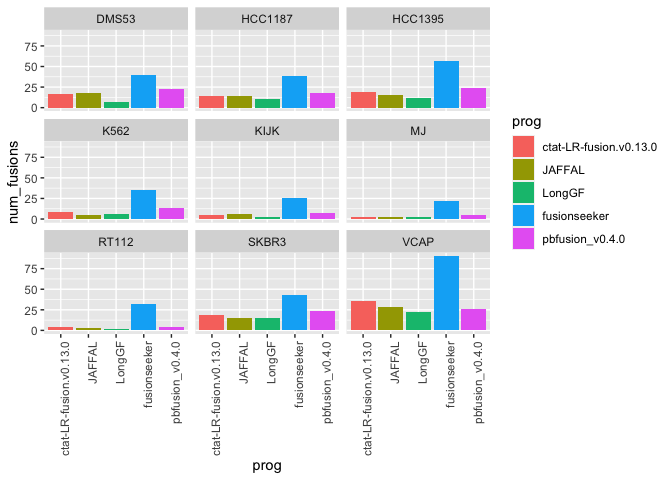
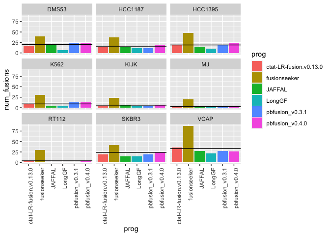
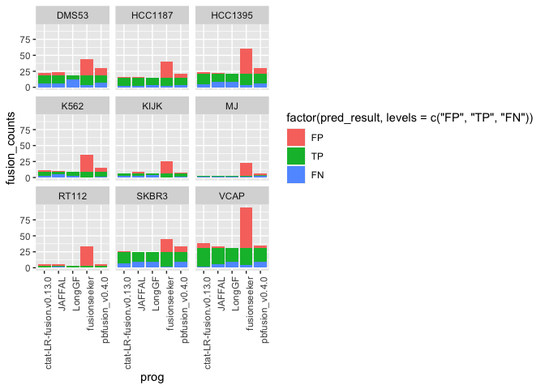
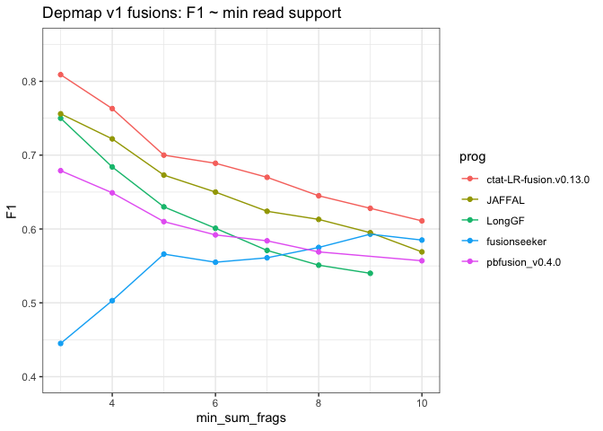
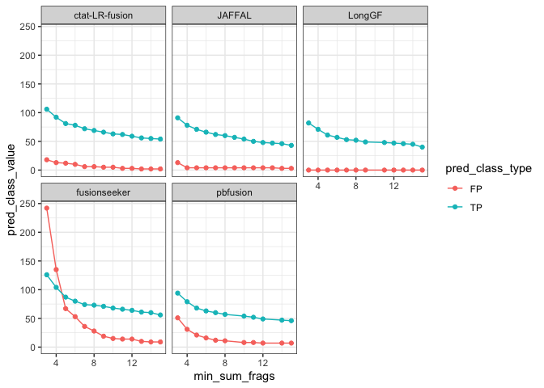
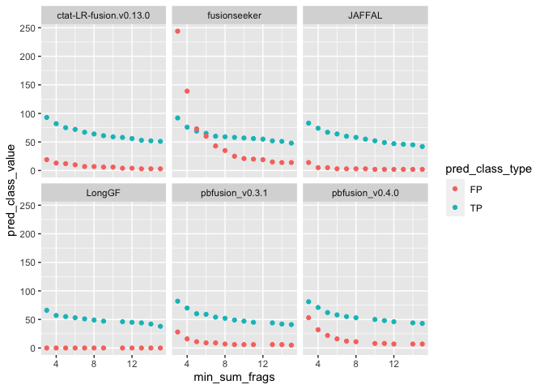
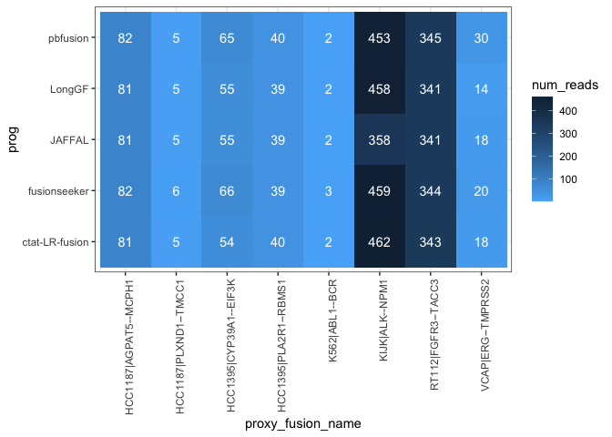
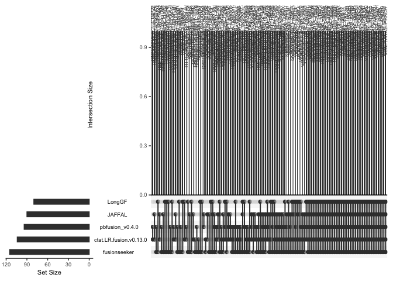

DepMap Fusion Benchmarking
================
bhaas
2024-02-01

``` r
PROGS = c('ctat-LR-fusion', 'JAFFAL', 'LongGF', 'fusionseeker', 'pbfusion'); 


USE_PARALOG_PROXIES = FALSE


if (USE_PARALOG_PROXIES) {
    # or allow for paralogs as proxies:
    scored_predictions_file = "data/min_2.okPara_ignoreUnsure.results.scored"
} else {
    scored_predictions_file = "data/min_2.ignoreUnsure.results.scored"
}


ROC_file = paste0(scored_predictions_file, ".ROC")
```

``` r
fusion_preds = read.table("data/preds.collected.gencode_mapped.wAnnot.filt.pass", header=T, sep="\t", stringsAsFactors = F) %>%
    filter(prog %in% PROGS)

fusion_preds$prog = factor(fusion_preds$prog, levels=PROGS)

fusion_preds %>% head()
```

    ##    sample           prog               fusion                     breakpoint
    ## 1 HCC1395 ctat-LR-fusion PDIA5--CH507-513H4.1  chr3:123124343--chr21:8222961
    ## 2 HCC1395 ctat-LR-fusion       EIF3K--CYP39A1  chr19:38632678--chr6:46639668
    ## 3 HCC1395 ctat-LR-fusion        PRRC2B--FUBP3 chr9:131394263--chr9:130609954
    ## 4 HCC1395 ctat-LR-fusion        PLA2R1--RBMS1 chr2:159976068--chr2:160303487
    ## 5 HCC1395 ctat-LR-fusion         RAB7A--LRCH3 chr3:128726359--chr3:197865423
    ## 6 HCC1395 ctat-LR-fusion        HELZ--HMGB1P7 chr17:67239356--chr17:67067610
    ##   num_reads
    ## 1       140
    ## 2        54
    ## 3        46
    ## 4        40
    ## 5        26
    ## 6        18
    ##                                                                                        mapped_gencode_A_gene_list
    ## 1                                                                                            MIR7110,PDIA5,SEC22A
    ## 2                                                                                                        EIF3K,M9
    ## 3 AL358781.1,AL358781.2,BAT2L,DKFZp781F05101,LQFBS-1,PRRC2B,RP11-334J6.4,RP11-334J6.7,SNORD62A,SNORD62B,hCG_30195
    ## 4                                                                                     AC093642.5,LINC01881,PLA2R1
    ## 5                         AC023598.1,AC117508.1,FTH1P4,MARK2P8,Metazoa_SRP,RAB7A,RN7SL698P,RP11-689D3.4,RPS15AP16
    ## 6                          AC007448.2,AC007448.3,AC007448.4,HELZ,RP11-401F2.1,RP11-401F2.3,RP11-401F2.4,RPL36AP48
    ##                                                                                                                                                                                                                                                                                                                          mapped_gencode_B_gene_list
    ## 1 AK057572,AL592188.2,AL592188.3,AL592188.4,AL592188.8,CH507-513H4.1,CH507-513H4.6,CH507-528H12.1,FP236383.1,FP236383.10,FP236383.2,FP236383.3,FP236383.8,FP671120.1,FP671120.2,FP671120.3,FP671120.4,FP671120.7,LOC100008587,MIR3648-1,MIR3648-2,MIR3687-1,MIR3687-2,MIR6724-1,MIR6724-3,RF01518,RNA18S5,RNA28S5,RNA5-8S5,RNA5-8SN2,RNA5-8SN5,pRNA
    ## 2                                                                                                                                                                                                                                                                                                                               CYP39A1,RP3-347E1.2
    ## 3                                                                                                                                                                                                                                                                                                                        FUBP3,LOC100272217,MIR6856
    ## 4                                                                                                                                                                                                                                                                                   AC093642.5,LINC01881,MIR4785,RBMS1,RMRPP3,RNase_MRP,RNase_MRP.4
    ## 5                                                                                                                                                                                                                                                                                                                       AC055764.1,AC144530.1,LRCH3
    ## 6                                                                                                                                                                                                                                                                                                                                  ARHGAP12,HMGB1P7
    ##                                                                                                                                               annots
    ## 1                                      PDIA5--CH507-513H4.1:INTERCHROMOSOMAL[chr3--chr21];;(recip)CH507-513H4.1--PDIA5:INTERCHROMOSOMAL[chr21--chr3]
    ## 2 EIF3K--CYP39A1:[Klijn_CellLines,Cosmic,ChimerKB,CCLE_StarF2019];INTERCHROMOSOMAL[chr19--chr6];;(recip)CYP39A1--EIF3K:INTERCHROMOSOMAL[chr6--chr19]
    ## 3                                   PRRC2B--FUBP3:[CCLE_StarF2019];INTRACHROMOSOMAL[chr9:0.76Mb];;(recip)FUBP3--PRRC2B:INTRACHROMOSOMAL[chr9:0.76Mb]
    ## 4   PLA2R1--RBMS1:[CCLE_StarF2019,Klijn_CellLines,ChimerKB,Cosmic];INTRACHROMOSOMAL[chr2:0.21Mb];;(recip)RBMS1--PLA2R1:INTRACHROMOSOMAL[chr2:0.21Mb]
    ## 5                                   RAB7A--LRCH3:[CCLE_StarF2019];INTRACHROMOSOMAL[chr3:68.98Mb];;(recip)LRCH3--RAB7A:INTRACHROMOSOMAL[chr3:68.98Mb]
    ## 6                                                  HELZ--HMGB1P7:INTERCHROMOSOMAL[chr17--chr10];;(recip)HMGB1P7--HELZ:INTERCHROMOSOMAL[chr10--chr17]

``` r
p = fusion_preds %>% 
    select(sample, prog, fusion) %>% unique() %>%
    group_by(sample, prog) %>% tally(name='num_fusions') %>%
    ggplot(aes(x=prog, y=num_fusions)) +
    theme_bw() +
    geom_col(aes(fill=prog)) + facet_wrap(~sample)  + 
    theme(axis.text.x = element_text(angle = 90, hjust = 1)) 

p 
```

<!-- -->

``` r
# get num truth counts (min 2 agree)

truth_data = read.table("data/preds.collected.gencode_mapped.wAnnot.filt.pass.proxy_assignments.byProgAgree.min_2.truth_set",
                  header=T, sep="\t", stringsAsFactors = F)


truth_data %>% head()
```

    ##        proxy_fusion_name                                         prog_names
    ## 1   VCAP|C16orf70--ENKD1 JAFFAL,LongGF,ctat-LR-fusion,fusionseeker,pbfusion
    ## 2   HCC1395|MFSD3--MROH1 JAFFAL,LongGF,ctat-LR-fusion,fusionseeker,pbfusion
    ## 3 HCC1187|SEC22B--NOTCH2 JAFFAL,LongGF,ctat-LR-fusion,fusionseeker,pbfusion
    ## 4     VCAP|INPP4A--HJURP JAFFAL,LongGF,ctat-LR-fusion,fusionseeker,pbfusion
    ## 5    SKBR3|KLHDC2--SNTB1 JAFFAL,LongGF,ctat-LR-fusion,fusionseeker,pbfusion
    ## 6  HCC1187|PLXND1--TMCC1 JAFFAL,LongGF,ctat-LR-fusion,fusionseeker,pbfusion
    ##   num_progs
    ## 1         5
    ## 2         5
    ## 3         5
    ## 4         5
    ## 5         5
    ## 6         5

``` r
truth_data$sample_name = sapply(truth_data$proxy_fusion_name, function(x) { str_split(x, "\\|")[[1]][1]})

head(truth_data)
```

    ##        proxy_fusion_name                                         prog_names
    ## 1   VCAP|C16orf70--ENKD1 JAFFAL,LongGF,ctat-LR-fusion,fusionseeker,pbfusion
    ## 2   HCC1395|MFSD3--MROH1 JAFFAL,LongGF,ctat-LR-fusion,fusionseeker,pbfusion
    ## 3 HCC1187|SEC22B--NOTCH2 JAFFAL,LongGF,ctat-LR-fusion,fusionseeker,pbfusion
    ## 4     VCAP|INPP4A--HJURP JAFFAL,LongGF,ctat-LR-fusion,fusionseeker,pbfusion
    ## 5    SKBR3|KLHDC2--SNTB1 JAFFAL,LongGF,ctat-LR-fusion,fusionseeker,pbfusion
    ## 6  HCC1187|PLXND1--TMCC1 JAFFAL,LongGF,ctat-LR-fusion,fusionseeker,pbfusion
    ##   num_progs sample_name
    ## 1         5        VCAP
    ## 2         5     HCC1395
    ## 3         5     HCC1187
    ## 4         5        VCAP
    ## 5         5       SKBR3
    ## 6         5     HCC1187

``` r
truth_data_counts = truth_data %>% rename(sample=sample_name) %>% group_by(sample) %>% tally(name='num_truth_fusions')

truth_data_counts %>% arrange(num_truth_fusions)
```

    ## # A tibble: 9 × 2
    ##   sample  num_truth_fusions
    ##   <chr>               <int>
    ## 1 MJ                      3
    ## 2 RT112                   3
    ## 3 KIJK                    7
    ## 4 K562                    9
    ## 5 HCC1187                14
    ## 6 DMS53                  19
    ## 7 HCC1395                22
    ## 8 SKBR3                  25
    ## 9 VCAP                   31

``` r
# as few as 3 in MJ and as many aas 31 in VCaP
```

``` r
truth_data_counts %>% summarise(sum_truth_fusions = sum(num_truth_fusions))
```

    ## # A tibble: 1 × 1
    ##   sum_truth_fusions
    ##               <int>
    ## 1               133

``` r
# 133 proxy truth fusions
```

``` r
p_fusion_counts_barplot = p + geom_hline(data=truth_data_counts, aes(yintercept=num_truth_fusions))

p_fusion_counts_barplot
```

<!-- -->

``` r
ggsave(p_fusion_counts_barplot, file="depmap_fusion_counts_per_prog.barplot.svg", width=7, height=5)
```

``` r
# unnest prog names

truth_data = truth_data %>% mutate(prog_names = str_split(prog_names, ","))  %>% unnest(prog_names)

truth_data %>% head()
```

    ## # A tibble: 6 × 4
    ##   proxy_fusion_name    prog_names     num_progs sample_name
    ##   <chr>                <chr>              <int> <chr>      
    ## 1 VCAP|C16orf70--ENKD1 JAFFAL                 5 VCAP       
    ## 2 VCAP|C16orf70--ENKD1 LongGF                 5 VCAP       
    ## 3 VCAP|C16orf70--ENKD1 ctat-LR-fusion         5 VCAP       
    ## 4 VCAP|C16orf70--ENKD1 fusionseeker           5 VCAP       
    ## 5 VCAP|C16orf70--ENKD1 pbfusion               5 VCAP       
    ## 6 HCC1395|MFSD3--MROH1 JAFFAL                 5 HCC1395

``` r
#Organize according to pred class
    
scored_data = read.table(scored_predictions_file, header=T, sep="\t", stringsAsFactors = F) %>% 
    filter(prog %in% PROGS)

scored_data$prog = factor(scored_data$prog, levels=PROGS)

scored_data %>% head()
```

    ##   pred_result            proxy_fusion_name proxy_fusion_type  sample
    ## 1          TP HCC1395|PDIA5--CH507-513H4.1   dominant_choice HCC1395
    ## 2          TP       HCC1395|EIF3K--CYP39A1   dominant_choice HCC1395
    ## 3          TP        HCC1395|PRRC2B--FUBP3   dominant_choice HCC1395
    ## 4          TP        HCC1395|PLA2R1--RBMS1   dominant_choice HCC1395
    ## 5          TP         HCC1395|RAB7A--LRCH3   dominant_choice HCC1395
    ## 6          FP        HCC1395|HELZ--HMGB1P7         orig_name HCC1395
    ##             prog               fusion                     breakpoint num_reads
    ## 1 ctat-LR-fusion PDIA5--CH507-513H4.1  chr3:123124343--chr21:8222961       140
    ## 2 ctat-LR-fusion       EIF3K--CYP39A1  chr19:38632678--chr6:46639668        54
    ## 3 ctat-LR-fusion        PRRC2B--FUBP3 chr9:131394263--chr9:130609954        46
    ## 4 ctat-LR-fusion        PLA2R1--RBMS1 chr2:159976068--chr2:160303487        40
    ## 5 ctat-LR-fusion         RAB7A--LRCH3 chr3:128726359--chr3:197865423        26
    ## 6 ctat-LR-fusion        HELZ--HMGB1P7 chr17:67239356--chr17:67067610        18
    ##                                                                                        mapped_gencode_A_gene_list
    ## 1                                                                                            MIR7110,PDIA5,SEC22A
    ## 2                                                                                                        EIF3K,M9
    ## 3 AL358781.1,AL358781.2,BAT2L,DKFZp781F05101,LQFBS-1,PRRC2B,RP11-334J6.4,RP11-334J6.7,SNORD62A,SNORD62B,hCG_30195
    ## 4                                                                                     AC093642.5,LINC01881,PLA2R1
    ## 5                         AC023598.1,AC117508.1,FTH1P4,MARK2P8,Metazoa_SRP,RAB7A,RN7SL698P,RP11-689D3.4,RPS15AP16
    ## 6                          AC007448.2,AC007448.3,AC007448.4,HELZ,RP11-401F2.1,RP11-401F2.3,RP11-401F2.4,RPL36AP48
    ##                                                                                                                                                                                                                                                                                                                          mapped_gencode_B_gene_list
    ## 1 AK057572,AL592188.2,AL592188.3,AL592188.4,AL592188.8,CH507-513H4.1,CH507-513H4.6,CH507-528H12.1,FP236383.1,FP236383.10,FP236383.2,FP236383.3,FP236383.8,FP671120.1,FP671120.2,FP671120.3,FP671120.4,FP671120.7,LOC100008587,MIR3648-1,MIR3648-2,MIR3687-1,MIR3687-2,MIR6724-1,MIR6724-3,RF01518,RNA18S5,RNA28S5,RNA5-8S5,RNA5-8SN2,RNA5-8SN5,pRNA
    ## 2                                                                                                                                                                                                                                                                                                                               CYP39A1,RP3-347E1.2
    ## 3                                                                                                                                                                                                                                                                                                                        FUBP3,LOC100272217,MIR6856
    ## 4                                                                                                                                                                                                                                                                                   AC093642.5,LINC01881,MIR4785,RBMS1,RMRPP3,RNase_MRP,RNase_MRP.4
    ## 5                                                                                                                                                                                                                                                                                                                       AC055764.1,AC144530.1,LRCH3
    ## 6                                                                                                                                                                                                                                                                                                                                  ARHGAP12,HMGB1P7
    ##                                                                                                                                               annots
    ## 1                                      PDIA5--CH507-513H4.1:INTERCHROMOSOMAL[chr3--chr21];;(recip)CH507-513H4.1--PDIA5:INTERCHROMOSOMAL[chr21--chr3]
    ## 2 EIF3K--CYP39A1:[Klijn_CellLines,Cosmic,ChimerKB,CCLE_StarF2019];INTERCHROMOSOMAL[chr19--chr6];;(recip)CYP39A1--EIF3K:INTERCHROMOSOMAL[chr6--chr19]
    ## 3                                   PRRC2B--FUBP3:[CCLE_StarF2019];INTRACHROMOSOMAL[chr9:0.76Mb];;(recip)FUBP3--PRRC2B:INTRACHROMOSOMAL[chr9:0.76Mb]
    ## 4   PLA2R1--RBMS1:[CCLE_StarF2019,Klijn_CellLines,ChimerKB,Cosmic];INTRACHROMOSOMAL[chr2:0.21Mb];;(recip)RBMS1--PLA2R1:INTRACHROMOSOMAL[chr2:0.21Mb]
    ## 5                                   RAB7A--LRCH3:[CCLE_StarF2019];INTRACHROMOSOMAL[chr3:68.98Mb];;(recip)LRCH3--RAB7A:INTRACHROMOSOMAL[chr3:68.98Mb]
    ## 6                                                  HELZ--HMGB1P7:INTERCHROMOSOMAL[chr17--chr10];;(recip)HMGB1P7--HELZ:INTERCHROMOSOMAL[chr10--chr17]
    ##                                                         explanation
    ## 1 first encounter of TP ctat-LR-fusion,HCC1395|PDIA5--CH507-513H4.1
    ## 2       first encounter of TP ctat-LR-fusion,HCC1395|EIF3K--CYP39A1
    ## 3        first encounter of TP ctat-LR-fusion,HCC1395|PRRC2B--FUBP3
    ## 4        first encounter of TP ctat-LR-fusion,HCC1395|PLA2R1--RBMS1
    ## 5         first encounter of TP ctat-LR-fusion,HCC1395|RAB7A--LRCH3
    ## 6 first encounter of FP fusion ctat-LR-fusion,HCC1395|HELZ--HMGB1P7
    ##                selected_fusion
    ## 1 HCC1395|PDIA5--CH507-513H4.1
    ## 2       HCC1395|EIF3K--CYP39A1
    ## 3        HCC1395|PRRC2B--FUBP3
    ## 4        HCC1395|PLA2R1--RBMS1
    ## 5         HCC1395|RAB7A--LRCH3
    ## 6                            .

``` r
scored_data %>% filter(pred_result %in% c("TP", "FP", "FN")) %>% 
    group_by(sample, prog, pred_result) %>% 
    tally(name='fusion_counts') %>%
    ggplot(aes(x=prog, y=fusion_counts, fill=factor(pred_result, levels=c('FP', 'TP', 'FN')))) + 
    theme_bw() +
    geom_col() + facet_wrap(~sample)  +
        theme(axis.text.x = element_text(angle = 90, hjust = 1)) 
```

<!-- -->

# accuracy analysis

Require min 2 calls to agree as truth set.

``` r
data = read.table(ROC_file, header=T, sep="\t", stringsAsFactors = F) 

data = data %>% filter(prog %in% PROGS)

data$prog = factor(data$prog, levels=PROGS)


data %>% head()
```

    ##             prog min_sum_frags  TP FP FN  TPR  PPV    F1
    ## 1 ctat-LR-fusion             3 105 21 28 0.79 0.83 0.810
    ## 2 ctat-LR-fusion             4  91 15 42 0.68 0.86 0.759
    ## 3 ctat-LR-fusion             5  80 14 53 0.60 0.85 0.703
    ## 4 ctat-LR-fusion             6  77 12 56 0.58 0.87 0.696
    ## 5 ctat-LR-fusion             7  71  7 62 0.53 0.91 0.670
    ## 6 ctat-LR-fusion             8  68  7 65 0.51 0.91 0.654

``` r
# F1 vs. min reads

depmap_accuracy_lineplot = data %>% 
    ggplot(aes(x=min_sum_frags, y=F1)) + 
    theme_bw() +
    geom_point(aes(color=prog)) + geom_line(aes(group=prog, color=prog)) +
    xlim(3,10) + ylim(0.4,0.85) +
    ggtitle("Depmap v1 fusions: F1 ~ min read support") 

depmap_accuracy_lineplot
```

    ## Warning: Removed 200 rows containing missing values (`geom_point()`).

    ## Warning: Removed 200 rows containing missing values (`geom_line()`).

<!-- -->

``` r
#ggsave(depmap_accuracy_lineplot, file=paste0("depmap_accuracy_lineplot.use_paralog_proxies=", USE_PARALOG_PROXIES, ".svg"), width=7, height=4)
```

``` r
# plot TP and FP ~ min sum frags.

depmap_TP_vs_FP_scatterplot  = data %>% select(prog, min_sum_frags, TP, FP) %>% 
    gather(key=pred_class_type, value=pred_class_value, TP, FP) %>%
    ggplot(aes(x=min_sum_frags, y=pred_class_value)) + 
    theme_bw() +
    geom_point(aes(color=pred_class_type)) +
    geom_line(aes(groups=pred_class_type, color=pred_class_type)) +
    facet_wrap(~prog) +
    xlim(3,15)
```

    ## Warning in geom_line(aes(groups = pred_class_type, color = pred_class_type)):
    ## Ignoring unknown aesthetics: groups

``` r
depmap_TP_vs_FP_scatterplot 
```

    ## Warning: Removed 352 rows containing missing values (`geom_point()`).

    ## Warning: Removed 70 rows containing missing values (`geom_line()`).

<!-- -->

``` r
#ggsave(depmap_TP_vs_FP_scatterplot, file=paste0("depmap_TP_vs_FP_scatterplot.use_paralog_proxies=", USE_PARALOG_PROXIES, ".svg"), width=7, height=5)
```

``` r
# precision / recall 

depmap_precision_recall_plot = data %>% ggplot(aes(x=TPR, y=PPV)) + 
    theme_bw() +
    geom_point(aes(groups=prog, color=prog)) +
    geom_line(aes(color=prog)) 
```

    ## Warning in geom_point(aes(groups = prog, color = prog)): Ignoring unknown
    ## aesthetics: groups

``` r
depmap_precision_recall_plot 
```

<!-- -->

``` r
#ggsave(depmap_precision_recall_plot, file=paste0("depmap_precision_recall_plot.use_paralog_proxies=", USE_PARALOG_PROXIES, ".svg"), width=5, height=3)
```

# Examine COSMIC fusions among these cell lines, predicted with any number of reads as evidence.

``` r
unfiltered_preds = read.table("data/preds.collected.gencode_mapped.wAnnot.gz", header=T, sep="\t") %>%
    filter(prog %in% PROGS)
```

``` r
unfiltered_preds = unfiltered_preds %>% rowwise() %>% mutate(proxy_fusion_name = paste(sort(str_split(fusion, "--")[[1]]), collapse="--"))

unfiltered_preds %>% head()
```

    ## # A tibble: 6 × 9
    ## # Rowwise: 
    ##   sample  prog           fusion      breakpoint num_reads mapped_gencode_A_gen…¹
    ##   <chr>   <chr>          <chr>       <chr>          <int> <chr>                 
    ## 1 HCC1395 ctat-LR-fusion PDIA5--CH5… chr3:1231…       140 MIR7110,PDIA5,SEC22A  
    ## 2 HCC1395 ctat-LR-fusion EIF3K--CYP… chr19:386…        54 EIF3K,M9              
    ## 3 HCC1395 ctat-LR-fusion PRRC2B--FU… chr9:1313…        46 AL358781.1,AL358781.2…
    ## 4 HCC1395 ctat-LR-fusion PLA2R1--RB… chr2:1599…        40 AC093642.5,LINC01881,…
    ## 5 HCC1395 ctat-LR-fusion RAB7A--LRC… chr3:1287…        26 AC023598.1,AC117508.1…
    ## 6 HCC1395 ctat-LR-fusion TMEM104--R… chr17:747…        19 TMEM104               
    ## # ℹ abbreviated name: ¹​mapped_gencode_A_gene_list
    ## # ℹ 3 more variables: mapped_gencode_B_gene_list <chr>, annots <chr>,
    ## #   proxy_fusion_name <chr>

``` r
unfiltered_preds = unfiltered_preds %>% mutate(proxy_fusion_name = paste(sample, proxy_fusion_name, sep ="|"))

unfiltered_preds %>% head()
```

    ## # A tibble: 6 × 9
    ## # Rowwise: 
    ##   sample  prog           fusion      breakpoint num_reads mapped_gencode_A_gen…¹
    ##   <chr>   <chr>          <chr>       <chr>          <int> <chr>                 
    ## 1 HCC1395 ctat-LR-fusion PDIA5--CH5… chr3:1231…       140 MIR7110,PDIA5,SEC22A  
    ## 2 HCC1395 ctat-LR-fusion EIF3K--CYP… chr19:386…        54 EIF3K,M9              
    ## 3 HCC1395 ctat-LR-fusion PRRC2B--FU… chr9:1313…        46 AL358781.1,AL358781.2…
    ## 4 HCC1395 ctat-LR-fusion PLA2R1--RB… chr2:1599…        40 AC093642.5,LINC01881,…
    ## 5 HCC1395 ctat-LR-fusion RAB7A--LRC… chr3:1287…        26 AC023598.1,AC117508.1…
    ## 6 HCC1395 ctat-LR-fusion TMEM104--R… chr17:747…        19 TMEM104               
    ## # ℹ abbreviated name: ¹​mapped_gencode_A_gene_list
    ## # ℹ 3 more variables: mapped_gencode_B_gene_list <chr>, annots <chr>,
    ## #   proxy_fusion_name <chr>

``` r
cosmic_fusions = unfiltered_preds %>% filter(grepl("Cosmic", annots)) %>% select(sample, proxy_fusion_name) %>% unique()

cosmic_fusions 
```

    ## # A tibble: 11 × 2
    ## # Rowwise: 
    ##    sample  proxy_fusion_name     
    ##    <chr>   <chr>                 
    ##  1 HCC1395 HCC1395|CYP39A1--EIF3K
    ##  2 HCC1395 HCC1395|PLA2R1--RBMS1 
    ##  3 K562    K562|ABL1--BCR        
    ##  4 RT112   RT112|FGFR3--TACC3    
    ##  5 VCAP    VCAP|ERG--TMPRSS2     
    ##  6 HCC1187 HCC1187|AGPAT5--MCPH1 
    ##  7 HCC1187 HCC1187|PLXND1--TMCC1 
    ##  8 KIJK    KIJK|ALK--NPM1        
    ##  9 HCC1187 HCC1187|GPBP1L1--MAST2
    ## 10 RT112   RT112|FBXL18--RNF216  
    ## 11 HCC1395 HCC1395|AGPAT5--MCPH1

``` r
cosmic_fusion_preds= left_join(cosmic_fusions, 
                                unfiltered_preds %>% select(proxy_fusion_name, prog, num_reads),
                                by='proxy_fusion_name') %>%
    # select only top-supported breakpoint entry, just in case.
    group_by(sample, proxy_fusion_name, prog) %>% 
        arrange(desc(num_reads)) %>% filter(row_number() == 1) %>% ungroup()

cosmic_fusion_preds
```

    ## # A tibble: 43 × 4
    ##    sample proxy_fusion_name  prog           num_reads
    ##    <chr>  <chr>              <chr>              <int>
    ##  1 KIJK   KIJK|ALK--NPM1     ctat-LR-fusion       462
    ##  2 KIJK   KIJK|ALK--NPM1     fusionseeker         459
    ##  3 KIJK   KIJK|ALK--NPM1     LongGF               458
    ##  4 KIJK   KIJK|ALK--NPM1     pbfusion             453
    ##  5 KIJK   KIJK|ALK--NPM1     JAFFAL               358
    ##  6 RT112  RT112|FGFR3--TACC3 pbfusion             345
    ##  7 RT112  RT112|FGFR3--TACC3 fusionseeker         344
    ##  8 RT112  RT112|FGFR3--TACC3 ctat-LR-fusion       343
    ##  9 RT112  RT112|FGFR3--TACC3 LongGF               341
    ## 10 RT112  RT112|FGFR3--TACC3 JAFFAL               341
    ## # ℹ 33 more rows

``` r
# limit to those found by at least 2 of the methods
cosmic_fusion_preds_mult_methods = cosmic_fusion_preds %>% select(proxy_fusion_name, prog) %>% unique() %>% 
    group_by(proxy_fusion_name) %>% tally() %>% filter(n>1) %>% pull(proxy_fusion_name)


cosmic_fusion_preds_mult_methods
```

    ## [1] "HCC1187|AGPAT5--MCPH1"  "HCC1187|PLXND1--TMCC1"  "HCC1395|CYP39A1--EIF3K"
    ## [4] "HCC1395|PLA2R1--RBMS1"  "K562|ABL1--BCR"         "KIJK|ALK--NPM1"        
    ## [7] "RT112|FGFR3--TACC3"     "VCAP|ERG--TMPRSS2"

``` r
 depmap_cosmic_fusions_heatmap =   cosmic_fusion_preds %>%
    filter(proxy_fusion_name %in% cosmic_fusion_preds_mult_methods) %>%
    
    ggplot(aes(x=proxy_fusion_name, y=prog)) + 
    theme_bw() +
    geom_tile(aes(fill=num_reads)) + 
    theme(axis.text.x = element_text(angle = 90, hjust = 1)) +
    scale_fill_continuous(high = "#132B43", low = "#56B1F7", na.value="white") +
    geom_text(aes(label=num_reads), color='white')

 depmap_cosmic_fusions_heatmap
```

<!-- -->

``` r
#ggsave(depmap_cosmic_fusions_heatmap, file=paste0("depmap_cosmic_fusions_heatmap.use_paralog_proxies=", USE_PARALOG_PROXIES, ".svg"), width=7, height=5)
```

# Examine truth set fusion sensitivity by method

``` r
library(UpSetRbyFeature)

truth_fusions_found = read.table(scored_predictions_file, sep="\t", header=T) %>% 
    filter(pred_result == "TP") %>% 
    select(prog, selected_fusion) %>% unique()

truth_fusions_found %>% select(selected_fusion) %>% unique() %>% nrow()
```

    ## [1] 133

``` r
truth_fusions_found %>% group_by(prog) %>% tally() %>% arrange(desc(n))
```

    ## # A tibble: 5 × 2
    ##   prog               n
    ##   <chr>          <int>
    ## 1 fusionseeker     115
    ## 2 ctat-LR-fusion   105
    ## 3 pbfusion          94
    ## 4 JAFFAL            89
    ## 5 LongGF            82

``` r
truth_fusions_found_matrix = truth_fusions_found %>% mutate(found = 1) %>% spread(key=prog, value=found, fill=0)


truth_fusion_names = truth_fusions_found_matrix%>% pull(selected_fusion)

truth_fusions_found_matrix =  truth_fusions_found_matrix %>% select(-selected_fusion)

truth_fusions_found_matrix = data.frame(truth_fusions_found_matrix)
rownames(truth_fusions_found_matrix) = truth_fusion_names


upset_plot = UpSetRbyFeature::upset(truth_fusions_found_matrix, number.angles=90, nsets=1000, nintersects=1000)

upset_plot
```

<!-- -->

``` r
#pdf(file=paste0("depmap.upset_plot.use_paralog_proxies=", USE_PARALOG_PROXIES, ".pdf"), width=20)
#UpSetRbyFeature::upset(truth_fusions_found_matrix, number.angles=90, nsets=1000, nintersects=1000)
#dev.off()
```
