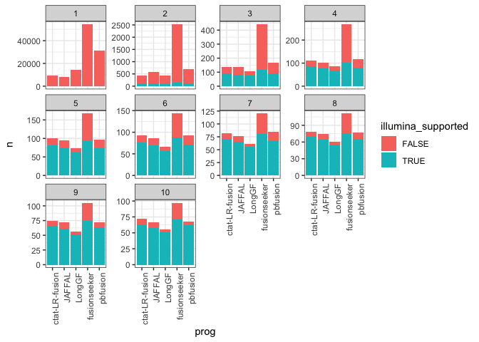

ExamineFusionPredCounts
================
bhaas
2024-07-21

``` r
PROGS = c('ctat-LR-fusion', 'JAFFAL', 'LongGF', 'fusionseeker', 'pbfusion')
```

``` r
fusion_preds = read.csv("__bmark_min-1-read/data/preds.collected.gencode_mapped.wAnnot.gz", header=T, sep="\t") %>% 
    select(sample, prog, num_reads, fusion)

fusion_preds$prog = factor(fusion_preds$prog, levels=PROGS)

fusion_preds =  fusion_preds %>% rowwise() %>% mutate(lex_ordered_fusion_name = paste0(sample, "|", paste0(collapse="--", sort(str_split(fusion, "--")[[1]])))) 
```

``` r
fusion_preds = fusion_preds %>% rowwise() %>% mutate(lex_fusion = paste0(collapse="--", sort(str_split(fusion, "--")[[1]])))
```

``` r
# remove messy fusions
# defined as having at least 3 reads and predicted across mult samples

messy_fusions = fusion_preds %>% filter(num_reads >= 3) %>% select(sample, lex_fusion) %>% unique() %>%
    group_by(lex_fusion) %>% tally() %>% filter(n>1) %>% pull(lex_fusion)

fusion_preds = fusion_preds %>% filter(! lex_fusion %in% messy_fusions)    

length(messy_fusions)
```

    ## [1] 155

``` r
# arriba fusion preds
arriba_fusion_preds = read.csv("3b.1.IlluminaTruSeqDepMap9Lines/all_arriba_high_preds.tsv", sep="\t", header=T, stringsAsFactors = F)
arriba_fusion_preds %>% select(lex_ordered_fusion_name) %>% unique() %>% nrow()
```

    ## [1] 282

``` r
# 282 arriba fusions
```

``` r
# starF preds
starF_preds = read.csv("3b.1.IlluminaTruSeqDepMap9Lines/all_STARF_preds.tsv", sep="\t", header=T, stringsAsFactors = F)
starF_preds %>% select(lex_ordered_fusion_name) %>% unique() %>% nrow()
```

    ## [1] 266

``` r
# 266 StarF preds
```

``` r
illumina_preds = bind_rows(arriba_fusion_preds %>% select(sample, lex_ordered_fusion_name) %>% unique() %>% mutate(prog='arriba'),
                           starF_preds %>% select(sample, lex_ordered_fusion_name) %>% unique() %>% mutate(prog='starF')
                           )

illumina_preds = illumina_preds %>% group_by(sample, lex_ordered_fusion_name) %>% mutate(progs = paste0(collapse=',', prog)) %>%
    ungroup() %>% select(sample, lex_ordered_fusion_name, progs) %>% unique()

illumina_preds %>% head()
```

    ## # A tibble: 6 × 3
    ##   sample lex_ordered_fusion_name                               progs       
    ##   <chr>  <chr>                                                 <chr>       
    ## 1 DMS53  DMS53|RP11-440D17.5--TMEM131                          arriba      
    ## 2 DMS53  DMS53|PGAM1--R3HCC1L                                  arriba,starF
    ## 3 DMS53  DMS53|GALNT8--PRMT8                                   arriba,starF
    ## 4 DMS53  DMS53|PRMT8--RP11-234B24.6                            arriba      
    ## 5 DMS53  DMS53|RP11-573M3.5(1903),RP11-573M3.4(12000)--SLC36A4 arriba      
    ## 6 DMS53  DMS53|KRT7--SMIM41                                    arriba

``` r
table(illumina_preds$progs)
```

    ## 
    ##       arriba arriba,starF        starF 
    ##          190           92          174

``` r
# 190 +  92 +  174  = 456
```

``` r
illumina_preds %>% group_by(sample, progs) %>% tally() 
```

    ## # A tibble: 26 × 3
    ## # Groups:   sample [9]
    ##    sample  progs            n
    ##    <chr>   <chr>        <int>
    ##  1 DMS53   arriba          34
    ##  2 DMS53   arriba,starF    11
    ##  3 DMS53   starF           31
    ##  4 HCC1187 arriba          30
    ##  5 HCC1187 arriba,starF    13
    ##  6 HCC1187 starF           20
    ##  7 HCC1395 arriba          40
    ##  8 HCC1395 arriba,starF    16
    ##  9 HCC1395 starF           27
    ## 10 K562    arriba          13
    ## # ℹ 16 more rows

``` r
illumina_preds %>% group_by(sample, progs) %>% tally() %>%
    ggplot(aes(x=sample, y=n, fill=progs)) + geom_col()
```

<!-- -->

``` r
fusion_preds = fusion_preds %>% mutate(illumina_supported = lex_ordered_fusion_name %in% illumina_preds$lex_ordered_fusion_name)
nrow(fusion_preds)
```

    ## [1] 118856

``` r
# take top supported fusion call per prog in case mult isoforms
fusion_preds = fusion_preds %>% group_by(prog, lex_ordered_fusion_name) %>% arrange(desc(num_reads)) %>% filter(row_number() == 1) %>% ungroup()

nrow(fusion_preds)
```

    ## [1] 117632

``` r
fusion_counts_df = NULL

for (i in seq(1,10)) {
    
    fusion_counts = fusion_preds %>% filter(num_reads >= i) %>% group_by(prog, illumina_supported) %>% tally() %>% mutate(min_reads=i)

    fusion_counts_df = bind_rows(fusion_counts_df, fusion_counts)
    
}

fusion_counts_df %>% head()
```

    ## # A tibble: 6 × 4
    ## # Groups:   prog [3]
    ##   prog           illumina_supported     n min_reads
    ##   <fct>          <lgl>              <int>     <int>
    ## 1 ctat-LR-fusion FALSE               9260         1
    ## 2 ctat-LR-fusion TRUE                 136         1
    ## 3 JAFFAL         FALSE               8051         1
    ## 4 JAFFAL         TRUE                 124         1
    ## 5 LongGF         FALSE              14448         1
    ## 6 LongGF         TRUE                  98         1

``` r
TP_vs_FP_illum_supported_barplot = fusion_counts_df %>% ggplot(aes(x=prog, y=n)) + geom_col(aes(fill=illumina_supported)) +
    theme_bw() +
    facet_wrap(~min_reads, scale='free_y') +
    theme(axis.text.x = element_text(angle = 90, hjust = 1)) 

TP_vs_FP_illum_supported_barplot
```

<!-- -->

``` r
ggsave(TP_vs_FP_illum_supported_barplot, filename="TP_vs_FP_illum_supported_barplot.svg", width=7, height=4.5)
```

``` r
frac_fusion_illum_supported = fusion_counts_df %>% spread(key=illumina_supported, value=n) %>% 
    mutate(frac_illum_supported = `TRUE` / (`TRUE`+`FALSE`)) 
```

``` r
frac_supported_vs_min_reads_plot = frac_fusion_illum_supported %>% ggplot(aes(x=min_reads, y=frac_illum_supported)) + geom_line(aes(groups=prog, color=prog)) +
    geom_point(aes(color=prog)) +
    theme_bw()
```

    ## Warning in geom_line(aes(groups = prog, color = prog)): Ignoring unknown
    ## aesthetics: groups

``` r
frac_supported_vs_min_reads_plot
```

<!-- -->

``` r
#ggsave(frac_supported_vs_min_reads_plot, filename="frac_supported_vs_min_reads_plot.svg", width=7, height=4.5)
```

# examine min 2 agree profile

``` r
fusion_preds_min_agree = fusion_preds %>% select(prog, lex_ordered_fusion_name) %>% unique() %>%
    group_by(lex_ordered_fusion_name) %>% tally() %>% filter(n>1)

fusion_preds_min_agree %>% head()
```

    ## # A tibble: 6 × 2
    ##   lex_ordered_fusion_name       n
    ##   <chr>                     <int>
    ## 1 DMS53|AAGAB--RBM27            3
    ## 2 DMS53|AAGAB--RP11-449H3.3     2
    ## 3 DMS53|AAR2--SAMHD1            5
    ## 4 DMS53|AARSD1--GRN             3
    ## 5 DMS53|AASDH--STAT3            2
    ## 6 DMS53|AASDHPPT--CCNJ          4

``` r
fusion_preds_min2_agree_names = fusion_preds %>% mutate(min2_agree = lex_ordered_fusion_name %in% (fusion_preds_min_agree %>% filter(n>=2) %>% pull(lex_ordered_fusion_name)) )


fusion_preds_min3_agree_names = fusion_preds %>% mutate(min3_agree = lex_ordered_fusion_name %in% (fusion_preds_min_agree %>% filter(n>=3) %>% pull(lex_ordered_fusion_name)) )
```

``` r
fusion_counts_min_agree_df = NULL

for (i in seq(1,10)) {
    
    for (min_progs_agree in seq(2,4)) {
        
         fusions_with_min_reads = fusion_preds %>% filter(num_reads >= i) 
            num_fusions_min_reads = fusions_with_min_reads %>% select(lex_ordered_fusion_name) %>% unique() %>% nrow()
    
        fusion_counts_min_agree = fusion_preds %>% filter(num_reads >= i) %>% 
             group_by(lex_ordered_fusion_name) %>% tally() %>% filter(n>=min_progs_agree) %>% nrow() 

            fusion_counts_min_agree_df = bind_rows(fusion_counts_min_agree_df, 
                                            data.frame(min_read_threshold = i,
                                                       min_progs_agree = min_progs_agree,
                                                       num_fusions_min_reads = num_fusions_min_reads,
                                                       num_fusions_min_agree = fusion_counts_min_agree,
                                                       frac_fusions_min_agree = fusion_counts_min_agree/num_fusions_min_reads
                                                        ) 
                                            
         )
   }   
}

fusion_counts_min_agree_df 
```

    ##    min_read_threshold min_progs_agree num_fusions_min_reads
    ## 1                   1               2                 65638
    ## 2                   1               3                 65638
    ## 3                   1               4                 65638
    ## 4                   2               2                  3036
    ## 5                   2               3                  3036
    ## 6                   2               4                  3036
    ## 7                   3               2                   560
    ## 8                   3               3                   560
    ## 9                   3               4                   560
    ## 10                  4               2                   334
    ## 11                  4               3                   334
    ## 12                  4               4                   334
    ## 13                  5               2                   218
    ## 14                  5               3                   218
    ## 15                  5               4                   218
    ## 16                  6               2                   189
    ## 17                  6               3                   189
    ## 18                  6               4                   189
    ## 19                  7               2                   159
    ## 20                  7               3                   159
    ## 21                  7               4                   159
    ## 22                  8               2                   140
    ## 23                  8               3                   140
    ## 24                  8               4                   140
    ## 25                  9               2                   131
    ## 26                  9               3                   131
    ## 27                  9               4                   131
    ## 28                 10               2                   120
    ## 29                 10               3                   120
    ## 30                 10               4                   120
    ##    num_fusions_min_agree frac_fusions_min_agree
    ## 1                  26416              0.4024498
    ## 2                  15269              0.2326244
    ## 3                   6736              0.1026235
    ## 4                    658              0.2167325
    ## 5                    476              0.1567852
    ## 6                    347              0.1142951
    ## 7                    163              0.2910714
    ## 8                    122              0.2178571
    ## 9                     89              0.1589286
    ## 10                   125              0.3742515
    ## 11                    99              0.2964072
    ## 12                    78              0.2335329
    ## 13                   107              0.4908257
    ## 14                    88              0.4036697
    ## 15                    74              0.3394495
    ## 16                    98              0.5185185
    ## 17                    81              0.4285714
    ## 18                    68              0.3597884
    ## 19                    86              0.5408805
    ## 20                    75              0.4716981
    ## 21                    63              0.3962264
    ## 22                    84              0.6000000
    ## 23                    73              0.5214286
    ## 24                    63              0.4500000
    ## 25                    81              0.6183206
    ## 26                    70              0.5343511
    ## 27                    59              0.4503817
    ## 28                    77              0.6416667
    ## 29                    67              0.5583333
    ## 30                    57              0.4750000

``` r
# fraction of all predictions that are agreed upon given minimum read thresholds applied

frac_fusions_min_progs_agree_plot = fusion_counts_min_agree_df  %>%
    mutate(min_progs_agree = factor(min_progs_agree)) %>%
    ggplot(aes(x=factor(min_read_threshold), y=frac_fusions_min_agree)) + 
    theme_bw() +
    geom_point(aes(color=min_progs_agree)) + geom_line(aes(group=min_progs_agree, color=min_progs_agree))

frac_fusions_min_progs_agree_plot
```

<!-- -->

key observations: - increasing read support yields increasingly agreeing
predictions across programs with the exception of min 1 read support for
min-2 and min-3 progs agreeing. - increasing hte number of programs that
must agree reduces the fraction that agree at the min-1 read evidence
threshold point.

``` r
ggsave(frac_fusions_min_progs_agree_plot, filename="frac_fusions_min_progs_agree_plot.svg", width=7, height=4.5)
```

# examine truth sets overall fraction

``` r
fusion_counts_min_agree_vs_illum_supported = NULL

for (i in seq(1,10)) {
    
    for (min_progs_agree in seq(2,4)) {
        
        num_fusion_preds = fusion_preds %>% filter(num_reads >= i) %>%
            group_by(lex_ordered_fusion_name, illumina_supported) %>% tally() %>% filter(n > min_progs_agree) %>% ungroup() %>%
            group_by(illumina_supported) %>% tally(name='num_fusions')
        
        fusion_counts_min_agree_vs_illum_supported = bind_rows(fusion_counts_min_agree_vs_illum_supported, 
                                                           num_fusion_preds %>% mutate(min_read_support = i, min_progs_agree = min_progs_agree)
                                                           )
    }
}

fusion_counts_min_agree_vs_illum_supported
```

    ## # A tibble: 60 × 4
    ##    illumina_supported num_fusions min_read_support min_progs_agree
    ##    <lgl>                    <int>            <int>           <int>
    ##  1 FALSE                    15135                1               2
    ##  2 TRUE                       134                1               2
    ##  3 FALSE                     6625                1               3
    ##  4 TRUE                       111                1               3
    ##  5 FALSE                     3501                1               4
    ##  6 TRUE                        72                1               4
    ##  7 FALSE                      364                2               2
    ##  8 TRUE                       112                2               2
    ##  9 FALSE                      256                2               3
    ## 10 TRUE                        91                2               3
    ## # ℹ 50 more rows

``` r
frac_illum_supported_by_min_progs_agree_plot = fusion_counts_min_agree_vs_illum_supported %>% 
    spread(key=illumina_supported, value=num_fusions) %>% mutate(frac_illum_supported = `TRUE`/(`TRUE`+`FALSE`)) %>%
    ggplot(aes(x=factor(min_read_support), y=frac_illum_supported)) + theme_bw() +
    geom_point(aes(color=factor(min_progs_agree))) + 
    geom_line(aes(group=min_progs_agree, color=factor(min_progs_agree)))
   

frac_illum_supported_by_min_progs_agree_plot
```

<!-- -->

Increasing the minimum read support before defining proxy truth sets
increases the fraction of fusions supported by orthogonal illumina read
evidence.

Increasing the number of programs that must agree, particularly at 3 or
more reads as evidence, increases the relative illumina-support among
the proxy truth set.

``` r
ggsave(frac_illum_supported_by_min_progs_agree_plot, filename="frac_illum_supported_by_min_progs_agree_plot.svg", width=7, height=4.5)
```
