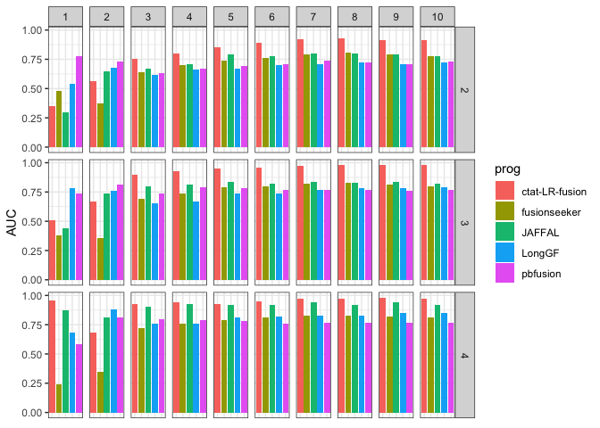
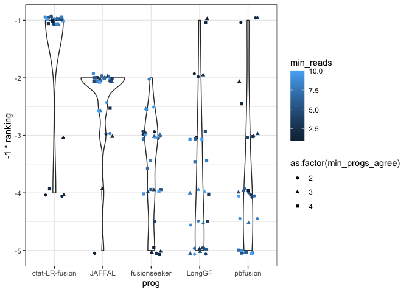

Examine_PR_AUC_varied_minReads
================
bhaas
2024-07-21

``` r
files = c(
"__bmark_min-1-read/data/min_2.ignoreUnsure.results.scored.PR.AUC",
"__bmark_min-1-read/data/min_3.ignoreUnsure.results.scored.PR.AUC",
"__bmark_min-2-reads/data/min_2.ignoreUnsure.results.scored.PR.AUC",
"__bmark_min-2-reads/data/min_3.ignoreUnsure.results.scored.PR.AUC",
"__bmark_min-3-reads/data/min_2.ignoreUnsure.results.scored.PR.AUC",
"__bmark_min-3-reads/data/min_3.ignoreUnsure.results.scored.PR.AUC",
"__bmark_min-4-reads/data/min_2.ignoreUnsure.results.scored.PR.AUC",
"__bmark_min-4-reads/data/min_3.ignoreUnsure.results.scored.PR.AUC",
"__bmark_min-5-reads/data/min_2.ignoreUnsure.results.scored.PR.AUC",
"__bmark_min-5-reads/data/min_3.ignoreUnsure.results.scored.PR.AUC",
"__bmark_min-6-reads/data/min_2.ignoreUnsure.results.scored.PR.AUC",
"__bmark_min-6-reads/data/min_3.ignoreUnsure.results.scored.PR.AUC",
"__bmark_min-7-reads/data/min_2.ignoreUnsure.results.scored.PR.AUC",
"__bmark_min-7-reads/data/min_3.ignoreUnsure.results.scored.PR.AUC",
"__bmark_min-8-reads/data/min_2.ignoreUnsure.results.scored.PR.AUC",
"__bmark_min-8-reads/data/min_3.ignoreUnsure.results.scored.PR.AUC",
"__bmark_min-9-reads/data/min_2.ignoreUnsure.results.scored.PR.AUC",
"__bmark_min-9-reads/data/min_3.ignoreUnsure.results.scored.PR.AUC",
"__bmark_min-10-reads/data/min_2.ignoreUnsure.results.scored.PR.AUC",
"__bmark_min-10-reads/data/min_3.ignoreUnsure.results.scored.PR.AUC",
"./__bmark_min-1-read/data/min_4.ignoreUnsure.results.scored.PR.AUC",
"./__bmark_min-2-reads/data/min_4.ignoreUnsure.results.scored.PR.AUC",
"./__bmark_min-3-reads/data/min_4.ignoreUnsure.results.scored.PR.AUC",
"./__bmark_min-4-reads/data/min_4.ignoreUnsure.results.scored.PR.AUC",
"./__bmark_min-5-reads/data/min_4.ignoreUnsure.results.scored.PR.AUC",
"./__bmark_min-6-reads/data/min_4.ignoreUnsure.results.scored.PR.AUC",
"./__bmark_min-7-reads/data/min_4.ignoreUnsure.results.scored.PR.AUC",
"./__bmark_min-8-reads/data/min_4.ignoreUnsure.results.scored.PR.AUC",
"./__bmark_min-9-reads/data/min_4.ignoreUnsure.results.scored.PR.AUC",
"./__bmark_min-10-reads/data/min_4.ignoreUnsure.results.scored.PR.AUC"

)
```

``` r
OK_PARA = TRUE

if (OK_PARA) {
    files = c(
    "__bmark_min-1-read/data/min_2.okPara_ignoreUnsure.results.scored.PR.AUC",
    "__bmark_min-1-read/data/min_3.okPara_ignoreUnsure.results.scored.PR.AUC",
    "__bmark_min-2-reads/data/min_2.okPara_ignoreUnsure.results.scored.PR.AUC",
    "__bmark_min-2-reads/data/min_3.okPara_ignoreUnsure.results.scored.PR.AUC",
    "__bmark_min-3-reads/data/min_2.okPara_ignoreUnsure.results.scored.PR.AUC",
    "__bmark_min-3-reads/data/min_3.okPara_ignoreUnsure.results.scored.PR.AUC",
    "__bmark_min-4-reads/data/min_2.okPara_ignoreUnsure.results.scored.PR.AUC",
    "__bmark_min-4-reads/data/min_3.okPara_ignoreUnsure.results.scored.PR.AUC",
    "__bmark_min-5-reads/data/min_2.okPara_ignoreUnsure.results.scored.PR.AUC",
    "__bmark_min-5-reads/data/min_3.okPara_ignoreUnsure.results.scored.PR.AUC",
    "__bmark_min-6-reads/data/min_2.okPara_ignoreUnsure.results.scored.PR.AUC",
    "__bmark_min-6-reads/data/min_3.okPara_ignoreUnsure.results.scored.PR.AUC",
    "__bmark_min-7-reads/data/min_2.okPara_ignoreUnsure.results.scored.PR.AUC",
    "__bmark_min-7-reads/data/min_3.okPara_ignoreUnsure.results.scored.PR.AUC",
    "__bmark_min-8-reads/data/min_2.okPara_ignoreUnsure.results.scored.PR.AUC",
    "__bmark_min-8-reads/data/min_3.okPara_ignoreUnsure.results.scored.PR.AUC",
    "__bmark_min-9-reads/data/min_2.okPara_ignoreUnsure.results.scored.PR.AUC",
    "__bmark_min-9-reads/data/min_3.okPara_ignoreUnsure.results.scored.PR.AUC",
    "__bmark_min-10-reads/data/min_2.okPara_ignoreUnsure.results.scored.PR.AUC",
    "__bmark_min-10-reads/data/min_3.okPara_ignoreUnsure.results.scored.PR.AUC",
    "./__bmark_min-1-read/data/min_4.okPara_ignoreUnsure.results.scored.PR.AUC",
    "./__bmark_min-2-reads/data/min_4.okPara_ignoreUnsure.results.scored.PR.AUC",
    "./__bmark_min-3-reads/data/min_4.okPara_ignoreUnsure.results.scored.PR.AUC",
    "./__bmark_min-4-reads/data/min_4.okPara_ignoreUnsure.results.scored.PR.AUC",
    "./__bmark_min-5-reads/data/min_4.okPara_ignoreUnsure.results.scored.PR.AUC",
    "./__bmark_min-6-reads/data/min_4.okPara_ignoreUnsure.results.scored.PR.AUC",
    "./__bmark_min-7-reads/data/min_4.okPara_ignoreUnsure.results.scored.PR.AUC",
    "./__bmark_min-8-reads/data/min_4.okPara_ignoreUnsure.results.scored.PR.AUC",
    "./__bmark_min-9-reads/data/min_4.okPara_ignoreUnsure.results.scored.PR.AUC",
    "./__bmark_min-10-reads/data/min_4.okPara_ignoreUnsure.results.scored.PR.AUC"
    
    )

}
```

``` r
PR_AUC_df = NULL

for (file in files) {
    
    df = read.csv(file, sep="\t", header=F, stringsAsFactors = F)
    colnames(df) = c('prog', 'AUC')
    df$fname = file

    PR_AUC_df = bind_rows(PR_AUC_df, df)
}


PR_AUC_df %>% head()
```

    ##             prog  AUC
    ## 1       pbfusion 0.78
    ## 2         LongGF 0.54
    ## 3   fusionseeker 0.48
    ## 4 ctat-LR-fusion 0.35
    ## 5         JAFFAL 0.30
    ## 6         LongGF 0.78
    ##                                                                     fname
    ## 1 __bmark_min-1-read/data/min_2.okPara_ignoreUnsure.results.scored.PR.AUC
    ## 2 __bmark_min-1-read/data/min_2.okPara_ignoreUnsure.results.scored.PR.AUC
    ## 3 __bmark_min-1-read/data/min_2.okPara_ignoreUnsure.results.scored.PR.AUC
    ## 4 __bmark_min-1-read/data/min_2.okPara_ignoreUnsure.results.scored.PR.AUC
    ## 5 __bmark_min-1-read/data/min_2.okPara_ignoreUnsure.results.scored.PR.AUC
    ## 6 __bmark_min-1-read/data/min_3.okPara_ignoreUnsure.results.scored.PR.AUC

``` r
PR_AUC_df = PR_AUC_df %>% rowwise() %>% mutate(min_reads = as.numeric(str_match(fname, "min-(\\d+)-read")[[2]]) )

PR_AUC_df %>% head()
```

    ## # A tibble: 6 × 4
    ## # Rowwise: 
    ##   prog             AUC fname                                           min_reads
    ##   <chr>          <dbl> <chr>                                               <dbl>
    ## 1 pbfusion        0.78 __bmark_min-1-read/data/min_2.okPara_ignoreUns…         1
    ## 2 LongGF          0.54 __bmark_min-1-read/data/min_2.okPara_ignoreUns…         1
    ## 3 fusionseeker    0.48 __bmark_min-1-read/data/min_2.okPara_ignoreUns…         1
    ## 4 ctat-LR-fusion  0.35 __bmark_min-1-read/data/min_2.okPara_ignoreUns…         1
    ## 5 JAFFAL          0.3  __bmark_min-1-read/data/min_2.okPara_ignoreUns…         1
    ## 6 LongGF          0.78 __bmark_min-1-read/data/min_3.okPara_ignoreUns…         1

``` r
PR_AUC_df = PR_AUC_df %>% rowwise() %>% mutate(min_progs_agree = as.numeric(str_match(fname, "min_(\\d+)\\.")[[2]]) )

PR_AUC_df %>% head()
```

    ## # A tibble: 6 × 5
    ## # Rowwise: 
    ##   prog             AUC fname                           min_reads min_progs_agree
    ##   <chr>          <dbl> <chr>                               <dbl>           <dbl>
    ## 1 pbfusion        0.78 __bmark_min-1-read/data/min_2.…         1               2
    ## 2 LongGF          0.54 __bmark_min-1-read/data/min_2.…         1               2
    ## 3 fusionseeker    0.48 __bmark_min-1-read/data/min_2.…         1               2
    ## 4 ctat-LR-fusion  0.35 __bmark_min-1-read/data/min_2.…         1               2
    ## 5 JAFFAL          0.3  __bmark_min-1-read/data/min_2.…         1               2
    ## 6 LongGF          0.78 __bmark_min-1-read/data/min_3.…         1               3

``` r
PR_AUC_df %>% ggplot(aes(x=prog, y=AUC)) + 
    geom_col(aes(fill=prog)) +
    theme_bw() +
    facet_grid(vars(min_progs_agree), vars(min_reads)) +
    theme(axis.title.x=element_blank(),
        axis.text.x=element_blank(),
        axis.ticks.x=element_blank())
```

<!-- -->

``` r
write.table(PR_AUC_df %>% select(prog, min_reads, min_progs_agree, AUC), file="PR_AUC_summary.tsv", quote=F, sep="\t", row.names=F)
```

``` r
# assign rankings

PR_AUC_df = PR_AUC_df %>% group_by(min_reads, min_progs_agree) %>% mutate(ranking = rank(-1*AUC, ties.method='average'))
```

``` r
program_overall_ranking = PR_AUC_df %>% group_by(prog) %>% summarize(mean_ranking = mean(ranking)) %>% arrange(mean_ranking) %>%
    pull(prog)
```

``` r
PR_AUC_df$prog = factor(PR_AUC_df$prog, levels = program_overall_ranking)
```

``` r
summary_PR_AUC_violin_plot = PR_AUC_df %>% 
    #filter(min_reads >= 1) %>%
    ggplot(aes(x=prog, y=-1 * ranking)) + geom_violin() +
    geom_jitter(aes(color=min_reads, shape=as.factor(min_progs_agree)), width=0.2, height=0.075) +
    theme_bw()

summary_PR_AUC_violin_plot
```

<!-- -->

``` r
ggsave(summary_PR_AUC_violin_plot, filename = "depmap_bmark.summary_PR_AUC_violin_plot.svg", width=7, height=3.5)
```
