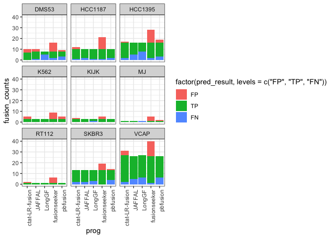
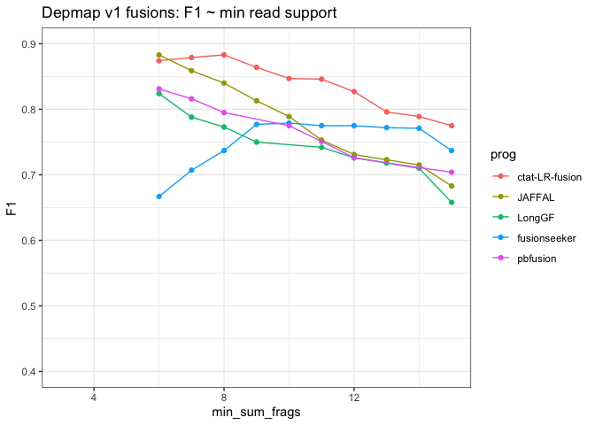
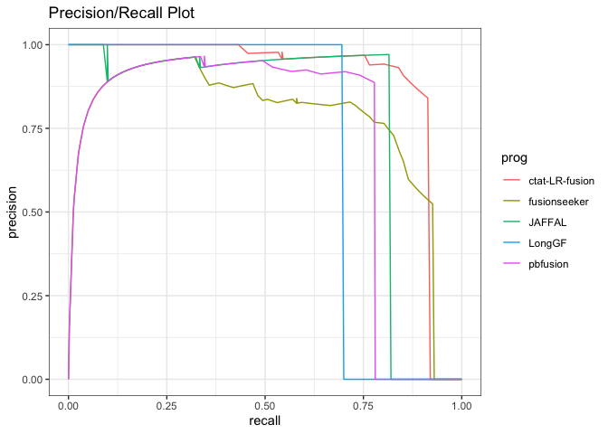
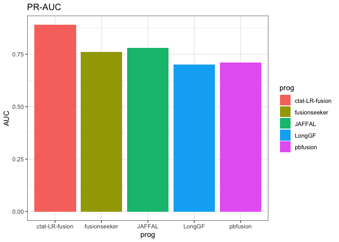
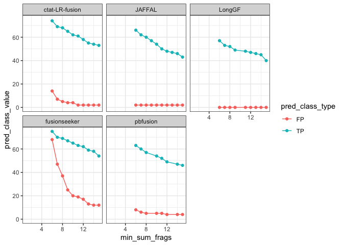
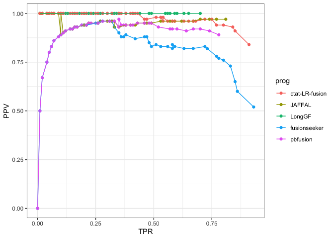
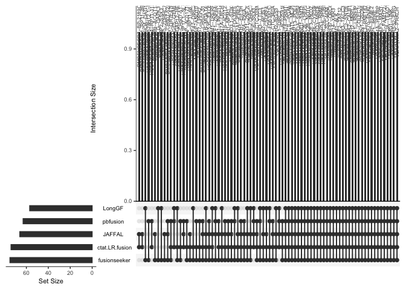

DepMap Fusion Benchmarking
================
bhaas
2024-02-01

``` r
PROGS = c('ctat-LR-fusion', 'JAFFAL', 'LongGF', 'fusionseeker', 'pbfusion'); 


USE_PARALOG_PROXIES = TRUE

MIN_PROGS_AGREE = 2


if (USE_PARALOG_PROXIES) {
    # or allow for paralogs as proxies:
    scored_predictions_file = paste0("data/min_", MIN_PROGS_AGREE, ".okPara_ignoreUnsure.results.scored")
} else {
    scored_predictions_file = paste0("data/min_", MIN_PROGS_AGREE, ".ignoreUnsure.results.scored")
}


ROC_file = paste0(scored_predictions_file, ".ROC")
```

``` r
# get num truth counts (min 2 agree)

truth_data = read.table("data/preds.collected.gencode_mapped.wAnnot.filt.pass.proxy_assignments.byProgAgree.min_2.truth_set",
                  header=T, sep="\t", stringsAsFactors = F)


truth_data %>% head()
```

    ##      proxy_fusion_name                                         prog_names
    ## 1      VCAP|PSMG1--UNK JAFFAL,LongGF,ctat-LR-fusion,fusionseeker,pbfusion
    ## 2     VCAP|VWA2--PRKCH JAFFAL,LongGF,ctat-LR-fusion,fusionseeker,pbfusion
    ## 3 DMS53|R3HCC1L--PGAM1 JAFFAL,LongGF,ctat-LR-fusion,fusionseeker,pbfusion
    ## 4 HCC1395|MFSD3--MROH1 JAFFAL,LongGF,ctat-LR-fusion,fusionseeker,pbfusion
    ## 5  VCAP|NDUFAF2--MAST4 JAFFAL,LongGF,ctat-LR-fusion,fusionseeker,pbfusion
    ## 6      VCAP|HSF1--RERE JAFFAL,LongGF,ctat-LR-fusion,fusionseeker,pbfusion
    ##   num_progs
    ## 1         5
    ## 2         5
    ## 3         5
    ## 4         5
    ## 5         5
    ## 6         5

``` r
truth_data$sample_name = sapply(truth_data$proxy_fusion_name, function(x) { str_split(x, "\\|")[[1]][1]})

head(truth_data)
```

    ##      proxy_fusion_name                                         prog_names
    ## 1      VCAP|PSMG1--UNK JAFFAL,LongGF,ctat-LR-fusion,fusionseeker,pbfusion
    ## 2     VCAP|VWA2--PRKCH JAFFAL,LongGF,ctat-LR-fusion,fusionseeker,pbfusion
    ## 3 DMS53|R3HCC1L--PGAM1 JAFFAL,LongGF,ctat-LR-fusion,fusionseeker,pbfusion
    ## 4 HCC1395|MFSD3--MROH1 JAFFAL,LongGF,ctat-LR-fusion,fusionseeker,pbfusion
    ## 5  VCAP|NDUFAF2--MAST4 JAFFAL,LongGF,ctat-LR-fusion,fusionseeker,pbfusion
    ## 6      VCAP|HSF1--RERE JAFFAL,LongGF,ctat-LR-fusion,fusionseeker,pbfusion
    ##   num_progs sample_name
    ## 1         5        VCAP
    ## 2         5        VCAP
    ## 3         5       DMS53
    ## 4         5     HCC1395
    ## 5         5        VCAP
    ## 6         5        VCAP

``` r
truth_data_counts = truth_data %>% rename(sample=sample_name) %>% group_by(sample) %>% tally(name='num_truth_fusions')

truth_data_counts %>% arrange(num_truth_fusions)
```

    ## # A tibble: 9 × 2
    ##   sample  num_truth_fusions
    ##   <chr>               <int>
    ## 1 MJ                      1
    ## 2 RT112                   1
    ## 3 K562                    3
    ## 4 KIJK                    3
    ## 5 DMS53                   8
    ## 6 HCC1187                10
    ## 7 SKBR3                  13
    ## 8 HCC1395                16
    ## 9 VCAP                   27

``` r
truth_data_counts %>% summarise(sum_truth_fusions = sum(num_truth_fusions))
```

    ## # A tibble: 1 × 1
    ##   sum_truth_fusions
    ##               <int>
    ## 1                82

``` r
# 83 proxy truth fusions
```

``` r
# unnest prog names

truth_data = truth_data %>% mutate(prog_names = str_split(prog_names, ","))  %>% unnest(prog_names)

truth_data %>% head()
```

    ## # A tibble: 6 × 4
    ##   proxy_fusion_name prog_names     num_progs sample_name
    ##   <chr>             <chr>              <int> <chr>      
    ## 1 VCAP|PSMG1--UNK   JAFFAL                 5 VCAP       
    ## 2 VCAP|PSMG1--UNK   LongGF                 5 VCAP       
    ## 3 VCAP|PSMG1--UNK   ctat-LR-fusion         5 VCAP       
    ## 4 VCAP|PSMG1--UNK   fusionseeker           5 VCAP       
    ## 5 VCAP|PSMG1--UNK   pbfusion               5 VCAP       
    ## 6 VCAP|VWA2--PRKCH  JAFFAL                 5 VCAP

``` r
#Organize according to pred class
    
scored_data = read.table(scored_predictions_file, header=T, sep="\t", stringsAsFactors = F) %>% 
    filter(prog %in% PROGS)

scored_data$prog = factor(scored_data$prog, levels=PROGS)

scored_data %>% head()
```

    ##   pred_result            proxy_fusion_name proxy_fusion_type  sample
    ## 1          TP HCC1395|PDIA5--CH507-513H4.1   dominant_choice HCC1395
    ## 2          TP       HCC1395|EIF3K--CYP39A1   dominant_choice HCC1395
    ## 3          TP        HCC1395|PRRC2B--FUBP3   dominant_choice HCC1395
    ## 4          TP        HCC1395|PLA2R1--RBMS1   dominant_choice HCC1395
    ## 5          TP         HCC1395|RAB7A--LRCH3   dominant_choice HCC1395
    ## 6          TP       HCC1395|ARHGAP12--HELZ       overlap_rep HCC1395
    ##             prog               fusion                     breakpoint num_reads
    ## 1 ctat-LR-fusion PDIA5--CH507-513H4.1  chr3:123124343--chr21:8222961       140
    ## 2 ctat-LR-fusion       EIF3K--CYP39A1  chr19:38632678--chr6:46639668        54
    ## 3 ctat-LR-fusion        PRRC2B--FUBP3 chr9:131394263--chr9:130609954        46
    ## 4 ctat-LR-fusion        PLA2R1--RBMS1 chr2:159976068--chr2:160303487        40
    ## 5 ctat-LR-fusion         RAB7A--LRCH3 chr3:128726359--chr3:197865423        26
    ## 6 ctat-LR-fusion        HELZ--HMGB1P7 chr17:67239356--chr10:31912970        18
    ##                         mapped_gencode_A_gene_list
    ## 1                             MIR7110,PDIA5,SEC22A
    ## 2                                            EIF3K
    ## 3 AL358781.1,PRRC2B,RP11-334J6.7,SNORD62A,SNORD62B
    ## 4                                           PLA2R1
    ## 5         FTH1P4,MARK2P8,RAB7A,RN7SL698P,RPS15AP16
    ## 6         HELZ,RP11-401F2.3,RP11-401F2.4,RPL36AP48
    ##                                                                              mapped_gencode_B_gene_list
    ## 1 CH507-513H4.1,CH507-513H4.6,FP671120.2,FP671120.3,FP671120.4,FP671120.7,MIR3648-2,MIR3687-2,MIR6724-3
    ## 2                                                                                               CYP39A1
    ## 3                                                                                         FUBP3,MIR6856
    ## 4                                                                                  MIR4785,RBMS1,RMRPP3
    ## 5                                                                           AC055764.1,AC144530.1,LRCH3
    ## 6                                                                                      ARHGAP12,HMGB1P7
    ##                                                                                                                                               annots
    ## 1                                      PDIA5--CH507-513H4.1:INTERCHROMOSOMAL[chr3--chr21];;(recip)CH507-513H4.1--PDIA5:INTERCHROMOSOMAL[chr21--chr3]
    ## 2 EIF3K--CYP39A1:[Klijn_CellLines,Cosmic,ChimerKB,CCLE_StarF2019];INTERCHROMOSOMAL[chr19--chr6];;(recip)CYP39A1--EIF3K:INTERCHROMOSOMAL[chr6--chr19]
    ## 3                                   PRRC2B--FUBP3:[CCLE_StarF2019];INTRACHROMOSOMAL[chr9:0.76Mb];;(recip)FUBP3--PRRC2B:INTRACHROMOSOMAL[chr9:0.76Mb]
    ## 4   PLA2R1--RBMS1:[CCLE_StarF2019,Klijn_CellLines,ChimerKB,Cosmic];INTRACHROMOSOMAL[chr2:0.21Mb];;(recip)RBMS1--PLA2R1:INTRACHROMOSOMAL[chr2:0.21Mb]
    ## 5                                   RAB7A--LRCH3:[CCLE_StarF2019];INTRACHROMOSOMAL[chr3:68.98Mb];;(recip)LRCH3--RAB7A:INTRACHROMOSOMAL[chr3:68.98Mb]
    ## 6                                                  HELZ--HMGB1P7:INTERCHROMOSOMAL[chr17--chr10];;(recip)HMGB1P7--HELZ:INTERCHROMOSOMAL[chr10--chr17]
    ##                                                         explanation
    ## 1 first encounter of TP ctat-LR-fusion,HCC1395|PDIA5--CH507-513H4.1
    ## 2       first encounter of TP ctat-LR-fusion,HCC1395|EIF3K--CYP39A1
    ## 3        first encounter of TP ctat-LR-fusion,HCC1395|PRRC2B--FUBP3
    ## 4        first encounter of TP ctat-LR-fusion,HCC1395|PLA2R1--RBMS1
    ## 5         first encounter of TP ctat-LR-fusion,HCC1395|RAB7A--LRCH3
    ## 6       first encounter of TP ctat-LR-fusion,HCC1395|ARHGAP12--HELZ
    ##                selected_fusion
    ## 1 HCC1395|PDIA5--CH507-513H4.1
    ## 2       HCC1395|EIF3K--CYP39A1
    ## 3        HCC1395|PRRC2B--FUBP3
    ## 4        HCC1395|PLA2R1--RBMS1
    ## 5         HCC1395|RAB7A--LRCH3
    ## 6       HCC1395|ARHGAP12--HELZ

``` r
scored_data %>% filter(pred_result %in% c("TP", "FP", "FN")) %>% 
    group_by(sample, prog, pred_result) %>% 
    tally(name='fusion_counts') %>%
    ggplot(aes(x=prog, y=fusion_counts, fill=factor(pred_result, levels=c('FP', 'TP', 'FN')))) + 
    theme_bw() +
    geom_col() + facet_wrap(~sample)  +
        theme(axis.text.x = element_text(angle = 90, hjust = 1)) 
```

<!-- -->

# accuracy analysis

Require min 2 calls to agree as truth set.

``` r
data = read.table(ROC_file, header=T, sep="\t", stringsAsFactors = F) 

data = data %>% filter(prog %in% PROGS)

data$prog = factor(data$prog, levels=PROGS)


data %>% head()
```

    ##     prog min_sum_frags TP FP FN  TPR PPV    F1
    ## 1 LongGF             6 57  0 25 0.70   1 0.824
    ## 2 LongGF             7 53  0 29 0.65   1 0.788
    ## 3 LongGF             8 52  0 30 0.63   1 0.773
    ## 4 LongGF             9 49  0 33 0.60   1 0.750
    ## 5 LongGF            11 48  0 34 0.59   1 0.742
    ## 6 LongGF            12 47  0 35 0.57   1 0.726

``` r
# F1 vs. min reads

depmap_accuracy_lineplot = data %>% 
    ggplot(aes(x=min_sum_frags, y=F1)) + 
    theme_bw() +
    geom_point(aes(color=prog)) + geom_line(aes(group=prog, color=prog)) +
    xlim(3,15) + 
    ylim(0.4,0.9) +
    ggtitle("Depmap v1 fusions: F1 ~ min read support")  # +
    #scale_y_continuous(trans='log10')

depmap_accuracy_lineplot
```

    ## Warning: Removed 179 rows containing missing values (`geom_point()`).

    ## Warning: Removed 179 rows containing missing values (`geom_line()`).

<!-- -->

``` r
#ggsave(depmap_accuracy_lineplot, file=paste0("depmap_accuracy_lineplot.use_paralog_proxies=", USE_PARALOG_PROXIES, ".svg"), width=7, height=4)
```

``` r
PR_data = read.csv(paste0(scored_predictions_file, ".PR"), header=T, sep="\t", stringsAsFactors = F)

PR_data %>% ggplot(aes(x=recall, y=precision)) + geom_line(aes(groups=prog, color=prog)) + theme_bw() +
    ggtitle("Precision/Recall Plot")
```

    ## Warning in geom_line(aes(groups = prog, color = prog)): Ignoring unknown
    ## aesthetics: groups

<!-- -->

``` r
PR_AUC = read.csv(paste0(scored_predictions_file, ".PR.AUC"), header=F, sep="\t")

colnames(PR_AUC) = c('prog', 'AUC')

PR_AUC %>% ggplot(aes(x=prog, y=AUC)) + geom_col(aes(fill=prog)) + ggtitle("PR-AUC") + theme_bw()
```

<!-- -->

``` r
# plot TP and FP ~ min sum frags.

depmap_TP_vs_FP_scatterplot  = data %>% select(prog, min_sum_frags, TP, FP) %>% 
    gather(key=pred_class_type, value=pred_class_value, TP, FP) %>%
    ggplot(aes(x=min_sum_frags, y=pred_class_value)) + 
    theme_bw() +
    geom_point(aes(color=pred_class_type)) +
    geom_line(aes(groups=pred_class_type, color=pred_class_type)) +
    facet_wrap(~prog) +
    xlim(1,15)
```

    ## Warning in geom_line(aes(groups = pred_class_type, color = pred_class_type)):
    ## Ignoring unknown aesthetics: groups

``` r
depmap_TP_vs_FP_scatterplot 
```

    ## Warning: Removed 358 rows containing missing values (`geom_point()`).

    ## Warning: Removed 70 rows containing missing values (`geom_line()`).

<!-- -->

``` r
#ggsave(depmap_TP_vs_FP_scatterplot, file=paste0("depmap_TP_vs_FP_scatterplot.use_paralog_proxies=", USE_PARALOG_PROXIES, ".svg"), width=7, height=5)
```

``` r
# precision / recall 

depmap_precision_recall_plot = data %>% ggplot(aes(x=TPR, y=PPV)) + 
    theme_bw() +
    geom_point(aes(groups=prog, color=prog)) +
    geom_line(aes(color=prog)) 
```

    ## Warning in geom_point(aes(groups = prog, color = prog)): Ignoring unknown
    ## aesthetics: groups

``` r
depmap_precision_recall_plot 
```

<!-- -->

``` r
#ggsave(depmap_precision_recall_plot, file=paste0("depmap_precision_recall_plot.use_paralog_proxies=", USE_PARALOG_PROXIES, ".svg"), width=5, height=3)
```

# Examine truth set fusion sensitivity by method

``` r
library(UpSetRbyFeature)

truth_fusions_found = read.table(scored_predictions_file, sep="\t", header=T) %>% 
    filter(pred_result == "TP") %>% 
    select(prog, selected_fusion) %>% unique()

truth_fusions_found %>% select(selected_fusion) %>% unique() %>% nrow()
```

    ## [1] 82

``` r
truth_fusions_found %>% group_by(prog) %>% tally() %>% arrange(desc(n))
```

    ## # A tibble: 5 × 2
    ##   prog               n
    ##   <chr>          <int>
    ## 1 fusionseeker      75
    ## 2 ctat-LR-fusion    74
    ## 3 JAFFAL            66
    ## 4 pbfusion          63
    ## 5 LongGF            57

``` r
truth_fusions_found_matrix = truth_fusions_found %>% mutate(found = 1) %>% spread(key=prog, value=found, fill=0)


truth_fusion_names = truth_fusions_found_matrix%>% pull(selected_fusion)

truth_fusions_found_matrix =  truth_fusions_found_matrix %>% select(-selected_fusion)

truth_fusions_found_matrix = data.frame(truth_fusions_found_matrix)
rownames(truth_fusions_found_matrix) = truth_fusion_names


upset_plot = UpSetRbyFeature::upset(truth_fusions_found_matrix, number.angles=90, nsets=1000, nintersects=1000)

upset_plot
```

<!-- -->

``` r
#pdf(file=paste0("depmap.upset_plot.use_paralog_proxies=", USE_PARALOG_PROXIES, ".pdf"), width=20)
#UpSetRbyFeature::upset(truth_fusions_found_matrix, number.angles=90, nsets=1000, nintersects=1000)
#dev.off()
```
