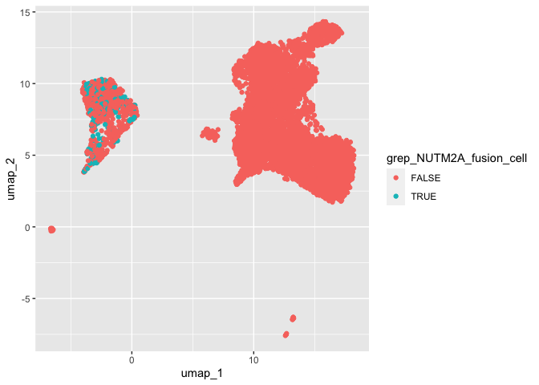

GrepMatchedFusionCells
================
bhaas
2024-07-29

``` r
cells_matched = read.csv("data/grep_matching_LR.tsv", header=F, sep="\t", stringsAsFactors = F)

colnames(cells_matched) = c('cell_barcode', 'UMI', 'read_name')

cells_matched %>% head()
```

    ##       cell_barcode        UMI                               read_name
    ## 1 AGAGCTTCAGTATCTG CATCCATTAC m64020e_210506_132139/1001245761009/ccs
    ## 2 TGGGCGTAGATTACCC AAACTAGTGT m64020e_210506_132139/1001706351014/ccs
    ## 3 CCTCAGTGTACCGGCT AAGGATCCGA m64020e_210506_132139/1001968872011/ccs
    ## 4 GCATGATAGCTAGTCT TTAAACGTAG m64020e_210506_132139/1002032595011/ccs
    ## 5 CGATGGCTCAACGGCC CAATCTGTAG m64020e_210506_132139/1002032776005/ccs
    ## 6 CGAGCCATCATGTGGT TGCTCGTCAA m64020e_210506_132139/1002228479005/ccs

``` r
umap_info = read.csv("../data/M132TS.bc_to_umap_n_leiden.tsv", header=T, sep="\t", stringsAsFactors = F)

umap_info %>% head()
```

    ##              index n_genes n_genes_by_counts total_counts total_counts_mt
    ## 1 AATCGGTAGCTCCTCT    6101              6097        62047            2595
    ## 2 AGTGAGGCATACTACG    6197              6187        61331            3115
    ## 3 GCAATCATCTACTTAC    6147              6144        54211            5094
    ## 4 TATCAGGTCAACGAAA    6049              6047        51348            1969
    ## 5 GCTCTGTGTCGTCTTC    5717              5714        49486            6476
    ## 6 GGCGACTCAAGGTGTG    5548              5544        49168            8424
    ##   pct_counts_mt leiden    umap_1    umap_2       CST3
    ## 1      4.182313      6 14.693794 12.737415 -0.3304369
    ## 2      5.078998      6 15.216582 12.841690 -0.3304369
    ## 3      9.396617      4 -2.953952  9.282772  3.6016747
    ## 4      3.834619      6 15.213437 12.659111 -0.3304369
    ## 5     13.086530      4 -2.970528  8.378538  3.8447659
    ## 6     17.133095      4 -2.130175  9.665569  3.2912690

``` r
umap_info = umap_info %>% mutate(grep_NUTM2A_fusion_cell = (index %in% cells_matched$cell_barcode))
```

``` r
umap_info %>% filter(grep_NUTM2A_fusion_cell) %>% select(index) %>% unique() %>% nrow()
```

    ## [1] 200

``` r
# 200 cells identified by grep w/ NUTM2A breakpoint seqs
```

``` r
umap_info %>% ggplot(aes(x=umap_1, y=umap_2)) + geom_point(aes(color=grep_NUTM2A_fusion_cell))
```

<!-- -->

``` r
ctat_LRF_fusions = read.csv("../data/M132TS.melanoma_sc.filtered_cells_and_dedup_umis.tsv.gz", header=T, sep="\t", stringsAsFactors = F) %>%
    filter(FusionName == "NUTM2A-AS1--RP11-203L2.4")

ctat_LRF_fusions %>% head()
```

    ##                 FusionName   LeftBreakpoint RightBreakpoint     cell_barcode
    ## 1 NUTM2A-AS1--RP11-203L2.4 chr10:87326630:- chr9:68822648:- AAAGTAGTCAGCTCGG
    ## 2 NUTM2A-AS1--RP11-203L2.4 chr10:87326630:- chr9:68822648:- AACCGCGTCAGGTAAA
    ## 3 NUTM2A-AS1--RP11-203L2.4 chr10:87326630:- chr9:68822648:- ACACTGACAAGGTTCT
    ## 4 NUTM2A-AS1--RP11-203L2.4 chr10:87326630:- chr9:68822648:- ACGAGCCGTGCCTGCA
    ## 5 NUTM2A-AS1--RP11-203L2.4 chr10:87326630:- chr9:68822648:- AGGGTGAAGACTAGGC
    ## 6 NUTM2A-AS1--RP11-203L2.4 chr10:87326630:- chr9:68822648:- CCTTTCTCATTTGCCC
    ##          umi                                            read_name      method
    ## 1 TGTTTCCTTG  SL-NXC:HFC2FBGXG201010:HFC2FBGXG:2:23208:4385:12555 STAR-Fusion
    ## 2 CACTATACTA  SL-NXC:HFC2FBGXG201010:HFC2FBGXG:3:21601:10727:4780 STAR-Fusion
    ## 3 GTCCGGGATT   SL-NXC:HFC2FBGXG201010:HFC2FBGXG:1:11205:3138:1700 STAR-Fusion
    ## 4 CCGATAGCCT SL-NXC:HFC2FBGXG201010:HFC2FBGXG:2:13102:19192:14026 STAR-Fusion
    ## 5 CTAGCCCCGC SL-NXC:HFC2FBGXG201010:HFC2FBGXG:2:23206:10768:18611 STAR-Fusion
    ## 6 CAGGTTATTC   SL-NXC:HFC2FBGXG201010:HFC2FBGXG:3:22503:3800:1947 STAR-Fusion
    ##   n_genes n_genes_by_counts total_counts total_counts_mt pct_counts_mt leiden
    ## 1    4400              4394        28989            2161      7.454552      4
    ## 2    6462              6459        48625            4014      8.255013      7
    ## 3    5314              5313        43377            8655     19.952970      4
    ## 4    6177              6173        41134            2963      7.203287      4
    ## 5    4656              4655        24046            2929     12.180820      4
    ## 6    3994              3993        22503            3260     14.486957      4
    ##      umap_1    umap_2     CST3      rev_barcode dataset
    ## 1 -2.543282  8.939785 3.374993 CCGAGCTGACTACTTT  M132TS
    ## 2 -2.362060  5.909807 2.422163 TTTACCTGACGCGGTT  M132TS
    ## 3 -3.352013 10.066854 2.732447 AGAACCTTGTCAGTGT  M132TS
    ## 4 -3.483788  8.931896 2.766479 TGCAGGCACGGCTCGT  M132TS
    ## 5 -1.441397  6.911107 2.816132 GCCTAGTCTTCACCCT  M132TS
    ## 6 -1.186438  9.582017 2.941193 GGGCAAATGAGAAAGG  M132TS

``` r
fusion_by_method = bind_rows(ctat_LRF_fusions %>% select(cell_barcode, method, leiden),
                             umap_info %>% filter(grep_NUTM2A_fusion_cell) %>% select(index, leiden) %>%
                                 rename(cell_barcode = index) %>% mutate(method='grep') )
```

``` r
fusion_counts_by_method = fusion_by_method %>% unique() %>% group_by(cell_barcode) %>% mutate(methods=paste(collapse=',', method)) %>%
    ungroup() %>%
    select(cell_barcode, methods, leiden) %>% unique() %>%
    group_by(methods, leiden) %>% tally()

fusion_counts_by_method
```

    ## # A tibble: 19 × 3
    ## # Groups:   methods [10]
    ##    methods                                         leiden     n
    ##    <chr>                                            <int> <int>
    ##  1 FusionInspector                                      1     1
    ##  2 FusionInspector                                      3     1
    ##  3 FusionInspector                                      4    32
    ##  4 FusionInspector                                      7     5
    ##  5 FusionInspector,ctat-LR-fusion                       4     1
    ##  6 FusionInspector,ctat-LR-fusion,grep                  4    28
    ##  7 FusionInspector,ctat-LR-fusion,grep                  7     6
    ##  8 STAR-Fusion                                          4     1
    ##  9 STAR-Fusion,FusionInspector                          2     1
    ## 10 STAR-Fusion,FusionInspector                          4    13
    ## 11 STAR-Fusion,FusionInspector,ctat-LR-fusion           4     2
    ## 12 STAR-Fusion,FusionInspector,ctat-LR-fusion,grep      4    15
    ## 13 STAR-Fusion,FusionInspector,ctat-LR-fusion,grep      7     2
    ## 14 ctat-LR-fusion                                       4    11
    ## 15 ctat-LR-fusion                                       7     2
    ## 16 ctat-LR-fusion,grep                                  4   118
    ## 17 ctat-LR-fusion,grep                                  7    29
    ## 18 grep                                                 4     1
    ## 19 grep                                                 7     1

``` r
# cells identified via 'grep' breakpoint method

fusion_counts_by_method %>% filter(grepl("grep", methods))
```

    ## # A tibble: 8 × 3
    ## # Groups:   methods [4]
    ##   methods                                         leiden     n
    ##   <chr>                                            <int> <int>
    ## 1 FusionInspector,ctat-LR-fusion,grep                  4    28
    ## 2 FusionInspector,ctat-LR-fusion,grep                  7     6
    ## 3 STAR-Fusion,FusionInspector,ctat-LR-fusion,grep      4    15
    ## 4 STAR-Fusion,FusionInspector,ctat-LR-fusion,grep      7     2
    ## 5 ctat-LR-fusion,grep                                  4   118
    ## 6 ctat-LR-fusion,grep                                  7    29
    ## 7 grep                                                 4     1
    ## 8 grep                                                 7     1

``` r
# only 2 cells identified uniquely by grep, both tumor cells
```

``` r
# what's found outside the tumor cells?

fusion_counts_by_method %>% filter(! leiden %in% c(4,7))
```

    ## # A tibble: 3 × 3
    ## # Groups:   methods [2]
    ##   methods                     leiden     n
    ##   <chr>                        <int> <int>
    ## 1 FusionInspector                  1     1
    ## 2 FusionInspector                  3     1
    ## 3 STAR-Fusion,FusionInspector      2     1

Grep with breakpoint seqs identified many cells with the NUTM2A fusion,
but all were tumor cells.
