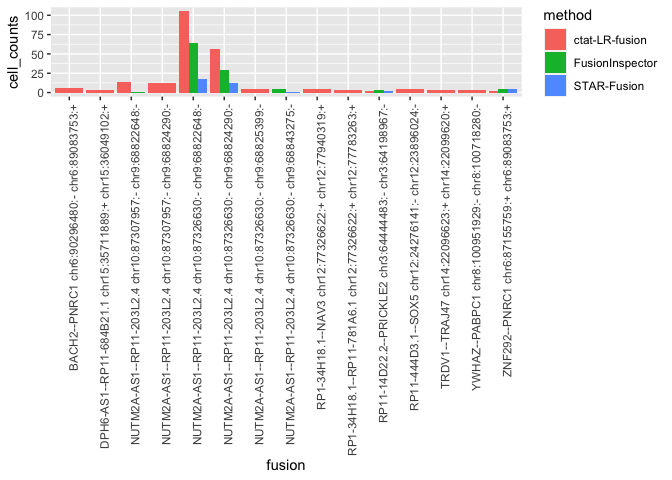
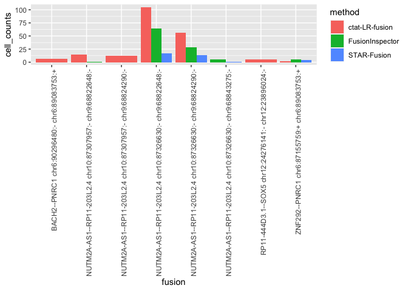
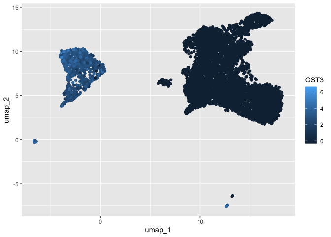
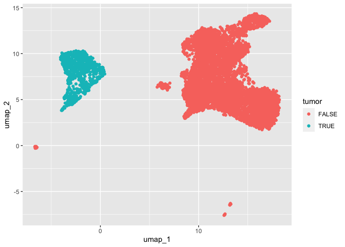
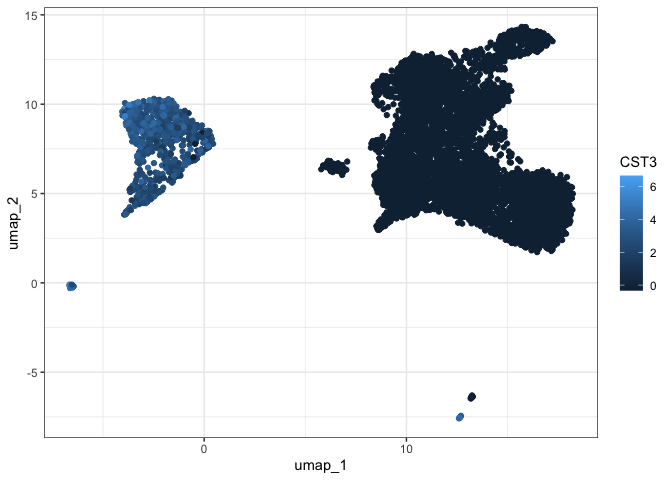
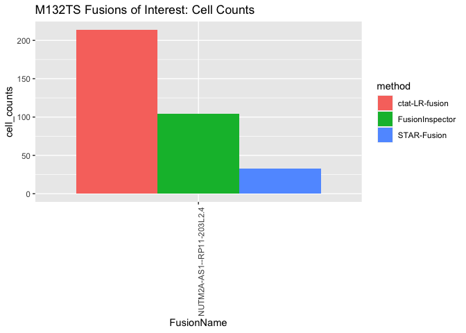

M132TS_analysis
================
bhaas
2023-09-28

``` r
MIN_CELLS = 3
```

# M132TS

``` r
all_data = read.table("data/M132TS.melanoma_sc.filtered_cells_and_dedup_umis.tsv.gz", header=T, sep="\t", stringsAsFactors = F)

head(all_data)
```

    ##             FusionName   LeftBreakpoint  RightBreakpoint     cell_barcode
    ## 1        AAGAB--MAP2K5 chr15:67254559:- chr15:67806646:+ AGCGTATCAATCGGTT
    ## 2        AAGAB--MAP2K5 chr15:67254559:- chr15:67806646:+ AGCGTATCAATCGGTT
    ## 3          AAR2--SPCS1 chr20:36240512:+  chr3:52706644:+ CCATGTCGTAATTGGA
    ## 4      ABCA11P--CLSTN3    chr4:473981:-  chr12:7135327:+ TTGAACGCACGAAAGC
    ## 5      ABCC5--MAP1LC3B chr3:184014264:- chr16:87402175:+ CTCGTACCATTGGGCC
    ## 6 ABCF1--RP11-152O14.1  chr6:30577913:+ chr16:52098727:+ CAGTAACGTAGCGCAA
    ##          umi                                            read_name
    ## 1 ACTTATGGTA  SL-NXC:HFC2FBGXG201010:HFC2FBGXG:1:11112:5851:13045
    ## 2 ACTTATGGTA  SL-NXC:HFC2FBGXG201010:HFC2FBGXG:1:11112:5851:13045
    ## 3 CACTGCAATC  SL-NXC:HFC2FBGXG201010:HFC2FBGXG:1:12305:5106:11608
    ## 4 CTCACCTCAG  SL-NXC:HFC2FBGXG201010:HFC2FBGXG:4:22412:23146:7738
    ## 5 GAGAGGGACA SL-NXC:HFC2FBGXG201010:HFC2FBGXG:3:23602:18491:20084
    ## 6 CATCGATTTC  SL-NXC:HFC2FBGXG201010:HFC2FBGXG:1:11210:26088:2371
    ##            method n_genes n_genes_by_counts total_counts total_counts_mt
    ## 1     STAR-Fusion    4553              4549        30057            2522
    ## 2 FusionInspector    4553              4549        30057            2522
    ## 3     STAR-Fusion    4219              4214        20474            1914
    ## 4     STAR-Fusion    1168              1168         2639             152
    ## 5     STAR-Fusion    3291              3288        17842            1279
    ## 6     STAR-Fusion    1922              1920         7054             916
    ##   pct_counts_mt leiden     umap_1    umap_2       CST3      rev_barcode dataset
    ## 1      8.390724      4  0.1371778  7.718211  2.4598508 AACCGATTGATACGCT  M132TS
    ## 2      8.390724      4  0.1371778  7.718211  2.4598508 AACCGATTGATACGCT  M132TS
    ## 3      9.348442      4 -2.3211787  7.969330  2.8550922 TCCAATTACGACATGG  M132TS
    ## 4      5.759757      2  9.9445240 11.945428 -0.3304369 GCTTTCGTGCGTTCAA  M132TS
    ## 5      7.168479      4  0.4421482  7.784063  2.4039671 GGCCCAATGGTACGAG  M132TS
    ## 6     12.985540      4 -1.1218052  9.394082  2.3726925 TTGCGCTACGTTACTG  M132TS

``` r
all_data %>% select(method) %>% unique()
```

    ##             method
    ## 1      STAR-Fusion
    ## 2  FusionInspector
    ## 11  ctat-LR-fusion

``` r
# since starF and FI were run at max sensitivity, lets restrict fusions to those identified by ctat-LRF

ctat_LRF_fusion_genes = all_data %>% filter(method == 'ctat-LR-fusion') %>% select(FusionName) %>% unique() %>% pull(FusionName)

all_data = all_data %>% filter(FusionName %in% ctat_LRF_fusion_genes)
```

``` r
starF_fusions = all_data %>% filter(method=="STAR-Fusion")

FI_fusions = all_data %>% filter(method=="FusionInspector")

ctat_LRF_fusions = all_data %>% filter(method == "ctat-LR-fusion")
```

``` r
fusion_annots = read.table("data/M132TS.fusion_annots.gz", sep="\t", header=T, stringsAsFactors = F)
```

``` r
fusion_cell_counts_by_method = read.table("data/M132TS.melanoma_sc.filtered_cells_and_dedup_umis.cell_counts_by_method.tsv.gz",
                                          header=T, sep="\t", stringsAsFactors = F)


fusion_cell_counts_by_method  = fusion_cell_counts_by_method %>% filter(FusionName %in% ctat_LRF_fusion_genes)

fusion_cell_counts_by_method %>% head()
```

    ##                 FusionName   LeftBreakpoint RightBreakpoint          method
    ## 1 NUTM2A-AS1--RP11-203L2.4 chr10:87326630:- chr9:68822648:-  ctat-LR-fusion
    ## 2 NUTM2A-AS1--RP11-203L2.4 chr10:87326630:- chr9:68822648:- FusionInspector
    ## 3 NUTM2A-AS1--RP11-203L2.4 chr10:87326630:- chr9:68824290:-  ctat-LR-fusion
    ## 4 NUTM2A-AS1--RP11-203L2.4 chr10:87326630:- chr9:68824290:- FusionInspector
    ## 5 NUTM2A-AS1--RP11-203L2.4 chr10:87326630:- chr9:68822648:-  ctat-LR-fusion
    ## 6 NUTM2A-AS1--RP11-203L2.4 chr10:87326630:- chr9:68822648:-     STAR-Fusion
    ##   leiden dataset cell_counts
    ## 1      4  M132TS         105
    ## 2      4  M132TS          64
    ## 3      4  M132TS          56
    ## 4      4  M132TS          29
    ## 5      7  M132TS          25
    ## 6      4  M132TS          17

``` r
fusion_cell_counts_by_method %>% select(FusionName, LeftBreakpoint, RightBreakpoint, method, leiden, cell_counts) %>%
    spread(key=method, value=cell_counts) %>% 
    arrange(desc(`ctat-LR-fusion`)) %>% head()
```

    ##                 FusionName   LeftBreakpoint RightBreakpoint leiden
    ## 1 NUTM2A-AS1--RP11-203L2.4 chr10:87326630:- chr9:68822648:-      4
    ## 2 NUTM2A-AS1--RP11-203L2.4 chr10:87326630:- chr9:68824290:-      4
    ## 3 NUTM2A-AS1--RP11-203L2.4 chr10:87326630:- chr9:68822648:-      7
    ## 4 NUTM2A-AS1--RP11-203L2.4 chr10:87326630:- chr9:68824290:-      7
    ## 5 NUTM2A-AS1--RP11-203L2.4 chr10:87307957:- chr9:68822648:-      4
    ## 6 NUTM2A-AS1--RP11-203L2.4 chr10:87307957:- chr9:68824290:-      4
    ##   ctat-LR-fusion FusionInspector STAR-Fusion
    ## 1            105              64          17
    ## 2             56              29          13
    ## 3             25              10           2
    ## 4             15               3          NA
    ## 5             14               1          NA
    ## 6             12              NA          NA

# plot counts of cells for these fusions:

``` r
right_join(fusion_cell_counts_by_method, 
          fusion_cell_counts_by_method %>% 
                         filter(cell_counts >= MIN_CELLS)  %>% 
                         select(FusionName, LeftBreakpoint, RightBreakpoint) 
          ) %>%
              rowwise() %>% mutate(fusion=paste(FusionName, LeftBreakpoint, RightBreakpoint, collapse=":")) %>%
              ggplot(aes(x=fusion, y=cell_counts, fill=method)) + geom_bar(stat='identity', position='dodge') +
              theme(axis.text.x = element_text(angle = 90, hjust = 1))
```

    ## Joining with `by = join_by(FusionName, LeftBreakpoint, RightBreakpoint)`

    ## Warning in right_join(fusion_cell_counts_by_method, fusion_cell_counts_by_method %>% : Each row in `x` is expected to match at most 1 row in `y`.
    ## ℹ Row 1 of `x` matches multiple rows.
    ## ℹ If multiple matches are expected, set `multiple = "all"` to silence this
    ##   warning.

<!-- -->

# Examine cell type representation by fusions

``` r
fusion_frac_cell_types = all_data %>% select(FusionName, cell_barcode, leiden) %>% unique() %>%
    group_by(FusionName, leiden) %>% tally(name='tot_cells_w_fusion') %>% 
    mutate(frac_fusion_cells=prop.table(tot_cells_w_fusion)) %>%
    arrange(desc(tot_cells_w_fusion))

fusion_frac_cell_types %>% head()
```

    ## # A tibble: 6 × 4
    ## # Groups:   FusionName [5]
    ##   FusionName               leiden tot_cells_w_fusion frac_fusion_cells
    ##   <chr>                     <int>              <int>             <dbl>
    ## 1 NUTM2A-AS1--RP11-203L2.4      4                221             0.825
    ## 2 NUTM2A-AS1--RP11-203L2.4      7                 44             0.164
    ## 3 RP11-444D3.1--SOX5            4                  7             0.7  
    ## 4 BACH2--PNRC1                  0                  6             0.667
    ## 5 RP11-14D22.2--PRICKLE2        4                  5             1    
    ## 6 ZNF292--PNRC1                 0                  5             0.417

``` r
fusions_of_interest = fusion_frac_cell_types %>% 
    filter(tot_cells_w_fusion >= MIN_CELLS) %>%
    arrange(desc(tot_cells_w_fusion)) %>%
    filter(frac_fusion_cells >= 0.8)

fusions_of_interest
```

    ## # A tibble: 5 × 4
    ## # Groups:   FusionName [5]
    ##   FusionName                leiden tot_cells_w_fusion frac_fusion_cells
    ##   <chr>                      <int>              <int>             <dbl>
    ## 1 NUTM2A-AS1--RP11-203L2.4       4                221             0.825
    ## 2 RP11-14D22.2--PRICKLE2         4                  5             1    
    ## 3 RP1-34H18.1--RP11-781A6.1      4                  3             1    
    ## 4 TRDV1--TRAJ47                  1                  3             1    
    ## 5 YWHAZ--PABPC1                  0                  3             1

``` r
fusions_of_interest = left_join(fusions_of_interest,
          fusion_annots)
```

    ## Joining with `by = join_by(FusionName)`

``` r
fusions_of_interest
```

    ## # A tibble: 5 × 5
    ## # Groups:   FusionName [5]
    ##   FusionName                leiden tot_cells_w_fusion frac_fusion_cells annots  
    ##   <chr>                      <int>              <int>             <dbl> <chr>   
    ## 1 NUTM2A-AS1--RP11-203L2.4       4                221             0.825 INTERCH…
    ## 2 RP11-14D22.2--PRICKLE2         4                  5             1     INTRACH…
    ## 3 RP1-34H18.1--RP11-781A6.1      4                  3             1     INTRACH…
    ## 4 TRDV1--TRAJ47                  1                  3             1     INTRACH…
    ## 5 YWHAZ--PABPC1                  0                  3             1     INTRACH…

NUTM2A-AS1–RP11-203L2.4 is the only relevant inter-chromosomal.

The others have few cells and are likely cis-spliced fusions.

``` r
umap_base_data = read.table("data/M132TS.bc_to_umap_n_leiden.tsv.gz", header=T, sep="\t", stringsAsFactors = F)

baseplot = umap_base_data %>% ggplot(aes(x=umap_1, y=umap_2)) + geom_point()

baseplot + geom_point(aes(color=as.factor(leiden)))
```

<!-- -->

``` r
 umap_base_data %>% ggplot(aes(x=umap_1, y=umap_2)) + geom_point(aes(color=CST3))
```

<!-- -->

``` r
TUMOR_CLUSTERS = c(4,7)

umap_base_data = umap_base_data %>% mutate(tumor = leiden %in% TUMOR_CLUSTERS)

umap_base_data %>%
    ggplot(aes(x=umap_1, y=umap_2)) + geom_point(aes(color=tumor))
```

<!-- -->

``` r
umap_base_data %>% select(index, tumor) %>% unique() %>% nrow()
```

    ## [1] 6932

``` r
# 6932 total cells
    
 umap_base_data %>% select(index, tumor) %>% unique() %>% group_by(tumor) %>% tally()
```

    ## # A tibble: 2 × 2
    ##   tumor     n
    ##   <lgl> <int>
    ## 1 FALSE  6231
    ## 2 TRUE    701

``` r
# tumor #cells
# FALSE 6231            
# TRUE  701 

NUM_TOTAL_CELLS = 6932
NUM_TUMOR_CELLS = 701
NUM_NORMAL_CELLS = 6231

# so 10% are tumor cells
```

``` r
# label tumor cells
all_data = all_data %>% 
    mutate(tumor = leiden %in% TUMOR_CLUSTERS)

fusion_frac_tumor = all_data %>%
    select(FusionName, cell_barcode, tumor) %>% unique() %>%
    group_by(FusionName, tumor) %>% tally(name='tot_cells_w_fusion') %>%
    spread(key=tumor, value=tot_cells_w_fusion, fill = 0) %>%
    rename(normal_cell_count=`FALSE`) %>% rename(tumor_cell_count=`TRUE`) %>%
    mutate(frac_normal_cells = normal_cell_count / NUM_NORMAL_CELLS,
           frac_tumor_cells = tumor_cell_count / NUM_TUMOR_CELLS) %>%
    arrange(desc(frac_tumor_cells))


fusions_of_interest = fusion_frac_tumor %>% filter(frac_tumor_cells > 0.01 | frac_normal_cells > 0.01)

fusions_of_interest
```

    ## # A tibble: 1 × 5
    ## # Groups:   FusionName [1]
    ##   FusionName               normal_cell_count tumor_cell_count frac_nor…¹ frac_…²
    ##   <chr>                                <dbl>            <dbl>      <dbl>   <dbl>
    ## 1 NUTM2A-AS1--RP11-203L2.4                 3              265   0.000481   0.378
    ## # … with abbreviated variable names ¹​frac_normal_cells, ²​frac_tumor_cells

``` r
x = 0

plots = list()

for (fusion in  fusions_of_interest$FusionName) {
    
    p = baseplot + geom_point(data=all_data %>% filter(FusionName == fusion) %>% select(umap_1, umap_2, method) %>% unique(), 
                              aes(color=method), alpha=0.5, size=rel(2)) + 
        ggtitle(paste("M132TS, Fusion: ", fusion) )
    
    plot(p)   
    
    x = x+1
    plots[[x]] = p
}
```

<!-- -->

``` r
pdf("M132TS.fusions_of_interest.pdf")
for (p in plots) {
    plot(p)
}

dev.off()
```

    ## quartz_off_screen 
    ##                 2

``` r
fusions_of_interest = left_join(fusions_of_interest,
          fusion_annots)
```

    ## Joining with `by = join_by(FusionName)`

``` r
fusions_of_interest
```

    ## # A tibble: 1 × 6
    ## # Groups:   FusionName [1]
    ##   FusionName               normal_cell_count tumor_cell…¹ frac_…² frac_…³ annots
    ##   <chr>                                <dbl>        <dbl>   <dbl>   <dbl> <chr> 
    ## 1 NUTM2A-AS1--RP11-203L2.4                 3          265 4.81e-4   0.378 INTER…
    ## # … with abbreviated variable names ¹​tumor_cell_count, ²​frac_normal_cells,
    ## #   ³​frac_tumor_cells

``` r
write.table(fusions_of_interest, file="M132TS.fusions_of_interest.tsv", sep="\t", quote=F, row.names = F)
```

``` r
fusion_cell_counts_by_method %>% filter(FusionName %in% fusions_of_interest$FusionName) %>% 
    select(FusionName, LeftBreakpoint, RightBreakpoint, method, leiden, cell_counts) %>%
    spread(key=method, value=cell_counts) %>% 
    arrange(desc(`ctat-LR-fusion`))
```

    ##                  FusionName   LeftBreakpoint RightBreakpoint leiden
    ## 1  NUTM2A-AS1--RP11-203L2.4 chr10:87326630:- chr9:68822648:-      4
    ## 2  NUTM2A-AS1--RP11-203L2.4 chr10:87326630:- chr9:68824290:-      4
    ## 3  NUTM2A-AS1--RP11-203L2.4 chr10:87326630:- chr9:68822648:-      7
    ## 4  NUTM2A-AS1--RP11-203L2.4 chr10:87326630:- chr9:68824290:-      7
    ## 5  NUTM2A-AS1--RP11-203L2.4 chr10:87307957:- chr9:68822648:-      4
    ## 6  NUTM2A-AS1--RP11-203L2.4 chr10:87307957:- chr9:68824290:-      4
    ## 7  NUTM2A-AS1--RP11-203L2.4 chr10:87307957:- chr9:68822648:-      7
    ## 8  NUTM2A-AS1--RP11-203L2.4 chr10:87326630:- chr9:68825399:-      4
    ## 9  NUTM2A-AS1--RP11-203L2.4 chr10:87307957:- chr9:68824290:-      7
    ## 10 NUTM2A-AS1--RP11-203L2.4 chr10:87326630:- chr9:68825399:-      7
    ## 11 NUTM2A-AS1--RP11-203L2.4 chr10:87326630:- chr9:68822648:-      1
    ## 12 NUTM2A-AS1--RP11-203L2.4 chr10:87326630:- chr9:68822648:-      2
    ## 13 NUTM2A-AS1--RP11-203L2.4 chr10:87326630:- chr9:68822648:-      3
    ## 14 NUTM2A-AS1--RP11-203L2.4 chr10:87326630:- chr9:68822673:-      4
    ## 15 NUTM2A-AS1--RP11-203L2.4 chr10:87326630:- chr9:68843275:-      4
    ##    ctat-LR-fusion FusionInspector STAR-Fusion
    ## 1             105              64          17
    ## 2              56              29          13
    ## 3              25              10           2
    ## 4              15               3          NA
    ## 5              14               1          NA
    ## 6              12              NA          NA
    ## 7               4               1          NA
    ## 8               4              NA          NA
    ## 9               2              NA          NA
    ## 10              2              NA          NA
    ## 11             NA               1          NA
    ## 12             NA               1           1
    ## 13             NA               1          NA
    ## 14             NA              NA           1
    ## 15             NA               5           1

``` r
M132TS_fusions_of_interest_counts = all_data %>% filter(FusionName %in% fusions_of_interest$FusionName) %>% 
        filter(tumor) %>%
        select(FusionName, method, cell_barcode) %>% unique() %>%
        group_by(FusionName, method) %>% tally(name='cell_counts')

M132TS_fusions_of_interest_counts
```

    ## # A tibble: 3 × 3
    ## # Groups:   FusionName [1]
    ##   FusionName               method          cell_counts
    ##   <chr>                    <chr>                 <int>
    ## 1 NUTM2A-AS1--RP11-203L2.4 FusionInspector         104
    ## 2 NUTM2A-AS1--RP11-203L2.4 STAR-Fusion              33
    ## 3 NUTM2A-AS1--RP11-203L2.4 ctat-LR-fusion          214

``` r
M132TS_fusions_of_interest_counts %>%
              ggplot(aes(x=FusionName, y=cell_counts, fill=method)) + geom_bar(stat='identity', position='dodge') +
              theme(axis.text.x = element_text(angle = 90, hjust = 1)) +
    ggtitle("M132TS Fusions of Interest: Cell Counts")
```

<!-- -->

# focus on NUTM2A-AS1–RP11-203L2.4

``` r
all_data %>% filter(FusionName == "NUTM2A-AS1--RP11-203L2.4" ) %>% 
        filter(tumor) %>%
        select(FusionName, method, cell_barcode) %>% unique() %>%
        group_by(FusionName, method) %>% tally(name='cell_counts') %>%
              ggplot(aes(x=FusionName, y=cell_counts, fill=method)) + geom_bar(stat='identity', position='dodge') +
              theme(axis.text.x = element_text(angle = 90, hjust = 1)) +
    ggtitle("M132TS Fusions of Interest: Cell Counts")
```

<!-- -->

``` r
all_data %>% filter(FusionName == "NUTM2A-AS1--RP11-203L2.4" ) %>% 
        filter(tumor) %>%
        select(FusionName, method, cell_barcode) %>% unique() %>%
        group_by(FusionName, method) %>% tally(name='cell_counts') %>%
    mutate(frac_NUTM2A_AS1_fusion_positive = cell_counts / 265)
```

    ## # A tibble: 3 × 4
    ## # Groups:   FusionName [1]
    ##   FusionName               method          cell_counts frac_NUTM2A_AS1_fusion_…¹
    ##   <chr>                    <chr>                 <int>                     <dbl>
    ## 1 NUTM2A-AS1--RP11-203L2.4 FusionInspector         104                     0.392
    ## 2 NUTM2A-AS1--RP11-203L2.4 STAR-Fusion              33                     0.125
    ## 3 NUTM2A-AS1--RP11-203L2.4 ctat-LR-fusion          214                     0.808
    ## # … with abbreviated variable name ¹​frac_NUTM2A_AS1_fusion_positive

``` r
 p = baseplot + geom_point(data=all_data %>% filter(FusionName == "NUTM2A-AS1--RP11-203L2.4") %>% select(umap_1, umap_2, method) %>% unique(), 
                              aes(color=method), alpha=0.5, size=rel(2)) + 
        ggtitle(paste("M132TS, Fusion: ", fusion) )
    
    plot(p)   
```

<!-- -->

``` r
venn_dist = all_data %>% filter(FusionName == "NUTM2A-AS1--RP11-203L2.4") %>%
    filter(tumor) %>%
    select(cell_barcode, method) %>% unique() %>%
    group_by(cell_barcode) %>% arrange(method) %>%
    mutate(methods = paste(method, collapse=",")) %>%
    ungroup() %>%
    select(cell_barcode, methods) %>% unique() %>%
    group_by(methods) %>% tally(name='num_cells')

venn_dist = venn_dist %>% mutate(frac_pos_cells = num_cells/ 265)

venn_dist 
```

    ## # A tibble: 6 × 3
    ##   methods                                    num_cells frac_pos_cells
    ##   <chr>                                          <int>          <dbl>
    ## 1 FusionInspector                                   37        0.140  
    ## 2 FusionInspector,STAR-Fusion                       13        0.0491 
    ## 3 FusionInspector,STAR-Fusion,ctat-LR-fusion        19        0.0717 
    ## 4 FusionInspector,ctat-LR-fusion                    35        0.132  
    ## 5 STAR-Fusion                                        1        0.00377
    ## 6 ctat-LR-fusion                                   160        0.604

``` r
# what fraction of fusion positive cells were by short reads only?
venn_dist %>% filter(! grepl("ctat-LR-fusion", methods))
```

    ## # A tibble: 3 × 3
    ##   methods                     num_cells frac_pos_cells
    ##   <chr>                           <int>          <dbl>
    ## 1 FusionInspector                    37        0.140  
    ## 2 FusionInspector,STAR-Fusion        13        0.0491 
    ## 3 STAR-Fusion                         1        0.00377

``` r
venn_dist %>% filter(! grepl("ctat-LR-fusion", methods)) %>% summarize(sum(frac_pos_cells))
```

    ## # A tibble: 1 × 1
    ##   `sum(frac_pos_cells)`
    ##                   <dbl>
    ## 1                 0.192

``` r
# double check number of tumor cells with NUTM2A-AS1 fusion = 265

venn_dist %>% summarize(sum(num_cells))
```

    ## # A tibble: 1 × 1
    ##   `sum(num_cells)`
    ##              <int>
    ## 1              265
