Patient1_analysis
================
bhaas
2023-09-28

``` r
MIN_CELLS = 5
```

# P1 Om

``` r
# Om sample fusion read evidence with cell barcodes and UMIs

Om_data = read.table("data/Patient1_Om.Dondi_overian_CTAT_fusions.filtered_cells_and_dedup_umis.tsv.gz", header=T, sep="\t", stringsAsFactors = F) %>% 
    filter(! is.na(UMAP_1))

nrow(Om_data)
```

    ## [1] 3518

``` r
Om_data %>% head()
```

    ##     LeftBreakpoint  RightBreakpoint     cell_barcode          umi
    ## 1  chr2:69520840:-  chr20:1443919:- TGCGGGTTGTGAACAA ATGATACCCATA
    ## 2  chr2:69520840:-  chr20:1443919:- TGCGGGTTGTGAACAA GATGATACCATA
    ## 3 chr11:77842531:+  chr7:93117978:- TATGGCATGTTGTGTG GAGGTCTGAATA
    ## 4 chr17:36953907:+ chr17:47154786:- TTACATCACCACGCCA GGAAAACACTCA
    ## 5 chr17:37056856:+  chr2:85596857:+ CACAAAGCTTTCAGGT TAGATGGGCGAG
    ## 6  chrX:75156105:-   chrX:9684043:+ TACATCTTGTGTGCTA CGGAAGGTTCAT
    ##                           read_name         method orig_FusionName
    ## 1  m64156_210212_094634/2470599/ccs ctat-LR-fusion    AAK1--NSFL1C
    ## 2 m64156_210218_095630/10544717/ccs ctat-LR-fusion    AAK1--NSFL1C
    ## 3 m64156_210218_095630/11525536/ccs ctat-LR-fusion    AAMDC--SAMD9
    ## 4  m64156_210212_094634/2270639/ccs ctat-LR-fusion     AATF--CDC27
    ## 5 m64156_210218_095630/11514652/ccs ctat-LR-fusion    AATF--RNF181
    ## 6  m64156_210212_094634/3914290/ccs ctat-LR-fusion    ABCB7--TBL1X
    ##   lex_sorted_FusionName   FusionName         barcodes    celltype_final
    ## 1          AAK1--NSFL1C AAK1--NSFL1C TTGTTCACAACCCGCA Mesothelial.cells
    ## 2          AAK1--NSFL1C AAK1--NSFL1C TTGTTCACAACCCGCA Mesothelial.cells
    ## 3          AAMDC--SAMD9 AAMDC--SAMD9 CACACAACATGCCATA Mesothelial.cells
    ## 4           AATF--CDC27  AATF--CDC27 TGGCGTGGTGATGTAA Mesothelial.cells
    ## 5          AATF--RNF181 AATF--RNF181 ACCTGAAAGCTTTGTG Mesothelial.cells
    ## 6          ABCB7--TBL1X ABCB7--TBL1X TAGCACACAAGATGTA Mesothelial.cells
    ##      UMAP_1    UMAP_2     dataset
    ## 1 -3.132895 -6.413856 Patient1_Om
    ## 2 -3.132895 -6.413856 Patient1_Om
    ## 3 -4.305784 -9.273861 Patient1_Om
    ## 4 -2.606526 -6.884776 Patient1_Om
    ## 5 -2.634320 -8.152050 Patient1_Om
    ## 6 -3.999702 -8.107354 Patient1_Om

``` r
if (FALSE) {
    # since starF and FI were run at max sensitivity, lets restrict fusions to those identified by ctat-LRF

    Om_ctat_LRF_fusion_genes = Om_data %>% filter(method == 'ctat-LR-fusion') %>% select(FusionName) %>% unique() %>% pull(FusionName)

    Om_data = Om_data %>% filter(FusionName %in% Om_ctat_LRF_fusion_genes)

    nrow(Om_data)
    
}    
```

``` r
fusion_annots = read.csv("data/Patient1.fusion_annots.gz", header=T, sep="\t", stringsAsFactors = F)
```

``` r
# Om sample composition

Om_bc_to_celltype = read.table("data/Patient1_Om.bc_to_celltype.tsv.gz", header=T, sep="\t")
Om_umap_coords = read.table("data/Patient1_Om_UMAPcoords.txt.gz", header=T, sep=",") %>% rename(barcodes=X)

Om_umap_data = left_join(Om_umap_coords, Om_bc_to_celltype, by='barcodes')

num_Om_cells = nrow(Om_umap_data)

message("Have ", num_Om_cells, " Om cells")
```

    ## Have 594 Om cells

``` r
# 594 Om cells

Om_data = Om_data %>% filter(barcodes %in% Om_umap_data$barcodes)
nrow(Om_data)
```

    ## [1] 3518

``` r
Om_cell_counts = Om_data %>% select(FusionName, cell_barcode) %>% unique() %>% 
    group_by(FusionName) %>%
    tally(name='tot_cells_w_fusion') %>%
    mutate(frac_tot_cells=tot_cells_w_fusion/num_Om_cells) %>%
    arrange(desc(frac_tot_cells))

Om_cell_counts %>% filter(tot_cells_w_fusion >= MIN_CELLS)
```

    ## # A tibble: 11 × 3
    ##    FusionName                  tot_cells_w_fusion frac_tot_cells
    ##    <chr>                                    <int>          <dbl>
    ##  1 RP11-208G20.2--PSPHP1                      169        0.285  
    ##  2 RP11-384F7.2--LSAMP                         34        0.0572 
    ##  3 YAF2--RYBP                                  14        0.0236 
    ##  4 UPK3B--CH17-264B6.4                         10        0.0168 
    ##  5 RP11-444D3.1--SOX5                           8        0.0135 
    ##  6 RP11-96H19.1--RP11-446N19.1                  8        0.0135 
    ##  7 SAMD5--RP11-307P5.1                          8        0.0135 
    ##  8 RP1-34H18.1--NAV3                            7        0.0118 
    ##  9 RP1-34H18.1--RP11-781A6.1                    6        0.0101 
    ## 10 CHD2--LINC01578                              5        0.00842
    ## 11 YWHAE--CRK                                   5        0.00842

``` r
# Om sample counts of cells with fusions according to fusion detection method.

Om_cell_counts_by_method = read.table("data/Patient1_Om.Dondi_overian_CTAT_fusions.filtered_cells_and_dedup_umis.cell_counts_by_method.tsv.gz", 
                                      header=T, sep="\t", stringsAsFactors = F)

Om_cell_counts_by_method %>% head()
```

    ##              FusionName       orig_FusionName lex_sorted_FusionName
    ## 1 RP11-208G20.2--PSPHP1 RP11-208G20.2--PSPHP1 PSPHP1--RP11-208G20.2
    ## 2 RP11-208G20.2--PSPHP1 RP11-208G20.2--PSPHP1 PSPHP1--RP11-208G20.2
    ## 3   RP11-384F7.2--LSAMP   RP11-384F7.2--LSAMP   LSAMP--RP11-384F7.2
    ## 4 RP11-208G20.2--PSPHP1 RP11-208G20.2--PSPHP1 PSPHP1--RP11-208G20.2
    ## 5            YAF2--RYBP            YAF2--RYBP            RYBP--YAF2
    ## 6 RP11-208G20.2--PSPHP1 RP11-208G20.2--PSPHP1 PSPHP1--RP11-208G20.2
    ##     LeftBreakpoint  RightBreakpoint          method    celltype_final
    ## 1 chr7:152367263:+  chr7:55773181:+  ctat-LR-fusion Mesothelial.cells
    ## 2 chr7:152367262:+  chr7:55765097:+  ctat-LR-fusion Mesothelial.cells
    ## 3 chr3:117997182:- chr3:116444955:-  ctat-LR-fusion Mesothelial.cells
    ## 4 chr7:152367263:+  chr7:55773181:+  ctat-LR-fusion       Fibroblasts
    ## 5 chr12:42238155:-  chr3:72446621:- FusionInspector Mesothelial.cells
    ## 6 chr7:152367263:+  chr7:55773181:+  ctat-LR-fusion        T.NK.cells
    ##       dataset cell_counts
    ## 1 Patient1_Om         118
    ## 2 Patient1_Om          34
    ## 3 Patient1_Om          30
    ## 4 Patient1_Om          17
    ## 5 Patient1_Om           9
    ## 6 Patient1_Om           8

``` r
# reorganizing cell counts by method for comparing across methods and corresponding types of reads (long or short)

Om_cell_counts_by_method_spread = Om_cell_counts_by_method %>% select(FusionName, LeftBreakpoint, RightBreakpoint, method, celltype_final, cell_counts) %>%
    spread(key=method, value=cell_counts) %>% 
    arrange(desc(`ctat-LR-fusion`))

Om_cell_counts_by_method_spread %>% filter(`ctat-LR-fusion` >= MIN_CELLS)
```

    ##                     FusionName   LeftBreakpoint  RightBreakpoint
    ## 1        RP11-208G20.2--PSPHP1 chr7:152367263:+  chr7:55773181:+
    ## 2        RP11-208G20.2--PSPHP1 chr7:152367262:+  chr7:55765097:+
    ## 3          RP11-384F7.2--LSAMP chr3:117997182:- chr3:116444955:-
    ## 4        RP11-208G20.2--PSPHP1 chr7:152367263:+  chr7:55773181:+
    ## 5        RP11-208G20.2--PSPHP1 chr7:152367263:+  chr7:55773181:+
    ## 6  RP11-96H19.1--RP11-446N19.1 chr12:46387972:+ chr12:46652390:+
    ## 7        RP11-208G20.2--PSPHP1 chr7:152367262:+  chr7:55765097:+
    ## 8          SAMD5--RP11-307P5.1 chr6:147509387:+ chr6:147947472:+
    ## 9            RP1-34H18.1--NAV3 chr12:77572266:+ chr12:77940319:+
    ## 10                  YWHAE--CRK  chr17:1400047:-  chr17:1437155:-
    ##       celltype_final Arriba ctat-LR-fusion FusionInspector STAR-Fusion
    ## 1  Mesothelial.cells     NA            118              NA          NA
    ## 2  Mesothelial.cells     NA             34              NA          NA
    ## 3  Mesothelial.cells     NA             30              NA          NA
    ## 4        Fibroblasts     NA             17              NA          NA
    ## 5         T.NK.cells     NA              8              NA          NA
    ## 6  Mesothelial.cells     NA              8              NA          NA
    ## 7        Fibroblasts     NA              7              NA          NA
    ## 8  Mesothelial.cells     NA              6              NA          NA
    ## 9  Mesothelial.cells     NA              5              NA          NA
    ## 10 Mesothelial.cells     NA              5              NA          NA

``` r
# determine how each fusion is distributed across different cell types.

Om_fusion_frac_cell_types = Om_data %>% select(FusionName, barcodes, celltype_final) %>% unique() %>%
    group_by(FusionName, celltype_final) %>% tally(name='tot_cells_w_fusion') %>% 
    mutate(frac_fusion_cells=prop.table(tot_cells_w_fusion)) %>%
    arrange(desc(tot_cells_w_fusion))

Om_fusion_frac_cell_types %>% filter(tot_cells_w_fusion >= MIN_CELLS) %>% arrange(FusionName, desc(tot_cells_w_fusion))
```

    ## # A tibble: 11 × 4
    ## # Groups:   FusionName [9]
    ##    FusionName                celltype_final tot_cells_w_fusion frac_fusion_cells
    ##    <chr>                     <chr>                       <int>             <dbl>
    ##  1 RP1-34H18.1--NAV3         Mesothelial.c…                  5            0.714 
    ##  2 RP11-208G20.2--PSPHP1     Mesothelial.c…                133            0.787 
    ##  3 RP11-208G20.2--PSPHP1     Fibroblasts                    23            0.136 
    ##  4 RP11-208G20.2--PSPHP1     T.NK.cells                     10            0.0592
    ##  5 RP11-384F7.2--LSAMP       Mesothelial.c…                 30            0.882 
    ##  6 RP11-444D3.1--SOX5        Fibroblasts                     6            0.75  
    ##  7 RP11-96H19.1--RP11-446N1… Mesothelial.c…                  8            1     
    ##  8 SAMD5--RP11-307P5.1       Mesothelial.c…                  8            1     
    ##  9 UPK3B--CH17-264B6.4       Mesothelial.c…                 10            1     
    ## 10 YAF2--RYBP                Mesothelial.c…                  9            0.643 
    ## 11 YWHAE--CRK                Mesothelial.c…                  5            1

# P1 Tumor

``` r
# read in tumor fusion read evidence with cell barcode and UMIs


Tum_data = read.table("data/Patient1_Tum.Dondi_overian_CTAT_fusions.filtered_cells_and_dedup_umis.tsv.gz", header=T, sep="\t", stringsAsFactors = F) %>%
    filter(! is.na(UMAP_1))

nrow(Tum_data)
```

    ## [1] 2596

``` r
Tum_data %>% head()
```

    ##     LeftBreakpoint  RightBreakpoint     cell_barcode          umi
    ## 1  chr6:43436131:+ chr19:10681219:+ GTTCTCTCTCCTCCTA AAGGAGTGGCAG
    ## 2  chr6:30571560:+ chr15:92978234:+ GATAGGCGATATCCGA ACATAGTAAAGA
    ## 3  chr19:1877636:- chr22:23894839:- CCTGATGCTCTGGCTG GTAGATACCTCT
    ## 4  chr3:58294376:+ chr3:169966815:+ CTGTAAGACTGAAATG GTCTCAGGTGAG
    ## 5 chr9:130714455:+ chr1:226166000:- TGAGCAACTGCAAGCA GAAGGGTTAGGA
    ## 6 chr9:130714455:+ chr1:226166000:- TGAGCAACTGCAAGCA AAGAGGTTAGGA
    ##                                   read_name         method  orig_FusionName
    ## 1        m64141e_210223_151117/15718988/ccs ctat-LR-fusion     ABCC10--ILF3
    ## 2         m64141e_210226_034232/5252116/ccs ctat-LR-fusion      ABCF1--CHD2
    ## 3 NS500318:931:HGT2FBGXG:1:11208:1944:11134    STAR-Fusion ABHD17A--MIF-AS1
    ## 4 NS500318:931:HGT2FBGXG:3:22510:3460:16164    STAR-Fusion     ABHD6--SEC62
    ## 5        m64141e_210224_212020/12169892/ccs ctat-LR-fusion      ABL1--ACBD3
    ## 6         m64141e_210205_142336/8944271/ccs ctat-LR-fusion      ABL1--ACBD3
    ##   lex_sorted_FusionName       FusionName         barcodes    celltype_final
    ## 1          ABCC10--ILF3     ABCC10--ILF3 TAGGAGGAGAGAGAAC        T.NK.cells
    ## 2           ABCF1--CHD2      ABCF1--CHD2 TCGGATATCGCCTATC Mesothelial.cells
    ## 3      ABHD17A--MIF-AS1 ABHD17A--MIF-AS1 CAGCCAGAGCATCAGG             HGSOC
    ## 4          ABHD6--SEC62     ABHD6--SEC62 CATTTCAGTCTTACAG             HGSOC
    ## 5           ABL1--ACBD3      ABL1--ACBD3 TGCTTGCAGTTGCTCA     Myeloid.cells
    ## 6           ABL1--ACBD3      ABL1--ACBD3 TGCTTGCAGTTGCTCA     Myeloid.cells
    ##        UMAP_1    UMAP_2      dataset
    ## 1  -0.4992825 -7.437235 Patient1_Tum
    ## 2   4.8038591 12.414766 Patient1_Tum
    ## 3   8.0516616  5.157959 Patient1_Tum
    ## 4   5.7310840 14.108007 Patient1_Tum
    ## 5 -14.1281270  3.693997 Patient1_Tum
    ## 6 -14.1281270  3.693997 Patient1_Tum

``` r
if (FALSE) {
    # since starF and FI were run at max sensitivity, lets restrict fusions to those identified by ctat-LRF

    Tum_ctat_LRF_fusion_genes = Tum_data %>% filter(method == 'ctat-LR-fusion') %>% select(FusionName) %>% unique() %>% pull(FusionName)

    Tum_data = Tum_data %>% filter(FusionName %in% Tum_ctat_LRF_fusion_genes)
}

nrow(Tum_data)
```

    ## [1] 2596

``` r
Tum_umap_data = read.table("data/Patient1_Tum_UMAPcoords.txt.gz", header=T, sep=",") %>%
    rename(barcodes=X) %>%
    filter(! is.na(UMAP_1))

celltypes = read.table("data/Patient1_Tum.bc_to_celltype.tsv.gz", header=T, sep="\t")

Tum_umap_data = left_join(Tum_umap_data, celltypes, by='barcodes')

# number of cells
num_tumor_cells = nrow(Tum_umap_data) 
message("number total cells: ", num_tumor_cells)
```

    ## number total cells: 497

``` r
# 497 total cells

Tum_umap_data %>% group_by(celltype_final) %>% tally(name='count_cell_type') %>% mutate(frac_tot_cells = count_cell_type/num_tumor_cells)
```

    ## # A tibble: 10 × 3
    ##    celltype_final    count_cell_type frac_tot_cells
    ##    <chr>                       <int>          <dbl>
    ##  1 B.cells                        30        0.0604 
    ##  2 B.cells.naive                   1        0.00201
    ##  3 Endothelial.cells               5        0.0101 
    ##  4 Fibroblasts                    33        0.0664 
    ##  5 HGSOC                          92        0.185  
    ##  6 Mast.cells                     24        0.0483 
    ##  7 Mesothelial.cells              38        0.0765 
    ##  8 Monocytes                       2        0.00402
    ##  9 Myeloid.cells                  49        0.0986 
    ## 10 T.NK.cells                    223        0.449

``` r
# 92 HGSOC cells  (19% of total cells)
```

``` r
Tum_cell_counts = Tum_data %>% select(FusionName, cell_barcode) %>% unique() %>% 
    group_by(FusionName) %>%
    tally(name='tot_cells_w_fusion') %>%
    mutate(frac_tot_cells=tot_cells_w_fusion/num_tumor_cells)  %>%
    arrange(desc(frac_tot_cells))

left_join(Tum_cell_counts %>% filter(tot_cells_w_fusion >= MIN_CELLS),
          fusion_annots,
          by='FusionName')
```

    ## # A tibble: 12 × 4
    ##    FusionName            tot_cells_w_fusion frac_tot_cells annots               
    ##    <chr>                              <int>          <dbl> <chr>                
    ##  1 FAU--RP1-269O5.3                     290         0.584  FAU--RP1-269O5.3:INT…
    ##  2 RP11-208G20.2--PSPHP1                138         0.278  <NA>                 
    ##  3 SMG7--CH507-513H4.1                   26         0.0523 SMG7--CH507-513H4.1:…
    ##  4 RP11-384F7.2--LSAMP                   20         0.0402 RP11-384F7.2--LSAMP:…
    ##  5 RP11-444D3.1--SOX5                    11         0.0221 RP11-444D3.1--SOX5:[…
    ##  6 ZFP36L1--ZNF302                        8         0.0161 ZFP36L1--ZNF302:[ZFP…
    ##  7 RP1-34H18.1--NAV3                      7         0.0141 RP1-34H18.1--NAV3:[D…
    ##  8 RAPGEF5--AGMO                          6         0.0121 RAPGEF5--AGMO:INTRAC…
    ##  9 GS1-279B7.2--GNG4                      5         0.0101 GS1-279B7.2--GNG4:IN…
    ## 10 NTN1--CDRT15P2                         5         0.0101 NTN1--CDRT15P2:INTRA…
    ## 11 R3HDM2--NOL4                           5         0.0101 <NA>                 
    ## 12 SRGAP2B--PFKFB3                        5         0.0101 <NA>

``` r
# read in cell counts by method

Tum_cell_counts_by_method = read.table("data/Patient1_Tum.Dondi_overian_CTAT_fusions.filtered_cells_and_dedup_umis.cell_counts_by_method.tsv.gz", 
                                      header=T, sep="\t", stringsAsFactors = F)

Tum_cell_counts_by_method %>% head()
```

    ##              FusionName       orig_FusionName lex_sorted_FusionName
    ## 1      FAU--RP1-269O5.3      FAU--RP1-269O5.3      FAU--RP1-269O5.3
    ## 2      FAU--RP1-269O5.3      FAU--RP1-269O5.3      FAU--RP1-269O5.3
    ## 3 RP11-208G20.2--PSPHP1 RP11-208G20.2--PSPHP1 PSPHP1--RP11-208G20.2
    ## 4 RP11-208G20.2--PSPHP1 RP11-208G20.2--PSPHP1 PSPHP1--RP11-208G20.2
    ## 5      FAU--RP1-269O5.3      FAU--RP1-269O5.3      FAU--RP1-269O5.3
    ## 6      FAU--RP1-269O5.3      FAU--RP1-269O5.3      FAU--RP1-269O5.3
    ##     LeftBreakpoint  RightBreakpoint          method    celltype_final
    ## 1 chr11:65121500:- chrX:111930935:+ FusionInspector        T.NK.cells
    ## 2 chr11:65121500:- chrX:111930935:+ FusionInspector             HGSOC
    ## 3 chr7:152367263:+  chr7:55773181:+  ctat-LR-fusion             HGSOC
    ## 4 chr7:152367262:+  chr7:55765097:+  ctat-LR-fusion             HGSOC
    ## 5 chr11:65121500:- chrX:111930935:+ FusionInspector Mesothelial.cells
    ## 6 chr11:65121500:- chrX:111930935:+ FusionInspector     Myeloid.cells
    ##        dataset cell_counts
    ## 1 Patient1_Tum          94
    ## 2 Patient1_Tum          70
    ## 3 Patient1_Tum          46
    ## 4 Patient1_Tum          40
    ## 5 Patient1_Tum          31
    ## 6 Patient1_Tum          31

``` r
# organize fusion cell counts by method to compare methods


Tum_cell_counts_by_method_spread = Tum_cell_counts_by_method %>% select(FusionName, LeftBreakpoint, RightBreakpoint, method, celltype_final, cell_counts) %>%
    spread(key=method, value=cell_counts) %>% 
    arrange(desc(`ctat-LR-fusion`))

Tum_cell_counts_by_method_spread %>% filter(`ctat-LR-fusion` >= MIN_CELLS)
```

    ##               FusionName   LeftBreakpoint  RightBreakpoint    celltype_final
    ## 1  RP11-208G20.2--PSPHP1 chr7:152367263:+  chr7:55773181:+             HGSOC
    ## 2  RP11-208G20.2--PSPHP1 chr7:152367262:+  chr7:55765097:+             HGSOC
    ## 3    SMG7--CH507-513H4.1 chr1:183472649:+  chr21:8222961:+             HGSOC
    ## 4  RP11-208G20.2--PSPHP1 chr7:152367263:+  chr7:55773181:+ Mesothelial.cells
    ## 5  RP11-208G20.2--PSPHP1 chr7:152367263:+  chr7:55773181:+        T.NK.cells
    ## 6  RP11-208G20.2--PSPHP1 chr7:152367262:+  chr7:55765097:+ Mesothelial.cells
    ## 7    RP11-384F7.2--LSAMP chr3:117997182:- chr3:116444955:-             HGSOC
    ## 8    RP11-384F7.2--LSAMP chr3:117997182:- chr3:116444955:- Mesothelial.cells
    ## 9  RP11-208G20.2--PSPHP1 chr7:152367263:+  chr7:55773181:+           B.cells
    ## 10 RP11-208G20.2--PSPHP1 chr7:152367263:+  chr7:55773181:+     Myeloid.cells
    ## 11    RP11-444D3.1--SOX5 chr12:24213343:- chr12:23896024:-             HGSOC
    ## 12 RP11-208G20.2--PSPHP1 chr7:152367262:+  chr7:55765097:+     Myeloid.cells
    ## 13     GS1-279B7.2--GNG4 chr1:185318277:+ chr1:235583848:-             HGSOC
    ## 14        NTN1--CDRT15P2  chr17:9023391:+ chr17:15765108:+             HGSOC
    ## 15         RAPGEF5--AGMO  chr7:22125604:-  chr7:15201359:-             HGSOC
    ## 16     RP1-34H18.1--NAV3 chr12:77572266:+ chr12:77940319:+       Fibroblasts
    ## 17 RP11-208G20.2--PSPHP1 chr7:152367263:+  chr7:55773181:+       Fibroblasts
    ##    Arriba ctat-LR-fusion FusionInspector STAR-Fusion
    ## 1      NA             46              NA          NA
    ## 2      NA             40              NA          NA
    ## 3      NA             26              NA          NA
    ## 4      NA             22              NA          NA
    ## 5      NA             17              NA          NA
    ## 6      NA             12              NA          NA
    ## 7      NA             10              NA          NA
    ## 8      NA              9              NA          NA
    ## 9      NA              8              NA          NA
    ## 10     NA              8              NA          NA
    ## 11     NA              7              NA          NA
    ## 12     NA              6              NA          NA
    ## 13     NA              5              NA          NA
    ## 14     NA              5              NA          NA
    ## 15     NA              5               3           1
    ## 16     NA              5              NA          NA
    ## 17     NA              5              NA          NA

# compare P1 Tum and Om fusions

``` r
# join the Om and Tum fusion cell counts by method

Tum_n_Om_joined_fusions = full_join(Tum_cell_counts_by_method_spread, Om_cell_counts_by_method_spread, 
                                    by=c('FusionName', 'LeftBreakpoint', 'RightBreakpoint', 'celltype_final'),
                                    suffix=c('.Tum', '.Om'))

Tum_n_Om_joined_fusions %>% head()
```

    ##              FusionName   LeftBreakpoint RightBreakpoint    celltype_final
    ## 1 RP11-208G20.2--PSPHP1 chr7:152367263:+ chr7:55773181:+             HGSOC
    ## 2 RP11-208G20.2--PSPHP1 chr7:152367262:+ chr7:55765097:+             HGSOC
    ## 3   SMG7--CH507-513H4.1 chr1:183472649:+ chr21:8222961:+             HGSOC
    ## 4 RP11-208G20.2--PSPHP1 chr7:152367263:+ chr7:55773181:+ Mesothelial.cells
    ## 5 RP11-208G20.2--PSPHP1 chr7:152367263:+ chr7:55773181:+        T.NK.cells
    ## 6 RP11-208G20.2--PSPHP1 chr7:152367262:+ chr7:55765097:+ Mesothelial.cells
    ##   Arriba.Tum ctat-LR-fusion.Tum FusionInspector.Tum STAR-Fusion.Tum Arriba.Om
    ## 1         NA                 46                  NA              NA        NA
    ## 2         NA                 40                  NA              NA        NA
    ## 3         NA                 26                  NA              NA        NA
    ## 4         NA                 22                  NA              NA        NA
    ## 5         NA                 17                  NA              NA        NA
    ## 6         NA                 12                  NA              NA        NA
    ##   ctat-LR-fusion.Om FusionInspector.Om STAR-Fusion.Om
    ## 1                NA                 NA             NA
    ## 2                NA                 NA             NA
    ## 3                NA                 NA             NA
    ## 4               118                 NA             NA
    ## 5                 8                 NA             NA
    ## 6                34                 NA             NA

``` r
# examine those fusions with at least MIN_CELLS by long reads in the tumor sample

Tum_n_Om_joined_fusions %>% select(FusionName, LeftBreakpoint, RightBreakpoint, celltype_final, `ctat-LR-fusion.Tum`, `ctat-LR-fusion.Om`) %>%
    arrange(desc(`ctat-LR-fusion.Tum`)) %>%
    filter(`ctat-LR-fusion.Tum` >= MIN_CELLS)
```

    ##               FusionName   LeftBreakpoint  RightBreakpoint    celltype_final
    ## 1  RP11-208G20.2--PSPHP1 chr7:152367263:+  chr7:55773181:+             HGSOC
    ## 2  RP11-208G20.2--PSPHP1 chr7:152367262:+  chr7:55765097:+             HGSOC
    ## 3    SMG7--CH507-513H4.1 chr1:183472649:+  chr21:8222961:+             HGSOC
    ## 4  RP11-208G20.2--PSPHP1 chr7:152367263:+  chr7:55773181:+ Mesothelial.cells
    ## 5  RP11-208G20.2--PSPHP1 chr7:152367263:+  chr7:55773181:+        T.NK.cells
    ## 6  RP11-208G20.2--PSPHP1 chr7:152367262:+  chr7:55765097:+ Mesothelial.cells
    ## 7    RP11-384F7.2--LSAMP chr3:117997182:- chr3:116444955:-             HGSOC
    ## 8    RP11-384F7.2--LSAMP chr3:117997182:- chr3:116444955:- Mesothelial.cells
    ## 9  RP11-208G20.2--PSPHP1 chr7:152367263:+  chr7:55773181:+           B.cells
    ## 10 RP11-208G20.2--PSPHP1 chr7:152367263:+  chr7:55773181:+     Myeloid.cells
    ## 11    RP11-444D3.1--SOX5 chr12:24213343:- chr12:23896024:-             HGSOC
    ## 12 RP11-208G20.2--PSPHP1 chr7:152367262:+  chr7:55765097:+     Myeloid.cells
    ## 13     GS1-279B7.2--GNG4 chr1:185318277:+ chr1:235583848:-             HGSOC
    ## 14        NTN1--CDRT15P2  chr17:9023391:+ chr17:15765108:+             HGSOC
    ## 15         RAPGEF5--AGMO  chr7:22125604:-  chr7:15201359:-             HGSOC
    ## 16     RP1-34H18.1--NAV3 chr12:77572266:+ chr12:77940319:+       Fibroblasts
    ## 17 RP11-208G20.2--PSPHP1 chr7:152367263:+  chr7:55773181:+       Fibroblasts
    ##    ctat-LR-fusion.Tum ctat-LR-fusion.Om
    ## 1                  46                NA
    ## 2                  40                NA
    ## 3                  26                NA
    ## 4                  22               118
    ## 5                  17                 8
    ## 6                  12                34
    ## 7                  10                NA
    ## 8                   9                30
    ## 9                   8                NA
    ## 10                  8                 1
    ## 11                  7                NA
    ## 12                  6                 1
    ## 13                  5                NA
    ## 14                  5                NA
    ## 15                  5                NA
    ## 16                  5                 2
    ## 17                  5                17

``` r
# examine distribution of fusion calls according to cell types

Tum_fusion_frac_cell_types = Tum_data %>% select(FusionName, barcodes, celltype_final) %>% unique() %>%
    group_by(FusionName, celltype_final) %>% tally(name='tot_cells_w_fusion') %>% 
    mutate(frac_fusion_cells=prop.table(tot_cells_w_fusion)) %>%
    arrange(desc(tot_cells_w_fusion))

Tum_fusion_frac_cell_types %>% head()
```

    ## # A tibble: 6 × 4
    ## # Groups:   FusionName [3]
    ##   FusionName            celltype_final    tot_cells_w_fusion frac_fusion_cells
    ##   <chr>                 <chr>                          <int>             <dbl>
    ## 1 FAU--RP1-269O5.3      T.NK.cells                        95             0.328
    ## 2 FAU--RP1-269O5.3      HGSOC                             70             0.241
    ## 3 RP11-208G20.2--PSPHP1 HGSOC                             59             0.428
    ## 4 FAU--RP1-269O5.3      Mesothelial.cells                 31             0.107
    ## 5 FAU--RP1-269O5.3      Myeloid.cells                     30             0.103
    ## 6 SMG7--CH507-513H4.1   HGSOC                             26             1

``` r
# identify tumor-enriched fusions:
# restrict to those where at least 80% of the fusion containing cells are tumor HGSOC cells


fusions_of_interest = Tum_fusion_frac_cell_types %>% filter(celltype_final == "HGSOC" & frac_fusion_cells >= 0.8) %>%
    arrange(desc(tot_cells_w_fusion)) %>%
    filter(tot_cells_w_fusion >= MIN_CELLS)


fusions_of_interest
```

    ## # A tibble: 4 × 4
    ## # Groups:   FusionName [4]
    ##   FusionName          celltype_final tot_cells_w_fusion frac_fusion_cells
    ##   <chr>               <chr>                       <int>             <dbl>
    ## 1 SMG7--CH507-513H4.1 HGSOC                          26                 1
    ## 2 RAPGEF5--AGMO       HGSOC                           6                 1
    ## 3 GS1-279B7.2--GNG4   HGSOC                           5                 1
    ## 4 NTN1--CDRT15P2      HGSOC                           5                 1

only 4 fusions of interest, each with at least 5 cells, and found
entirely within the tumor cell fraction

``` r
# see if these fusions are found in the Om sample

left_join(fusions_of_interest, Om_fusion_frac_cell_types, by='FusionName', suffix=c('.Tum', '.Om'))
```

    ## # A tibble: 4 × 7
    ## # Groups:   FusionName [4]
    ##   FusionName     celltype_final.Tum tot_cells_w_fusion.Tum frac_fusion_cells.Tum
    ##   <chr>          <chr>                               <int>                 <dbl>
    ## 1 SMG7--CH507-5… HGSOC                                  26                     1
    ## 2 RAPGEF5--AGMO  HGSOC                                   6                     1
    ## 3 GS1-279B7.2--… HGSOC                                   5                     1
    ## 4 NTN1--CDRT15P2 HGSOC                                   5                     1
    ## # ℹ 3 more variables: celltype_final.Om <chr>, tot_cells_w_fusion.Om <int>,
    ## #   frac_fusion_cells.Om <dbl>

None of these four fusions are found in the matched normal ‘Om’ sample

# Examine read type support for these fusions of interest

``` r
# see if we find these fusions using short reads:

fusions_of_interest = left_join(fusions_of_interest, Tum_cell_counts_by_method_spread)
```

    ## Joining with `by = join_by(FusionName, celltype_final)`

``` r
fusions_of_interest = left_join(fusions_of_interest, fusion_annots)
```

    ## Joining with `by = join_by(FusionName)`

``` r
fusions_of_interest
```

    ## # A tibble: 4 × 11
    ## # Groups:   FusionName [4]
    ##   FusionName  celltype_final tot_cells_w_fusion frac_fusion_cells LeftBreakpoint
    ##   <chr>       <chr>                       <int>             <dbl> <chr>         
    ## 1 SMG7--CH50… HGSOC                          26                 1 chr1:18347264…
    ## 2 RAPGEF5--A… HGSOC                           6                 1 chr7:22125604…
    ## 3 GS1-279B7.… HGSOC                           5                 1 chr1:18531827…
    ## 4 NTN1--CDRT… HGSOC                           5                 1 chr17:9023391…
    ## # ℹ 6 more variables: RightBreakpoint <chr>, Arriba <int>,
    ## #   `ctat-LR-fusion` <int>, FusionInspector <int>, `STAR-Fusion` <int>,
    ## #   annots <chr>

``` r
write.table(left_join(fusions_of_interest, fusion_annots), file="Patient1_Tum.fusions_of_interest.tsv", sep="\t", row.names=F, quote=F)
```

    ## Joining with `by = join_by(FusionName, annots)`

RAPGEF5–AGMO was found by short and long reads. The others were found
only by the long reads.

# Examine umaps for fusions

``` r
# add seurat clusters

seurat_clusters = read.table("data/Patient1_Tum.umap_cluster_ids.tsv.gz", header=T, sep="\t")

Tum_umap_data = full_join(Tum_umap_data, seurat_clusters, by='barcodes') %>% rename(cluster_id = seurat_clusters) 
```

``` r
baseplot = Tum_umap_data %>% ggplot(aes(x=UMAP_1, y=UMAP_2)) + theme_bw() + geom_point(aes(color=celltype_final))

baseplot
```

<!-- -->

``` r
x = 0

plots = list()

for (fusion in  fusions_of_interest$FusionName) {
    
    p = baseplot + geom_point(data=Tum_data %>% filter(FusionName == fusion) %>% select(UMAP_1, UMAP_2) %>% unique(), 
                              color='red') + 
        ggtitle(paste("Patient 1 Tumor, Fusion: ", fusion) )
    
    plot(p)   
    
    x = x+1
    plots[[x]] = p
}
```

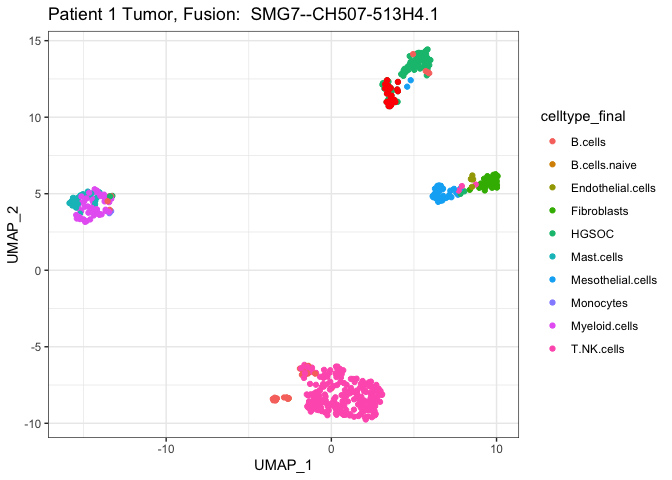<!-- --><!-- --><!-- --><!-- -->

``` r
pdf("Patient1_Tum.fusions_of_interest.pdf")
for (p in plots) {
    plot(p)
}

dev.off()
```

    ## quartz_off_screen 
    ##                 2

``` r
fusion_of_interest_cell_counts = Tum_data %>% filter(FusionName %in%  fusions_of_interest$FusionName) %>% 
        select(FusionName, method, barcodes) %>% unique() %>%
        group_by(FusionName, method) %>% tally(name='cell_counts') 


fusion_of_interest_cell_counts %>% spread(key=method, value=cell_counts) %>% arrange(desc(`ctat-LR-fusion`))
```

    ## # A tibble: 4 × 4
    ## # Groups:   FusionName [4]
    ##   FusionName          `ctat-LR-fusion` FusionInspector `STAR-Fusion`
    ##   <chr>                          <int>           <int>         <int>
    ## 1 SMG7--CH507-513H4.1               26              NA            NA
    ## 2 GS1-279B7.2--GNG4                  5              NA            NA
    ## 3 NTN1--CDRT15P2                     5              NA            NA
    ## 4 RAPGEF5--AGMO                      5               3             1

``` r
fusion_of_interest_cell_counts  %>%
              ggplot(aes(x=FusionName, y=cell_counts, fill=method)) + geom_bar(stat='identity', position='dodge') +
              theme(axis.text.x = element_text(angle = 90, hjust = 1)) +
    ggtitle("Patient1_Tum Fusions of Interest: Cell Counts")
```

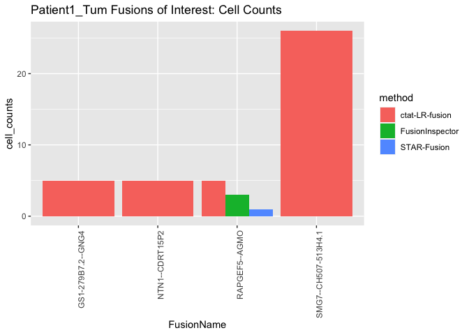<!-- -->

``` r
# breakdown by combinations of methods per cell

tumor_cell_counts_by_methods = Tum_data %>% filter(FusionName %in%  fusions_of_interest$FusionName) %>% 
        select(FusionName, method, barcodes) %>% unique() %>%
        group_by(FusionName, barcodes) %>% 
        arrange(method) %>%
        mutate(methods = paste(method, collapse=',')) %>%
        ungroup() %>%
        select(FusionName, methods, barcodes) %>% unique() %>% group_by(FusionName, methods) %>% tally()


tumor_cell_counts_by_methods 
```

    ## # A tibble: 7 × 3
    ## # Groups:   FusionName [4]
    ##   FusionName          methods                                        n
    ##   <chr>               <chr>                                      <int>
    ## 1 GS1-279B7.2--GNG4   ctat-LR-fusion                                 5
    ## 2 NTN1--CDRT15P2      ctat-LR-fusion                                 5
    ## 3 RAPGEF5--AGMO       FusionInspector                                1
    ## 4 RAPGEF5--AGMO       FusionInspector,STAR-Fusion,ctat-LR-fusion     1
    ## 5 RAPGEF5--AGMO       FusionInspector,ctat-LR-fusion                 1
    ## 6 RAPGEF5--AGMO       ctat-LR-fusion                                 3
    ## 7 SMG7--CH507-513H4.1 ctat-LR-fusion                                26

For RAPGEF5::AGMO, half (3/6) of the cells were detected only by long
reads, and 1/6 exclusively by short reads.

Fusions SMG7::CH507-513H4.1 and NTN1::CDRT15P2 were only detected by
long reads.

``` r
p = baseplot +
        
    geom_point(data=Tum_data %>% filter(FusionName %in% c('SMG7--CH507-513H4.1', 'RAPGEF5--AGMO')) %>% select(FusionName, UMAP_1, UMAP_2) %>% unique(), 
                              aes(shape=FusionName), alpha=0.7) +
         ggtitle("Patient 1")


p
```

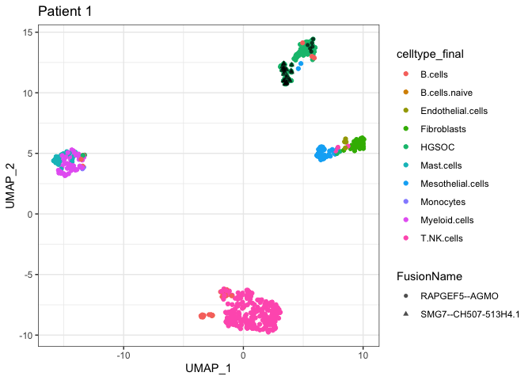<!-- -->

``` r
ggsave(p, file="HGSOC_Patient1_umap.svg", width=7, height=5)
```

``` r
tumor_cell_counts_by_methods  %>% filter(FusionName == "SMG7--CH507-513H4.1")
```

    ## # A tibble: 1 × 3
    ## # Groups:   FusionName [1]
    ##   FusionName          methods            n
    ##   <chr>               <chr>          <int>
    ## 1 SMG7--CH507-513H4.1 ctat-LR-fusion    26

``` r
tumor_cell_counts_by_methods  %>% filter(FusionName == "RAPGEF5--AGMO")
```

    ## # A tibble: 4 × 3
    ## # Groups:   FusionName [1]
    ##   FusionName    methods                                        n
    ##   <chr>         <chr>                                      <int>
    ## 1 RAPGEF5--AGMO FusionInspector                                1
    ## 2 RAPGEF5--AGMO FusionInspector,STAR-Fusion,ctat-LR-fusion     1
    ## 3 RAPGEF5--AGMO FusionInspector,ctat-LR-fusion                 1
    ## 4 RAPGEF5--AGMO ctat-LR-fusion                                 3

``` r
tumor_cell_counts_by_methods  %>% filter(FusionName == "NTN1--CDRT15P2")
```

    ## # A tibble: 1 × 3
    ## # Groups:   FusionName [1]
    ##   FusionName     methods            n
    ##   <chr>          <chr>          <int>
    ## 1 NTN1--CDRT15P2 ctat-LR-fusion     5

``` r
baseplot = Tum_umap_data %>% ggplot(aes(x=UMAP_1, y=UMAP_2)) + theme_bw() + geom_point(aes(color=factor(cluster_id)))


x = 0

#plots = list()

for (fusion in  fusions_of_interest$FusionName) {
    
    p = baseplot + geom_point(data=Tum_data %>% filter(FusionName == fusion) %>% select(UMAP_1, UMAP_2) %>% unique(), 
                              color='red') + 
        ggtitle(paste("Patient 1 Tumor, Fusion: ", fusion) )
    
    plot(p)   
    
    x = x+1
    #plots[[x]] = p
}
```

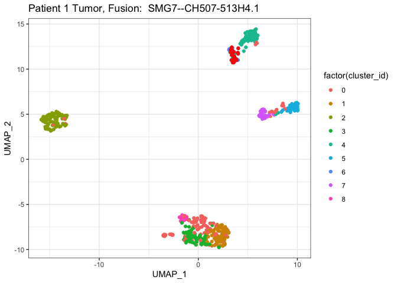<!-- --><!-- -->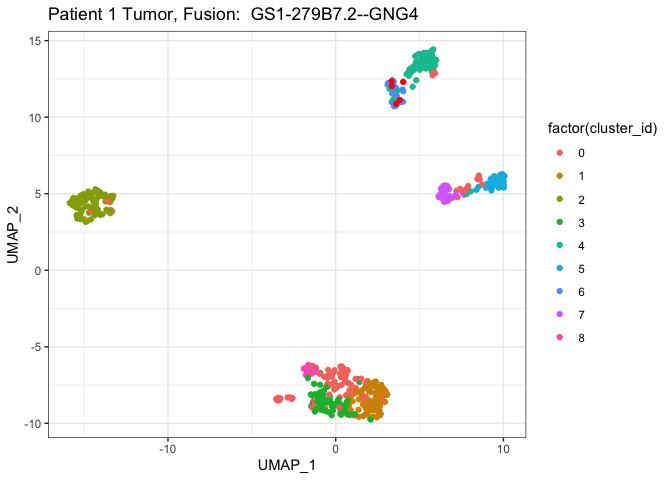<!-- -->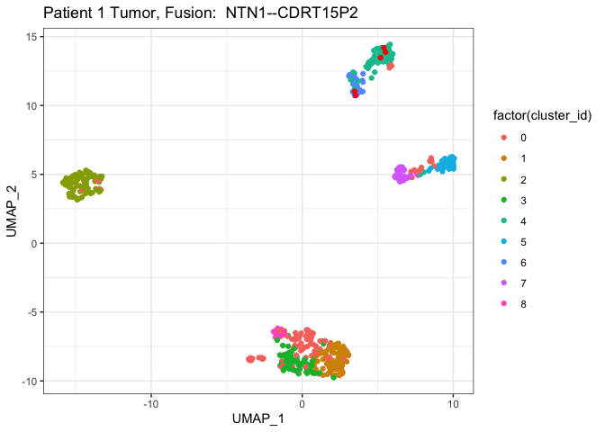<!-- -->

The SMG7 and RAPGEF5–AGMO fusions appear in different tumor subclusters.

The NTN1 fusion is found across both subclusters.

# fusions found in normal cells?

``` r
left_join(Tum_n_Om_joined_fusions %>% filter(`ctat-LR-fusion.Tum` >= MIN_CELLS & `ctat-LR-fusion.Om` > 0),
          fusion_annots) 
```

    ## Joining with `by = join_by(FusionName)`

    ##              FusionName   LeftBreakpoint  RightBreakpoint    celltype_final
    ## 1 RP11-208G20.2--PSPHP1 chr7:152367263:+  chr7:55773181:+ Mesothelial.cells
    ## 2 RP11-208G20.2--PSPHP1 chr7:152367263:+  chr7:55773181:+        T.NK.cells
    ## 3 RP11-208G20.2--PSPHP1 chr7:152367262:+  chr7:55765097:+ Mesothelial.cells
    ## 4   RP11-384F7.2--LSAMP chr3:117997182:- chr3:116444955:- Mesothelial.cells
    ## 5 RP11-208G20.2--PSPHP1 chr7:152367263:+  chr7:55773181:+     Myeloid.cells
    ## 6 RP11-208G20.2--PSPHP1 chr7:152367262:+  chr7:55765097:+     Myeloid.cells
    ## 7     RP1-34H18.1--NAV3 chr12:77572266:+ chr12:77940319:+       Fibroblasts
    ## 8 RP11-208G20.2--PSPHP1 chr7:152367263:+  chr7:55773181:+       Fibroblasts
    ##   Arriba.Tum ctat-LR-fusion.Tum FusionInspector.Tum STAR-Fusion.Tum Arriba.Om
    ## 1         NA                 22                  NA              NA        NA
    ## 2         NA                 17                  NA              NA        NA
    ## 3         NA                 12                  NA              NA        NA
    ## 4         NA                  9                  NA              NA        NA
    ## 5         NA                  8                  NA              NA        NA
    ## 6         NA                  6                  NA              NA        NA
    ## 7         NA                  5                  NA              NA        NA
    ## 8         NA                  5                  NA              NA        NA
    ##   ctat-LR-fusion.Om FusionInspector.Om STAR-Fusion.Om
    ## 1               118                 NA             NA
    ## 2                 8                 NA             NA
    ## 3                34                 NA             NA
    ## 4                30                 NA             NA
    ## 5                 1                 NA             NA
    ## 6                 1                 NA             NA
    ## 7                 2                 NA             NA
    ## 8                17                 NA             NA
    ##                                                                                                                   annots
    ## 1                                                                                                                   <NA>
    ## 2                                                                                                                   <NA>
    ## 3                                                                                                                   <NA>
    ## 4            RP11-384F7.2--LSAMP:INTRACHROMOSOMAL[chr3:0.53Mb];;(recip)LSAMP--RP11-384F7.2:INTRACHROMOSOMAL[chr3:0.53Mb]
    ## 5                                                                                                                   <NA>
    ## 6                                                                                                                   <NA>
    ## 7 RP1-34H18.1--NAV3:[DepMap2023];INTRACHROMOSOMAL[chr12:0.26Mb];;(recip)NAV3--RP1-34H18.1:INTRACHROMOSOMAL[chr12:0.26Mb]
    ## 8                                                                                                                   <NA>

``` r
left_join(Tum_n_Om_joined_fusions %>% filter(`ctat-LR-fusion.Tum` >= MIN_CELLS & `ctat-LR-fusion.Om` > 0),
          fusion_annots)  %>%
    select(FusionName, annots) %>% unique()
```

    ## Joining with `by = join_by(FusionName)`

    ##              FusionName
    ## 1 RP11-208G20.2--PSPHP1
    ## 4   RP11-384F7.2--LSAMP
    ## 7     RP1-34H18.1--NAV3
    ##                                                                                                                   annots
    ## 1                                                                                                                   <NA>
    ## 4            RP11-384F7.2--LSAMP:INTRACHROMOSOMAL[chr3:0.53Mb];;(recip)LSAMP--RP11-384F7.2:INTRACHROMOSOMAL[chr3:0.53Mb]
    ## 7 RP1-34H18.1--NAV3:[DepMap2023];INTRACHROMOSOMAL[chr12:0.26Mb];;(recip)NAV3--RP1-34H18.1:INTRACHROMOSOMAL[chr12:0.26Mb]

``` r
# top celltype count only for each
left_join(Tum_n_Om_joined_fusions %>% filter(`ctat-LR-fusion.Tum` >= MIN_CELLS & `ctat-LR-fusion.Om` > 0),
          fusion_annots,
          by='FusionName')   %>%
    group_by(FusionName) %>% arrange(desc(`ctat-LR-fusion.Tum`)) %>% filter(row_number()==1) %>% ungroup() %>%
    
    select(FusionName, `ctat-LR-fusion.Tum`, celltype_final, annots) %>% unique()
```

    ## # A tibble: 3 × 4
    ##   FusionName            `ctat-LR-fusion.Tum` celltype_final    annots           
    ##   <chr>                                <int> <chr>             <chr>            
    ## 1 RP11-208G20.2--PSPHP1                   22 Mesothelial.cells <NA>             
    ## 2 RP11-384F7.2--LSAMP                      9 Mesothelial.cells RP11-384F7.2--LS…
    ## 3 RP1-34H18.1--NAV3                        5 Fibroblasts       RP1-34H18.1--NAV…

``` r
report_on_fusion = function(fusion_name) {
    
    print(left_join(Tum_n_Om_joined_fusions %>% filter(FusionName == fusion_name),
              fusion_annots, by='FusionName') )
    
    print(Om_cell_counts %>% filter(FusionName == fusion_name) %>% mutate(type="Om"))
    
    print(Om_fusion_frac_cell_types %>% filter(FusionName == fusion_name) %>% mutate(type="Om"))
    
    print(Tum_cell_counts %>% filter(FusionName == fusion_name) %>% mutate(type="Tum"))
    
    print(Tum_fusion_frac_cell_types %>% filter(FusionName == fusion_name) %>% mutate(type="Tum"))
    
}
```

## GS1-279B7.2–GNG4

``` r
report_on_fusion("GS1-279B7.2--GNG4")
```

    ##          FusionName   LeftBreakpoint  RightBreakpoint celltype_final Arriba.Tum
    ## 1 GS1-279B7.2--GNG4 chr1:185318277:+ chr1:235583848:-          HGSOC         NA
    ##   ctat-LR-fusion.Tum FusionInspector.Tum STAR-Fusion.Tum Arriba.Om
    ## 1                  5                  NA              NA        NA
    ##   ctat-LR-fusion.Om FusionInspector.Om STAR-Fusion.Om
    ## 1                NA                 NA             NA
    ##                                                                                                      annots
    ## 1 GS1-279B7.2--GNG4:INTRACHROMOSOMAL[chr1:50.23Mb];;(recip)GNG4--GS1-279B7.2:INTRACHROMOSOMAL[chr1:50.23Mb]
    ## # A tibble: 0 × 4
    ## # ℹ 4 variables: FusionName <chr>, tot_cells_w_fusion <int>,
    ## #   frac_tot_cells <dbl>, type <chr>
    ## # A tibble: 0 × 5
    ## # Groups:   FusionName [0]
    ## # ℹ 5 variables: FusionName <chr>, celltype_final <chr>,
    ## #   tot_cells_w_fusion <int>, frac_fusion_cells <dbl>, type <chr>
    ## # A tibble: 1 × 4
    ##   FusionName        tot_cells_w_fusion frac_tot_cells type 
    ##   <chr>                          <int>          <dbl> <chr>
    ## 1 GS1-279B7.2--GNG4                  5         0.0101 Tum  
    ## # A tibble: 1 × 5
    ## # Groups:   FusionName [1]
    ##   FusionName        celltype_final tot_cells_w_fusion frac_fusion_cells type 
    ##   <chr>             <chr>                       <int>             <dbl> <chr>
    ## 1 GS1-279B7.2--GNG4 HGSOC                           5                 1 Tum

``` r
# GS1-279B7.2--GNG4 INTRACHROMOSOMAL[chr1:50.23Mb]
```

## RP11-208G20.2–PSPHP1

``` r
report_on_fusion("RP11-208G20.2--PSPHP1")
```

    ##               FusionName   LeftBreakpoint RightBreakpoint    celltype_final
    ## 1  RP11-208G20.2--PSPHP1 chr7:152367263:+ chr7:55773181:+             HGSOC
    ## 2  RP11-208G20.2--PSPHP1 chr7:152367262:+ chr7:55765097:+             HGSOC
    ## 3  RP11-208G20.2--PSPHP1 chr7:152367263:+ chr7:55773181:+ Mesothelial.cells
    ## 4  RP11-208G20.2--PSPHP1 chr7:152367263:+ chr7:55773181:+        T.NK.cells
    ## 5  RP11-208G20.2--PSPHP1 chr7:152367262:+ chr7:55765097:+ Mesothelial.cells
    ## 6  RP11-208G20.2--PSPHP1 chr7:152367263:+ chr7:55773181:+           B.cells
    ## 7  RP11-208G20.2--PSPHP1 chr7:152367263:+ chr7:55773181:+     Myeloid.cells
    ## 8  RP11-208G20.2--PSPHP1 chr7:152367262:+ chr7:55765097:+     Myeloid.cells
    ## 9  RP11-208G20.2--PSPHP1 chr7:152367263:+ chr7:55773181:+       Fibroblasts
    ## 10 RP11-208G20.2--PSPHP1 chr7:152367263:+ chr7:55773181:+        Mast.cells
    ## 11 RP11-208G20.2--PSPHP1 chr7:152367262:+ chr7:55765097:+        T.NK.cells
    ## 12 RP11-208G20.2--PSPHP1 chr7:152367262:+ chr7:55765097:+           B.cells
    ## 13 RP11-208G20.2--PSPHP1 chr7:152367262:+ chr7:55765097:+       Fibroblasts
    ## 14 RP11-208G20.2--PSPHP1 chr7:152367263:+ chr7:55773181:+ Endothelial.cells
    ## 15 RP11-208G20.2--PSPHP1 chr7:152367263:+ chr7:55773181:+         Monocytes
    ## 16 RP11-208G20.2--PSPHP1 chr7:152367262:+ chr7:55765097:+ Endothelial.cells
    ##    Arriba.Tum ctat-LR-fusion.Tum FusionInspector.Tum STAR-Fusion.Tum Arriba.Om
    ## 1          NA                 46                  NA              NA        NA
    ## 2          NA                 40                  NA              NA        NA
    ## 3          NA                 22                  NA              NA        NA
    ## 4          NA                 17                  NA              NA        NA
    ## 5          NA                 12                  NA              NA        NA
    ## 6          NA                  8                  NA              NA        NA
    ## 7          NA                  8                  NA              NA        NA
    ## 8          NA                  6                  NA              NA        NA
    ## 9          NA                  5                  NA              NA        NA
    ## 10         NA                  4                  NA              NA        NA
    ## 11         NA                  3                  NA              NA        NA
    ## 12         NA                  2                  NA              NA        NA
    ## 13         NA                  2                  NA              NA        NA
    ## 14         NA                  2                  NA              NA        NA
    ## 15         NA                  1                  NA              NA        NA
    ## 16         NA                 NA                  NA              NA        NA
    ##    ctat-LR-fusion.Om FusionInspector.Om STAR-Fusion.Om annots
    ## 1                 NA                 NA             NA   <NA>
    ## 2                 NA                 NA             NA   <NA>
    ## 3                118                 NA             NA   <NA>
    ## 4                  8                 NA             NA   <NA>
    ## 5                 34                 NA             NA   <NA>
    ## 6                 NA                 NA             NA   <NA>
    ## 7                  1                 NA             NA   <NA>
    ## 8                  1                 NA             NA   <NA>
    ## 9                 17                 NA             NA   <NA>
    ## 10                NA                 NA             NA   <NA>
    ## 11                 2                 NA             NA   <NA>
    ## 12                NA                 NA             NA   <NA>
    ## 13                 7                 NA             NA   <NA>
    ## 14                NA                 NA             NA   <NA>
    ## 15                NA                 NA             NA   <NA>
    ## 16                 1                 NA             NA   <NA>
    ## # A tibble: 1 × 4
    ##   FusionName            tot_cells_w_fusion frac_tot_cells type 
    ##   <chr>                              <int>          <dbl> <chr>
    ## 1 RP11-208G20.2--PSPHP1                169          0.285 Om   
    ## # A tibble: 5 × 5
    ## # Groups:   FusionName [1]
    ##   FusionName           celltype_final tot_cells_w_fusion frac_fusion_cells type 
    ##   <chr>                <chr>                       <int>             <dbl> <chr>
    ## 1 RP11-208G20.2--PSPH… Mesothelial.c…                133           0.787   Om   
    ## 2 RP11-208G20.2--PSPH… Fibroblasts                    23           0.136   Om   
    ## 3 RP11-208G20.2--PSPH… T.NK.cells                     10           0.0592  Om   
    ## 4 RP11-208G20.2--PSPH… Myeloid.cells                   2           0.0118  Om   
    ## 5 RP11-208G20.2--PSPH… Endothelial.c…                  1           0.00592 Om   
    ## # A tibble: 1 × 4
    ##   FusionName            tot_cells_w_fusion frac_tot_cells type 
    ##   <chr>                              <int>          <dbl> <chr>
    ## 1 RP11-208G20.2--PSPHP1                138          0.278 Tum  
    ## # A tibble: 9 × 5
    ## # Groups:   FusionName [1]
    ##   FusionName           celltype_final tot_cells_w_fusion frac_fusion_cells type 
    ##   <chr>                <chr>                       <int>             <dbl> <chr>
    ## 1 RP11-208G20.2--PSPH… HGSOC                          59           0.428   Tum  
    ## 2 RP11-208G20.2--PSPH… Mesothelial.c…                 24           0.174   Tum  
    ## 3 RP11-208G20.2--PSPH… T.NK.cells                     20           0.145   Tum  
    ## 4 RP11-208G20.2--PSPH… Myeloid.cells                  12           0.0870  Tum  
    ## 5 RP11-208G20.2--PSPH… B.cells                         9           0.0652  Tum  
    ## 6 RP11-208G20.2--PSPH… Fibroblasts                     7           0.0507  Tum  
    ## 7 RP11-208G20.2--PSPH… Mast.cells                      4           0.0290  Tum  
    ## 8 RP11-208G20.2--PSPH… Endothelial.c…                  2           0.0145  Tum  
    ## 9 RP11-208G20.2--PSPH… Monocytes                       1           0.00725 Tum

## RP11-384F7.2–LSAMP

``` r
report_on_fusion("RP11-384F7.2--LSAMP")
```

    ##            FusionName   LeftBreakpoint  RightBreakpoint    celltype_final
    ## 1 RP11-384F7.2--LSAMP chr3:117997182:- chr3:116444955:-             HGSOC
    ## 2 RP11-384F7.2--LSAMP chr3:117997182:- chr3:116444955:- Mesothelial.cells
    ## 3 RP11-384F7.2--LSAMP chr3:117997182:- chr3:116086556:-             HGSOC
    ## 4 RP11-384F7.2--LSAMP chr3:117997182:- chr3:116445023:-             HGSOC
    ## 5 RP11-384F7.2--LSAMP chr3:117997182:- chr3:116444955:-       Fibroblasts
    ##   Arriba.Tum ctat-LR-fusion.Tum FusionInspector.Tum STAR-Fusion.Tum Arriba.Om
    ## 1         NA                 10                  NA              NA        NA
    ## 2         NA                  9                  NA              NA        NA
    ## 3         NA                  2                  NA              NA        NA
    ## 4         NA                  1                  NA              NA        NA
    ## 5         NA                 NA                  NA              NA        NA
    ##   ctat-LR-fusion.Om FusionInspector.Om STAR-Fusion.Om
    ## 1                NA                 NA             NA
    ## 2                30                 NA             NA
    ## 3                NA                 NA             NA
    ## 4                NA                 NA             NA
    ## 5                 4                 NA             NA
    ##                                                                                                        annots
    ## 1 RP11-384F7.2--LSAMP:INTRACHROMOSOMAL[chr3:0.53Mb];;(recip)LSAMP--RP11-384F7.2:INTRACHROMOSOMAL[chr3:0.53Mb]
    ## 2 RP11-384F7.2--LSAMP:INTRACHROMOSOMAL[chr3:0.53Mb];;(recip)LSAMP--RP11-384F7.2:INTRACHROMOSOMAL[chr3:0.53Mb]
    ## 3 RP11-384F7.2--LSAMP:INTRACHROMOSOMAL[chr3:0.53Mb];;(recip)LSAMP--RP11-384F7.2:INTRACHROMOSOMAL[chr3:0.53Mb]
    ## 4 RP11-384F7.2--LSAMP:INTRACHROMOSOMAL[chr3:0.53Mb];;(recip)LSAMP--RP11-384F7.2:INTRACHROMOSOMAL[chr3:0.53Mb]
    ## 5 RP11-384F7.2--LSAMP:INTRACHROMOSOMAL[chr3:0.53Mb];;(recip)LSAMP--RP11-384F7.2:INTRACHROMOSOMAL[chr3:0.53Mb]
    ## # A tibble: 1 × 4
    ##   FusionName          tot_cells_w_fusion frac_tot_cells type 
    ##   <chr>                            <int>          <dbl> <chr>
    ## 1 RP11-384F7.2--LSAMP                 34         0.0572 Om   
    ## # A tibble: 2 × 5
    ## # Groups:   FusionName [1]
    ##   FusionName          celltype_final  tot_cells_w_fusion frac_fusion_cells type 
    ##   <chr>               <chr>                        <int>             <dbl> <chr>
    ## 1 RP11-384F7.2--LSAMP Mesothelial.ce…                 30             0.882 Om   
    ## 2 RP11-384F7.2--LSAMP Fibroblasts                      4             0.118 Om   
    ## # A tibble: 1 × 4
    ##   FusionName          tot_cells_w_fusion frac_tot_cells type 
    ##   <chr>                            <int>          <dbl> <chr>
    ## 1 RP11-384F7.2--LSAMP                 20         0.0402 Tum  
    ## # A tibble: 2 × 5
    ## # Groups:   FusionName [1]
    ##   FusionName          celltype_final  tot_cells_w_fusion frac_fusion_cells type 
    ##   <chr>               <chr>                        <int>             <dbl> <chr>
    ## 1 RP11-384F7.2--LSAMP HGSOC                           11              0.55 Tum  
    ## 2 RP11-384F7.2--LSAMP Mesothelial.ce…                  9              0.45 Tum

## RP1-34H18.1–NAV3

``` r
report_on_fusion("RP1-34H18.1--NAV3")
```

    ##          FusionName   LeftBreakpoint  RightBreakpoint    celltype_final
    ## 1 RP1-34H18.1--NAV3 chr12:77572266:+ chr12:77940319:+       Fibroblasts
    ## 2 RP1-34H18.1--NAV3 chr12:77572266:+ chr12:77940319:+ Mesothelial.cells
    ##   Arriba.Tum ctat-LR-fusion.Tum FusionInspector.Tum STAR-Fusion.Tum Arriba.Om
    ## 1         NA                  5                  NA              NA        NA
    ## 2         NA                  2                  NA              NA        NA
    ##   ctat-LR-fusion.Om FusionInspector.Om STAR-Fusion.Om
    ## 1                 2                 NA             NA
    ## 2                 5                 NA             NA
    ##                                                                                                                   annots
    ## 1 RP1-34H18.1--NAV3:[DepMap2023];INTRACHROMOSOMAL[chr12:0.26Mb];;(recip)NAV3--RP1-34H18.1:INTRACHROMOSOMAL[chr12:0.26Mb]
    ## 2 RP1-34H18.1--NAV3:[DepMap2023];INTRACHROMOSOMAL[chr12:0.26Mb];;(recip)NAV3--RP1-34H18.1:INTRACHROMOSOMAL[chr12:0.26Mb]
    ## # A tibble: 1 × 4
    ##   FusionName        tot_cells_w_fusion frac_tot_cells type 
    ##   <chr>                          <int>          <dbl> <chr>
    ## 1 RP1-34H18.1--NAV3                  7         0.0118 Om   
    ## # A tibble: 2 × 5
    ## # Groups:   FusionName [1]
    ##   FusionName        celltype_final    tot_cells_w_fusion frac_fusion_cells type 
    ##   <chr>             <chr>                          <int>             <dbl> <chr>
    ## 1 RP1-34H18.1--NAV3 Mesothelial.cells                  5             0.714 Om   
    ## 2 RP1-34H18.1--NAV3 Fibroblasts                        2             0.286 Om   
    ## # A tibble: 1 × 4
    ##   FusionName        tot_cells_w_fusion frac_tot_cells type 
    ##   <chr>                          <int>          <dbl> <chr>
    ## 1 RP1-34H18.1--NAV3                  7         0.0141 Tum  
    ## # A tibble: 2 × 5
    ## # Groups:   FusionName [1]
    ##   FusionName        celltype_final    tot_cells_w_fusion frac_fusion_cells type 
    ##   <chr>             <chr>                          <int>             <dbl> <chr>
    ## 1 RP1-34H18.1--NAV3 Fibroblasts                        5             0.714 Tum  
    ## 2 RP1-34H18.1--NAV3 Mesothelial.cells                  2             0.286 Tum

# normal fusions in the matched Om sample?

``` r
# Om normal sample fusions

left_join(Om_fusion_frac_cell_types %>% filter(tot_cells_w_fusion >= MIN_CELLS) %>% arrange(FusionName, desc(tot_cells_w_fusion)) %>%
    group_by(FusionName) %>% arrange(desc(tot_cells_w_fusion)) %>% filter(row_number()==1) %>% ungroup(),
    fusion_annots,
    by='FusionName')
```

    ## # A tibble: 9 × 5
    ##   FusionName          celltype_final tot_cells_w_fusion frac_fusion_cells annots
    ##   <chr>               <chr>                       <int>             <dbl> <chr> 
    ## 1 RP11-208G20.2--PSP… Mesothelial.c…                133             0.787 <NA>  
    ## 2 RP11-384F7.2--LSAMP Mesothelial.c…                 30             0.882 RP11-…
    ## 3 UPK3B--CH17-264B6.4 Mesothelial.c…                 10             1     <NA>  
    ## 4 YAF2--RYBP          Mesothelial.c…                  9             0.643 <NA>  
    ## 5 RP11-96H19.1--RP11… Mesothelial.c…                  8             1     RP11-…
    ## 6 SAMD5--RP11-307P5.1 Mesothelial.c…                  8             1     <NA>  
    ## 7 RP11-444D3.1--SOX5  Fibroblasts                     6             0.75  RP11-…
    ## 8 RP1-34H18.1--NAV3   Mesothelial.c…                  5             0.714 RP1-3…
    ## 9 YWHAE--CRK          Mesothelial.c…                  5             1     YWHAE…

YWHAE–CRK is interesting as found before among different tumor data sets
and involves a pair of known oncogenes.

``` r
report_on_fusion("YWHAE--CRK")
```

    ##   FusionName  LeftBreakpoint RightBreakpoint    celltype_final Arriba.Tum
    ## 1 YWHAE--CRK chr17:1400047:- chr17:1437155:-             HGSOC         NA
    ## 2 YWHAE--CRK chr17:1400047:- chr17:1437155:- Mesothelial.cells         NA
    ##   ctat-LR-fusion.Tum FusionInspector.Tum STAR-Fusion.Tum Arriba.Om
    ## 1                  1                  NA              NA        NA
    ## 2                 NA                  NA              NA        NA
    ##   ctat-LR-fusion.Om FusionInspector.Om STAR-Fusion.Om
    ## 1                NA                 NA             NA
    ## 2                 5                 NA             NA
    ##                                                                                                                                                                                                                                                 annots
    ## 1 YWHAE--CRK:[YWHAE:Oncogene];[CRK:Oncogene];[DEEPEST2019];INTRACHROMOSOMAL[chr17:0.02Mb];LOCAL_REARRANGEMENT:-:[20311];;(recip)CRK--YWHAE:[CRK:Oncogene];[YWHAE:Oncogene];[DepMap2023,CCLE_StarF2019];INTRACHROMOSOMAL[chr17:0.02Mb];NEIGHBORS[20311]
    ## 2 YWHAE--CRK:[YWHAE:Oncogene];[CRK:Oncogene];[DEEPEST2019];INTRACHROMOSOMAL[chr17:0.02Mb];LOCAL_REARRANGEMENT:-:[20311];;(recip)CRK--YWHAE:[CRK:Oncogene];[YWHAE:Oncogene];[DepMap2023,CCLE_StarF2019];INTRACHROMOSOMAL[chr17:0.02Mb];NEIGHBORS[20311]
    ## # A tibble: 1 × 4
    ##   FusionName tot_cells_w_fusion frac_tot_cells type 
    ##   <chr>                   <int>          <dbl> <chr>
    ## 1 YWHAE--CRK                  5        0.00842 Om   
    ## # A tibble: 1 × 5
    ## # Groups:   FusionName [1]
    ##   FusionName celltype_final    tot_cells_w_fusion frac_fusion_cells type 
    ##   <chr>      <chr>                          <int>             <dbl> <chr>
    ## 1 YWHAE--CRK Mesothelial.cells                  5                 1 Om   
    ## # A tibble: 1 × 4
    ##   FusionName tot_cells_w_fusion frac_tot_cells type 
    ##   <chr>                   <int>          <dbl> <chr>
    ## 1 YWHAE--CRK                  1        0.00201 Tum  
    ## # A tibble: 1 × 5
    ## # Groups:   FusionName [1]
    ##   FusionName celltype_final tot_cells_w_fusion frac_fusion_cells type 
    ##   <chr>      <chr>                       <int>             <dbl> <chr>
    ## 1 YWHAE--CRK HGSOC                           1                 1 Tum

``` r
# found in 5 Om cells and 1 Tum cell.
```

## RP11-444D3.1–SOX5

``` r
report_on_fusion("RP11-444D3.1--SOX5")
```

    ##           FusionName   LeftBreakpoint  RightBreakpoint    celltype_final
    ## 1 RP11-444D3.1--SOX5 chr12:24213343:- chr12:23896024:-             HGSOC
    ## 2 RP11-444D3.1--SOX5 chr12:24213343:- chr12:23896024:-       Fibroblasts
    ## 3 RP11-444D3.1--SOX5 chr12:24213343:- chr12:23896024:-           B.cells
    ## 4 RP11-444D3.1--SOX5 chr12:24213343:- chr12:23896024:- Mesothelial.cells
    ## 5 RP11-444D3.1--SOX5 chr12:24213343:- chr12:23896024:-         uncertain
    ## 6 RP11-444D3.1--SOX5 chr12:24277216:- chr12:23896024:-       Fibroblasts
    ## 7 RP11-444D3.1--SOX5 chr12:24368563:- chr12:23846193:-       Fibroblasts
    ##   Arriba.Tum ctat-LR-fusion.Tum FusionInspector.Tum STAR-Fusion.Tum Arriba.Om
    ## 1         NA                  7                  NA              NA        NA
    ## 2         NA                  2                  NA              NA        NA
    ## 3         NA                  1                  NA              NA        NA
    ## 4         NA                  1                  NA              NA        NA
    ## 5         NA                  1                  NA              NA        NA
    ## 6         NA                 NA                  NA              NA        NA
    ## 7         NA                 NA                  NA              NA        NA
    ##   ctat-LR-fusion.Om FusionInspector.Om STAR-Fusion.Om
    ## 1                NA                 NA             NA
    ## 2                 2                 NA             NA
    ## 3                NA                 NA             NA
    ## 4                 2                 NA             NA
    ## 5                NA                 NA             NA
    ## 6                 3                 NA             NA
    ## 7                 1                 NA             NA
    ##                                                                                                                                                     annots
    ## 1 RP11-444D3.1--SOX5:[SOX5:Oncogene];[DepMap2023];INTRACHROMOSOMAL[chr12:0.26Mb];;(recip)SOX5--RP11-444D3.1:[SOX5:Oncogene];INTRACHROMOSOMAL[chr12:0.26Mb]
    ## 2 RP11-444D3.1--SOX5:[SOX5:Oncogene];[DepMap2023];INTRACHROMOSOMAL[chr12:0.26Mb];;(recip)SOX5--RP11-444D3.1:[SOX5:Oncogene];INTRACHROMOSOMAL[chr12:0.26Mb]
    ## 3 RP11-444D3.1--SOX5:[SOX5:Oncogene];[DepMap2023];INTRACHROMOSOMAL[chr12:0.26Mb];;(recip)SOX5--RP11-444D3.1:[SOX5:Oncogene];INTRACHROMOSOMAL[chr12:0.26Mb]
    ## 4 RP11-444D3.1--SOX5:[SOX5:Oncogene];[DepMap2023];INTRACHROMOSOMAL[chr12:0.26Mb];;(recip)SOX5--RP11-444D3.1:[SOX5:Oncogene];INTRACHROMOSOMAL[chr12:0.26Mb]
    ## 5 RP11-444D3.1--SOX5:[SOX5:Oncogene];[DepMap2023];INTRACHROMOSOMAL[chr12:0.26Mb];;(recip)SOX5--RP11-444D3.1:[SOX5:Oncogene];INTRACHROMOSOMAL[chr12:0.26Mb]
    ## 6 RP11-444D3.1--SOX5:[SOX5:Oncogene];[DepMap2023];INTRACHROMOSOMAL[chr12:0.26Mb];;(recip)SOX5--RP11-444D3.1:[SOX5:Oncogene];INTRACHROMOSOMAL[chr12:0.26Mb]
    ## 7 RP11-444D3.1--SOX5:[SOX5:Oncogene];[DepMap2023];INTRACHROMOSOMAL[chr12:0.26Mb];;(recip)SOX5--RP11-444D3.1:[SOX5:Oncogene];INTRACHROMOSOMAL[chr12:0.26Mb]
    ## # A tibble: 1 × 4
    ##   FusionName         tot_cells_w_fusion frac_tot_cells type 
    ##   <chr>                           <int>          <dbl> <chr>
    ## 1 RP11-444D3.1--SOX5                  8         0.0135 Om   
    ## # A tibble: 2 × 5
    ## # Groups:   FusionName [1]
    ##   FusionName         celltype_final   tot_cells_w_fusion frac_fusion_cells type 
    ##   <chr>              <chr>                         <int>             <dbl> <chr>
    ## 1 RP11-444D3.1--SOX5 Fibroblasts                       6              0.75 Om   
    ## 2 RP11-444D3.1--SOX5 Mesothelial.cel…                  2              0.25 Om   
    ## # A tibble: 1 × 4
    ##   FusionName         tot_cells_w_fusion frac_tot_cells type 
    ##   <chr>                           <int>          <dbl> <chr>
    ## 1 RP11-444D3.1--SOX5                 11         0.0221 Tum  
    ## # A tibble: 4 × 5
    ## # Groups:   FusionName [1]
    ##   FusionName         celltype_final   tot_cells_w_fusion frac_fusion_cells type 
    ##   <chr>              <chr>                         <int>             <dbl> <chr>
    ## 1 RP11-444D3.1--SOX5 HGSOC                             7            0.636  Tum  
    ## 2 RP11-444D3.1--SOX5 Fibroblasts                       2            0.182  Tum  
    ## 3 RP11-444D3.1--SOX5 B.cells                           1            0.0909 Tum  
    ## 4 RP11-444D3.1--SOX5 Mesothelial.cel…                  1            0.0909 Tum

# Tumor heterogeneity explored

``` r
tumor_umap = read.table("data/Patient1_Tum_only/Patient1_Tum_Cancer_only.csv", header=T, sep=",") %>%
    rename(barcodes=X)

tumor_umap %>% head()
```

    ##           barcodes    UMAP_1     UMAP_2 seurat_clusters
    ## 1 AAACCCATCTATCGGA -3.442050  0.6151850               1
    ## 2 AAACGCTAGGAGGTTC -3.058180  0.2626778               1
    ## 3 AAAGTGATCCAACTGA  3.485466 -0.6378570               0
    ## 4 AACCCAATCGACTCCT -0.136903 -2.3959574               0
    ## 5 AATAGAGTCTGAACGT  2.998702  0.1273344               0
    ## 6 ACGTAACCATTGGCAT -2.252501  0.2677264               1

``` r
tumor_umap = left_join(tumor_umap, 
                       Tum_data, 
                       by='barcodes', 
                       suffix=c('.tum_only', '.allcells'))

tumor_umap %>% head()
```

    ##           barcodes UMAP_1.tum_only UMAP_2.tum_only seurat_clusters
    ## 1 AAACCCATCTATCGGA        -3.44205       0.6151850               1
    ## 2 AAACGCTAGGAGGTTC        -3.05818       0.2626778               1
    ## 3 AAACGCTAGGAGGTTC        -3.05818       0.2626778               1
    ## 4 AAACGCTAGGAGGTTC        -3.05818       0.2626778               1
    ## 5 AAACGCTAGGAGGTTC        -3.05818       0.2626778               1
    ## 6 AAACGCTAGGAGGTTC        -3.05818       0.2626778               1
    ##     LeftBreakpoint  RightBreakpoint     cell_barcode          umi
    ## 1             <NA>             <NA>             <NA>         <NA>
    ## 2  chr17:2030230:+  chr17:3037530:+ GAACCTCCTAGCGTTT AAGCACGGTGCG
    ## 3 chr11:65121500:- chrX:111930935:+ GAACCTCCTAGCGTTT GTAGTTGTTTGT
    ## 4 chr11:65121500:- chrX:111930935:+ GAACCTCCTAGCGTTT ATTTACAAAACT
    ## 5 chr7:152367263:+  chr7:55773181:+ GAACCTCCTAGCGTTT GGCTAAGGAACC
    ## 6 chr1:183472649:+  chr21:8222961:+ GAACCTCCTAGCGTTT TACAATTGAATT
    ##                                    read_name          method
    ## 1                                       <NA>            <NA>
    ## 2          m64141e_210223_151117/4334036/ccs  ctat-LR-fusion
    ## 3 NS500318:931:HGT2FBGXG:1:21105:10409:11922 FusionInspector
    ## 4  NS500318:931:HGT2FBGXG:2:23102:21681:6693 FusionInspector
    ## 5         m64141e_210224_212020/10373270/ccs  ctat-LR-fusion
    ## 6          m64141e_210205_142336/6880956/ccs  ctat-LR-fusion
    ##         orig_FusionName lex_sorted_FusionName            FusionName
    ## 1                  <NA>                  <NA>                  <NA>
    ## 2        DPH1--RAP1GAP2        DPH1--RAP1GAP2        DPH1--RAP1GAP2
    ## 3      FAU--RP1-269O5.3      FAU--RP1-269O5.3      FAU--RP1-269O5.3
    ## 4      FAU--RP1-269O5.3      FAU--RP1-269O5.3      FAU--RP1-269O5.3
    ## 5 RP11-208G20.2--PSPHP1 PSPHP1--RP11-208G20.2 RP11-208G20.2--PSPHP1
    ## 6   SMG7--CH507-513H4.1   CH507-513H4.1--SMG7   SMG7--CH507-513H4.1
    ##   celltype_final UMAP_1.allcells UMAP_2.allcells      dataset
    ## 1           <NA>              NA              NA         <NA>
    ## 2          HGSOC        3.564836        10.72496 Patient1_Tum
    ## 3          HGSOC        3.564836        10.72496 Patient1_Tum
    ## 4          HGSOC        3.564836        10.72496 Patient1_Tum
    ## 5          HGSOC        3.564836        10.72496 Patient1_Tum
    ## 6          HGSOC        3.564836        10.72496 Patient1_Tum

``` r
tumor_umap %>% select(barcodes, UMAP_1.allcells, UMAP_2.allcells) %>% unique() %>% 
    ggplot(aes(x=UMAP_1.allcells, y=UMAP_2.allcells)) + theme_bw() +
    geom_point() + ggtitle("UMAP for tumor subset in all-cells umap")
```

    ## Warning: Removed 6 rows containing missing values (`geom_point()`).

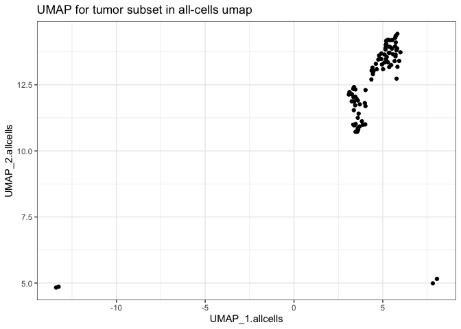<!-- -->

``` r
 tumor_umap %>% select(barcodes, UMAP_1.tum_only, UMAP_2.tum_only, seurat_clusters) %>% unique() %>% 
    ggplot(aes(x=UMAP_1.tum_only, y=UMAP_2.tum_only, shape=as.factor(seurat_clusters))) + theme_bw() +
    geom_point(size=rel(2)) + ggtitle("UMAP for tumor subset in tum-only umap")
```

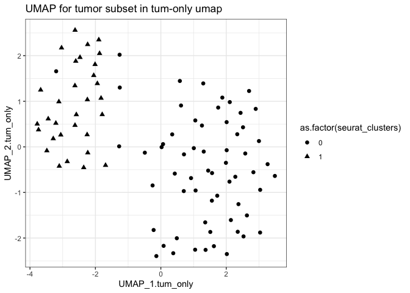<!-- -->

``` r
tum_only_umap_baseplot = tumor_umap %>% select(barcodes, UMAP_1.tum_only, UMAP_2.tum_only, seurat_clusters) %>% unique() %>% 
    ggplot(aes(x=UMAP_1.tum_only, y=UMAP_2.tum_only)) + #, shape=as.factor(seurat_clusters))) +
    theme_bw() +
    geom_point(size=rel(2)) + ggtitle("UMAP for tumor subset in tum-only umap")


tum_only_umap_baseplot
```

<!-- -->

``` r
tumor_cells_only_fig = tum_only_umap_baseplot + 
    geom_jitter(data=tumor_umap %>% 
                   filter(FusionName %in% c('SMG7--CH507-513H4.1', 'RAPGEF5--AGMO', 
                                            'NTN1--CDRT15P2', 'GS1-279B7.2--GNG4')) %>% 
                    mutate(FusionName = factor(FusionName, levels=c('SMG7--CH507-513H4.1', 
                                                                    'RAPGEF5--AGMO', 
                                                                    'NTN1--CDRT15P2', 
                                                                    'GS1-279B7.2--GNG4'))) %>%
                   select(FusionName, UMAP_1.tum_only, UMAP_2.tum_only, seurat_clusters) %>% unique(), 
                              aes(color=FusionName, shape=FusionName), size=rel(5), alpha=0.7) +
         ggtitle("Patient 1 Tumor Cells Only")

tumor_cells_only_fig
```

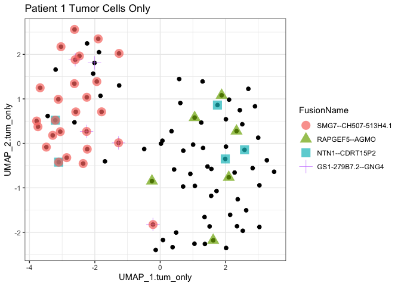<!-- -->

``` r
ggsave(tumor_cells_only_fig, file="scHGSOC_Patient1_tumor_cells_only_fig.svg", width=7, height=5)
```

# examine expression of parent genes involved in fusions of interest

``` r
gene_expr_data = read.csv("data/P1_Tum.fusion_parent_gene_exprs.Illumina10x.matrix", header=T, row.names=1, sep="\t")

gene_expr_data[gene_expr_data == 0] = NA

gene_names = rownames(gene_expr_data)
barcodes = colnames(gene_expr_data)

gene_expr_data = t(gene_expr_data)

gene_expr_data = tibble(data.frame(gene_expr_data))

gene_expr_data$barcode = barcodes

head(gene_expr_data)
```

    ## # A tibble: 6 × 8
    ##   ENSG00000116698.SMG7 ENSG00000278996.FP671120.4 ENSG00000136237.RAPGEF5
    ##                  <dbl>                      <dbl>                   <dbl>
    ## 1               NA                             NA                      NA
    ## 2                1.05                          NA                      NA
    ## 3                0.876                         NA                      NA
    ## 4                0.720                         NA                      NA
    ## 5               NA                             NA                      NA
    ## 6                1.17                          NA                      NA
    ## # ℹ 5 more variables: ENSG00000187546.AGMO <dbl>, ENSG00000065320.NTN1 <dbl>,
    ## #   ENSG00000273004.AL078644.2 <dbl>, ENSG00000168243.GNG4 <dbl>, barcode <chr>

``` r
tumor_umap_w_expr = left_join(tumor_umap, gene_expr_data, by=c('barcodes'='barcode'))
```

## explore fusion ‘SMG7–CH507-513H4.1’

``` r
tumor_umap_w_expr %>% ggplot(aes(x=UMAP_1.allcells, y=UMAP_2.allcells)) + theme_bw() + 
    geom_point(aes(color=ENSG00000116698.SMG7))  +
    
    geom_point(data=tumor_umap_w_expr %>% 
                   filter(FusionName == 'SMG7--CH507-513H4.1'), 
                aes(shape=FusionName, color=ENSG00000116698.SMG7), size=rel(5)) 
```

    ## Warning: Removed 6 rows containing missing values (`geom_point()`).

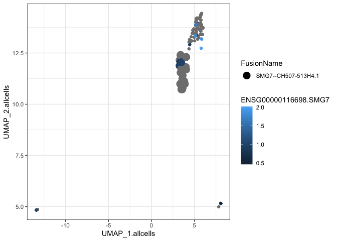<!-- -->

``` r
SMG7_expr_and_fusion_plot = tumor_umap_w_expr %>% ggplot(aes(x=UMAP_1.tum_only, y=UMAP_2.tum_only)) + theme_bw() + 
    geom_point(aes(color=ENSG00000116698.SMG7))  +
    
    geom_point(data=tumor_umap_w_expr %>% 
                   filter(FusionName == 'SMG7--CH507-513H4.1'), 
                aes(shape=FusionName, color=ENSG00000116698.SMG7), size=rel(5)) 

SMG7_expr_and_fusion_plot
```

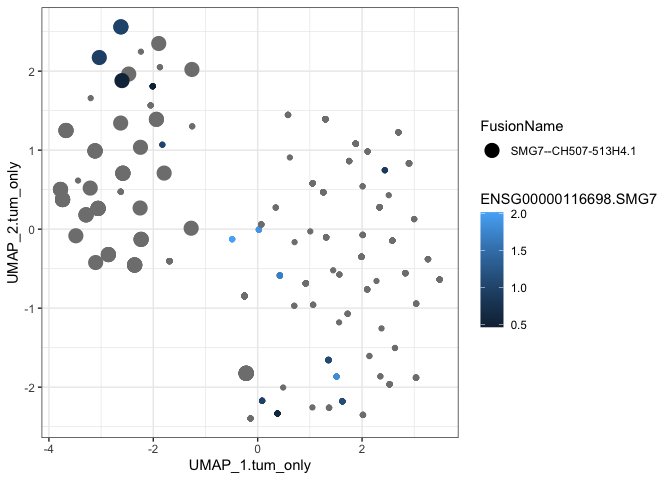<!-- -->

``` r
ggsave(SMG7_expr_and_fusion_plot, file="scHGSOC_Patient1_tumor_cells_only.SMG7_expr_and_fusion.svg", width=7, height=5)
```

``` r
Tum_data_w_expr = left_join(Tum_data, gene_expr_data, by=c('barcodes'='barcode'))
```

``` r
Tum_data_w_expr %>% ggplot(aes(x=UMAP_1, y=UMAP_2)) + theme_bw() + 
    
    geom_point(aes(color=celltype_final)) #+
```

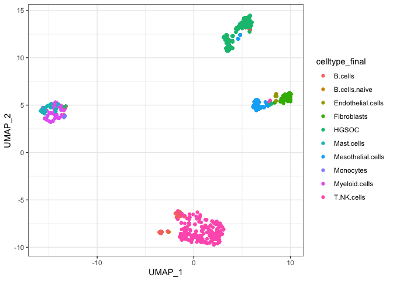<!-- -->

``` r
    #geom_point(aes(color=ENSG00000116698.SMG7))  + 
    
    #geom_point(data=Tum_data_w_expr %>% 
    #               filter(FusionName == 'SMG7--CH507-513H4.1'),
    #            aes(color=ENSG00000116698.SMG7), size=rel(5)) 
```

``` r
Tum_data_w_expr %>% ggplot(aes(x=UMAP_1, y=UMAP_2)) + theme_bw() + 

     
    geom_point(aes(color=ENSG00000116698.SMG7))  + 
    
    geom_point(data=Tum_data_w_expr %>% 
                   filter(FusionName == 'SMG7--CH507-513H4.1'),
                aes(color=ENSG00000116698.SMG7), size=rel(5)) 
```

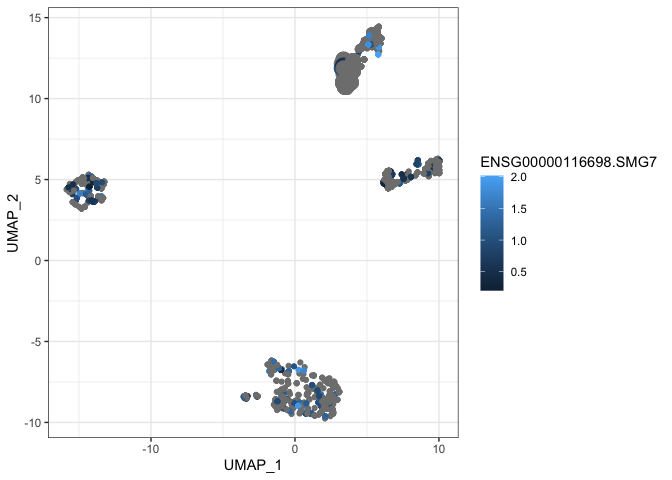<!-- -->

``` r
# ENSG00000278996.1 chr21   8197620 8227646 +   CH507-513H4.1   lincRNA

tumor_umap_w_expr %>% ggplot(aes(x=UMAP_1.tum_only, y=UMAP_2.tum_only)) + theme_bw() + 
    geom_point(aes(color=ENSG00000278996.FP671120.4))  + #CH507-513H4.1
    
    geom_point(data=tumor_umap_w_expr %>% 
                   filter(FusionName == 'SMG7--CH507-513H4.1'),
                aes(shape=FusionName, color=ENSG00000278996.FP671120.4), size=rel(5)) 
```

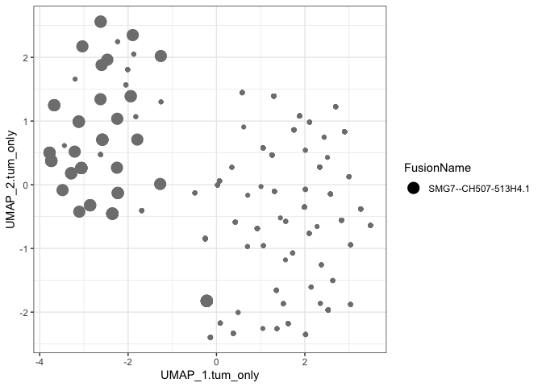<!-- -->

``` r
Tum_data_w_expr %>% ggplot(aes(x=UMAP_1, y=UMAP_2)) + theme_bw() + 
    geom_point(aes(color=ENSG00000278996.FP671120.4))  + 
    
    geom_point(data=Tum_data_w_expr %>% 
                   filter(FusionName == 'SMG7--CH507-513H4.1'),
                aes(shape=FusionName, color=ENSG00000278996.FP671120.4), size=rel(5)) 
```

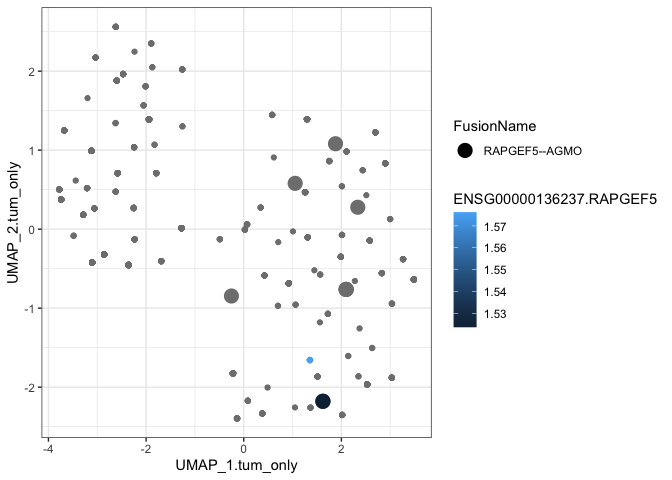<!-- -->

## RAPGEF5–AGMO

``` r
tumor_umap_w_expr %>% ggplot(aes(x=UMAP_1.tum_only, y=UMAP_2.tum_only)) + theme_bw() + 
    geom_point(aes(color=ENSG00000136237.RAPGEF5))  + 
    
    geom_point(data=tumor_umap_w_expr %>% 
                   filter(FusionName == 'RAPGEF5--AGMO'),
                aes(shape=FusionName, color=ENSG00000136237.RAPGEF5), size=rel(5)) 
```

<!-- -->

``` r
Tum_data_w_expr %>% ggplot(aes(x=UMAP_1, y=UMAP_2)) + theme_bw() + 
    geom_point(aes(color=ENSG00000136237.RAPGEF5))  + 
    
    geom_point(data=Tum_data_w_expr %>% 
                   filter(FusionName == 'RAPGEF5--AGMO'),
                aes(shape=FusionName, color=ENSG00000136237.RAPGEF5), size=rel(5)) 
```

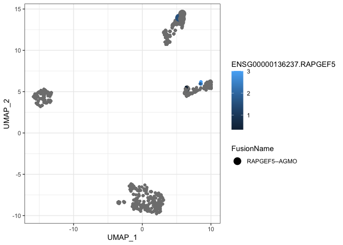<!-- -->

``` r
tumor_umap_w_expr %>% ggplot(aes(x=UMAP_1.tum_only, y=UMAP_2.tum_only)) + theme_bw() + 
    geom_point(aes(color=ENSG00000187546.AGMO))  + 
    
    geom_point(data=tumor_umap_w_expr %>% 
                   filter(FusionName == 'RAPGEF5--AGMO'),
                aes(shape=FusionName, color=ENSG00000187546.AGMO), size=rel(5)) 
```

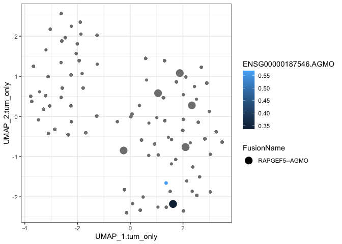<!-- -->

``` r
Tum_data_w_expr %>% ggplot(aes(x=UMAP_1, y=UMAP_2)) + theme_bw() + 
    geom_point(aes(color=ENSG00000187546.AGMO))  + 
    
    geom_point(data=Tum_data_w_expr %>% 
                   filter(FusionName == 'RAPGEF5--AGMO'),
                aes(shape=FusionName, color=ENSG00000187546.AGMO), size=rel(5)) 
```

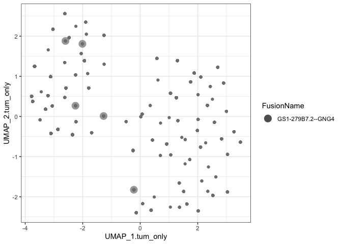<!-- -->

## fusion GS1-279B7.2–GNG4

``` r
#ENSG00000273004.1  chr1    185317779   185318530   +   GS1-279B7.2 lincRNA

tumor_umap_w_expr %>% ggplot(aes(x=UMAP_1.tum_only, y=UMAP_2.tum_only)) + theme_bw() + 
    geom_point(aes(color=ENSG00000273004.AL078644.2))  + 
    
    geom_point(data=tumor_umap_w_expr %>% 
                   filter(FusionName == 'GS1-279B7.2--GNG4'),
                aes(shape=FusionName, color=ENSG00000273004.AL078644.2), size=rel(5), alpha=0.7) 
```

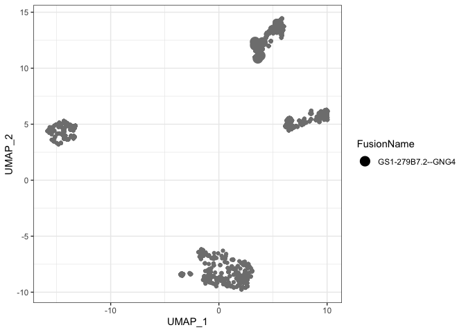<!-- -->

``` r
Tum_data_w_expr %>% ggplot(aes(x=UMAP_1, y=UMAP_2)) + theme_bw() + 
    geom_point(aes(color=ENSG00000273004.AL078644.2))  + 
    
    geom_point(data=Tum_data_w_expr %>% 
                   filter(FusionName == 'GS1-279B7.2--GNG4'),
                aes(shape=FusionName, color=ENSG00000273004.AL078644.2), size=rel(5)) 
```

<!-- -->

``` r
tumor_umap_w_expr %>% ggplot(aes(x=UMAP_1.tum_only, y=UMAP_2.tum_only)) + theme_bw() + 
    geom_point(aes(color=ENSG00000168243.GNG4))  + 
    
    geom_point(data=tumor_umap_w_expr %>% 
                   filter(FusionName == 'GS1-279B7.2--GNG4'),
                aes(shape=FusionName, color=ENSG00000168243.GNG4), size=rel(5)) 
```

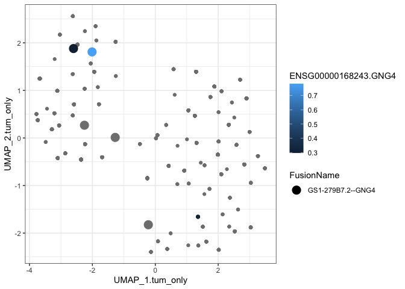<!-- -->

``` r
Tum_data_w_expr %>% ggplot(aes(x=UMAP_1, y=UMAP_2)) + theme_bw() + 
    geom_point(aes(color=ENSG00000168243.GNG4))  + 
    
    geom_point(data=Tum_data_w_expr %>% 
                   filter(FusionName == 'GS1-279B7.2--GNG4'),
                aes(shape=FusionName, color=ENSG00000168243.GNG4), size=rel(5)) 
```

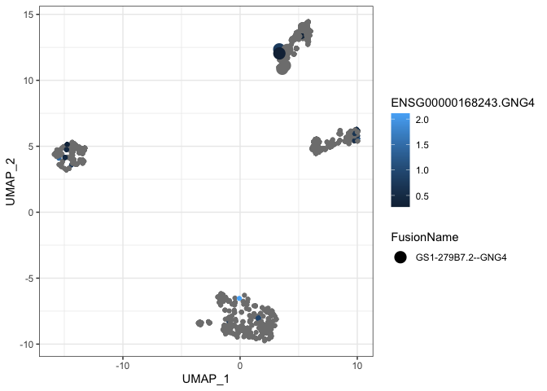<!-- -->

# any fusions found only via short read data?

``` r
fusions_with_long_read = Tum_data %>% filter(method == "ctat-LR-fusion") %>% select(FusionName) %>% unique()

fusions_with_long_read = fusions_with_long_read %>% filter(! FusionName %in% Om_data$FusionName)

short_read_only_fusions = Tum_data %>% filter( ! FusionName %in% fusions_with_long_read$FusionName) %>% select(FusionName, method) %>% unique() %>%
    group_by(FusionName) %>% mutate(methods = paste(collapse=",", method), num_methods = n()) %>%
    select(FusionName, methods, num_methods) %>% unique() %>% arrange(desc(num_methods)) 

short_read_only_fusions
```

    ## # A tibble: 187 × 3
    ## # Groups:   FusionName [187]
    ##    FusionName        methods                            num_methods
    ##    <chr>             <chr>                                    <int>
    ##  1 DHCR24--CCDC6     STAR-Fusion,FusionInspector,Arriba           3
    ##  2 KMT2C--RASSF9     STAR-Fusion,FusionInspector,Arriba           3
    ##  3 PRKCH--PRKAR1A    STAR-Fusion,FusionInspector,Arriba           3
    ##  4 ANKH--WFDC2       STAR-Fusion,FusionInspector                  2
    ##  5 ARMC4P1--CD38     STAR-Fusion,FusionInspector                  2
    ##  6 BTG2--LRRC8A      STAR-Fusion,FusionInspector                  2
    ##  7 CAMK1D--WAPAL     STAR-Fusion,FusionInspector                  2
    ##  8 CAMTA1--LINC01191 STAR-Fusion,FusionInspector                  2
    ##  9 CDK7--MZF1        STAR-Fusion,Arriba                           2
    ## 10 CDK8--AP3M2       STAR-Fusion,FusionInspector                  2
    ## # ℹ 177 more rows

``` r
# any short-read-only fusions relevant to cancer?

left_join(short_read_only_fusions, Tum_data, by='FusionName') %>% 
    select(FusionName, cell_barcode, celltype_final) %>% unique() %>%
    group_by(FusionName, celltype_final) %>% tally(name='num_cells') %>% 
    mutate(frac_fusion_cells=prop.table(num_cells)) %>%
    filter(celltype_final == "HGSOC" & num_cells >= MIN_CELLS & frac_fusion_cells >= 0.8) %>%
    arrange(desc(num_cells))
```

    ## # A tibble: 0 × 4
    ## # Groups:   FusionName [0]
    ## # ℹ 4 variables: FusionName <chr>, celltype_final <chr>, num_cells <int>,
    ## #   frac_fusion_cells <dbl>

``` r
# 0
```
