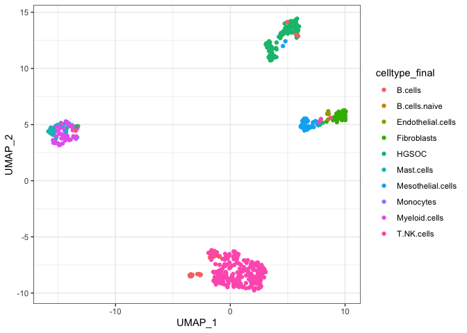

Patient1_analysis
================
bhaas
2023-09-28

``` r
MIN_CELLS = 5
```

# P1 Om

``` r
# Om sample fusion read evidence with cell barcodes and UMIs

Om_data = read.table("data/Patient1_Om.Dondi_overian_CTAT_fusions.filtered_cells_and_dedup_umis.tsv.gz", header=T, sep="\t", stringsAsFactors = F)

Om_data %>% head()
```

    ##       FusionName   LeftBreakpoint  RightBreakpoint     cell_barcode
    ## 1   AAK1--NSFL1C  chr2:69520840:-  chr20:1443919:- TGCGGGTTGTGAACAA
    ## 2   AAK1--NSFL1C  chr2:69520840:-  chr20:1443919:- TGCGGGTTGTGAACAA
    ## 3    AATF--CDC27 chr17:36953907:+ chr17:47154786:- TTACATCACCACGCCA
    ## 4   AATF--RNF181 chr17:37056856:+  chr2:85596857:+ CACAAAGCTTTCAGGT
    ## 5   ABCB7--TBL1X  chrX:75156105:-   chrX:9684043:+ TACATCTTGTGTGCTA
    ## 6 ABCD3--ZCCHC11  chr1:94418588:+  chr1:52446667:- AAAGGTTGAACTGTGT
    ##            umi                        read_name         method         barcodes
    ## 1 GATGATACCATA m64156_210212_094634/5494165/ccs ctat-LR-fusion TTGTTCACAACCCGCA
    ## 2 ATGATACCCATA m64156_210212_094634/2470599/ccs ctat-LR-fusion TTGTTCACAACCCGCA
    ## 3 GGAAAACACTCA m64156_210218_095630/2164025/ccs ctat-LR-fusion TGGCGTGGTGATGTAA
    ## 4 TAGATGGGCGAG m64156_210218_095630/9427948/ccs ctat-LR-fusion ACCTGAAAGCTTTGTG
    ## 5 CGGAAGGTTCAT m64156_210218_095630/1147487/ccs ctat-LR-fusion TAGCACACAAGATGTA
    ## 6 ACTCAAAGCGCC m64156_210218_095630/6810021/ccs ctat-LR-fusion ACACAGTTCAACCTTT
    ##      celltype_final     UMAP_1    UMAP_2     dataset
    ## 1 Mesothelial.cells -3.1328955 -6.413856 Patient1_Om
    ## 2 Mesothelial.cells -3.1328955 -6.413856 Patient1_Om
    ## 3 Mesothelial.cells -2.6065259 -6.884776 Patient1_Om
    ## 4 Mesothelial.cells -2.6343203 -8.152050 Patient1_Om
    ## 5 Mesothelial.cells -3.9997020 -8.107354 Patient1_Om
    ## 6 Mesothelial.cells -0.4981933 -7.227113 Patient1_Om

``` r
# Om sample counts of cells with fusions according to fusion detection method.

Om_cell_counts_by_method = read.table("data/Patient1_Om.Dondi_overian_CTAT_fusions.filtered_cells_and_dedup_umis.cell_counts_by_method.tsv.gz", 
                                      header=T, sep="\t", stringsAsFactors = F)

Om_cell_counts_by_method %>% head()
```

    ##              FusionName   LeftBreakpoint  RightBreakpoint          method
    ## 1 RP11-208G20.2--PSPHP1  chr7:55761799:+  chr7:55773181:+  ctat-LR-fusion
    ## 2   RP11-384F7.2--LSAMP chr3:117997182:- chr3:116444955:-  ctat-LR-fusion
    ## 3 RP11-208G20.2--PSPHP1  chr7:55761799:+  chr7:55773181:+  ctat-LR-fusion
    ## 4 RP11-208G20.2--PSPHP1  chr7:55761798:+  chr7:55772328:+  ctat-LR-fusion
    ## 5            YAF2--RYBP chr12:42238155:-  chr3:72446621:- FusionInspector
    ## 6 RP11-208G20.2--PSPHP1  chr7:55761799:+  chr7:55773181:+  ctat-LR-fusion
    ##      celltype_final     dataset cell_counts
    ## 1 Mesothelial.cells Patient1_Om         118
    ## 2 Mesothelial.cells Patient1_Om          30
    ## 3       Fibroblasts Patient1_Om          17
    ## 4 Mesothelial.cells Patient1_Om          11
    ## 5 Mesothelial.cells Patient1_Om           9
    ## 6        T.NK.cells Patient1_Om           8

``` r
# reorganizing cell counts by method for comparing across methods and corresponding types of reads (long or short)

Om_cell_counts_by_method_spread = Om_cell_counts_by_method %>% select(FusionName, LeftBreakpoint, RightBreakpoint, method, celltype_final, cell_counts) %>%
    spread(key=method, value=cell_counts) %>% 
    arrange(desc(`ctat-LR-fusion`))

Om_cell_counts_by_method_spread %>% filter(`ctat-LR-fusion` >= MIN_CELLS)
```

    ##                    FusionName   LeftBreakpoint  RightBreakpoint
    ## 1       RP11-208G20.2--PSPHP1  chr7:55761799:+  chr7:55773181:+
    ## 2         RP11-384F7.2--LSAMP chr3:117997182:- chr3:116444955:-
    ## 3       RP11-208G20.2--PSPHP1  chr7:55761799:+  chr7:55773181:+
    ## 4       RP11-208G20.2--PSPHP1  chr7:55761798:+  chr7:55772328:+
    ## 5       RP11-208G20.2--PSPHP1  chr7:55761799:+  chr7:55773181:+
    ## 6 RP11-96H19.1--RP11-446N19.1 chr12:46387972:+ chr12:46652390:+
    ## 7         SAMD5--RP11-307P5.1 chr6:147509387:+ chr6:147947472:+
    ## 8           RP1-34H18.1--NAV3 chr12:77326622:+ chr12:77940319:+
    ## 9                  YWHAE--CRK  chr17:1400047:-  chr17:1437155:-
    ##      celltype_final ctat-LR-fusion FusionInspector STAR-Fusion
    ## 1 Mesothelial.cells            118              NA          NA
    ## 2 Mesothelial.cells             30              NA          NA
    ## 3       Fibroblasts             17              NA          NA
    ## 4 Mesothelial.cells             11              NA          NA
    ## 5        T.NK.cells              8              NA          NA
    ## 6 Mesothelial.cells              8              NA          NA
    ## 7 Mesothelial.cells              6              NA          NA
    ## 8 Mesothelial.cells              5              NA          NA
    ## 9 Mesothelial.cells              5              NA          NA

``` r
# determine how each fusion is distributed across different cell types.

Om_fusion_frac_cell_types = Om_data %>% select(FusionName, barcodes, celltype_final) %>% unique() %>%
    group_by(FusionName, celltype_final) %>% tally(name='tot_cells_w_fusion') %>% 
    mutate(frac_fusion_cells=prop.table(tot_cells_w_fusion)) %>%
    arrange(desc(tot_cells_w_fusion))

Om_fusion_frac_cell_types %>% filter(tot_cells_w_fusion >= MIN_CELLS) %>% arrange(FusionName, desc(tot_cells_w_fusion))
```

    ## # A tibble: 10 × 4
    ## # Groups:   FusionName [8]
    ##    FusionName                  celltype_final    tot_cells_w_fusion frac_fusio…¹
    ##    <chr>                       <chr>                          <int>        <dbl>
    ##  1 RP1-34H18.1--NAV3           Mesothelial.cells                  5       0.714 
    ##  2 RP11-208G20.2--PSPHP1       Mesothelial.cells                121       0.823 
    ##  3 RP11-208G20.2--PSPHP1       Fibroblasts                       17       0.116 
    ##  4 RP11-208G20.2--PSPHP1       T.NK.cells                         8       0.0544
    ##  5 RP11-384F7.2--LSAMP         Mesothelial.cells                 30       0.882 
    ##  6 RP11-444D3.1--SOX5          Fibroblasts                        6       0.75  
    ##  7 RP11-96H19.1--RP11-446N19.1 Mesothelial.cells                  8       1     
    ##  8 SAMD5--RP11-307P5.1         Mesothelial.cells                  8       1     
    ##  9 YAF2--RYBP                  Mesothelial.cells                  9       0.643 
    ## 10 YWHAE--CRK                  Mesothelial.cells                  5       1     
    ## # … with abbreviated variable name ¹​frac_fusion_cells

# P1 Tumor

``` r
# read in tumor fusion read evidence with cell barcode and UMIs


Tum_data = read.table("data/Patient1_Tum.Dondi_overian_CTAT_fusions.filtered_cells_and_dedup_umis.tsv.gz", header=T, sep="\t", stringsAsFactors = F)

Tum_data %>% head()
```

    ##          FusionName   LeftBreakpoint  RightBreakpoint     cell_barcode
    ## 1       ABCF1--CHD2  chr6:30571560:+ chr15:92978234:+ GATAGGCGATATCCGA
    ## 2  ABHD17A--MIF-AS1  chr19:1877636:- chr22:23894839:- CCTGATGCTCTGGCTG
    ## 3      ABHD6--SEC62  chr3:58294376:+ chr3:169966815:+ CTGTAAGACTGAAATG
    ## 4       ABL1--ACBD3 chr9:130714455:+ chr1:226166000:- TGAGCAACTGCAAGCA
    ## 5       ABL1--ACBD3 chr9:130714455:+ chr1:226166000:- TGAGCAACTGCAAGCA
    ## 6 AC006014.7--ACOX3  chr7:75485823:-   chr4:8373601:- ACAAGCTACCGTGCGT
    ##            umi                                 read_name         method
    ## 1 ACATAGTAAAGA        m64141e_210223_151117/16579686/ccs ctat-LR-fusion
    ## 2 GTAGATACCTCT NS500318:931:HGT2FBGXG:1:11208:1944:11134    STAR-Fusion
    ## 3 GTCTCAGGTGAG NS500318:931:HGT2FBGXG:3:22510:3460:16164    STAR-Fusion
    ## 4 GAAGGGTTAGGA          m64141e_210226_034232/644555/ccs ctat-LR-fusion
    ## 5 AAGAGGTTAGGA         m64141e_210205_142336/8944271/ccs ctat-LR-fusion
    ## 6 CCGGATCGCCGG        m64141e_210226_034232/16568032/ccs ctat-LR-fusion
    ##           barcodes    celltype_final     UMAP_1    UMAP_2      dataset
    ## 1 TCGGATATCGCCTATC Mesothelial.cells   4.803859 12.414766 Patient1_Tum
    ## 2 CAGCCAGAGCATCAGG             HGSOC   8.051662  5.157959 Patient1_Tum
    ## 3 CATTTCAGTCTTACAG             HGSOC   5.731084 14.108007 Patient1_Tum
    ## 4 TGCTTGCAGTTGCTCA     Myeloid.cells -14.128127  3.693997 Patient1_Tum
    ## 5 TGCTTGCAGTTGCTCA     Myeloid.cells -14.128127  3.693997 Patient1_Tum
    ## 6 ACGCACGGTAGCTTGT        T.NK.cells  -1.632042 -6.182518 Patient1_Tum

``` r
# read in cell counts by method

Tum_cell_counts_by_method = read.table("data/Patient1_Tum.Dondi_overian_CTAT_fusions.filtered_cells_and_dedup_umis.cell_counts_by_method.tsv.gz", 
                                      header=T, sep="\t", stringsAsFactors = F)

Tum_cell_counts_by_method %>% head()
```

    ##              FusionName   LeftBreakpoint  RightBreakpoint          method
    ## 1      FAU--RP1-269O5.3 chr11:65121500:- chrX:111930935:+ FusionInspector
    ## 2      FAU--RP1-269O5.3 chr11:65121500:- chrX:111930935:+ FusionInspector
    ## 3 RP11-208G20.2--PSPHP1  chr7:55761799:+  chr7:55773181:+  ctat-LR-fusion
    ## 4      FAU--RP1-269O5.3 chr11:65121500:- chrX:111930935:+ FusionInspector
    ## 5      FAU--RP1-269O5.3 chr11:65121500:- chrX:111930935:+ FusionInspector
    ## 6   SMG7--CH507-513H4.1 chr1:183472649:+  chr21:8222961:+  ctat-LR-fusion
    ##      celltype_final      dataset cell_counts
    ## 1        T.NK.cells Patient1_Tum          94
    ## 2             HGSOC Patient1_Tum          70
    ## 3             HGSOC Patient1_Tum          46
    ## 4 Mesothelial.cells Patient1_Tum          31
    ## 5     Myeloid.cells Patient1_Tum          31
    ## 6             HGSOC Patient1_Tum          26

``` r
# organize fusion cell counts by method to compare methods


Tum_cell_counts_by_method_spread = Tum_cell_counts_by_method %>% select(FusionName, LeftBreakpoint, RightBreakpoint, method, celltype_final, cell_counts) %>%
    spread(key=method, value=cell_counts) %>% 
    arrange(desc(`ctat-LR-fusion`))

Tum_cell_counts_by_method_spread %>% filter(`ctat-LR-fusion` >= MIN_CELLS)
```

    ##               FusionName   LeftBreakpoint  RightBreakpoint    celltype_final
    ## 1  RP11-208G20.2--PSPHP1  chr7:55761799:+  chr7:55773181:+             HGSOC
    ## 2    SMG7--CH507-513H4.1 chr1:183472649:+  chr21:8222961:+             HGSOC
    ## 3  RP11-208G20.2--PSPHP1  chr7:55761799:+  chr7:55773181:+ Mesothelial.cells
    ## 4  RP11-208G20.2--PSPHP1  chr7:55761799:+  chr7:55773181:+        T.NK.cells
    ## 5  RP11-208G20.2--PSPHP1  chr7:55761798:+  chr7:55772328:+             HGSOC
    ## 6    RP11-384F7.2--LSAMP chr3:117997182:- chr3:116444955:-             HGSOC
    ## 7    RP11-384F7.2--LSAMP chr3:117997182:- chr3:116444955:- Mesothelial.cells
    ## 8  RP11-208G20.2--PSPHP1  chr7:55761799:+  chr7:55773181:+           B.cells
    ## 9  RP11-208G20.2--PSPHP1  chr7:55761799:+  chr7:55773181:+     Myeloid.cells
    ## 10    RP11-444D3.1--SOX5 chr12:24276141:- chr12:23896024:-             HGSOC
    ## 11        NTN1--CDRT15P2  chr17:9023391:+ chr17:15765108:+             HGSOC
    ## 12         RAPGEF5--AGMO  chr7:22125604:-  chr7:15201359:-             HGSOC
    ## 13     RP1-34H18.1--NAV3 chr12:77326622:+ chr12:77940319:+       Fibroblasts
    ## 14 RP11-208G20.2--PSPHP1  chr7:55761799:+  chr7:55773181:+       Fibroblasts
    ##    ctat-LR-fusion FusionInspector STAR-Fusion
    ## 1              46              NA          NA
    ## 2              26              NA          NA
    ## 3              22              NA          NA
    ## 4              17              NA          NA
    ## 5              11              NA          NA
    ## 6              10              NA          NA
    ## 7               9              NA          NA
    ## 8               8              NA          NA
    ## 9               8              NA          NA
    ## 10              7              NA          NA
    ## 11              5              NA          NA
    ## 12              5               3           1
    ## 13              5              NA          NA
    ## 14              5              NA          NA

# compare P1 Tum and Om fusions

``` r
# join the Om and Tum fusion cell counts by method

Tum_n_Om_joined_fusions = full_join(Tum_cell_counts_by_method_spread, Om_cell_counts_by_method_spread, 
                                    by=c('FusionName', 'LeftBreakpoint', 'RightBreakpoint', 'celltype_final'),
                                    suffix=c('.Tum', '.Om'))

Tum_n_Om_joined_fusions %>% head()
```

    ##              FusionName   LeftBreakpoint  RightBreakpoint    celltype_final
    ## 1 RP11-208G20.2--PSPHP1  chr7:55761799:+  chr7:55773181:+             HGSOC
    ## 2   SMG7--CH507-513H4.1 chr1:183472649:+  chr21:8222961:+             HGSOC
    ## 3 RP11-208G20.2--PSPHP1  chr7:55761799:+  chr7:55773181:+ Mesothelial.cells
    ## 4 RP11-208G20.2--PSPHP1  chr7:55761799:+  chr7:55773181:+        T.NK.cells
    ## 5 RP11-208G20.2--PSPHP1  chr7:55761798:+  chr7:55772328:+             HGSOC
    ## 6   RP11-384F7.2--LSAMP chr3:117997182:- chr3:116444955:-             HGSOC
    ##   ctat-LR-fusion.Tum FusionInspector.Tum STAR-Fusion.Tum ctat-LR-fusion.Om
    ## 1                 46                  NA              NA                NA
    ## 2                 26                  NA              NA                NA
    ## 3                 22                  NA              NA               118
    ## 4                 17                  NA              NA                 8
    ## 5                 11                  NA              NA                NA
    ## 6                 10                  NA              NA                NA
    ##   FusionInspector.Om STAR-Fusion.Om
    ## 1                 NA             NA
    ## 2                 NA             NA
    ## 3                 NA             NA
    ## 4                 NA             NA
    ## 5                 NA             NA
    ## 6                 NA             NA

``` r
# examine those fusions with at least MIN_CELLS by long reads in the tumor sample

Tum_n_Om_joined_fusions %>% select(FusionName, LeftBreakpoint, RightBreakpoint, celltype_final, `ctat-LR-fusion.Tum`, `ctat-LR-fusion.Om`) %>%
    arrange(desc(`ctat-LR-fusion.Tum`)) %>%
    filter(`ctat-LR-fusion.Tum` >= MIN_CELLS)
```

    ##               FusionName   LeftBreakpoint  RightBreakpoint    celltype_final
    ## 1  RP11-208G20.2--PSPHP1  chr7:55761799:+  chr7:55773181:+             HGSOC
    ## 2    SMG7--CH507-513H4.1 chr1:183472649:+  chr21:8222961:+             HGSOC
    ## 3  RP11-208G20.2--PSPHP1  chr7:55761799:+  chr7:55773181:+ Mesothelial.cells
    ## 4  RP11-208G20.2--PSPHP1  chr7:55761799:+  chr7:55773181:+        T.NK.cells
    ## 5  RP11-208G20.2--PSPHP1  chr7:55761798:+  chr7:55772328:+             HGSOC
    ## 6    RP11-384F7.2--LSAMP chr3:117997182:- chr3:116444955:-             HGSOC
    ## 7    RP11-384F7.2--LSAMP chr3:117997182:- chr3:116444955:- Mesothelial.cells
    ## 8  RP11-208G20.2--PSPHP1  chr7:55761799:+  chr7:55773181:+           B.cells
    ## 9  RP11-208G20.2--PSPHP1  chr7:55761799:+  chr7:55773181:+     Myeloid.cells
    ## 10    RP11-444D3.1--SOX5 chr12:24276141:- chr12:23896024:-             HGSOC
    ## 11        NTN1--CDRT15P2  chr17:9023391:+ chr17:15765108:+             HGSOC
    ## 12         RAPGEF5--AGMO  chr7:22125604:-  chr7:15201359:-             HGSOC
    ## 13     RP1-34H18.1--NAV3 chr12:77326622:+ chr12:77940319:+       Fibroblasts
    ## 14 RP11-208G20.2--PSPHP1  chr7:55761799:+  chr7:55773181:+       Fibroblasts
    ##    ctat-LR-fusion.Tum ctat-LR-fusion.Om
    ## 1                  46                NA
    ## 2                  26                NA
    ## 3                  22               118
    ## 4                  17                 8
    ## 5                  11                NA
    ## 6                  10                NA
    ## 7                   9                30
    ## 8                   8                NA
    ## 9                   8                 1
    ## 10                  7                NA
    ## 11                  5                NA
    ## 12                  5                NA
    ## 13                  5                 2
    ## 14                  5                17

``` r
# examine distribution of fusion calles according to cell types

Tum_fusion_frac_cell_types = Tum_data %>% select(FusionName, barcodes, celltype_final) %>% unique() %>%
    group_by(FusionName, celltype_final) %>% tally(name='tot_cells_w_fusion') %>% 
    mutate(frac_fusion_cells=prop.table(tot_cells_w_fusion)) %>%
    arrange(desc(tot_cells_w_fusion))

Tum_fusion_frac_cell_types %>% head()
```

    ## # A tibble: 6 × 4
    ## # Groups:   FusionName [3]
    ##   FusionName            celltype_final    tot_cells_w_fusion frac_fusion_cells
    ##   <chr>                 <chr>                          <int>             <dbl>
    ## 1 FAU--RP1-269O5.3      T.NK.cells                        95             0.324
    ## 2 FAU--RP1-269O5.3      HGSOC                             70             0.239
    ## 3 RP11-208G20.2--PSPHP1 HGSOC                             49             0.419
    ## 4 FAU--RP1-269O5.3      Mesothelial.cells                 31             0.106
    ## 5 FAU--RP1-269O5.3      Myeloid.cells                     31             0.106
    ## 6 SMG7--CH507-513H4.1   HGSOC                             26             1

``` r
# identify tumor-enriched fusions:
# restrict to those where at least 80% of the fusion containing cells are tumor HGSOC cells


fusions_of_interest = Tum_fusion_frac_cell_types %>% filter(celltype_final == "HGSOC" & frac_fusion_cells >= 0.8) %>%
    arrange(desc(tot_cells_w_fusion)) %>%
    filter(tot_cells_w_fusion >= MIN_CELLS)

fusions_of_interest
```

    ## # A tibble: 3 × 4
    ## # Groups:   FusionName [3]
    ##   FusionName          celltype_final tot_cells_w_fusion frac_fusion_cells
    ##   <chr>               <chr>                       <int>             <dbl>
    ## 1 SMG7--CH507-513H4.1 HGSOC                          26                 1
    ## 2 RAPGEF5--AGMO       HGSOC                           6                 1
    ## 3 NTN1--CDRT15P2      HGSOC                           5                 1

only 3 fusions of interest, each with at least 5 cells, and found
entirely within the tumor cell fraction

``` r
# see if these fusions are found in the Om sample

left_join(fusions_of_interest, Om_fusion_frac_cell_types, by='FusionName', suffix=c('.Tum', '.Om'))
```

    ## # A tibble: 3 × 7
    ## # Groups:   FusionName [3]
    ##   FusionName          celltype_final.Tum tot_c…¹ frac_…² cellt…³ tot_c…⁴ frac_…⁵
    ##   <chr>               <chr>                <int>   <dbl> <chr>     <int>   <dbl>
    ## 1 SMG7--CH507-513H4.1 HGSOC                   26       1 <NA>         NA      NA
    ## 2 RAPGEF5--AGMO       HGSOC                    6       1 <NA>         NA      NA
    ## 3 NTN1--CDRT15P2      HGSOC                    5       1 <NA>         NA      NA
    ## # … with abbreviated variable names ¹​tot_cells_w_fusion.Tum,
    ## #   ²​frac_fusion_cells.Tum, ³​celltype_final.Om, ⁴​tot_cells_w_fusion.Om,
    ## #   ⁵​frac_fusion_cells.Om

None of these three fusions are found in the matched normal ‘Om’ sample

# Examine read type support for these fusions of interest

``` r
# see if we find these fusions using short reads:

fusions_of_interest = left_join(fusions_of_interest, Tum_cell_counts_by_method_spread)
```

    ## Joining with `by = join_by(FusionName, celltype_final)`

``` r
fusion_annots = read.table("data/Patient1.fusion_annots.gz", header=T, sep="\t", stringsAsFactors = F)

fusions_of_interest = left_join(fusions_of_interest, fusion_annots)
```

    ## Joining with `by = join_by(FusionName)`

``` r
write.table(fusions_of_interest, file="Patient1_Tum.fusions_of_interest.tsv", sep="\t", row.names=F, quote=F)

fusions_of_interest
```

    ## # A tibble: 3 × 10
    ## # Groups:   FusionName [3]
    ##   Fusio…¹ cellt…² tot_c…³ frac_…⁴ LeftB…⁵ Right…⁶ ctat-…⁷ Fusio…⁸ STAR-…⁹ annots
    ##   <chr>   <chr>     <int>   <dbl> <chr>   <chr>     <int>   <int>   <int> <chr> 
    ## 1 SMG7--… HGSOC        26       1 chr1:1… chr21:…      26      NA      NA INTER…
    ## 2 RAPGEF… HGSOC         6       1 chr7:2… chr7:1…       5       3       1 INTRA…
    ## 3 NTN1--… HGSOC         5       1 chr17:… chr17:…       5      NA      NA INTRA…
    ## # … with abbreviated variable names ¹​FusionName, ²​celltype_final,
    ## #   ³​tot_cells_w_fusion, ⁴​frac_fusion_cells, ⁵​LeftBreakpoint, ⁶​RightBreakpoint,
    ## #   ⁷​`ctat-LR-fusion`, ⁸​FusionInspector, ⁹​`STAR-Fusion`

RAPGEF5–AGMO was found by short and long reads. The others were found
only by the long reads.

# Examine umaps for fusions

``` r
umap_base_data = read.table("data/Patient1_Tum_UMAPcoords.txt.gz", header=T, sep=",") %>%
    rename(barcodes=X) %>%
    filter(! is.na(UMAP_1)) #%>% filter(UMAP_1 != "NA")

celltypes = read.table("data/Patient1_Tum.bc_to_celltype.tsv.gz", header=T, sep="\t")

umap_base_data = left_join(umap_base_data, celltypes, by='barcodes')

# number of cells
num_total_cells = nrow(umap_base_data) 
message("number total cells: ", num_total_cells)
```

    ## number total cells: 497

``` r
# 497 total cells

umap_base_data %>% group_by(celltype_final) %>% tally(name='count_cell_type') %>% mutate(frac_tot_cells = count_cell_type/num_total_cells)
```

    ## # A tibble: 10 × 3
    ##    celltype_final    count_cell_type frac_tot_cells
    ##    <chr>                       <int>          <dbl>
    ##  1 B.cells                        30        0.0604 
    ##  2 B.cells.naive                   1        0.00201
    ##  3 Endothelial.cells               5        0.0101 
    ##  4 Fibroblasts                    33        0.0664 
    ##  5 HGSOC                          92        0.185  
    ##  6 Mast.cells                     24        0.0483 
    ##  7 Mesothelial.cells              38        0.0765 
    ##  8 Monocytes                       2        0.00402
    ##  9 Myeloid.cells                  49        0.0986 
    ## 10 T.NK.cells                    223        0.449

``` r
# 92 HGSOC cells  (19% of total cells)
```

``` r
# add seurat clusters

seurat_clusters = read.table("data/Patient1_Tum.umap_cluster_ids.tsv.gz", header=T, sep="\t")

umap_base_data = full_join(umap_base_data, seurat_clusters, by='barcodes') %>% rename(cluster_id = seurat_clusters) 
```

``` r
baseplot = umap_base_data %>% ggplot(aes(x=UMAP_1, y=UMAP_2)) + geom_point(aes(color=celltype_final))

baseplot
```

<!-- -->

``` r
x = 0

plots = list()

for (fusion in  fusions_of_interest$FusionName) {
    
    p = baseplot + geom_point(data=Tum_data %>% filter(FusionName == fusion) %>% select(UMAP_1, UMAP_2) %>% unique(), 
                              color='red') + 
        ggtitle(paste("Patient 1 Tumor, Fusion: ", fusion) )
    
    plot(p)   
    
    x = x+1
    plots[[x]] = p
}
```

<!-- --><!-- --><!-- -->

``` r
pdf("Patient1_Tum.fusions_of_interest.pdf")
for (p in plots) {
    plot(p)
}

dev.off()
```

    ## quartz_off_screen 
    ##                 2

``` r
fusion_of_interest_cell_counts = Tum_data %>% filter(FusionName %in%  fusions_of_interest$FusionName) %>% 
        select(FusionName, method, barcodes) %>% unique() %>%
        group_by(FusionName, method) %>% tally(name='cell_counts') 


fusion_of_interest_cell_counts %>% spread(key=method, value=cell_counts) %>% arrange(desc(`ctat-LR-fusion`))
```

    ## # A tibble: 3 × 4
    ## # Groups:   FusionName [3]
    ##   FusionName          `ctat-LR-fusion` FusionInspector `STAR-Fusion`
    ##   <chr>                          <int>           <int>         <int>
    ## 1 SMG7--CH507-513H4.1               26              NA            NA
    ## 2 NTN1--CDRT15P2                     5              NA            NA
    ## 3 RAPGEF5--AGMO                      5               3             1

``` r
fusion_of_interest_cell_counts  %>%
              ggplot(aes(x=FusionName, y=cell_counts, fill=method)) + geom_bar(stat='identity', position='dodge') +
              theme(axis.text.x = element_text(angle = 90, hjust = 1)) +
    ggtitle("Patient1_Tum Fusions of Interest: Cell Counts")
```

<!-- -->

``` r
# breakdown by combinations of methods per cell

tumor_cell_counts_by_methods = Tum_data %>% filter(FusionName %in%  fusions_of_interest$FusionName) %>% 
        select(FusionName, method, barcodes) %>% unique() %>%
        group_by(FusionName, barcodes) %>% 
        arrange(method) %>%
        mutate(methods = paste(method, collapse=',')) %>%
        ungroup() %>%
        select(FusionName, methods, barcodes) %>% group_by(FusionName, methods) %>% tally()


tumor_cell_counts_by_methods 
```

    ## # A tibble: 6 × 3
    ## # Groups:   FusionName [3]
    ##   FusionName          methods                                        n
    ##   <chr>               <chr>                                      <int>
    ## 1 NTN1--CDRT15P2      ctat-LR-fusion                                 5
    ## 2 RAPGEF5--AGMO       FusionInspector                                1
    ## 3 RAPGEF5--AGMO       FusionInspector,STAR-Fusion,ctat-LR-fusion     3
    ## 4 RAPGEF5--AGMO       FusionInspector,ctat-LR-fusion                 2
    ## 5 RAPGEF5--AGMO       ctat-LR-fusion                                 3
    ## 6 SMG7--CH507-513H4.1 ctat-LR-fusion                                26

``` r
p = baseplot +
        
    geom_point(data=Tum_data %>% filter(FusionName %in% c('SMG7--CH507-513H4.1', 'RAPGEF5--AGMO')) %>% select(FusionName, UMAP_1, UMAP_2) %>% unique(), 
                              aes(shape=FusionName), alpha=0.7) +
         ggtitle("Patient 1")


p
```

<!-- -->

``` r
tumor_cell_counts_by_methods  %>% filter(FusionName == "SMG7--CH507-513H4.1")
```

    ## # A tibble: 1 × 3
    ## # Groups:   FusionName [1]
    ##   FusionName          methods            n
    ##   <chr>               <chr>          <int>
    ## 1 SMG7--CH507-513H4.1 ctat-LR-fusion    26

``` r
tumor_cell_counts_by_methods  %>% filter(FusionName == "RAPGEF5--AGMO")
```

    ## # A tibble: 4 × 3
    ## # Groups:   FusionName [1]
    ##   FusionName    methods                                        n
    ##   <chr>         <chr>                                      <int>
    ## 1 RAPGEF5--AGMO FusionInspector                                1
    ## 2 RAPGEF5--AGMO FusionInspector,STAR-Fusion,ctat-LR-fusion     3
    ## 3 RAPGEF5--AGMO FusionInspector,ctat-LR-fusion                 2
    ## 4 RAPGEF5--AGMO ctat-LR-fusion                                 3

``` r
tumor_cell_counts_by_methods  %>% filter(FusionName == "NTN1--CDRT15P2")
```

    ## # A tibble: 1 × 3
    ## # Groups:   FusionName [1]
    ##   FusionName     methods            n
    ##   <chr>          <chr>          <int>
    ## 1 NTN1--CDRT15P2 ctat-LR-fusion     5

``` r
baseplot = umap_base_data %>% ggplot(aes(x=UMAP_1, y=UMAP_2)) + geom_point(aes(color=factor(cluster_id)))


x = 0

#plots = list()

for (fusion in  fusions_of_interest$FusionName) {
    
    p = baseplot + geom_point(data=Tum_data %>% filter(FusionName == fusion) %>% select(UMAP_1, UMAP_2) %>% unique(), 
                              color='red') + 
        ggtitle(paste("Patient 1 Tumor, Fusion: ", fusion) )
    
    plot(p)   
    
    x = x+1
    #plots[[x]] = p
}
```

<!-- --><!-- --><!-- -->

The SMG7 and RAPGEF5–AGMO fusions appear in different tumor subclusters.

The NTN1 fusion is found across both subclusters.
