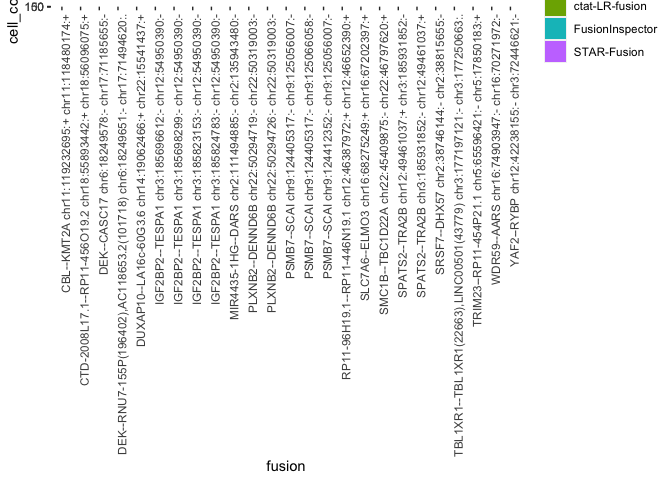

Patient2_analysis
================
bhaas
2023-09-28

``` r
MIN_CELLS = 5
```

# P2 Tum

Only a tumor sample for P2, no matching normal

``` r
# parse fusion evidence support including cell barcode and umi 

Tum_data = read.table("data/Patient2_Tum.Dondi_overian_CTAT_fusions.filtered_cells_and_dedup_umis.tsv.gz", header=T, sep="\t", stringsAsFactors = F) %>%
    filter(! is.na(UMAP_1))

nrow(Tum_data)
```

    ## [1] 9297

``` r
head(Tum_data)
```

    ##      LeftBreakpoint  RightBreakpoint     cell_barcode          umi
    ## 1 chr12:125105712:+ chrX:119838527:- GACTTGAACCAGGACA ATGTTGAATGCA
    ## 2 chr12:125105712:+ chrX:119838527:- GACTTGAACCAGGACA CAGAAGATCCCG
    ## 3   chr9:96651390:-  chr5:81420533:- CGTGTTAGAAGCATCT AATACGTTTGGC
    ## 4  chr15:67254414:- chr16:81607567:+ GGCTTGTCTAAGTGAT CTGAGAGTAGAA
    ## 5  chr16:70276486:- chr16:75206193:- TGCCACGGATGGTCTA ACATACGATGCC
    ## 6  chr16:70276486:- chr16:75116946:- TGATTACCTTGTACGT CGCCTGTCATTA
    ##                                    read_name         method orig_FusionName
    ## 1          m64141e_210302_154732/3994349/ccs ctat-LR-fusion     AACS--UPF3B
    ## 2          m64141e_210303_215648/6918968/ccs ctat-LR-fusion     AACS--UPF3B
    ## 3 NS500318:945:HNGM5BGXG:1:12105:20168:11470    STAR-Fusion    AAED1--SSBP2
    ## 4          m64141e_210302_154732/8941096/ccs ctat-LR-fusion     AAGAB--CMIP
    ## 5           m64141e_210305_041916/866540/ccs ctat-LR-fusion     AARS--CTRB2
    ## 6          m64141e_210206_203218/4890728/ccs ctat-LR-fusion      AARS--LDHD
    ##   lex_sorted_FusionName   FusionName         barcodes celltype_final    UMAP_1
    ## 1           AACS--UPF3B  AACS--UPF3B TGTCCTGGTTCAAGTC          HGSOC -5.496790
    ## 2           AACS--UPF3B  AACS--UPF3B TGTCCTGGTTCAAGTC          HGSOC -5.496790
    ## 3          AAED1--SSBP2 AAED1--SSBP2 AGATGCTTCTAACACG          HGSOC -4.653302
    ## 4           AAGAB--CMIP  AAGAB--CMIP ATCACTTAGACAAGCC     T.NK.cells  9.456604
    ## 5           AARS--CTRB2  AARS--CTRB2 TAGACCATCCGTGGCA          HGSOC -6.982332
    ## 6            AARS--LDHD   AARS--LDHD ACGTACAAGGTAATCA          HGSOC -3.825142
    ##      UMAP_2      dataset
    ## 1 -1.290143 Patient2_Tum
    ## 2 -1.290143 Patient2_Tum
    ## 3 -5.180474 Patient2_Tum
    ## 4  5.150008 Patient2_Tum
    ## 5 -3.505437 Patient2_Tum
    ## 6 -2.423326 Patient2_Tum

``` r
if (FALSE) {
#    since starF and FI were run at max sensitivity, lets restrict fusions to those identified by ctat-LRF

    Tum_ctat_LRF_fusion_genes = Tum_data %>% filter(method == 'ctat-LR-fusion') %>% select(FusionName) %>% unique() %>% pull(FusionName)

    Tum_data = Tum_data %>% filter(FusionName %in% Tum_ctat_LRF_fusion_genes)

    nrow(Tum_data)

}
```

``` r
fusion_annots = read.csv("data/Patient2.fusion_annots.gz", sep="\t", header=T, stringsAsFactors = F)
```

``` r
# parse UMAP info (from Dondi et al.) 

Tum_umap_data = read.table("data/Patient2_Tum_UMAPcoords.txt.gz", header=T, sep=",") %>%
    rename(barcodes=X)
celltypes = read.table("data/Patient2_Tum.bc_to_celltype.tsv.gz", header=T, sep="\t")

Tum_umap_data = full_join(Tum_umap_data, celltypes, by='barcodes')


# number of cells
num_tumor_cells = nrow(Tum_umap_data) 
message("number tumor cells: ", num_tumor_cells)
```

    ## number tumor cells: 453

``` r
# 453 total cells

Tum_umap_data %>% group_by(celltype_final) %>% tally(name='count_cell_type') %>% mutate(frac_tot_cells = count_cell_type/num_tumor_cells)
```

    ## # A tibble: 8 × 3
    ##   celltype_final    count_cell_type frac_tot_cells
    ##   <chr>                       <int>          <dbl>
    ## 1 B.cells                         4        0.00883
    ## 2 Endothelial.cells               8        0.0177 
    ## 3 Fibroblasts                     6        0.0132 
    ## 4 HGSOC                         208        0.459  
    ## 5 Mesothelial.cells               7        0.0155 
    ## 6 Myeloid.cells                  26        0.0574 
    ## 7 T.NK.cells                    177        0.391  
    ## 8 uncertain                      17        0.0375

``` r
# 208 HGSOC cells  (46% of total cells)


# The Patient-2 tumor sample yielded 453 total cells, with 208 (46%) identified as HGSOC cells
```

``` r
Tum_cell_counts = Tum_data %>% select(FusionName, cell_barcode) %>% unique() %>% 
    group_by(FusionName) %>%
    tally(name='tot_cells_w_fusion') %>%
    mutate(frac_tot_cells=tot_cells_w_fusion/num_tumor_cells)  %>%
    arrange(desc(frac_tot_cells))

left_join(Tum_cell_counts %>% filter(tot_cells_w_fusion >= MIN_CELLS),
          fusion_annots,
          by='FusionName')
```

    ## # A tibble: 19 × 4
    ##    FusionName                           tot_cells_w_fusion frac_tot_cells annots
    ##    <chr>                                             <int>          <dbl> <chr> 
    ##  1 IGF2BP2--TESPA1                                     178         0.393  IGF2B…
    ##  2 PSMB7--SCAI                                          53         0.117  PSMB7…
    ##  3 SRSF7--DHX57                                         37         0.0817 SRSF7…
    ##  4 YAF2--RYBP                                           33         0.0728 YAF2-…
    ##  5 MIR4435-1HG--DARS                                    21         0.0464 MIR44…
    ##  6 SPATS2--TRA2B                                        21         0.0464 SPATS…
    ##  7 CBL--KMT2A                                           16         0.0353 CBL--…
    ##  8 PLXNB2--DENND6B                                      14         0.0309 PLXNB…
    ##  9 RP11-96H19.1--RP11-446N19.1                          14         0.0309 RP11-…
    ## 10 DEK--CASC17                                          11         0.0243 DEK--…
    ## 11 SLC7A6--ELMO3                                        11         0.0243 SLC7A…
    ## 12 CTD-2008L17.1--RP11-456O19.2                          8         0.0177 CTD-2…
    ## 13 TRIM23--RP11-454P21.1                                 8         0.0177 TRIM2…
    ## 14 WDR59--AARS                                           8         0.0177 WDR59…
    ## 15 DUXAP10--LA16c-60G3.6                                 7         0.0155 DUXAP…
    ## 16 SMC1B--TBC1D22A                                       6         0.0132 <NA>  
    ## 17 TBL1XR1--TBL1XR1(22663),LINC00501(4…                  6         0.0132 <NA>  
    ## 18 DEK--RNU7-155P(196402),AC118653.2(1…                  5         0.0110 <NA>  
    ## 19 ZFP36L1--ZNF302                                       5         0.0110 ZFP36…

``` r
# examine distribution of fusion calls according to cell types

Tum_fusion_frac_cell_types = Tum_data %>% select(FusionName, barcodes, celltype_final) %>% unique() %>%
    group_by(FusionName, celltype_final) %>% tally(name='tot_cells_w_fusion') %>% 
    mutate(frac_fusion_cells=prop.table(tot_cells_w_fusion)) %>%
    arrange(desc(tot_cells_w_fusion))

Tum_fusion_frac_cell_types %>% head()
```

    ## # A tibble: 6 × 4
    ## # Groups:   FusionName [6]
    ##   FusionName        celltype_final tot_cells_w_fusion frac_fusion_cells
    ##   <chr>             <chr>                       <int>             <dbl>
    ## 1 IGF2BP2--TESPA1   HGSOC                         176             0.989
    ## 2 PSMB7--SCAI       HGSOC                          52             0.981
    ## 3 SRSF7--DHX57      HGSOC                          36             0.973
    ## 4 YAF2--RYBP        HGSOC                          24             0.727
    ## 5 MIR4435-1HG--DARS HGSOC                          21             1    
    ## 6 SPATS2--TRA2B     HGSOC                          21             1

``` r
Tum_data %>% select(method) %>% unique()
```

    ##              method
    ## 1    ctat-LR-fusion
    ## 3       STAR-Fusion
    ## 10  FusionInspector
    ## 108          Arriba

``` r
starF_fusions = Tum_data %>% filter(method=="STAR-Fusion")

FI_fusions = Tum_data %>% filter(method=="FusionInspector")

ctat_LRF_fusions = Tum_data %>% filter(method == "ctat-LR-fusion")
```

``` r
# counts of cells according to fusion breakpoint and method for detection

Tum_cell_counts_by_method = read.table("data/Patient2_Tum.Dondi_overian_CTAT_fusions.filtered_cells_and_dedup_umis.cell_counts_by_method.tsv.gz",
                                          header=T, sep="\t", stringsAsFactors = F)


Tum_cell_counts_by_method %>% head()
```

    ##        FusionName orig_FusionName lex_sorted_FusionName   LeftBreakpoint
    ## 1 IGF2BP2--TESPA1 IGF2BP2--TESPA1       IGF2BP2--TESPA1 chr3:185696612:-
    ## 2 IGF2BP2--TESPA1 IGF2BP2--TESPA1       IGF2BP2--TESPA1 chr3:185696612:-
    ## 3 IGF2BP2--TESPA1 IGF2BP2--TESPA1       IGF2BP2--TESPA1 chr3:185696612:-
    ## 4 IGF2BP2--TESPA1 IGF2BP2--TESPA1       IGF2BP2--TESPA1 chr3:185823153:-
    ## 5    SRSF7--DHX57    SRSF7--DHX57          DHX57--SRSF7  chr2:38746144:-
    ## 6     PSMB7--SCAI     PSMB7--SCAI           PSMB7--SCAI chr9:124405317:-
    ##    RightBreakpoint          method celltype_final      dataset cell_counts
    ## 1 chr12:54950390:-  ctat-LR-fusion          HGSOC Patient2_Tum         174
    ## 2 chr12:54950390:- FusionInspector          HGSOC Patient2_Tum         138
    ## 3 chr12:54950390:-          Arriba          HGSOC Patient2_Tum          92
    ## 4 chr12:54950390:-  ctat-LR-fusion          HGSOC Patient2_Tum          52
    ## 5  chr2:38815655:-  ctat-LR-fusion          HGSOC Patient2_Tum          35
    ## 6 chr9:125056007:-  ctat-LR-fusion          HGSOC Patient2_Tum          28

``` r
# reorganizing cell counts of fusions by method for comparison

Tum_cell_counts_by_method  = Tum_cell_counts_by_method %>% group_by(FusionName, method, LeftBreakpoint, RightBreakpoint) %>% 
    arrange(desc(cell_counts)) %>% filter(row_number() == 1) %>% ungroup() # deal with the ctat-LRF recip issue (CCDC180--RP11-23J9.4 CCDC180--RP11-23J9.4)

Tum_cell_counts_by_method_spread  = Tum_cell_counts_by_method %>% 
    select(FusionName, LeftBreakpoint, RightBreakpoint, method, celltype_final, cell_counts) %>%
    spread(key=method, value=cell_counts) %>% 
    arrange(desc(`ctat-LR-fusion`)) 


Tum_cell_counts_by_method_spread  %>% filter(`ctat-LR-fusion` >= MIN_CELLS)
```

    ## # A tibble: 20 × 8
    ##    FusionName               LeftBreakpoint RightBreakpoint celltype_final Arriba
    ##    <chr>                    <chr>          <chr>           <chr>           <int>
    ##  1 IGF2BP2--TESPA1          chr3:18569661… chr12:54950390… HGSOC              92
    ##  2 IGF2BP2--TESPA1          chr3:18582315… chr12:54950390… HGSOC               6
    ##  3 SRSF7--DHX57             chr2:38746144… chr2:38815655:- HGSOC              NA
    ##  4 PSMB7--SCAI              chr9:12440531… chr9:125056007… HGSOC               2
    ##  5 PSMB7--SCAI              chr9:12440531… chr9:125066058… HGSOC              NA
    ##  6 SPATS2--TRA2B            chr12:4946103… chr3:185931852… HGSOC              NA
    ##  7 MIR4435-1HG--DARS        chr2:11149488… chr2:135943480… HGSOC              NA
    ##  8 IGF2BP2--TESPA1          chr3:18582478… chr12:54950390… HGSOC               4
    ##  9 CBL--KMT2A               chr11:1192326… chr11:11848017… HGSOC              NA
    ## 10 RP11-96H19.1--RP11-446N… chr12:4638797… chr12:46652390… HGSOC              NA
    ## 11 DEK--CASC17              chr6:18249578… chr17:71185655… HGSOC              NA
    ## 12 PLXNB2--DENND6B          chr22:5029471… chr22:50319003… HGSOC              NA
    ## 13 PSMB7--SCAI              chr9:12441235… chr9:125056007… HGSOC              NA
    ## 14 WDR59--AARS              chr16:7490394… chr16:70271972… HGSOC              NA
    ## 15 DUXAP10--LA16c-60G3.6    chr14:1906246… chr22:15541437… HGSOC              NA
    ## 16 TRIM23--RP11-454P21.1    chr5:65596421… chr5:17850183:+ HGSOC              NA
    ## 17 PLXNB2--DENND6B          chr22:5029472… chr22:50319003… HGSOC              NA
    ## 18 SLC7A6--ELMO3            chr16:6827524… chr16:67202397… HGSOC              NA
    ## 19 CTD-2008L17.1--RP11-456… chr18:5589344… chr18:56096075… HGSOC              NA
    ## 20 IGF2BP2--TESPA1          chr3:18569829… chr12:54950390… HGSOC               1
    ## # ℹ 3 more variables: `ctat-LR-fusion` <int>, FusionInspector <int>,
    ## #   `STAR-Fusion` <int>

# plot counts of cells for these fusions:

``` r
# examine counts of cells according to fusion and method lmited to those with at least the min number of cells

right_join(Tum_cell_counts_by_method, 
          Tum_cell_counts_by_method %>% 
                         filter(cell_counts >= MIN_CELLS)  %>% 
                         select(FusionName, LeftBreakpoint, RightBreakpoint) 
          ) %>%
              rowwise() %>% mutate(fusion=paste(FusionName, LeftBreakpoint, RightBreakpoint, collapse=":")) %>%
              ggplot(aes(x=fusion, y=cell_counts, fill=method)) + geom_bar(stat='identity', position='dodge') +
              theme(axis.text.x = element_text(angle = 90, hjust = 1))
```

    ## Joining with `by = join_by(FusionName, LeftBreakpoint, RightBreakpoint)`

    ## Warning in right_join(Tum_cell_counts_by_method, Tum_cell_counts_by_method %>% : Detected an unexpected many-to-many relationship between `x` and `y`.
    ## ℹ Row 1 of `x` matches multiple rows in `y`.
    ## ℹ Row 1 of `y` matches multiple rows in `x`.
    ## ℹ If a many-to-many relationship is expected, set `relationship =
    ##   "many-to-many"` to silence this warning.

<!-- -->

# Examine cell type representation by fusions

``` r
# counts of cells containing fusions and fraction of fusions identified according to that cell type


fusion_frac_cell_types = Tum_data %>% select(FusionName, barcodes, celltype_final) %>% unique() %>%
    group_by(FusionName, celltype_final) %>% tally(name='tot_cells_w_fusion') %>% 
    mutate(frac_fusion_cells=prop.table(tot_cells_w_fusion)) %>%
    arrange(desc(tot_cells_w_fusion))

fusion_frac_cell_types %>% filter(tot_cells_w_fusion >= MIN_CELLS)
```

    ## # A tibble: 18 × 4
    ## # Groups:   FusionName [18]
    ##    FusionName                celltype_final tot_cells_w_fusion frac_fusion_cells
    ##    <chr>                     <chr>                       <int>             <dbl>
    ##  1 IGF2BP2--TESPA1           HGSOC                         176             0.989
    ##  2 PSMB7--SCAI               HGSOC                          52             0.981
    ##  3 SRSF7--DHX57              HGSOC                          36             0.973
    ##  4 YAF2--RYBP                HGSOC                          24             0.727
    ##  5 MIR4435-1HG--DARS         HGSOC                          21             1    
    ##  6 SPATS2--TRA2B             HGSOC                          21             1    
    ##  7 CBL--KMT2A                HGSOC                          16             1    
    ##  8 PLXNB2--DENND6B           HGSOC                          14             1    
    ##  9 RP11-96H19.1--RP11-446N1… HGSOC                          14             1    
    ## 10 DEK--CASC17               HGSOC                          11             1    
    ## 11 SLC7A6--ELMO3             HGSOC                          11             1    
    ## 12 CTD-2008L17.1--RP11-456O… HGSOC                           8             1    
    ## 13 TRIM23--RP11-454P21.1     HGSOC                           8             1    
    ## 14 WDR59--AARS               HGSOC                           8             1    
    ## 15 DUXAP10--LA16c-60G3.6     HGSOC                           7             1    
    ## 16 SMC1B--TBC1D22A           HGSOC                           6             1    
    ## 17 TBL1XR1--TBL1XR1(22663),… HGSOC                           6             1    
    ## 18 DEK--RNU7-155P(196402),A… HGSOC                           5             1

``` r
# restrict to fusions of interest:  those showing up in at least min cells and at least 80% representation within any cell type

fusions_of_interest = fusion_frac_cell_types %>% 
    filter(tot_cells_w_fusion >= MIN_CELLS) %>%
    arrange(desc(tot_cells_w_fusion)) %>%
    filter(frac_fusion_cells >= 0.8) %>%
    filter(celltype_final == "HGSOC")

fusions_of_interest
```

    ## # A tibble: 17 × 4
    ## # Groups:   FusionName [17]
    ##    FusionName                celltype_final tot_cells_w_fusion frac_fusion_cells
    ##    <chr>                     <chr>                       <int>             <dbl>
    ##  1 IGF2BP2--TESPA1           HGSOC                         176             0.989
    ##  2 PSMB7--SCAI               HGSOC                          52             0.981
    ##  3 SRSF7--DHX57              HGSOC                          36             0.973
    ##  4 MIR4435-1HG--DARS         HGSOC                          21             1    
    ##  5 SPATS2--TRA2B             HGSOC                          21             1    
    ##  6 CBL--KMT2A                HGSOC                          16             1    
    ##  7 PLXNB2--DENND6B           HGSOC                          14             1    
    ##  8 RP11-96H19.1--RP11-446N1… HGSOC                          14             1    
    ##  9 DEK--CASC17               HGSOC                          11             1    
    ## 10 SLC7A6--ELMO3             HGSOC                          11             1    
    ## 11 CTD-2008L17.1--RP11-456O… HGSOC                           8             1    
    ## 12 TRIM23--RP11-454P21.1     HGSOC                           8             1    
    ## 13 WDR59--AARS               HGSOC                           8             1    
    ## 14 DUXAP10--LA16c-60G3.6     HGSOC                           7             1    
    ## 15 SMC1B--TBC1D22A           HGSOC                           6             1    
    ## 16 TBL1XR1--TBL1XR1(22663),… HGSOC                           6             1    
    ## 17 DEK--RNU7-155P(196402),A… HGSOC                           5             1

``` r
# 17 fusions of interest

# from which we identified 17 different malignant cell enriched fusion transcripts (Supplementary Table S7),
#  including the earlier-identified IGF2BP2::TESPA1 fusion between chr3 and chr12 evident in 176/208 (85%) of the tumor cells.

# Another fusion is found with proximal breakpoints yielding fusion transcript SPATS2::TRA2B (21 tumor cells, 10%), and likely resulting from the same tumor genome rearrangements involving chr3 and chr12
```

``` r
# include fusion annotations

fusions_of_interest = left_join(fusions_of_interest,
          fusion_annots)
```

    ## Joining with `by = join_by(FusionName)`

``` r
fusions_of_interest
```

    ## # A tibble: 17 × 5
    ## # Groups:   FusionName [17]
    ##    FusionName         celltype_final tot_cells_w_fusion frac_fusion_cells annots
    ##    <chr>              <chr>                       <int>             <dbl> <chr> 
    ##  1 IGF2BP2--TESPA1    HGSOC                         176             0.989 IGF2B…
    ##  2 PSMB7--SCAI        HGSOC                          52             0.981 PSMB7…
    ##  3 SRSF7--DHX57       HGSOC                          36             0.973 SRSF7…
    ##  4 MIR4435-1HG--DARS  HGSOC                          21             1     MIR44…
    ##  5 SPATS2--TRA2B      HGSOC                          21             1     SPATS…
    ##  6 CBL--KMT2A         HGSOC                          16             1     CBL--…
    ##  7 PLXNB2--DENND6B    HGSOC                          14             1     PLXNB…
    ##  8 RP11-96H19.1--RP1… HGSOC                          14             1     RP11-…
    ##  9 DEK--CASC17        HGSOC                          11             1     DEK--…
    ## 10 SLC7A6--ELMO3      HGSOC                          11             1     SLC7A…
    ## 11 CTD-2008L17.1--RP… HGSOC                           8             1     CTD-2…
    ## 12 TRIM23--RP11-454P… HGSOC                           8             1     TRIM2…
    ## 13 WDR59--AARS        HGSOC                           8             1     WDR59…
    ## 14 DUXAP10--LA16c-60… HGSOC                           7             1     DUXAP…
    ## 15 SMC1B--TBC1D22A    HGSOC                           6             1     <NA>  
    ## 16 TBL1XR1--TBL1XR1(… HGSOC                           6             1     <NA>  
    ## 17 DEK--RNU7-155P(19… HGSOC                           5             1     <NA>

``` r
# Other notable fusions in the Patient 2 tumor sample involve known tumor oncogenes and include CBL::KMT2A (16 tumor cells) and DEK::CASC17 (11 tumor cells), both identified solely by long reads
```

``` r
fusions_of_interest = left_join(fusions_of_interest, Tum_cell_counts_by_method_spread,
                                by=c('FusionName',"celltype_final") ) 

fusions_of_interest
```

    ## # A tibble: 36 × 11
    ## # Groups:   FusionName [17]
    ##    FusionName      celltype_final tot_cells_w_fusion frac_fusion_cells annots   
    ##    <chr>           <chr>                       <int>             <dbl> <chr>    
    ##  1 IGF2BP2--TESPA1 HGSOC                         176             0.989 IGF2BP2-…
    ##  2 IGF2BP2--TESPA1 HGSOC                         176             0.989 IGF2BP2-…
    ##  3 IGF2BP2--TESPA1 HGSOC                         176             0.989 IGF2BP2-…
    ##  4 IGF2BP2--TESPA1 HGSOC                         176             0.989 IGF2BP2-…
    ##  5 IGF2BP2--TESPA1 HGSOC                         176             0.989 IGF2BP2-…
    ##  6 PSMB7--SCAI     HGSOC                          52             0.981 PSMB7--S…
    ##  7 PSMB7--SCAI     HGSOC                          52             0.981 PSMB7--S…
    ##  8 PSMB7--SCAI     HGSOC                          52             0.981 PSMB7--S…
    ##  9 PSMB7--SCAI     HGSOC                          52             0.981 PSMB7--S…
    ## 10 SRSF7--DHX57    HGSOC                          36             0.973 SRSF7--D…
    ## # ℹ 26 more rows
    ## # ℹ 6 more variables: LeftBreakpoint <chr>, RightBreakpoint <chr>,
    ## #   Arriba <int>, `ctat-LR-fusion` <int>, FusionInspector <int>,
    ## #   `STAR-Fusion` <int>

``` r
write.table(fusions_of_interest, file="Patient2_Tum.fusions_of_interest.tsv", sep="\t", quote=F, row.names = F)
```

``` r
# examine method of detection and cell counts for just the fusions of interest

Tum_cell_counts_by_method %>% 
    filter(FusionName %in% fusions_of_interest$FusionName) %>%
    select(FusionName, LeftBreakpoint, RightBreakpoint, method, celltype_final, cell_counts) %>%
    spread(key=method, value=cell_counts) %>% 
    arrange(desc(`ctat-LR-fusion`))
```

    ## # A tibble: 36 × 8
    ##    FusionName               LeftBreakpoint RightBreakpoint celltype_final Arriba
    ##    <chr>                    <chr>          <chr>           <chr>           <int>
    ##  1 IGF2BP2--TESPA1          chr3:18569661… chr12:54950390… HGSOC              92
    ##  2 IGF2BP2--TESPA1          chr3:18582315… chr12:54950390… HGSOC               6
    ##  3 SRSF7--DHX57             chr2:38746144… chr2:38815655:- HGSOC              NA
    ##  4 PSMB7--SCAI              chr9:12440531… chr9:125056007… HGSOC               2
    ##  5 PSMB7--SCAI              chr9:12440531… chr9:125066058… HGSOC              NA
    ##  6 SPATS2--TRA2B            chr12:4946103… chr3:185931852… HGSOC              NA
    ##  7 MIR4435-1HG--DARS        chr2:11149488… chr2:135943480… HGSOC              NA
    ##  8 IGF2BP2--TESPA1          chr3:18582478… chr12:54950390… HGSOC               4
    ##  9 CBL--KMT2A               chr11:1192326… chr11:11848017… HGSOC              NA
    ## 10 RP11-96H19.1--RP11-446N… chr12:4638797… chr12:46652390… HGSOC              NA
    ## # ℹ 26 more rows
    ## # ℹ 3 more variables: `ctat-LR-fusion` <int>, FusionInspector <int>,
    ## #   `STAR-Fusion` <int>

``` r
Tum_cell_counts_by_method %>% 
    filter(FusionName %in% c('CBL--KMT2A', 'DEK--CASC17')) %>%
    select(FusionName, LeftBreakpoint, RightBreakpoint, method, celltype_final, cell_counts) %>%
    spread(key=method, value=cell_counts) %>% 
    arrange(desc(`ctat-LR-fusion`))
```

    ## # A tibble: 3 × 5
    ##   FusionName  LeftBreakpoint    RightBreakpoint  celltype_final `ctat-LR-fusion`
    ##   <chr>       <chr>             <chr>            <chr>                     <int>
    ## 1 CBL--KMT2A  chr11:119232695:+ chr11:118480174… HGSOC                        15
    ## 2 DEK--CASC17 chr6:18249578:-   chr17:71185655:- HGSOC                        11
    ## 3 CBL--KMT2A  chr11:119232695:+ chr11:118481715… HGSOC                         1

``` r
# Other notable fusions in the Patient 2 tumor sample involve known tumor oncogenes and include CBL::KMT2A (16 tumor cells) and DEK::CASC17 (11 tumor cells), both identified solely by long reads
```

``` r
Tum_cell_counts_by_method %>% 
    filter(FusionName == "PSMB7--SCAI") %>%
    select(FusionName, LeftBreakpoint, RightBreakpoint, method, celltype_final, cell_counts) %>%
    spread(key=method, value=cell_counts) %>% 
    arrange(desc(`ctat-LR-fusion`))
```

    ## # A tibble: 4 × 8
    ##   FusionName  LeftBreakpoint   RightBreakpoint  celltype_final Arriba
    ##   <chr>       <chr>            <chr>            <chr>           <int>
    ## 1 PSMB7--SCAI chr9:124405317:- chr9:125056007:- HGSOC               2
    ## 2 PSMB7--SCAI chr9:124405317:- chr9:125066058:- HGSOC              NA
    ## 3 PSMB7--SCAI chr9:124412352:- chr9:125056007:- HGSOC              NA
    ## 4 PSMB7--SCAI chr9:124405317:- chr9:125029739:- HGSOC              NA
    ## # ℹ 3 more variables: `ctat-LR-fusion` <int>, FusionInspector <int>,
    ## #   `STAR-Fusion` <int>

``` r
# Another prevalent fusion PSMB7::SCAI (52 tumor cells) detected mostly by long reads and with four fusion splicing isoforms involves suppressor of cancer cell invasion gene SCAI
```

``` r
# plotting counts of cells according to method for fusions of interest

Tum_cell_counts_by_method %>% 
            filter(FusionName %in% fusions_of_interest$FusionName) %>%
            select(FusionName, LeftBreakpoint, RightBreakpoint, cell_counts, method) %>%
              rowwise() %>% mutate(fusion=paste(FusionName, LeftBreakpoint, RightBreakpoint, collapse=":")) %>%
              ggplot(aes(x=fusion, y=cell_counts, fill=method)) + 
                 geom_bar(stat='identity', position='dodge') +
                 theme(axis.text.x = element_text(angle = 90, hjust = 1))
```

<!-- -->

``` r
# Both of these fusions were detected via long and short RNA-seq reads.

# While a single fusion splicing isoform dominated IGF2BP2::TESPA1 detection in cells by both long and short reads, four additional fusion splicing isoforms were detected with long and/or short read support 
```

# Examine fusions of interest in UMAPs

``` r
# base umap plot coloring by annotated cell type

baseplot = Tum_umap_data %>% ggplot(aes(x=UMAP_1, y=UMAP_2)) + geom_point(aes(color=celltype_final))

baseplot
```

    ## Warning: Removed 34 rows containing missing values (`geom_point()`).

<!-- -->

``` r
# Examine each fusion of interest according to UMAP cell positioning

x = 0

plots = list()

for (fusion in  fusions_of_interest$FusionName) {
    
    p = baseplot + geom_point(data=Tum_data %>% filter(FusionName == fusion) %>% select(UMAP_1, UMAP_2) %>% unique(), 
                              color='red') + 
        ggtitle(paste("Patient 2 Tumor, Fusion: ", fusion) )
    
    plot(p)   
    
    x = x+1
    plots[[x]] = p
}
```

    ## Warning: Removed 34 rows containing missing values (`geom_point()`).

<!-- -->

    ## Warning: Removed 34 rows containing missing values (`geom_point()`).

<!-- -->

    ## Warning: Removed 34 rows containing missing values (`geom_point()`).

<!-- -->

    ## Warning: Removed 34 rows containing missing values (`geom_point()`).

<!-- -->

    ## Warning: Removed 34 rows containing missing values (`geom_point()`).

<!-- -->

    ## Warning: Removed 34 rows containing missing values (`geom_point()`).

<!-- -->

    ## Warning: Removed 34 rows containing missing values (`geom_point()`).

<!-- -->

    ## Warning: Removed 34 rows containing missing values (`geom_point()`).

<!-- -->

    ## Warning: Removed 34 rows containing missing values (`geom_point()`).

<!-- -->

    ## Warning: Removed 34 rows containing missing values (`geom_point()`).

<!-- -->

    ## Warning: Removed 34 rows containing missing values (`geom_point()`).

<!-- -->

    ## Warning: Removed 34 rows containing missing values (`geom_point()`).

<!-- -->

    ## Warning: Removed 34 rows containing missing values (`geom_point()`).

<!-- -->

    ## Warning: Removed 34 rows containing missing values (`geom_point()`).

<!-- -->

    ## Warning: Removed 34 rows containing missing values (`geom_point()`).

<!-- -->

    ## Warning: Removed 34 rows containing missing values (`geom_point()`).

<!-- -->

    ## Warning: Removed 34 rows containing missing values (`geom_point()`).

<!-- -->

    ## Warning: Removed 34 rows containing missing values (`geom_point()`).

<!-- -->

    ## Warning: Removed 34 rows containing missing values (`geom_point()`).

<!-- -->

    ## Warning: Removed 34 rows containing missing values (`geom_point()`).

<!-- -->

    ## Warning: Removed 34 rows containing missing values (`geom_point()`).

<!-- -->

    ## Warning: Removed 34 rows containing missing values (`geom_point()`).

<!-- -->

    ## Warning: Removed 34 rows containing missing values (`geom_point()`).

<!-- -->

    ## Warning: Removed 34 rows containing missing values (`geom_point()`).

<!-- -->

    ## Warning: Removed 34 rows containing missing values (`geom_point()`).

<!-- -->

    ## Warning: Removed 34 rows containing missing values (`geom_point()`).

<!-- -->

    ## Warning: Removed 34 rows containing missing values (`geom_point()`).

<!-- -->

    ## Warning: Removed 34 rows containing missing values (`geom_point()`).

<!-- -->

    ## Warning: Removed 34 rows containing missing values (`geom_point()`).

<!-- -->

    ## Warning: Removed 34 rows containing missing values (`geom_point()`).

<!-- -->

    ## Warning: Removed 34 rows containing missing values (`geom_point()`).

<!-- -->

    ## Warning: Removed 34 rows containing missing values (`geom_point()`).

<!-- -->

    ## Warning: Removed 34 rows containing missing values (`geom_point()`).

<!-- -->

    ## Warning: Removed 34 rows containing missing values (`geom_point()`).

<!-- -->

    ## Warning: Removed 34 rows containing missing values (`geom_point()`).

<!-- -->

    ## Warning: Removed 34 rows containing missing values (`geom_point()`).

<!-- -->

``` r
# make a pdf containing these plots

pdf("Patient2_Tum.fusions_of_interest.pdf")
for (p in plots) {
    plot(p)
}
```

    ## Warning: Removed 34 rows containing missing values (`geom_point()`).
    ## Removed 34 rows containing missing values (`geom_point()`).
    ## Removed 34 rows containing missing values (`geom_point()`).
    ## Removed 34 rows containing missing values (`geom_point()`).
    ## Removed 34 rows containing missing values (`geom_point()`).
    ## Removed 34 rows containing missing values (`geom_point()`).
    ## Removed 34 rows containing missing values (`geom_point()`).
    ## Removed 34 rows containing missing values (`geom_point()`).
    ## Removed 34 rows containing missing values (`geom_point()`).
    ## Removed 34 rows containing missing values (`geom_point()`).
    ## Removed 34 rows containing missing values (`geom_point()`).
    ## Removed 34 rows containing missing values (`geom_point()`).
    ## Removed 34 rows containing missing values (`geom_point()`).
    ## Removed 34 rows containing missing values (`geom_point()`).
    ## Removed 34 rows containing missing values (`geom_point()`).
    ## Removed 34 rows containing missing values (`geom_point()`).
    ## Removed 34 rows containing missing values (`geom_point()`).
    ## Removed 34 rows containing missing values (`geom_point()`).
    ## Removed 34 rows containing missing values (`geom_point()`).
    ## Removed 34 rows containing missing values (`geom_point()`).
    ## Removed 34 rows containing missing values (`geom_point()`).
    ## Removed 34 rows containing missing values (`geom_point()`).
    ## Removed 34 rows containing missing values (`geom_point()`).
    ## Removed 34 rows containing missing values (`geom_point()`).
    ## Removed 34 rows containing missing values (`geom_point()`).
    ## Removed 34 rows containing missing values (`geom_point()`).
    ## Removed 34 rows containing missing values (`geom_point()`).
    ## Removed 34 rows containing missing values (`geom_point()`).
    ## Removed 34 rows containing missing values (`geom_point()`).
    ## Removed 34 rows containing missing values (`geom_point()`).
    ## Removed 34 rows containing missing values (`geom_point()`).
    ## Removed 34 rows containing missing values (`geom_point()`).
    ## Removed 34 rows containing missing values (`geom_point()`).
    ## Removed 34 rows containing missing values (`geom_point()`).
    ## Removed 34 rows containing missing values (`geom_point()`).
    ## Removed 34 rows containing missing values (`geom_point()`).

``` r
dev.off()
```

    ## quartz_off_screen 
    ##                 2

``` r
# examine counts of cells by method for the fusions of interest

tumor_cell_counts = Tum_data %>% filter(FusionName %in%  fusions_of_interest$FusionName) %>% 
        select(FusionName, method, barcodes) %>% unique() %>%
        group_by(FusionName, method) %>% tally(name='cell_counts')


tumor_cell_counts %>% spread(key=method, value=cell_counts) %>% arrange(desc(`ctat-LR-fusion`))
```

    ## # A tibble: 17 × 5
    ## # Groups:   FusionName [17]
    ##    FusionName              Arriba `ctat-LR-fusion` FusionInspector `STAR-Fusion`
    ##    <chr>                    <int>            <int>           <int>         <int>
    ##  1 IGF2BP2--TESPA1             94              176             141            26
    ##  2 PSMB7--SCAI                  2               51               7             5
    ##  3 SRSF7--DHX57                NA               37               3             2
    ##  4 MIR4435-1HG--DARS           NA               21               1            NA
    ##  5 SPATS2--TRA2B                5               21              10             6
    ##  6 CBL--KMT2A                  NA               16              NA            NA
    ##  7 PLXNB2--DENND6B             NA               14              NA            NA
    ##  8 RP11-96H19.1--RP11-446…     NA               13               8            NA
    ##  9 DEK--CASC17                 NA               11              NA            NA
    ## 10 SLC7A6--ELMO3               NA               11              NA            NA
    ## 11 TRIM23--RP11-454P21.1       NA                8              NA            NA
    ## 12 WDR59--AARS                 NA                8               4             4
    ## 13 DUXAP10--LA16c-60G3.6       NA                7              NA            NA
    ## 14 CTD-2008L17.1--RP11-45…     NA                5               7             5
    ## 15 DEK--RNU7-155P(196402)…      5               NA              NA            NA
    ## 16 SMC1B--TBC1D22A              6               NA              NA            NA
    ## 17 TBL1XR1--TBL1XR1(22663…      6               NA              NA            NA

``` r
# plot counts of cells by method for fusions of interest

tumor_cell_counts %>%
              ggplot(aes(x=FusionName, y=cell_counts, fill=method)) + geom_bar(stat='identity', position='dodge') +
              theme(axis.text.x = element_text(angle = 90, hjust = 1)) +
    ggtitle("Patient2_Tum Fusions of Interest: Cell Counts")
```

<!-- -->

``` r
# Examine Venn for cells detected according to combinations of methods.

tumor_cell_counts_by_methods = Tum_data %>% filter(FusionName %in%  fusions_of_interest$FusionName) %>% 
        select(FusionName, method, barcodes) %>% unique() %>%
        group_by(FusionName, barcodes) %>% 
        arrange(method) %>%
        mutate(methods = paste(method, collapse=',')) %>%
        ungroup() %>%
        select(FusionName, methods, barcodes) %>% unique() %>% group_by(FusionName, methods) %>% tally()


tumor_cell_counts_by_methods  
```

    ## # A tibble: 41 × 3
    ## # Groups:   FusionName [17]
    ##    FusionName                                methods                           n
    ##    <chr>                                     <chr>                         <int>
    ##  1 CBL--KMT2A                                ctat-LR-fusion                   16
    ##  2 CTD-2008L17.1--RP11-456O19.2              FusionInspector,STAR-Fusion       3
    ##  3 CTD-2008L17.1--RP11-456O19.2              FusionInspector,STAR-Fusion,…     2
    ##  4 CTD-2008L17.1--RP11-456O19.2              FusionInspector,ctat-LR-fusi…     2
    ##  5 CTD-2008L17.1--RP11-456O19.2              ctat-LR-fusion                    1
    ##  6 DEK--CASC17                               ctat-LR-fusion                   11
    ##  7 DEK--RNU7-155P(196402),AC118653.2(101718) Arriba                            5
    ##  8 DUXAP10--LA16c-60G3.6                     ctat-LR-fusion                    7
    ##  9 IGF2BP2--TESPA1                           Arriba,FusionInspector,STAR-…     1
    ## 10 IGF2BP2--TESPA1                           Arriba,FusionInspector,STAR-…    23
    ## # ℹ 31 more rows

# Examine specific fusions of interest

## IGF2BP2–TESPA1

``` r
tumor_cell_counts_by_methods %>% filter(FusionName == "IGF2BP2--TESPA1")
```

    ## # A tibble: 7 × 3
    ## # Groups:   FusionName [1]
    ##   FusionName      methods                                               n
    ##   <chr>           <chr>                                             <int>
    ## 1 IGF2BP2--TESPA1 Arriba,FusionInspector,STAR-Fusion                    1
    ## 2 IGF2BP2--TESPA1 Arriba,FusionInspector,STAR-Fusion,ctat-LR-fusion    23
    ## 3 IGF2BP2--TESPA1 Arriba,FusionInspector,ctat-LR-fusion                70
    ## 4 IGF2BP2--TESPA1 FusionInspector,STAR-Fusion                           1
    ## 5 IGF2BP2--TESPA1 FusionInspector,STAR-Fusion,ctat-LR-fusion            1
    ## 6 IGF2BP2--TESPA1 FusionInspector,ctat-LR-fusion                       45
    ## 7 IGF2BP2--TESPA1 ctat-LR-fusion                                       37

``` r
Tum_cell_counts_by_method %>% 
    filter(FusionName=="IGF2BP2--TESPA1") %>%
    select(FusionName, LeftBreakpoint, RightBreakpoint, method, celltype_final, cell_counts) %>%
    spread(key=method, value=cell_counts) %>% 
    arrange(desc(`ctat-LR-fusion`), desc(FusionInspector))
```

    ## # A tibble: 5 × 8
    ##   FusionName      LeftBreakpoint   RightBreakpoint  celltype_final Arriba
    ##   <chr>           <chr>            <chr>            <chr>           <int>
    ## 1 IGF2BP2--TESPA1 chr3:185696612:- chr12:54950390:- HGSOC              92
    ## 2 IGF2BP2--TESPA1 chr3:185823153:- chr12:54950390:- HGSOC               6
    ## 3 IGF2BP2--TESPA1 chr3:185824783:- chr12:54950390:- HGSOC               4
    ## 4 IGF2BP2--TESPA1 chr3:185698299:- chr12:54950390:- HGSOC               1
    ## 5 IGF2BP2--TESPA1 chr3:185696609:- chr12:54950390:- HGSOC              NA
    ## # ℹ 3 more variables: `ctat-LR-fusion` <int>, FusionInspector <int>,
    ## #   `STAR-Fusion` <int>

## SPATS2–TRA2B

``` r
tumor_cell_counts_by_methods %>% filter(FusionName == "SPATS2--TRA2B")
```

    ## # A tibble: 5 × 3
    ## # Groups:   FusionName [1]
    ##   FusionName    methods                                               n
    ##   <chr>         <chr>                                             <int>
    ## 1 SPATS2--TRA2B Arriba,FusionInspector,STAR-Fusion,ctat-LR-fusion     4
    ## 2 SPATS2--TRA2B Arriba,FusionInspector,ctat-LR-fusion                 1
    ## 3 SPATS2--TRA2B FusionInspector,STAR-Fusion,ctat-LR-fusion            2
    ## 4 SPATS2--TRA2B FusionInspector,ctat-LR-fusion                        3
    ## 5 SPATS2--TRA2B ctat-LR-fusion                                       11

``` r
Tum_cell_counts_by_method %>% 
    filter(FusionName=="SPATS2--TRA2B") %>%
    select(FusionName, LeftBreakpoint, RightBreakpoint, method, celltype_final, cell_counts) %>%
    spread(key=method, value=cell_counts) %>% 
    arrange(desc(`ctat-LR-fusion`), desc(FusionInspector))
```

    ## # A tibble: 2 × 8
    ##   FusionName    LeftBreakpoint   RightBreakpoint  celltype_final Arriba
    ##   <chr>         <chr>            <chr>            <chr>           <int>
    ## 1 SPATS2--TRA2B chr12:49461037:+ chr3:185931852:- HGSOC              NA
    ## 2 SPATS2--TRA2B chr3:185931852:- chr12:49461037:+ HGSOC               5
    ## # ℹ 3 more variables: `ctat-LR-fusion` <int>, FusionInspector <int>,
    ## #   `STAR-Fusion` <int>

## Are SPATS2–TRA2B and IGF2BP2–TESPA1 found expressed in the same tumor cells?

``` r
Tum_data %>% filter(FusionName %in% c('SPATS2--TRA2B', 'IGF2BP2--TESPA1')) %>%
    select(FusionName, cell_barcode) %>%
    unique() %>%
    group_by(cell_barcode) %>% 
    arrange(FusionName) %>%
    mutate(fusion_names = paste(FusionName, collapse=",")) %>%
    ungroup() %>%
    select(cell_barcode, fusion_names) %>% unique() %>%
    group_by(fusion_names) %>% tally()
```

    ## # A tibble: 3 × 2
    ##   fusion_names                      n
    ##   <chr>                         <int>
    ## 1 IGF2BP2--TESPA1                 158
    ## 2 IGF2BP2--TESPA1,SPATS2--TRA2B    20
    ## 3 SPATS2--TRA2B                     1

``` r
# 20 / 21 appear to be co-expressed in the same cell

# Nearly all (20/21) of the SPATS2::TRA2B expression cells are found to co-express IGF2BP2::TESPA1.
```

# DEK fusion looks interesting

``` r
Tum_data %>% filter(grepl("DEK--", FusionName)) %>%
    filter(grepl("chr6:182", LeftBreakpoint) & grepl("chr17:71", RightBreakpoint)) %>%
    select(cell_barcode, method) %>% unique() %>%
    group_by(cell_barcode) %>% mutate(methods = paste(collapse=",", method)) %>%
    ungroup() %>%
    select(cell_barcode, methods) %>% unique() %>%
    group_by(methods) %>% tally()
```

    ## # A tibble: 3 × 2
    ##   methods                   n
    ##   <chr>                 <int>
    ## 1 Arriba                    2
    ## 2 ctat-LR-fusion            8
    ## 3 ctat-LR-fusion,Arriba     3

hmm… half of the Arriba DEK fusions overlap with ctat-LR-fusion found
cells, so maybe it’s from the same event. Curious…

# Are there interesting fusions in non-tumor cells?

``` r
fusion_frac_cell_types %>% filter(celltype_final != "HGSOC") %>% arrange(desc(tot_cells_w_fusion)) %>% head()
```

    ## # A tibble: 6 × 4
    ## # Groups:   FusionName [6]
    ##   FusionName        celltype_final tot_cells_w_fusion frac_fusion_cells
    ##   <chr>             <chr>                       <int>             <dbl>
    ## 1 YAF2--RYBP        T.NK.cells                      4             0.121
    ## 2 DIAPH1--FYB       T.NK.cells                      2             1    
    ## 3 LRRFIP1--ARHGAP15 T.NK.cells                      2             1    
    ## 4 NCK2--KDM4C       T.NK.cells                      2             1    
    ## 5 PTPN22--ARFGEF2   T.NK.cells                      2             1    
    ## 6 UBP1--AC159540.1  T.NK.cells                      2             1

No fusions showing up in non-HGSOC cells at the min cell cutoff. The top
two have 4 cells and are found mostly in HGSOC. Besides those, there’s a
max of 2 cells having any other fusion transcript.

``` r
report_on_fusion = function(fusion_name) {
    
    print(Tum_cell_counts_by_method_spread %>% filter(FusionName == fusion_name))
    
    print(Tum_cell_counts %>% filter(FusionName == fusion_name) %>% mutate(type="Tum"))
    
    print(Tum_fusion_frac_cell_types %>% filter(FusionName == fusion_name) %>% mutate(type="Tum"))
    
}
```

# queries on specific fusions found in normal samples

``` r
report_on_fusion("RP11-444D3.1--SOX5")
```

    ## # A tibble: 1 × 8
    ##   FusionName         LeftBreakpoint   RightBreakpoint  celltype_final Arriba
    ##   <chr>              <chr>            <chr>            <chr>           <int>
    ## 1 RP11-444D3.1--SOX5 chr12:24213343:- chr12:23896024:- HGSOC              NA
    ## # ℹ 3 more variables: `ctat-LR-fusion` <int>, FusionInspector <int>,
    ## #   `STAR-Fusion` <int>
    ## # A tibble: 1 × 4
    ##   FusionName         tot_cells_w_fusion frac_tot_cells type 
    ##   <chr>                           <int>          <dbl> <chr>
    ## 1 RP11-444D3.1--SOX5                  2        0.00442 Tum  
    ## # A tibble: 2 × 5
    ## # Groups:   FusionName [1]
    ##   FusionName         celltype_final tot_cells_w_fusion frac_fusion_cells type 
    ##   <chr>              <chr>                       <int>             <dbl> <chr>
    ## 1 RP11-444D3.1--SOX5 HGSOC                           1               0.5 Tum  
    ## 2 RP11-444D3.1--SOX5 T.NK.cells                      1               0.5 Tum

``` r
report_on_fusion("RP11-208G20.2--PSPHP1")
```

    ## # A tibble: 0 × 8
    ## # ℹ 8 variables: FusionName <chr>, LeftBreakpoint <chr>, RightBreakpoint <chr>,
    ## #   celltype_final <chr>, Arriba <int>, ctat-LR-fusion <int>,
    ## #   FusionInspector <int>, STAR-Fusion <int>
    ## # A tibble: 0 × 4
    ## # ℹ 4 variables: FusionName <chr>, tot_cells_w_fusion <int>,
    ## #   frac_tot_cells <dbl>, type <chr>
    ## # A tibble: 0 × 5
    ## # Groups:   FusionName [0]
    ## # ℹ 5 variables: FusionName <chr>, celltype_final <chr>,
    ## #   tot_cells_w_fusion <int>, frac_fusion_cells <dbl>, type <chr>

``` r
report_on_fusion("PSMB7--SCAI")
```

    ## # A tibble: 4 × 8
    ##   FusionName  LeftBreakpoint   RightBreakpoint  celltype_final Arriba
    ##   <chr>       <chr>            <chr>            <chr>           <int>
    ## 1 PSMB7--SCAI chr9:124405317:- chr9:125056007:- HGSOC               2
    ## 2 PSMB7--SCAI chr9:124405317:- chr9:125066058:- HGSOC              NA
    ## 3 PSMB7--SCAI chr9:124412352:- chr9:125056007:- HGSOC              NA
    ## 4 PSMB7--SCAI chr9:124405317:- chr9:125029739:- HGSOC              NA
    ## # ℹ 3 more variables: `ctat-LR-fusion` <int>, FusionInspector <int>,
    ## #   `STAR-Fusion` <int>
    ## # A tibble: 1 × 4
    ##   FusionName  tot_cells_w_fusion frac_tot_cells type 
    ##   <chr>                    <int>          <dbl> <chr>
    ## 1 PSMB7--SCAI                 53          0.117 Tum  
    ## # A tibble: 2 × 5
    ## # Groups:   FusionName [1]
    ##   FusionName  celltype_final tot_cells_w_fusion frac_fusion_cells type 
    ##   <chr>       <chr>                       <int>             <dbl> <chr>
    ## 1 PSMB7--SCAI HGSOC                          52            0.981  Tum  
    ## 2 PSMB7--SCAI T.NK.cells                      1            0.0189 Tum

# any fusions found only via short read data?

``` r
fusions_with_long_read = Tum_data %>% filter(method == "ctat-LR-fusion") %>% select(FusionName) %>% unique()

short_read_only_fusions = Tum_data %>% filter( ! FusionName %in% fusions_with_long_read$FusionName) %>% select(FusionName, method) %>% unique() %>%
    group_by(FusionName) %>% mutate(methods = paste(collapse=",", method), num_methods = n()) %>%
    select(FusionName, methods, num_methods) %>% unique() %>% arrange(desc(num_methods)) 

short_read_only_fusions
```

    ## # A tibble: 449 × 3
    ## # Groups:   FusionName [449]
    ##    FusionName           methods                            num_methods
    ##    <chr>                <chr>                                    <int>
    ##  1 ADAM15--CD9          STAR-Fusion,FusionInspector,Arriba           3
    ##  2 RECK--BUB1B          STAR-Fusion,FusionInspector,Arriba           3
    ##  3 ABCA2--PDXK          STAR-Fusion,FusionInspector                  2
    ##  4 ABHD17B--TMEM2       STAR-Fusion,FusionInspector                  2
    ##  5 ACIN1--SFPQ          STAR-Fusion,FusionInspector                  2
    ##  6 ACOX1--EIF4G1        STAR-Fusion,FusionInspector                  2
    ##  7 ACTG1--RP11-467I20.3 STAR-Fusion,FusionInspector                  2
    ##  8 AGRN--CDK2AP2        STAR-Fusion,FusionInspector                  2
    ##  9 AKAP12--RN7SKP30     STAR-Fusion,FusionInspector                  2
    ## 10 AKT2--P4HB           STAR-Fusion,FusionInspector                  2
    ## # ℹ 439 more rows

``` r
# any short-read-only fusions relevant to cancer?

left_join(short_read_only_fusions %>% filter(num_methods > 1), # no Om sample - restrict to multiple short read progs support
          Tum_data, by='FusionName') %>% 
    select(FusionName, cell_barcode, celltype_final) %>% unique() %>%
    group_by(FusionName, celltype_final) %>% tally(name='num_cells') %>% 
    mutate(frac_fusion_cells=prop.table(num_cells)) %>%
    filter(celltype_final == "HGSOC" & num_cells >= MIN_CELLS & frac_fusion_cells >= 0.8) %>%
    arrange(desc(num_cells))
```

    ## # A tibble: 0 × 4
    ## # Groups:   FusionName [0]
    ## # ℹ 4 variables: FusionName <chr>, celltype_final <chr>, num_cells <int>,
    ## #   frac_fusion_cells <dbl>

``` r
# 0
```
