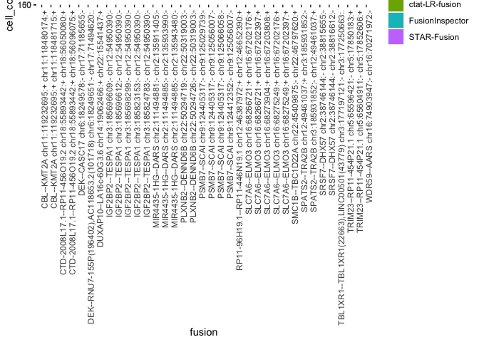

Patient2_analysis
================
bhaas
2023-09-28

``` r
MIN_CELLS = 5
```

# P2 Tum

Only a tumor sample for P2, no matching normal

``` r
# parse fusion evidence support including cell barcode and umi 

Tum_data = read.table("data/Patient2_Tum.Dondi_overian_CTAT_fusions.filtered_cells_and_dedup_umis.tsv.gz", header=T, sep="\t", stringsAsFactors = F) %>%
    filter(! is.na(UMAP_1))

nrow(Tum_data)
```

    ## [1] 9546

``` r
head(Tum_data)
```

    ##     FusionName    LeftBreakpoint  RightBreakpoint     cell_barcode          umi
    ## 1  AACS--UPF3B chr12:125105712:+ chrX:119838527:- GACTTGAACCAGGACA ATGTTGAATGCA
    ## 2  AACS--UPF3B chr12:125105712:+ chrX:119838527:- GACTTGAACCAGGACA CAGAAGATCCCG
    ## 3 AAED1--SSBP2   chr9:96651390:-  chr5:81420533:- CGTGTTAGAAGCATCT AATACGTTTGGC
    ## 4  AAGAB--CMIP  chr15:67254414:- chr16:81607567:+ GGCTTGTCTAAGTGAT CTGAGAGTAGAA
    ## 5  AARS--CTRB2  chr16:70276486:- chr16:75206193:- TGCCACGGATGGTCTA ACATACGATGCC
    ## 6   AARS--LDHD  chr16:70276486:- chr16:75116946:- TGATTACCTTGTACGT CGCCTGTCATTA
    ##                                    read_name         method         barcodes
    ## 1          m64141e_210302_154732/1259457/ccs ctat-LR-fusion TGTCCTGGTTCAAGTC
    ## 2          m64141e_210303_215648/6918968/ccs ctat-LR-fusion TGTCCTGGTTCAAGTC
    ## 3 NS500318:945:HNGM5BGXG:1:12105:20168:11470    STAR-Fusion AGATGCTTCTAACACG
    ## 4           m64141e_210305_041916/958544/ccs ctat-LR-fusion ATCACTTAGACAAGCC
    ## 5          m64141e_210302_154732/9364168/ccs ctat-LR-fusion TAGACCATCCGTGGCA
    ## 6           m64141e_210302_154732/731922/ccs ctat-LR-fusion ACGTACAAGGTAATCA
    ##   celltype_final    UMAP_1    UMAP_2      dataset
    ## 1          HGSOC -5.496790 -1.290143 Patient2_Tum
    ## 2          HGSOC -5.496790 -1.290143 Patient2_Tum
    ## 3          HGSOC -4.653302 -5.180474 Patient2_Tum
    ## 4     T.NK.cells  9.456604  5.150008 Patient2_Tum
    ## 5          HGSOC -6.982332 -3.505437 Patient2_Tum
    ## 6          HGSOC -3.825142 -2.423326 Patient2_Tum

``` r
if (FALSE) {
#    since starF and FI were run at max sensitivity, lets restrict fusions to those identified by ctat-LRF

    Tum_ctat_LRF_fusion_genes = Tum_data %>% filter(method == 'ctat-LR-fusion') %>% select(FusionName) %>% unique() %>% pull(FusionName)

    Tum_data = Tum_data %>% filter(FusionName %in% Tum_ctat_LRF_fusion_genes)

    nrow(Tum_data)

}
```

``` r
fusion_annots = read.csv("data/Patient2.fusion_annots.gz", sep="\t", header=T, stringsAsFactors = F)
```

``` r
# parse UMAP info (from Dondi et al.) 

Tum_umap_data = read.table("data/Patient2_Tum_UMAPcoords.txt.gz", header=T, sep=",") %>%
    rename(barcodes=X)
celltypes = read.table("data/Patient2_Tum.bc_to_celltype.tsv.gz", header=T, sep="\t")

Tum_umap_data = full_join(Tum_umap_data, celltypes, by='barcodes')


# number of cells
num_tumor_cells = nrow(Tum_umap_data) 
message("number tumor cells: ", num_tumor_cells)
```

    ## number tumor cells: 453

``` r
# 453 total cells

Tum_umap_data %>% group_by(celltype_final) %>% tally(name='count_cell_type') %>% mutate(frac_tot_cells = count_cell_type/num_tumor_cells)
```

    ## # A tibble: 8 × 3
    ##   celltype_final    count_cell_type frac_tot_cells
    ##   <chr>                       <int>          <dbl>
    ## 1 B.cells                         4        0.00883
    ## 2 Endothelial.cells               8        0.0177 
    ## 3 Fibroblasts                     6        0.0132 
    ## 4 HGSOC                         208        0.459  
    ## 5 Mesothelial.cells               7        0.0155 
    ## 6 Myeloid.cells                  26        0.0574 
    ## 7 T.NK.cells                    177        0.391  
    ## 8 uncertain                      17        0.0375

``` r
# 208 HGSOC cells  (46% of total cells)
```

``` r
Tum_cell_counts = Tum_data %>% select(FusionName, cell_barcode) %>% unique() %>% 
    group_by(FusionName) %>%
    tally(name='tot_cells_w_fusion') %>%
    mutate(frac_tot_cells=tot_cells_w_fusion/num_tumor_cells)  %>%
    arrange(desc(frac_tot_cells))

left_join(Tum_cell_counts %>% filter(tot_cells_w_fusion >= MIN_CELLS),
          fusion_annots,
          by='FusionName')
```

    ## # A tibble: 27 × 4
    ##    FusionName         tot_cells_w_fusion frac_tot_cells annots                  
    ##    <chr>                           <int>          <dbl> <chr>                   
    ##  1 IGF2BP2--TESPA1                   178         0.393  IGF2BP2--TESPA1:INTERCH…
    ##  2 PSMB7--SCAI                        53         0.117  PSMB7--SCAI:INTRACHROMO…
    ##  3 SRSF7--DHX57                       37         0.0817 SRSF7--DHX57:[DepMap202…
    ##  4 YAF2--RYBP                         33         0.0728 YAF2--RYBP:INTERCHROMOS…
    ##  5 RP5-940J5.9--GAPDH                 28         0.0618 RP5-940J5.9--GAPDH:INTR…
    ##  6 MIR4435-1HG--DARS                  21         0.0464 MIR4435-1HG--DARS:INTRA…
    ##  7 SPATS2--TRA2B                      21         0.0464 SPATS2--TRA2B:INTERCHRO…
    ##  8 CBL--KMT2A                         16         0.0353 CBL--KMT2A:[CBL:Foundat…
    ##  9 PLXNB2--DENND6B                    14         0.0309 PLXNB2--DENND6B:[DepMap…
    ## 10 RMND5B--NHP2                       14         0.0309 RMND5B--NHP2:[RMND5B:On…
    ## # ℹ 17 more rows

``` r
# examine distribution of fusion calls according to cell types

Tum_fusion_frac_cell_types = Tum_data %>% select(FusionName, barcodes, celltype_final) %>% unique() %>%
    group_by(FusionName, celltype_final) %>% tally(name='tot_cells_w_fusion') %>% 
    mutate(frac_fusion_cells=prop.table(tot_cells_w_fusion)) %>%
    arrange(desc(tot_cells_w_fusion))

Tum_fusion_frac_cell_types %>% head()
```

    ## # A tibble: 6 × 4
    ## # Groups:   FusionName [6]
    ##   FusionName        celltype_final tot_cells_w_fusion frac_fusion_cells
    ##   <chr>             <chr>                       <int>             <dbl>
    ## 1 IGF2BP2--TESPA1   HGSOC                         176             0.989
    ## 2 PSMB7--SCAI       HGSOC                          52             0.981
    ## 3 SRSF7--DHX57      HGSOC                          36             0.973
    ## 4 YAF2--RYBP        HGSOC                          24             0.727
    ## 5 MIR4435-1HG--DARS HGSOC                          21             1    
    ## 6 SPATS2--TRA2B     HGSOC                          21             1

``` r
Tum_data %>% select(method) %>% unique()
```

    ##             method
    ## 1   ctat-LR-fusion
    ## 3      STAR-Fusion
    ## 7           Arriba
    ## 14 FusionInspector

``` r
starF_fusions = Tum_data %>% filter(method=="STAR-Fusion")

FI_fusions = Tum_data %>% filter(method=="FusionInspector")

ctat_LRF_fusions = Tum_data %>% filter(method == "ctat-LR-fusion")
```

``` r
# counts of cells according to fusion breakpoint and method for detection

Tum_cell_counts_by_method = read.table("data/Patient2_Tum.Dondi_overian_CTAT_fusions.filtered_cells_and_dedup_umis.cell_counts_by_method.tsv.gz",
                                          header=T, sep="\t", stringsAsFactors = F)


Tum_cell_counts_by_method %>% head()
```

    ##        FusionName   LeftBreakpoint  RightBreakpoint          method
    ## 1 IGF2BP2--TESPA1 chr3:185696612:- chr12:54950390:-  ctat-LR-fusion
    ## 2 IGF2BP2--TESPA1 chr3:185696612:- chr12:54950390:- FusionInspector
    ## 3 IGF2BP2--TESPA1 chr3:185696612:- chr12:54950390:-          Arriba
    ## 4 IGF2BP2--TESPA1 chr3:185823153:- chr12:54950390:-  ctat-LR-fusion
    ## 5    SRSF7--DHX57  chr2:38746144:-  chr2:38815655:-  ctat-LR-fusion
    ## 6     PSMB7--SCAI chr9:124405317:- chr9:125056007:-  ctat-LR-fusion
    ##   celltype_final      dataset cell_counts
    ## 1          HGSOC Patient2_Tum         174
    ## 2          HGSOC Patient2_Tum         138
    ## 3          HGSOC Patient2_Tum          92
    ## 4          HGSOC Patient2_Tum          52
    ## 5          HGSOC Patient2_Tum          35
    ## 6          HGSOC Patient2_Tum          28

``` r
# reorganizing cell counts of fusions by method for comparison

Tum_cell_counts_by_method_spread  = Tum_cell_counts_by_method %>% select(FusionName, LeftBreakpoint, RightBreakpoint, method, celltype_final, cell_counts) %>%
    spread(key=method, value=cell_counts) %>% 
    arrange(desc(`ctat-LR-fusion`)) 


Tum_cell_counts_by_method_spread  %>% filter(`ctat-LR-fusion` >= MIN_CELLS)
```

    ##                      FusionName    LeftBreakpoint   RightBreakpoint
    ## 1               IGF2BP2--TESPA1  chr3:185696612:-  chr12:54950390:-
    ## 2               IGF2BP2--TESPA1  chr3:185823153:-  chr12:54950390:-
    ## 3                  SRSF7--DHX57   chr2:38746144:-   chr2:38815655:-
    ## 4                   PSMB7--SCAI  chr9:124405317:-  chr9:125056007:-
    ## 5                   PSMB7--SCAI  chr9:124405317:-  chr9:125066058:-
    ## 6                 SPATS2--TRA2B  chr12:49461037:+  chr3:185931852:-
    ## 7             MIR4435-1HG--DARS  chr2:111494885:-  chr2:135943480:-
    ## 8               IGF2BP2--TESPA1  chr3:185824783:-  chr12:54950390:-
    ## 9                    CBL--KMT2A chr11:119232695:+ chr11:118480174:+
    ## 10  RP11-96H19.1--RP11-446N19.1  chr12:46387972:+  chr12:46652390:+
    ## 11                  DEK--CASC17   chr6:18249578:-  chr17:71185655:-
    ## 12           RP11-855A2.2--BPTF  chr17:67822409:+  chr17:67945409:+
    ## 13              PLXNB2--DENND6B  chr22:50294719:-  chr22:50319003:-
    ## 14                  PSMB7--SCAI  chr9:124412352:-  chr9:125056007:-
    ## 15                  WDR59--AARS  chr16:74903947:-  chr16:70271972:-
    ## 16        DUXAP10--LA16c-60G3.6  chr14:19062466:+  chr22:15557275:+
    ## 17        TRIM23--RP11-454P21.1   chr5:65596421:-   chr5:17769909:+
    ## 18              PLXNB2--DENND6B  chr22:50294726:-  chr22:50319003:-
    ## 19                SLC7A6--ELMO3  chr16:68275249:+  chr16:67202397:+
    ## 20 CTD-2008L17.1--RP11-456O19.2  chr18:55893442:+  chr18:56096075:+
    ## 21              IGF2BP2--TESPA1  chr3:185698299:-  chr12:54950390:-
    ##    celltype_final Arriba ctat-LR-fusion FusionInspector STAR-Fusion
    ## 1           HGSOC     92            174             138          16
    ## 2           HGSOC      6             52              13           5
    ## 3           HGSOC     NA             35               3           2
    ## 4           HGSOC     NA             28               2           2
    ## 5           HGSOC     NA             26               3           2
    ## 6           HGSOC      5             21              10           6
    ## 7           HGSOC     NA             20               1          NA
    ## 8           HGSOC     NA             17               6           5
    ## 9           HGSOC     NA             15              NA          NA
    ## 10          HGSOC     NA             13               8          NA
    ## 11          HGSOC     NA             11              NA          NA
    ## 12          HGSOC     NA             10              NA          NA
    ## 13          HGSOC     NA              9              NA          NA
    ## 14          HGSOC     NA              9               2           1
    ## 15          HGSOC     NA              8               4           4
    ## 16          HGSOC     NA              7              NA          NA
    ## 17          HGSOC     NA              7              NA          NA
    ## 18          HGSOC     NA              6              NA          NA
    ## 19          HGSOC     NA              6              NA          NA
    ## 20          HGSOC     NA              5               6           4
    ## 21          HGSOC      1              5               1           1

# plot counts of cells for these fusions:

``` r
# examine counts of cells according to fusion and method lmited to those with at least the min number of cells

right_join(Tum_cell_counts_by_method, 
          Tum_cell_counts_by_method %>% 
                         filter(cell_counts >= MIN_CELLS)  %>% 
                         select(FusionName, LeftBreakpoint, RightBreakpoint) 
          ) %>%
              rowwise() %>% mutate(fusion=paste(FusionName, LeftBreakpoint, RightBreakpoint, collapse=":")) %>%
              ggplot(aes(x=fusion, y=cell_counts, fill=method)) + geom_bar(stat='identity', position='dodge') +
              theme(axis.text.x = element_text(angle = 90, hjust = 1))
```

    ## Joining with `by = join_by(FusionName, LeftBreakpoint, RightBreakpoint)`

    ## Warning in right_join(Tum_cell_counts_by_method, Tum_cell_counts_by_method %>% : Detected an unexpected many-to-many relationship between `x` and `y`.
    ## ℹ Row 1 of `x` matches multiple rows in `y`.
    ## ℹ Row 1 of `y` matches multiple rows in `x`.
    ## ℹ If a many-to-many relationship is expected, set `relationship =
    ##   "many-to-many"` to silence this warning.

<!-- -->

# Examine cell type representation by fusions

``` r
# counts of cells containing fusions and fraction of fusions identified according to that cell type


fusion_frac_cell_types = Tum_data %>% select(FusionName, barcodes, celltype_final) %>% unique() %>%
    group_by(FusionName, celltype_final) %>% tally(name='tot_cells_w_fusion') %>% 
    mutate(frac_fusion_cells=prop.table(tot_cells_w_fusion)) %>%
    arrange(desc(tot_cells_w_fusion))

fusion_frac_cell_types %>% filter(tot_cells_w_fusion >= MIN_CELLS)
```

    ## # A tibble: 24 × 4
    ## # Groups:   FusionName [23]
    ##    FusionName                celltype_final tot_cells_w_fusion frac_fusion_cells
    ##    <chr>                     <chr>                       <int>             <dbl>
    ##  1 IGF2BP2--TESPA1           HGSOC                         176             0.989
    ##  2 PSMB7--SCAI               HGSOC                          52             0.981
    ##  3 SRSF7--DHX57              HGSOC                          36             0.973
    ##  4 YAF2--RYBP                HGSOC                          24             0.727
    ##  5 MIR4435-1HG--DARS         HGSOC                          21             1    
    ##  6 SPATS2--TRA2B             HGSOC                          21             1    
    ##  7 RP5-940J5.9--GAPDH        HGSOC                          20             0.714
    ##  8 CBL--KMT2A                HGSOC                          16             1    
    ##  9 PLXNB2--DENND6B           HGSOC                          14             1    
    ## 10 RP11-96H19.1--RP11-446N1… HGSOC                          14             1    
    ## # ℹ 14 more rows

``` r
# restrict to fusions of interest:  those showing up in at least min cells and at least 80% representation within any cell type

fusions_of_interest = fusion_frac_cell_types %>% 
    filter(tot_cells_w_fusion >= MIN_CELLS) %>%
    arrange(desc(tot_cells_w_fusion)) %>%
    filter(frac_fusion_cells >= 0.8)

fusions_of_interest
```

    ## # A tibble: 21 × 4
    ## # Groups:   FusionName [21]
    ##    FusionName                celltype_final tot_cells_w_fusion frac_fusion_cells
    ##    <chr>                     <chr>                       <int>             <dbl>
    ##  1 IGF2BP2--TESPA1           HGSOC                         176             0.989
    ##  2 PSMB7--SCAI               HGSOC                          52             0.981
    ##  3 SRSF7--DHX57              HGSOC                          36             0.973
    ##  4 MIR4435-1HG--DARS         HGSOC                          21             1    
    ##  5 SPATS2--TRA2B             HGSOC                          21             1    
    ##  6 CBL--KMT2A                HGSOC                          16             1    
    ##  7 PLXNB2--DENND6B           HGSOC                          14             1    
    ##  8 RP11-96H19.1--RP11-446N1… HGSOC                          14             1    
    ##  9 RMND5B--NHP2              HGSOC                          12             0.857
    ## 10 DEK--CASC17               HGSOC                          11             1    
    ## # ℹ 11 more rows

``` r
# 17 fusions of interest
```

``` r
# include fusion annotations

fusions_of_interest = left_join(fusions_of_interest,
          fusion_annots)
```

    ## Joining with `by = join_by(FusionName)`

``` r
fusions_of_interest
```

    ## # A tibble: 21 × 5
    ## # Groups:   FusionName [21]
    ##    FusionName         celltype_final tot_cells_w_fusion frac_fusion_cells annots
    ##    <chr>              <chr>                       <int>             <dbl> <chr> 
    ##  1 IGF2BP2--TESPA1    HGSOC                         176             0.989 IGF2B…
    ##  2 PSMB7--SCAI        HGSOC                          52             0.981 PSMB7…
    ##  3 SRSF7--DHX57       HGSOC                          36             0.973 SRSF7…
    ##  4 MIR4435-1HG--DARS  HGSOC                          21             1     MIR44…
    ##  5 SPATS2--TRA2B      HGSOC                          21             1     SPATS…
    ##  6 CBL--KMT2A         HGSOC                          16             1     CBL--…
    ##  7 PLXNB2--DENND6B    HGSOC                          14             1     PLXNB…
    ##  8 RP11-96H19.1--RP1… HGSOC                          14             1     RP11-…
    ##  9 RMND5B--NHP2       HGSOC                          12             0.857 RMND5…
    ## 10 DEK--CASC17        HGSOC                          11             1     DEK--…
    ## # ℹ 11 more rows

``` r
# really 16 total cancer cell enriched fusions, because HOOK2--JUNB is mostly in T.NK.cells
```

``` r
fusions_of_interest = left_join(fusions_of_interest, Tum_cell_counts_by_method_spread,
                                by=c('FusionName',"celltype_final") ) 

fusions_of_interest
```

    ## # A tibble: 45 × 11
    ## # Groups:   FusionName [21]
    ##    FusionName      celltype_final tot_cells_w_fusion frac_fusion_cells annots   
    ##    <chr>           <chr>                       <int>             <dbl> <chr>    
    ##  1 IGF2BP2--TESPA1 HGSOC                         176             0.989 IGF2BP2-…
    ##  2 IGF2BP2--TESPA1 HGSOC                         176             0.989 IGF2BP2-…
    ##  3 IGF2BP2--TESPA1 HGSOC                         176             0.989 IGF2BP2-…
    ##  4 IGF2BP2--TESPA1 HGSOC                         176             0.989 IGF2BP2-…
    ##  5 IGF2BP2--TESPA1 HGSOC                         176             0.989 IGF2BP2-…
    ##  6 PSMB7--SCAI     HGSOC                          52             0.981 PSMB7--S…
    ##  7 PSMB7--SCAI     HGSOC                          52             0.981 PSMB7--S…
    ##  8 PSMB7--SCAI     HGSOC                          52             0.981 PSMB7--S…
    ##  9 PSMB7--SCAI     HGSOC                          52             0.981 PSMB7--S…
    ## 10 SRSF7--DHX57    HGSOC                          36             0.973 SRSF7--D…
    ## # ℹ 35 more rows
    ## # ℹ 6 more variables: LeftBreakpoint <chr>, RightBreakpoint <chr>,
    ## #   Arriba <int>, `ctat-LR-fusion` <int>, FusionInspector <int>,
    ## #   `STAR-Fusion` <int>

``` r
write.table(fusions_of_interest, file="Patient2_Tum.fusions_of_interest.tsv", sep="\t", quote=F, row.names = F)
```

``` r
# examine method of detection and cell counts for just the fusions of interest

Tum_cell_counts_by_method %>% 
    filter(FusionName %in% fusions_of_interest$FusionName) %>%
    select(FusionName, LeftBreakpoint, RightBreakpoint, method, celltype_final, cell_counts) %>%
    spread(key=method, value=cell_counts) %>% 
    arrange(desc(`ctat-LR-fusion`))
```

    ##                                   FusionName    LeftBreakpoint
    ## 1                            IGF2BP2--TESPA1  chr3:185696612:-
    ## 2                            IGF2BP2--TESPA1  chr3:185823153:-
    ## 3                               SRSF7--DHX57   chr2:38746144:-
    ## 4                                PSMB7--SCAI  chr9:124405317:-
    ## 5                                PSMB7--SCAI  chr9:124405317:-
    ## 6                              SPATS2--TRA2B  chr12:49461037:+
    ## 7                          MIR4435-1HG--DARS  chr2:111494885:-
    ## 8                            IGF2BP2--TESPA1  chr3:185824783:-
    ## 9                                 CBL--KMT2A chr11:119232695:+
    ## 10               RP11-96H19.1--RP11-446N19.1  chr12:46387972:+
    ## 11                               DEK--CASC17   chr6:18249578:-
    ## 12                        RP11-855A2.2--BPTF  chr17:67822409:+
    ## 13                           PLXNB2--DENND6B  chr22:50294719:-
    ## 14                               PSMB7--SCAI  chr9:124412352:-
    ## 15                               WDR59--AARS  chr16:74903947:-
    ## 16                     DUXAP10--LA16c-60G3.6  chr14:19062466:+
    ## 17                     TRIM23--RP11-454P21.1   chr5:65596421:-
    ## 18                           PLXNB2--DENND6B  chr22:50294726:-
    ## 19                             SLC7A6--ELMO3  chr16:68275249:+
    ## 20              CTD-2008L17.1--RP11-456O19.2  chr18:55893442:+
    ## 21                           IGF2BP2--TESPA1  chr3:185698299:-
    ## 22                           IGF2BP2--TESPA1  chr3:185696612:-
    ## 23                               PSMB7--SCAI  chr9:124405317:-
    ## 24                              RMND5B--NHP2  chr5:178149680:+
    ## 25                             SLC7A6--ELMO3  chr16:68275249:+
    ## 26                              SRSF7--DHX57   chr2:38746144:-
    ## 27                                CBL--KMT2A chr11:119232695:+
    ## 28                                CBL--KMT2A chr11:119232695:+
    ## 29                               HOOK2--JUNB  chr19:12791944:-
    ## 30                               HOOK2--JUNB  chr19:12791953:-
    ## 31                               HOOK2--JUNB  chr19:12791962:-
    ## 32                               HOOK2--JUNB  chr19:12791962:-
    ## 33                               HOOK2--JUNB  chr19:12792045:-
    ## 34                               HOOK2--JUNB  chr19:12792303:-
    ## 35                           IGF2BP2--TESPA1  chr3:185696612:-
    ## 36                           IGF2BP2--TESPA1  chr3:185823153:-
    ## 37                         MIR4435-1HG--DARS  chr2:111494881:-
    ## 38                         MIR4435-1HG--DARS  chr2:111494885:-
    ## 39                               PSMB7--SCAI  chr9:124405317:-
    ## 40                              RMND5B--NHP2  chr5:178149688:+
    ## 41                             SLC7A6--ELMO3  chr16:68266721:+
    ## 42                             SLC7A6--ELMO3  chr16:68266721:+
    ## 43                             SLC7A6--ELMO3  chr16:68273904:+
    ## 44                              SRSF7--DHX57   chr2:38746144:-
    ## 45                              SRSF7--DHX57   chr2:38746144:-
    ## 46                     TRIM23--RP11-454P21.1   chr5:65604911:-
    ## 47              CTD-2008L17.1--RP11-456O19.2  chr18:55893442:+
    ## 48              CTD-2008L17.1--RP11-456O19.2  chr18:55893442:+
    ## 49 DEK--RNU7-155P(196402),AC118653.2(101718)   chr6:18249651:-
    ## 50                           IGF2BP2--TESPA1  chr3:185696609:-
    ## 51                           IGF2BP2--TESPA1  chr3:185696612:-
    ## 52                              MIF-AS1--MIF  chr22:23895073:-
    ## 53                              MIF-AS1--MIF  chr22:23895073:-
    ## 54                              RMND5B--NHP2  chr5:178149655:+
    ## 55                              RMND5B--NHP2  chr5:178149655:+
    ## 56                              RMND5B--NHP2  chr5:178149655:+
    ## 57                           SMC1B--TBC1D22A  chr22:45409875:-
    ## 58  TBL1XR1--TBL1XR1(22663),LINC00501(43779)  chr3:177197121:-
    ##      RightBreakpoint    celltype_final Arriba ctat-LR-fusion FusionInspector
    ## 1   chr12:54950390:-             HGSOC     92            174             138
    ## 2   chr12:54950390:-             HGSOC      6             52              13
    ## 3    chr2:38815655:-             HGSOC     NA             35               3
    ## 4   chr9:125056007:-             HGSOC     NA             28               2
    ## 5   chr9:125066058:-             HGSOC     NA             26               3
    ## 6   chr3:185931852:-             HGSOC      5             21              10
    ## 7   chr2:135943480:-             HGSOC     NA             20               1
    ## 8   chr12:54950390:-             HGSOC     NA             17               6
    ## 9  chr11:118480174:+             HGSOC     NA             15              NA
    ## 10  chr12:46652390:+             HGSOC     NA             13               8
    ## 11  chr17:71185655:-             HGSOC     NA             11              NA
    ## 12  chr17:67945409:+             HGSOC     NA             10              NA
    ## 13  chr22:50319003:-             HGSOC     NA              9              NA
    ## 14  chr9:125056007:-             HGSOC     NA              9               2
    ## 15  chr16:70271972:-             HGSOC     NA              8               4
    ## 16  chr22:15557275:+             HGSOC     NA              7              NA
    ## 17   chr5:17769909:+             HGSOC     NA              7              NA
    ## 18  chr22:50319003:-             HGSOC     NA              6              NA
    ## 19  chr16:67202397:+             HGSOC     NA              6              NA
    ## 20  chr18:56096075:+             HGSOC     NA              5               6
    ## 21  chr12:54950390:-             HGSOC      1              5               1
    ## 22  chr12:54950390:-         uncertain      1              3               1
    ## 23  chr9:125029739:-             HGSOC     NA              2              NA
    ## 24  chr5:178153830:-             HGSOC     NA              2              NA
    ## 25  chr16:67202176:+             HGSOC     NA              2              NA
    ## 26   chr2:38816612:-             HGSOC     NA              2              NA
    ## 27 chr11:118480174:+         uncertain     NA              1              NA
    ## 28 chr11:118481715:+             HGSOC     NA              1              NA
    ## 29  chr19:12759203:-        T.NK.cells     NA              1              NA
    ## 30  chr19:12759211:-        T.NK.cells     NA              1              NA
    ## 31  chr19:12758962:-             HGSOC     NA              1              NA
    ## 32  chr19:12758962:-        T.NK.cells     NA              1              NA
    ## 33  chr19:12759115:-        T.NK.cells     NA              1              NA
    ## 34  chr19:12758556:-        T.NK.cells     NA              1              NA
    ## 35  chr12:54950390:-     Myeloid.cells     NA              1              NA
    ## 36  chr12:54950390:-         uncertain     NA              1              NA
    ## 37  chr2:135911405:-             HGSOC     NA              1              NA
    ## 38  chr2:135933990:-             HGSOC     NA              1              NA
    ## 39  chr9:125066058:-        T.NK.cells     NA              1              NA
    ## 40  chr5:178153828:-             HGSOC     NA              1              NA
    ## 41  chr16:67202176:+             HGSOC     NA              1              NA
    ## 42  chr16:67202397:+             HGSOC     NA              1              NA
    ## 43  chr16:67203808:+             HGSOC     NA              1              NA
    ## 44   chr2:38815655:- Mesothelial.cells     NA              1              NA
    ## 45   chr2:38815655:-         uncertain     NA              1              NA
    ## 46   chr5:17852606:+             HGSOC     NA              1              NA
    ## 47  chr18:56050080:+             HGSOC     NA             NA               4
    ## 48  chr18:56096075:+         uncertain     NA             NA               1
    ## 49  chr17:71494620:.             HGSOC      5             NA              NA
    ## 50  chr12:54950390:-             HGSOC     NA             NA               3
    ## 51  chr12:54950390:- Endothelial.cells      1             NA               1
    ## 52  chr22:23895101:+             HGSOC     NA             NA               7
    ## 53  chr22:23895101:+        T.NK.cells     NA             NA               1
    ## 54  chr5:178149642:-             HGSOC     NA             NA              10
    ## 55  chr5:178149642:- Mesothelial.cells     NA             NA               1
    ## 56  chr5:178149642:-        T.NK.cells     NA             NA               1
    ## 57  chr22:46797620:+             HGSOC      6             NA              NA
    ## 58  chr3:177250663:.             HGSOC      6             NA              NA
    ##    STAR-Fusion
    ## 1           16
    ## 2            5
    ## 3            2
    ## 4            2
    ## 5            2
    ## 6            6
    ## 7           NA
    ## 8            5
    ## 9           NA
    ## 10          NA
    ## 11          NA
    ## 12          NA
    ## 13          NA
    ## 14           1
    ## 15           4
    ## 16          NA
    ## 17          NA
    ## 18          NA
    ## 19          NA
    ## 20           4
    ## 21           1
    ## 22          NA
    ## 23          NA
    ## 24          NA
    ## 25          NA
    ## 26          NA
    ## 27          NA
    ## 28          NA
    ## 29          NA
    ## 30          NA
    ## 31          NA
    ## 32          NA
    ## 33          NA
    ## 34          NA
    ## 35          NA
    ## 36          NA
    ## 37          NA
    ## 38          NA
    ## 39          NA
    ## 40          NA
    ## 41          NA
    ## 42          NA
    ## 43          NA
    ## 44          NA
    ## 45          NA
    ## 46          NA
    ## 47           1
    ## 48          NA
    ## 49          NA
    ## 50          NA
    ## 51           1
    ## 52          NA
    ## 53          NA
    ## 54          NA
    ## 55          NA
    ## 56          NA
    ## 57          NA
    ## 58          NA

``` r
# plotting counts of cells according to method for fusions of interest

Tum_cell_counts_by_method %>% 
            filter(FusionName %in% fusions_of_interest$FusionName) %>%
            select(FusionName, LeftBreakpoint, RightBreakpoint, cell_counts, method) %>%
              rowwise() %>% mutate(fusion=paste(FusionName, LeftBreakpoint, RightBreakpoint, collapse=":")) %>%
              ggplot(aes(x=fusion, y=cell_counts, fill=method)) + 
                 geom_bar(stat='identity', position='dodge') +
                 theme(axis.text.x = element_text(angle = 90, hjust = 1))
```

<!-- -->

# Examine fusions of interest in UMAPs

``` r
# base umap plot coloring by annotated cell type

baseplot = Tum_umap_data %>% ggplot(aes(x=UMAP_1, y=UMAP_2)) + geom_point(aes(color=celltype_final))

baseplot
```

    ## Warning: Removed 34 rows containing missing values (`geom_point()`).

<!-- -->

``` r
# Examine each fusion of interest according to UMAP cell positioning

x = 0

plots = list()

for (fusion in  fusions_of_interest$FusionName) {
    
    p = baseplot + geom_point(data=Tum_data %>% filter(FusionName == fusion) %>% select(UMAP_1, UMAP_2) %>% unique(), 
                              color='red') + 
        ggtitle(paste("Patient 2 Tumor, Fusion: ", fusion) )
    
    plot(p)   
    
    x = x+1
    plots[[x]] = p
}
```

    ## Warning: Removed 34 rows containing missing values (`geom_point()`).

<!-- -->

    ## Warning: Removed 34 rows containing missing values (`geom_point()`).

<!-- -->

    ## Warning: Removed 34 rows containing missing values (`geom_point()`).

<!-- -->

    ## Warning: Removed 34 rows containing missing values (`geom_point()`).

<!-- -->

    ## Warning: Removed 34 rows containing missing values (`geom_point()`).

<!-- -->

    ## Warning: Removed 34 rows containing missing values (`geom_point()`).

<!-- -->

    ## Warning: Removed 34 rows containing missing values (`geom_point()`).

<!-- -->

    ## Warning: Removed 34 rows containing missing values (`geom_point()`).

<!-- -->

    ## Warning: Removed 34 rows containing missing values (`geom_point()`).

<!-- -->

    ## Warning: Removed 34 rows containing missing values (`geom_point()`).

<!-- -->

    ## Warning: Removed 34 rows containing missing values (`geom_point()`).

<!-- -->

    ## Warning: Removed 34 rows containing missing values (`geom_point()`).

<!-- -->

    ## Warning: Removed 34 rows containing missing values (`geom_point()`).

<!-- -->

    ## Warning: Removed 34 rows containing missing values (`geom_point()`).

<!-- -->

    ## Warning: Removed 34 rows containing missing values (`geom_point()`).

<!-- -->

    ## Warning: Removed 34 rows containing missing values (`geom_point()`).

<!-- -->

    ## Warning: Removed 34 rows containing missing values (`geom_point()`).

<!-- -->

    ## Warning: Removed 34 rows containing missing values (`geom_point()`).

<!-- -->

    ## Warning: Removed 34 rows containing missing values (`geom_point()`).

<!-- -->

    ## Warning: Removed 34 rows containing missing values (`geom_point()`).

<!-- -->

    ## Warning: Removed 34 rows containing missing values (`geom_point()`).

<!-- -->

    ## Warning: Removed 34 rows containing missing values (`geom_point()`).

<!-- -->

    ## Warning: Removed 34 rows containing missing values (`geom_point()`).

<!-- -->

    ## Warning: Removed 34 rows containing missing values (`geom_point()`).

<!-- -->

    ## Warning: Removed 34 rows containing missing values (`geom_point()`).

<!-- -->

    ## Warning: Removed 34 rows containing missing values (`geom_point()`).

<!-- -->

    ## Warning: Removed 34 rows containing missing values (`geom_point()`).

<!-- -->

    ## Warning: Removed 34 rows containing missing values (`geom_point()`).

<!-- -->

    ## Warning: Removed 34 rows containing missing values (`geom_point()`).

<!-- -->

    ## Warning: Removed 34 rows containing missing values (`geom_point()`).

<!-- -->

    ## Warning: Removed 34 rows containing missing values (`geom_point()`).

<!-- -->

    ## Warning: Removed 34 rows containing missing values (`geom_point()`).

<!-- -->

    ## Warning: Removed 34 rows containing missing values (`geom_point()`).

<!-- -->

    ## Warning: Removed 34 rows containing missing values (`geom_point()`).

<!-- -->

    ## Warning: Removed 34 rows containing missing values (`geom_point()`).

<!-- -->

    ## Warning: Removed 34 rows containing missing values (`geom_point()`).

<!-- -->

    ## Warning: Removed 34 rows containing missing values (`geom_point()`).

<!-- -->

    ## Warning: Removed 34 rows containing missing values (`geom_point()`).

<!-- -->

    ## Warning: Removed 34 rows containing missing values (`geom_point()`).

<!-- -->

    ## Warning: Removed 34 rows containing missing values (`geom_point()`).

<!-- -->

    ## Warning: Removed 34 rows containing missing values (`geom_point()`).

<!-- -->

    ## Warning: Removed 34 rows containing missing values (`geom_point()`).

<!-- -->

    ## Warning: Removed 34 rows containing missing values (`geom_point()`).

<!-- -->

    ## Warning: Removed 34 rows containing missing values (`geom_point()`).

<!-- -->

    ## Warning: Removed 34 rows containing missing values (`geom_point()`).

<!-- -->

``` r
# make a pdf containing these plots

pdf("Patient2_Tum.fusions_of_interest.pdf")
for (p in plots) {
    plot(p)
}
```

    ## Warning: Removed 34 rows containing missing values (`geom_point()`).
    ## Removed 34 rows containing missing values (`geom_point()`).
    ## Removed 34 rows containing missing values (`geom_point()`).
    ## Removed 34 rows containing missing values (`geom_point()`).
    ## Removed 34 rows containing missing values (`geom_point()`).
    ## Removed 34 rows containing missing values (`geom_point()`).
    ## Removed 34 rows containing missing values (`geom_point()`).
    ## Removed 34 rows containing missing values (`geom_point()`).
    ## Removed 34 rows containing missing values (`geom_point()`).
    ## Removed 34 rows containing missing values (`geom_point()`).
    ## Removed 34 rows containing missing values (`geom_point()`).
    ## Removed 34 rows containing missing values (`geom_point()`).
    ## Removed 34 rows containing missing values (`geom_point()`).
    ## Removed 34 rows containing missing values (`geom_point()`).
    ## Removed 34 rows containing missing values (`geom_point()`).
    ## Removed 34 rows containing missing values (`geom_point()`).
    ## Removed 34 rows containing missing values (`geom_point()`).
    ## Removed 34 rows containing missing values (`geom_point()`).
    ## Removed 34 rows containing missing values (`geom_point()`).
    ## Removed 34 rows containing missing values (`geom_point()`).
    ## Removed 34 rows containing missing values (`geom_point()`).
    ## Removed 34 rows containing missing values (`geom_point()`).
    ## Removed 34 rows containing missing values (`geom_point()`).
    ## Removed 34 rows containing missing values (`geom_point()`).
    ## Removed 34 rows containing missing values (`geom_point()`).
    ## Removed 34 rows containing missing values (`geom_point()`).
    ## Removed 34 rows containing missing values (`geom_point()`).
    ## Removed 34 rows containing missing values (`geom_point()`).
    ## Removed 34 rows containing missing values (`geom_point()`).
    ## Removed 34 rows containing missing values (`geom_point()`).
    ## Removed 34 rows containing missing values (`geom_point()`).
    ## Removed 34 rows containing missing values (`geom_point()`).
    ## Removed 34 rows containing missing values (`geom_point()`).
    ## Removed 34 rows containing missing values (`geom_point()`).
    ## Removed 34 rows containing missing values (`geom_point()`).
    ## Removed 34 rows containing missing values (`geom_point()`).
    ## Removed 34 rows containing missing values (`geom_point()`).
    ## Removed 34 rows containing missing values (`geom_point()`).
    ## Removed 34 rows containing missing values (`geom_point()`).
    ## Removed 34 rows containing missing values (`geom_point()`).
    ## Removed 34 rows containing missing values (`geom_point()`).
    ## Removed 34 rows containing missing values (`geom_point()`).
    ## Removed 34 rows containing missing values (`geom_point()`).
    ## Removed 34 rows containing missing values (`geom_point()`).
    ## Removed 34 rows containing missing values (`geom_point()`).

``` r
dev.off()
```

    ## quartz_off_screen 
    ##                 2

``` r
# examine counts of cells by method for the fusions of interest

tumor_cell_counts = Tum_data %>% filter(FusionName %in%  fusions_of_interest$FusionName) %>% 
        select(FusionName, method, barcodes) %>% unique() %>%
        group_by(FusionName, method) %>% tally(name='cell_counts')


tumor_cell_counts %>% spread(key=method, value=cell_counts) %>% arrange(desc(`ctat-LR-fusion`))
```

    ## # A tibble: 21 × 5
    ## # Groups:   FusionName [21]
    ##    FusionName              Arriba `ctat-LR-fusion` FusionInspector `STAR-Fusion`
    ##    <chr>                    <int>            <int>           <int>         <int>
    ##  1 IGF2BP2--TESPA1             93              176             141            26
    ##  2 PSMB7--SCAI                 NA               51               7             5
    ##  3 SRSF7--DHX57                NA               37               3             2
    ##  4 MIR4435-1HG--DARS           NA               21               1            NA
    ##  5 SPATS2--TRA2B                5               21              10             6
    ##  6 CBL--KMT2A                  NA               16              NA            NA
    ##  7 PLXNB2--DENND6B             NA               14              NA            NA
    ##  8 RP11-96H19.1--RP11-446…     NA               13               8            NA
    ##  9 DEK--CASC17                 NA               11              NA            NA
    ## 10 SLC7A6--ELMO3               NA               11              NA            NA
    ## # ℹ 11 more rows

``` r
# plot counts of cells by method for fusions of interest

tumor_cell_counts %>%
              ggplot(aes(x=FusionName, y=cell_counts, fill=method)) + geom_bar(stat='identity', position='dodge') +
              theme(axis.text.x = element_text(angle = 90, hjust = 1)) +
    ggtitle("Patient2_Tum Fusions of Interest: Cell Counts")
```

<!-- -->

``` r
# Examine Venn for cells detected according to combinations of methods.

tumor_cell_counts_by_methods = Tum_data %>% filter(FusionName %in%  fusions_of_interest$FusionName) %>% 
        select(FusionName, method, barcodes) %>% unique() %>%
        group_by(FusionName, barcodes) %>% 
        arrange(method) %>%
        mutate(methods = paste(method, collapse=',')) %>%
        ungroup() %>%
        select(FusionName, methods, barcodes) %>% group_by(FusionName, methods) %>% tally()


tumor_cell_counts_by_methods 
```

    ## # A tibble: 45 × 3
    ## # Groups:   FusionName [21]
    ##    FusionName                                methods                           n
    ##    <chr>                                     <chr>                         <int>
    ##  1 CBL--KMT2A                                ctat-LR-fusion                   16
    ##  2 CTD-2008L17.1--RP11-456O19.2              FusionInspector,STAR-Fusion       6
    ##  3 CTD-2008L17.1--RP11-456O19.2              FusionInspector,STAR-Fusion,…     6
    ##  4 CTD-2008L17.1--RP11-456O19.2              FusionInspector,ctat-LR-fusi…     4
    ##  5 CTD-2008L17.1--RP11-456O19.2              ctat-LR-fusion                    1
    ##  6 DEK--CASC17                               ctat-LR-fusion                   11
    ##  7 DEK--RNU7-155P(196402),AC118653.2(101718) Arriba                            5
    ##  8 DUXAP10--LA16c-60G3.6                     ctat-LR-fusion                    7
    ##  9 HOOK2--JUNB                               ctat-LR-fusion                    6
    ## 10 IGF2BP2--TESPA1                           Arriba,FusionInspector,STAR-…     3
    ## # ℹ 35 more rows

# Examine specific fusions of interest

## IGF2BP2–TESPA1

``` r
tumor_cell_counts_by_methods %>% filter(FusionName == "IGF2BP2--TESPA1")
```

    ## # A tibble: 7 × 3
    ## # Groups:   FusionName [1]
    ##   FusionName      methods                                               n
    ##   <chr>           <chr>                                             <int>
    ## 1 IGF2BP2--TESPA1 Arriba,FusionInspector,STAR-Fusion                    3
    ## 2 IGF2BP2--TESPA1 Arriba,FusionInspector,STAR-Fusion,ctat-LR-fusion    88
    ## 3 IGF2BP2--TESPA1 Arriba,FusionInspector,ctat-LR-fusion               210
    ## 4 IGF2BP2--TESPA1 FusionInspector,STAR-Fusion                           2
    ## 5 IGF2BP2--TESPA1 FusionInspector,STAR-Fusion,ctat-LR-fusion            6
    ## 6 IGF2BP2--TESPA1 FusionInspector,ctat-LR-fusion                       90
    ## 7 IGF2BP2--TESPA1 ctat-LR-fusion                                       37

``` r
Tum_cell_counts_by_method %>% 
    filter(FusionName=="IGF2BP2--TESPA1") %>%
    select(FusionName, LeftBreakpoint, RightBreakpoint, method, celltype_final, cell_counts) %>%
    spread(key=method, value=cell_counts) %>% 
    arrange(desc(`ctat-LR-fusion`), desc(FusionInspector))
```

    ##        FusionName   LeftBreakpoint  RightBreakpoint    celltype_final Arriba
    ## 1 IGF2BP2--TESPA1 chr3:185696612:- chr12:54950390:-             HGSOC     92
    ## 2 IGF2BP2--TESPA1 chr3:185823153:- chr12:54950390:-             HGSOC      6
    ## 3 IGF2BP2--TESPA1 chr3:185824783:- chr12:54950390:-             HGSOC     NA
    ## 4 IGF2BP2--TESPA1 chr3:185698299:- chr12:54950390:-             HGSOC      1
    ## 5 IGF2BP2--TESPA1 chr3:185696612:- chr12:54950390:-         uncertain      1
    ## 6 IGF2BP2--TESPA1 chr3:185696612:- chr12:54950390:-     Myeloid.cells     NA
    ## 7 IGF2BP2--TESPA1 chr3:185823153:- chr12:54950390:-         uncertain     NA
    ## 8 IGF2BP2--TESPA1 chr3:185696609:- chr12:54950390:-             HGSOC     NA
    ## 9 IGF2BP2--TESPA1 chr3:185696612:- chr12:54950390:- Endothelial.cells      1
    ##   ctat-LR-fusion FusionInspector STAR-Fusion
    ## 1            174             138          16
    ## 2             52              13           5
    ## 3             17               6           5
    ## 4              5               1           1
    ## 5              3               1          NA
    ## 6              1              NA          NA
    ## 7              1              NA          NA
    ## 8             NA               3          NA
    ## 9             NA               1           1

## SPATS2–TRA2B

``` r
tumor_cell_counts_by_methods %>% filter(FusionName == "SPATS2--TRA2B")
```

    ## # A tibble: 5 × 3
    ## # Groups:   FusionName [1]
    ##   FusionName    methods                                               n
    ##   <chr>         <chr>                                             <int>
    ## 1 SPATS2--TRA2B Arriba,FusionInspector,STAR-Fusion,ctat-LR-fusion    16
    ## 2 SPATS2--TRA2B Arriba,FusionInspector,ctat-LR-fusion                 3
    ## 3 SPATS2--TRA2B FusionInspector,STAR-Fusion,ctat-LR-fusion            6
    ## 4 SPATS2--TRA2B FusionInspector,ctat-LR-fusion                        6
    ## 5 SPATS2--TRA2B ctat-LR-fusion                                       11

``` r
Tum_cell_counts_by_method %>% 
    filter(FusionName=="SPATS2--TRA2B") %>%
    select(FusionName, LeftBreakpoint, RightBreakpoint, method, celltype_final, cell_counts) %>%
    spread(key=method, value=cell_counts) %>% 
    arrange(desc(`ctat-LR-fusion`), desc(FusionInspector))
```

    ##      FusionName   LeftBreakpoint  RightBreakpoint celltype_final Arriba
    ## 1 SPATS2--TRA2B chr12:49461037:+ chr3:185931852:-          HGSOC      5
    ##   ctat-LR-fusion FusionInspector STAR-Fusion
    ## 1             21              10           6

## Are SPATS2–TRA2B and IGF2BP2–TESPA1 found expressed in the same tumor cells?

``` r
Tum_data %>% filter(FusionName %in% c('SPATS2--TRA2B', 'IGF2BP2--TESPA1')) %>%
    select(FusionName, cell_barcode) %>%
    unique() %>%
    group_by(cell_barcode) %>% 
    arrange(FusionName) %>%
    mutate(fusion_names = paste(FusionName, collapse=",")) %>%
    ungroup() %>%
    select(cell_barcode, fusion_names) %>% unique() %>%
    group_by(fusion_names) %>% tally()
```

    ## # A tibble: 3 × 2
    ##   fusion_names                      n
    ##   <chr>                         <int>
    ## 1 IGF2BP2--TESPA1                 158
    ## 2 IGF2BP2--TESPA1,SPATS2--TRA2B    20
    ## 3 SPATS2--TRA2B                     1

# Are there interesting fusions in non-tumor cells?

``` r
fusion_frac_cell_types %>% filter(celltype_final != "HGSOC") %>% arrange(desc(tot_cells_w_fusion)) %>% head()
```

    ## # A tibble: 6 × 4
    ## # Groups:   FusionName [6]
    ##   FusionName         celltype_final tot_cells_w_fusion frac_fusion_cells
    ##   <chr>              <chr>                       <int>             <dbl>
    ## 1 HOOK2--JUNB        T.NK.cells                      5             0.833
    ## 2 RP5-940J5.9--GAPDH T.NK.cells                      5             0.179
    ## 3 YAF2--RYBP         T.NK.cells                      4             0.121
    ## 4 CRB3--DENND1C      T.NK.cells                      2             1    
    ## 5 DIAPH1--FYB        T.NK.cells                      2             1    
    ## 6 LRRFIP1--ARHGAP15  T.NK.cells                      2             1

No fusions showing up in non-HGSOC cells at the min cell cutoff. The top
two have 4 cells and are found mostly in HGSOC. Besides those, there’s a
max of 2 cells having any other fusion transcript.

``` r
report_on_fusion = function(fusion_name) {
    
    print(Tum_cell_counts_by_method_spread %>% filter(FusionName == fusion_name))
    
    print(Tum_cell_counts %>% filter(FusionName == fusion_name) %>% mutate(type="Tum"))
    
    print(Tum_fusion_frac_cell_types %>% filter(FusionName == fusion_name) %>% mutate(type="Tum"))
    
}
```

# queries on specific fusions found in normal samples

``` r
report_on_fusion("RP11-444D3.1--SOX5")
```

    ##           FusionName   LeftBreakpoint  RightBreakpoint celltype_final Arriba
    ## 1 RP11-444D3.1--SOX5 chr12:24276141:- chr12:23896024:-          HGSOC     NA
    ## 2 RP11-444D3.1--SOX5 chr12:24276141:- chr12:23896024:-     T.NK.cells     NA
    ##   ctat-LR-fusion FusionInspector STAR-Fusion
    ## 1              1              NA          NA
    ## 2              1              NA          NA
    ## # A tibble: 1 × 4
    ##   FusionName         tot_cells_w_fusion frac_tot_cells type 
    ##   <chr>                           <int>          <dbl> <chr>
    ## 1 RP11-444D3.1--SOX5                  2        0.00442 Tum  
    ## # A tibble: 2 × 5
    ## # Groups:   FusionName [1]
    ##   FusionName         celltype_final tot_cells_w_fusion frac_fusion_cells type 
    ##   <chr>              <chr>                       <int>             <dbl> <chr>
    ## 1 RP11-444D3.1--SOX5 HGSOC                           1               0.5 Tum  
    ## 2 RP11-444D3.1--SOX5 T.NK.cells                      1               0.5 Tum

``` r
report_on_fusion("RP11-208G20.2--PSPHP1")
```

    ## [1] FusionName      LeftBreakpoint  RightBreakpoint celltype_final 
    ## [5] Arriba          ctat-LR-fusion  FusionInspector STAR-Fusion    
    ## <0 rows> (or 0-length row.names)
    ## # A tibble: 0 × 4
    ## # ℹ 4 variables: FusionName <chr>, tot_cells_w_fusion <int>,
    ## #   frac_tot_cells <dbl>, type <chr>
    ## # A tibble: 0 × 5
    ## # Groups:   FusionName [0]
    ## # ℹ 5 variables: FusionName <chr>, celltype_final <chr>,
    ## #   tot_cells_w_fusion <int>, frac_fusion_cells <dbl>, type <chr>

``` r
report_on_fusion("PSMB7--SCAI")
```

    ##    FusionName   LeftBreakpoint  RightBreakpoint celltype_final Arriba
    ## 1 PSMB7--SCAI chr9:124405317:- chr9:125056007:-          HGSOC     NA
    ## 2 PSMB7--SCAI chr9:124405317:- chr9:125066058:-          HGSOC     NA
    ## 3 PSMB7--SCAI chr9:124412352:- chr9:125056007:-          HGSOC     NA
    ## 4 PSMB7--SCAI chr9:124405317:- chr9:125029739:-          HGSOC     NA
    ## 5 PSMB7--SCAI chr9:124405317:- chr9:125066058:-     T.NK.cells     NA
    ##   ctat-LR-fusion FusionInspector STAR-Fusion
    ## 1             28               2           2
    ## 2             26               3           2
    ## 3              9               2           1
    ## 4              2              NA          NA
    ## 5              1              NA          NA
    ## # A tibble: 1 × 4
    ##   FusionName  tot_cells_w_fusion frac_tot_cells type 
    ##   <chr>                    <int>          <dbl> <chr>
    ## 1 PSMB7--SCAI                 53          0.117 Tum  
    ## # A tibble: 2 × 5
    ## # Groups:   FusionName [1]
    ##   FusionName  celltype_final tot_cells_w_fusion frac_fusion_cells type 
    ##   <chr>       <chr>                       <int>             <dbl> <chr>
    ## 1 PSMB7--SCAI HGSOC                          52            0.981  Tum  
    ## 2 PSMB7--SCAI T.NK.cells                      1            0.0189 Tum

# any fusions found only via short read data?

``` r
fusions_with_long_read = Tum_data %>% filter(method == "ctat-LR-fusion") %>% select(FusionName) %>% unique()

short_read_only_fusions = Tum_data %>% filter( ! FusionName %in% fusions_with_long_read$FusionName) %>% select(FusionName, method) %>% unique() %>%
    group_by(FusionName) %>% mutate(methods = paste(collapse=",", method), num_methods = n()) %>%
    select(FusionName, methods, num_methods) %>% unique() %>% arrange(desc(num_methods)) 

short_read_only_fusions
```

    ## # A tibble: 454 × 3
    ## # Groups:   FusionName [454]
    ##    FusionName           methods                            num_methods
    ##    <chr>                <chr>                                    <int>
    ##  1 ADAM15--CD9          STAR-Fusion,FusionInspector,Arriba           3
    ##  2 RECK--BUB1B          STAR-Fusion,FusionInspector,Arriba           3
    ##  3 ABCA2--PDXK          STAR-Fusion,FusionInspector                  2
    ##  4 ABHD17B--TMEM2       STAR-Fusion,FusionInspector                  2
    ##  5 ACIN1--SFPQ          STAR-Fusion,FusionInspector                  2
    ##  6 ACOX1--EIF4G1        STAR-Fusion,FusionInspector                  2
    ##  7 ACTG1--RP11-467I20.3 STAR-Fusion,FusionInspector                  2
    ##  8 AGRN--CDK2AP2        STAR-Fusion,FusionInspector                  2
    ##  9 AKAP12--RN7SKP30     STAR-Fusion,FusionInspector                  2
    ## 10 AKT2--P4HB           STAR-Fusion,FusionInspector                  2
    ## # ℹ 444 more rows

``` r
# any short-read-only fusions relevant to cancer?

left_join(short_read_only_fusions %>% filter(num_methods > 1), # no Om sample - restrict to multiple short read progs support
          Tum_data, by='FusionName') %>% 
    select(FusionName, cell_barcode, celltype_final) %>% unique() %>%
    group_by(FusionName, celltype_final) %>% tally(name='num_cells') %>% 
    mutate(frac_fusion_cells=prop.table(num_cells)) %>%
    filter(celltype_final == "HGSOC" & num_cells >= MIN_CELLS & frac_fusion_cells >= 0.8) %>%
    arrange(desc(num_cells))
```

    ## # A tibble: 0 × 4
    ## # Groups:   FusionName [0]
    ## # ℹ 4 variables: FusionName <chr>, celltype_final <chr>, num_cells <int>,
    ## #   frac_fusion_cells <dbl>

``` r
# 0
```
