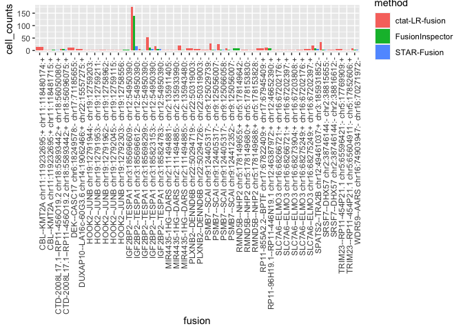

Patient2_analysis
================
bhaas
2023-09-28

``` r
MIN_CELLS = 5
```

# P2 Tum

Only a tumor sample for P2, no matching normal

``` r
# parse fusion evidence support including cell barcode and umi 

Tum_data = read.table("data/Patient2_Tum.Dondi_overian_CTAT_fusions.filtered_cells_and_dedup_umis.tsv.gz", header=T, sep="\t", stringsAsFactors = F) %>%
    filter(! is.na(UMAP_1))

nrow(Tum_data)
```

    ## [1] 6920

``` r
head(Tum_data)
```

    ##        FusionName    LeftBreakpoint  RightBreakpoint     cell_barcode
    ## 1    AAED1--SSBP2   chr9:96651390:-  chr5:81420533:- CGTGTTAGAAGCATCT
    ## 2     AAGAB--CMIP  chr15:67254414:- chr16:81607567:+ GGCTTGTCTAAGTGAT
    ## 3     AARS--CTRB2  chr16:70276486:- chr16:75206193:- TGCCACGGATGGTCTA
    ## 4 AASDHPPT--COPS2 chr11:106079692:+ chr15:49145078:- ATAGCGACTTTTGACG
    ## 5     ABCA2--PDXK  chr9:137015509:- chr21:43756037:+ CATCGGCGACCCGATG
    ## 6     ABCA2--PDXK  chr9:137015509:- chr21:43756037:+ CATCGGCGACCCGATG
    ##            umi                                  read_name          method
    ## 1 AATACGTTTGGC NS500318:945:HNGM5BGXG:1:12105:20168:11470     STAR-Fusion
    ## 2 CTGAGAGTAGAA           m64141e_210305_041916/958544/ccs  ctat-LR-fusion
    ## 3 ACATACGATGCC          m64141e_210302_154732/9364168/ccs  ctat-LR-fusion
    ## 4 CGTATTGCCAAT           m64141e_210303_215648/514974/ccs  ctat-LR-fusion
    ## 5 CCTATGCCATTT  NS500318:945:HNGM5BGXG:4:21511:22685:9793     STAR-Fusion
    ## 6 CCTATGCCATTT  NS500318:945:HNGM5BGXG:4:21511:22685:9793 FusionInspector
    ##           barcodes    celltype_final    UMAP_1    UMAP_2      dataset
    ## 1 AGATGCTTCTAACACG             HGSOC -4.653302 -5.180474 Patient2_Tum
    ## 2 ATCACTTAGACAAGCC        T.NK.cells  9.456604  5.150008 Patient2_Tum
    ## 3 TAGACCATCCGTGGCA             HGSOC -6.982332 -3.505437 Patient2_Tum
    ## 4 CGTCAAAAGTCGCTAT Mesothelial.cells -3.920792 -4.321813 Patient2_Tum
    ## 5 CATCGGGTCGCCGATG             HGSOC -7.111355 -3.121639 Patient2_Tum
    ## 6 CATCGGGTCGCCGATG             HGSOC -7.111355 -3.121639 Patient2_Tum

``` r
# since starF and FI were run at max sensitivity, lets restrict fusions to those identified by ctat-LRF

Tum_ctat_LRF_fusion_genes = Tum_data %>% filter(method == 'ctat-LR-fusion') %>% select(FusionName) %>% unique() %>% pull(FusionName)

Tum_data = Tum_data %>% filter(FusionName %in% Tum_ctat_LRF_fusion_genes)

nrow(Tum_data)
```

    ## [1] 6325

``` r
fusion_annots = read.table("data/Patient2.fusion_annots.gz", sep="\t", header=T, stringsAsFactors = F)
```

``` r
# parse UMAP info (from Dondi et al.) 

Tum_umap_data = read.table("data/Patient2_Tum_UMAPcoords.txt.gz", header=T, sep=",") %>%
    rename(barcodes=X)
celltypes = read.table("data/Patient2_Tum.bc_to_celltype.tsv.gz", header=T, sep="\t")

Tum_umap_data = full_join(Tum_umap_data, celltypes, by='barcodes')


# number of cells
num_tumor_cells = nrow(Tum_umap_data) 
message("number tumor cells: ", num_tumor_cells)
```

    ## number tumor cells: 453

``` r
# 453 total cells

Tum_umap_data %>% group_by(celltype_final) %>% tally(name='count_cell_type') %>% mutate(frac_tot_cells = count_cell_type/num_tumor_cells)
```

    ## # A tibble: 8 × 3
    ##   celltype_final    count_cell_type frac_tot_cells
    ##   <chr>                       <int>          <dbl>
    ## 1 B.cells                         4        0.00883
    ## 2 Endothelial.cells               8        0.0177 
    ## 3 Fibroblasts                     6        0.0132 
    ## 4 HGSOC                         208        0.459  
    ## 5 Mesothelial.cells               7        0.0155 
    ## 6 Myeloid.cells                  26        0.0574 
    ## 7 T.NK.cells                    177        0.391  
    ## 8 uncertain                      17        0.0375

``` r
# 208 HGSOC cells  (46% of total cells)
```

``` r
Tum_cell_counts = Tum_data %>% select(FusionName, cell_barcode) %>% unique() %>% 
    group_by(FusionName) %>%
    tally(name='tot_cells_w_fusion') %>%
    mutate(frac_tot_cells=tot_cells_w_fusion/num_tumor_cells)  %>%
    arrange(desc(frac_tot_cells))

left_join(Tum_cell_counts %>% filter(tot_cells_w_fusion >= MIN_CELLS),
          fusion_annots,
          by='FusionName')
```

    ## # A tibble: 14 × 4
    ##    FusionName                   tot_cells_w_fusion frac_tot_cells annots        
    ##    <chr>                                     <int>          <dbl> <chr>         
    ##  1 IGF2BP2--TESPA1                             178         0.393  IGF2BP2--TESP…
    ##  2 PSMB7--SCAI                                  52         0.115  PSMB7--SCAI:{…
    ##  3 SRSF7--DHX57                                 34         0.0751 SRSF7--DHX57:…
    ##  4 RP5-940J5.9--GAPDH                           26         0.0574 RP5-940J5.9--…
    ##  5 SPATS2--TRA2B                                21         0.0464 SPATS2--TRA2B…
    ##  6 MIR4435-1HG--DARS                            20         0.0442 MIR4435-1HG--…
    ##  7 CBL--KMT2A                                   16         0.0353 CBL--KMT2A:{K…
    ##  8 PLXNB2--DENND6B                              14         0.0309 PLXNB2--DENND…
    ##  9 RP11-96H19.1--RP11-446N19.1                  14         0.0309 RP11-96H19.1-…
    ## 10 DEK--CASC17                                  11         0.0243 DEK--CASC17:{…
    ## 11 SLC7A6--ELMO3                                10         0.0221 SLC7A6--ELMO3…
    ## 12 CTD-2008L17.1--RP11-456O19.2                  8         0.0177 CTD-2008L17.1…
    ## 13 WDR59--AARS                                   8         0.0177 WDR59--AARS:{…
    ## 14 DUXAP8--LA16c-60G3.6                          7         0.0155 DUXAP8--LA16c…

``` r
# examine distribution of fusion calls according to cell types

Tum_fusion_frac_cell_types = Tum_data %>% select(FusionName, barcodes, celltype_final) %>% unique() %>%
    group_by(FusionName, celltype_final) %>% tally(name='tot_cells_w_fusion') %>% 
    mutate(frac_fusion_cells=prop.table(tot_cells_w_fusion)) %>%
    arrange(desc(tot_cells_w_fusion))

Tum_fusion_frac_cell_types %>% head()
```

    ## # A tibble: 6 × 4
    ## # Groups:   FusionName [6]
    ##   FusionName         celltype_final tot_cells_w_fusion frac_fusion_cells
    ##   <chr>              <chr>                       <int>             <dbl>
    ## 1 IGF2BP2--TESPA1    HGSOC                         176             0.989
    ## 2 PSMB7--SCAI        HGSOC                          51             0.981
    ## 3 SRSF7--DHX57       HGSOC                          33             0.971
    ## 4 SPATS2--TRA2B      HGSOC                          21             1    
    ## 5 MIR4435-1HG--DARS  HGSOC                          20             1    
    ## 6 RP5-940J5.9--GAPDH HGSOC                          19             0.731

``` r
Tum_data %>% select(method) %>% unique()
```

    ##             method
    ## 1   ctat-LR-fusion
    ## 15     STAR-Fusion
    ## 19 FusionInspector

``` r
starF_fusions = Tum_data %>% filter(method=="STAR-Fusion")

FI_fusions = Tum_data %>% filter(method=="FusionInspector")

ctat_LRF_fusions = Tum_data %>% filter(method == "ctat-LR-fusion")
```

``` r
# counts of cells according to fusion breakpoint and method for detection

Tum_cell_counts_by_method = read.table("data/Patient2_Tum.Dondi_overian_CTAT_fusions.filtered_cells_and_dedup_umis.cell_counts_by_method.tsv.gz",
                                          header=T, sep="\t", stringsAsFactors = F)


Tum_cell_counts_by_method %>% head()
```

    ##        FusionName   LeftBreakpoint  RightBreakpoint          method
    ## 1 IGF2BP2--TESPA1 chr3:185696612:- chr12:54950390:-  ctat-LR-fusion
    ## 2 IGF2BP2--TESPA1 chr3:185696612:- chr12:54950390:- FusionInspector
    ## 3 IGF2BP2--TESPA1 chr3:185823153:- chr12:54950390:-  ctat-LR-fusion
    ## 4    SRSF7--DHX57  chr2:38746144:-  chr2:38815655:-  ctat-LR-fusion
    ## 5     PSMB7--SCAI chr9:124405317:- chr9:125056007:-  ctat-LR-fusion
    ## 6     PSMB7--SCAI chr9:124405317:- chr9:125066058:-  ctat-LR-fusion
    ##   celltype_final      dataset cell_counts
    ## 1          HGSOC Patient2_Tum         174
    ## 2          HGSOC Patient2_Tum         138
    ## 3          HGSOC Patient2_Tum          52
    ## 4          HGSOC Patient2_Tum          33
    ## 5          HGSOC Patient2_Tum          28
    ## 6          HGSOC Patient2_Tum          26

``` r
# reorganizing cell counts of fusions by method for comparison

Tum_cell_counts_by_method_spread  = Tum_cell_counts_by_method %>% select(FusionName, LeftBreakpoint, RightBreakpoint, method, celltype_final, cell_counts) %>%
    spread(key=method, value=cell_counts) %>% 
    arrange(desc(`ctat-LR-fusion`)) 


Tum_cell_counts_by_method_spread  %>% filter(`ctat-LR-fusion` >= MIN_CELLS)
```

    ##                      FusionName    LeftBreakpoint   RightBreakpoint
    ## 1               IGF2BP2--TESPA1  chr3:185696612:-  chr12:54950390:-
    ## 2               IGF2BP2--TESPA1  chr3:185823153:-  chr12:54950390:-
    ## 3                  SRSF7--DHX57   chr2:38746144:-   chr2:38815655:-
    ## 4                   PSMB7--SCAI  chr9:124405317:-  chr9:125056007:-
    ## 5                   PSMB7--SCAI  chr9:124405317:-  chr9:125066058:-
    ## 6                 SPATS2--TRA2B  chr12:49461037:+  chr3:185931852:-
    ## 7             MIR4435-1HG--DARS  chr2:111494885:-  chr2:135943480:-
    ## 8               IGF2BP2--TESPA1  chr3:185824783:-  chr12:54950390:-
    ## 9                    CBL--KMT2A chr11:119232695:+ chr11:118480174:+
    ## 10  RP11-96H19.1--RP11-446N19.1  chr12:46387972:+  chr12:46652390:+
    ## 11                  DEK--CASC17   chr6:18249578:-  chr17:71185655:-
    ## 12              PLXNB2--DENND6B  chr22:50294719:-  chr22:50319003:-
    ## 13                  PSMB7--SCAI  chr9:124412352:-  chr9:125056007:-
    ## 14                  WDR59--AARS  chr16:74903947:-  chr16:70271972:-
    ## 15         DUXAP8--LA16c-60G3.6  chr22:15785057:+  chr22:15557275:+
    ## 16              PLXNB2--DENND6B  chr22:50294726:-  chr22:50319003:-
    ## 17                SLC7A6--ELMO3  chr16:68275249:+  chr16:67202397:+
    ## 18 CTD-2008L17.1--RP11-456O19.2  chr18:55893442:+  chr18:56096075:+
    ## 19              IGF2BP2--TESPA1  chr3:185698299:-  chr12:54950390:-
    ##    celltype_final ctat-LR-fusion FusionInspector STAR-Fusion
    ## 1           HGSOC            174             138          16
    ## 2           HGSOC             52              13           5
    ## 3           HGSOC             33               3           2
    ## 4           HGSOC             28               2           2
    ## 5           HGSOC             26               3           2
    ## 6           HGSOC             21              10           6
    ## 7           HGSOC             20               1          NA
    ## 8           HGSOC             17               6           5
    ## 9           HGSOC             15              NA          NA
    ## 10          HGSOC             13               8          NA
    ## 11          HGSOC             11              NA          NA
    ## 12          HGSOC              9              NA          NA
    ## 13          HGSOC              8               2           1
    ## 14          HGSOC              8               4           4
    ## 15          HGSOC              7              NA          NA
    ## 16          HGSOC              6              NA          NA
    ## 17          HGSOC              6              NA          NA
    ## 18          HGSOC              5               6           4
    ## 19          HGSOC              5               1           1

# plot counts of cells for these fusions:

``` r
# examine counts of cells according to fusion and method lmited to those with at least the min number of cells

right_join(Tum_cell_counts_by_method, 
          Tum_cell_counts_by_method %>% 
                         filter(cell_counts >= MIN_CELLS)  %>% 
                         select(FusionName, LeftBreakpoint, RightBreakpoint) 
          ) %>%
              rowwise() %>% mutate(fusion=paste(FusionName, LeftBreakpoint, RightBreakpoint, collapse=":")) %>%
              ggplot(aes(x=fusion, y=cell_counts, fill=method)) + geom_bar(stat='identity', position='dodge') +
              theme(axis.text.x = element_text(angle = 90, hjust = 1))
```

    ## Joining with `by = join_by(FusionName, LeftBreakpoint, RightBreakpoint)`

    ## Warning in right_join(Tum_cell_counts_by_method, Tum_cell_counts_by_method %>% : Detected an unexpected many-to-many relationship between `x` and `y`.
    ## ℹ Row 1 of `x` matches multiple rows in `y`.
    ## ℹ Row 1 of `y` matches multiple rows in `x`.
    ## ℹ If a many-to-many relationship is expected, set `relationship =
    ##   "many-to-many"` to silence this warning.

<!-- -->

# Examine cell type representation by fusions

``` r
# counts of cells containing fusions and fraction of fusions iddentified according to that cell type


fusion_frac_cell_types = Tum_data %>% select(FusionName, barcodes, celltype_final) %>% unique() %>%
    group_by(FusionName, celltype_final) %>% tally(name='tot_cells_w_fusion') %>% 
    mutate(frac_fusion_cells=prop.table(tot_cells_w_fusion)) %>%
    arrange(desc(tot_cells_w_fusion))

fusion_frac_cell_types %>% filter(tot_cells_w_fusion >= MIN_CELLS)
```

    ## # A tibble: 14 × 4
    ## # Groups:   FusionName [14]
    ##    FusionName                celltype_final tot_cells_w_fusion frac_fusion_cells
    ##    <chr>                     <chr>                       <int>             <dbl>
    ##  1 IGF2BP2--TESPA1           HGSOC                         176             0.989
    ##  2 PSMB7--SCAI               HGSOC                          51             0.981
    ##  3 SRSF7--DHX57              HGSOC                          33             0.971
    ##  4 SPATS2--TRA2B             HGSOC                          21             1    
    ##  5 MIR4435-1HG--DARS         HGSOC                          20             1    
    ##  6 RP5-940J5.9--GAPDH        HGSOC                          19             0.731
    ##  7 CBL--KMT2A                HGSOC                          16             1    
    ##  8 PLXNB2--DENND6B           HGSOC                          14             1    
    ##  9 RP11-96H19.1--RP11-446N1… HGSOC                          14             1    
    ## 10 DEK--CASC17               HGSOC                          11             1    
    ## 11 SLC7A6--ELMO3             HGSOC                          10             1    
    ## 12 CTD-2008L17.1--RP11-456O… HGSOC                           8             1    
    ## 13 WDR59--AARS               HGSOC                           8             1    
    ## 14 DUXAP8--LA16c-60G3.6      HGSOC                           7             1

``` r
# restrict to fusions of interest:  those showing up in at least min cells and at least 80% representation within any cell type

fusions_of_interest = fusion_frac_cell_types %>% 
    filter(tot_cells_w_fusion >= MIN_CELLS) %>%
    arrange(desc(tot_cells_w_fusion)) %>%
    filter(frac_fusion_cells >= 0.8)

fusions_of_interest
```

    ## # A tibble: 13 × 4
    ## # Groups:   FusionName [13]
    ##    FusionName                celltype_final tot_cells_w_fusion frac_fusion_cells
    ##    <chr>                     <chr>                       <int>             <dbl>
    ##  1 IGF2BP2--TESPA1           HGSOC                         176             0.989
    ##  2 PSMB7--SCAI               HGSOC                          51             0.981
    ##  3 SRSF7--DHX57              HGSOC                          33             0.971
    ##  4 SPATS2--TRA2B             HGSOC                          21             1    
    ##  5 MIR4435-1HG--DARS         HGSOC                          20             1    
    ##  6 CBL--KMT2A                HGSOC                          16             1    
    ##  7 PLXNB2--DENND6B           HGSOC                          14             1    
    ##  8 RP11-96H19.1--RP11-446N1… HGSOC                          14             1    
    ##  9 DEK--CASC17               HGSOC                          11             1    
    ## 10 SLC7A6--ELMO3             HGSOC                          10             1    
    ## 11 CTD-2008L17.1--RP11-456O… HGSOC                           8             1    
    ## 12 WDR59--AARS               HGSOC                           8             1    
    ## 13 DUXAP8--LA16c-60G3.6      HGSOC                           7             1

``` r
# 13 fusions of interest
```

``` r
# include fusion annotations

fusions_of_interest = left_join(fusions_of_interest,
          fusion_annots)
```

    ## Joining with `by = join_by(FusionName)`

``` r
fusions_of_interest
```

    ## # A tibble: 13 × 5
    ## # Groups:   FusionName [13]
    ##    FusionName         celltype_final tot_cells_w_fusion frac_fusion_cells annots
    ##    <chr>              <chr>                       <int>             <dbl> <chr> 
    ##  1 IGF2BP2--TESPA1    HGSOC                         176             0.989 IGF2B…
    ##  2 PSMB7--SCAI        HGSOC                          51             0.981 PSMB7…
    ##  3 SRSF7--DHX57       HGSOC                          33             0.971 SRSF7…
    ##  4 SPATS2--TRA2B      HGSOC                          21             1     SPATS…
    ##  5 MIR4435-1HG--DARS  HGSOC                          20             1     MIR44…
    ##  6 CBL--KMT2A         HGSOC                          16             1     CBL--…
    ##  7 PLXNB2--DENND6B    HGSOC                          14             1     PLXNB…
    ##  8 RP11-96H19.1--RP1… HGSOC                          14             1     RP11-…
    ##  9 DEK--CASC17        HGSOC                          11             1     DEK--…
    ## 10 SLC7A6--ELMO3      HGSOC                          10             1     SLC7A…
    ## 11 CTD-2008L17.1--RP… HGSOC                           8             1     CTD-2…
    ## 12 WDR59--AARS        HGSOC                           8             1     WDR59…
    ## 13 DUXAP8--LA16c-60G… HGSOC                           7             1     DUXAP…

``` r
write.table(fusions_of_interest, file="Patient2_Tum.fusions_of_interest.tsv", sep="\t", quote=F, row.names = F)
```

``` r
# examine method of detection and cell counts for just the fusions of interest

Tum_cell_counts_by_method %>% 
    filter(FusionName %in% fusions_of_interest$FusionName) %>%
    select(FusionName, LeftBreakpoint, RightBreakpoint, method, celltype_final, cell_counts) %>%
    spread(key=method, value=cell_counts) %>% 
    arrange(desc(`ctat-LR-fusion`))
```

    ##                      FusionName    LeftBreakpoint   RightBreakpoint
    ## 1               IGF2BP2--TESPA1  chr3:185696612:-  chr12:54950390:-
    ## 2               IGF2BP2--TESPA1  chr3:185823153:-  chr12:54950390:-
    ## 3                  SRSF7--DHX57   chr2:38746144:-   chr2:38815655:-
    ## 4                   PSMB7--SCAI  chr9:124405317:-  chr9:125056007:-
    ## 5                   PSMB7--SCAI  chr9:124405317:-  chr9:125066058:-
    ## 6                 SPATS2--TRA2B  chr12:49461037:+  chr3:185931852:-
    ## 7             MIR4435-1HG--DARS  chr2:111494885:-  chr2:135943480:-
    ## 8               IGF2BP2--TESPA1  chr3:185824783:-  chr12:54950390:-
    ## 9                    CBL--KMT2A chr11:119232695:+ chr11:118480174:+
    ## 10  RP11-96H19.1--RP11-446N19.1  chr12:46387972:+  chr12:46652390:+
    ## 11                  DEK--CASC17   chr6:18249578:-  chr17:71185655:-
    ## 12              PLXNB2--DENND6B  chr22:50294719:-  chr22:50319003:-
    ## 13                  PSMB7--SCAI  chr9:124412352:-  chr9:125056007:-
    ## 14                  WDR59--AARS  chr16:74903947:-  chr16:70271972:-
    ## 15         DUXAP8--LA16c-60G3.6  chr22:15785057:+  chr22:15557275:+
    ## 16              PLXNB2--DENND6B  chr22:50294726:-  chr22:50319003:-
    ## 17                SLC7A6--ELMO3  chr16:68275249:+  chr16:67202397:+
    ## 18 CTD-2008L17.1--RP11-456O19.2  chr18:55893442:+  chr18:56096075:+
    ## 19              IGF2BP2--TESPA1  chr3:185698299:-  chr12:54950390:-
    ## 20              IGF2BP2--TESPA1  chr3:185696612:-  chr12:54950390:-
    ## 21                  PSMB7--SCAI  chr9:124405317:-  chr9:125029739:-
    ## 22                SLC7A6--ELMO3  chr16:68275249:+  chr16:67202176:+
    ## 23                   CBL--KMT2A chr11:119232695:+ chr11:118480174:+
    ## 24                   CBL--KMT2A chr11:119232695:+ chr11:118481715:+
    ## 25              IGF2BP2--TESPA1  chr3:185696612:-  chr12:54950390:-
    ## 26              IGF2BP2--TESPA1  chr3:185823153:-  chr12:54950390:-
    ## 27            MIR4435-1HG--DARS  chr2:111494885:-  chr2:135933990:-
    ## 28                  PSMB7--SCAI  chr9:124405317:-  chr9:125066058:-
    ## 29                SLC7A6--ELMO3  chr16:68266721:+  chr16:67202176:+
    ## 30                SLC7A6--ELMO3  chr16:68266721:+  chr16:67202397:+
    ## 31                 SRSF7--DHX57   chr2:38746144:-   chr2:38815655:-
    ## 32                 SRSF7--DHX57   chr2:38746144:-   chr2:38815655:-
    ## 33 CTD-2008L17.1--RP11-456O19.2  chr18:55893442:+  chr18:56050080:+
    ## 34 CTD-2008L17.1--RP11-456O19.2  chr18:55893442:+  chr18:56096075:+
    ## 35              IGF2BP2--TESPA1  chr3:185696609:-  chr12:54950390:-
    ## 36              IGF2BP2--TESPA1  chr3:185696612:-  chr12:54950390:-
    ##       celltype_final ctat-LR-fusion FusionInspector STAR-Fusion
    ## 1              HGSOC            174             138          16
    ## 2              HGSOC             52              13           5
    ## 3              HGSOC             33               3           2
    ## 4              HGSOC             28               2           2
    ## 5              HGSOC             26               3           2
    ## 6              HGSOC             21              10           6
    ## 7              HGSOC             20               1          NA
    ## 8              HGSOC             17               6           5
    ## 9              HGSOC             15              NA          NA
    ## 10             HGSOC             13               8          NA
    ## 11             HGSOC             11              NA          NA
    ## 12             HGSOC              9              NA          NA
    ## 13             HGSOC              8               2           1
    ## 14             HGSOC              8               4           4
    ## 15             HGSOC              7              NA          NA
    ## 16             HGSOC              6              NA          NA
    ## 17             HGSOC              6              NA          NA
    ## 18             HGSOC              5               6           4
    ## 19             HGSOC              5               1           1
    ## 20         uncertain              3               1          NA
    ## 21             HGSOC              2              NA          NA
    ## 22             HGSOC              2              NA          NA
    ## 23         uncertain              1              NA          NA
    ## 24             HGSOC              1              NA          NA
    ## 25     Myeloid.cells              1              NA          NA
    ## 26         uncertain              1              NA          NA
    ## 27             HGSOC              1              NA          NA
    ## 28        T.NK.cells              1              NA          NA
    ## 29             HGSOC              1              NA          NA
    ## 30             HGSOC              1              NA          NA
    ## 31 Mesothelial.cells              1              NA          NA
    ## 32         uncertain              1              NA          NA
    ## 33             HGSOC             NA               4           1
    ## 34         uncertain             NA               1          NA
    ## 35             HGSOC             NA               3          NA
    ## 36 Endothelial.cells             NA               1           1

``` r
# plotting counts of cells according to method for fusions of interest

Tum_cell_counts_by_method %>% 
            filter(FusionName %in% fusions_of_interest$FusionName) %>%
            select(FusionName, LeftBreakpoint, RightBreakpoint, cell_counts, method) %>%
              rowwise() %>% mutate(fusion=paste(FusionName, LeftBreakpoint, RightBreakpoint, collapse=":")) %>%
              ggplot(aes(x=fusion, y=cell_counts, fill=method)) + 
                 geom_bar(stat='identity', position='dodge') +
                 theme(axis.text.x = element_text(angle = 90, hjust = 1))
```

<!-- -->

# Examine fusions of interest in UMAPs

``` r
# base umap plot coloring by annotated cell type

baseplot = Tum_umap_data %>% ggplot(aes(x=UMAP_1, y=UMAP_2)) + geom_point(aes(color=celltype_final))

baseplot
```

    ## Warning: Removed 34 rows containing missing values (`geom_point()`).

<!-- -->

``` r
# Examine each fusion of interest according to UMAP cell positioning

x = 0

plots = list()

for (fusion in  fusions_of_interest$FusionName) {
    
    p = baseplot + geom_point(data=Tum_data %>% filter(FusionName == fusion) %>% select(UMAP_1, UMAP_2) %>% unique(), 
                              color='red') + 
        ggtitle(paste("Patient 2 Tumor, Fusion: ", fusion) )
    
    plot(p)   
    
    x = x+1
    plots[[x]] = p
}
```

    ## Warning: Removed 34 rows containing missing values (`geom_point()`).

<!-- -->

    ## Warning: Removed 34 rows containing missing values (`geom_point()`).

<!-- -->

    ## Warning: Removed 34 rows containing missing values (`geom_point()`).

<!-- -->

    ## Warning: Removed 34 rows containing missing values (`geom_point()`).

<!-- -->

    ## Warning: Removed 34 rows containing missing values (`geom_point()`).

<!-- -->

    ## Warning: Removed 34 rows containing missing values (`geom_point()`).

<!-- -->

    ## Warning: Removed 34 rows containing missing values (`geom_point()`).

<!-- -->

    ## Warning: Removed 34 rows containing missing values (`geom_point()`).

<!-- -->

    ## Warning: Removed 34 rows containing missing values (`geom_point()`).

<!-- -->

    ## Warning: Removed 34 rows containing missing values (`geom_point()`).

<!-- -->

    ## Warning: Removed 34 rows containing missing values (`geom_point()`).

<!-- -->

    ## Warning: Removed 34 rows containing missing values (`geom_point()`).

<!-- -->

    ## Warning: Removed 34 rows containing missing values (`geom_point()`).

<!-- -->

``` r
# make a pdf containing these plots

pdf("Patient2_Tum.fusions_of_interest.pdf")
for (p in plots) {
    plot(p)
}
```

    ## Warning: Removed 34 rows containing missing values (`geom_point()`).
    ## Removed 34 rows containing missing values (`geom_point()`).
    ## Removed 34 rows containing missing values (`geom_point()`).
    ## Removed 34 rows containing missing values (`geom_point()`).
    ## Removed 34 rows containing missing values (`geom_point()`).
    ## Removed 34 rows containing missing values (`geom_point()`).
    ## Removed 34 rows containing missing values (`geom_point()`).
    ## Removed 34 rows containing missing values (`geom_point()`).
    ## Removed 34 rows containing missing values (`geom_point()`).
    ## Removed 34 rows containing missing values (`geom_point()`).
    ## Removed 34 rows containing missing values (`geom_point()`).
    ## Removed 34 rows containing missing values (`geom_point()`).
    ## Removed 34 rows containing missing values (`geom_point()`).

``` r
dev.off()
```

    ## quartz_off_screen 
    ##                 2

``` r
# examine counts of cells by method for the fusions of interest

tumor_cell_counts = Tum_data %>% filter(FusionName %in%  fusions_of_interest$FusionName) %>% 
        select(FusionName, method, barcodes) %>% unique() %>%
        group_by(FusionName, method) %>% tally(name='cell_counts')


tumor_cell_counts %>% spread(key=method, value=cell_counts) %>% arrange(desc(`ctat-LR-fusion`))
```

    ## # A tibble: 13 × 4
    ## # Groups:   FusionName [13]
    ##    FusionName                   `ctat-LR-fusion` FusionInspector `STAR-Fusion`
    ##    <chr>                                   <int>           <int>         <int>
    ##  1 IGF2BP2--TESPA1                           176             141            26
    ##  2 PSMB7--SCAI                                50               7             5
    ##  3 SRSF7--DHX57                               34               3             2
    ##  4 SPATS2--TRA2B                              21              10             6
    ##  5 MIR4435-1HG--DARS                          20               1            NA
    ##  6 CBL--KMT2A                                 16              NA            NA
    ##  7 PLXNB2--DENND6B                            14              NA            NA
    ##  8 RP11-96H19.1--RP11-446N19.1                13               8            NA
    ##  9 DEK--CASC17                                11              NA            NA
    ## 10 SLC7A6--ELMO3                              10              NA            NA
    ## 11 WDR59--AARS                                 8               4             4
    ## 12 DUXAP8--LA16c-60G3.6                        7              NA            NA
    ## 13 CTD-2008L17.1--RP11-456O19.2                5               7             5

``` r
# plot counts of cells by method for fusions of interest

tumor_cell_counts %>%
              ggplot(aes(x=FusionName, y=cell_counts, fill=method)) + geom_bar(stat='identity', position='dodge') +
              theme(axis.text.x = element_text(angle = 90, hjust = 1)) +
    ggtitle("Patient2_Tum Fusions of Interest: Cell Counts")
```

<!-- -->

``` r
# Examine Venn for cells detected according to combinations of methods.

tumor_cell_counts_by_methods = Tum_data %>% filter(FusionName %in%  fusions_of_interest$FusionName) %>% 
        select(FusionName, method, barcodes) %>% unique() %>%
        group_by(FusionName, barcodes) %>% 
        arrange(method) %>%
        mutate(methods = paste(method, collapse=',')) %>%
        ungroup() %>%
        select(FusionName, methods, barcodes) %>% group_by(FusionName, methods) %>% tally()


tumor_cell_counts_by_methods 
```

    ## # A tibble: 30 × 3
    ## # Groups:   FusionName [13]
    ##    FusionName                   methods                                        n
    ##    <chr>                        <chr>                                      <int>
    ##  1 CBL--KMT2A                   ctat-LR-fusion                                16
    ##  2 CTD-2008L17.1--RP11-456O19.2 FusionInspector,STAR-Fusion                    6
    ##  3 CTD-2008L17.1--RP11-456O19.2 FusionInspector,STAR-Fusion,ctat-LR-fusion     6
    ##  4 CTD-2008L17.1--RP11-456O19.2 FusionInspector,ctat-LR-fusion                 4
    ##  5 CTD-2008L17.1--RP11-456O19.2 ctat-LR-fusion                                 1
    ##  6 DEK--CASC17                  ctat-LR-fusion                                11
    ##  7 DUXAP8--LA16c-60G3.6         ctat-LR-fusion                                 7
    ##  8 IGF2BP2--TESPA1              FusionInspector,STAR-Fusion                    4
    ##  9 IGF2BP2--TESPA1              FusionInspector,STAR-Fusion,ctat-LR-fusion    72
    ## 10 IGF2BP2--TESPA1              FusionInspector,ctat-LR-fusion               230
    ## # ℹ 20 more rows

# Examine specific fusions of interest

## IGF2BP2–TESPA1

``` r
tumor_cell_counts_by_methods %>% filter(FusionName == "IGF2BP2--TESPA1")
```

    ## # A tibble: 4 × 3
    ## # Groups:   FusionName [1]
    ##   FusionName      methods                                        n
    ##   <chr>           <chr>                                      <int>
    ## 1 IGF2BP2--TESPA1 FusionInspector,STAR-Fusion                    4
    ## 2 IGF2BP2--TESPA1 FusionInspector,STAR-Fusion,ctat-LR-fusion    72
    ## 3 IGF2BP2--TESPA1 FusionInspector,ctat-LR-fusion               230
    ## 4 IGF2BP2--TESPA1 ctat-LR-fusion                                37

``` r
Tum_cell_counts_by_method %>% 
    filter(FusionName=="IGF2BP2--TESPA1") %>%
    select(FusionName, LeftBreakpoint, RightBreakpoint, method, celltype_final, cell_counts) %>%
    spread(key=method, value=cell_counts) %>% 
    arrange(desc(`ctat-LR-fusion`), desc(FusionInspector))
```

    ##        FusionName   LeftBreakpoint  RightBreakpoint    celltype_final
    ## 1 IGF2BP2--TESPA1 chr3:185696612:- chr12:54950390:-             HGSOC
    ## 2 IGF2BP2--TESPA1 chr3:185823153:- chr12:54950390:-             HGSOC
    ## 3 IGF2BP2--TESPA1 chr3:185824783:- chr12:54950390:-             HGSOC
    ## 4 IGF2BP2--TESPA1 chr3:185698299:- chr12:54950390:-             HGSOC
    ## 5 IGF2BP2--TESPA1 chr3:185696612:- chr12:54950390:-         uncertain
    ## 6 IGF2BP2--TESPA1 chr3:185696612:- chr12:54950390:-     Myeloid.cells
    ## 7 IGF2BP2--TESPA1 chr3:185823153:- chr12:54950390:-         uncertain
    ## 8 IGF2BP2--TESPA1 chr3:185696609:- chr12:54950390:-             HGSOC
    ## 9 IGF2BP2--TESPA1 chr3:185696612:- chr12:54950390:- Endothelial.cells
    ##   ctat-LR-fusion FusionInspector STAR-Fusion
    ## 1            174             138          16
    ## 2             52              13           5
    ## 3             17               6           5
    ## 4              5               1           1
    ## 5              3               1          NA
    ## 6              1              NA          NA
    ## 7              1              NA          NA
    ## 8             NA               3          NA
    ## 9             NA               1           1

## SPATS2–TRA2B

``` r
tumor_cell_counts_by_methods %>% filter(FusionName == "SPATS2--TRA2B")
```

    ## # A tibble: 3 × 3
    ## # Groups:   FusionName [1]
    ##   FusionName    methods                                        n
    ##   <chr>         <chr>                                      <int>
    ## 1 SPATS2--TRA2B FusionInspector,STAR-Fusion,ctat-LR-fusion    18
    ## 2 SPATS2--TRA2B FusionInspector,ctat-LR-fusion                 8
    ## 3 SPATS2--TRA2B ctat-LR-fusion                                11

``` r
Tum_cell_counts_by_method %>% 
    filter(FusionName=="SPATS2--TRA2B") %>%
    select(FusionName, LeftBreakpoint, RightBreakpoint, method, celltype_final, cell_counts) %>%
    spread(key=method, value=cell_counts) %>% 
    arrange(desc(`ctat-LR-fusion`), desc(FusionInspector))
```

    ##      FusionName   LeftBreakpoint  RightBreakpoint celltype_final ctat-LR-fusion
    ## 1 SPATS2--TRA2B chr12:49461037:+ chr3:185931852:-          HGSOC             21
    ##   FusionInspector STAR-Fusion
    ## 1              10           6

## Are SPATS2–TRA2B and IGF2BP2–TESPA1 found expressed in the same tumor cells?

``` r
Tum_data %>% filter(FusionName %in% c('SPATS2--TRA2B', 'IGF2BP2--TESPA1')) %>%
    select(FusionName, cell_barcode) %>%
    unique() %>%
    group_by(cell_barcode) %>% 
    arrange(FusionName) %>%
    mutate(fusion_names = paste(FusionName, collapse=",")) %>%
    ungroup() %>%
    select(cell_barcode, fusion_names) %>% unique() %>%
    group_by(fusion_names) %>% tally()
```

    ## # A tibble: 3 × 2
    ##   fusion_names                      n
    ##   <chr>                         <int>
    ## 1 IGF2BP2--TESPA1                 158
    ## 2 IGF2BP2--TESPA1,SPATS2--TRA2B    20
    ## 3 SPATS2--TRA2B                     1

# Are there interesting fusions in non-tumor cells?

``` r
fusion_frac_cell_types %>% filter(celltype_final != "HGSOC") %>% arrange(desc(tot_cells_w_fusion)) %>% head()
```

    ## # A tibble: 6 × 4
    ## # Groups:   FusionName [5]
    ##   FusionName         celltype_final    tot_cells_w_fusion frac_fusion_cells
    ##   <chr>              <chr>                          <int>             <dbl>
    ## 1 RP5-940J5.9--GAPDH T.NK.cells                         4            0.154 
    ## 2 NCK2--KDM4C        T.NK.cells                         2            1     
    ## 3 PTPN22--ARFGEF2    T.NK.cells                         2            1     
    ## 4 RP5-940J5.9--GAPDH Myeloid.cells                      2            0.0769
    ## 5 AAGAB--CMIP        T.NK.cells                         1            1     
    ## 6 AASDHPPT--COPS2    Mesothelial.cells                  1            1

No fusions showing up in non-HGSOC cells at the min cell cutoff. The top
two have 4 cells and are found mostly in HGSOC. Besides those, there’s a
max of 2 cells having any other fusion transcript.

``` r
report_on_fusion = function(fusion_name) {
    
    print(Tum_cell_counts_by_method_spread %>% filter(FusionName == fusion_name))
    
    print(Tum_cell_counts %>% filter(FusionName == fusion_name) %>% mutate(type="Tum"))
    
    print(Tum_fusion_frac_cell_types %>% filter(FusionName == fusion_name) %>% mutate(type="Tum"))
    
}
```

# queries on specific fusions found in normal samples

``` r
report_on_fusion("RP11-444D3.1--SOX5")
```

    ##           FusionName   LeftBreakpoint  RightBreakpoint celltype_final
    ## 1 RP11-444D3.1--SOX5 chr12:24276141:- chr12:23896024:-          HGSOC
    ## 2 RP11-444D3.1--SOX5 chr12:24276141:- chr12:23896024:-     T.NK.cells
    ##   ctat-LR-fusion FusionInspector STAR-Fusion
    ## 1              1              NA          NA
    ## 2              1              NA          NA
    ## # A tibble: 1 × 4
    ##   FusionName         tot_cells_w_fusion frac_tot_cells type 
    ##   <chr>                           <int>          <dbl> <chr>
    ## 1 RP11-444D3.1--SOX5                  2        0.00442 Tum  
    ## # A tibble: 2 × 5
    ## # Groups:   FusionName [1]
    ##   FusionName         celltype_final tot_cells_w_fusion frac_fusion_cells type 
    ##   <chr>              <chr>                       <int>             <dbl> <chr>
    ## 1 RP11-444D3.1--SOX5 HGSOC                           1               0.5 Tum  
    ## 2 RP11-444D3.1--SOX5 T.NK.cells                      1               0.5 Tum

``` r
report_on_fusion("RP11-208G20.2--PSPHP1")
```

    ## [1] FusionName      LeftBreakpoint  RightBreakpoint celltype_final 
    ## [5] ctat-LR-fusion  FusionInspector STAR-Fusion    
    ## <0 rows> (or 0-length row.names)
    ## # A tibble: 0 × 4
    ## # ℹ 4 variables: FusionName <chr>, tot_cells_w_fusion <int>,
    ## #   frac_tot_cells <dbl>, type <chr>
    ## # A tibble: 0 × 5
    ## # Groups:   FusionName [0]
    ## # ℹ 5 variables: FusionName <chr>, celltype_final <chr>,
    ## #   tot_cells_w_fusion <int>, frac_fusion_cells <dbl>, type <chr>

``` r
report_on_fusion("PSMB7--SCAI")
```

    ##    FusionName   LeftBreakpoint  RightBreakpoint celltype_final ctat-LR-fusion
    ## 1 PSMB7--SCAI chr9:124405317:- chr9:125056007:-          HGSOC             28
    ## 2 PSMB7--SCAI chr9:124405317:- chr9:125066058:-          HGSOC             26
    ## 3 PSMB7--SCAI chr9:124412352:- chr9:125056007:-          HGSOC              8
    ## 4 PSMB7--SCAI chr9:124405317:- chr9:125029739:-          HGSOC              2
    ## 5 PSMB7--SCAI chr9:124405317:- chr9:125066058:-     T.NK.cells              1
    ##   FusionInspector STAR-Fusion
    ## 1               2           2
    ## 2               3           2
    ## 3               2           1
    ## 4              NA          NA
    ## 5              NA          NA
    ## # A tibble: 1 × 4
    ##   FusionName  tot_cells_w_fusion frac_tot_cells type 
    ##   <chr>                    <int>          <dbl> <chr>
    ## 1 PSMB7--SCAI                 52          0.115 Tum  
    ## # A tibble: 2 × 5
    ## # Groups:   FusionName [1]
    ##   FusionName  celltype_final tot_cells_w_fusion frac_fusion_cells type 
    ##   <chr>       <chr>                       <int>             <dbl> <chr>
    ## 1 PSMB7--SCAI HGSOC                          51            0.981  Tum  
    ## 2 PSMB7--SCAI T.NK.cells                      1            0.0192 Tum
