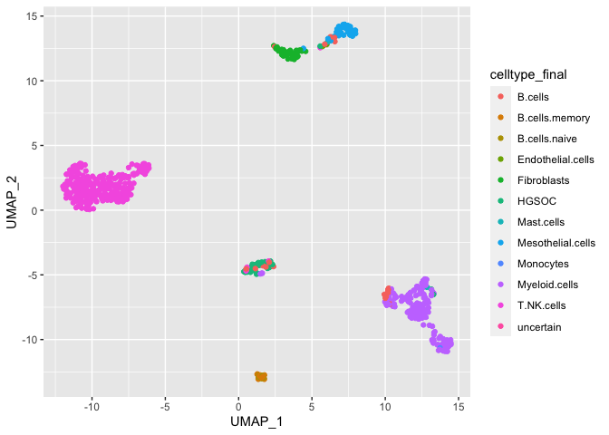
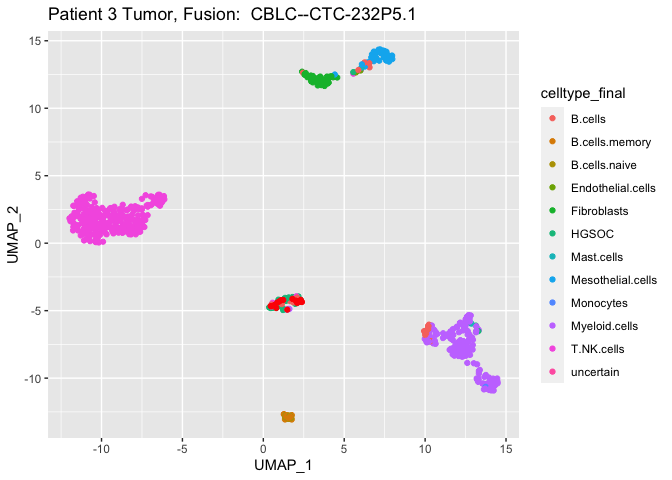
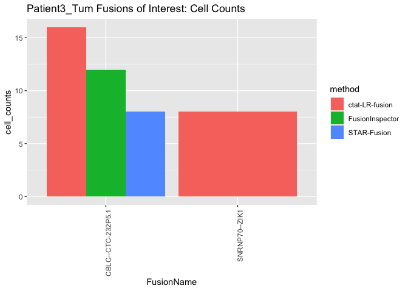
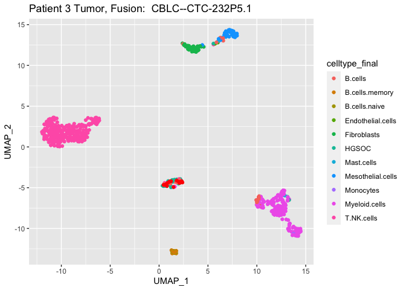

Patient1_analysis
================
bhaas
2023-09-28

``` r
MIN_CELLS = 5
```

# P3 Om

``` r
Om_data = read.table("data/Patient3_Om.Dondi_overian_CTAT_fusions.filtered_cells_and_dedup_umis.tsv.gz", header=T, sep="\t", stringsAsFactors = F)

Om_data %>% head()
```

    ##             FusionName   LeftBreakpoint  RightBreakpoint     cell_barcode
    ## 1         AAED1--SUMO1  chr9:96651390:- chr2:202214429:- AAGAGATTGCATTACG
    ## 2 ABCC1--RP11-640N20.4 chr16:16016594:+ chr16:16146115:+ CACTCGTACTCCCTCA
    ## 3         ABCE1--BACH2 chr4:145122509:+  chr6:89930260:- ATCTGACGACTGTAAC
    ## 4        ABHD12--TTBK2 chr20:25390513:- chr15:42878684:- TATGAGGCTGGGTATG
    ## 5        ABI3BP--CAPZB chr3:100902618:-  chr1:19419750:- AGTTCGAACCATCTCC
    ## 6       ABL1--FAM114A1 chr9:130835525:+  chr4:38945316:+ CGCTTGTACTAGAATG
    ##            umi                                  read_name         method
    ## 1 TCGCATGTTTCG  NS500318:945:HNGM5BGXG:3:11401:9392:13153    STAR-Fusion
    ## 2 CAGTCTGCGTAG           m64156_210226_140858/1837470/ccs ctat-LR-fusion
    ## 3 AAAACGCACCCT  NS500318:945:HNGM5BGXG:1:12302:3771:13866    STAR-Fusion
    ## 4 TAGTGTGTGTTA           m64156_210226_140858/8058321/ccs ctat-LR-fusion
    ## 5 GTTTTGTGCGTC           m64156_210214_222855/1426343/ccs ctat-LR-fusion
    ## 6 AAAATAGTAATA NS500318:945:HNGM5BGXG:3:13401:17121:16129    STAR-Fusion
    ##           barcodes    celltype_final     UMAP_1     UMAP_2     dataset
    ## 1 CGTAATGCAATCTCTT Mesothelial.cells -11.733489 -8.4741673 Patient3_Om
    ## 2 TGAGGGAGTACGAGTG        T.NK.cells  12.678537  2.8051196 Patient3_Om
    ## 3 GTTACAGTCGTCAGAT Mesothelial.cells -12.210028 -8.9281439 Patient3_Om
    ## 4 CATACCCAGCCTCATA     Myeloid.cells   0.450182  7.1446185 Patient3_Om
    ## 5 GGAGATGGTTCGAACT Mesothelial.cells  -9.335212  0.1417333 Patient3_Om
    ## 6 CATTCTAGTACAAGCG Mesothelial.cells -12.753826 -5.8788814 Patient3_Om

``` r
Om_cell_counts_by_method = read.table("data/Patient3_Om.Dondi_overian_CTAT_fusions.filtered_cells_and_dedup_umis.cell_counts_by_method.tsv.gz", 
                                      header=T, sep="\t", stringsAsFactors = F)

Om_cell_counts_by_method %>% head()
```

    ##              FusionName    LeftBreakpoint   RightBreakpoint          method
    ## 1         ZCCHC8--RSRC2 chr12:122498827:- chr12:122505706:-  ctat-LR-fusion
    ## 2 RP11-208G20.2--PSPHP1   chr7:55761799:+   chr7:55773181:+  ctat-LR-fusion
    ## 3     AC003080.4--PRDX6  chr7:111971400:-  chr1:173488635:+ FusionInspector
    ## 4         ZCCHC8--RSRC2 chr12:122498827:- chr12:122505706:-  ctat-LR-fusion
    ## 5   RP11-384F7.2--LSAMP  chr3:117997182:-  chr3:116444955:-  ctat-LR-fusion
    ## 6         ZCCHC8--RSRC2 chr12:122498827:- chr12:122505706:-  ctat-LR-fusion
    ##      celltype_final     dataset cell_counts
    ## 1 Mesothelial.cells Patient3_Om          68
    ## 2 Mesothelial.cells Patient3_Om          53
    ## 3 Mesothelial.cells Patient3_Om          43
    ## 4        T.NK.cells Patient3_Om          40
    ## 5 Mesothelial.cells Patient3_Om          19
    ## 6     Myeloid.cells Patient3_Om          19

``` r
Om_cell_counts_by_method_spread = Om_cell_counts_by_method %>% select(FusionName, LeftBreakpoint, RightBreakpoint, method, celltype_final, cell_counts) %>%
    spread(key=method, value=cell_counts) %>% 
    arrange(desc(`ctat-LR-fusion`))

Om_cell_counts_by_method_spread %>% head()
```

    ##              FusionName    LeftBreakpoint   RightBreakpoint    celltype_final
    ## 1         ZCCHC8--RSRC2 chr12:122498827:- chr12:122505706:- Mesothelial.cells
    ## 2 RP11-208G20.2--PSPHP1   chr7:55761799:+   chr7:55773181:+ Mesothelial.cells
    ## 3         ZCCHC8--RSRC2 chr12:122498827:- chr12:122505706:-        T.NK.cells
    ## 4   RP11-384F7.2--LSAMP  chr3:117997182:-  chr3:116444955:- Mesothelial.cells
    ## 5         ZCCHC8--RSRC2 chr12:122498827:- chr12:122505706:-     Myeloid.cells
    ## 6         ZCCHC8--RSRC2 chr12:122498827:- chr12:122505706:-       Fibroblasts
    ##   ctat-LR-fusion FusionInspector STAR-Fusion
    ## 1             68               3           1
    ## 2             53              NA          NA
    ## 3             40              NA          NA
    ## 4             19              NA          NA
    ## 5             19              NA          NA
    ## 6             17               1           1

``` r
Om_fusion_frac_cell_types = Om_data %>% select(FusionName, barcodes, celltype_final) %>% unique() %>%
    group_by(FusionName, celltype_final) %>% tally(name='tot_cells_w_fusion') %>% 
    mutate(frac_fusion_cells=prop.table(tot_cells_w_fusion)) %>%
    arrange(desc(tot_cells_w_fusion))

Om_fusion_frac_cell_types %>% filter(tot_cells_w_fusion >= MIN_CELLS)
```

    ## # A tibble: 14 × 4
    ## # Groups:   FusionName [8]
    ##    FusionName                   celltype_final    tot_cells_w_fusion frac_fusi…¹
    ##    <chr>                        <chr>                          <int>       <dbl>
    ##  1 ZCCHC8--RSRC2                Mesothelial.cells                 68      0.459 
    ##  2 RP11-208G20.2--PSPHP1        Mesothelial.cells                 56      0.757 
    ##  3 AC003080.4--PRDX6            Mesothelial.cells                 43      0.796 
    ##  4 ZCCHC8--RSRC2                T.NK.cells                        40      0.270 
    ##  5 RP11-384F7.2--LSAMP          Mesothelial.cells                 19      0.95  
    ##  6 ZCCHC8--RSRC2                Myeloid.cells                     19      0.128 
    ##  7 ZCCHC8--RSRC2                Fibroblasts                       17      0.115 
    ##  8 AC003080.4--PRDX6            Fibroblasts                        9      0.167 
    ##  9 RP11-208G20.2--PSPHP1        T.NK.cells                         9      0.122 
    ## 10 ZFP36L1--ZNF302              Mesothelial.cells                  8      0.615 
    ## 11 CTD-2008L17.1--RP11-456O19.2 Mesothelial.cells                  7      1     
    ## 12 RP11-208G20.2--PSPHP1        Myeloid.cells                      7      0.0946
    ## 13 ROR2--NFIL3                  Mesothelial.cells                  5      1     
    ## 14 RPL18AP14--AC079250.1        Mesothelial.cells                  5      0.5   
    ## # … with abbreviated variable name ¹​frac_fusion_cells

# P1 Tumor

``` r
Tum_data = read.table("data/Patient3_Tum.Dondi_overian_CTAT_fusions.filtered_cells_and_dedup_umis.tsv.gz", header=T, sep="\t", stringsAsFactors = F)

Tum_data %>% head()
```

    ##          FusionName   LeftBreakpoint   RightBreakpoint     cell_barcode
    ## 1        AASS--MEG3 chr7:122093048:- chr14:100848570:+ TAGTTACCTTACGATC
    ## 2        AASS--MEG3 chr7:122093048:- chr14:100848570:+ TAGTTACCTTACGATC
    ## 3      ABCA3--NFIL3  chr16:2340573:-   chr9:91410906:- GATGGGTGATCATGCA
    ## 4      ABCA5--USP25 chr17:69325699:-  chr21:15864268:+ GACCAGAGATAGGAAT
    ## 5 ABHD16B--KIAA0513 chr20:63863074:+  chr16:85027750:+ AGCGGGTCTTGGTTAC
    ## 6    ABI1--C1orf132 chr10:26860997:-  chr1:207811155:- AAGGGACACTTCAGCA
    ##            umi                                  read_name          method
    ## 1 CTTTTCATTGCG  NS500318:945:HNGM5BGXG:1:13303:7782:14704     STAR-Fusion
    ## 2 CTTTTCATTGCG  NS500318:945:HNGM5BGXG:1:13303:7782:14704 FusionInspector
    ## 3 TATATGATGATA           m64156_210220_223905/8151666/ccs  ctat-LR-fusion
    ## 4 AGAGAGCTAGAT           m64156_210213_160114/3862947/ccs  ctat-LR-fusion
    ## 5 TCTAAGCCTTCT NS500318:945:HNGM5BGXG:4:12510:15036:12983     STAR-Fusion
    ## 6 TCAATTAGTTGG  NS500318:945:HNGM5BGXG:2:12310:4550:17312     STAR-Fusion
    ##           barcodes celltype_final    UMAP_1    UMAP_2      dataset
    ## 1 GATCGTAAGGTAACTA    Fibroblasts  2.589430 12.493015 Patient3_Tum
    ## 2 GATCGTAAGGTAACTA    Fibroblasts  2.589430 12.493015 Patient3_Tum
    ## 3 TGCATGATCACCCATC  Myeloid.cells 11.954963 -6.190181 Patient3_Tum
    ## 4 ATTCCTATCTCTGGTC     T.NK.cells -6.361723  3.178483 Patient3_Tum
    ## 5 GTAACCAAGACCCGCT          HGSOC  1.353654 -4.185481 Patient3_Tum
    ## 6 TGCTGAAGTGTCCCTT          HGSOC  1.229690 -4.206707 Patient3_Tum

``` r
Tum_cell_counts_by_method = read.table("data/Patient3_Tum.Dondi_overian_CTAT_fusions.filtered_cells_and_dedup_umis.cell_counts_by_method.tsv.gz", 
                                      header=T, sep="\t", stringsAsFactors = F)

Tum_cell_counts_by_method %>% head()
```

    ##              FusionName    LeftBreakpoint   RightBreakpoint          method
    ## 1         ZCCHC8--RSRC2 chr12:122498827:- chr12:122505706:-  ctat-LR-fusion
    ## 2         ZCCHC8--RSRC2 chr12:122498827:- chr12:122505706:-  ctat-LR-fusion
    ## 3 RP11-60E8.2--MINOS1P3  chr12:50757389:+   chr3:27214837:- FusionInspector
    ## 4 RP11-208G20.2--PSPHP1   chr7:55761799:+   chr7:55773181:+  ctat-LR-fusion
    ## 5 RP11-60E8.2--MINOS1P3  chr12:50757389:+   chr3:27214837:- FusionInspector
    ## 6         ZCCHC8--RSRC2 chr12:122498827:- chr12:122505706:-  ctat-LR-fusion
    ##   celltype_final      dataset cell_counts
    ## 1     T.NK.cells Patient3_Tum         105
    ## 2  Myeloid.cells Patient3_Tum          99
    ## 3  Myeloid.cells Patient3_Tum          64
    ## 4     T.NK.cells Patient3_Tum          36
    ## 5          HGSOC Patient3_Tum          32
    ## 6          HGSOC Patient3_Tum          30

``` r
Tum_cell_counts_by_method_spread = Tum_cell_counts_by_method %>% select(FusionName, LeftBreakpoint, RightBreakpoint, method, celltype_final, cell_counts) %>%
    spread(key=method, value=cell_counts) %>% 
    arrange(desc(`ctat-LR-fusion`))

Tum_cell_counts_by_method_spread %>% filter(`ctat-LR-fusion` >= MIN_CELLS)
```

    ##                     FusionName    LeftBreakpoint   RightBreakpoint
    ## 1                ZCCHC8--RSRC2 chr12:122498827:- chr12:122505706:-
    ## 2                ZCCHC8--RSRC2 chr12:122498827:- chr12:122505706:-
    ## 3        RP11-208G20.2--PSPHP1   chr7:55761799:+   chr7:55773181:+
    ## 4                ZCCHC8--RSRC2 chr12:122498827:- chr12:122505706:-
    ## 5        RP11-208G20.2--PSPHP1   chr7:55761799:+   chr7:55773181:+
    ## 6                ZCCHC8--RSRC2 chr12:122498827:- chr12:122505706:-
    ## 7        RP11-208G20.2--PSPHP1   chr7:55761799:+   chr7:55773181:+
    ## 8                ZCCHC8--RSRC2 chr12:122498827:- chr12:122505706:-
    ## 9        RP11-208G20.2--PSPHP1   chr7:55761799:+   chr7:55773181:+
    ## 10               ZCCHC8--RSRC2 chr12:122498827:- chr12:122505706:-
    ## 11           CBLC--CTC-232P5.1  chr19:44784401:+   chr19:6012120:+
    ## 12           CBLC--CTC-232P5.1  chr19:44784417:+   chr19:6012120:+
    ## 13       RP11-208G20.2--PSPHP1   chr7:55761799:+   chr7:55773181:+
    ## 14       RP11-208G20.2--PSPHP1   chr7:55761799:+   chr7:55773181:+
    ## 15               SNRNP70--ZIK1  chr19:49098704:+  chr19:57590011:+
    ## 16           CBLC--CTC-232P5.1  chr19:44781051:+   chr19:6012120:+
    ## 17         RP11-384F7.2--LSAMP  chr3:117997182:-  chr3:116444955:-
    ## 18 RP11-403B2.7--RP11-116P24.2  chr15:20755930:-  chr15:20759907:-
    ## 19          RP11-444D3.1--SOX5  chr12:24276141:-  chr12:23896024:-
    ## 20               ZCCHC8--RSRC2 chr12:122498827:- chr12:122505706:-
    ##       celltype_final ctat-LR-fusion FusionInspector STAR-Fusion
    ## 1         T.NK.cells            105               1           1
    ## 2      Myeloid.cells             99              NA          NA
    ## 3         T.NK.cells             36              NA          NA
    ## 4              HGSOC             30              NA          NA
    ## 5      Myeloid.cells             28              NA          NA
    ## 6  Mesothelial.cells             26              NA          NA
    ## 7              HGSOC             20              NA          NA
    ## 8        Fibroblasts             19              NA          NA
    ## 9  Mesothelial.cells             16              NA          NA
    ## 10           B.cells             13              NA          NA
    ## 11             HGSOC             11               6           4
    ## 12             HGSOC              8               3           3
    ## 13           B.cells              8              NA          NA
    ## 14       Fibroblasts              7              NA          NA
    ## 15             HGSOC              7              NA          NA
    ## 16             HGSOC              6               2           1
    ## 17 Mesothelial.cells              5              NA           1
    ## 18             HGSOC              5               2          NA
    ## 19       Fibroblasts              5              NA          NA
    ## 20    B.cells.memory              5              NA          NA

# compare P1 Tum and Om fusions

``` r
Tum_n_Om_joined_fusions = full_join(Tum_cell_counts_by_method_spread, Om_cell_counts_by_method_spread, 
                                    by=c('FusionName', 'LeftBreakpoint', 'RightBreakpoint', 'celltype_final'),
                                    suffix=c('.Tum', '.Om'))

Tum_n_Om_joined_fusions %>% head()
```

    ##              FusionName    LeftBreakpoint   RightBreakpoint    celltype_final
    ## 1         ZCCHC8--RSRC2 chr12:122498827:- chr12:122505706:-        T.NK.cells
    ## 2         ZCCHC8--RSRC2 chr12:122498827:- chr12:122505706:-     Myeloid.cells
    ## 3 RP11-208G20.2--PSPHP1   chr7:55761799:+   chr7:55773181:+        T.NK.cells
    ## 4         ZCCHC8--RSRC2 chr12:122498827:- chr12:122505706:-             HGSOC
    ## 5 RP11-208G20.2--PSPHP1   chr7:55761799:+   chr7:55773181:+     Myeloid.cells
    ## 6         ZCCHC8--RSRC2 chr12:122498827:- chr12:122505706:- Mesothelial.cells
    ##   ctat-LR-fusion.Tum FusionInspector.Tum STAR-Fusion.Tum ctat-LR-fusion.Om
    ## 1                105                   1               1                40
    ## 2                 99                  NA              NA                19
    ## 3                 36                  NA              NA                 8
    ## 4                 30                  NA              NA                NA
    ## 5                 28                  NA              NA                 6
    ## 6                 26                  NA              NA                68
    ##   FusionInspector.Om STAR-Fusion.Om
    ## 1                 NA             NA
    ## 2                 NA             NA
    ## 3                 NA             NA
    ## 4                 NA             NA
    ## 5                 NA             NA
    ## 6                  3              1

``` r
Tum_n_Om_joined_fusions %>% select(FusionName, LeftBreakpoint, RightBreakpoint, celltype_final, `ctat-LR-fusion.Tum`, `ctat-LR-fusion.Om`) %>%
    arrange(desc(`ctat-LR-fusion.Tum`)) %>% 
    filter(`ctat-LR-fusion.Tum`>= MIN_CELLS)
```

    ##                     FusionName    LeftBreakpoint   RightBreakpoint
    ## 1                ZCCHC8--RSRC2 chr12:122498827:- chr12:122505706:-
    ## 2                ZCCHC8--RSRC2 chr12:122498827:- chr12:122505706:-
    ## 3        RP11-208G20.2--PSPHP1   chr7:55761799:+   chr7:55773181:+
    ## 4                ZCCHC8--RSRC2 chr12:122498827:- chr12:122505706:-
    ## 5        RP11-208G20.2--PSPHP1   chr7:55761799:+   chr7:55773181:+
    ## 6                ZCCHC8--RSRC2 chr12:122498827:- chr12:122505706:-
    ## 7        RP11-208G20.2--PSPHP1   chr7:55761799:+   chr7:55773181:+
    ## 8                ZCCHC8--RSRC2 chr12:122498827:- chr12:122505706:-
    ## 9        RP11-208G20.2--PSPHP1   chr7:55761799:+   chr7:55773181:+
    ## 10               ZCCHC8--RSRC2 chr12:122498827:- chr12:122505706:-
    ## 11           CBLC--CTC-232P5.1  chr19:44784401:+   chr19:6012120:+
    ## 12           CBLC--CTC-232P5.1  chr19:44784417:+   chr19:6012120:+
    ## 13       RP11-208G20.2--PSPHP1   chr7:55761799:+   chr7:55773181:+
    ## 14       RP11-208G20.2--PSPHP1   chr7:55761799:+   chr7:55773181:+
    ## 15               SNRNP70--ZIK1  chr19:49098704:+  chr19:57590011:+
    ## 16           CBLC--CTC-232P5.1  chr19:44781051:+   chr19:6012120:+
    ## 17         RP11-384F7.2--LSAMP  chr3:117997182:-  chr3:116444955:-
    ## 18 RP11-403B2.7--RP11-116P24.2  chr15:20755930:-  chr15:20759907:-
    ## 19          RP11-444D3.1--SOX5  chr12:24276141:-  chr12:23896024:-
    ## 20               ZCCHC8--RSRC2 chr12:122498827:- chr12:122505706:-
    ##       celltype_final ctat-LR-fusion.Tum ctat-LR-fusion.Om
    ## 1         T.NK.cells                105                40
    ## 2      Myeloid.cells                 99                19
    ## 3         T.NK.cells                 36                 8
    ## 4              HGSOC                 30                NA
    ## 5      Myeloid.cells                 28                 6
    ## 6  Mesothelial.cells                 26                68
    ## 7              HGSOC                 20                NA
    ## 8        Fibroblasts                 19                17
    ## 9  Mesothelial.cells                 16                53
    ## 10           B.cells                 13                NA
    ## 11             HGSOC                 11                NA
    ## 12             HGSOC                  8                NA
    ## 13           B.cells                  8                NA
    ## 14       Fibroblasts                  7                 2
    ## 15             HGSOC                  7                NA
    ## 16             HGSOC                  6                NA
    ## 17 Mesothelial.cells                  5                19
    ## 18             HGSOC                  5                NA
    ## 19       Fibroblasts                  5                 4
    ## 20    B.cells.memory                  5                NA

``` r
Tum_fusion_frac_cell_types = Tum_data %>% select(FusionName, barcodes, celltype_final) %>% unique() %>%
    group_by(FusionName, celltype_final) %>% tally(name='tot_cells_w_fusion') %>% 
    mutate(frac_fusion_cells=prop.table(tot_cells_w_fusion)) %>%
    arrange(desc(tot_cells_w_fusion))

Tum_fusion_frac_cell_types %>% filter(tot_cells_w_fusion >= MIN_CELLS)
```

    ## # A tibble: 27 × 4
    ## # Groups:   FusionName [10]
    ##    FusionName            celltype_final    tot_cells_w_fusion frac_fusion_cells
    ##    <chr>                 <chr>                          <int>             <dbl>
    ##  1 ZCCHC8--RSRC2         T.NK.cells                       105            0.35  
    ##  2 ZCCHC8--RSRC2         Myeloid.cells                     99            0.33  
    ##  3 RP11-60E8.2--MINOS1P3 Myeloid.cells                     64            0.381 
    ##  4 RP11-208G20.2--PSPHP1 T.NK.cells                        38            0.297 
    ##  5 RP11-60E8.2--MINOS1P3 HGSOC                             33            0.196 
    ##  6 RP11-208G20.2--PSPHP1 Myeloid.cells                     30            0.234 
    ##  7 ZCCHC8--RSRC2         HGSOC                             30            0.1   
    ##  8 RP11-60E8.2--MINOS1P3 T.NK.cells                        26            0.155 
    ##  9 ZCCHC8--RSRC2         Mesothelial.cells                 26            0.0867
    ## 10 RP11-60E8.2--MINOS1P3 Mesothelial.cells                 25            0.149 
    ## # … with 17 more rows

``` r
# identify tumor-enriched fusions:
fusions_of_interest = Tum_fusion_frac_cell_types %>% filter(celltype_final == "HGSOC" & frac_fusion_cells >= 0.8) %>%
    arrange(desc(tot_cells_w_fusion)) %>%
    filter(tot_cells_w_fusion >= MIN_CELLS)

fusions_of_interest
```

    ## # A tibble: 2 × 4
    ## # Groups:   FusionName [2]
    ##   FusionName        celltype_final tot_cells_w_fusion frac_fusion_cells
    ##   <chr>             <chr>                       <int>             <dbl>
    ## 1 CBLC--CTC-232P5.1 HGSOC                          14             0.875
    ## 2 SNRNP70--ZIK1     HGSOC                           7             0.875

``` r
# see if these fusions are found in the Om sample

left_join(fusions_of_interest, Om_fusion_frac_cell_types, by='FusionName', suffix=c('.Tum', '.Om'))
```

    ## # A tibble: 2 × 7
    ## # Groups:   FusionName [2]
    ##   FusionName        celltype_final.Tum tot_cel…¹ frac_…² cellt…³ tot_c…⁴ frac_…⁵
    ##   <chr>             <chr>                  <int>   <dbl> <chr>     <int>   <dbl>
    ## 1 CBLC--CTC-232P5.1 HGSOC                     14   0.875 <NA>         NA      NA
    ## 2 SNRNP70--ZIK1     HGSOC                      7   0.875 <NA>         NA      NA
    ## # … with abbreviated variable names ¹​tot_cells_w_fusion.Tum,
    ## #   ²​frac_fusion_cells.Tum, ³​celltype_final.Om, ⁴​tot_cells_w_fusion.Om,
    ## #   ⁵​frac_fusion_cells.Om

``` r
# see if we find these fusions using short reads:

fusions_of_interest = left_join(fusions_of_interest, Tum_cell_counts_by_method_spread)
```

    ## Joining with `by = join_by(FusionName, celltype_final)`

    ## Warning in left_join(fusions_of_interest, Tum_cell_counts_by_method_spread): Each row in `x` is expected to match at most 1 row in `y`.
    ## ℹ Row 1 of `x` matches multiple rows.
    ## ℹ If multiple matches are expected, set `multiple = "all"` to silence this
    ##   warning.

``` r
fusions_of_interest
```

    ## # A tibble: 6 × 9
    ## # Groups:   FusionName [2]
    ##   FusionName     cellt…¹ tot_c…² frac_…³ LeftB…⁴ Right…⁵ ctat-…⁶ Fusio…⁷ STAR-…⁸
    ##   <chr>          <chr>     <int>   <dbl> <chr>   <chr>     <int>   <int>   <int>
    ## 1 CBLC--CTC-232… HGSOC        14   0.875 chr19:… chr19:…      11       6       4
    ## 2 CBLC--CTC-232… HGSOC        14   0.875 chr19:… chr19:…       8       3       3
    ## 3 CBLC--CTC-232… HGSOC        14   0.875 chr19:… chr19:…       6       2       1
    ## 4 CBLC--CTC-232… HGSOC        14   0.875 chr19:… chr19:…       3       1       1
    ## 5 CBLC--CTC-232… HGSOC        14   0.875 chr19:… chr19:…       1      NA      NA
    ## 6 SNRNP70--ZIK1  HGSOC         7   0.875 chr19:… chr19:…       7      NA      NA
    ## # … with abbreviated variable names ¹​celltype_final, ²​tot_cells_w_fusion,
    ## #   ³​frac_fusion_cells, ⁴​LeftBreakpoint, ⁵​RightBreakpoint, ⁶​`ctat-LR-fusion`,
    ## #   ⁷​FusionInspector, ⁸​`STAR-Fusion`

``` r
fusion_annots = read.table("data/Patient3.fusion_annots.gz", header=T, sep="\t", stringsAsFactors = F)

fusions_of_interest = left_join(fusions_of_interest, fusion_annots)
```

    ## Joining with `by = join_by(FusionName)`

``` r
write.table(fusions_of_interest, file="data/Patient3_Tum.fusions_of_interest.tsv.gz", sep="\t", row.names=F, quote=F)

fusions_of_interest
```

    ## # A tibble: 6 × 10
    ## # Groups:   FusionName [2]
    ##   Fusio…¹ cellt…² tot_c…³ frac_…⁴ LeftB…⁵ Right…⁶ ctat-…⁷ Fusio…⁸ STAR-…⁹ annots
    ##   <chr>   <chr>     <int>   <dbl> <chr>   <chr>     <int>   <int>   <int> <chr> 
    ## 1 CBLC--… HGSOC        14   0.875 chr19:… chr19:…      11       6       4 [CBLC…
    ## 2 CBLC--… HGSOC        14   0.875 chr19:… chr19:…       8       3       3 [CBLC…
    ## 3 CBLC--… HGSOC        14   0.875 chr19:… chr19:…       6       2       1 [CBLC…
    ## 4 CBLC--… HGSOC        14   0.875 chr19:… chr19:…       3       1       1 [CBLC…
    ## 5 CBLC--… HGSOC        14   0.875 chr19:… chr19:…       1      NA      NA [CBLC…
    ## 6 SNRNP7… HGSOC         7   0.875 chr19:… chr19:…       7      NA      NA INTRA…
    ## # … with abbreviated variable names ¹​FusionName, ²​celltype_final,
    ## #   ³​tot_cells_w_fusion, ⁴​frac_fusion_cells, ⁵​LeftBreakpoint, ⁶​RightBreakpoint,
    ## #   ⁷​`ctat-LR-fusion`, ⁸​FusionInspector, ⁹​`STAR-Fusion`

# Examine umaps for fusions

``` r
umap_base_data = read.table("data/Patient3_Tum_UMAPcoords.txt.gz", header=T, sep=",") %>%
    rename(barcodes=X)
celltypes = read.table("data/Patient3_Tum.bc_to_celltype.tsv.gz", header=T, sep="\t")

umap_base_data = full_join(umap_base_data, celltypes, by='barcodes')


# number of cells
num_total_cells = nrow(umap_base_data) 
message("number total cells: ", num_total_cells)
```

    ## number total cells: 660

``` r
# 660 total cells

umap_base_data %>% group_by(celltype_final) %>% tally(name='count_cell_type') %>% mutate(frac_tot_cells = count_cell_type/num_total_cells)
```

    ## # A tibble: 12 × 3
    ##    celltype_final    count_cell_type frac_tot_cells
    ##    <chr>                       <int>          <dbl>
    ##  1 B.cells                        24        0.0364 
    ##  2 B.cells.memory                 13        0.0197 
    ##  3 B.cells.naive                   7        0.0106 
    ##  4 Endothelial.cells               2        0.00303
    ##  5 Fibroblasts                    45        0.0682 
    ##  6 HGSOC                          38        0.0576 
    ##  7 Mast.cells                      3        0.00455
    ##  8 Mesothelial.cells              45        0.0682 
    ##  9 Monocytes                       1        0.00152
    ## 10 Myeloid.cells                 166        0.252  
    ## 11 T.NK.cells                    307        0.465  
    ## 12 uncertain                       9        0.0136

``` r
# 38 HGSOC cells  (6% of total cells)
```

``` r
baseplot = umap_base_data %>% ggplot(aes(x=UMAP_1, y=UMAP_2)) + geom_point(aes(color=celltype_final))

baseplot
```

    ## Warning: Removed 14 rows containing missing values (`geom_point()`).

<!-- -->

``` r
x = 0

plots = list()

for (fusion in  unique(fusions_of_interest$FusionName)) {
    
    p = baseplot + geom_point(data=Tum_data %>% filter(FusionName == fusion) %>% select(UMAP_1, UMAP_2) %>% unique(), 
                              color='red') + 
        ggtitle(paste("Patient 3 Tumor, Fusion: ", fusion) )
    
    plot(p)   
    
    x = x+1
    plots[[x]] = p
}
```

    ## Warning: Removed 14 rows containing missing values (`geom_point()`).

<!-- -->

    ## Warning: Removed 14 rows containing missing values (`geom_point()`).

<!-- -->

``` r
pdf("Patient3_Tum.fusions_of_interest.pdf")
for (p in plots) {
    plot(p)
}
```

    ## Warning: Removed 14 rows containing missing values (`geom_point()`).
    ## Removed 14 rows containing missing values (`geom_point()`).

``` r
dev.off()
```

    ## quartz_off_screen 
    ##                 2

``` r
fusion_of_interest_cell_counts = Tum_data %>% filter(FusionName %in%  fusions_of_interest$FusionName) %>% 
        select(FusionName, method, barcodes) %>% unique() %>%
        group_by(FusionName, method) %>% tally(name='cell_counts') 


fusion_of_interest_cell_counts %>% spread(key=method, value=cell_counts) %>% arrange(desc(`ctat-LR-fusion`))
```

    ## # A tibble: 2 × 4
    ## # Groups:   FusionName [2]
    ##   FusionName        `ctat-LR-fusion` FusionInspector `STAR-Fusion`
    ##   <chr>                        <int>           <int>         <int>
    ## 1 CBLC--CTC-232P5.1               16              12             8
    ## 2 SNRNP70--ZIK1                    8              NA            NA

``` r
fusion_of_interest_cell_counts  %>%
              ggplot(aes(x=FusionName, y=cell_counts, fill=method)) + geom_bar(stat='identity', position='dodge') +
              theme(axis.text.x = element_text(angle = 90, hjust = 1)) +
    ggtitle("Patient3_Tum Fusions of Interest: Cell Counts")
```

<!-- -->

``` r
# breakdown by combinations of methods per cell

tumor_cell_counts_by_methods = Tum_data %>%
    filter(FusionName %in%  fusions_of_interest$FusionName) %>% 
        select(FusionName, method, barcodes) %>% unique() %>%
        group_by(FusionName, barcodes) %>% 
        arrange(method) %>%
        mutate(methods = paste(method, collapse=',')) %>%
        ungroup() %>%
        select(FusionName, methods, barcodes) %>% group_by(FusionName, methods) %>% tally(name='cell_counts')


tumor_cell_counts_by_methods 
```

    ## # A tibble: 4 × 3
    ## # Groups:   FusionName [2]
    ##   FusionName        methods                                    cell_counts
    ##   <chr>             <chr>                                            <int>
    ## 1 CBLC--CTC-232P5.1 FusionInspector,STAR-Fusion,ctat-LR-fusion          24
    ## 2 CBLC--CTC-232P5.1 FusionInspector,ctat-LR-fusion                       8
    ## 3 CBLC--CTC-232P5.1 ctat-LR-fusion                                       4
    ## 4 SNRNP70--ZIK1     ctat-LR-fusion                                       8

``` r
# by isoform 
tumor_cell_counts_by_methods_by_isoform =  Tum_data %>%
            filter(FusionName %in% fusions_of_interest$FusionName) %>%
            select(FusionName, LeftBreakpoint, RightBreakpoint, cell_barcode, method) %>%
              rowwise() %>% mutate(fusion=paste(FusionName, LeftBreakpoint, RightBreakpoint, collapse=":")) %>% 
              unique() %>%
             group_by(fusion, method) %>%
             tally(name='cell_counts')
        

tumor_cell_counts_by_methods_by_isoform 
```

    ## # A tibble: 14 × 3
    ## # Groups:   fusion [6]
    ##    fusion                                             method          cell_cou…¹
    ##    <chr>                                              <chr>                <int>
    ##  1 CBLC--CTC-232P5.1 chr19:44778284:+ chr19:6012120:+ ctat-LR-fusion           1
    ##  2 CBLC--CTC-232P5.1 chr19:44781051:+ chr19:6012120:+ FusionInspector          2
    ##  3 CBLC--CTC-232P5.1 chr19:44781051:+ chr19:6012120:+ STAR-Fusion              1
    ##  4 CBLC--CTC-232P5.1 chr19:44781051:+ chr19:6012120:+ ctat-LR-fusion           6
    ##  5 CBLC--CTC-232P5.1 chr19:44781363:+ chr19:6012120:+ FusionInspector          2
    ##  6 CBLC--CTC-232P5.1 chr19:44781363:+ chr19:6012120:+ STAR-Fusion              2
    ##  7 CBLC--CTC-232P5.1 chr19:44781363:+ chr19:6012120:+ ctat-LR-fusion           5
    ##  8 CBLC--CTC-232P5.1 chr19:44784401:+ chr19:6012120:+ FusionInspector          8
    ##  9 CBLC--CTC-232P5.1 chr19:44784401:+ chr19:6012120:+ STAR-Fusion              5
    ## 10 CBLC--CTC-232P5.1 chr19:44784401:+ chr19:6012120:+ ctat-LR-fusion          13
    ## 11 CBLC--CTC-232P5.1 chr19:44784417:+ chr19:6012120:+ FusionInspector          3
    ## 12 CBLC--CTC-232P5.1 chr19:44784417:+ chr19:6012120:+ STAR-Fusion              3
    ## 13 CBLC--CTC-232P5.1 chr19:44784417:+ chr19:6012120:+ ctat-LR-fusion          10
    ## 14 SNRNP70--ZIK1 chr19:49098704:+ chr19:57590011:+    ctat-LR-fusion           8
    ## # … with abbreviated variable name ¹​cell_counts

``` r
tumor_cell_counts_by_methods_by_isoform %>%
              ggplot(aes(x=fusion, y=cell_counts, fill=method)) + 
                 geom_bar(stat='identity', position='dodge') +
                 theme(axis.text.x = element_text(angle = 90, hjust = 1)) +
    ggtitle("Patient 3 Fusions of interest")
```

<!-- -->

``` r
Tum_data %>% filter(FusionName %in% fusions_of_interest$FusionName) %>% select(FusionName, cell_barcode, celltype_final, UMAP_1, UMAP_2) %>% unique() %>%
    arrange(UMAP_1, UMAP_2)
```

    ##           FusionName     cell_barcode celltype_final    UMAP_1    UMAP_2
    ## 1  CBLC--CTC-232P5.1 TGGGCCATGCAAGATA          HGSOC 0.4548521 -4.665045
    ## 2  CBLC--CTC-232P5.1 GGTTCTCACGTGAAGC          HGSOC 0.5243679 -4.664466
    ## 3      SNRNP70--ZIK1 GGTTCTCACGTGAAGC          HGSOC 0.5243679 -4.664466
    ## 4  CBLC--CTC-232P5.1 GCAACGCTGTCGGAAG          HGSOC 0.6810082 -4.588101
    ## 5  CBLC--CTC-232P5.1 ACCAAGACTCTCGTGG          HGSOC 0.7203332 -4.604512
    ## 6  CBLC--CTC-232P5.1 CCATTGCACGTTAGAA          HGSOC 0.8043062 -4.802224
    ## 7      SNRNP70--ZIK1 CCATTGCACGTTAGAA          HGSOC 0.8043062 -4.802224
    ## 8  CBLC--CTC-232P5.1 ACGAAATGATCGCTTC          HGSOC 0.8608712 -4.400248
    ## 9      SNRNP70--ZIK1 ACGAAATGATCGCTTC          HGSOC 0.8608712 -4.400248
    ## 10 CBLC--CTC-232P5.1 CTTGTGGCTCGTGCAC          HGSOC 0.9952511 -4.309851
    ## 11 CBLC--CTC-232P5.1 ATCGCCACTGATTGAA          HGSOC 1.1013011 -4.216507
    ## 12     SNRNP70--ZIK1 ATCGCCACTGATTGAA          HGSOC 1.1013011 -4.216507
    ## 13 CBLC--CTC-232P5.1 AAGGGACACTTCAGCA          HGSOC 1.2296902 -4.206707
    ## 14     SNRNP70--ZIK1 AAGGGACACTTCAGCA          HGSOC 1.2296902 -4.206707
    ## 15 CBLC--CTC-232P5.1 AGTTCGATGCACTAAC  Myeloid.cells 1.4820196 -4.923253
    ## 16 CBLC--CTC-232P5.1 CGGTGTCGAAATTGAG          HGSOC 1.7964529 -4.123495
    ## 17 CBLC--CTC-232P5.1 GCAGGATGACCAGAGA          HGSOC 2.0021671 -4.257174
    ## 18 CBLC--CTC-232P5.1 CTTAGGATGTACCGTA          HGSOC 2.0925464 -4.433187
    ## 19     SNRNP70--ZIK1 CTTAGGATGTACCGTA          HGSOC 2.0925464 -4.433187
    ## 20 CBLC--CTC-232P5.1 CGTGGTGACGTAATGA          HGSOC 2.3014454 -4.250583
    ## 21     SNRNP70--ZIK1 CGTGGTGACGTAATGA          HGSOC 2.3014454 -4.250583
    ## 22 CBLC--CTC-232P5.1 CAACAGGGAGGTTGTT          HGSOC 2.3116511 -4.199208
    ## 23 CBLC--CTC-232P5.1 GATTCTACTGGGTATG        B.cells 2.3825716 -4.356057
    ## 24     SNRNP70--ZIK1 GATTCTACTGGGTATG        B.cells 2.3825716 -4.356057

``` r
Tum_data %>% filter(FusionName %in% fusions_of_interest$FusionName) %>% 
   select(FusionName, cell_barcode, celltype_final, UMAP_1, UMAP_2) %>%
   unique() %>%
   group_by(cell_barcode) %>%
   mutate(fusions = paste(FusionName, collapse=",")) %>%
   select(fusions, cell_barcode, celltype_final, UMAP_1, UMAP_2) %>% unique() %>% 
    ungroup() %>%
    filter(grepl(",", fusions))
```

    ## # A tibble: 8 × 5
    ##   fusions                         cell_barcode     celltype_final UMAP_1 UMAP_2
    ##   <chr>                           <chr>            <chr>           <dbl>  <dbl>
    ## 1 CBLC--CTC-232P5.1,SNRNP70--ZIK1 AAGGGACACTTCAGCA HGSOC           1.23   -4.21
    ## 2 CBLC--CTC-232P5.1,SNRNP70--ZIK1 ATCGCCACTGATTGAA HGSOC           1.10   -4.22
    ## 3 CBLC--CTC-232P5.1,SNRNP70--ZIK1 CCATTGCACGTTAGAA HGSOC           0.804  -4.80
    ## 4 CBLC--CTC-232P5.1,SNRNP70--ZIK1 CGTGGTGACGTAATGA HGSOC           2.30   -4.25
    ## 5 CBLC--CTC-232P5.1,SNRNP70--ZIK1 GATTCTACTGGGTATG B.cells         2.38   -4.36
    ## 6 CBLC--CTC-232P5.1,SNRNP70--ZIK1 ACGAAATGATCGCTTC HGSOC           0.861  -4.40
    ## 7 CBLC--CTC-232P5.1,SNRNP70--ZIK1 CTTAGGATGTACCGTA HGSOC           2.09   -4.43
    ## 8 CBLC--CTC-232P5.1,SNRNP70--ZIK1 GGTTCTCACGTGAAGC HGSOC           0.524  -4.66
