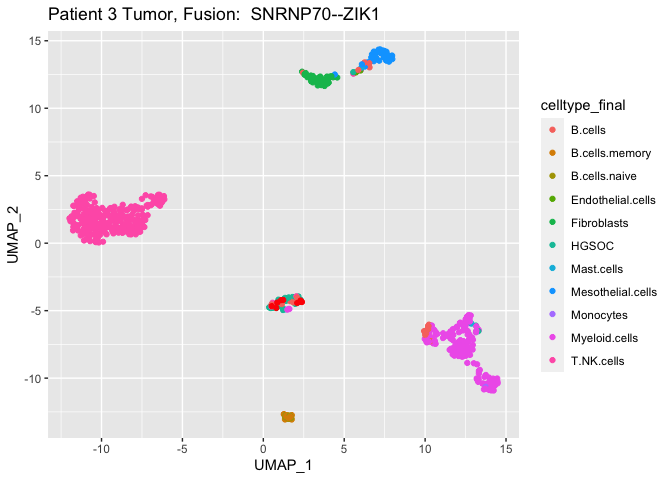

Patient1_analysis
================
bhaas
2023-09-28

``` r
MIN_CELLS = 5
```

# P3 Om

``` r
Om_data = read.table("data/Patient3_Om.Dondi_overian_CTAT_fusions.filtered_cells_and_dedup_umis.tsv.gz", header=T, sep="\t", stringsAsFactors = F) %>%
    filter(! is.na(UMAP_1))

nrow(Om_data)
```

    ## [1] 4520

``` r
Om_data %>% head()
```

    ##             FusionName   LeftBreakpoint  RightBreakpoint     cell_barcode
    ## 1         AAED1--SUMO1  chr9:96651390:- chr2:202214429:- AAGAGATTGCATTACG
    ## 2         ABCA1--SCAF4 chr9:104927831:- chr21:31685468:- ATTTGCGGAGCAGCAA
    ## 3        ABCA2--PRSS21 chr9:137016381:-  chr16:2821354:+ TGCTCAGCTTTGCTCC
    ## 4         ABCA3--SMOC2  chr16:2324468:- chr6:168547137:+ GAGAATAACAGCGATG
    ## 5         ABCA3--SMOC2  chr16:2324468:- chr6:168547137:+ GAGAATAACAGCGATG
    ## 6 ABCC1--RP11-640N20.4 chr16:16016594:+ chr16:16146115:+ CACTCGTACTCCCTCA
    ##            umi                                 read_name         method
    ## 1 TCGCATGTTTCG NS500318:945:HNGM5BGXG:3:11401:9392:13153    STAR-Fusion
    ## 2 GCTGCAGGGCCG          m64156_210214_222855/7345512/ccs ctat-LR-fusion
    ## 3 TTTAGATGGTTA          m64156_210226_140858/5410520/ccs ctat-LR-fusion
    ## 4 GACGATGAATTG         m64156_210214_222855/11810953/ccs ctat-LR-fusion
    ## 5 AGACGATGAATG         m64156_210214_222855/12469721/ccs ctat-LR-fusion
    ## 6 CAGTCTGCGTAG          m64156_210226_140858/1837470/ccs ctat-LR-fusion
    ##           barcodes    celltype_final    UMAP_1    UMAP_2     dataset
    ## 1 CGTAATGCAATCTCTT Mesothelial.cells -11.73349 -8.474167 Patient3_Om
    ## 2 TTGCTGCTCCGCAAAT Mesothelial.cells -11.86847 -8.825021 Patient3_Om
    ## 3 GGAGCAAAGCTGAGCA        T.NK.cells  12.45839  0.599520 Patient3_Om
    ## 4 CATCGCTGTTATTCTC Mesothelial.cells -11.73225 -8.369301 Patient3_Om
    ## 5 CATCGCTGTTATTCTC Mesothelial.cells -11.73225 -8.369301 Patient3_Om
    ## 6 TGAGGGAGTACGAGTG        T.NK.cells  12.67854  2.805120 Patient3_Om

``` r
# since starF and FI were run at max sensitivity, lets restrict fusions to those identified by ctat-LRF

Om_ctat_LRF_fusion_genes = Om_data %>% filter(method == 'ctat-LR-fusion') %>% select(FusionName) %>% unique() %>% pull(FusionName)

Om_data = Om_data %>% filter(FusionName %in% Om_ctat_LRF_fusion_genes)

nrow(Om_data)
```

    ## [1] 3715

``` r
fusion_annots = read.csv("data/Patient3.fusion_annots.gz", header=T, sep="\t", stringsAsFactors = F)
```

``` r
# Om sample composition

Om_bc_to_celltype = read.table("data/Patient3_Om.bc_to_celltype.tsv.gz", header=T, sep="\t")
Om_umap_coords = read.table("data/Patient3_Om_UMAPcoords.txt.gz", header=T, sep=",") %>% rename(barcodes=X)

Om_umap_data = left_join(Om_umap_coords, Om_bc_to_celltype, by='barcodes')

num_Om_cells = nrow(Om_umap_data)

message("Have ", num_Om_cells, " Om cells")
```

    ## Have 415 Om cells

``` r
# 415 Om cells

Om_data = Om_data %>% filter(barcodes %in% Om_umap_data$barcodes)
nrow(Om_data)
```

    ## [1] 3715

``` r
Om_cell_counts = Om_data %>% select(FusionName, cell_barcode) %>% unique() %>% 
    group_by(FusionName) %>%
    tally(name='tot_cells_w_fusion') %>%
    mutate(frac_tot_cells=tot_cells_w_fusion/num_Om_cells) %>%
    arrange(desc(frac_tot_cells))

Om_cell_counts %>% filter(tot_cells_w_fusion >= MIN_CELLS)
```

    ## # A tibble: 13 × 3
    ##    FusionName                   tot_cells_w_fusion frac_tot_cells
    ##    <chr>                                     <int>          <dbl>
    ##  1 ZCCHC8--RSRC2                               148         0.357 
    ##  2 RP11-208G20.2--PSPHP1                        85         0.205 
    ##  3 RP11-384F7.2--LSAMP                          20         0.0482
    ##  4 RP11-32B5.7--RP11-116P24.2                   13         0.0313
    ##  5 RP11-32B5.7--RP11-403B2.6                    13         0.0313
    ##  6 HOOK2--JUNB                                   8         0.0193
    ##  7 RP11-855A2.2--BPTF                            8         0.0193
    ##  8 CTD-2008L17.1--RP11-456O19.2                  7         0.0169
    ##  9 RP11-420N3.2--RBFOX1                          6         0.0145
    ## 10 PHYKPL--HNRNPAB                               5         0.0120
    ## 11 ROR2--NFIL3                                   5         0.0120
    ## 12 RP1-34H18.1--NAV3                             5         0.0120
    ## 13 RP11-444D3.1--SOX5                            5         0.0120

``` r
Om_cell_counts_by_method = read.table("data/Patient3_Om.Dondi_overian_CTAT_fusions.filtered_cells_and_dedup_umis.cell_counts_by_method.tsv.gz", 
                                      header=T, sep="\t", stringsAsFactors = F)

Om_cell_counts_by_method %>% head()
```

    ##              FusionName    LeftBreakpoint   RightBreakpoint          method
    ## 1         ZCCHC8--RSRC2 chr12:122498827:- chr12:122505706:-  ctat-LR-fusion
    ## 2 RP11-208G20.2--PSPHP1   chr7:55761799:+   chr7:55773181:+  ctat-LR-fusion
    ## 3     AC003080.4--PRDX6  chr7:111971400:-  chr1:173488635:+ FusionInspector
    ## 4         ZCCHC8--RSRC2 chr12:122498827:- chr12:122505706:-  ctat-LR-fusion
    ## 5 RP11-208G20.2--PSPHP1   chr7:55761798:+   chr7:55772328:+  ctat-LR-fusion
    ## 6   RP11-384F7.2--LSAMP  chr3:117997182:-  chr3:116444955:-  ctat-LR-fusion
    ##      celltype_final     dataset cell_counts
    ## 1 Mesothelial.cells Patient3_Om          68
    ## 2 Mesothelial.cells Patient3_Om          53
    ## 3 Mesothelial.cells Patient3_Om          43
    ## 4        T.NK.cells Patient3_Om          40
    ## 5 Mesothelial.cells Patient3_Om          29
    ## 6 Mesothelial.cells Patient3_Om          19

``` r
Om_cell_counts_by_method_spread = Om_cell_counts_by_method %>% select(FusionName, LeftBreakpoint, RightBreakpoint, method, celltype_final, cell_counts) %>%
    spread(key=method, value=cell_counts) %>% 
    arrange(desc(`ctat-LR-fusion`))

Om_cell_counts_by_method_spread %>% head()
```

    ##              FusionName    LeftBreakpoint   RightBreakpoint    celltype_final
    ## 1         ZCCHC8--RSRC2 chr12:122498827:- chr12:122505706:- Mesothelial.cells
    ## 2 RP11-208G20.2--PSPHP1   chr7:55761799:+   chr7:55773181:+ Mesothelial.cells
    ## 3         ZCCHC8--RSRC2 chr12:122498827:- chr12:122505706:-        T.NK.cells
    ## 4 RP11-208G20.2--PSPHP1   chr7:55761798:+   chr7:55772328:+ Mesothelial.cells
    ## 5   RP11-384F7.2--LSAMP  chr3:117997182:-  chr3:116444955:- Mesothelial.cells
    ## 6         ZCCHC8--RSRC2 chr12:122498827:- chr12:122505706:-     Myeloid.cells
    ##   ctat-LR-fusion FusionInspector STAR-Fusion
    ## 1             68               3           1
    ## 2             53              NA          NA
    ## 3             40              NA          NA
    ## 4             29              NA          NA
    ## 5             19              NA          NA
    ## 6             19              NA          NA

``` r
Om_fusion_frac_cell_types = Om_data %>% select(FusionName, barcodes, celltype_final) %>% unique() %>%
    group_by(FusionName, celltype_final) %>% tally(name='tot_cells_w_fusion') %>% 
    mutate(frac_fusion_cells=prop.table(tot_cells_w_fusion)) %>%
    arrange(desc(tot_cells_w_fusion))

Om_fusion_frac_cell_types %>% filter(tot_cells_w_fusion >= MIN_CELLS) 
```

    ## # A tibble: 17 × 4
    ## # Groups:   FusionName [10]
    ##    FusionName                   celltype_final    tot_cells_w_fusion frac_fusi…¹
    ##    <chr>                        <chr>                          <int>       <dbl>
    ##  1 ZCCHC8--RSRC2                Mesothelial.cells                 68      0.459 
    ##  2 RP11-208G20.2--PSPHP1        Mesothelial.cells                 63      0.741 
    ##  3 ZCCHC8--RSRC2                T.NK.cells                        40      0.270 
    ##  4 RP11-384F7.2--LSAMP          Mesothelial.cells                 19      0.95  
    ##  5 ZCCHC8--RSRC2                Myeloid.cells                     19      0.128 
    ##  6 ZCCHC8--RSRC2                Fibroblasts                       17      0.115 
    ##  7 RP11-208G20.2--PSPHP1        T.NK.cells                        11      0.129 
    ##  8 RP11-32B5.7--RP11-116P24.2   T.NK.cells                         8      0.615 
    ##  9 RP11-32B5.7--RP11-403B2.6    T.NK.cells                         8      0.615 
    ## 10 CTD-2008L17.1--RP11-456O19.2 Mesothelial.cells                  7      1     
    ## 11 RP11-208G20.2--PSPHP1        Myeloid.cells                      7      0.0824
    ## 12 RP11-420N3.2--RBFOX1         Mesothelial.cells                  6      1     
    ## 13 RP11-855A2.2--BPTF           Mesothelial.cells                  6      0.75  
    ## 14 HOOK2--JUNB                  Fibroblasts                        5      0.625 
    ## 15 ROR2--NFIL3                  Mesothelial.cells                  5      1     
    ## 16 RP11-32B5.7--RP11-116P24.2   Mesothelial.cells                  5      0.385 
    ## 17 RP11-32B5.7--RP11-403B2.6    Mesothelial.cells                  5      0.385 
    ## # … with abbreviated variable name ¹​frac_fusion_cells

# P3 Tumor

``` r
Tum_data = read.table("data/Patient3_Tum.Dondi_overian_CTAT_fusions.filtered_cells_and_dedup_umis.tsv.gz", header=T, sep="\t", stringsAsFactors = F) %>%
    filter(! is.na(UMAP_1))
 
nrow(Tum_data)
```

    ## [1] 3261

``` r
Tum_data %>% head()
```

    ##      FusionName   LeftBreakpoint   RightBreakpoint     cell_barcode
    ## 1   A1BG--STRBP chr19:58346887:-  chr9:123125497:- GCAACGCTGTCGGAAG
    ## 2    AASS--MEG3 chr7:122093048:- chr14:100848570:+ TAGTTACCTTACGATC
    ## 3    AASS--MEG3 chr7:122093048:- chr14:100848570:+ TAGTTACCTTACGATC
    ## 4 ABCA11P--AFF4    chr4:472575:-  chr5:132934941:- TGCAAGTTGTTCTATC
    ## 5  ABCA3--NFIL3  chr16:2340573:-   chr9:91410906:- GATGGGTGATCATGCA
    ## 6  ABCA5--USP25 chr17:69325699:-  chr21:15864268:+ GACCAGAGATAGGAAT
    ##            umi                                 read_name          method
    ## 1 AGGGATCAAGGA          m64156_210219_161109/4885829/ccs  ctat-LR-fusion
    ## 2 CTTTTCATTGCG NS500318:945:HNGM5BGXG:1:13303:7782:14704     STAR-Fusion
    ## 3 CTTTTCATTGCG NS500318:945:HNGM5BGXG:1:13303:7782:14704 FusionInspector
    ## 4 GCCTCAAAGAAT          m64156_210213_160114/4360485/ccs  ctat-LR-fusion
    ## 5 TATATGATGATA          m64156_210220_223905/8151666/ccs  ctat-LR-fusion
    ## 6 AGAGAGCTAGAT          m64156_210213_160114/3862947/ccs  ctat-LR-fusion
    ##           barcodes celltype_final     UMAP_1    UMAP_2      dataset
    ## 1 CTTCCGACAGCGTTGC          HGSOC  0.6810082 -4.588101 Patient3_Tum
    ## 2 GATCGTAAGGTAACTA    Fibroblasts  2.5894298 12.493015 Patient3_Tum
    ## 3 GATCGTAAGGTAACTA    Fibroblasts  2.5894298 12.493015 Patient3_Tum
    ## 4 GATAGAACAACTTGCA     T.NK.cells -8.6050201  1.075450 Patient3_Tum
    ## 5 TGCATGATCACCCATC  Myeloid.cells 11.9549626 -6.190181 Patient3_Tum
    ## 6 ATTCCTATCTCTGGTC     T.NK.cells -6.3617230  3.178483 Patient3_Tum

``` r
# since starF and FI were run at max sensitivity, lets restrict fusions to those identified by ctat-LRF

Tum_ctat_LRF_fusion_genes = Tum_data %>% filter(method == 'ctat-LR-fusion') %>% select(FusionName) %>% unique() %>% pull(FusionName)

Tum_data = Tum_data %>% filter(FusionName %in% Tum_ctat_LRF_fusion_genes)

nrow(Tum_data)
```

    ## [1] 2271

``` r
Tum_umap_data = read.table("data/Patient3_Tum_UMAPcoords.txt.gz", header=T, sep=",") %>%
    rename(barcodes=X)
celltypes = read.table("data/Patient3_Tum.bc_to_celltype.tsv.gz", header=T, sep="\t")

Tum_umap_data = full_join(Tum_umap_data, celltypes, by='barcodes')


Tum_umap_data = Tum_umap_data %>% filter(! is.na(UMAP_1))

# number of cells
num_tumor_cells = nrow(Tum_umap_data) 
message("number total tumor cells: ", num_tumor_cells)
```

    ## number total tumor cells: 646

``` r
# 646 total cells

Tum_umap_data %>% group_by(celltype_final) %>% tally(name='count_cell_type') %>% 
    mutate(frac_tot_cells = count_cell_type/num_tumor_cells) %>% arrange(desc(count_cell_type))
```

    ## # A tibble: 11 × 3
    ##    celltype_final    count_cell_type frac_tot_cells
    ##    <chr>                       <int>          <dbl>
    ##  1 T.NK.cells                    303        0.469  
    ##  2 Myeloid.cells                 165        0.255  
    ##  3 Fibroblasts                    45        0.0697 
    ##  4 Mesothelial.cells              45        0.0697 
    ##  5 HGSOC                          38        0.0588 
    ##  6 B.cells                        24        0.0372 
    ##  7 B.cells.memory                 13        0.0201 
    ##  8 B.cells.naive                   7        0.0108 
    ##  9 Mast.cells                      3        0.00464
    ## 10 Endothelial.cells               2        0.00310
    ## 11 Monocytes                       1        0.00155

``` r
# 38 HGSOC cells  (6% of total cells)
```

``` r
Tum_cell_counts = Tum_data %>% select(FusionName, cell_barcode) %>% unique() %>% 
    group_by(FusionName) %>%
    tally(name='tot_cells_w_fusion') %>%
    mutate(frac_tot_cells=tot_cells_w_fusion/num_tumor_cells)  %>%
    arrange(desc(frac_tot_cells))

Tum_cell_counts %>% filter(tot_cells_w_fusion >= MIN_CELLS)
```

    ## # A tibble: 20 × 3
    ##    FusionName                  tot_cells_w_fusion frac_tot_cells
    ##    <chr>                                    <int>          <dbl>
    ##  1 ZCCHC8--RSRC2                              297        0.460  
    ##  2 RP11-208G20.2--PSPHP1                      139        0.215  
    ##  3 VIM-AS1--VIM                                27        0.0418 
    ##  4 AC068446.1--RP11-403B2.6                    25        0.0387 
    ##  5 AC068446.1--RP11-116P24.2                   24        0.0372 
    ##  6 RP11-32B5.7--RP11-116P24.2                  21        0.0325 
    ##  7 RP11-32B5.7--RP11-403B2.6                   19        0.0294 
    ##  8 RP11-855A2.2--BPTF                          17        0.0263 
    ##  9 CBLC--CTC-232P5.1                           16        0.0248 
    ## 10 RP11-384F7.2--LSAMP                         13        0.0201 
    ## 11 RP11-678G14.2--RP11-58A17.3                  8        0.0124 
    ## 12 SNRNP70--ZIK1                                8        0.0124 
    ## 13 MBOAT7--CEACAM16                             7        0.0108 
    ## 14 RP11-444D3.1--SOX5                           7        0.0108 
    ## 15 RP11-678G14.2--ZNF85                         6        0.00929
    ## 16 STAG1--CACNA1C                               6        0.00929
    ## 17 ARHGAP35--CTD-2538C1.3                       5        0.00774
    ## 18 CASC15--RP11-500C11.3                        5        0.00774
    ## 19 IQGAP1--KIF13A                               5        0.00774
    ## 20 RMST--RMST_2                                 5        0.00774

``` r
Tum_cell_counts_by_method = read.table("data/Patient3_Tum.Dondi_overian_CTAT_fusions.filtered_cells_and_dedup_umis.cell_counts_by_method.tsv.gz", 
                                      header=T, sep="\t", stringsAsFactors = F)

Tum_cell_counts_by_method %>% head()
```

    ##              FusionName    LeftBreakpoint   RightBreakpoint          method
    ## 1         ZCCHC8--RSRC2 chr12:122498827:- chr12:122505706:-  ctat-LR-fusion
    ## 2         ZCCHC8--RSRC2 chr12:122498827:- chr12:122505706:-  ctat-LR-fusion
    ## 3 RP11-60E8.2--MINOS1P3  chr12:50757389:+   chr3:27214837:- FusionInspector
    ## 4 RP11-208G20.2--PSPHP1   chr7:55761799:+   chr7:55773181:+  ctat-LR-fusion
    ## 5 RP11-60E8.2--MINOS1P3  chr12:50757389:+   chr3:27214837:- FusionInspector
    ## 6         ZCCHC8--RSRC2 chr12:122498827:- chr12:122505706:-  ctat-LR-fusion
    ##   celltype_final      dataset cell_counts
    ## 1     T.NK.cells Patient3_Tum         105
    ## 2  Myeloid.cells Patient3_Tum          99
    ## 3  Myeloid.cells Patient3_Tum          64
    ## 4     T.NK.cells Patient3_Tum          36
    ## 5          HGSOC Patient3_Tum          32
    ## 6          HGSOC Patient3_Tum          30

``` r
Tum_cell_counts_by_method_spread = Tum_cell_counts_by_method %>% select(FusionName, LeftBreakpoint, RightBreakpoint, method, celltype_final, cell_counts) %>%
    spread(key=method, value=cell_counts) %>% 
    arrange(desc(`ctat-LR-fusion`))

Tum_cell_counts_by_method_spread %>% filter(`ctat-LR-fusion` >= MIN_CELLS)
```

    ##                     FusionName    LeftBreakpoint   RightBreakpoint
    ## 1                ZCCHC8--RSRC2 chr12:122498827:- chr12:122505706:-
    ## 2                ZCCHC8--RSRC2 chr12:122498827:- chr12:122505706:-
    ## 3        RP11-208G20.2--PSPHP1   chr7:55761799:+   chr7:55773181:+
    ## 4                ZCCHC8--RSRC2 chr12:122498827:- chr12:122505706:-
    ## 5        RP11-208G20.2--PSPHP1   chr7:55761799:+   chr7:55773181:+
    ## 6                ZCCHC8--RSRC2 chr12:122498827:- chr12:122505706:-
    ## 7        RP11-208G20.2--PSPHP1   chr7:55761799:+   chr7:55773181:+
    ## 8                ZCCHC8--RSRC2 chr12:122498827:- chr12:122505706:-
    ## 9        RP11-208G20.2--PSPHP1   chr7:55761799:+   chr7:55773181:+
    ## 10               ZCCHC8--RSRC2 chr12:122498827:- chr12:122505706:-
    ## 11       RP11-208G20.2--PSPHP1   chr7:55761798:+   chr7:55772328:+
    ## 12                VIM-AS1--VIM  chr10:17229660:-  chr10:17229747:+
    ## 13           CBLC--CTC-232P5.1  chr19:44784401:+   chr19:6012120:+
    ## 14       RP11-208G20.2--PSPHP1   chr7:55761798:+   chr7:55772328:+
    ## 15                VIM-AS1--VIM  chr10:17229660:-  chr10:17229747:+
    ## 16   AC068446.1--RP11-116P24.2  chr15:20778313:-  chr15:20759907:-
    ## 17    AC068446.1--RP11-403B2.6  chr15:20778313:-  chr15:20759907:-
    ## 18  RP11-32B5.7--RP11-116P24.2  chr15:21324988:-  chr15:20759979:-
    ## 19   RP11-32B5.7--RP11-403B2.6  chr15:21324988:-  chr15:20759979:-
    ## 20           CBLC--CTC-232P5.1  chr19:44784417:+   chr19:6012120:+
    ## 21       RP11-208G20.2--PSPHP1   chr7:55761799:+   chr7:55773181:+
    ## 22       RP11-208G20.2--PSPHP1   chr7:55761799:+   chr7:55773181:+
    ## 23          RP11-855A2.2--BPTF  chr17:67822409:+  chr17:67945409:+
    ## 24               SNRNP70--ZIK1  chr19:49098704:+  chr19:57590011:+
    ## 25           CBLC--CTC-232P5.1  chr19:44781051:+   chr19:6012120:+
    ## 26    AC068446.1--RP11-403B2.6  chr15:20778350:-  chr15:20759907:-
    ## 27       RP11-208G20.2--PSPHP1   chr7:55761798:+   chr7:55772328:+
    ## 28       RP11-208G20.2--PSPHP1   chr7:55761798:+   chr7:55772328:+
    ## 29  RP11-32B5.7--RP11-116P24.2  chr15:21324988:-  chr15:20759907:-
    ## 30         RP11-384F7.2--LSAMP  chr3:117997182:-  chr3:116444955:-
    ## 31          RP11-444D3.1--SOX5  chr12:24276141:-  chr12:23896024:-
    ## 32 RP11-678G14.2--RP11-58A17.3  chr19:21569104:-  chr12:57967189:+
    ## 33               ZCCHC8--RSRC2 chr12:122498827:- chr12:122505706:-
    ##       celltype_final ctat-LR-fusion FusionInspector STAR-Fusion
    ## 1         T.NK.cells            105               1           1
    ## 2      Myeloid.cells             99              NA          NA
    ## 3         T.NK.cells             36              NA          NA
    ## 4              HGSOC             30              NA          NA
    ## 5      Myeloid.cells             28              NA          NA
    ## 6  Mesothelial.cells             26              NA          NA
    ## 7              HGSOC             20              NA          NA
    ## 8        Fibroblasts             19              NA          NA
    ## 9  Mesothelial.cells             16              NA          NA
    ## 10           B.cells             13              NA          NA
    ## 11             HGSOC             12              NA          NA
    ## 12     Myeloid.cells             12              NA          NA
    ## 13             HGSOC             11               6           4
    ## 14     Myeloid.cells             11              NA          NA
    ## 15        T.NK.cells             10              NA          NA
    ## 16        T.NK.cells              9              NA          NA
    ## 17        T.NK.cells              9              NA          NA
    ## 18        T.NK.cells              9              NA          NA
    ## 19        T.NK.cells              9              NA          NA
    ## 20             HGSOC              8               3           3
    ## 21           B.cells              8              NA          NA
    ## 22       Fibroblasts              7              NA          NA
    ## 23             HGSOC              7              NA          NA
    ## 24             HGSOC              7              NA          NA
    ## 25             HGSOC              6               2           1
    ## 26             HGSOC              5              NA          NA
    ## 27 Mesothelial.cells              5              NA          NA
    ## 28        T.NK.cells              5              NA          NA
    ## 29             HGSOC              5              NA          NA
    ## 30 Mesothelial.cells              5              NA           1
    ## 31       Fibroblasts              5              NA          NA
    ## 32             HGSOC              5              NA          NA
    ## 33    B.cells.memory              5              NA          NA

# compare P1 Tum and Om fusions

``` r
Tum_n_Om_joined_fusions = full_join(Tum_cell_counts_by_method_spread, Om_cell_counts_by_method_spread, 
                                    by=c('FusionName', 'LeftBreakpoint', 'RightBreakpoint', 'celltype_final'),
                                    suffix=c('.Tum', '.Om'))

Tum_n_Om_joined_fusions %>% head()
```

    ##              FusionName    LeftBreakpoint   RightBreakpoint    celltype_final
    ## 1         ZCCHC8--RSRC2 chr12:122498827:- chr12:122505706:-        T.NK.cells
    ## 2         ZCCHC8--RSRC2 chr12:122498827:- chr12:122505706:-     Myeloid.cells
    ## 3 RP11-208G20.2--PSPHP1   chr7:55761799:+   chr7:55773181:+        T.NK.cells
    ## 4         ZCCHC8--RSRC2 chr12:122498827:- chr12:122505706:-             HGSOC
    ## 5 RP11-208G20.2--PSPHP1   chr7:55761799:+   chr7:55773181:+     Myeloid.cells
    ## 6         ZCCHC8--RSRC2 chr12:122498827:- chr12:122505706:- Mesothelial.cells
    ##   ctat-LR-fusion.Tum FusionInspector.Tum STAR-Fusion.Tum ctat-LR-fusion.Om
    ## 1                105                   1               1                40
    ## 2                 99                  NA              NA                19
    ## 3                 36                  NA              NA                 8
    ## 4                 30                  NA              NA                NA
    ## 5                 28                  NA              NA                 6
    ## 6                 26                  NA              NA                68
    ##   FusionInspector.Om STAR-Fusion.Om
    ## 1                 NA             NA
    ## 2                 NA             NA
    ## 3                 NA             NA
    ## 4                 NA             NA
    ## 5                 NA             NA
    ## 6                  3              1

``` r
Tum_n_Om_joined_fusions %>% select(FusionName, LeftBreakpoint, RightBreakpoint, celltype_final, `ctat-LR-fusion.Tum`, `ctat-LR-fusion.Om`) %>%
    arrange(desc(`ctat-LR-fusion.Tum`)) %>% 
    filter(`ctat-LR-fusion.Tum`>= MIN_CELLS)
```

    ##                     FusionName    LeftBreakpoint   RightBreakpoint
    ## 1                ZCCHC8--RSRC2 chr12:122498827:- chr12:122505706:-
    ## 2                ZCCHC8--RSRC2 chr12:122498827:- chr12:122505706:-
    ## 3        RP11-208G20.2--PSPHP1   chr7:55761799:+   chr7:55773181:+
    ## 4                ZCCHC8--RSRC2 chr12:122498827:- chr12:122505706:-
    ## 5        RP11-208G20.2--PSPHP1   chr7:55761799:+   chr7:55773181:+
    ## 6                ZCCHC8--RSRC2 chr12:122498827:- chr12:122505706:-
    ## 7        RP11-208G20.2--PSPHP1   chr7:55761799:+   chr7:55773181:+
    ## 8                ZCCHC8--RSRC2 chr12:122498827:- chr12:122505706:-
    ## 9        RP11-208G20.2--PSPHP1   chr7:55761799:+   chr7:55773181:+
    ## 10               ZCCHC8--RSRC2 chr12:122498827:- chr12:122505706:-
    ## 11       RP11-208G20.2--PSPHP1   chr7:55761798:+   chr7:55772328:+
    ## 12                VIM-AS1--VIM  chr10:17229660:-  chr10:17229747:+
    ## 13           CBLC--CTC-232P5.1  chr19:44784401:+   chr19:6012120:+
    ## 14       RP11-208G20.2--PSPHP1   chr7:55761798:+   chr7:55772328:+
    ## 15                VIM-AS1--VIM  chr10:17229660:-  chr10:17229747:+
    ## 16   AC068446.1--RP11-116P24.2  chr15:20778313:-  chr15:20759907:-
    ## 17    AC068446.1--RP11-403B2.6  chr15:20778313:-  chr15:20759907:-
    ## 18  RP11-32B5.7--RP11-116P24.2  chr15:21324988:-  chr15:20759979:-
    ## 19   RP11-32B5.7--RP11-403B2.6  chr15:21324988:-  chr15:20759979:-
    ## 20           CBLC--CTC-232P5.1  chr19:44784417:+   chr19:6012120:+
    ## 21       RP11-208G20.2--PSPHP1   chr7:55761799:+   chr7:55773181:+
    ## 22       RP11-208G20.2--PSPHP1   chr7:55761799:+   chr7:55773181:+
    ## 23          RP11-855A2.2--BPTF  chr17:67822409:+  chr17:67945409:+
    ## 24               SNRNP70--ZIK1  chr19:49098704:+  chr19:57590011:+
    ## 25           CBLC--CTC-232P5.1  chr19:44781051:+   chr19:6012120:+
    ## 26    AC068446.1--RP11-403B2.6  chr15:20778350:-  chr15:20759907:-
    ## 27       RP11-208G20.2--PSPHP1   chr7:55761798:+   chr7:55772328:+
    ## 28       RP11-208G20.2--PSPHP1   chr7:55761798:+   chr7:55772328:+
    ## 29  RP11-32B5.7--RP11-116P24.2  chr15:21324988:-  chr15:20759907:-
    ## 30         RP11-384F7.2--LSAMP  chr3:117997182:-  chr3:116444955:-
    ## 31          RP11-444D3.1--SOX5  chr12:24276141:-  chr12:23896024:-
    ## 32 RP11-678G14.2--RP11-58A17.3  chr19:21569104:-  chr12:57967189:+
    ## 33               ZCCHC8--RSRC2 chr12:122498827:- chr12:122505706:-
    ##       celltype_final ctat-LR-fusion.Tum ctat-LR-fusion.Om
    ## 1         T.NK.cells                105                40
    ## 2      Myeloid.cells                 99                19
    ## 3         T.NK.cells                 36                 8
    ## 4              HGSOC                 30                NA
    ## 5      Myeloid.cells                 28                 6
    ## 6  Mesothelial.cells                 26                68
    ## 7              HGSOC                 20                NA
    ## 8        Fibroblasts                 19                17
    ## 9  Mesothelial.cells                 16                53
    ## 10           B.cells                 13                NA
    ## 11             HGSOC                 12                NA
    ## 12     Myeloid.cells                 12                NA
    ## 13             HGSOC                 11                NA
    ## 14     Myeloid.cells                 11                 1
    ## 15        T.NK.cells                 10                NA
    ## 16        T.NK.cells                  9                NA
    ## 17        T.NK.cells                  9                NA
    ## 18        T.NK.cells                  9                 6
    ## 19        T.NK.cells                  9                 6
    ## 20             HGSOC                  8                NA
    ## 21           B.cells                  8                NA
    ## 22       Fibroblasts                  7                 2
    ## 23             HGSOC                  7                NA
    ## 24             HGSOC                  7                NA
    ## 25             HGSOC                  6                NA
    ## 26             HGSOC                  5                NA
    ## 27 Mesothelial.cells                  5                29
    ## 28        T.NK.cells                  5                 3
    ## 29             HGSOC                  5                NA
    ## 30 Mesothelial.cells                  5                19
    ## 31       Fibroblasts                  5                 4
    ## 32             HGSOC                  5                NA
    ## 33    B.cells.memory                  5                NA

``` r
Tum_fusion_frac_cell_types = Tum_data %>% select(FusionName, barcodes, celltype_final) %>% unique() %>%
    group_by(FusionName, celltype_final) %>% tally(name='tot_cells_w_fusion') %>% 
    mutate(frac_fusion_cells=prop.table(tot_cells_w_fusion)) %>%
    arrange(desc(tot_cells_w_fusion))

Tum_fusion_frac_cell_types %>% filter(tot_cells_w_fusion >= MIN_CELLS)
```

    ## # A tibble: 29 × 4
    ## # Groups:   FusionName [13]
    ##    FusionName            celltype_final    tot_cells_w_fusion frac_fusion_cells
    ##    <chr>                 <chr>                          <int>             <dbl>
    ##  1 ZCCHC8--RSRC2         T.NK.cells                       105            0.354 
    ##  2 ZCCHC8--RSRC2         Myeloid.cells                     99            0.333 
    ##  3 RP11-208G20.2--PSPHP1 T.NK.cells                        41            0.295 
    ##  4 RP11-208G20.2--PSPHP1 Myeloid.cells                     34            0.245 
    ##  5 ZCCHC8--RSRC2         HGSOC                             30            0.101 
    ##  6 RP11-208G20.2--PSPHP1 HGSOC                             26            0.187 
    ##  7 ZCCHC8--RSRC2         Mesothelial.cells                 26            0.0875
    ##  8 ZCCHC8--RSRC2         Fibroblasts                       19            0.0640
    ##  9 RP11-208G20.2--PSPHP1 Mesothelial.cells                 18            0.129 
    ## 10 CBLC--CTC-232P5.1     HGSOC                             14            0.875 
    ## # … with 19 more rows

``` r
# identify tumor-enriched fusions:
fusions_of_interest = Tum_fusion_frac_cell_types %>% filter(celltype_final == "HGSOC" & frac_fusion_cells >= 0.8) %>%
    arrange(desc(tot_cells_w_fusion)) %>%
    filter(tot_cells_w_fusion >= MIN_CELLS)


write.table(left_join(fusions_of_interest, fusion_annots), file="Patient3_Tum.fusions_of_interest.tsv", sep="\t", row.names=F, quote=F)
```

    ## Joining with `by = join_by(FusionName)`

``` r
fusions_of_interest
```

    ## # A tibble: 2 × 4
    ## # Groups:   FusionName [2]
    ##   FusionName        celltype_final tot_cells_w_fusion frac_fusion_cells
    ##   <chr>             <chr>                       <int>             <dbl>
    ## 1 CBLC--CTC-232P5.1 HGSOC                          14             0.875
    ## 2 SNRNP70--ZIK1     HGSOC                           7             0.875

``` r
Tum_data %>% filter(FusionName %in% fusions_of_interest$FusionName) %>% select(FusionName, cell_barcode, celltype_final) %>% unique() %>%
    group_by(FusionName, celltype_final) %>% tally()
```

    ## # A tibble: 5 × 3
    ## # Groups:   FusionName [2]
    ##   FusionName        celltype_final     n
    ##   <chr>             <chr>          <int>
    ## 1 CBLC--CTC-232P5.1 B.cells            1
    ## 2 CBLC--CTC-232P5.1 HGSOC             14
    ## 3 CBLC--CTC-232P5.1 Myeloid.cells      1
    ## 4 SNRNP70--ZIK1     B.cells            1
    ## 5 SNRNP70--ZIK1     HGSOC              7

``` r
# so 16 cells with CBLC--CTC-232P5.1
# and 8 cells with SNRNP70--ZIK1

# I suspecet the non HGSOC labeling for those was a bit off and they're likely all HGSOC - see the UMAPs...
```

``` r
# see if these fusions are found in the Om sample

left_join(fusions_of_interest, Om_fusion_frac_cell_types, by='FusionName', suffix=c('.Tum', '.Om'))
```

    ## # A tibble: 2 × 7
    ## # Groups:   FusionName [2]
    ##   FusionName        celltype_final.Tum tot_cel…¹ frac_…² cellt…³ tot_c…⁴ frac_…⁵
    ##   <chr>             <chr>                  <int>   <dbl> <chr>     <int>   <dbl>
    ## 1 CBLC--CTC-232P5.1 HGSOC                     14   0.875 <NA>         NA      NA
    ## 2 SNRNP70--ZIK1     HGSOC                      7   0.875 <NA>         NA      NA
    ## # … with abbreviated variable names ¹​tot_cells_w_fusion.Tum,
    ## #   ²​frac_fusion_cells.Tum, ³​celltype_final.Om, ⁴​tot_cells_w_fusion.Om,
    ## #   ⁵​frac_fusion_cells.Om

``` r
# only 2 fusions of interest
```

``` r
# see if we find these fusions using short reads:

fusions_of_interest = left_join(fusions_of_interest, Tum_cell_counts_by_method_spread)
```

    ## Joining with `by = join_by(FusionName, celltype_final)`

``` r
fusions_of_interest
```

    ## # A tibble: 6 × 9
    ## # Groups:   FusionName [2]
    ##   FusionName     cellt…¹ tot_c…² frac_…³ LeftB…⁴ Right…⁵ ctat-…⁶ Fusio…⁷ STAR-…⁸
    ##   <chr>          <chr>     <int>   <dbl> <chr>   <chr>     <int>   <int>   <int>
    ## 1 CBLC--CTC-232… HGSOC        14   0.875 chr19:… chr19:…      11       6       4
    ## 2 CBLC--CTC-232… HGSOC        14   0.875 chr19:… chr19:…       8       3       3
    ## 3 CBLC--CTC-232… HGSOC        14   0.875 chr19:… chr19:…       6       2       1
    ## 4 CBLC--CTC-232… HGSOC        14   0.875 chr19:… chr19:…       3       1       1
    ## 5 CBLC--CTC-232… HGSOC        14   0.875 chr19:… chr19:…       1      NA      NA
    ## 6 SNRNP70--ZIK1  HGSOC         7   0.875 chr19:… chr19:…       7      NA      NA
    ## # … with abbreviated variable names ¹​celltype_final, ²​tot_cells_w_fusion,
    ## #   ³​frac_fusion_cells, ⁴​LeftBreakpoint, ⁵​RightBreakpoint, ⁶​`ctat-LR-fusion`,
    ## #   ⁷​FusionInspector, ⁸​`STAR-Fusion`

``` r
fusions_of_interest = left_join(fusions_of_interest, fusion_annots)
```

    ## Joining with `by = join_by(FusionName)`

``` r
fusions_of_interest
```

    ## # A tibble: 6 × 10
    ## # Groups:   FusionName [2]
    ##   Fusio…¹ cellt…² tot_c…³ frac_…⁴ LeftB…⁵ Right…⁶ ctat-…⁷ Fusio…⁸ STAR-…⁹ annots
    ##   <chr>   <chr>     <int>   <dbl> <chr>   <chr>     <int>   <int>   <int> <chr> 
    ## 1 CBLC--… HGSOC        14   0.875 chr19:… chr19:…      11       6       4 CBLC-…
    ## 2 CBLC--… HGSOC        14   0.875 chr19:… chr19:…       8       3       3 CBLC-…
    ## 3 CBLC--… HGSOC        14   0.875 chr19:… chr19:…       6       2       1 CBLC-…
    ## 4 CBLC--… HGSOC        14   0.875 chr19:… chr19:…       3       1       1 CBLC-…
    ## 5 CBLC--… HGSOC        14   0.875 chr19:… chr19:…       1      NA      NA CBLC-…
    ## 6 SNRNP7… HGSOC         7   0.875 chr19:… chr19:…       7      NA      NA SNRNP…
    ## # … with abbreviated variable names ¹​FusionName, ²​celltype_final,
    ## #   ³​tot_cells_w_fusion, ⁴​frac_fusion_cells, ⁵​LeftBreakpoint, ⁶​RightBreakpoint,
    ## #   ⁷​`ctat-LR-fusion`, ⁸​FusionInspector, ⁹​`STAR-Fusion`

``` r
# only long reads detect SNRNP70--ZIK1
```

# Examine umaps for fusions

``` r
baseplot = Tum_umap_data %>% ggplot(aes(x=UMAP_1, y=UMAP_2)) + geom_point(aes(color=celltype_final))

baseplot
```

<!-- -->

``` r
x = 0

plots = list()

for (fusion in  unique(fusions_of_interest$FusionName)) {
    
    p = baseplot + geom_point(data=Tum_data %>% filter(FusionName == fusion) %>% select(UMAP_1, UMAP_2) %>% unique(), 
                              color='red') + 
        ggtitle(paste("Patient 3 Tumor, Fusion: ", fusion) )
    
    plot(p)   
    
    x = x+1
    plots[[x]] = p
}
```

<!-- --><!-- -->

``` r
pdf("Patient3_Tum.fusions_of_interest.pdf")
for (p in plots) {
    plot(p)
}

dev.off()
```

    ## quartz_off_screen 
    ##                 2

``` r
fusion_of_interest_cell_counts = Tum_data %>% filter(FusionName %in%  fusions_of_interest$FusionName) %>% 
        select(FusionName, method, barcodes) %>% unique() %>%
        group_by(FusionName, method) %>% tally(name='cell_counts') 


fusion_of_interest_cell_counts %>% spread(key=method, value=cell_counts) %>% arrange(desc(`ctat-LR-fusion`))
```

    ## # A tibble: 2 × 4
    ## # Groups:   FusionName [2]
    ##   FusionName        `ctat-LR-fusion` FusionInspector `STAR-Fusion`
    ##   <chr>                        <int>           <int>         <int>
    ## 1 CBLC--CTC-232P5.1               16              12             8
    ## 2 SNRNP70--ZIK1                    8              NA            NA

``` r
fusion_of_interest_cell_counts  %>%
              ggplot(aes(x=FusionName, y=cell_counts, fill=method)) + geom_bar(stat='identity', position='dodge') +
              theme(axis.text.x = element_text(angle = 90, hjust = 1)) +
    ggtitle("Patient3_Tum Fusions of Interest: Cell Counts")
```

<!-- -->

``` r
# breakdown by combinations of methods per cell

tumor_cell_counts_by_methods = Tum_data %>%
    filter(FusionName %in%  fusions_of_interest$FusionName) %>% 
        select(FusionName, method, barcodes) %>% unique() %>%
        group_by(FusionName, barcodes) %>% 
        arrange(method) %>%
        mutate(methods = paste(method, collapse=',')) %>%
        ungroup() %>%
        select(FusionName, methods, barcodes) %>% group_by(FusionName, methods) %>% tally(name='cell_counts')


tumor_cell_counts_by_methods 
```

    ## # A tibble: 4 × 3
    ## # Groups:   FusionName [2]
    ##   FusionName        methods                                    cell_counts
    ##   <chr>             <chr>                                            <int>
    ## 1 CBLC--CTC-232P5.1 FusionInspector,STAR-Fusion,ctat-LR-fusion          24
    ## 2 CBLC--CTC-232P5.1 FusionInspector,ctat-LR-fusion                       8
    ## 3 CBLC--CTC-232P5.1 ctat-LR-fusion                                       4
    ## 4 SNRNP70--ZIK1     ctat-LR-fusion                                       8

``` r
# by isoform 
tumor_cell_counts_by_methods_by_isoform =  Tum_data %>%
            filter(FusionName %in% fusions_of_interest$FusionName) %>%
            select(FusionName, LeftBreakpoint, RightBreakpoint, cell_barcode, method) %>%
              rowwise() %>% mutate(fusion=paste(FusionName, LeftBreakpoint, RightBreakpoint, collapse=":")) %>% 
              unique() %>%
             group_by(fusion, method) %>%
             tally(name='cell_counts')
        

tumor_cell_counts_by_methods_by_isoform 
```

    ## # A tibble: 14 × 3
    ## # Groups:   fusion [6]
    ##    fusion                                             method          cell_cou…¹
    ##    <chr>                                              <chr>                <int>
    ##  1 CBLC--CTC-232P5.1 chr19:44778284:+ chr19:6012120:+ ctat-LR-fusion           1
    ##  2 CBLC--CTC-232P5.1 chr19:44781051:+ chr19:6012120:+ FusionInspector          2
    ##  3 CBLC--CTC-232P5.1 chr19:44781051:+ chr19:6012120:+ STAR-Fusion              1
    ##  4 CBLC--CTC-232P5.1 chr19:44781051:+ chr19:6012120:+ ctat-LR-fusion           6
    ##  5 CBLC--CTC-232P5.1 chr19:44781363:+ chr19:6012120:+ FusionInspector          2
    ##  6 CBLC--CTC-232P5.1 chr19:44781363:+ chr19:6012120:+ STAR-Fusion              2
    ##  7 CBLC--CTC-232P5.1 chr19:44781363:+ chr19:6012120:+ ctat-LR-fusion           5
    ##  8 CBLC--CTC-232P5.1 chr19:44784401:+ chr19:6012120:+ FusionInspector          8
    ##  9 CBLC--CTC-232P5.1 chr19:44784401:+ chr19:6012120:+ STAR-Fusion              5
    ## 10 CBLC--CTC-232P5.1 chr19:44784401:+ chr19:6012120:+ ctat-LR-fusion          13
    ## 11 CBLC--CTC-232P5.1 chr19:44784417:+ chr19:6012120:+ FusionInspector          3
    ## 12 CBLC--CTC-232P5.1 chr19:44784417:+ chr19:6012120:+ STAR-Fusion              3
    ## 13 CBLC--CTC-232P5.1 chr19:44784417:+ chr19:6012120:+ ctat-LR-fusion          10
    ## 14 SNRNP70--ZIK1 chr19:49098704:+ chr19:57590011:+    ctat-LR-fusion           8
    ## # … with abbreviated variable name ¹​cell_counts

``` r
tumor_cell_counts_by_methods_by_isoform %>%
              ggplot(aes(x=fusion, y=cell_counts, fill=method)) + 
                 geom_bar(stat='identity', position='dodge') +
                 theme(axis.text.x = element_text(angle = 90, hjust = 1)) +
    ggtitle("Patient 3 Fusions of interest")
```

<!-- -->

``` r
# co-expression of CBLC--CTC-232P5.1 and SNRNP70--ZIK1 in cells

Tum_data %>% filter(FusionName %in% fusions_of_interest$FusionName) %>% select(FusionName, cell_barcode, celltype_final, UMAP_1, UMAP_2) %>% unique() %>%
    arrange(UMAP_1, UMAP_2)
```

    ##           FusionName     cell_barcode celltype_final    UMAP_1    UMAP_2
    ## 1  CBLC--CTC-232P5.1 TGGGCCATGCAAGATA          HGSOC 0.4548521 -4.665045
    ## 2  CBLC--CTC-232P5.1 GGTTCTCACGTGAAGC          HGSOC 0.5243679 -4.664466
    ## 3      SNRNP70--ZIK1 GGTTCTCACGTGAAGC          HGSOC 0.5243679 -4.664466
    ## 4  CBLC--CTC-232P5.1 GCAACGCTGTCGGAAG          HGSOC 0.6810082 -4.588101
    ## 5  CBLC--CTC-232P5.1 ACCAAGACTCTCGTGG          HGSOC 0.7203332 -4.604512
    ## 6  CBLC--CTC-232P5.1 CCATTGCACGTTAGAA          HGSOC 0.8043062 -4.802224
    ## 7      SNRNP70--ZIK1 CCATTGCACGTTAGAA          HGSOC 0.8043062 -4.802224
    ## 8  CBLC--CTC-232P5.1 ACGAAATGATCGCTTC          HGSOC 0.8608712 -4.400248
    ## 9      SNRNP70--ZIK1 ACGAAATGATCGCTTC          HGSOC 0.8608712 -4.400248
    ## 10 CBLC--CTC-232P5.1 CTTGTGGCTCGTGCAC          HGSOC 0.9952511 -4.309851
    ## 11 CBLC--CTC-232P5.1 ATCGCCACTGATTGAA          HGSOC 1.1013011 -4.216507
    ## 12     SNRNP70--ZIK1 ATCGCCACTGATTGAA          HGSOC 1.1013011 -4.216507
    ## 13 CBLC--CTC-232P5.1 AAGGGACACTTCAGCA          HGSOC 1.2296902 -4.206707
    ## 14     SNRNP70--ZIK1 AAGGGACACTTCAGCA          HGSOC 1.2296902 -4.206707
    ## 15 CBLC--CTC-232P5.1 AGTTCGATGCACTAAC  Myeloid.cells 1.4820196 -4.923253
    ## 16 CBLC--CTC-232P5.1 CGGTGTCGAAATTGAG          HGSOC 1.7964529 -4.123495
    ## 17 CBLC--CTC-232P5.1 GCAGGATGACCAGAGA          HGSOC 2.0021671 -4.257174
    ## 18 CBLC--CTC-232P5.1 CTTAGGATGTACCGTA          HGSOC 2.0925464 -4.433187
    ## 19     SNRNP70--ZIK1 CTTAGGATGTACCGTA          HGSOC 2.0925464 -4.433187
    ## 20 CBLC--CTC-232P5.1 CGTGGTGACGTAATGA          HGSOC 2.3014454 -4.250583
    ## 21     SNRNP70--ZIK1 CGTGGTGACGTAATGA          HGSOC 2.3014454 -4.250583
    ## 22 CBLC--CTC-232P5.1 CAACAGGGAGGTTGTT          HGSOC 2.3116511 -4.199208
    ## 23 CBLC--CTC-232P5.1 GATTCTACTGGGTATG        B.cells 2.3825716 -4.356057
    ## 24     SNRNP70--ZIK1 GATTCTACTGGGTATG        B.cells 2.3825716 -4.356057

``` r
# co-expression of CBLC--CTC-232P5.1 and SNRNP70--ZIK1 in cells

Tum_data %>% filter(FusionName %in% fusions_of_interest$FusionName) %>% 
   select(FusionName, cell_barcode, celltype_final, UMAP_1, UMAP_2) %>%
   unique() %>%
   group_by(cell_barcode) %>%
   mutate(fusions = paste(FusionName, collapse=",")) %>%
   select(fusions, cell_barcode, celltype_final, UMAP_1, UMAP_2) %>% unique() %>% 
    ungroup() %>%
    filter(grepl(",", fusions))
```

    ## # A tibble: 8 × 5
    ##   fusions                         cell_barcode     celltype_final UMAP_1 UMAP_2
    ##   <chr>                           <chr>            <chr>           <dbl>  <dbl>
    ## 1 CBLC--CTC-232P5.1,SNRNP70--ZIK1 AAGGGACACTTCAGCA HGSOC           1.23   -4.21
    ## 2 CBLC--CTC-232P5.1,SNRNP70--ZIK1 ATCGCCACTGATTGAA HGSOC           1.10   -4.22
    ## 3 CBLC--CTC-232P5.1,SNRNP70--ZIK1 CCATTGCACGTTAGAA HGSOC           0.804  -4.80
    ## 4 CBLC--CTC-232P5.1,SNRNP70--ZIK1 CGTGGTGACGTAATGA HGSOC           2.30   -4.25
    ## 5 CBLC--CTC-232P5.1,SNRNP70--ZIK1 GATTCTACTGGGTATG B.cells         2.38   -4.36
    ## 6 CBLC--CTC-232P5.1,SNRNP70--ZIK1 ACGAAATGATCGCTTC HGSOC           0.861  -4.40
    ## 7 CBLC--CTC-232P5.1,SNRNP70--ZIK1 CTTAGGATGTACCGTA HGSOC           2.09   -4.43
    ## 8 CBLC--CTC-232P5.1,SNRNP70--ZIK1 GGTTCTCACGTGAAGC HGSOC           0.524  -4.66

# fusions found in normal cells?

``` r
left_join(Tum_n_Om_joined_fusions %>% filter(`ctat-LR-fusion.Tum` >= MIN_CELLS & `ctat-LR-fusion.Om` > 0),
          fusion_annots,
          by='FusionName') 
```

    ##                    FusionName    LeftBreakpoint   RightBreakpoint
    ## 1               ZCCHC8--RSRC2 chr12:122498827:- chr12:122505706:-
    ## 2               ZCCHC8--RSRC2 chr12:122498827:- chr12:122505706:-
    ## 3       RP11-208G20.2--PSPHP1   chr7:55761799:+   chr7:55773181:+
    ## 4       RP11-208G20.2--PSPHP1   chr7:55761799:+   chr7:55773181:+
    ## 5               ZCCHC8--RSRC2 chr12:122498827:- chr12:122505706:-
    ## 6               ZCCHC8--RSRC2 chr12:122498827:- chr12:122505706:-
    ## 7       RP11-208G20.2--PSPHP1   chr7:55761799:+   chr7:55773181:+
    ## 8       RP11-208G20.2--PSPHP1   chr7:55761798:+   chr7:55772328:+
    ## 9  RP11-32B5.7--RP11-116P24.2  chr15:21324988:-  chr15:20759979:-
    ## 10  RP11-32B5.7--RP11-403B2.6  chr15:21324988:-  chr15:20759979:-
    ## 11      RP11-208G20.2--PSPHP1   chr7:55761799:+   chr7:55773181:+
    ## 12      RP11-208G20.2--PSPHP1   chr7:55761798:+   chr7:55772328:+
    ## 13      RP11-208G20.2--PSPHP1   chr7:55761798:+   chr7:55772328:+
    ## 14        RP11-384F7.2--LSAMP  chr3:117997182:-  chr3:116444955:-
    ## 15         RP11-444D3.1--SOX5  chr12:24276141:-  chr12:23896024:-
    ##       celltype_final ctat-LR-fusion.Tum FusionInspector.Tum STAR-Fusion.Tum
    ## 1         T.NK.cells                105                   1               1
    ## 2      Myeloid.cells                 99                  NA              NA
    ## 3         T.NK.cells                 36                  NA              NA
    ## 4      Myeloid.cells                 28                  NA              NA
    ## 5  Mesothelial.cells                 26                  NA              NA
    ## 6        Fibroblasts                 19                  NA              NA
    ## 7  Mesothelial.cells                 16                  NA              NA
    ## 8      Myeloid.cells                 11                  NA              NA
    ## 9         T.NK.cells                  9                  NA              NA
    ## 10        T.NK.cells                  9                  NA              NA
    ## 11       Fibroblasts                  7                  NA              NA
    ## 12 Mesothelial.cells                  5                  NA              NA
    ## 13        T.NK.cells                  5                  NA              NA
    ## 14 Mesothelial.cells                  5                  NA               1
    ## 15       Fibroblasts                  5                  NA              NA
    ##    ctat-LR-fusion.Om FusionInspector.Om STAR-Fusion.Om
    ## 1                 40                 NA             NA
    ## 2                 19                 NA             NA
    ## 3                  8                 NA             NA
    ## 4                  6                 NA             NA
    ## 5                 68                  3              1
    ## 6                 17                  1              1
    ## 7                 53                 NA             NA
    ## 8                  1                 NA             NA
    ## 9                  6                 NA             NA
    ## 10                 6                 NA             NA
    ## 11                 2                 NA             NA
    ## 12                29                 NA             NA
    ## 13                 3                 NA             NA
    ## 14                19                 NA             NA
    ## 15                 4                 NA             NA
    ##                                                                                                                                                                                                                                     annots
    ## 1  ZCCHC8--RSRC2:[YOSHIHARA_TCGA,DEEPEST2019,TumorFusionsNAR2018,ChimerSeq,TCGA_StarF2019,CCLE_StarF2019];INTRACHROMOSOMAL[chr12:0.00Mb];LOCAL_REARRANGEMENT:-:[2863];;(recip)RSRC2--ZCCHC8:INTRACHROMOSOMAL[chr12:0.00Mb];NEIGHBORS[2863]
    ## 2  ZCCHC8--RSRC2:[YOSHIHARA_TCGA,DEEPEST2019,TumorFusionsNAR2018,ChimerSeq,TCGA_StarF2019,CCLE_StarF2019];INTRACHROMOSOMAL[chr12:0.00Mb];LOCAL_REARRANGEMENT:-:[2863];;(recip)RSRC2--ZCCHC8:INTRACHROMOSOMAL[chr12:0.00Mb];NEIGHBORS[2863]
    ## 3                                                                                                                        RP11-208G20.2--PSPHP1:INTRACHROMOSOMAL[chr7:96.59Mb];;(recip)PSPHP1--RP11-208G20.2:INTRACHROMOSOMAL[chr7:96.59Mb]
    ## 4                                                                                                                        RP11-208G20.2--PSPHP1:INTRACHROMOSOMAL[chr7:96.59Mb];;(recip)PSPHP1--RP11-208G20.2:INTRACHROMOSOMAL[chr7:96.59Mb]
    ## 5  ZCCHC8--RSRC2:[YOSHIHARA_TCGA,DEEPEST2019,TumorFusionsNAR2018,ChimerSeq,TCGA_StarF2019,CCLE_StarF2019];INTRACHROMOSOMAL[chr12:0.00Mb];LOCAL_REARRANGEMENT:-:[2863];;(recip)RSRC2--ZCCHC8:INTRACHROMOSOMAL[chr12:0.00Mb];NEIGHBORS[2863]
    ## 6  ZCCHC8--RSRC2:[YOSHIHARA_TCGA,DEEPEST2019,TumorFusionsNAR2018,ChimerSeq,TCGA_StarF2019,CCLE_StarF2019];INTRACHROMOSOMAL[chr12:0.00Mb];LOCAL_REARRANGEMENT:-:[2863];;(recip)RSRC2--ZCCHC8:INTRACHROMOSOMAL[chr12:0.00Mb];NEIGHBORS[2863]
    ## 7                                                                                                                        RP11-208G20.2--PSPHP1:INTRACHROMOSOMAL[chr7:96.59Mb];;(recip)PSPHP1--RP11-208G20.2:INTRACHROMOSOMAL[chr7:96.59Mb]
    ## 8                                                                                                                        RP11-208G20.2--PSPHP1:INTRACHROMOSOMAL[chr7:96.59Mb];;(recip)PSPHP1--RP11-208G20.2:INTRACHROMOSOMAL[chr7:96.59Mb]
    ## 9                                                                                                              RP11-32B5.7--RP11-116P24.2:INTRACHROMOSOMAL[chr15:0.52Mb];;(recip)RP11-116P24.2--RP11-32B5.7:INTRACHROMOSOMAL[chr15:0.52Mb]
    ## 10                                                                                                               RP11-32B5.7--RP11-403B2.6:INTRACHROMOSOMAL[chr15:0.52Mb];;(recip)RP11-403B2.6--RP11-32B5.7:INTRACHROMOSOMAL[chr15:0.52Mb]
    ## 11                                                                                                                       RP11-208G20.2--PSPHP1:INTRACHROMOSOMAL[chr7:96.59Mb];;(recip)PSPHP1--RP11-208G20.2:INTRACHROMOSOMAL[chr7:96.59Mb]
    ## 12                                                                                                                       RP11-208G20.2--PSPHP1:INTRACHROMOSOMAL[chr7:96.59Mb];;(recip)PSPHP1--RP11-208G20.2:INTRACHROMOSOMAL[chr7:96.59Mb]
    ## 13                                                                                                                       RP11-208G20.2--PSPHP1:INTRACHROMOSOMAL[chr7:96.59Mb];;(recip)PSPHP1--RP11-208G20.2:INTRACHROMOSOMAL[chr7:96.59Mb]
    ## 14                                                                                                                             RP11-384F7.2--LSAMP:INTRACHROMOSOMAL[chr3:0.53Mb];;(recip)LSAMP--RP11-384F7.2:INTRACHROMOSOMAL[chr3:0.53Mb]
    ## 15                                                                                RP11-444D3.1--SOX5:[SOX5:Oncogene];[DepMap2023];INTRACHROMOSOMAL[chr12:0.26Mb];;(recip)SOX5--RP11-444D3.1:[SOX5:Oncogene];INTRACHROMOSOMAL[chr12:0.26Mb]

``` r
# top cell count 
left_join(Tum_n_Om_joined_fusions %>% filter(`ctat-LR-fusion.Tum` >= MIN_CELLS & `ctat-LR-fusion.Om` > 0),
          fusion_annots,
          by='FusionName')   %>%
    group_by(FusionName) %>% arrange(desc(`ctat-LR-fusion.Tum`)) %>% filter(row_number()==1) %>% ungroup() %>%
    
    select(FusionName, `ctat-LR-fusion.Tum`, annots) %>% unique()
```

    ## # A tibble: 6 × 3
    ##   FusionName                 `ctat-LR-fusion.Tum` annots                        
    ##   <chr>                                     <int> <chr>                         
    ## 1 ZCCHC8--RSRC2                               105 ZCCHC8--RSRC2:[YOSHIHARA_TCGA…
    ## 2 RP11-208G20.2--PSPHP1                        36 RP11-208G20.2--PSPHP1:INTRACH…
    ## 3 RP11-32B5.7--RP11-116P24.2                    9 RP11-32B5.7--RP11-116P24.2:IN…
    ## 4 RP11-32B5.7--RP11-403B2.6                     9 RP11-32B5.7--RP11-403B2.6:INT…
    ## 5 RP11-384F7.2--LSAMP                           5 RP11-384F7.2--LSAMP:INTRACHRO…
    ## 6 RP11-444D3.1--SOX5                            5 RP11-444D3.1--SOX5:[SOX5:Onco…

ZCCHC8–RSRC2 is found in both tumor and normal here, but reported as
tumor-relevant in several studies according to the fusion annotation.

``` r
report_on_fusion = function(fusion_name) {
    
    print(left_join(Tum_n_Om_joined_fusions %>% filter(FusionName == fusion_name),
              fusion_annots, by='FusionName') )
    
    print(Om_cell_counts %>% filter(FusionName == fusion_name) %>% mutate(type="Om"))
    
    print(Om_fusion_frac_cell_types %>% filter(FusionName == fusion_name) %>% mutate(type="Om"))
    
    print(Tum_cell_counts %>% filter(FusionName == fusion_name) %>% mutate(type="Tum"))
    
    print(Tum_fusion_frac_cell_types %>% filter(FusionName == fusion_name) %>% mutate(type="Tum"))
    
}
```

## ZCCHC8–RSRC2

``` r
report_on_fusion("ZCCHC8--RSRC2")
```

    ##       FusionName    LeftBreakpoint   RightBreakpoint    celltype_final
    ## 1  ZCCHC8--RSRC2 chr12:122498827:- chr12:122505706:-        T.NK.cells
    ## 2  ZCCHC8--RSRC2 chr12:122498827:- chr12:122505706:-     Myeloid.cells
    ## 3  ZCCHC8--RSRC2 chr12:122498827:- chr12:122505706:-             HGSOC
    ## 4  ZCCHC8--RSRC2 chr12:122498827:- chr12:122505706:- Mesothelial.cells
    ## 5  ZCCHC8--RSRC2 chr12:122498827:- chr12:122505706:-       Fibroblasts
    ## 6  ZCCHC8--RSRC2 chr12:122498827:- chr12:122505706:-           B.cells
    ## 7  ZCCHC8--RSRC2 chr12:122498827:- chr12:122505706:-    B.cells.memory
    ## 8  ZCCHC8--RSRC2 chr12:122498827:- chr12:122505706:-         uncertain
    ## 9  ZCCHC8--RSRC2 chr12:122498827:- chr12:122505706:-         Monocytes
    ## 10 ZCCHC8--RSRC2 chr12:122498827:- chr12:122505706:- Endothelial.cells
    ## 11 ZCCHC8--RSRC2 chr12:122498827:- chr12:122504039:- Mesothelial.cells
    ##    ctat-LR-fusion.Tum FusionInspector.Tum STAR-Fusion.Tum ctat-LR-fusion.Om
    ## 1                 105                   1               1                40
    ## 2                  99                  NA              NA                19
    ## 3                  30                  NA              NA                NA
    ## 4                  26                  NA              NA                68
    ## 5                  19                  NA              NA                17
    ## 6                  13                  NA              NA                NA
    ## 7                   5                  NA              NA                NA
    ## 8                   3                   1               1                NA
    ## 9                  NA                  NA              NA                 3
    ## 10                 NA                  NA              NA                 1
    ## 11                 NA                  NA              NA                NA
    ##    FusionInspector.Om STAR-Fusion.Om
    ## 1                  NA             NA
    ## 2                  NA             NA
    ## 3                  NA             NA
    ## 4                   3              1
    ## 5                   1              1
    ## 6                  NA             NA
    ## 7                  NA             NA
    ## 8                  NA             NA
    ## 9                   1             NA
    ## 10                 NA             NA
    ## 11                 NA              1
    ##                                                                                                                                                                                                                                     annots
    ## 1  ZCCHC8--RSRC2:[YOSHIHARA_TCGA,DEEPEST2019,TumorFusionsNAR2018,ChimerSeq,TCGA_StarF2019,CCLE_StarF2019];INTRACHROMOSOMAL[chr12:0.00Mb];LOCAL_REARRANGEMENT:-:[2863];;(recip)RSRC2--ZCCHC8:INTRACHROMOSOMAL[chr12:0.00Mb];NEIGHBORS[2863]
    ## 2  ZCCHC8--RSRC2:[YOSHIHARA_TCGA,DEEPEST2019,TumorFusionsNAR2018,ChimerSeq,TCGA_StarF2019,CCLE_StarF2019];INTRACHROMOSOMAL[chr12:0.00Mb];LOCAL_REARRANGEMENT:-:[2863];;(recip)RSRC2--ZCCHC8:INTRACHROMOSOMAL[chr12:0.00Mb];NEIGHBORS[2863]
    ## 3  ZCCHC8--RSRC2:[YOSHIHARA_TCGA,DEEPEST2019,TumorFusionsNAR2018,ChimerSeq,TCGA_StarF2019,CCLE_StarF2019];INTRACHROMOSOMAL[chr12:0.00Mb];LOCAL_REARRANGEMENT:-:[2863];;(recip)RSRC2--ZCCHC8:INTRACHROMOSOMAL[chr12:0.00Mb];NEIGHBORS[2863]
    ## 4  ZCCHC8--RSRC2:[YOSHIHARA_TCGA,DEEPEST2019,TumorFusionsNAR2018,ChimerSeq,TCGA_StarF2019,CCLE_StarF2019];INTRACHROMOSOMAL[chr12:0.00Mb];LOCAL_REARRANGEMENT:-:[2863];;(recip)RSRC2--ZCCHC8:INTRACHROMOSOMAL[chr12:0.00Mb];NEIGHBORS[2863]
    ## 5  ZCCHC8--RSRC2:[YOSHIHARA_TCGA,DEEPEST2019,TumorFusionsNAR2018,ChimerSeq,TCGA_StarF2019,CCLE_StarF2019];INTRACHROMOSOMAL[chr12:0.00Mb];LOCAL_REARRANGEMENT:-:[2863];;(recip)RSRC2--ZCCHC8:INTRACHROMOSOMAL[chr12:0.00Mb];NEIGHBORS[2863]
    ## 6  ZCCHC8--RSRC2:[YOSHIHARA_TCGA,DEEPEST2019,TumorFusionsNAR2018,ChimerSeq,TCGA_StarF2019,CCLE_StarF2019];INTRACHROMOSOMAL[chr12:0.00Mb];LOCAL_REARRANGEMENT:-:[2863];;(recip)RSRC2--ZCCHC8:INTRACHROMOSOMAL[chr12:0.00Mb];NEIGHBORS[2863]
    ## 7  ZCCHC8--RSRC2:[YOSHIHARA_TCGA,DEEPEST2019,TumorFusionsNAR2018,ChimerSeq,TCGA_StarF2019,CCLE_StarF2019];INTRACHROMOSOMAL[chr12:0.00Mb];LOCAL_REARRANGEMENT:-:[2863];;(recip)RSRC2--ZCCHC8:INTRACHROMOSOMAL[chr12:0.00Mb];NEIGHBORS[2863]
    ## 8  ZCCHC8--RSRC2:[YOSHIHARA_TCGA,DEEPEST2019,TumorFusionsNAR2018,ChimerSeq,TCGA_StarF2019,CCLE_StarF2019];INTRACHROMOSOMAL[chr12:0.00Mb];LOCAL_REARRANGEMENT:-:[2863];;(recip)RSRC2--ZCCHC8:INTRACHROMOSOMAL[chr12:0.00Mb];NEIGHBORS[2863]
    ## 9  ZCCHC8--RSRC2:[YOSHIHARA_TCGA,DEEPEST2019,TumorFusionsNAR2018,ChimerSeq,TCGA_StarF2019,CCLE_StarF2019];INTRACHROMOSOMAL[chr12:0.00Mb];LOCAL_REARRANGEMENT:-:[2863];;(recip)RSRC2--ZCCHC8:INTRACHROMOSOMAL[chr12:0.00Mb];NEIGHBORS[2863]
    ## 10 ZCCHC8--RSRC2:[YOSHIHARA_TCGA,DEEPEST2019,TumorFusionsNAR2018,ChimerSeq,TCGA_StarF2019,CCLE_StarF2019];INTRACHROMOSOMAL[chr12:0.00Mb];LOCAL_REARRANGEMENT:-:[2863];;(recip)RSRC2--ZCCHC8:INTRACHROMOSOMAL[chr12:0.00Mb];NEIGHBORS[2863]
    ## 11 ZCCHC8--RSRC2:[YOSHIHARA_TCGA,DEEPEST2019,TumorFusionsNAR2018,ChimerSeq,TCGA_StarF2019,CCLE_StarF2019];INTRACHROMOSOMAL[chr12:0.00Mb];LOCAL_REARRANGEMENT:-:[2863];;(recip)RSRC2--ZCCHC8:INTRACHROMOSOMAL[chr12:0.00Mb];NEIGHBORS[2863]
    ## # A tibble: 1 × 4
    ##   FusionName    tot_cells_w_fusion frac_tot_cells type 
    ##   <chr>                      <int>          <dbl> <chr>
    ## 1 ZCCHC8--RSRC2                148          0.357 Om   
    ## # A tibble: 6 × 5
    ## # Groups:   FusionName [1]
    ##   FusionName    celltype_final    tot_cells_w_fusion frac_fusion_cells type 
    ##   <chr>         <chr>                          <int>             <dbl> <chr>
    ## 1 ZCCHC8--RSRC2 Mesothelial.cells                 68           0.459   Om   
    ## 2 ZCCHC8--RSRC2 T.NK.cells                        40           0.270   Om   
    ## 3 ZCCHC8--RSRC2 Myeloid.cells                     19           0.128   Om   
    ## 4 ZCCHC8--RSRC2 Fibroblasts                       17           0.115   Om   
    ## 5 ZCCHC8--RSRC2 Monocytes                          3           0.0203  Om   
    ## 6 ZCCHC8--RSRC2 Endothelial.cells                  1           0.00676 Om   
    ## # A tibble: 1 × 4
    ##   FusionName    tot_cells_w_fusion frac_tot_cells type 
    ##   <chr>                      <int>          <dbl> <chr>
    ## 1 ZCCHC8--RSRC2                297          0.460 Tum  
    ## # A tibble: 7 × 5
    ## # Groups:   FusionName [1]
    ##   FusionName    celltype_final    tot_cells_w_fusion frac_fusion_cells type 
    ##   <chr>         <chr>                          <int>             <dbl> <chr>
    ## 1 ZCCHC8--RSRC2 T.NK.cells                       105            0.354  Tum  
    ## 2 ZCCHC8--RSRC2 Myeloid.cells                     99            0.333  Tum  
    ## 3 ZCCHC8--RSRC2 HGSOC                             30            0.101  Tum  
    ## 4 ZCCHC8--RSRC2 Mesothelial.cells                 26            0.0875 Tum  
    ## 5 ZCCHC8--RSRC2 Fibroblasts                       19            0.0640 Tum  
    ## 6 ZCCHC8--RSRC2 B.cells                           13            0.0438 Tum  
    ## 7 ZCCHC8--RSRC2 B.cells.memory                     5            0.0168 Tum

``` r
# 46% of tumor cells and 36% of normal cells
```

looks to be expressed across diverse cell types. Many long reads, few if
any short reads.

## RP11-208G20.2–PSPHP1

``` r
report_on_fusion("RP11-208G20.2--PSPHP1")
```

    ##               FusionName  LeftBreakpoint RightBreakpoint    celltype_final
    ## 1  RP11-208G20.2--PSPHP1 chr7:55761799:+ chr7:55773181:+        T.NK.cells
    ## 2  RP11-208G20.2--PSPHP1 chr7:55761799:+ chr7:55773181:+     Myeloid.cells
    ## 3  RP11-208G20.2--PSPHP1 chr7:55761799:+ chr7:55773181:+             HGSOC
    ## 4  RP11-208G20.2--PSPHP1 chr7:55761799:+ chr7:55773181:+ Mesothelial.cells
    ## 5  RP11-208G20.2--PSPHP1 chr7:55761798:+ chr7:55772328:+             HGSOC
    ## 6  RP11-208G20.2--PSPHP1 chr7:55761798:+ chr7:55772328:+     Myeloid.cells
    ## 7  RP11-208G20.2--PSPHP1 chr7:55761799:+ chr7:55773181:+           B.cells
    ## 8  RP11-208G20.2--PSPHP1 chr7:55761799:+ chr7:55773181:+       Fibroblasts
    ## 9  RP11-208G20.2--PSPHP1 chr7:55761798:+ chr7:55772328:+ Mesothelial.cells
    ## 10 RP11-208G20.2--PSPHP1 chr7:55761798:+ chr7:55772328:+        T.NK.cells
    ## 11 RP11-208G20.2--PSPHP1 chr7:55761798:+ chr7:55772328:+       Fibroblasts
    ## 12 RP11-208G20.2--PSPHP1 chr7:55761798:+ chr7:55772328:+         uncertain
    ## 13 RP11-208G20.2--PSPHP1 chr7:55761799:+ chr7:55773181:+         uncertain
    ## 14 RP11-208G20.2--PSPHP1 chr7:55761798:+ chr7:55772328:+           B.cells
    ## 15 RP11-208G20.2--PSPHP1 chr7:55761799:+ chr7:55773181:+    B.cells.memory
    ## 16 RP11-208G20.2--PSPHP1 chr7:55761799:+ chr7:55773181:+     B.cells.naive
    ##    ctat-LR-fusion.Tum FusionInspector.Tum STAR-Fusion.Tum ctat-LR-fusion.Om
    ## 1                  36                  NA              NA                 8
    ## 2                  28                  NA              NA                 6
    ## 3                  20                  NA              NA                NA
    ## 4                  16                  NA              NA                53
    ## 5                  12                  NA              NA                NA
    ## 6                  11                  NA              NA                 1
    ## 7                   8                  NA              NA                NA
    ## 8                   7                  NA              NA                 2
    ## 9                   5                  NA              NA                29
    ## 10                  5                  NA              NA                 3
    ## 11                  3                  NA              NA                 2
    ## 12                  2                  NA              NA                NA
    ## 13                  2                  NA              NA                NA
    ## 14                  1                  NA              NA                NA
    ## 15                  1                  NA              NA                NA
    ## 16                  1                  NA              NA                NA
    ##    FusionInspector.Om STAR-Fusion.Om
    ## 1                  NA             NA
    ## 2                  NA             NA
    ## 3                  NA             NA
    ## 4                  NA             NA
    ## 5                  NA             NA
    ## 6                  NA             NA
    ## 7                  NA             NA
    ## 8                  NA             NA
    ## 9                  NA             NA
    ## 10                 NA             NA
    ## 11                 NA             NA
    ## 12                 NA             NA
    ## 13                 NA             NA
    ## 14                 NA             NA
    ## 15                 NA             NA
    ## 16                 NA             NA
    ##                                                                                                               annots
    ## 1  RP11-208G20.2--PSPHP1:INTRACHROMOSOMAL[chr7:96.59Mb];;(recip)PSPHP1--RP11-208G20.2:INTRACHROMOSOMAL[chr7:96.59Mb]
    ## 2  RP11-208G20.2--PSPHP1:INTRACHROMOSOMAL[chr7:96.59Mb];;(recip)PSPHP1--RP11-208G20.2:INTRACHROMOSOMAL[chr7:96.59Mb]
    ## 3  RP11-208G20.2--PSPHP1:INTRACHROMOSOMAL[chr7:96.59Mb];;(recip)PSPHP1--RP11-208G20.2:INTRACHROMOSOMAL[chr7:96.59Mb]
    ## 4  RP11-208G20.2--PSPHP1:INTRACHROMOSOMAL[chr7:96.59Mb];;(recip)PSPHP1--RP11-208G20.2:INTRACHROMOSOMAL[chr7:96.59Mb]
    ## 5  RP11-208G20.2--PSPHP1:INTRACHROMOSOMAL[chr7:96.59Mb];;(recip)PSPHP1--RP11-208G20.2:INTRACHROMOSOMAL[chr7:96.59Mb]
    ## 6  RP11-208G20.2--PSPHP1:INTRACHROMOSOMAL[chr7:96.59Mb];;(recip)PSPHP1--RP11-208G20.2:INTRACHROMOSOMAL[chr7:96.59Mb]
    ## 7  RP11-208G20.2--PSPHP1:INTRACHROMOSOMAL[chr7:96.59Mb];;(recip)PSPHP1--RP11-208G20.2:INTRACHROMOSOMAL[chr7:96.59Mb]
    ## 8  RP11-208G20.2--PSPHP1:INTRACHROMOSOMAL[chr7:96.59Mb];;(recip)PSPHP1--RP11-208G20.2:INTRACHROMOSOMAL[chr7:96.59Mb]
    ## 9  RP11-208G20.2--PSPHP1:INTRACHROMOSOMAL[chr7:96.59Mb];;(recip)PSPHP1--RP11-208G20.2:INTRACHROMOSOMAL[chr7:96.59Mb]
    ## 10 RP11-208G20.2--PSPHP1:INTRACHROMOSOMAL[chr7:96.59Mb];;(recip)PSPHP1--RP11-208G20.2:INTRACHROMOSOMAL[chr7:96.59Mb]
    ## 11 RP11-208G20.2--PSPHP1:INTRACHROMOSOMAL[chr7:96.59Mb];;(recip)PSPHP1--RP11-208G20.2:INTRACHROMOSOMAL[chr7:96.59Mb]
    ## 12 RP11-208G20.2--PSPHP1:INTRACHROMOSOMAL[chr7:96.59Mb];;(recip)PSPHP1--RP11-208G20.2:INTRACHROMOSOMAL[chr7:96.59Mb]
    ## 13 RP11-208G20.2--PSPHP1:INTRACHROMOSOMAL[chr7:96.59Mb];;(recip)PSPHP1--RP11-208G20.2:INTRACHROMOSOMAL[chr7:96.59Mb]
    ## 14 RP11-208G20.2--PSPHP1:INTRACHROMOSOMAL[chr7:96.59Mb];;(recip)PSPHP1--RP11-208G20.2:INTRACHROMOSOMAL[chr7:96.59Mb]
    ## 15 RP11-208G20.2--PSPHP1:INTRACHROMOSOMAL[chr7:96.59Mb];;(recip)PSPHP1--RP11-208G20.2:INTRACHROMOSOMAL[chr7:96.59Mb]
    ## 16 RP11-208G20.2--PSPHP1:INTRACHROMOSOMAL[chr7:96.59Mb];;(recip)PSPHP1--RP11-208G20.2:INTRACHROMOSOMAL[chr7:96.59Mb]
    ## # A tibble: 1 × 4
    ##   FusionName            tot_cells_w_fusion frac_tot_cells type 
    ##   <chr>                              <int>          <dbl> <chr>
    ## 1 RP11-208G20.2--PSPHP1                 85          0.205 Om   
    ## # A tibble: 4 × 5
    ## # Groups:   FusionName [1]
    ##   FusionName            celltype_final    tot_cells_w_fusion frac_fusion…¹ type 
    ##   <chr>                 <chr>                          <int>         <dbl> <chr>
    ## 1 RP11-208G20.2--PSPHP1 Mesothelial.cells                 63        0.741  Om   
    ## 2 RP11-208G20.2--PSPHP1 T.NK.cells                        11        0.129  Om   
    ## 3 RP11-208G20.2--PSPHP1 Myeloid.cells                      7        0.0824 Om   
    ## 4 RP11-208G20.2--PSPHP1 Fibroblasts                        4        0.0471 Om   
    ## # … with abbreviated variable name ¹​frac_fusion_cells
    ## # A tibble: 1 × 4
    ##   FusionName            tot_cells_w_fusion frac_tot_cells type 
    ##   <chr>                              <int>          <dbl> <chr>
    ## 1 RP11-208G20.2--PSPHP1                139          0.215 Tum  
    ## # A tibble: 8 × 5
    ## # Groups:   FusionName [1]
    ##   FusionName            celltype_final    tot_cells_w_fusion frac_fusion…¹ type 
    ##   <chr>                 <chr>                          <int>         <dbl> <chr>
    ## 1 RP11-208G20.2--PSPHP1 T.NK.cells                        41       0.295   Tum  
    ## 2 RP11-208G20.2--PSPHP1 Myeloid.cells                     34       0.245   Tum  
    ## 3 RP11-208G20.2--PSPHP1 HGSOC                             26       0.187   Tum  
    ## 4 RP11-208G20.2--PSPHP1 Mesothelial.cells                 18       0.129   Tum  
    ## 5 RP11-208G20.2--PSPHP1 Fibroblasts                       10       0.0719  Tum  
    ## 6 RP11-208G20.2--PSPHP1 B.cells                            8       0.0576  Tum  
    ## 7 RP11-208G20.2--PSPHP1 B.cells.memory                     1       0.00719 Tum  
    ## 8 RP11-208G20.2--PSPHP1 B.cells.naive                      1       0.00719 Tum  
    ## # … with abbreviated variable name ¹​frac_fusion_cells

## RP11-384F7.2–LSAMP

``` r
report_on_fusion("RP11-384F7.2--LSAMP")
```

    ##            FusionName   LeftBreakpoint  RightBreakpoint    celltype_final
    ## 1 RP11-384F7.2--LSAMP chr3:117997182:- chr3:116444955:- Mesothelial.cells
    ## 2 RP11-384F7.2--LSAMP chr3:117997182:- chr3:116444955:-       Fibroblasts
    ## 3 RP11-384F7.2--LSAMP chr3:117997182:- chr3:116444955:-             HGSOC
    ## 4 RP11-384F7.2--LSAMP chr3:117997182:- chr3:115852617:- Mesothelial.cells
    ##   ctat-LR-fusion.Tum FusionInspector.Tum STAR-Fusion.Tum ctat-LR-fusion.Om
    ## 1                  5                  NA               1                19
    ## 2                  4                  NA              NA                 1
    ## 3                  2                  NA              NA                NA
    ## 4                  1                  NA              NA                NA
    ##   FusionInspector.Om STAR-Fusion.Om
    ## 1                 NA             NA
    ## 2                 NA             NA
    ## 3                 NA             NA
    ## 4                 NA             NA
    ##                                                                                                        annots
    ## 1 RP11-384F7.2--LSAMP:INTRACHROMOSOMAL[chr3:0.53Mb];;(recip)LSAMP--RP11-384F7.2:INTRACHROMOSOMAL[chr3:0.53Mb]
    ## 2 RP11-384F7.2--LSAMP:INTRACHROMOSOMAL[chr3:0.53Mb];;(recip)LSAMP--RP11-384F7.2:INTRACHROMOSOMAL[chr3:0.53Mb]
    ## 3 RP11-384F7.2--LSAMP:INTRACHROMOSOMAL[chr3:0.53Mb];;(recip)LSAMP--RP11-384F7.2:INTRACHROMOSOMAL[chr3:0.53Mb]
    ## 4 RP11-384F7.2--LSAMP:INTRACHROMOSOMAL[chr3:0.53Mb];;(recip)LSAMP--RP11-384F7.2:INTRACHROMOSOMAL[chr3:0.53Mb]
    ## # A tibble: 1 × 4
    ##   FusionName          tot_cells_w_fusion frac_tot_cells type 
    ##   <chr>                            <int>          <dbl> <chr>
    ## 1 RP11-384F7.2--LSAMP                 20         0.0482 Om   
    ## # A tibble: 2 × 5
    ## # Groups:   FusionName [1]
    ##   FusionName          celltype_final    tot_cells_w_fusion frac_fusion_c…¹ type 
    ##   <chr>               <chr>                          <int>           <dbl> <chr>
    ## 1 RP11-384F7.2--LSAMP Mesothelial.cells                 19            0.95 Om   
    ## 2 RP11-384F7.2--LSAMP Fibroblasts                        1            0.05 Om   
    ## # … with abbreviated variable name ¹​frac_fusion_cells
    ## # A tibble: 1 × 4
    ##   FusionName          tot_cells_w_fusion frac_tot_cells type 
    ##   <chr>                            <int>          <dbl> <chr>
    ## 1 RP11-384F7.2--LSAMP                 13         0.0201 Tum  
    ## # A tibble: 3 × 5
    ## # Groups:   FusionName [1]
    ##   FusionName          celltype_final    tot_cells_w_fusion frac_fusion_c…¹ type 
    ##   <chr>               <chr>                          <int>           <dbl> <chr>
    ## 1 RP11-384F7.2--LSAMP Mesothelial.cells                  7           0.538 Tum  
    ## 2 RP11-384F7.2--LSAMP Fibroblasts                        4           0.308 Tum  
    ## 3 RP11-384F7.2--LSAMP HGSOC                              2           0.154 Tum  
    ## # … with abbreviated variable name ¹​frac_fusion_cells

## RP11-444D3.1–SOX5

``` r
report_on_fusion("RP11-444D3.1--SOX5")
```

    ##           FusionName   LeftBreakpoint  RightBreakpoint    celltype_final
    ## 1 RP11-444D3.1--SOX5 chr12:24276141:- chr12:23896024:-       Fibroblasts
    ## 2 RP11-444D3.1--SOX5 chr12:24276141:- chr12:23896024:-             HGSOC
    ## 3 RP11-444D3.1--SOX5 chr12:24276141:- chr12:23896024:- Mesothelial.cells
    ## 4 RP11-444D3.1--SOX5 chr12:24276141:- chr12:23896024:-         uncertain
    ## 5 RP11-444D3.1--SOX5 chr12:24277216:- chr12:23896024:- Mesothelial.cells
    ## 6 RP11-444D3.1--SOX5 chr12:24213343:- chr12:23896024:-       Fibroblasts
    ##   ctat-LR-fusion.Tum FusionInspector.Tum STAR-Fusion.Tum ctat-LR-fusion.Om
    ## 1                  5                  NA              NA                 4
    ## 2                  1                  NA              NA                NA
    ## 3                  1                  NA              NA                NA
    ## 4                  1                  NA              NA                NA
    ## 5                 NA                  NA              NA                 1
    ## 6                 NA                  NA              NA                NA
    ##   FusionInspector.Om STAR-Fusion.Om
    ## 1                 NA             NA
    ## 2                 NA             NA
    ## 3                 NA             NA
    ## 4                 NA             NA
    ## 5                 NA             NA
    ## 6                  1              1
    ##                                                                                                                                                     annots
    ## 1 RP11-444D3.1--SOX5:[SOX5:Oncogene];[DepMap2023];INTRACHROMOSOMAL[chr12:0.26Mb];;(recip)SOX5--RP11-444D3.1:[SOX5:Oncogene];INTRACHROMOSOMAL[chr12:0.26Mb]
    ## 2 RP11-444D3.1--SOX5:[SOX5:Oncogene];[DepMap2023];INTRACHROMOSOMAL[chr12:0.26Mb];;(recip)SOX5--RP11-444D3.1:[SOX5:Oncogene];INTRACHROMOSOMAL[chr12:0.26Mb]
    ## 3 RP11-444D3.1--SOX5:[SOX5:Oncogene];[DepMap2023];INTRACHROMOSOMAL[chr12:0.26Mb];;(recip)SOX5--RP11-444D3.1:[SOX5:Oncogene];INTRACHROMOSOMAL[chr12:0.26Mb]
    ## 4 RP11-444D3.1--SOX5:[SOX5:Oncogene];[DepMap2023];INTRACHROMOSOMAL[chr12:0.26Mb];;(recip)SOX5--RP11-444D3.1:[SOX5:Oncogene];INTRACHROMOSOMAL[chr12:0.26Mb]
    ## 5 RP11-444D3.1--SOX5:[SOX5:Oncogene];[DepMap2023];INTRACHROMOSOMAL[chr12:0.26Mb];;(recip)SOX5--RP11-444D3.1:[SOX5:Oncogene];INTRACHROMOSOMAL[chr12:0.26Mb]
    ## 6 RP11-444D3.1--SOX5:[SOX5:Oncogene];[DepMap2023];INTRACHROMOSOMAL[chr12:0.26Mb];;(recip)SOX5--RP11-444D3.1:[SOX5:Oncogene];INTRACHROMOSOMAL[chr12:0.26Mb]
    ## # A tibble: 1 × 4
    ##   FusionName         tot_cells_w_fusion frac_tot_cells type 
    ##   <chr>                           <int>          <dbl> <chr>
    ## 1 RP11-444D3.1--SOX5                  5         0.0120 Om   
    ## # A tibble: 2 × 5
    ## # Groups:   FusionName [1]
    ##   FusionName         celltype_final    tot_cells_w_fusion frac_fusion_ce…¹ type 
    ##   <chr>              <chr>                          <int>            <dbl> <chr>
    ## 1 RP11-444D3.1--SOX5 Fibroblasts                        4              0.8 Om   
    ## 2 RP11-444D3.1--SOX5 Mesothelial.cells                  1              0.2 Om   
    ## # … with abbreviated variable name ¹​frac_fusion_cells
    ## # A tibble: 1 × 4
    ##   FusionName         tot_cells_w_fusion frac_tot_cells type 
    ##   <chr>                           <int>          <dbl> <chr>
    ## 1 RP11-444D3.1--SOX5                  7         0.0108 Tum  
    ## # A tibble: 3 × 5
    ## # Groups:   FusionName [1]
    ##   FusionName         celltype_final    tot_cells_w_fusion frac_fusion_ce…¹ type 
    ##   <chr>              <chr>                          <int>            <dbl> <chr>
    ## 1 RP11-444D3.1--SOX5 Fibroblasts                        5            0.714 Tum  
    ## 2 RP11-444D3.1--SOX5 HGSOC                              1            0.143 Tum  
    ## 3 RP11-444D3.1--SOX5 Mesothelial.cells                  1            0.143 Tum  
    ## # … with abbreviated variable name ¹​frac_fusion_cells
