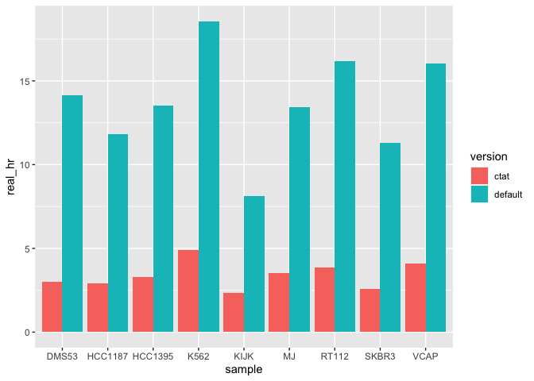
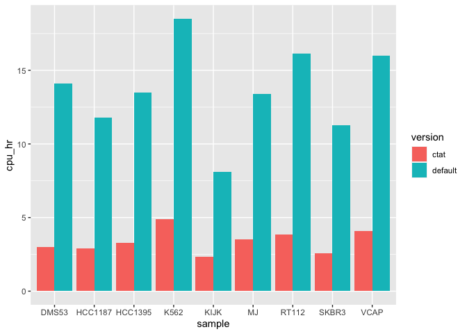

ctat-mm2-timings
================
bhaas
2024-01-26

Regular minimap2 and the modified ctat-minimap2 were run on the 9 cell
lines to examine the time differences in execution.

Using the regular setting:

for file in ../\*fastq.gz; do ctat-minimap2 –sam-hit-only -ax splice
–junc-bed
/seq/RNASEQ/\_\_ctat_genome_lib_building/Mar2021/GRCh38_gencode_v22_CTAT_lib_Mar012021.plug-n-play/ctat_genome_lib_build_dir/ref_annot.mm2.bed
–secondary=no -t 1 -u b -G 100000
/seq/RNASEQ/\_\_ctat_genome_lib_building/Mar2021/GRCh38_gencode_v22_CTAT_lib_Mar012021.plug-n-play/ctat_genome_lib_build_dir/ref_genome.fa.mm2
\$file \> \$file.sam 2\>&1 & done

Using the –only_chimeric setting:

for file in ../\*fastq.gz; do ctat-minimap2 –only_chimeric –sam-hit-only
-ax splice –junc-bed
/seq/RNASEQ/\_\_ctat_genome_lib_building/Mar2021/GRCh38_gencode_v22_CTAT_lib_Mar012021.plug-n-play/ctat_genome_lib_build_dir/ref_annot.mm2.bed
–secondary=no -t 1 -u b -G 100000
/seq/RNASEQ/\_\_ctat_genome_lib_building/Mar2021/GRCh38_gencode_v22_CTAT_lib_Mar012021.plug-n-play/ctat_genome_lib_build_dir/ref_genome.fa.mm2
\$file \> \$file.sam2 2\>&1 & done

``` r
timings_data = read.csv("data/timings.dat", sep=" ", header=F)

timings_data
```

    ##         V1      V2        V3   V4    V5        V6   V7   V8        V9  V10  V11
    ## 1    DMS53 default [M::main] Real time: 50943.293 sec; CPU: 50817.564 sec; Peak
    ## 2  HCC1187 default [M::main] Real time: 42551.624 sec; CPU: 42446.605 sec; Peak
    ## 3  HCC1395 default [M::main] Real time: 48623.518 sec; CPU: 48495.626 sec; Peak
    ## 4     K562 default [M::main] Real time: 66796.644 sec; CPU: 66624.302 sec; Peak
    ## 5     KIJK default [M::main] Real time: 29322.507 sec; CPU: 29243.585 sec; Peak
    ## 6       MJ default [M::main] Real time: 48329.294 sec; CPU: 48209.864 sec; Peak
    ## 7    RT112 default [M::main] Real time: 58325.625 sec; CPU: 58181.648 sec; Peak
    ## 8    SKBR3 default [M::main] Real time: 40610.451 sec; CPU: 40509.077 sec; Peak
    ## 9     VCAP default [M::main] Real time: 57661.118 sec; CPU: 57510.270 sec; Peak
    ## 10   DMS53    ctat [M::main] Real time: 10814.950 sec; CPU: 10787.651 sec; Peak
    ## 11 HCC1187    ctat [M::main] Real time: 10430.832 sec; CPU: 10403.509 sec; Peak
    ## 12 HCC1395    ctat [M::main] Real time: 11869.913 sec; CPU: 11840.901 sec; Peak
    ## 13    K562    ctat [M::main] Real time: 17608.495 sec; CPU: 17565.190 sec; Peak
    ## 14    KIJK    ctat [M::main] Real time:  8398.030 sec; CPU:  8375.411 sec; Peak
    ## 15      MJ    ctat [M::main] Real time: 12723.323 sec; CPU: 12690.217 sec; Peak
    ## 16   RT112    ctat [M::main] Real time: 13868.537 sec; CPU: 13832.565 sec; Peak
    ## 17   SKBR3    ctat [M::main] Real time:  9237.117 sec; CPU:  9212.724 sec; Peak
    ## 18    VCAP    ctat [M::main] Real time: 14792.035 sec; CPU: 14755.355 sec; Peak
    ##     V12    V13 V14
    ## 1  RSS:  9.376  GB
    ## 2  RSS:  9.147  GB
    ## 3  RSS:  9.185  GB
    ## 4  RSS:  9.344  GB
    ## 5  RSS:  9.345  GB
    ## 6  RSS:  9.149  GB
    ## 7  RSS:  9.149  GB
    ## 8  RSS:  9.187  GB
    ## 9  RSS:  9.162  GB
    ## 10 RSS: 11.382  GB
    ## 11 RSS: 10.500  GB
    ## 12 RSS: 11.174  GB
    ## 13 RSS: 11.971  GB
    ## 14 RSS: 10.306  GB
    ## 15 RSS: 11.223  GB
    ## 16 RSS: 11.503  GB
    ## 17 RSS: 10.549  GB
    ## 18 RSS: 11.525  GB

``` r
timings_data = timings_data[,c(1,2,6,9)]

colnames(timings_data) = c('sample', 'version', 'real', 'CPU')

timings_data 
```

    ##     sample version      real       CPU
    ## 1    DMS53 default 50943.293 50817.564
    ## 2  HCC1187 default 42551.624 42446.605
    ## 3  HCC1395 default 48623.518 48495.626
    ## 4     K562 default 66796.644 66624.302
    ## 5     KIJK default 29322.507 29243.585
    ## 6       MJ default 48329.294 48209.864
    ## 7    RT112 default 58325.625 58181.648
    ## 8    SKBR3 default 40610.451 40509.077
    ## 9     VCAP default 57661.118 57510.270
    ## 10   DMS53    ctat 10814.950 10787.651
    ## 11 HCC1187    ctat 10430.832 10403.509
    ## 12 HCC1395    ctat 11869.913 11840.901
    ## 13    K562    ctat 17608.495 17565.190
    ## 14    KIJK    ctat  8398.030  8375.411
    ## 15      MJ    ctat 12723.323 12690.217
    ## 16   RT112    ctat 13868.537 13832.565
    ## 17   SKBR3    ctat  9237.117  9212.724
    ## 18    VCAP    ctat 14792.035 14755.355

``` r
timings_data %>% 
    mutate(real_hr = real/60/60) %>%
    
    ggplot(aes(x=sample, y=real_hr)) + geom_bar(stat='identity', position='dodge', aes(fill=version)) 
```

<!-- -->

``` r
timings_data %>% 
    mutate(cpu_hr = CPU/60/60) %>%
    ggplot(aes(x=sample, y=cpu_hr)) + geom_bar(stat='identity', position='dodge', aes(fill=version)) 
```

<!-- -->

``` r
timings_spread = full_join(timings_data %>% filter(version == "default"),
          timings_data %>% filter(version == "ctat"),
          by=c('sample'),
          suffix=c('.default', '.ctat')
        )

timings_spread 
```

    ##    sample version.default real.default CPU.default version.ctat real.ctat
    ## 1   DMS53         default     50943.29    50817.56         ctat 10814.950
    ## 2 HCC1187         default     42551.62    42446.61         ctat 10430.832
    ## 3 HCC1395         default     48623.52    48495.63         ctat 11869.913
    ## 4    K562         default     66796.64    66624.30         ctat 17608.495
    ## 5    KIJK         default     29322.51    29243.58         ctat  8398.030
    ## 6      MJ         default     48329.29    48209.86         ctat 12723.323
    ## 7   RT112         default     58325.62    58181.65         ctat 13868.537
    ## 8   SKBR3         default     40610.45    40509.08         ctat  9237.117
    ## 9    VCAP         default     57661.12    57510.27         ctat 14792.035
    ##    CPU.ctat
    ## 1 10787.651
    ## 2 10403.509
    ## 3 11840.901
    ## 4 17565.190
    ## 5  8375.411
    ## 6 12690.217
    ## 7 13832.565
    ## 8  9212.724
    ## 9 14755.355

``` r
timings_spread = timings_spread %>% mutate(frac_ctat_real = real.ctat / real.default, frac_ctat_cpu = CPU.ctat / CPU.default)

timings_spread %>% select(sample, frac_ctat_real, frac_ctat_cpu)
```

    ##    sample frac_ctat_real frac_ctat_cpu
    ## 1   DMS53      0.2122939     0.2122819
    ## 2 HCC1187      0.2451336     0.2450964
    ## 3 HCC1395      0.2441188     0.2441643
    ## 4    K562      0.2636135     0.2636454
    ## 5    KIJK      0.2864022     0.2864017
    ## 6      MJ      0.2632632     0.2632286
    ## 7   RT112      0.2377778     0.2377479
    ## 8   SKBR3      0.2274566     0.2274237
    ## 9    VCAP      0.2565340     0.2565690

So, overall, we cut the time down to \~ 1/4th by focusing on just the
likely chimeric read alignments.
