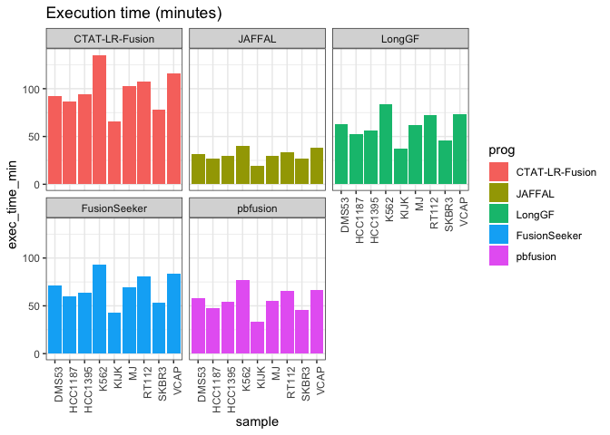

examine_resource_usage
================
bhaas
2024-07-23

``` r
resource_usage_df = read.csv("resource_usage.stats.tsv", header=T, sep="\t")

resource_usage_df %>% head()
```

    ##    sample             prog exec_time_min max_memory_GiB
    ## 1   DMS53        ctat_task          92.5          16.87
    ## 2 HCC1395     pbfusionTask           0.7           5.07
    ## 3   DMS53     pbfusionTask           0.5           4.87
    ## 4    KIJK FusionSeekerTask           7.3          20.58
    ## 5   RT112       JAFFALTask          33.8          20.20
    ## 6 HCC1395     minimap2Task          53.8          22.56

``` r
resource_usage_df %>% ggplot(aes(x=sample, y=exec_time_min)) + geom_col(aes(fill=prog)) + facet_wrap(~prog) +
   theme_bw() +
   theme(axis.text.x = element_text(angle = 90, hjust = 1)) +
    ggtitle("Execution time (minutes)")
```

<!-- -->

pbfusion = seqtkTask + pbmm2 + pbfusionTAsk

longgf = longGFTask + minimap2Task

fusionseeker = FusionSeekerTask + minimap2Task

``` r
seqtkTask_df = resource_usage_df %>% filter(prog == 'seqtkTask') %>% rename(seqtk_exec_time = exec_time_min,
                                                                            seqtk_max_mem_GiB = max_memory_GiB)

minimap2Task_df = resource_usage_df %>% filter(prog == 'minimap2Task') %>% rename(mm2_exec_time = exec_time_min,
                                                                               mm2_max_mem_GiB = max_memory_GiB)

pbmm2Task_df = resource_usage_df %>% filter(prog == 'pbmm2') %>% rename(pbmm2_exec_time = exec_time_min,
                                                                     pbmm2_max_mem_GiB = max_memory_GiB)

################################
# sum up relevant workflow parts

# pbfusion

pbfusionTask = left_join( left_join(resource_usage_df %>% filter(prog=='pbfusionTask'), 
                                 seqtkTask_df %>% select(sample, seqtk_exec_time, seqtk_max_mem_GiB), by='sample'),
                       pbmm2Task_df %>% select(sample, pbmm2_exec_time, pbmm2_max_mem_GiB), by='sample' )
                       

pbfusionTask = pbfusionTask %>% rowwise() %>%
    mutate (exec_time_min = exec_time_min + seqtk_exec_time + pbmm2_exec_time,
            max_memory_GiB = max(max_memory_GiB, seqtk_max_mem_GiB, pbmm2_max_mem_GiB) ) 


# longGF

longgfTask = left_join(resource_usage_df %>% filter(prog == 'LongGFTask'),
                       minimap2Task_df %>% select(sample, mm2_exec_time, mm2_max_mem_GiB),
                       by='sample')


longgfTask = longgfTask %>% mutate(exec_time_min = exec_time_min + mm2_exec_time,
                                   max_memory_GiB = max(max_memory_GiB, mm2_max_mem_GiB))


# fusionseeker


FusionSeekerTask = left_join(resource_usage_df %>% filter(prog == 'FusionSeekerTask'),
                       minimap2Task_df %>% select(sample, mm2_exec_time, mm2_max_mem_GiB),
                       by='sample')


FusionSeekerTask = FusionSeekerTask %>% mutate(exec_time_min = exec_time_min + mm2_exec_time,
                                   max_memory_GiB = max(max_memory_GiB, mm2_max_mem_GiB))
```

``` r
# rebuild resource_usage_df using workflow stats

resource_usage_df  = bind_rows(resource_usage_df %>% filter(prog %in% c('ctat_task', 'JAFFALTask')),
                               pbfusionTask,
                               longgfTask,
                               FusionSeekerTask,
                               
                               )
```

``` r
resource_usage_df = resource_usage_df %>% 
    mutate(prog = ifelse(prog == 'ctat_task', 'CTAT-LR-Fusion', prog)) %>%
    mutate(prog = ifelse(prog == "JAFFALTask", "JAFFAL", prog)) %>%
    mutate(prog = ifelse(prog == "FusionSeekerTask", "FusionSeeker", prog)) %>%
    mutate(prog = ifelse(prog == "LongGFTask", "LongGF", prog)) %>%
    mutate(prog = ifelse(prog == "pbfusionTask", "pbfusion", prog))


PROGS = c('CTAT-LR-Fusion', 'JAFFAL', 'LongGF', 'FusionSeeker', 'pbfusion')

resource_usage_df$prog = factor(resource_usage_df$prog, levels=PROGS)
```

``` r
exec_time_plot = resource_usage_df %>% ggplot(aes(x=sample, y=exec_time_min)) + geom_col(aes(fill=prog)) + facet_wrap(~prog) +
   theme_bw() +
   theme(axis.text.x = element_text(angle = 90, hjust = 1)) +
    ggtitle("Execution time (minutes)")
   

exec_time_plot
```

<!-- -->

``` r
ggsave(exec_time_plot, file="exec_time_plot.svg", width=7, height=5)
```

``` r
mem_usage_plot = resource_usage_df %>% ggplot(aes(x=sample, y=max_memory_GiB)) + geom_col(aes(fill=prog)) + facet_wrap(~prog) +
   theme_bw() +
   theme(axis.text.x = element_text(angle = 90, hjust = 1)) +
    ggtitle("Max RAM usage (GiB)")
   

mem_usage_plot
```

<!-- -->

``` r
ggsave(mem_usage_plot, file="mem_usage_plot.svg", width=7, height=5)
```
