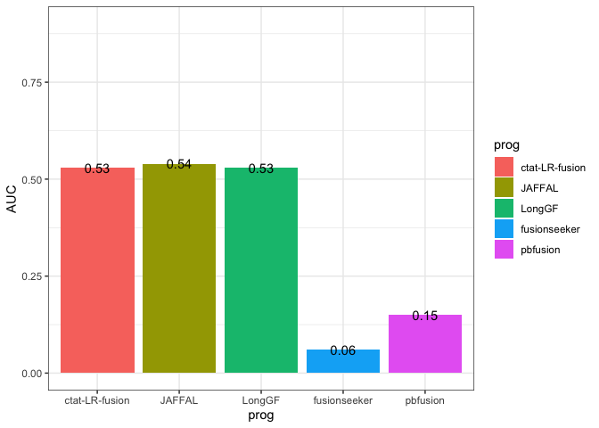

SGNEx_DefaultMode
================
bhaas
2024-09-19

``` r
ALLOW_PARALOG_PROXIES = TRUE
```

``` r
if (ALLOW_PARALOG_PROXIES) { 

    ROC_data = read.csv("data/eval_supported.okPara_ignoreUnsure.results.scored.ROC", header=T, sep="\t")

} else {
    
    ROC_data = read.csv("data/eval_supported.ignoreUnsure.results.scored.ROC", header=T, sep="\t")
}

ROC_data %>% head()
```

    ##     prog min_sum_frags TP FP FN  TPR PPV    F1
    ## 1 JAFFAL             2 40  0 35 0.53   1 0.693
    ## 2 JAFFAL             3 36  0 39 0.48   1 0.649
    ## 3 JAFFAL             4 32  0 43 0.43   1 0.601
    ## 4 JAFFAL             5 30  0 45 0.40   1 0.571
    ## 5 JAFFAL             6 28  0 47 0.37   1 0.540
    ## 6 JAFFAL             7 26  0 49 0.35   1 0.519

``` r
PROGS = c('ctat-LR-fusion', 'JAFFAL', 'LongGF', 'fusionseeker', 'pbfusion')

ROC_data$prog = factor(ROC_data$prog, levels=PROGS)
```

``` r
PR_plot = ROC_data %>% ggplot(aes(x=TPR, y=PPV)) + 
    theme_bw() +
    geom_point(aes(color=prog)) + geom_line(aes(color=prog))

PR_plot
```

<!-- -->

``` r
ggsave(PR_plot, filename = paste0("SGNEx_DefaultMode.PR_plot.PARA-OK=", ALLOW_PARALOG_PROXIES, ".svg"), height = 4, width=6 )
```

``` r
if (ALLOW_PARALOG_PROXIES) {
    
    PR_AUC = read.csv("data/eval_supported.okPara_ignoreUnsure.results.scored.PR.AUC", header=F, sep="\t")

} else {
    
    PR_AUC = read.csv("data/eval_supported.ignoreUnsure.results.scored.PR.AUC", header=F, sep="\t")
}
    
colnames(PR_AUC) = c('prog', 'AUC')

PR_AUC$prog = factor(PR_AUC$prog, levels=PROGS)

PR_AUC
```

    ##             prog  AUC
    ## 1         JAFFAL 0.54
    ## 2         LongGF 0.53
    ## 3 ctat-LR-fusion 0.53
    ## 4       pbfusion 0.15
    ## 5   fusionseeker 0.06

``` r
PR_AUC_barplot = PR_AUC %>% ggplot(aes(x=prog, y=AUC)) + 
    geom_col(aes(fill=prog)) + 
    theme_bw() +
    geom_text(aes(label=AUC))

PR_AUC_barplot 
```

<!-- -->

``` r
ggsave(PR_AUC_barplot, filename = paste0("SGNEx_DefaultMode.PR_AUC.barplot.PARA-OK=", ALLOW_PARALOG_PROXIES, ".svg"), height=4, width=6 )
```
