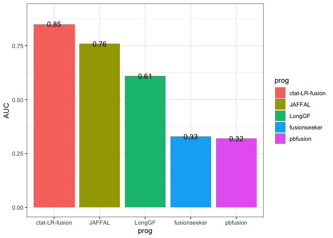

SGNEx_FuzzyRestricted
================
bhaas
2024-09-19

``` r
ALLOW_PARALOG_PROXIES = TRUE
```

``` r
if (ALLOW_PARALOG_PROXIES) { 

    ROC_data = read.csv("data/eval_supported.okPara_ignoreUnsure.results.scored.ROC", header=T, sep="\t")

} else {
    
    ROC_data = read.csv("data/eval_supported.ignoreUnsure.results.scored.ROC", header=T, sep="\t")
}

ROC_data %>% head()
```

    ##           prog min_sum_frags TP   FP FN  TPR  PPV    F1
    ## 1 fusionseeker             1 47 8255  5 0.90 0.01 0.020
    ## 2 fusionseeker             2 42 1453 10 0.81 0.03 0.058
    ## 3 fusionseeker             3 37  439 15 0.71 0.08 0.144
    ## 4 fusionseeker             4 31  230 21 0.60 0.12 0.200
    ## 5 fusionseeker             5 29  112 23 0.56 0.21 0.305
    ## 6 fusionseeker             6 28   81 24 0.54 0.26 0.351

``` r
PROGS = c('ctat-LR-fusion', 'JAFFAL', 'LongGF', 'fusionseeker', 'pbfusion')

ROC_data$prog = factor(ROC_data$prog, levels=PROGS)
```

``` r
PR_plot = ROC_data %>% ggplot(aes(x=TPR, y=PPV)) + 
    theme_bw() +
    geom_point(aes(color=prog)) + geom_line(aes(color=prog))

PR_plot
```

<!-- -->

``` r
ggsave(PR_plot, filename = paste0("SGNEx_fuzzy_brkpt_restricted.PR_plot.PARA-OK=", ALLOW_PARALOG_PROXIES, ".svg"), height = 4, width=6 )
```

``` r
if (ALLOW_PARALOG_PROXIES) {
    
    PR_AUC = read.csv("data/eval_supported.okPara_ignoreUnsure.results.scored.PR.AUC", header=F, sep="\t")

} else {
    
    PR_AUC = read.csv("data/eval_supported.ignoreUnsure.results.scored.PR.AUC", header=F, sep="\t")
}
    
colnames(PR_AUC) = c('prog', 'AUC')

PR_AUC$prog = factor(PR_AUC$prog, levels=PROGS)

PR_AUC
```

    ##             prog  AUC
    ## 1 ctat-LR-fusion 0.85
    ## 2         JAFFAL 0.76
    ## 3         LongGF 0.61
    ## 4   fusionseeker 0.33
    ## 5       pbfusion 0.32

``` r
PR_AUC_barplot = PR_AUC %>% ggplot(aes(x=prog, y=AUC)) + 
    geom_col(aes(fill=prog)) + 
    theme_bw() +
    geom_text(aes(label=AUC))

PR_AUC_barplot 
```

<!-- -->

``` r
ggsave(PR_AUC_barplot, filename = paste0("SGNEx_fuzzy_brkpt_restricted.PR_AUC.barplot.PARA-OK=", ALLOW_PARALOG_PROXIES, ".svg"), height=4, width=6 )
```
