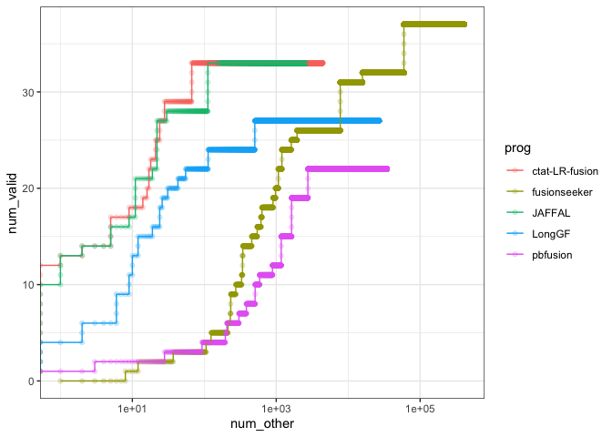
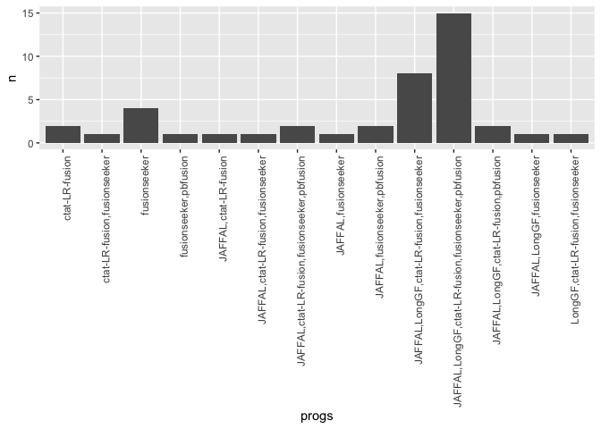

SGNex_ONT_eval
================
bhaas
2024-07-24

``` r
PREDS_FILE = "data/preds.collected.gencode_mapped.wAnnot.filt.proxy_assignments.gz"

# or use the version with ctat-LRF restricted to spliced fusions for comparison.
PREDS_FILE = "data/preds.collected.gencode_mapped.wAnnot.filt.proxy_assignments.EXCLUDE_NONSPLICED.gz"
```

``` r
read_support = read.csv(PREDS_FILE, header=T, sep="\t")

read_support$sample = str_replace(read_support$sample, "-EV_directRNA", "_EVdirectRNA")

read_support$core_sample_name = sapply(read_support$sample, function(x)(str_split(x, "_")[[1]][2]))

read_support$seqtype = sapply(read_support$sample, function(x)(str_split(x, "_")[[1]][3]))

read_support$proxy_fusion_name = str_replace(read_support$proxy_fusion_name, "^SGNex_.*\\|", "")

read_support = read_support %>% mutate(proxy_fusion_name = paste0(core_sample_name, "|", proxy_fusion_name))

read_support %>% head()
```

    ##      proxy_fusion_name proxy_fusion_type                                sample
    ## 1    A549|U2AF2--ZFAS1   dominant_choice SGNex_A549_directcDNA_replicate3_run1
    ## 2     A549|BZW2--RPLP0            tie_lt SGNex_A549_directcDNA_replicate3_run1
    ## 3     A549|GTF3A--CTSL   dominant_choice SGNex_A549_directcDNA_replicate3_run1
    ## 4    A549|HDLBP--THAP4   dominant_choice SGNex_A549_directcDNA_replicate3_run1
    ## 5 A549|C5orf22--GOLPH3   dominant_choice SGNex_A549_directcDNA_replicate3_run1
    ## 6     A549|NPAS2--RALB   dominant_choice SGNex_A549_directcDNA_replicate3_run1
    ##             prog          fusion                     breakpoint num_reads
    ## 1 ctat-LR-fusion    U2AF2--ZFAS1 chr19:55660221--chr20:49280903         1
    ## 2 ctat-LR-fusion     BZW2--RPLP0 chr7:16704669--chr12:120197462         1
    ## 3 ctat-LR-fusion     GTF3A--CTSL  chr13:27434219--chr9:87731008         1
    ## 4 ctat-LR-fusion    HDLBP--THAP4 chr2:241315570--chr2:241606473         1
    ## 5 ctat-LR-fusion C5orf22--GOLPH3   chr5:31534325--chr5:32135686         1
    ## 6 ctat-LR-fusion     NPAS2--RALB chr2:100937842--chr2:120293141         1
    ##                                                                              mapped_gencode_A_gene_list
    ## 1                                               AC008735.1,AC008735.2,CTD-2537I9.12,CTD-2537I9.13,U2AF2
    ## 2                                                                            AC073333.1,AC073333.8,BZW2
    ## 3                                                                                AL137059.1,GTF3A,MTIF3
    ## 4 AC093642.5,AC104841.1,AC104841.2,BX648235,DKFZp686L08115,HDLBP,LINC01881,SEPT2,hNedd5,snoMe28S-Am2634
    ## 5                                                               AL732372.2,C5ORF22,C5orf22,DKFZp667N066
    ## 6                     AC016738.1,AC016738.2,AC016738.3,AC016738.4,AC092168.2,AC093642.5,LINC01881,NPAS2
    ##                                                                                                               mapped_gencode_B_gene_list
    ## 1 C20orf199,KCNB1,NCRNA00275,RF02215,RF02216,RF02217,SNORD12,SNORD12B,SNORD12C,ZFAS1,ZNFX1,ZNFX1-AS1,ZNFX1-AS1_1,ZNFX1-AS1_2,ZNFX1-AS1_3
    ## 2                                                                                          AC011247.1,AC016995.3,LINC02613,RPLP0,RPLP0P6
    ## 3                                                                                                                             CTSL,CTSL1
    ## 4                                                                         5S_rRNA.206,AC093642.5,ATG4B,LINC01881,RN5S122,RNA5SP122,THAP4
    ## 5                                                                                                              AL732372.2,GOLPH3,RF00019
    ## 6                                                                                        AC012363.1,AC012363.2,AC093642.5,LINC01881,RALB
    ##                                                                                                                                             annots
    ## 1                                                  U2AF2--ZFAS1:INTERCHROMOSOMAL[chr19--chr20];;(recip)ZFAS1--U2AF2:INTERCHROMOSOMAL[chr20--chr19]
    ## 2                                                      BZW2--RPLP0:INTERCHROMOSOMAL[chr7--chr12];;(recip)RPLP0--BZW2:INTERCHROMOSOMAL[chr12--chr7]
    ## 3                      GTF3A--CTSL:[CTSL:Oncogene];INTERCHROMOSOMAL[chr13--chr9];;(recip)CTSL--GTF3A:[CTSL:Oncogene];INTERCHROMOSOMAL[chr9--chr13]
    ## 4 HDLBP--THAP4:[HDLBP:Oncogene];[TCGA_StarF2019];INTRACHROMOSOMAL[chr2:0.27Mb];;(recip)THAP4--HDLBP:[HDLBP:Oncogene];INTRACHROMOSOMAL[chr2:0.27Mb]
    ## 5                                              C5orf22--GOLPH3:INTRACHROMOSOMAL[chr5:0.57Mb];;(recip)GOLPH3--C5orf22:INTRACHROMOSOMAL[chr5:0.57Mb]
    ## 6                    NPAS2--RALB:[RALB:Oncogene];INTRACHROMOSOMAL[chr2:19.24Mb];;(recip)RALB--NPAS2:[RALB:Oncogene];INTRACHROMOSOMAL[chr2:19.24Mb]
    ##   core_sample_name    seqtype
    ## 1             A549 directcDNA
    ## 2             A549 directcDNA
    ## 3             A549 directcDNA
    ## 4             A549 directcDNA
    ## 5             A549 directcDNA
    ## 6             A549 directcDNA

``` r
# restrict to dominant isoform in each sample

nrow(read_support)
```

    ## [1] 539687

``` r
read_support_sample = read_support %>% group_by(proxy_fusion_name, prog, sample) %>% arrange(desc(num_reads)) %>%
    filter(row_number() == 1) %>%
    ungroup()

nrow(read_support_sample)
```

    ## [1] 515981

``` r
# aggregate across core sample names

read_support_agg = read_support_sample %>% group_by(proxy_fusion_name, prog, core_sample_name) %>% 
    summarize(sum_reads = sum(num_reads))
```

    ## `summarise()` has grouped output by 'proxy_fusion_name', 'prog'. You can
    ## override using the `.groups` argument.

``` r
nrow(read_support_agg)
```

    ## [1] 480950

``` r
validated_fusions = data.frame(validated_fusion = c(
"MCF7|BCAS4--BCAS3",
"MCF7|ARFGEF2--SULF2",
"MCF7|RPS6KB1--VMP1",
"MCF7|GCN1L1--MSI1",
"MCF7|AC099850.1--VMP1",
"MCF7|SMARCA4--CARM1",
"MCF7|SLC25A24--NBPF6",
"MCF7|USP31--CRYL1",
"MCF7|TBL1XR1--RGS17",
"MCF7|TAF4--BRIP1",
"MCF7|RPS6KB1--DIAPH3",
"MCF7|AHCYL1--RAD51C",
"MCF7|ABCA5--PPP4R1L",
"MCF7|C16orf45--ABCC1",
"MCF7|C16orf62--IQCK",
"MCF7|TXLNG--SYAP1",
"MCF7|MYO6--SENP6",
"MCF7|POP1--MATN2",
"MCF7|GATAD2B--NUP210L",
"MCF7|ESR1--CCDC170",
"MCF7|DEPDC1B--ELOVL7",
"MCF7|ATXN7L3--FAM171A2",
"MCF7|SYTL2--PICALM",
"MCF7|ADAMTS19--SLC27A6",
"MCF7|ARHGAP19--DRG1",
"MCF7|MYO9B--FCHO1",
"MCF7|PAPOLA--AK7",
"MCF7|ANKS1A--UHRF1BP1",
"MCF7|ATP1A1--ZFP64",
"MCF7|B3GNTL1--SLC9A8",
"MCF7|BCAS3--AMPD1",
"MCF7|BCAS3--ATXN7",
"MCF7|BCAS4--ZMYND8",
"MCF7|CHEK2--XBP1",
"MCF7|KCND3--PPM1E",
"MCF7|RP11-145E5.5--CDKN2B-AS1",
"MCF7|NAV1--GPR37L1",
"MCF7|NCOA3--SULF2",
"MCF7|PLCG1--TOP1",
"MCF7|PNPLA7--DPH7",
"MCF7|PTPRG--CCDC129",
"MCF7|PTPRN2--FAM62B",
"MCF7|RAD51C--ATXN7",
"MCF7|RSBN1--AP4B1-AS1",
"MCF7|SGPP2--ULK4",
"MCF7|SULF2--PRICKLE2",
"MCF7|TEX14--PTPRG",
"MCF7|TOP1--CR593014",
"MCF7|TSPAN9--TEAD4",
"MCF7|UBE2V1--TBX2",
"MCF7|VAV3--AP4B1-AS1",
"MCF7|ZMYND8--USP32",
"MCF7|MYH9--EIF3D",
"K562|NUP214--XKR3",
"K562|PRIM1--NACA",
"K562|BRK1--VHL",
"K562|ACCS--EXT2",
"K562|SLC29A1--HSP90AB1",
"K562|BCR--ABL1",
"A549|SCAMP2--WDR72",
"A549|RICTOR--FYB"
) )
```

``` r
# supplement with illumina-supported.
illumina_supported_fusions = read.csv("K562.illum_supported.tsv", header=T, sep="\t", stringsAsFactors = F) %>%
    select(proxy_fusion_name) %>% rename(validated_fusion = proxy_fusion_name)

illumina_supported_fusions
```

    ##           validated_fusion
    ## 1       K562|BAG6--SLC44A4
    ## 2       K562|IMMP2L--DOCK4
    ## 3        K562|NUP214--XKR3
    ## 4         K562|CEP70--FAIM
    ## 5           K562|BCR--ABL1
    ## 6      K562|C16orf87--ORC6
    ## 7 K562|RP11-307P5.1--SASH1

``` r
illum_found_fusions = read_support_agg %>% ungroup() %>% filter(proxy_fusion_name %in% illumina_supported_fusions$validated_fusion) %>% select(proxy_fusion_name) %>% unique()

extra_illum_valid_fusions = illum_found_fusions %>% filter(! proxy_fusion_name %in% validated_fusions$validated_fusion)

extra_illum_valid_fusions
```

    ## # A tibble: 5 × 1
    ##   proxy_fusion_name       
    ##   <chr>                   
    ## 1 K562|BAG6--SLC44A4      
    ## 2 K562|C16orf87--ORC6     
    ## 3 K562|CEP70--FAIM        
    ## 4 K562|IMMP2L--DOCK4      
    ## 5 K562|RP11-307P5.1--SASH1

``` r
validated_fusions = bind_rows(validated_fusions, extra_illum_valid_fusions %>% rename(validated_fusion = proxy_fusion_name))

validated_fusions
```

    ##                 validated_fusion
    ## 1              MCF7|BCAS4--BCAS3
    ## 2            MCF7|ARFGEF2--SULF2
    ## 3             MCF7|RPS6KB1--VMP1
    ## 4              MCF7|GCN1L1--MSI1
    ## 5          MCF7|AC099850.1--VMP1
    ## 6            MCF7|SMARCA4--CARM1
    ## 7           MCF7|SLC25A24--NBPF6
    ## 8              MCF7|USP31--CRYL1
    ## 9            MCF7|TBL1XR1--RGS17
    ## 10              MCF7|TAF4--BRIP1
    ## 11          MCF7|RPS6KB1--DIAPH3
    ## 12           MCF7|AHCYL1--RAD51C
    ## 13           MCF7|ABCA5--PPP4R1L
    ## 14          MCF7|C16orf45--ABCC1
    ## 15           MCF7|C16orf62--IQCK
    ## 16             MCF7|TXLNG--SYAP1
    ## 17              MCF7|MYO6--SENP6
    ## 18              MCF7|POP1--MATN2
    ## 19         MCF7|GATAD2B--NUP210L
    ## 20            MCF7|ESR1--CCDC170
    ## 21          MCF7|DEPDC1B--ELOVL7
    ## 22        MCF7|ATXN7L3--FAM171A2
    ## 23            MCF7|SYTL2--PICALM
    ## 24        MCF7|ADAMTS19--SLC27A6
    ## 25           MCF7|ARHGAP19--DRG1
    ## 26             MCF7|MYO9B--FCHO1
    ## 27              MCF7|PAPOLA--AK7
    ## 28         MCF7|ANKS1A--UHRF1BP1
    ## 29            MCF7|ATP1A1--ZFP64
    ## 30          MCF7|B3GNTL1--SLC9A8
    ## 31             MCF7|BCAS3--AMPD1
    ## 32             MCF7|BCAS3--ATXN7
    ## 33            MCF7|BCAS4--ZMYND8
    ## 34              MCF7|CHEK2--XBP1
    ## 35             MCF7|KCND3--PPM1E
    ## 36 MCF7|RP11-145E5.5--CDKN2B-AS1
    ## 37            MCF7|NAV1--GPR37L1
    ## 38             MCF7|NCOA3--SULF2
    ## 39              MCF7|PLCG1--TOP1
    ## 40             MCF7|PNPLA7--DPH7
    ## 41           MCF7|PTPRG--CCDC129
    ## 42           MCF7|PTPRN2--FAM62B
    ## 43            MCF7|RAD51C--ATXN7
    ## 44         MCF7|RSBN1--AP4B1-AS1
    ## 45              MCF7|SGPP2--ULK4
    ## 46          MCF7|SULF2--PRICKLE2
    ## 47             MCF7|TEX14--PTPRG
    ## 48           MCF7|TOP1--CR593014
    ## 49            MCF7|TSPAN9--TEAD4
    ## 50             MCF7|UBE2V1--TBX2
    ## 51          MCF7|VAV3--AP4B1-AS1
    ## 52            MCF7|ZMYND8--USP32
    ## 53              MCF7|MYH9--EIF3D
    ## 54             K562|NUP214--XKR3
    ## 55              K562|PRIM1--NACA
    ## 56                K562|BRK1--VHL
    ## 57               K562|ACCS--EXT2
    ## 58        K562|SLC29A1--HSP90AB1
    ## 59                K562|BCR--ABL1
    ## 60            A549|SCAMP2--WDR72
    ## 61              A549|RICTOR--FYB
    ## 62            K562|BAG6--SLC44A4
    ## 63           K562|C16orf87--ORC6
    ## 64              K562|CEP70--FAIM
    ## 65            K562|IMMP2L--DOCK4
    ## 66      K562|RP11-307P5.1--SASH1

``` r
# which validated fusions do we find?

validated_fusions %>% filter( validated_fusion %in% read_support_agg$proxy_fusion_name) 
```

    ##                 validated_fusion
    ## 1              MCF7|BCAS4--BCAS3
    ## 2            MCF7|ARFGEF2--SULF2
    ## 3              MCF7|GCN1L1--MSI1
    ## 4          MCF7|AC099850.1--VMP1
    ## 5           MCF7|SLC25A24--NBPF6
    ## 6            MCF7|TBL1XR1--RGS17
    ## 7               MCF7|TAF4--BRIP1
    ## 8           MCF7|RPS6KB1--DIAPH3
    ## 9            MCF7|AHCYL1--RAD51C
    ## 10           MCF7|ABCA5--PPP4R1L
    ## 11          MCF7|C16orf45--ABCC1
    ## 12           MCF7|C16orf62--IQCK
    ## 13        MCF7|ATXN7L3--FAM171A2
    ## 14            MCF7|SYTL2--PICALM
    ## 15        MCF7|ADAMTS19--SLC27A6
    ## 16             MCF7|MYO9B--FCHO1
    ## 17            MCF7|ATP1A1--ZFP64
    ## 18          MCF7|B3GNTL1--SLC9A8
    ## 19             MCF7|BCAS3--AMPD1
    ## 20             MCF7|BCAS3--ATXN7
    ## 21            MCF7|BCAS4--ZMYND8
    ## 22 MCF7|RP11-145E5.5--CDKN2B-AS1
    ## 23            MCF7|NAV1--GPR37L1
    ## 24             MCF7|NCOA3--SULF2
    ## 25            MCF7|RAD51C--ATXN7
    ## 26         MCF7|RSBN1--AP4B1-AS1
    ## 27              MCF7|SGPP2--ULK4
    ## 28          MCF7|SULF2--PRICKLE2
    ## 29             MCF7|TEX14--PTPRG
    ## 30          MCF7|VAV3--AP4B1-AS1
    ## 31            MCF7|ZMYND8--USP32
    ## 32              MCF7|MYH9--EIF3D
    ## 33             K562|NUP214--XKR3
    ## 34              K562|PRIM1--NACA
    ## 35               K562|ACCS--EXT2
    ## 36                K562|BCR--ABL1
    ## 37            A549|SCAMP2--WDR72
    ## 38            K562|BAG6--SLC44A4
    ## 39           K562|C16orf87--ORC6
    ## 40              K562|CEP70--FAIM
    ## 41            K562|IMMP2L--DOCK4
    ## 42      K562|RP11-307P5.1--SASH1

``` r
# which validated fusions are missing?

validated_fusions %>% filter( ! validated_fusion %in% read_support_agg$proxy_fusion_name) 
```

    ##          validated_fusion
    ## 1      MCF7|RPS6KB1--VMP1
    ## 2     MCF7|SMARCA4--CARM1
    ## 3       MCF7|USP31--CRYL1
    ## 4       MCF7|TXLNG--SYAP1
    ## 5        MCF7|MYO6--SENP6
    ## 6        MCF7|POP1--MATN2
    ## 7   MCF7|GATAD2B--NUP210L
    ## 8      MCF7|ESR1--CCDC170
    ## 9    MCF7|DEPDC1B--ELOVL7
    ## 10    MCF7|ARHGAP19--DRG1
    ## 11       MCF7|PAPOLA--AK7
    ## 12  MCF7|ANKS1A--UHRF1BP1
    ## 13       MCF7|CHEK2--XBP1
    ## 14      MCF7|KCND3--PPM1E
    ## 15       MCF7|PLCG1--TOP1
    ## 16      MCF7|PNPLA7--DPH7
    ## 17    MCF7|PTPRG--CCDC129
    ## 18    MCF7|PTPRN2--FAM62B
    ## 19    MCF7|TOP1--CR593014
    ## 20     MCF7|TSPAN9--TEAD4
    ## 21      MCF7|UBE2V1--TBX2
    ## 22         K562|BRK1--VHL
    ## 23 K562|SLC29A1--HSP90AB1
    ## 24       A549|RICTOR--FYB

``` r
read_support_agg = read_support_agg %>% mutate(validated_fusion = (proxy_fusion_name %in% validated_fusions$validated_fusion)) 
```

``` r
read_support_agg_scored = read_support_agg %>% 
    #group_by(seqtype, prog, sample)  %>%
     group_by(prog) %>%
     arrange(desc(sum_reads), desc(validated_fusion)) %>% 
    mutate(num_valid = cumsum(validated_fusion), num_other = cumsum(! validated_fusion))

read_support_agg_scored %>% filter(prog == 'ctat-LR-fusion') 
```

    ## # A tibble: 4,432 × 7
    ## # Groups:   prog [1]
    ##    proxy_fusion_name prog  core_sample_name sum_reads validated_fusion num_valid
    ##    <chr>             <chr> <chr>                <int> <lgl>                <int>
    ##  1 MCF7|BCAS4--BCAS3 ctat… MCF7                  3672 TRUE                     1
    ##  2 MCF7|AC099850.1-… ctat… MCF7                   756 TRUE                     2
    ##  3 MCF7|ARFGEF2--SU… ctat… MCF7                   433 TRUE                     3
    ##  4 MCF7|SLC25A24--N… ctat… MCF7                   179 TRUE                     4
    ##  5 K562|BAG6--SLC44… ctat… K562                   176 TRUE                     5
    ##  6 MCF7|SYTL2--PICA… ctat… MCF7                    64 TRUE                     6
    ##  7 MCF7|AHCYL1--RAD… ctat… MCF7                    52 TRUE                     7
    ##  8 K562|NUP214--XKR3 ctat… K562                    50 TRUE                     8
    ##  9 MCF7|RSBN1--AP4B… ctat… MCF7                    44 TRUE                     9
    ## 10 MCF7|RPS6KB1--DI… ctat… MCF7                    42 TRUE                    10
    ## # ℹ 4,422 more rows
    ## # ℹ 1 more variable: num_other <int>

``` r
read_support_agg_scored %>% filter(prog == 'JAFFAL')
```

    ## # A tibble: 2,584 × 7
    ## # Groups:   prog [1]
    ##    proxy_fusion_name prog  core_sample_name sum_reads validated_fusion num_valid
    ##    <chr>             <chr> <chr>                <int> <lgl>                <int>
    ##  1 MCF7|BCAS4--BCAS3 JAFF… MCF7                  3382 TRUE                     1
    ##  2 MCF7|AC099850.1-… JAFF… MCF7                   592 TRUE                     2
    ##  3 MCF7|ARFGEF2--SU… JAFF… MCF7                   253 TRUE                     3
    ##  4 MCF7|SLC25A24--N… JAFF… MCF7                   117 TRUE                     4
    ##  5 MCF7|SYTL2--PICA… JAFF… MCF7                    55 TRUE                     5
    ##  6 MCF7|AHCYL1--RAD… JAFF… MCF7                    47 TRUE                     6
    ##  7 MCF7|RPS6KB1--DI… JAFF… MCF7                    42 TRUE                     7
    ##  8 MCF7|ATP1A1--ZFP… JAFF… MCF7                    38 TRUE                     8
    ##  9 MCF7|RSBN1--AP4B… JAFF… MCF7                    37 TRUE                     9
    ## 10 MCF7|BCAS4--ZMYN… JAFF… MCF7                    34 TRUE                    10
    ## # ℹ 2,574 more rows
    ## # ℹ 1 more variable: num_other <int>

``` r
alpha_val = 0.2

read_support_agg_scored %>% 
    ggplot(aes(x=num_other, y=num_valid)) + 
    geom_point(aes(color=prog), alpha=alpha_val) + 
    geom_line(aes(color=prog)) +
    scale_x_continuous(trans='log10') + theme_bw()
```

    ## Warning: Transformation introduced infinite values in continuous x-axis
    ## Transformation introduced infinite values in continuous x-axis

<!-- -->

``` r
# examine Venn for valid fusions

read_support_agg_scored  %>% filter(validated_fusion) %>% group_by(proxy_fusion_name) %>%
    arrange(prog) %>%
    mutate(progs = paste(collapse=",", prog)) %>%
    ungroup() %>%
    select(proxy_fusion_name, progs) %>% unique()
```

    ## # A tibble: 42 × 2
    ##    proxy_fusion_name     progs                                             
    ##    <chr>                 <chr>                                             
    ##  1 MCF7|BCAS4--BCAS3     JAFFAL,LongGF,ctat-LR-fusion,pbfusion             
    ##  2 MCF7|AC099850.1--VMP1 JAFFAL,ctat-LR-fusion,fusionseeker,pbfusion       
    ##  3 MCF7|ARFGEF2--SULF2   JAFFAL,LongGF,ctat-LR-fusion,fusionseeker,pbfusion
    ##  4 MCF7|SLC25A24--NBPF6  JAFFAL,LongGF,ctat-LR-fusion,fusionseeker,pbfusion
    ##  5 MCF7|SYTL2--PICALM    JAFFAL,LongGF,ctat-LR-fusion,fusionseeker,pbfusion
    ##  6 MCF7|AHCYL1--RAD51C   JAFFAL,LongGF,ctat-LR-fusion,fusionseeker,pbfusion
    ##  7 MCF7|RPS6KB1--DIAPH3  JAFFAL,LongGF,ctat-LR-fusion,fusionseeker         
    ##  8 MCF7|ATP1A1--ZFP64    JAFFAL,LongGF,ctat-LR-fusion,fusionseeker,pbfusion
    ##  9 MCF7|RSBN1--AP4B1-AS1 JAFFAL,ctat-LR-fusion,fusionseeker,pbfusion       
    ## 10 MCF7|BCAS4--ZMYND8    JAFFAL,LongGF,ctat-LR-fusion,fusionseeker,pbfusion
    ## # ℹ 32 more rows

``` r
read_support_agg_scored  %>% filter(validated_fusion) %>% group_by(proxy_fusion_name) %>%
    arrange(prog) %>%
    mutate(progs = paste(collapse=",", prog)) %>%
    ungroup() %>%
    select(proxy_fusion_name, progs) %>% unique() %>% 
    group_by(progs) %>% tally() %>%
    arrange(desc(n))
```

    ## # A tibble: 14 × 2
    ##    progs                                                  n
    ##    <chr>                                              <int>
    ##  1 JAFFAL,LongGF,ctat-LR-fusion,fusionseeker,pbfusion    15
    ##  2 JAFFAL,LongGF,ctat-LR-fusion,fusionseeker              8
    ##  3 fusionseeker                                           4
    ##  4 JAFFAL,LongGF,ctat-LR-fusion,pbfusion                  2
    ##  5 JAFFAL,ctat-LR-fusion,fusionseeker,pbfusion            2
    ##  6 JAFFAL,fusionseeker,pbfusion                           2
    ##  7 ctat-LR-fusion                                         2
    ##  8 JAFFAL,LongGF,fusionseeker                             1
    ##  9 JAFFAL,ctat-LR-fusion                                  1
    ## 10 JAFFAL,ctat-LR-fusion,fusionseeker                     1
    ## 11 JAFFAL,fusionseeker                                    1
    ## 12 LongGF,ctat-LR-fusion,fusionseeker                     1
    ## 13 ctat-LR-fusion,fusionseeker                            1
    ## 14 fusionseeker,pbfusion                                  1

``` r
# just jaffal and ctat-LRF

read_support_agg_scored  %>% filter(validated_fusion) %>% 
    filter(prog %in% c('JAFFAL', 'ctat-LR-fusion')) %>%
    group_by(proxy_fusion_name) %>%
    arrange(prog) %>%
    mutate(progs = paste(collapse=",", prog)) %>%
    ungroup() %>%
    select(proxy_fusion_name, progs) %>% unique() %>% 
    group_by(progs) %>% tally() %>%
    arrange(desc(n))
```

    ## # A tibble: 3 × 2
    ##   progs                     n
    ##   <chr>                 <int>
    ## 1 JAFFAL,ctat-LR-fusion    29
    ## 2 JAFFAL                    4
    ## 3 ctat-LR-fusion            4

``` r
read_support_agg_scored  %>% filter(validated_fusion) %>% 
    filter(prog %in% c('JAFFAL', 'ctat-LR-fusion')) %>%
    group_by(proxy_fusion_name) %>%
    arrange(prog) %>%
    mutate(progs = paste(collapse=",", prog)) %>%
    arrange(desc(progs))
```

    ## # A tibble: 66 × 8
    ## # Groups:   proxy_fusion_name [37]
    ##    proxy_fusion_name prog  core_sample_name sum_reads validated_fusion num_valid
    ##    <chr>             <chr> <chr>                <int> <lgl>                <int>
    ##  1 MCF7|ABCA5--PPP4… ctat… MCF7                     3 TRUE                    27
    ##  2 K562|RP11-307P5.… ctat… K562                     1 TRUE                    30
    ##  3 MCF7|BCAS3--AMPD1 ctat… MCF7                     1 TRUE                    31
    ##  4 MCF7|VAV3--AP4B1… ctat… MCF7                     1 TRUE                    33
    ##  5 MCF7|BCAS4--BCAS3 JAFF… MCF7                  3382 TRUE                     1
    ##  6 MCF7|AC099850.1-… JAFF… MCF7                   592 TRUE                     2
    ##  7 MCF7|ARFGEF2--SU… JAFF… MCF7                   253 TRUE                     3
    ##  8 MCF7|SLC25A24--N… JAFF… MCF7                   117 TRUE                     4
    ##  9 MCF7|SYTL2--PICA… JAFF… MCF7                    55 TRUE                     5
    ## 10 MCF7|AHCYL1--RAD… JAFF… MCF7                    47 TRUE                     6
    ## # ℹ 56 more rows
    ## # ℹ 2 more variables: num_other <int>, progs <chr>

``` r
read_support_agg_scored  %>% filter(validated_fusion) %>% group_by(proxy_fusion_name) %>%
    arrange(prog) %>%
    mutate(progs = paste(collapse=",", prog)) %>%
    ungroup() %>%
    select(proxy_fusion_name, progs) %>% unique() %>% 
    group_by(progs) %>% tally() %>%
    ggplot(aes(x=progs, y=n)) + 
    geom_col() +
     theme(axis.text.x = element_text(angle = 90, hjust = 1))
```

<!-- -->

``` r
# get counts of valid fusions

read_support_agg_scored  %>% filter(validated_fusion) %>% 
    select(proxy_fusion_name, prog) %>% unique() %>% group_by(prog) %>% tally() %>%
    arrange(desc(n))
```

    ## # A tibble: 5 × 2
    ##   prog               n
    ##   <chr>          <int>
    ## 1 fusionseeker      37
    ## 2 JAFFAL            33
    ## 3 ctat-LR-fusion    33
    ## 4 LongGF            27
    ## 5 pbfusion          22

``` r
read_support_agg %>% ungroup() %>% select(core_sample_name) %>% unique()
```

    ## # A tibble: 3 × 1
    ##   core_sample_name
    ##   <chr>           
    ## 1 A549            
    ## 2 K562            
    ## 3 MCF7

``` r
# total number of fusion preds

read_support_agg %>% ungroup() %>% select(prog, proxy_fusion_name) %>% unique() %>% group_by(prog) %>% tally() %>% 
    arrange(desc(n))
```

    ## # A tibble: 5 × 2
    ##   prog                n
    ##   <chr>           <int>
    ## 1 fusionseeker   412491
    ## 2 pbfusion        34630
    ## 3 LongGF          26813
    ## 4 ctat-LR-fusion   4432
    ## 5 JAFFAL           2584
