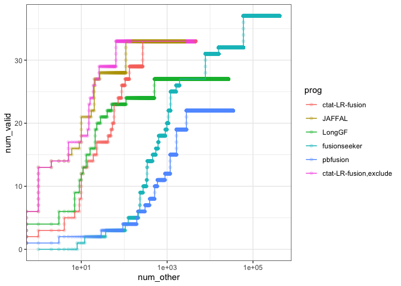
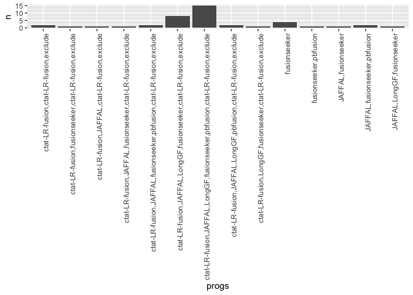

SGNex_ONT_eval
================
bhaas
2024-07-24

``` r
PREDS_FILE = "data/preds.collected.gencode_mapped.wAnnot.filt.proxy_assignments.gz"

# or use the version with ctat-LRF restricted to spliced fusions for comparison.
PREDS_FILE_excl_nonspliced = "data/preds.collected.gencode_mapped.wAnnot.filt.proxy_assignments.EXCLUDE_NONSPLICED.gz"
```

Proxy fusion names

``` r
parse_preds_file = function(PREDS_FILE) {

    read_support = read.csv(PREDS_FILE, header=T, sep="\t")
    
    read_support$sample = str_replace(read_support$sample, "-EV_directRNA", "_EVdirectRNA")
    
    read_support$core_sample_name = sapply(read_support$sample, function(x)(str_split(x, "_")[[1]][2]))
    
    read_support$seqtype = sapply(read_support$sample, function(x)(str_split(x, "_")[[1]][3]))
    
    read_support$proxy_fusion_name = str_replace(read_support$proxy_fusion_name, "^SGNex_.*\\|", "")
    
    read_support = read_support %>% mutate(proxy_fusion_name = paste0(core_sample_name, "|", proxy_fusion_name))

    return(read_support)    
}
```

``` r
regular_run_data = parse_preds_file(PREDS_FILE)

regular_run_data %>% head()
```

    ##     proxy_fusion_name proxy_fusion_type                                sample
    ## 1    A549|KRT81--ABI2         orig_name SGNex_A549_directcDNA_replicate3_run1
    ## 2     A549|FTL--EHMT1   dominant_choice SGNex_A549_directcDNA_replicate3_run1
    ## 3 A549|SOX6--C11orf58         orig_name SGNex_A549_directcDNA_replicate3_run1
    ## 4  A549|RPL41P2--DDX5         orig_name SGNex_A549_directcDNA_replicate3_run1
    ## 5   A549|U2AF2--ZFAS1   dominant_choice SGNex_A549_directcDNA_replicate3_run1
    ## 6    A549|BZW2--RPLP0            tie_lt SGNex_A549_directcDNA_replicate3_run1
    ##             prog         fusion                     breakpoint num_reads
    ## 1 ctat-LR-fusion    KRT81--ABI2 chr12:52285921--chr2:203434563         6
    ## 2 ctat-LR-fusion     FTL--EHMT1 chr19:48966883--chr9:137742259         4
    ## 3 ctat-LR-fusion SOX6--C11orf58 chr11:16738716--chr11:16743107         2
    ## 4 ctat-LR-fusion  RPL41P2--DDX5 chr17:64511170--chr17:64506297         2
    ## 5 ctat-LR-fusion   U2AF2--ZFAS1 chr19:55660221--chr20:49280903         1
    ## 6 ctat-LR-fusion    BZW2--RPLP0 chr7:16704669--chr12:120197462         1
    ##                                                                                                               mapped_gencode_A_gene_list
    ## 1                                                                          AC021066.1,AC121757.1,KRT81,KRT86,RP11-259K21.3,RP11-845M18.6
    ## 2                                                                                                                         AC026803.1,FTL
    ## 3 AC100865.1,AC103794.1,AKR1B1P3,AP007216.1,C11ORF58,C11orf58,CTD-3096P4.1,MIR6073,Metazoa_SRP,RN7SL188P,RP11-449L13.2,RP11-643C9.1,SOX6
    ## 4                                     AC091304.2,AC091304.3,AC091304.4,AC091304.5,AC242376.2,HERC2,HERC2P2,HERC2P7,RP11-228M15.1,RPL41P2
    ## 5                                                                                AC008735.1,AC008735.2,CTD-2537I9.12,CTD-2537I9.13,U2AF2
    ## 6                                                                                                             AC073333.1,AC073333.8,BZW2
    ##                                                                                                                                                    mapped_gencode_B_gene_list
    ## 1                                                                                             ABI2,ABI2B,AC080075.1,AC093642.5,LINC01881,RAPH1,RP11-363J17.1,TRNAE40P,argBPIB
    ## 2 AK128414,AL590627.1,AL590627.2,AL611925.1,AL772363.1,EHMT1,EHMT1-IT1,FLJ40292,FP13812,MIR602,Metazoa_SRP,RF00017,RP11-188C12.2,RP11-188C12.3,RP11-48C7.8,RP13-467E5.1,SETP5
    ## 3                                                                                                                   AC026639.1,AP007216.1,C11ORF58,C11orf58,RP11-643C9.1,SOX6
    ## 4                                                                                                       AC009994.1,AC009994.3,CCDC45,CEP95,DDX5,DKFZp667E1824,MIR3064,MIR5047
    ## 5                                      C20orf199,KCNB1,NCRNA00275,RF02215,RF02216,RF02217,SNORD12,SNORD12B,SNORD12C,ZFAS1,ZNFX1,ZNFX1-AS1,ZNFX1-AS1_1,ZNFX1-AS1_2,ZNFX1-AS1_3
    ## 6                                                                                                                               AC011247.1,AC016995.3,LINC02613,RPLP0,RPLP0P6
    ##                                                                                                                              annots
    ## 1                                       KRT81--ABI2:INTERCHROMOSOMAL[chr12--chr2];;(recip)ABI2--KRT81:INTERCHROMOSOMAL[chr2--chr12]
    ## 2       FTL--EHMT1:[EHMT1:Oncogene];INTERCHROMOSOMAL[chr19--chr9];;(recip)EHMT1--FTL:[EHMT1:Oncogene];INTERCHROMOSOMAL[chr9--chr19]
    ## 3                               SOX6--C11orf58:INTRACHROMOSOMAL[chr11:0.13Mb];;(recip)C11orf58--SOX6:INTRACHROMOSOMAL[chr11:0.13Mb]
    ## 4 RPL41P2--DDX5:[DDX5:Oncogene];INTERCHROMOSOMAL[chr15--chr17];;(recip)DDX5--RPL41P2:[DDX5:Oncogene];INTERCHROMOSOMAL[chr17--chr15]
    ## 5                                   U2AF2--ZFAS1:INTERCHROMOSOMAL[chr19--chr20];;(recip)ZFAS1--U2AF2:INTERCHROMOSOMAL[chr20--chr19]
    ## 6                                       BZW2--RPLP0:INTERCHROMOSOMAL[chr7--chr12];;(recip)RPLP0--BZW2:INTERCHROMOSOMAL[chr12--chr7]
    ##   core_sample_name    seqtype
    ## 1             A549 directcDNA
    ## 2             A549 directcDNA
    ## 3             A549 directcDNA
    ## 4             A549 directcDNA
    ## 5             A549 directcDNA
    ## 6             A549 directcDNA

``` r
excl_nonspliced_run_data = parse_preds_file(PREDS_FILE_excl_nonspliced)


excl_nonspliced_run_data %>% head()
```

    ##      proxy_fusion_name proxy_fusion_type                                sample
    ## 1    A549|U2AF2--ZFAS1   dominant_choice SGNex_A549_directcDNA_replicate3_run1
    ## 2     A549|BZW2--RPLP0            tie_lt SGNex_A549_directcDNA_replicate3_run1
    ## 3     A549|GTF3A--CTSL   dominant_choice SGNex_A549_directcDNA_replicate3_run1
    ## 4    A549|HDLBP--THAP4   dominant_choice SGNex_A549_directcDNA_replicate3_run1
    ## 5 A549|C5orf22--GOLPH3   dominant_choice SGNex_A549_directcDNA_replicate3_run1
    ## 6     A549|NPAS2--RALB   dominant_choice SGNex_A549_directcDNA_replicate3_run1
    ##             prog          fusion                     breakpoint num_reads
    ## 1 ctat-LR-fusion    U2AF2--ZFAS1 chr19:55660221--chr20:49280903         1
    ## 2 ctat-LR-fusion     BZW2--RPLP0 chr7:16704669--chr12:120197462         1
    ## 3 ctat-LR-fusion     GTF3A--CTSL  chr13:27434219--chr9:87731008         1
    ## 4 ctat-LR-fusion    HDLBP--THAP4 chr2:241315570--chr2:241606473         1
    ## 5 ctat-LR-fusion C5orf22--GOLPH3   chr5:31534325--chr5:32135686         1
    ## 6 ctat-LR-fusion     NPAS2--RALB chr2:100937842--chr2:120293141         1
    ##                                                                              mapped_gencode_A_gene_list
    ## 1                                               AC008735.1,AC008735.2,CTD-2537I9.12,CTD-2537I9.13,U2AF2
    ## 2                                                                            AC073333.1,AC073333.8,BZW2
    ## 3                                                                                AL137059.1,GTF3A,MTIF3
    ## 4 AC093642.5,AC104841.1,AC104841.2,BX648235,DKFZp686L08115,HDLBP,LINC01881,SEPT2,hNedd5,snoMe28S-Am2634
    ## 5                                                               AL732372.2,C5ORF22,C5orf22,DKFZp667N066
    ## 6                     AC016738.1,AC016738.2,AC016738.3,AC016738.4,AC092168.2,AC093642.5,LINC01881,NPAS2
    ##                                                                                                               mapped_gencode_B_gene_list
    ## 1 C20orf199,KCNB1,NCRNA00275,RF02215,RF02216,RF02217,SNORD12,SNORD12B,SNORD12C,ZFAS1,ZNFX1,ZNFX1-AS1,ZNFX1-AS1_1,ZNFX1-AS1_2,ZNFX1-AS1_3
    ## 2                                                                                          AC011247.1,AC016995.3,LINC02613,RPLP0,RPLP0P6
    ## 3                                                                                                                             CTSL,CTSL1
    ## 4                                                                         5S_rRNA.206,AC093642.5,ATG4B,LINC01881,RN5S122,RNA5SP122,THAP4
    ## 5                                                                                                              AL732372.2,GOLPH3,RF00019
    ## 6                                                                                        AC012363.1,AC012363.2,AC093642.5,LINC01881,RALB
    ##                                                                                                                                             annots
    ## 1                                                  U2AF2--ZFAS1:INTERCHROMOSOMAL[chr19--chr20];;(recip)ZFAS1--U2AF2:INTERCHROMOSOMAL[chr20--chr19]
    ## 2                                                      BZW2--RPLP0:INTERCHROMOSOMAL[chr7--chr12];;(recip)RPLP0--BZW2:INTERCHROMOSOMAL[chr12--chr7]
    ## 3                      GTF3A--CTSL:[CTSL:Oncogene];INTERCHROMOSOMAL[chr13--chr9];;(recip)CTSL--GTF3A:[CTSL:Oncogene];INTERCHROMOSOMAL[chr9--chr13]
    ## 4 HDLBP--THAP4:[HDLBP:Oncogene];[TCGA_StarF2019];INTRACHROMOSOMAL[chr2:0.27Mb];;(recip)THAP4--HDLBP:[HDLBP:Oncogene];INTRACHROMOSOMAL[chr2:0.27Mb]
    ## 5                                              C5orf22--GOLPH3:INTRACHROMOSOMAL[chr5:0.57Mb];;(recip)GOLPH3--C5orf22:INTRACHROMOSOMAL[chr5:0.57Mb]
    ## 6                    NPAS2--RALB:[RALB:Oncogene];INTRACHROMOSOMAL[chr2:19.24Mb];;(recip)RALB--NPAS2:[RALB:Oncogene];INTRACHROMOSOMAL[chr2:19.24Mb]
    ##   core_sample_name    seqtype
    ## 1             A549 directcDNA
    ## 2             A549 directcDNA
    ## 3             A549 directcDNA
    ## 4             A549 directcDNA
    ## 5             A549 directcDNA
    ## 6             A549 directcDNA

``` r
regular_run_data$runtype = "regular"
excl_nonspliced_run_data$runtype  = "excl_nonspliced"

read_support = bind_rows(regular_run_data,
                         excl_nonspliced_run_data %>% 
                             filter(prog == 'ctat-LR-fusion') %>% mutate(prog = 'ctat-LR-fusion,exclude') )

rm(list=c('regular_run_data',
          'excl_nonspliced_run_data'))
```

``` r
read_support = read_support %>% select(-c(mapped_gencode_A_gene_list, mapped_gencode_B_gene_list))
```

``` r
# use lex-sorted fusion name

make_lex_sorted_fusion_name = function(fusion_name) {
    
    sample_name = str_split(fusion_name, "\\|")[[1]][1]
    fusion_pair = str_split(fusion_name, "\\|")[[1]][2]
    
    sorted_gene_pair = sort(str_split(fusion_pair,"--")[[1]])
    
    lex_sorted_fusion_name = paste0(sample_name, "|", sorted_gene_pair[1], "--", sorted_gene_pair[2])
    
    return(lex_sorted_fusion_name)
}

read_support = read_support %>% rowwise() %>% mutate(lex_sorted_fusion_name = make_lex_sorted_fusion_name(proxy_fusion_name))
```

``` r
# restrict to dominant isoform in each sample

nrow(read_support)
```

    ## [1] 545104

``` r
read_support_sample = read_support %>% group_by(lex_sorted_fusion_name, prog, sample) %>% arrange(desc(num_reads)) %>%
    filter(row_number() == 1) %>%
    ungroup()

nrow(read_support_sample)
```

    ## [1] 520878

``` r
# aggregate across core sample names

read_support_agg = read_support_sample %>% group_by(lex_sorted_fusion_name, prog, core_sample_name) %>% 
    summarize(sum_reads = sum(num_reads))
```

    ## `summarise()` has grouped output by 'lex_sorted_fusion_name', 'prog'. You can
    ## override using the `.groups` argument.

``` r
nrow(read_support_agg)
```

    ## [1] 484941

``` r
validated_fusions = data.frame(validated_fusion = c(
"MCF7|BCAS4--BCAS3",
"MCF7|ARFGEF2--SULF2",
"MCF7|RPS6KB1--VMP1",
"MCF7|GCN1L1--MSI1",
"MCF7|AC099850.1--VMP1",
"MCF7|SMARCA4--CARM1",
"MCF7|SLC25A24--NBPF6",
"MCF7|USP31--CRYL1",
"MCF7|TBL1XR1--RGS17",
"MCF7|TAF4--BRIP1",
"MCF7|RPS6KB1--DIAPH3",
"MCF7|AHCYL1--RAD51C",
"MCF7|ABCA5--PPP4R1L",
"MCF7|C16orf45--ABCC1",
"MCF7|C16orf62--IQCK",
"MCF7|TXLNG--SYAP1",
"MCF7|MYO6--SENP6",
"MCF7|POP1--MATN2",
"MCF7|GATAD2B--NUP210L",
"MCF7|ESR1--CCDC170",
"MCF7|DEPDC1B--ELOVL7",
"MCF7|ATXN7L3--FAM171A2",
"MCF7|SYTL2--PICALM",
"MCF7|ADAMTS19--SLC27A6",
"MCF7|ARHGAP19--DRG1",
"MCF7|MYO9B--FCHO1",
"MCF7|PAPOLA--AK7",
"MCF7|ANKS1A--UHRF1BP1",
"MCF7|ATP1A1--ZFP64",
"MCF7|B3GNTL1--SLC9A8",
"MCF7|BCAS3--AMPD1",
"MCF7|BCAS3--ATXN7",
"MCF7|BCAS4--ZMYND8",
"MCF7|CHEK2--XBP1",
"MCF7|KCND3--PPM1E",
"MCF7|RP11-145E5.5--CDKN2B-AS1",
"MCF7|NAV1--GPR37L1",
"MCF7|NCOA3--SULF2",
"MCF7|PLCG1--TOP1",
"MCF7|PNPLA7--DPH7",
"MCF7|PTPRG--CCDC129",
"MCF7|PTPRN2--FAM62B",
"MCF7|RAD51C--ATXN7",
"MCF7|RSBN1--AP4B1-AS1",
"MCF7|SGPP2--ULK4",
"MCF7|SULF2--PRICKLE2",
"MCF7|TEX14--PTPRG",
"MCF7|TOP1--CR593014",
"MCF7|TSPAN9--TEAD4",
"MCF7|UBE2V1--TBX2",
"MCF7|VAV3--AP4B1-AS1",
"MCF7|ZMYND8--USP32",
"MCF7|MYH9--EIF3D",
"K562|NUP214--XKR3",
"K562|PRIM1--NACA",
"K562|BRK1--VHL",
"K562|ACCS--EXT2",
"K562|SLC29A1--HSP90AB1",
"K562|BCR--ABL1",
"A549|SCAMP2--WDR72",
"A549|RICTOR--FYB"
) )


validated_fusions = validated_fusions %>% rowwise() %>% mutate(lex_sorted_validated_fusion = make_lex_sorted_fusion_name(validated_fusion))
```

``` r
# supplement with illumina-supported.
illumina_supported_fusions = read.csv("K562.illum_supported.tsv", header=T, sep="\t", stringsAsFactors = F) %>%
    select(proxy_fusion_name) %>% rename(validated_fusion = proxy_fusion_name) %>%
    rowwise() %>%
    mutate(lex_sorted_validated_fusion = make_lex_sorted_fusion_name(validated_fusion))

illumina_supported_fusions
```

    ## # A tibble: 7 × 2
    ## # Rowwise: 
    ##   validated_fusion         lex_sorted_validated_fusion
    ##   <chr>                    <chr>                      
    ## 1 K562|BAG6--SLC44A4       K562|BAG6--SLC44A4         
    ## 2 K562|IMMP2L--DOCK4       K562|DOCK4--IMMP2L         
    ## 3 K562|NUP214--XKR3        K562|NUP214--XKR3          
    ## 4 K562|CEP70--FAIM         K562|CEP70--FAIM           
    ## 5 K562|BCR--ABL1           K562|ABL1--BCR             
    ## 6 K562|C16orf87--ORC6      K562|C16orf87--ORC6        
    ## 7 K562|RP11-307P5.1--SASH1 K562|RP11-307P5.1--SASH1

``` r
illum_found_fusions = read_support_agg %>% ungroup() %>% filter(lex_sorted_fusion_name %in% illumina_supported_fusions$lex_sorted_validated_fusion) %>% select(lex_sorted_fusion_name) %>% unique()

extra_illum_valid_fusions = illum_found_fusions %>% filter(! lex_sorted_fusion_name %in% validated_fusions$lex_sorted_validated_fusion)

extra_illum_valid_fusions
```

    ## # A tibble: 5 × 1
    ##   lex_sorted_fusion_name  
    ##   <chr>                   
    ## 1 K562|BAG6--SLC44A4      
    ## 2 K562|C16orf87--ORC6     
    ## 3 K562|CEP70--FAIM        
    ## 4 K562|DOCK4--IMMP2L      
    ## 5 K562|RP11-307P5.1--SASH1

``` r
validated_fusions = bind_rows(validated_fusions, 
                              extra_illum_valid_fusions %>% 
                                  mutate(validated_fusion = lex_sorted_fusion_name) %>% rename(lex_sorted_validated_fusion = lex_sorted_fusion_name)
                              )

validated_fusions
```

    ## # A tibble: 66 × 2
    ## # Rowwise: 
    ##    validated_fusion      lex_sorted_validated_fusion
    ##    <chr>                 <chr>                      
    ##  1 MCF7|BCAS4--BCAS3     MCF7|BCAS3--BCAS4          
    ##  2 MCF7|ARFGEF2--SULF2   MCF7|ARFGEF2--SULF2        
    ##  3 MCF7|RPS6KB1--VMP1    MCF7|RPS6KB1--VMP1         
    ##  4 MCF7|GCN1L1--MSI1     MCF7|GCN1L1--MSI1          
    ##  5 MCF7|AC099850.1--VMP1 MCF7|AC099850.1--VMP1      
    ##  6 MCF7|SMARCA4--CARM1   MCF7|CARM1--SMARCA4        
    ##  7 MCF7|SLC25A24--NBPF6  MCF7|NBPF6--SLC25A24       
    ##  8 MCF7|USP31--CRYL1     MCF7|CRYL1--USP31          
    ##  9 MCF7|TBL1XR1--RGS17   MCF7|RGS17--TBL1XR1        
    ## 10 MCF7|TAF4--BRIP1      MCF7|BRIP1--TAF4           
    ## # ℹ 56 more rows

``` r
# which validated fusions do we find?

validated_fusions %>% filter( lex_sorted_validated_fusion %in% read_support_agg$lex_sorted_fusion_name) 
```

    ## # A tibble: 42 × 2
    ## # Rowwise: 
    ##    validated_fusion      lex_sorted_validated_fusion
    ##    <chr>                 <chr>                      
    ##  1 MCF7|BCAS4--BCAS3     MCF7|BCAS3--BCAS4          
    ##  2 MCF7|ARFGEF2--SULF2   MCF7|ARFGEF2--SULF2        
    ##  3 MCF7|GCN1L1--MSI1     MCF7|GCN1L1--MSI1          
    ##  4 MCF7|AC099850.1--VMP1 MCF7|AC099850.1--VMP1      
    ##  5 MCF7|SLC25A24--NBPF6  MCF7|NBPF6--SLC25A24       
    ##  6 MCF7|TBL1XR1--RGS17   MCF7|RGS17--TBL1XR1        
    ##  7 MCF7|TAF4--BRIP1      MCF7|BRIP1--TAF4           
    ##  8 MCF7|RPS6KB1--DIAPH3  MCF7|DIAPH3--RPS6KB1       
    ##  9 MCF7|AHCYL1--RAD51C   MCF7|AHCYL1--RAD51C        
    ## 10 MCF7|ABCA5--PPP4R1L   MCF7|ABCA5--PPP4R1L        
    ## # ℹ 32 more rows

``` r
# which validated fusions are missing?

validated_fusions %>% filter( ! lex_sorted_validated_fusion %in% read_support_agg$lex_sorted_fusion_name) 
```

    ## # A tibble: 24 × 2
    ## # Rowwise: 
    ##    validated_fusion      lex_sorted_validated_fusion
    ##    <chr>                 <chr>                      
    ##  1 MCF7|RPS6KB1--VMP1    MCF7|RPS6KB1--VMP1         
    ##  2 MCF7|SMARCA4--CARM1   MCF7|CARM1--SMARCA4        
    ##  3 MCF7|USP31--CRYL1     MCF7|CRYL1--USP31          
    ##  4 MCF7|TXLNG--SYAP1     MCF7|SYAP1--TXLNG          
    ##  5 MCF7|MYO6--SENP6      MCF7|MYO6--SENP6           
    ##  6 MCF7|POP1--MATN2      MCF7|MATN2--POP1           
    ##  7 MCF7|GATAD2B--NUP210L MCF7|GATAD2B--NUP210L      
    ##  8 MCF7|ESR1--CCDC170    MCF7|CCDC170--ESR1         
    ##  9 MCF7|DEPDC1B--ELOVL7  MCF7|DEPDC1B--ELOVL7       
    ## 10 MCF7|ARHGAP19--DRG1   MCF7|ARHGAP19--DRG1        
    ## # ℹ 14 more rows

``` r
read_support_agg = read_support_agg %>% mutate(validated_fusion = (lex_sorted_fusion_name %in% validated_fusions$lex_sorted_validated_fusion)) 
```

``` r
read_support_agg_scored = read_support_agg %>% 
    #group_by(seqtype, prog, sample)  %>%
     group_by(prog) %>%
     arrange(desc(sum_reads), desc(validated_fusion)) %>% 
    mutate(num_valid = cumsum(validated_fusion), num_other = cumsum(! validated_fusion))

read_support_agg_scored %>% filter(prog == 'ctat-LR-fusion') 
```

    ## # A tibble: 4,625 × 7
    ## # Groups:   prog [1]
    ##    lex_sorted_fusion_name      prog  core_sample_name sum_reads validated_fusion
    ##    <chr>                       <chr> <chr>                <int> <lgl>           
    ##  1 MCF7|BCAS3--BCAS4           ctat… MCF7                  3672 TRUE            
    ##  2 MCF7|AC099850.1--VMP1       ctat… MCF7                   756 TRUE            
    ##  3 A549|RP11-849F2.5--RPL26P19 ctat… A549                   458 FALSE           
    ##  4 MCF7|ARFGEF2--SULF2         ctat… MCF7                   433 TRUE            
    ##  5 MCF7|RP11-849F2.5--RPL26P19 ctat… MCF7                   371 FALSE           
    ##  6 K562|RP11-849F2.5--RPL26P19 ctat… K562                   368 FALSE           
    ##  7 A549|FTL--RDH11             ctat… A549                   197 FALSE           
    ##  8 MCF7|NBPF6--SLC25A24        ctat… MCF7                   179 TRUE            
    ##  9 K562|BAG6--SLC44A4          ctat… K562                   176 TRUE            
    ## 10 MCF7|GAPDH--RPL15P3         ctat… MCF7                   147 FALSE           
    ## # ℹ 4,615 more rows
    ## # ℹ 2 more variables: num_valid <int>, num_other <int>

``` r
read_support_agg_scored %>% filter(prog == 'JAFFAL')
```

    ## # A tibble: 2,580 × 7
    ## # Groups:   prog [1]
    ##    lex_sorted_fusion_name prog   core_sample_name sum_reads validated_fusion
    ##    <chr>                  <chr>  <chr>                <int> <lgl>           
    ##  1 MCF7|BCAS3--BCAS4      JAFFAL MCF7                  3382 TRUE            
    ##  2 MCF7|AC099850.1--VMP1  JAFFAL MCF7                   592 TRUE            
    ##  3 MCF7|ARFGEF2--SULF2    JAFFAL MCF7                   253 TRUE            
    ##  4 MCF7|NBPF6--SLC25A24   JAFFAL MCF7                   117 TRUE            
    ##  5 MCF7|PICALM--SYTL2     JAFFAL MCF7                    55 TRUE            
    ##  6 MCF7|AHCYL1--RAD51C    JAFFAL MCF7                    47 TRUE            
    ##  7 MCF7|CA4--TANC2        JAFFAL MCF7                    46 FALSE           
    ##  8 MCF7|DIAPH3--RPS6KB1   JAFFAL MCF7                    42 TRUE            
    ##  9 MCF7|ATP1A1--ZFP64     JAFFAL MCF7                    38 TRUE            
    ## 10 MCF7|AP4B1-AS1--RSBN1  JAFFAL MCF7                    37 TRUE            
    ## # ℹ 2,570 more rows
    ## # ℹ 2 more variables: num_valid <int>, num_other <int>

``` r
read_support_agg_scored$prog = factor(read_support_agg_scored$prog, levels=c('ctat-LR-fusion',
                                                                             'JAFFAL',
                                                                             'LongGF',
                                                                             'fusionseeker',
                                                                             'pbfusion',
                                                                             'ctat-LR-fusion,exclude'))
```

``` r
alpha_val = 0.2

SGNEx_fusion_plot = read_support_agg_scored %>% 
    ggplot(aes(x=num_other, y=num_valid)) + 
    geom_point(aes(color=prog), alpha=alpha_val) + 
    geom_line(aes(color=prog)) +
    scale_x_continuous(trans='log10') + theme_bw() 

SGNEx_fusion_plot
```

    ## Warning: Transformation introduced infinite values in continuous x-axis
    ## Transformation introduced infinite values in continuous x-axis

<!-- -->

``` r
ggsave(SGNEx_fusion_plot, filename="SGNEx_fusion_plot.svg", width=6, height=3.5)
```

    ## Warning: Transformation introduced infinite values in continuous x-axis
    ## Transformation introduced infinite values in continuous x-axis

``` r
# examine Venn for valid fusions

read_support_agg_scored  %>% filter(validated_fusion) %>% group_by(lex_sorted_fusion_name) %>%
    arrange(prog) %>%
    mutate(progs = paste(collapse=",", prog)) %>%
    ungroup() %>%
    select(lex_sorted_fusion_name, progs) %>% unique()
```

    ## # A tibble: 42 × 2
    ##    lex_sorted_fusion_name progs                                                 
    ##    <chr>                  <chr>                                                 
    ##  1 MCF7|BCAS3--BCAS4      ctat-LR-fusion,JAFFAL,LongGF,pbfusion,ctat-LR-fusion,…
    ##  2 MCF7|AC099850.1--VMP1  ctat-LR-fusion,JAFFAL,fusionseeker,pbfusion,ctat-LR-f…
    ##  3 MCF7|ARFGEF2--SULF2    ctat-LR-fusion,JAFFAL,LongGF,fusionseeker,pbfusion,ct…
    ##  4 MCF7|NBPF6--SLC25A24   ctat-LR-fusion,JAFFAL,LongGF,fusionseeker,pbfusion,ct…
    ##  5 K562|BAG6--SLC44A4     ctat-LR-fusion,JAFFAL,LongGF,fusionseeker,pbfusion,ct…
    ##  6 MCF7|PICALM--SYTL2     ctat-LR-fusion,JAFFAL,LongGF,fusionseeker,pbfusion,ct…
    ##  7 MCF7|AHCYL1--RAD51C    ctat-LR-fusion,JAFFAL,LongGF,fusionseeker,pbfusion,ct…
    ##  8 K562|NUP214--XKR3      ctat-LR-fusion,JAFFAL,LongGF,fusionseeker,pbfusion,ct…
    ##  9 MCF7|AP4B1-AS1--RSBN1  ctat-LR-fusion,JAFFAL,fusionseeker,pbfusion,ctat-LR-f…
    ## 10 MCF7|DIAPH3--RPS6KB1   ctat-LR-fusion,JAFFAL,LongGF,fusionseeker,ctat-LR-fus…
    ## # ℹ 32 more rows

``` r
read_support_agg_scored  %>% filter(validated_fusion) %>% group_by(lex_sorted_fusion_name) %>%
    arrange(prog) %>%
    mutate(progs = paste(collapse=",", prog)) %>%
    ungroup() %>%
    select(lex_sorted_fusion_name, progs) %>% unique() %>% 
    group_by(progs) %>% tally() %>%
    arrange(desc(n))
```

    ## # A tibble: 14 × 2
    ##    progs                                                                       n
    ##    <chr>                                                                   <int>
    ##  1 ctat-LR-fusion,JAFFAL,LongGF,fusionseeker,pbfusion,ctat-LR-fusion,excl…    15
    ##  2 ctat-LR-fusion,JAFFAL,LongGF,fusionseeker,ctat-LR-fusion,exclude            8
    ##  3 fusionseeker                                                                4
    ##  4 JAFFAL,fusionseeker,pbfusion                                                2
    ##  5 ctat-LR-fusion,JAFFAL,LongGF,pbfusion,ctat-LR-fusion,exclude                2
    ##  6 ctat-LR-fusion,JAFFAL,fusionseeker,pbfusion,ctat-LR-fusion,exclude          2
    ##  7 ctat-LR-fusion,ctat-LR-fusion,exclude                                       2
    ##  8 JAFFAL,LongGF,fusionseeker                                                  1
    ##  9 JAFFAL,fusionseeker                                                         1
    ## 10 ctat-LR-fusion,JAFFAL,ctat-LR-fusion,exclude                                1
    ## 11 ctat-LR-fusion,JAFFAL,fusionseeker,ctat-LR-fusion,exclude                   1
    ## 12 ctat-LR-fusion,LongGF,fusionseeker,ctat-LR-fusion,exclude                   1
    ## 13 ctat-LR-fusion,fusionseeker,ctat-LR-fusion,exclude                          1
    ## 14 fusionseeker,pbfusion                                                       1

``` r
# just jaffal and ctat-LRF

read_support_agg_scored  %>% filter(validated_fusion) %>% 
    filter(prog %in% c('JAFFAL', 'ctat-LR-fusion')) %>%
    group_by(lex_sorted_fusion_name) %>%
    arrange(prog) %>%
    mutate(progs = paste(collapse=",", prog)) %>%
    ungroup() %>%
    select(lex_sorted_fusion_name, progs) %>% unique() %>% 
    group_by(progs) %>% tally() %>%
    arrange(desc(n))
```

    ## # A tibble: 3 × 2
    ##   progs                     n
    ##   <chr>                 <int>
    ## 1 ctat-LR-fusion,JAFFAL    29
    ## 2 JAFFAL                    4
    ## 3 ctat-LR-fusion            4

``` r
read_support_agg_scored  %>% filter(validated_fusion) %>% 
    filter(prog %in% c('JAFFAL', 'ctat-LR-fusion')) %>%
    group_by(lex_sorted_fusion_name) %>%
    arrange(prog) %>%
    mutate(progs = paste(collapse=",", prog)) %>%
    arrange(desc(progs))
```

    ## # A tibble: 66 × 8
    ## # Groups:   lex_sorted_fusion_name [37]
    ##    lex_sorted_fusion_name prog       core_sample_name sum_reads validated_fusion
    ##    <chr>                  <fct>      <chr>                <int> <lgl>           
    ##  1 MCF7|BCAS3--BCAS4      ctat-LR-f… MCF7                  3672 TRUE            
    ##  2 MCF7|AC099850.1--VMP1  ctat-LR-f… MCF7                   756 TRUE            
    ##  3 MCF7|ARFGEF2--SULF2    ctat-LR-f… MCF7                   433 TRUE            
    ##  4 MCF7|NBPF6--SLC25A24   ctat-LR-f… MCF7                   179 TRUE            
    ##  5 K562|BAG6--SLC44A4     ctat-LR-f… K562                   176 TRUE            
    ##  6 MCF7|PICALM--SYTL2     ctat-LR-f… MCF7                    64 TRUE            
    ##  7 MCF7|AHCYL1--RAD51C    ctat-LR-f… MCF7                    52 TRUE            
    ##  8 K562|NUP214--XKR3      ctat-LR-f… K562                    50 TRUE            
    ##  9 MCF7|AP4B1-AS1--RSBN1  ctat-LR-f… MCF7                    44 TRUE            
    ## 10 MCF7|DIAPH3--RPS6KB1   ctat-LR-f… MCF7                    42 TRUE            
    ## # ℹ 56 more rows
    ## # ℹ 3 more variables: num_valid <int>, num_other <int>, progs <chr>

``` r
read_support_agg_scored  %>% filter(validated_fusion) %>% group_by(lex_sorted_fusion_name) %>%
    arrange(prog) %>%
    mutate(progs = paste(collapse=",", prog)) %>%
    ungroup() %>%
    select(lex_sorted_fusion_name, progs) %>% unique() %>% 
    group_by(progs) %>% tally() %>%
    ggplot(aes(x=progs, y=n)) + 
    geom_col() +
     theme(axis.text.x = element_text(angle = 90, hjust = 1))
```

<!-- -->

``` r
# get counts of valid fusions

read_support_agg_scored  %>% filter(validated_fusion) %>% 
    select(lex_sorted_fusion_name, prog) %>% unique() %>% group_by(prog) %>% tally() %>%
    arrange(desc(n))
```

    ## # A tibble: 6 × 2
    ##   prog                       n
    ##   <fct>                  <int>
    ## 1 fusionseeker              37
    ## 2 ctat-LR-fusion            33
    ## 3 JAFFAL                    33
    ## 4 ctat-LR-fusion,exclude    33
    ## 5 LongGF                    27
    ## 6 pbfusion                  22

``` r
read_support_agg %>% ungroup() %>% select(core_sample_name) %>% unique()
```

    ## # A tibble: 3 × 1
    ##   core_sample_name
    ##   <chr>           
    ## 1 A549            
    ## 2 K562            
    ## 3 MCF7

``` r
# total number of fusion preds

read_support_agg %>% ungroup() %>% select(prog, lex_sorted_fusion_name) %>% unique() %>% group_by(prog) %>% tally() %>% 
    arrange(desc(n))
```

    ## # A tibble: 6 × 2
    ##   prog                        n
    ##   <chr>                   <int>
    ## 1 fusionseeker           412044
    ## 2 pbfusion                34466
    ## 3 LongGF                  26802
    ## 4 ctat-LR-fusion           4625
    ## 5 ctat-LR-fusion,exclude   4424
    ## 6 JAFFAL                   2580

``` r
# write supp data table

write.table(read_support_agg_scored %>% arrange(prog, desc(sum_reads), num_valid, num_other), 
            file="Table_Sx-ONT_fusions_by_method.tsv", 
            sep="\t", quote=F, row.names=F)
```
