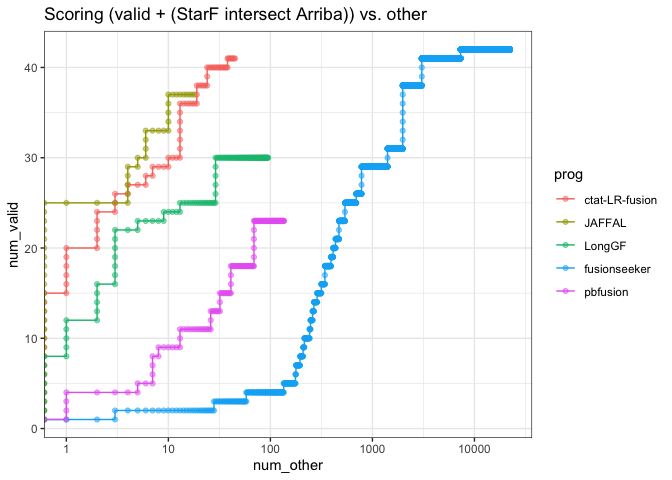
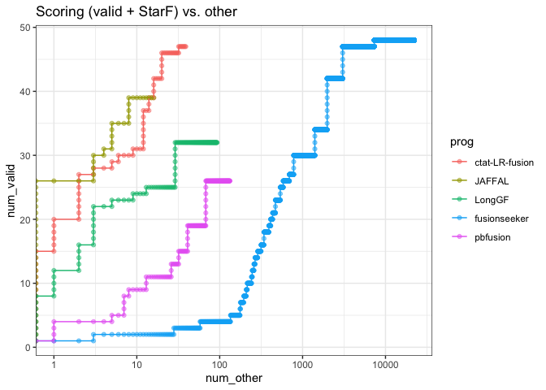

Trusted_vs_Other
================
bhaas
2024-10-07

``` r
alpha_val = 0.5
```

``` r
data = read.csv("../Table_Sx-ONT_fusions_by_method.tsv", header=T, sep="\t", stringsAsFactors = F)

data %>% head()
```

    ##       proxy_fusion_name sample           prog num_reads validated_fusion
    ## 1     MCF7|BCAS3--BCAS4   MCF7 ctat-LR-fusion      3942             TRUE
    ## 2 MCF7|AC099850.1--VMP1   MCF7 ctat-LR-fusion      1106             TRUE
    ## 3   MCF7|ARFGEF2--SULF2   MCF7 ctat-LR-fusion       576             TRUE
    ## 4  MCF7|NBPF6--SLC25A24   MCF7 ctat-LR-fusion       252             TRUE
    ## 5    K562|BAG6--SLC44A4   K562 ctat-LR-fusion       176            FALSE
    ## 6    MCF7|PICALM--SYTL2   MCF7 ctat-LR-fusion       138             TRUE
    ##   matched_illumina other_illumina
    ## 1     starF,arriba           <NA>
    ## 2     starF,arriba           <NA>
    ## 3     starF,arriba           <NA>
    ## 4     starF,arriba           <NA>
    ## 5     starF,arriba   starF,arriba
    ## 6     starF,arriba           <NA>

``` r
# score fusions

score_fusions = function(fusions_as_truth_labeled) {
    read_support_sample_scored = fusions_as_truth_labeled %>% 
        group_by(prog) %>%
        arrange(desc(num_reads), desc(as_truth)) %>% 
        mutate(num_valid = cumsum(as_truth), num_other = cumsum(! as_truth)) %>%
        ungroup()
    
    return(read_support_sample_scored)
}
```

# just the valid fusions

``` r
data %>% filter(validated_fusion) %>% select(proxy_fusion_name, prog) %>% unique() %>% 
    group_by(prog) %>% tally() %>% arrange(desc(n))
```

    ## # A tibble: 5 × 2
    ##   prog               n
    ##   <chr>          <int>
    ## 1 fusionseeker      28
    ## 2 ctat-LR-fusion    26
    ## 3 JAFFAL            25
    ## 4 LongGF            21
    ## 5 pbfusion          14

``` r
validated_fusions_found_by_progs = data %>% filter(validated_fusion) %>% select(proxy_fusion_name, prog) %>% unique() %>% 
    group_by(proxy_fusion_name) %>% arrange(prog) %>% mutate(progs = paste(prog, collapse=',') ) %>%
    select(proxy_fusion_name, progs) %>% unique()

validated_fusions_found_by_progs
```

    ## # A tibble: 29 × 2
    ## # Groups:   proxy_fusion_name [29]
    ##    proxy_fusion_name     progs                                             
    ##    <chr>                 <chr>                                             
    ##  1 MCF7|BCAS3--BCAS4     JAFFAL,LongGF,ctat-LR-fusion,fusionseeker,pbfusion
    ##  2 MCF7|AC099850.1--VMP1 JAFFAL,ctat-LR-fusion,fusionseeker,pbfusion       
    ##  3 MCF7|ARFGEF2--SULF2   JAFFAL,LongGF,ctat-LR-fusion,fusionseeker,pbfusion
    ##  4 MCF7|NBPF6--SLC25A24  JAFFAL,LongGF,ctat-LR-fusion,fusionseeker,pbfusion
    ##  5 MCF7|PICALM--SYTL2    JAFFAL,LongGF,ctat-LR-fusion,fusionseeker,pbfusion
    ##  6 MCF7|AHCYL1--RAD51C   JAFFAL,LongGF,ctat-LR-fusion,fusionseeker,pbfusion
    ##  7 MCF7|DIAPH3--RPS6KB1  JAFFAL,LongGF,ctat-LR-fusion,fusionseeker         
    ##  8 MCF7|ATP1A1--ZFP64    JAFFAL,LongGF,ctat-LR-fusion,fusionseeker,pbfusion
    ##  9 MCF7|AP4B1-AS1--RSBN1 JAFFAL,ctat-LR-fusion,fusionseeker,pbfusion       
    ## 10 MCF7|BCAS4--ZMYND8    JAFFAL,LongGF,ctat-LR-fusion,fusionseeker,pbfusion
    ## # ℹ 19 more rows

``` r
# which did ctat-LR-fusion find but not JAFFAL?

validated_fusions_found_by_progs %>% filter(grepl("ctat-LR-fusion", progs)) %>% filter(! grepl("JAFFAL", progs))
```

    ## # A tibble: 2 × 2
    ## # Groups:   proxy_fusion_name [2]
    ##   proxy_fusion_name   progs                      
    ##   <chr>               <chr>                      
    ## 1 MCF7|ABCA5--PPP4R1L ctat-LR-fusion,fusionseeker
    ## 2 MCF7|ATXN7--RAD51C  ctat-LR-fusion,fusionseeker

``` r
# which did JAFFAL find that ctat-LR-fusion did not find?

validated_fusions_found_by_progs %>% filter(grepl("JAFFAL", progs)) %>% filter(! grepl("ctat-LR-fusion", progs))
```

    ## # A tibble: 1 × 2
    ## # Groups:   proxy_fusion_name [1]
    ##   proxy_fusion_name             progs 
    ##   <chr>                         <chr> 
    ## 1 MCF7|CDKN2B-AS1--RP11-145E5.5 JAFFAL

``` r
scored_validated_fusions = score_fusions( data %>% mutate(as_truth = validated_fusion))
```

``` r
scored_validated_fusions %>% 
    select(prog, num_other, num_valid) %>% 
    ggplot(aes(x=num_other, y=num_valid)) + 
    geom_point(aes(color=prog), alpha=alpha_val) + 
    geom_line(aes(color=prog)) +
    scale_x_continuous(trans='log10') + theme_bw() +
    ggtitle("Scoring validated fusions vs. other")
```

    ## Warning: Transformation introduced infinite values in continuous x-axis
    ## Transformation introduced infinite values in continuous x-axis

<!-- -->

``` r
# but know that 'other' still contains other fusions that appear legit based on Illumina support.
```

# Valid + ( StarF, Arriba Intersection) as Truth

``` r
scored_intersected_StarF_Arriba_fusions = score_fusions(
    data %>% rowwise() %>%
        mutate(illum_support_info = paste(matched_illumina, other_illumina), sep=",") %>%
        mutate(as_truth = (grepl("starF", illum_support_info) & grepl("arriba", illum_support_info) ) )
)
```

``` r
valid_plus_both_intersect_plot = scored_intersected_StarF_Arriba_fusions %>% 
    select(prog, num_other, num_valid) %>% 
    ggplot(aes(x=num_other, y=num_valid)) + 
    geom_point(aes(color=prog), alpha=alpha_val) + 
    geom_line(aes(color=prog)) +
    scale_x_continuous(trans='log10') + theme_bw() +
    ggtitle("Scoring (valid + (StarF intersect Arriba)) vs. other")


valid_plus_both_intersect_plot
```

    ## Warning: Transformation introduced infinite values in continuous x-axis
    ## Transformation introduced infinite values in continuous x-axis

<!-- -->

``` r
ggsave(valid_plus_both_intersect_plot, file="valid_plus_both_intersect_plot.svg", width=6, height=4)
```

    ## Warning: Transformation introduced infinite values in continuous x-axis
    ## Transformation introduced infinite values in continuous x-axis

# Valid + StarF as truth

``` r
scored_valid_plus_StarF_fusions = score_fusions(
    data %>% rowwise() %>%
        mutate(illum_support_info = paste(matched_illumina, other_illumina), sep=",") %>%
        mutate(as_truth = (grepl("starF", illum_support_info)  ) )
)
```

``` r
scored_valid_plus_StarF_fusions %>% 
    select(prog, num_other, num_valid) %>% 
    ggplot(aes(x=num_other, y=num_valid)) + 
    geom_point(aes(color=prog), alpha=alpha_val) + 
    geom_line(aes(color=prog)) +
    scale_x_continuous(trans='log10') + theme_bw() +
    ggtitle("Scoring (valid + StarF) vs. other")
```

    ## Warning: Transformation introduced infinite values in continuous x-axis
    ## Transformation introduced infinite values in continuous x-axis

<!-- -->

# Valid + Arriba support as Truth

``` r
scored_valid_plus_Arriba_fusions = score_fusions(
    data %>% rowwise() %>%
        mutate(illum_support_info = paste(matched_illumina, other_illumina), sep=",") %>%
        mutate(as_truth = (grepl("arriba", illum_support_info)  ) )
)
```

``` r
scored_valid_plus_Arriba_fusions %>% 
    select(prog, num_other, num_valid) %>% 
    ggplot(aes(x=num_other, y=num_valid)) + 
    geom_point(aes(color=prog), alpha=alpha_val) + 
    geom_line(aes(color=prog)) +
    scale_x_continuous(trans='log10') + theme_bw() +
    ggtitle("Scoring (valid + Arriba) vs. other")
```

    ## Warning: Transformation introduced infinite values in continuous x-axis
    ## Transformation introduced infinite values in continuous x-axis

<!-- -->
