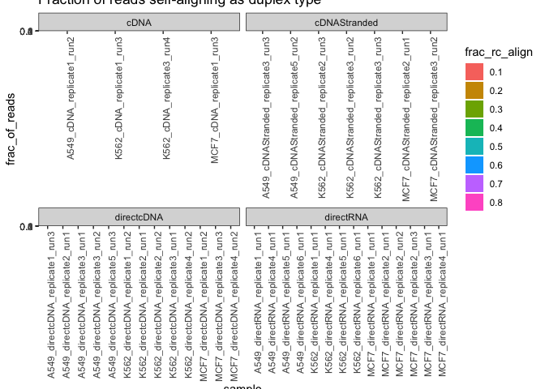

eval_duplex_reads
================
bhaas
2024-10-13

The SGNEx ONT reads were each aligned to themselves by their
reverse-complement. Best local alignments were obtained by
Smith-Waterman alignment as per:
<https://github.com/TrinityCTAT/CTAT-LR-fusion/blob/devel/util/misc/find_duplex_reads.py>

limited to reads at least 1kb in length, and for which the 100 bases at
each termini were first removed before aligning to avoid terminal polyA
or other sequences that would tend to show up as being soft-clipped in a
genome alignment.

The fraction of all reads with at least a frac of total such reads
aliging to its rev-comp at 0.1, 0.2, …, 0.8 of the read length were
assessed and are plotted below.

``` r
data = read.csv("data/summary.tsv", header=T, sep="\t", check.names=F)

data %>% head()
```

    ##                                                              sample
    ## 1   SGNex_A549_directcDNA_replicate2_run1.duplex_read_report.tsv.gz
    ## 2 SGNex_K562_cDNAStranded_replicate2_run3.duplex_read_report.tsv.gz
    ## 3 SGNex_MCF7-EV_directRNA_replicate1_run1.duplex_read_report.tsv.gz
    ## 4   SGNex_A549_directcDNA_replicate3_run2.duplex_read_report.tsv.gz
    ## 5    SGNex_A549_directRNA_replicate5_run1.duplex_read_report.tsv.gz
    ## 6    SGNex_MCF7_directRNA_replicate4_run1.duplex_read_report.tsv.gz
    ##   num_reads_ge1k   0.1   0.2   0.3   0.4   0.5   0.6   0.7   0.8
    ## 1          97581 0.318 0.232 0.196 0.175 0.157 0.142 0.125 0.096
    ## 2         281666 0.026 0.013 0.008 0.006 0.004 0.003 0.002 0.002
    ## 3        1020994 0.005 0.001 0.000 0.000 0.000 0.000 0.000 0.000
    ## 4         895059 0.308 0.226 0.193 0.174 0.158 0.143 0.128 0.100
    ## 5         734131 0.003 0.000 0.000 0.000 0.000 0.000 0.000 0.000
    ## 6         487611 0.003 0.000 0.000 0.000 0.000 0.000 0.000 0.000

``` r
data$sample = str_replace(data$sample, "-EV_", "_")
```

``` r
data$seqtype = sapply(data$sample, function(x) { str_split(x, "_")[[1]][3]})

data %>% head()
```

    ##                                                              sample
    ## 1   SGNex_A549_directcDNA_replicate2_run1.duplex_read_report.tsv.gz
    ## 2 SGNex_K562_cDNAStranded_replicate2_run3.duplex_read_report.tsv.gz
    ## 3    SGNex_MCF7_directRNA_replicate1_run1.duplex_read_report.tsv.gz
    ## 4   SGNex_A549_directcDNA_replicate3_run2.duplex_read_report.tsv.gz
    ## 5    SGNex_A549_directRNA_replicate5_run1.duplex_read_report.tsv.gz
    ## 6    SGNex_MCF7_directRNA_replicate4_run1.duplex_read_report.tsv.gz
    ##   num_reads_ge1k   0.1   0.2   0.3   0.4   0.5   0.6   0.7   0.8      seqtype
    ## 1          97581 0.318 0.232 0.196 0.175 0.157 0.142 0.125 0.096   directcDNA
    ## 2         281666 0.026 0.013 0.008 0.006 0.004 0.003 0.002 0.002 cDNAStranded
    ## 3        1020994 0.005 0.001 0.000 0.000 0.000 0.000 0.000 0.000    directRNA
    ## 4         895059 0.308 0.226 0.193 0.174 0.158 0.143 0.128 0.100   directcDNA
    ## 5         734131 0.003 0.000 0.000 0.000 0.000 0.000 0.000 0.000    directRNA
    ## 6         487611 0.003 0.000 0.000 0.000 0.000 0.000 0.000 0.000    directRNA

``` r
data = data %>% gather(key=frac_rc_align, value=frac_of_reads, `0.1`, `0.2`, `0.3`, `0.4`, `0.5`, `0.6`, `0.7`, `0.8`)

data %>% head()
```

    ##                                                              sample
    ## 1   SGNex_A549_directcDNA_replicate2_run1.duplex_read_report.tsv.gz
    ## 2 SGNex_K562_cDNAStranded_replicate2_run3.duplex_read_report.tsv.gz
    ## 3    SGNex_MCF7_directRNA_replicate1_run1.duplex_read_report.tsv.gz
    ## 4   SGNex_A549_directcDNA_replicate3_run2.duplex_read_report.tsv.gz
    ## 5    SGNex_A549_directRNA_replicate5_run1.duplex_read_report.tsv.gz
    ## 6    SGNex_MCF7_directRNA_replicate4_run1.duplex_read_report.tsv.gz
    ##   num_reads_ge1k      seqtype frac_rc_align frac_of_reads
    ## 1          97581   directcDNA           0.1         0.318
    ## 2         281666 cDNAStranded           0.1         0.026
    ## 3        1020994    directRNA           0.1         0.005
    ## 4         895059   directcDNA           0.1         0.308
    ## 5         734131    directRNA           0.1         0.003
    ## 6         487611    directRNA           0.1         0.003

``` r
data$sample = str_replace(data$sample, "SGNex_", "")
data$sample = str_replace(data$sample, ".duplex_read_report.tsv.gz", "")
```

``` r
duplex_frac_plot = data %>% ggplot(aes(x=sample, y=frac_of_reads, fill=frac_rc_align)) + 
    theme_bw() +
    geom_bar(stat='identity', position='dodge') +
    facet_wrap(~seqtype, scale='free_x') +
    theme(axis.text.x = element_text(angle = 90, hjust = 1)) +
    ggtitle("Fraction of reads self-aligning as duplex type")

duplex_frac_plot
```

<!-- -->

``` r
ggsave(duplex_frac_plot, file="SGNEx_duplex_frac_plot.svg", width=8, height=8)
```
