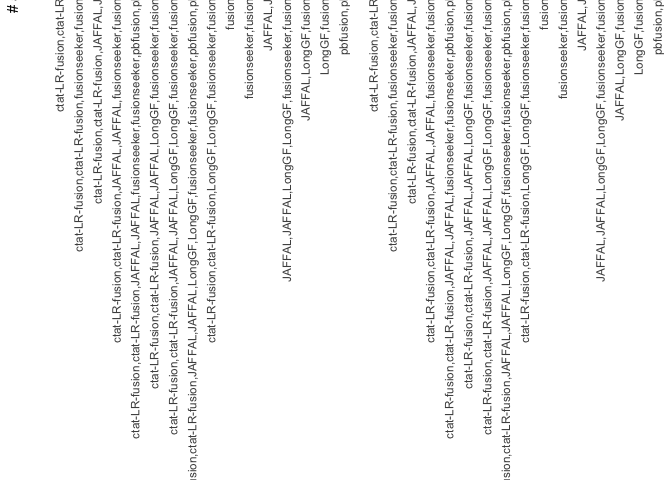

SGNex_ONT_eval
================
bhaas
2024-07-24

``` r
PREDS_FILE_ALL = "data/preds.collected.gencode_mapped.wAnnot.filt.pass.proxy_assignments.gz"

# or use the version with ctat-LRF restricted to spliced fusions for comparison.
PREDS_FILE_fuzzy_restricted = "data/preds.collected.gencode_mapped.wAnnot.filt.pass.proxy_assignments.FUZZY_RESTRICTED.gz"
```

Proxy fusion names

``` r
parse_preds_file = function(PREDS_FILE) {

    read_support = read.csv(PREDS_FILE, header=T, sep="\t")
    
    read_support$sample = str_replace(read_support$sample, "-EV_directRNA", "_EVdirectRNA")
    
    return(read_support)    
}
```

``` r
regular_run_data = parse_preds_file(PREDS_FILE_ALL)

regular_run_data %>% head()
```

    ##           proxy_fusion_name     proxy_fusion_type sample   prog
    ## 1        A549|SCAMP2--WDR72       known_validated   A549 JAFFAL
    ## 2        A549|ACACA--PLXDC1       known_validated   A549 JAFFAL
    ## 3  A549|RP11-69H14.6--ZNF43 recip_known_validated   A549 JAFFAL
    ## 4        A549|ACACA--PLXDC1       known_validated   A549 JAFFAL
    ## 5 A549|RP11-983G14.1--ZNF43                tie_lt   A549 JAFFAL
    ## 6        A549|ACACA--PLXDC1       known_validated   A549 JAFFAL
    ##                 fusion                     breakpoint num_reads
    ## 1        SCAMP2--WDR72 chr15:74845473--chr15:53706074        25
    ## 2        ACACA--PLXDC1 chr17:37330173--chr17:39109391        20
    ## 3  ZNF43--RP11-69H14.6 chr19:21836036--chr15:22030926         7
    ## 4        ACACA--PLXDC1 chr17:37289418--chr17:39109391         4
    ## 5 ZNF43--RP11-983G14.1 chr19:21843145--chr15:21595606         3
    ## 6        ACACA--PLXDC1 chr17:37330173--chr17:39087702         2
    ##                                                                mapped_gencode_A_gene_list
    ## 1                                                                                  SCAMP2
    ## 2 AC243654.1,ACACA,C17orf78,HMGB1P24,RP11-19G24.1,RP11-19G24.2,RP11-19G24.3,RP11-378E13.3
    ## 3                                                            BNIP3P27,CTD-2607J13.1,ZNF43
    ## 4 AC243654.1,ACACA,C17orf78,HMGB1P24,RP11-19G24.1,RP11-19G24.2,RP11-19G24.3,RP11-378E13.3
    ## 5                                                            BNIP3P27,CTD-2607J13.1,ZNF43
    ## 6 AC243654.1,ACACA,C17orf78,HMGB1P24,RP11-19G24.1,RP11-19G24.2,RP11-19G24.3,RP11-378E13.3
    ##                                               mapped_gencode_B_gene_list
    ## 1                                                         RNU2-53P,WDR72
    ## 2                                         AC091178.1,CTD-2206N4.4,PLXDC1
    ## 3                 OR11H3P,OR11K1P,OR4H6P,OR4M2,OR4N4,OR4Q1P,RP11-69H14.6
    ## 4                                         AC091178.1,CTD-2206N4.4,PLXDC1
    ## 5 AC135068.1,OR4M2,RP11-11H9.2,RP11-294C11.3,RP11-928F19.5,RP11-983G14.1
    ## 6                                         AC091178.1,CTD-2206N4.4,PLXDC1
    ##                                                                                                                                 annots
    ## 1 SCAMP2--WDR72:[Klijn_CellLines,CCLE_StarF2019];INTRACHROMOSOMAL[chr15:21.08Mb];;(recip)WDR72--SCAMP2:INTRACHROMOSOMAL[chr15:21.08Mb]
    ## 2                                    ACACA--PLXDC1:INTRACHROMOSOMAL[chr17:1.66Mb];;(recip)PLXDC1--ACACA:INTRACHROMOSOMAL[chr17:1.66Mb]
    ## 3                        ZNF43--RP11-69H14.6:INTERCHROMOSOMAL[chr19--chr15];;(recip)RP11-69H14.6--ZNF43:INTERCHROMOSOMAL[chr15--chr19]
    ## 4                                    ACACA--PLXDC1:INTRACHROMOSOMAL[chr17:1.66Mb];;(recip)PLXDC1--ACACA:INTRACHROMOSOMAL[chr17:1.66Mb]
    ## 5                      ZNF43--RP11-983G14.1:INTERCHROMOSOMAL[chr19--chr15];;(recip)RP11-983G14.1--ZNF43:INTERCHROMOSOMAL[chr15--chr19]
    ## 6                                    ACACA--PLXDC1:INTRACHROMOSOMAL[chr17:1.66Mb];;(recip)PLXDC1--ACACA:INTRACHROMOSOMAL[chr17:1.66Mb]

``` r
fuzzy_restricted_run_data = parse_preds_file(PREDS_FILE_fuzzy_restricted)


fuzzy_restricted_run_data %>% head()
```

    ##           proxy_fusion_name     proxy_fusion_type sample   prog
    ## 1        A549|SCAMP2--WDR72       known_validated   A549 JAFFAL
    ## 2        A549|ACACA--PLXDC1       known_validated   A549 JAFFAL
    ## 3  A549|RP11-69H14.6--ZNF43 recip_known_validated   A549 JAFFAL
    ## 4        A549|ACACA--PLXDC1       known_validated   A549 JAFFAL
    ## 5 A549|RP11-983G14.1--ZNF43                tie_lt   A549 JAFFAL
    ## 6        A549|ACACA--PLXDC1       known_validated   A549 JAFFAL
    ##                 fusion                     breakpoint num_reads
    ## 1        SCAMP2--WDR72 chr15:74845473--chr15:53706074        25
    ## 2        ACACA--PLXDC1 chr17:37330173--chr17:39109391        20
    ## 3  ZNF43--RP11-69H14.6 chr19:21836036--chr15:22030926         7
    ## 4        ACACA--PLXDC1 chr17:37289418--chr17:39109391         4
    ## 5 ZNF43--RP11-983G14.1 chr19:21843145--chr15:21595606         3
    ## 6        ACACA--PLXDC1 chr17:37330173--chr17:39087702         2
    ##                                                                mapped_gencode_A_gene_list
    ## 1                                                                                  SCAMP2
    ## 2 AC243654.1,ACACA,C17orf78,HMGB1P24,RP11-19G24.1,RP11-19G24.2,RP11-19G24.3,RP11-378E13.3
    ## 3                                                            BNIP3P27,CTD-2607J13.1,ZNF43
    ## 4 AC243654.1,ACACA,C17orf78,HMGB1P24,RP11-19G24.1,RP11-19G24.2,RP11-19G24.3,RP11-378E13.3
    ## 5                                                            BNIP3P27,CTD-2607J13.1,ZNF43
    ## 6 AC243654.1,ACACA,C17orf78,HMGB1P24,RP11-19G24.1,RP11-19G24.2,RP11-19G24.3,RP11-378E13.3
    ##                                               mapped_gencode_B_gene_list
    ## 1                                                         RNU2-53P,WDR72
    ## 2                                         AC091178.1,CTD-2206N4.4,PLXDC1
    ## 3                 OR11H3P,OR11K1P,OR4H6P,OR4M2,OR4N4,OR4Q1P,RP11-69H14.6
    ## 4                                         AC091178.1,CTD-2206N4.4,PLXDC1
    ## 5 AC135068.1,OR4M2,RP11-11H9.2,RP11-294C11.3,RP11-928F19.5,RP11-983G14.1
    ## 6                                         AC091178.1,CTD-2206N4.4,PLXDC1
    ##                                                                                                                                     annots
    ## 1 SCAMP2--WDR72:["Klijn_CellLines","CCLE_StarF2019"];INTRACHROMOSOMAL[chr15:21.08Mb];;(recip)WDR72--SCAMP2:INTRACHROMOSOMAL[chr15:21.08Mb]
    ## 2                                        ACACA--PLXDC1:INTRACHROMOSOMAL[chr17:1.66Mb];;(recip)PLXDC1--ACACA:INTRACHROMOSOMAL[chr17:1.66Mb]
    ## 3                            ZNF43--RP11-69H14.6:INTERCHROMOSOMAL[chr19--chr15];;(recip)RP11-69H14.6--ZNF43:INTERCHROMOSOMAL[chr15--chr19]
    ## 4                                        ACACA--PLXDC1:INTRACHROMOSOMAL[chr17:1.66Mb];;(recip)PLXDC1--ACACA:INTRACHROMOSOMAL[chr17:1.66Mb]
    ## 5                          ZNF43--RP11-983G14.1:INTERCHROMOSOMAL[chr19--chr15];;(recip)RP11-983G14.1--ZNF43:INTERCHROMOSOMAL[chr15--chr19]
    ## 6                                        ACACA--PLXDC1:INTRACHROMOSOMAL[chr17:1.66Mb];;(recip)PLXDC1--ACACA:INTRACHROMOSOMAL[chr17:1.66Mb]

``` r
regular_run_data$runtype = "regular"
fuzzy_restricted_run_data$runtype  = "fuzzy_restricted"

read_support = bind_rows(regular_run_data %>% mutate(runtype = "regular"),
                         fuzzy_restricted_run_data %>% mutate(runtype = "fuzzy_brkpt_restricted") )
```

``` r
read_support = read_support %>% select(-c(mapped_gencode_A_gene_list, mapped_gencode_B_gene_list))
```

``` r
# use lex-sorted fusion name

make_lex_sorted_fusion_name = function(fusion_name) {
    
    sample_name = str_split(fusion_name, "\\|")[[1]][1]
    fusion_pair = str_split(fusion_name, "\\|")[[1]][2]
    
    sorted_gene_pair = sort(str_split(fusion_pair,"--")[[1]])
    
    lex_sorted_fusion_name = paste0(sample_name, "|", sorted_gene_pair[1], "--", sorted_gene_pair[2])
    
    return(lex_sorted_fusion_name)
}

read_support = read_support %>% rowwise() %>% mutate(lex_sorted_fusion_name = make_lex_sorted_fusion_name(proxy_fusion_name))
```

``` r
# restrict to dominant isoform in each sample

nrow(read_support)
```

    ## [1] 75616

``` r
read_support_sample = read_support %>% group_by(lex_sorted_fusion_name, prog, sample, runtype) %>% arrange(desc(num_reads)) %>%
    filter(row_number() == 1) %>%
    ungroup()

nrow(read_support_sample)
```

    ## [1] 31349

``` r
validated_fusions = data.frame(validated_fusion = c(
"MCF7|BCAS4--BCAS3",
"MCF7|ARFGEF2--SULF2",
"MCF7|RPS6KB1--VMP1",
"MCF7|GCN1L1--MSI1",
"MCF7|AC099850.1--VMP1",
"MCF7|SMARCA4--CARM1",
"MCF7|SLC25A24--NBPF6",
"MCF7|USP31--CRYL1",
"MCF7|TBL1XR1--RGS17",
"MCF7|TAF4--BRIP1",
"MCF7|RPS6KB1--DIAPH3",
"MCF7|AHCYL1--RAD51C",
"MCF7|ABCA5--PPP4R1L",
"MCF7|C16orf45--ABCC1",
"MCF7|C16orf62--IQCK",
"MCF7|TXLNG--SYAP1",
"MCF7|MYO6--SENP6",
"MCF7|POP1--MATN2",
"MCF7|GATAD2B--NUP210L",
"MCF7|ESR1--CCDC170",
"MCF7|DEPDC1B--ELOVL7",
"MCF7|ATXN7L3--FAM171A2",
"MCF7|SYTL2--PICALM",
"MCF7|ADAMTS19--SLC27A6",
"MCF7|ARHGAP19--DRG1",
"MCF7|MYO9B--FCHO1",
"MCF7|PAPOLA--AK7",
"MCF7|ANKS1A--UHRF1BP1",
"MCF7|ATP1A1--ZFP64",
"MCF7|B3GNTL1--SLC9A8",
"MCF7|BCAS3--AMPD1",
"MCF7|BCAS3--ATXN7",
"MCF7|BCAS4--ZMYND8",
"MCF7|CHEK2--XBP1",
"MCF7|KCND3--PPM1E",
"MCF7|RP11-145E5.5--CDKN2B-AS1",
"MCF7|NAV1--GPR37L1",
"MCF7|NCOA3--SULF2",
"MCF7|PLCG1--TOP1",
"MCF7|PNPLA7--DPH7",
"MCF7|PTPRG--CCDC129",
"MCF7|PTPRN2--FAM62B",
"MCF7|RAD51C--ATXN7",
"MCF7|RSBN1--AP4B1-AS1",
"MCF7|SGPP2--ULK4",
"MCF7|SULF2--PRICKLE2",
"MCF7|TEX14--PTPRG",
"MCF7|TOP1--CR593014",
"MCF7|TSPAN9--TEAD4",
"MCF7|UBE2V1--TBX2",
"MCF7|VAV3--AP4B1-AS1",
"MCF7|ZMYND8--USP32",
"MCF7|MYH9--EIF3D",

"K562|NUP214--XKR3",
"K562|PRIM1--NACA",
"K562|BRK1--VHL",
"K562|ACCS--EXT2",
"K562|SLC29A1--HSP90AB1",
"K562|BCR--ABL1",

"A549|SCAMP2--WDR72",
"A549|RICTOR--FYB"

) )


validated_fusions = validated_fusions %>% rowwise() %>% mutate(lex_sorted_validated_fusion = make_lex_sorted_fusion_name(validated_fusion))
```

``` r
lex_sorted_validated_fusions = validated_fusions %>% select(lex_sorted_validated_fusion) %>% unique() %>% pull(lex_sorted_validated_fusion)
```

``` r
# incorporate the validated info
read_support_sample = read_support_sample %>% rowwise() %>% 
    mutate(validated_fusion = (lex_sorted_fusion_name %in% lex_sorted_validated_fusions) )
```

``` r
read_support_sample %>% filter(validated_fusion) %>% 
    select(sample, lex_sorted_fusion_name, prog) %>% unique() %>%
    group_by(lex_sorted_fusion_name) %>% 
    arrange(prog) %>% 
    mutate(progs = paste(prog, collapse=","), num_progs = n()) %>% 
    select(sample, lex_sorted_fusion_name, progs, num_progs) %>%
    unique() %>%
    arrange(sample, desc(num_progs))
```

    ## # A tibble: 29 × 4
    ## # Groups:   lex_sorted_fusion_name [29]
    ##    sample lex_sorted_fusion_name progs                                 num_progs
    ##    <chr>  <chr>                  <chr>                                     <int>
    ##  1 A549   A549|SCAMP2--WDR72     JAFFAL,LongGF,ctat-LR-fusion,fusions…         5
    ##  2 K562   K562|NUP214--XKR3      JAFFAL,LongGF,ctat-LR-fusion,fusions…         5
    ##  3 K562   K562|ABL1--BCR         JAFFAL,LongGF,ctat-LR-fusion,fusions…         4
    ##  4 MCF7   MCF7|BCAS3--BCAS4      JAFFAL,LongGF,ctat-LR-fusion,fusions…         5
    ##  5 MCF7   MCF7|ARFGEF2--SULF2    JAFFAL,LongGF,ctat-LR-fusion,fusions…         5
    ##  6 MCF7   MCF7|NBPF6--SLC25A24   JAFFAL,LongGF,ctat-LR-fusion,fusions…         5
    ##  7 MCF7   MCF7|PICALM--SYTL2     JAFFAL,LongGF,ctat-LR-fusion,fusions…         5
    ##  8 MCF7   MCF7|AHCYL1--RAD51C    JAFFAL,LongGF,ctat-LR-fusion,fusions…         5
    ##  9 MCF7   MCF7|ATP1A1--ZFP64     JAFFAL,LongGF,ctat-LR-fusion,fusions…         5
    ## 10 MCF7   MCF7|BCAS4--ZMYND8     JAFFAL,LongGF,ctat-LR-fusion,fusions…         5
    ## # ℹ 19 more rows

# incorporate illumina support info

``` r
illumina_support_info = read.csv("6.1.SGNex_Matched_Illumina/SGNEx_Illumina_supported_fusions.tsv", header=T, sep="\t")

illumina_support_info %>% head()
```

    ##   sample       FusionName.starF est_J est_S   FFPM          SpliceType
    ## 1   A549            RICTOR--FYB    77  0.00 1.4778     ONLY_REF_SPLICE
    ## 2   A549          SCAMP2--WDR72    39  3.00 0.9447     ONLY_REF_SPLICE
    ## 3   A549          ACACA--PLXDC1    29  0.78 0.6158     ONLY_REF_SPLICE
    ## 4   A549         KANSL1--ARL17A    13  1.00 0.2895     ONLY_REF_SPLICE
    ## 5   A549           LEPROT--LEPR    10  0.00 0.2249     ONLY_REF_SPLICE
    ## 6   A549 RP11-603B24.1--HERC2P3     8  0.00 0.1535 INCL_NON_REF_SPLICE
    ##       lex_ordered_fusion_name has_long_read_support num_LR_progs
    ## 1            A549|FYB--RICTOR                 FALSE           NA
    ## 2          A549|SCAMP2--WDR72                  TRUE            5
    ## 3          A549|ACACA--PLXDC1                  TRUE            5
    ## 4         A549|ARL17A--KANSL1                 FALSE           NA
    ## 5           A549|LEPR--LEPROT                 FALSE           NA
    ## 6 A549|HERC2P3--RP11-603B24.1                  TRUE            1
    ##                                             LR_progs FusionName.arriba
    ## 1                                               <NA>              <NA>
    ## 2 JAFFAL,LongGF,ctat-LR-fusion,fusionseeker,pbfusion     SCAMP2--WDR72
    ## 3 JAFFAL,LongGF,ctat-LR-fusion,fusionseeker,pbfusion     ACACA--PLXDC1
    ## 4                                               <NA>              <NA>
    ## 5                                               <NA>              <NA>
    ## 6                                       fusionseeker              <NA>
    ##   sum_split_reads discordant_mates        progs    primary_fusion_name
    ## 1              NA               NA        starF            RICTOR--FYB
    ## 2              35                2 starF,arriba          SCAMP2--WDR72
    ## 3              29                0 starF,arriba          ACACA--PLXDC1
    ## 4              NA               NA        starF         KANSL1--ARL17A
    ## 5              NA               NA        starF           LEPROT--LEPR
    ## 6              NA               NA        starF RP11-603B24.1--HERC2P3

``` r
read_support_sample = left_join(read_support_sample,
                             illumina_support_info %>% select(lex_ordered_fusion_name, progs) %>% 
                                 unique() %>%
                                 rename(matched_illumina = progs),
                             by=c('lex_sorted_fusion_name'='lex_ordered_fusion_name') )
```

``` r
read_support_sample %>% filter(validated_fusion | !is.na(matched_illumina)) %>% 
    select(sample, lex_sorted_fusion_name, validated_fusion, matched_illumina, prog) %>% unique() %>%
    group_by(lex_sorted_fusion_name) %>% 
    arrange(prog) %>% 
    mutate(progs = paste(prog, collapse=","), num_progs = n()) %>% 
    select(sample, lex_sorted_fusion_name, validated_fusion, matched_illumina, progs, num_progs) %>%
    unique() %>%
    arrange(sample, desc(num_progs))
```

    ## # A tibble: 76 × 6
    ## # Groups:   lex_sorted_fusion_name [76]
    ##    sample lex_sorted_fusion_name      validated_fusion matched_illumina progs   
    ##    <chr>  <chr>                       <lgl>            <chr>            <chr>   
    ##  1 A549   A549|SCAMP2--WDR72          TRUE             starF,arriba     JAFFAL,…
    ##  2 A549   A549|ACACA--PLXDC1          FALSE            starF,arriba     JAFFAL,…
    ##  3 A549   A549|RP11-69H14.6--ZNF43    FALSE            arriba           JAFFAL,…
    ##  4 A549   A549|MTAP--RP11-408N14.1    FALSE            arriba           fusions…
    ##  5 A549   A549|LRRN2--PLEKHA6         FALSE            arriba           fusions…
    ##  6 A549   A549|HERC2P3--RP11-603B24.1 FALSE            starF            fusions…
    ##  7 K562   K562|NUP214--XKR3           TRUE             starF,arriba     JAFFAL,…
    ##  8 K562   K562|BAG6--SLC44A4          FALSE            starF,arriba     JAFFAL,…
    ##  9 K562   K562|C16orf87--ORC6         FALSE            starF,arriba     JAFFAL,…
    ## 10 K562   K562|ABL1--BCR              TRUE             starF,arriba     JAFFAL,…
    ## # ℹ 66 more rows
    ## # ℹ 1 more variable: num_progs <int>

# incorporate our separate Illumina supported fusions

``` r
our_illumina_reads = read.csv("../3.DepMap9Lines/3b.DepMap9Lines_Benchmarking/3b.1.IlluminaTruSeqDepMap9Lines/Illumina_supported_fusions.tsv", header=T, sep="\t")


read_support_sample = left_join(read_support_sample, 
                             our_illumina_reads %>% select(lex_ordered_fusion_name, progs) %>% 
                                 unique() %>%
                                 rename(other_illumina = progs),
                             by=c('lex_sorted_fusion_name'='lex_ordered_fusion_name') )
```

``` r
read_support_sample %>% filter(validated_fusion | !is.na(matched_illumina) | !is.na(other_illumina) ) %>% 
    select(sample, lex_sorted_fusion_name, validated_fusion, matched_illumina, other_illumina, prog) %>% unique() %>%
    group_by(lex_sorted_fusion_name) %>% 
    arrange(prog) %>% 
    mutate(progs = paste(prog, collapse=","), num_progs = n()) %>% 
    select(sample, lex_sorted_fusion_name, validated_fusion, matched_illumina, other_illumina, progs, num_progs) %>%
    unique() %>%
    arrange(sample, desc(num_progs))
```

    ## # A tibble: 79 × 7
    ## # Groups:   lex_sorted_fusion_name [79]
    ##    sample lex_sorted_fusion_name      validated_fusion matched_illumina
    ##    <chr>  <chr>                       <lgl>            <chr>           
    ##  1 A549   A549|SCAMP2--WDR72          TRUE             starF,arriba    
    ##  2 A549   A549|ACACA--PLXDC1          FALSE            starF,arriba    
    ##  3 A549   A549|RP11-69H14.6--ZNF43    FALSE            arriba          
    ##  4 A549   A549|MTAP--RP11-408N14.1    FALSE            arriba          
    ##  5 A549   A549|LRRN2--PLEKHA6         FALSE            arriba          
    ##  6 A549   A549|HERC2P3--RP11-603B24.1 FALSE            starF           
    ##  7 K562   K562|NUP214--XKR3           TRUE             starF,arriba    
    ##  8 K562   K562|BAG6--SLC44A4          FALSE            starF,arriba    
    ##  9 K562   K562|C16orf87--ORC6         FALSE            starF,arriba    
    ## 10 K562   K562|ABL1--BCR              TRUE             starF,arriba    
    ## # ℹ 69 more rows
    ## # ℹ 3 more variables: other_illumina <chr>, progs <chr>, num_progs <int>

``` r
# which validated fusions do we find?

read_support_sample %>% filter(validated_fusion) %>% select(lex_sorted_fusion_name) %>% unique()
```

    ## # A tibble: 29 × 1
    ## # Rowwise: 
    ##    lex_sorted_fusion_name
    ##    <chr>                 
    ##  1 MCF7|BCAS3--BCAS4     
    ##  2 MCF7|AC099850.1--VMP1 
    ##  3 MCF7|ARFGEF2--SULF2   
    ##  4 MCF7|NBPF6--SLC25A24  
    ##  5 MCF7|PICALM--SYTL2    
    ##  6 MCF7|ATP1A1--ZFP64    
    ##  7 MCF7|AHCYL1--RAD51C   
    ##  8 MCF7|AP4B1-AS1--RSBN1 
    ##  9 MCF7|BCAS4--ZMYND8    
    ## 10 K562|NUP214--XKR3     
    ## # ℹ 19 more rows

``` r
# which validated fusions are missing?


setdiff(lex_sorted_validated_fusions, read_support_sample %>% select(lex_sorted_fusion_name) %>% unique() %>% pull(lex_sorted_fusion_name))
```

    ##  [1] "MCF7|RPS6KB1--VMP1"     "MCF7|CARM1--SMARCA4"    "MCF7|CRYL1--USP31"     
    ##  [4] "MCF7|C16orf62--IQCK"    "MCF7|SYAP1--TXLNG"      "MCF7|MYO6--SENP6"      
    ##  [7] "MCF7|MATN2--POP1"       "MCF7|GATAD2B--NUP210L"  "MCF7|CCDC170--ESR1"    
    ## [10] "MCF7|DEPDC1B--ELOVL7"   "MCF7|ARHGAP19--DRG1"    "MCF7|AK7--PAPOLA"      
    ## [13] "MCF7|ANKS1A--UHRF1BP1"  "MCF7|AMPD1--BCAS3"      "MCF7|CHEK2--XBP1"      
    ## [16] "MCF7|KCND3--PPM1E"      "MCF7|NCOA3--SULF2"      "MCF7|PLCG1--TOP1"      
    ## [19] "MCF7|DPH7--PNPLA7"      "MCF7|CCDC129--PTPRG"    "MCF7|FAM62B--PTPRN2"   
    ## [22] "MCF7|CR593014--TOP1"    "MCF7|TEAD4--TSPAN9"     "MCF7|TBX2--UBE2V1"     
    ## [25] "MCF7|AP4B1-AS1--VAV3"   "MCF7|USP32--ZMYND8"     "MCF7|EIF3D--MYH9"      
    ## [28] "K562|NACA--PRIM1"       "K562|BRK1--VHL"         "K562|ACCS--EXT2"       
    ## [31] "K562|HSP90AB1--SLC29A1" "A549|FYB--RICTOR"

``` r
read_support_sample = read_support_sample %>% mutate(as_truth = (validated_fusion | !is.na(matched_illumina) | !is.na(other_illumina)) )
```

``` r
read_support_sample %>% filter(as_truth) %>% 
    select(lex_sorted_fusion_name, validated_fusion, matched_illumina, other_illumina) %>% 
    unique()
```

    ## # A tibble: 79 × 4
    ## # Rowwise: 
    ##    lex_sorted_fusion_name   validated_fusion matched_illumina other_illumina
    ##    <chr>                    <lgl>            <chr>            <chr>         
    ##  1 MCF7|BCAS3--BCAS4        TRUE             starF,arriba     <NA>          
    ##  2 MCF7|AC099850.1--VMP1    TRUE             starF,arriba     <NA>          
    ##  3 MCF7|ARFGEF2--SULF2      TRUE             starF,arriba     <NA>          
    ##  4 MCF7|SULF2--ZNF217       FALSE            arriba           <NA>          
    ##  5 MCF7|NBPF6--SLC25A24     TRUE             starF,arriba     <NA>          
    ##  6 K562|BAG6--SLC44A4       FALSE            starF,arriba     starF,arriba  
    ##  7 MCF7|PPM1D--USP32        FALSE            arriba           <NA>          
    ##  8 MCF7|PICALM--SYTL2       TRUE             starF,arriba     <NA>          
    ##  9 MCF7|RSBN1--VAV3         FALSE            arriba           <NA>          
    ## 10 A549|MTAP--RP11-408N14.1 FALSE            arriba           <NA>          
    ## # ℹ 69 more rows

``` r
# 79 'truth' fusions
```

# score fusions

``` r
# score fusions

read_support_sample_scored = read_support_sample %>% 
     group_by(prog, runtype) %>%
     arrange(desc(num_reads), desc(as_truth)) %>% 
    mutate(num_valid = cumsum(as_truth), num_other = cumsum(! as_truth)) %>%
    ungroup()
```

``` r
read_support_sample_scored %>% filter(prog == 'ctat-LR-fusion')  %>% head(50)
```

    ## # A tibble: 50 × 16
    ##    proxy_fusion_name  proxy_fusion_type sample prog  fusion breakpoint num_reads
    ##    <chr>              <chr>             <chr>  <chr> <chr>  <chr>          <int>
    ##  1 MCF7|BCAS3--BCAS4  recip_known_vali… MCF7   ctat… BCAS4… chr20:507…      3942
    ##  2 MCF7|BCAS3--BCAS4  recip_known_vali… MCF7   ctat… BCAS4… chr20:507…      3942
    ##  3 MCF7|AC099850.1--… known_validated   MCF7   ctat… AC099… chr17:591…      1106
    ##  4 MCF7|AC099850.1--… known_validated   MCF7   ctat… AC099… chr17:591…      1106
    ##  5 MCF7|ARFGEF2--SUL… known_validated   MCF7   ctat… ARFGE… chr20:489…       576
    ##  6 MCF7|ARFGEF2--SUL… known_validated   MCF7   ctat… ARFGE… chr20:489…       576
    ##  7 MCF7|NBPF6--SLC25… recip_known_vali… MCF7   ctat… SLC25… chr1:1081…       252
    ##  8 MCF7|NBPF6--SLC25… recip_known_vali… MCF7   ctat… SLC25… chr1:1081…       252
    ##  9 K562|BAG6--SLC44A4 known_validated   K562   ctat… BAG6-… chr6:3165…       176
    ## 10 K562|BAG6--SLC44A4 known_validated   K562   ctat… BAG6-… chr6:3165…       176
    ## # ℹ 40 more rows
    ## # ℹ 9 more variables: annots <chr>, runtype <chr>,
    ## #   lex_sorted_fusion_name <chr>, validated_fusion <lgl>,
    ## #   matched_illumina <chr>, other_illumina <chr>, as_truth <lgl>,
    ## #   num_valid <int>, num_other <int>

``` r
read_support_sample_scored$prog = factor(read_support_sample_scored$prog, levels=c('ctat-LR-fusion',
                                                                             'JAFFAL',
                                                                             'LongGF',
                                                                             'fusionseeker',
                                                                             'pbfusion'
                                                                             ))
```

``` r
alpha_val = 0.2

SGNEx_fusion_plot = read_support_sample_scored %>% 
    select(prog, num_other, num_valid, runtype) %>% 
    ggplot(aes(x=num_other, y=num_valid)) + 
    geom_point(aes(color=prog), alpha=alpha_val) + 
    geom_line(aes(color=prog)) +
    scale_x_continuous(trans='log10') + theme_bw() +
    facet_wrap(~runtype)

SGNEx_fusion_plot
```

    ## Warning: Transformation introduced infinite values in continuous x-axis
    ## Transformation introduced infinite values in continuous x-axis

<!-- -->

``` r
# simplify plot for upload into inkscape

num_valid_vs_num_other = read_support_sample_scored %>% 
    select(prog, num_other, num_valid, runtype) 


num_valid_vs_num_other_lte_10k = num_valid_vs_num_other %>% group_by(runtype) %>% filter(num_other <= 10000) %>% ungroup()
num_valid_vs_num_other_gt_10k = num_valid_vs_num_other %>% group_by(runtype) %>% filter(num_other > 10000) %>% ungroup()
```

``` r
num_valid_vs_num_other_gt_10k  = num_valid_vs_num_other_gt_10k  %>% group_by(runtype) %>% sample_n(1000) %>% ungroup()
```

``` r
num_valid_vs_num_other  = bind_rows(num_valid_vs_num_other_lte_10k, num_valid_vs_num_other_gt_10k)

SGNEx_fusion_plot = num_valid_vs_num_other %>% 
    select(prog, num_other, num_valid, runtype)  %>% 
    
    mutate(runtype = factor(runtype, levels=c('regular', 'fuzzy_brkpt_restricted'))) %>%
    
    ggplot(aes(x=num_other, y=num_valid)) + 
    geom_point(aes(color=prog), alpha=alpha_val) + 
    geom_line(aes(color=prog)) +
    scale_x_continuous(trans='log10') + theme_bw() + facet_wrap(~runtype)

SGNEx_fusion_plot
```

    ## Warning: Transformation introduced infinite values in continuous x-axis
    ## Transformation introduced infinite values in continuous x-axis

<!-- -->

``` r
ggsave(SGNEx_fusion_plot, filename="SGNEx_fusion_plot.svg", width=7, height=3.5)
```

    ## Warning: Transformation introduced infinite values in continuous x-axis
    ## Transformation introduced infinite values in continuous x-axis

``` r
# examine Venn for valid fusions

read_support_sample_scored  %>% filter(as_truth) %>% group_by(lex_sorted_fusion_name, runtype) %>%
    arrange(prog) %>%
    mutate(progs = paste(collapse=",", prog)) %>%
    ungroup() %>%
    select(runtype, lex_sorted_fusion_name, progs) %>% unique() %>% 
    arrange(runtype, lex_sorted_fusion_name, progs)
```

    ## # A tibble: 135 × 3
    ##    runtype                lex_sorted_fusion_name           progs                
    ##    <chr>                  <chr>                            <chr>                
    ##  1 fuzzy_brkpt_restricted A549|ACACA--PLXDC1               ctat-LR-fusion,JAFFA…
    ##  2 fuzzy_brkpt_restricted A549|HERC2P3--RP11-603B24.1      fusionseeker         
    ##  3 fuzzy_brkpt_restricted A549|RP11-69H14.6--ZNF43         ctat-LR-fusion,JAFFA…
    ##  4 fuzzy_brkpt_restricted A549|SCAMP2--WDR72               ctat-LR-fusion,JAFFA…
    ##  5 fuzzy_brkpt_restricted K562|ABL1--BCR                   ctat-LR-fusion,JAFFA…
    ##  6 fuzzy_brkpt_restricted K562|BAG6--SLC44A4               ctat-LR-fusion,JAFFA…
    ##  7 fuzzy_brkpt_restricted K562|C16orf87--ORC6              ctat-LR-fusion,JAFFA…
    ##  8 fuzzy_brkpt_restricted K562|CCDC26--LINC00977           pbfusion             
    ##  9 fuzzy_brkpt_restricted K562|CEP70--FAIM                 ctat-LR-fusion,JAFFA…
    ## 10 fuzzy_brkpt_restricted K562|CTC-786C10.1--RP11-680G10.1 pbfusion             
    ## # ℹ 125 more rows

``` r
read_support_sample_scored  %>% filter(as_truth) %>% group_by(lex_sorted_fusion_name, runtype) %>%
    arrange(prog) %>%
    mutate(progs = paste(collapse=",", prog)) %>%
    ungroup() %>%
    select(lex_sorted_fusion_name, progs, runtype) %>% unique() %>% 
    group_by(progs, runtype) %>% tally() %>%
    arrange(desc(n))
```

    ## # A tibble: 25 × 3
    ## # Groups:   progs [13]
    ##    progs                                              runtype                  n
    ##    <chr>                                              <chr>                <int>
    ##  1 ctat-LR-fusion,JAFFAL,LongGF,fusionseeker,pbfusion fuzzy_brkpt_restric…    19
    ##  2 ctat-LR-fusion,JAFFAL,LongGF,fusionseeker,pbfusion regular                 19
    ##  3 fusionseeker                                       regular                 15
    ##  4 ctat-LR-fusion,JAFFAL,LongGF,fusionseeker          regular                 11
    ##  5 ctat-LR-fusion,JAFFAL,LongGF,fusionseeker          fuzzy_brkpt_restric…    10
    ##  6 LongGF,fusionseeker                                regular                  9
    ##  7 ctat-LR-fusion,JAFFAL,fusionseeker,pbfusion        fuzzy_brkpt_restric…     6
    ##  8 ctat-LR-fusion,JAFFAL,fusionseeker,pbfusion        regular                  6
    ##  9 ctat-LR-fusion                                     fuzzy_brkpt_restric…     5
    ## 10 ctat-LR-fusion                                     regular                  5
    ## # ℹ 15 more rows

``` r
read_support_sample_scored  %>% filter(as_truth) %>% group_by(lex_sorted_fusion_name) %>%
    arrange(prog, runtype) %>%
    mutate(progs = paste(collapse=",", prog)) %>%
    ungroup() %>%
    select(lex_sorted_fusion_name, progs, runtype) %>% unique() %>% 
    group_by(progs, runtype) %>% tally() %>%
    ggplot(aes(x=progs, y=n)) + 
    geom_col() +
     theme(axis.text.x = element_text(angle = 90, hjust = 1)) +
    facet_wrap(~runtype) +
    ylab("# as-truth fusions")
```

<!-- -->

``` r
# get counts of valid fusions

read_support_sample_scored  %>% filter(validated_fusion) %>% 
    select(lex_sorted_fusion_name, prog, runtype) %>% unique() %>% group_by(prog, runtype) %>% tally() %>%
    arrange(desc(n))
```

    ## # A tibble: 10 × 3
    ## # Groups:   prog [5]
    ##    prog           runtype                    n
    ##    <fct>          <chr>                  <int>
    ##  1 fusionseeker   regular                   28
    ##  2 fusionseeker   fuzzy_brkpt_restricted    27
    ##  3 ctat-LR-fusion fuzzy_brkpt_restricted    26
    ##  4 ctat-LR-fusion regular                   26
    ##  5 JAFFAL         fuzzy_brkpt_restricted    25
    ##  6 JAFFAL         regular                   25
    ##  7 LongGF         fuzzy_brkpt_restricted    21
    ##  8 LongGF         regular                   21
    ##  9 pbfusion       fuzzy_brkpt_restricted    14
    ## 10 pbfusion       regular                   14

``` r
read_support_sample %>% ungroup() %>% select(sample) %>% unique()
```

    ## # A tibble: 3 × 1
    ##   sample
    ##   <chr> 
    ## 1 MCF7  
    ## 2 K562  
    ## 3 A549

``` r
# total number of fusion preds

read_support_sample %>% ungroup() %>% select(prog, lex_sorted_fusion_name, runtype) %>% 
    unique() %>% group_by(prog, runtype) %>% tally() %>% 
    arrange(desc(n))
```

    ## # A tibble: 10 × 3
    ## # Groups:   prog [5]
    ##    prog           runtype                    n
    ##    <chr>          <chr>                  <int>
    ##  1 fusionseeker   regular                22308
    ##  2 fusionseeker   fuzzy_brkpt_restricted  8347
    ##  3 pbfusion       regular                  159
    ##  4 LongGF         regular                  125
    ##  5 ctat-LR-fusion regular                   86
    ##  6 pbfusion       fuzzy_brkpt_restricted    82
    ##  7 ctat-LR-fusion fuzzy_brkpt_restricted    78
    ##  8 JAFFAL         regular                   55
    ##  9 LongGF         fuzzy_brkpt_restricted    55
    ## 10 JAFFAL         fuzzy_brkpt_restricted    54

``` r
# write supp data table

write.table(read_support_sample_scored %>% 
                filter(runtype == "regular") %>%
                arrange(prog, desc(num_reads), num_valid, num_other) %>%
                select(proxy_fusion_name, sample, prog, num_reads, validated_fusion, matched_illumina, other_illumina), 
            file="Table_Sx-ONT_fusions_by_method.tsv", 
            sep="\t", quote=F, row.names=F)
```

``` r
lex_sorted_validated_fusions = read_support_sample_scored  %>% filter(as_truth) %>% 
    select(lex_sorted_fusion_name, validated_fusion, matched_illumina, other_illumina ) %>% 
    unique() %>%
    arrange(lex_sorted_fusion_name)

write.table(lex_sorted_validated_fusions, 
            file='SGNEx-as_truth_fusions.lex_ordered.tsv', quote=F, row.names=F, col.names=T, sep="\t")

lex_sorted_validated_fusions
```

    ## # A tibble: 79 × 4
    ##    lex_sorted_fusion_name      validated_fusion matched_illumina other_illumina
    ##    <chr>                       <lgl>            <chr>            <chr>         
    ##  1 A549|ACACA--PLXDC1          FALSE            starF,arriba     <NA>          
    ##  2 A549|HERC2P3--RP11-603B24.1 FALSE            starF            <NA>          
    ##  3 A549|LRRN2--PLEKHA6         FALSE            arriba           <NA>          
    ##  4 A549|MTAP--RP11-408N14.1    FALSE            arriba           <NA>          
    ##  5 A549|RP11-69H14.6--ZNF43    FALSE            arriba           <NA>          
    ##  6 A549|SCAMP2--WDR72          TRUE             starF,arriba     <NA>          
    ##  7 K562|ABL1--BCR              TRUE             starF,arriba     starF,arriba  
    ##  8 K562|ALDOC--PHF12           FALSE            arriba           <NA>          
    ##  9 K562|BAG6--SLC44A4          FALSE            starF,arriba     starF,arriba  
    ## 10 K562|C16orf87--ORC6         FALSE            starF,arriba     starF,arriba  
    ## # ℹ 69 more rows

``` r
lex_sorted_validated_fusions %>%
    mutate(has_matched_illumina = ! is.na(matched_illumina),
           has_other_illumina = ! is.na(other_illumina)) %>%
    group_by(validated_fusion, has_matched_illumina, has_other_illumina) %>% tally()
```

    ## # A tibble: 6 × 4
    ## # Groups:   validated_fusion, has_matched_illumina [4]
    ##   validated_fusion has_matched_illumina has_other_illumina     n
    ##   <lgl>            <lgl>                <lgl>              <int>
    ## 1 FALSE            FALSE                TRUE                   3
    ## 2 FALSE            TRUE                 FALSE                 42
    ## 3 FALSE            TRUE                 TRUE                   5
    ## 4 TRUE             FALSE                FALSE                  6
    ## 5 TRUE             TRUE                 FALSE                 21
    ## 6 TRUE             TRUE                 TRUE                   2

``` r
# how many validated fusions included?

lex_sorted_validated_fusions %>% filter(validated_fusion) %>% nrow()
```

    ## [1] 29

``` r
# 29 validated fusions

# 75-29 = 46 supplemented fusions w/ illumina support

# 3 of the illumina supported fusions derive from our own K562 illumina
```

``` r
# how many with matched illumina

lex_sorted_validated_fusions %>% filter(! is.na(matched_illumina)) %>% nrow()
```

    ## [1] 70

``` r
lex_sorted_validated_fusions %>%  filter(! is.na(matched_illumina)) %>% group_by(matched_illumina) %>% tally()
```

    ## # A tibble: 3 × 2
    ##   matched_illumina     n
    ##   <chr>            <int>
    ## 1 arriba              23
    ## 2 starF               13
    ## 3 starF,arriba        34

``` r
# 73 fusiosn w/ Illumina support

lex_sorted_validated_fusions %>%  filter(! (is.na(matched_illumina) & is.na(other_illumina))) %>% nrow()
```

    ## [1] 73

``` r
lex_sorted_validated_fusions %>%  filter(! (is.na(matched_illumina) & is.na(other_illumina))) %>% group_by(matched_illumina, other_illumina) %>% tally()
```

    ## # A tibble: 8 × 3
    ## # Groups:   matched_illumina [4]
    ##   matched_illumina other_illumina     n
    ##   <chr>            <chr>          <int>
    ## 1 arriba           arriba             1
    ## 2 arriba           <NA>              22
    ## 3 starF            starF              2
    ## 4 starF            <NA>              11
    ## 5 starF,arriba     starF,arriba       4
    ## 6 starF,arriba     <NA>              30
    ## 7 <NA>             starF              2
    ## 8 <NA>             starF,arriba       1

# counting trusted fusions by method

``` r
read_support_sample %>% group_by(prog, runtype) %>% filter(as_truth) %>% tally() %>% arrange(runtype, desc(n))
```

    ## # A tibble: 10 × 3
    ## # Groups:   prog [5]
    ##    prog           runtype                    n
    ##    <chr>          <chr>                  <int>
    ##  1 ctat-LR-fusion fuzzy_brkpt_restricted    50
    ##  2 fusionseeker   fuzzy_brkpt_restricted    47
    ##  3 JAFFAL         fuzzy_brkpt_restricted    40
    ##  4 LongGF         fuzzy_brkpt_restricted    32
    ##  5 pbfusion       fuzzy_brkpt_restricted    27
    ##  6 fusionseeker   regular                   70
    ##  7 ctat-LR-fusion regular                   50
    ##  8 LongGF         regular                   43
    ##  9 JAFFAL         regular                   41
    ## 10 pbfusion       regular                   27

# count the validated ones

``` r
read_support_sample %>% group_by(prog, runtype) %>% filter(validated_fusion) %>% tally() %>% arrange(runtype, desc(n))
```

    ## # A tibble: 10 × 3
    ## # Groups:   prog [5]
    ##    prog           runtype                    n
    ##    <chr>          <chr>                  <int>
    ##  1 fusionseeker   fuzzy_brkpt_restricted    27
    ##  2 ctat-LR-fusion fuzzy_brkpt_restricted    26
    ##  3 JAFFAL         fuzzy_brkpt_restricted    25
    ##  4 LongGF         fuzzy_brkpt_restricted    21
    ##  5 pbfusion       fuzzy_brkpt_restricted    14
    ##  6 fusionseeker   regular                   28
    ##  7 ctat-LR-fusion regular                   26
    ##  8 JAFFAL         regular                   25
    ##  9 LongGF         regular                   21
    ## 10 pbfusion       regular                   14

``` r
trusted_fusions_found = read_support_sample %>%
    filter(as_truth) %>%
    select(prog, proxy_fusion_name, validated_fusion, matched_illumina, other_illumina)  %>%
    unique() %>%
    group_by(proxy_fusion_name, validated_fusion, matched_illumina, other_illumina) %>%
    arrange(prog) %>%
    mutate(progs = paste(collapse=",", prog)) %>%
    select(proxy_fusion_name, validated_fusion, matched_illumina, other_illumina, progs) %>% unique() 
    
trusted_fusions_found
```

    ## # A tibble: 79 × 5
    ## # Groups:   proxy_fusion_name, validated_fusion, matched_illumina,
    ## #   other_illumina [79]
    ##    proxy_fusion_name     validated_fusion matched_illumina other_illumina progs 
    ##    <chr>                 <lgl>            <chr>            <chr>          <chr> 
    ##  1 MCF7|BCAS3--BCAS4     TRUE             starF,arriba     <NA>           JAFFA…
    ##  2 MCF7|AC099850.1--VMP1 TRUE             starF,arriba     <NA>           JAFFA…
    ##  3 MCF7|ARFGEF2--SULF2   TRUE             starF,arriba     <NA>           JAFFA…
    ##  4 MCF7|NBPF6--SLC25A24  TRUE             starF,arriba     <NA>           JAFFA…
    ##  5 MCF7|PICALM--SYTL2    TRUE             starF,arriba     <NA>           JAFFA…
    ##  6 MCF7|AHCYL1--RAD51C   TRUE             starF,arriba     <NA>           JAFFA…
    ##  7 MCF7|CA4--TANC2       FALSE            starF,arriba     <NA>           JAFFA…
    ##  8 MCF7|DIAPH3--RPS6KB1  TRUE             <NA>             <NA>           JAFFA…
    ##  9 MCF7|ATP1A1--ZFP64    TRUE             starF            <NA>           JAFFA…
    ## 10 MCF7|AP4B1-AS1--RSBN1 TRUE             starF,arriba     <NA>           JAFFA…
    ## # ℹ 69 more rows

``` r
write.table(trusted_fusions_found, file='trusted_fusions_found.tsv', quote=F, sep="\t", row.names=F)
```

``` r
read_support_sample_scored %>% filter(prog == "ctat-LR-fusion") %>%
    filter(runtype == "regular") %>%
    filter(! as_truth) %>% 
    select(proxy_fusion_name, fusion, num_reads)
```

    ## # A tibble: 36 × 3
    ##    proxy_fusion_name               fusion                     num_reads
    ##    <chr>                           <chr>                          <int>
    ##  1 K562|RP11-208G20.2--PSPHP1      RP11-208G20.2--PSPHP1             36
    ##  2 K562|RPLP2--EFCAB3              RPLP2--RP11-51L5.2                27
    ##  3 MCF7|AP001347.6--ANKRD20A11P    AP001347.6--ANKRD20A11P           13
    ##  4 MCF7|RBM6--BCAR1                RBM6--BCAR1                       11
    ##  5 MCF7|CH17-264B6.3--UPK3B        UPK3B--CH17-264B6.3               10
    ##  6 A549|AC026803.1--FTLP2          AC026803.1--FTLP2                  7
    ##  7 K562|RP11-6N13.1--CTD-2374C24.1 RP11-6N13.1--CTD-2374C24.1         7
    ##  8 MCF7|AL512640.1--ASB7           ASB7--AL512640.1                   7
    ##  9 A549|ANTXR2--KPNA2              ANTXR2--KPNA2                      6
    ## 10 A549|LINC00152--ANAPC1          LINC00152--ANAPC1                  6
    ## # ℹ 26 more rows

``` r
# Examine Venn for valid and illumina support for trusted fusions

trusted_fusions_found %>% mutate(matched_illumina = ifelse(is.na(matched_illumina), other_illumina, matched_illumina)) %>%
    group_by(validated_fusion, matched_illumina) %>% tally()
```

    ## # A tibble: 7 × 3
    ## # Groups:   validated_fusion [2]
    ##   validated_fusion matched_illumina     n
    ##   <lgl>            <chr>            <int>
    ## 1 FALSE            arriba              22
    ## 2 FALSE            starF               11
    ## 3 FALSE            starF,arriba        17
    ## 4 TRUE             arriba               1
    ## 5 TRUE             starF                4
    ## 6 TRUE             starF,arriba        18
    ## 7 TRUE             <NA>                 6

``` r
# Venn for Figure 6a
```

``` r
# include lex sorted fusion name
trusted_fusions_found_adj = trusted_fusions_found %>% mutate(matched_illumina = ifelse(is.na(matched_illumina), other_illumina, matched_illumina)) %>%
    rowwise() %>% mutate(lex_ordered_fusion_name = make_lex_sorted_fusion_name(proxy_fusion_name))


trusted_fusions_found_adj  = left_join(trusted_fusions_found_adj,
                                       illumina_support_info %>% select(lex_ordered_fusion_name, FFPM) %>% 
                                           group_by(lex_ordered_fusion_name) %>% arrange(desc(FFPM)) %>% filter(row_number() == 1) %>% ungroup(),
                                       by='lex_ordered_fusion_name')
```

``` r
trusted_fusions_found_adj %>% 
    filter(grepl("starF", matched_illumina)) %>%
    ggplot(aes(x=matched_illumina, y=FFPM)) + geom_jitter(aes(color=matched_illumina)) +
    theme_bw() +
    scale_y_continuous(trans='log10')
```

    ## Warning: Removed 3 rows containing missing values (`geom_point()`).

<!-- -->

``` r
wilcox.test(trusted_fusions_found_adj %>% filter(matched_illumina == "starF,arriba") %>% pull(FFPM),
            trusted_fusions_found_adj %>% filter(matched_illumina == "starF") %>% pull(FFPM),
            alternative = 'greater')
```

    ## Warning in wilcox.test.default(trusted_fusions_found_adj %>%
    ## filter(matched_illumina == : cannot compute exact p-value with ties

    ## 
    ##  Wilcoxon rank sum test with continuity correction
    ## 
    ## data:  trusted_fusions_found_adj %>% filter(matched_illumina == "starF,arriba") %>% pull(FFPM) and trusted_fusions_found_adj %>% filter(matched_illumina == "starF") %>% pull(FFPM)
    ## W = 336.5, p-value = 0.003115
    ## alternative hypothesis: true location shift is greater than 0
